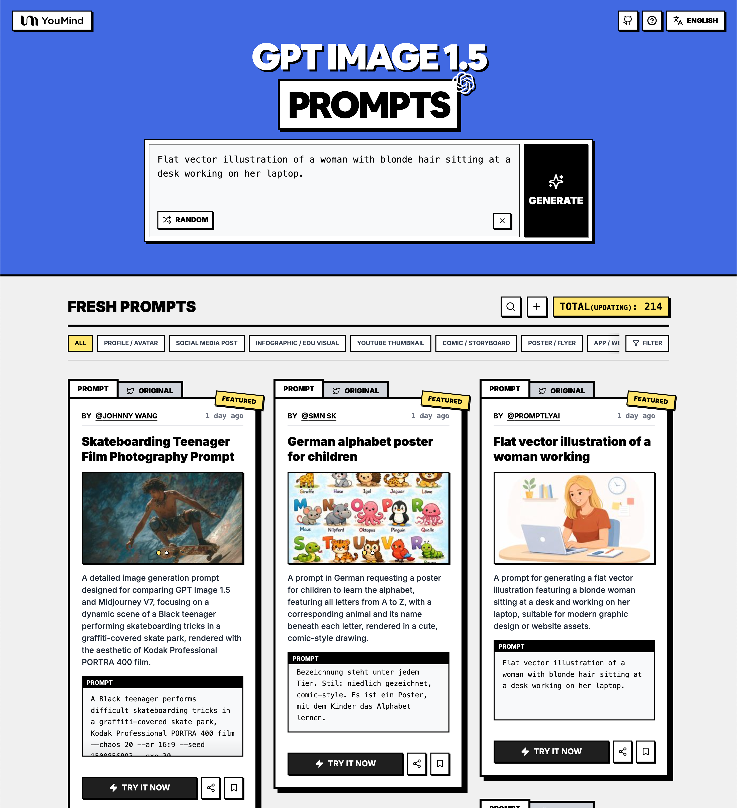

# 🚀 Prompts Increíbles de GPT Image 1.5

[](https://github.com/sindresorhus/awesome)
[](https://github.com/YouMind-OpenLab/awesome-gpt-image-1.5)
[](https://creativecommons.org/licenses/by/4.0/)
[](https://github.com/YouMind-OpenLab/awesome-gpt-image-1.5/actions)
[](docs/CONTRIBUTING.md)

> 🎨 Una colección curada de prompts creativos para GPT Image 1.5 de OpenAI

> 💡 **Note**: Si estás interesado en los prompts de Nano Banana Pro, no dudes en consultar nuestro otro repositorio: https://github.com/YouMind-OpenLab/awesome-nano-banana-pro-prompts

> ⚠️ **Aviso de derechos de autor**: Todos los prompts se recopilan de la comunidad con fines educativos. Si cree que algún contenido infringe sus derechos, por favor [abra un problema](https://github.com/YouMind-OpenLab/awesome-gpt-image-1.5/issues/new?template=bug-report.yml) y lo eliminaremos de inmediato.

---

[](README.md) [](README_zh.md) [](README_zh-TW.md) [](README_ja-JP.md) [](README_ko-KR.md) [](README_th-TH.md) [](README_vi-VN.md) [](README_hi-IN.md) [](README_es-ES.md) [-Click%20to%20View-lightgrey)](README_es-419.md) [](README_de-DE.md) [](README_fr-FR.md) [](README_it-IT.md) [-Click%20to%20View-lightgrey)](README_pt-BR.md) [](README_pt-PT.md) [](README_tr-TR.md)

---

## 🌐 Ver en la galería web

<div align="center">



</div>

**[👉 Explorar en la galería de prompts de YouMind GPT Image 1.5](https://youmind.com/es-ES/gpt-image-1-5-prompts)**

¿Por qué usar nuestra galería?

| Feature | GitHub README | Galería youmind.com |
|---------|--------------|---------------------|
| 🎨 Diseño visual | Lista lineal | Hermosa cuadrícula Masonry |
| 🔍 Buscar | Solo Ctrl+F | Búsqueda de texto completo con filtros |
| 🤖 Generación IA con un clic | - | Generación IA con un clic |
| 📱 Móvil | Básico | Totalmente responsive |

---

## 📖 Tabla de contenidos

- [🌐 Ver en la galería web](#-view-in-web-gallery)
- [🤔 ¿Qué es GPT Image 1.5?](#-what-is-gpt-image-15)
- [📊 Estadísticas](#-statistics)
- [🔥 Prompts destacados](#-featured-prompts)
- [📋 Todos los prompts](#-all-prompts)
- [🤝 Cómo contribuir](#-how-to-contribute)
- [📄 Licencia](#-license)
- [🙏 Agradecimientos](#-acknowledgements)
- [⭐ Historial de estrellas](#-star-history)

---

## 🤔 ¿Qué es GPT Image 1.5?

**GPT Image 1.5** es el modelo insignia de generación de imágenes de OpenAI con las siguientes características:

- 🎯 **Edición Precisa** - Cambia solo lo que pides mientras mantiene los detalles intactos
- 🎨 **4x Más Rápido** - Genera imágenes hasta 4 veces más rápido
- ⚡ **Múltiples Tipos de Edición** - Añadir, restar, combinar, mezclar, transponer
- 🌈 **Transformaciones Creativas** - Filtros estilísticos y transformaciones conceptuales
- 🔧 **Mejor Seguimiento de Instrucciones** - Ediciones más precisas y composiciones intrincadas
- 📐 **Calidad Mejorada** - Mejor renderizado de rostros pequeños y salidas naturales

📚 **Más información**: [Descripción general de GPT Image 1.5](https://youmind.com/gpt-image-1-5)

### 🚀 Integración con Raycast

Algunos prompts admiten **argumentos dinámicos** usando la sintaxis de [Raycast Snippets](https://raycast.com/help/snippets). ¡Busca la insignia 🚀 Raycast Friendly!

**Ejemplo:**
```
A quote card with "{argument name="quote" default="Stay hungry, stay foolish"}"
by {argument name="author" default="Steve Jobs"}
```

¡Cuando se usa en Raycast, puedes reemplazar dinámicamente los argumentos para iteraciones rápidas!

---

## 📊 Estadísticas

<div align="center">

| Métrica | Cantidad |
|--------|-------|
| 📝 Total de prompts | **261** |
| ⭐ Destacado | **3** |
| 🔄 Última actualización | **lunes, 13 de abril de 2026, 16:51:54 UTC** |

</div>

---

## 🔥 Prompts destacados

> ⭐ Seleccionados a mano por nuestro equipo por su calidad y creatividad excepcionales

### No. 1: Prompt de fotografía de película de un adolescente patinando


#### 📖 Descripción

Un *prompt* detallado de generación de imágenes diseñado para comparar GPT Image 1.5 y Midjourney V7, centrado en una escena dinámica de un adolescente negro realizando trucos de *skateboarding* en un *skate park* cubierto de grafitis, renderizado con la estética de la película Kodak Professional PORTRA 400.

#### 📝 Prompt

```
Un adolescente negro realiza trucos de skate difíciles en un skatepark cubierto de grafitis, película Kodak Professional PORTRA 400 --chaos 20 --ar 16:9 --seed 1500856893 --exp 30
```

#### 🖼️ Imágenes generadas

##### Image 1

<div align="center">

</div>

##### Image 2

<div align="center">

</div>

#### 📌 Detalles

- **Autor:** [Johnny Wang](https://x.com/JohnnyWang8802)
- **Fuente:** [Twitter Post](https://x.com/JohnnyWang8802/status/2001313619544604693)
- **Publicado:** 17 de diciembre de 2025
- **Idiomas:** en

**[👉 Pruébalo ahora →](https://youmind.com/es-ES/gpt-image-1-5?prompt=Un%20adolescente%20negro%20realiza%20trucos%20de%20skate%20dif%C3%ADciles%20en%20un%20skatepark%20cubierto%20de%20grafitis%2C%20pel%C3%ADcula%20Kodak%20Professional%20PORTRA%20400%20--chaos%2020%20--ar%2016%3A9%20--seed%201500856893%20--exp%2030)**

---

### No. 2: Póster del alfabeto alemán para niños


#### 📖 Descripción

Un *prompt* en alemán que solicita un póster para que los niños aprendan el alfabeto, con todas las letras de la A a la Z, con un animal correspondiente y su nombre debajo de cada letra, representado en un dibujo lindo y estilo cómic.

#### 📝 Prompt

```
Un póster con todas las letras del abecedario de la A a la Z. Debajo de cada letra hay un animal cuyo nombre comienza con esa letra. El nombre está escrito debajo de cada animal. Estilo: dibujos tiernos, estilo cómic. Es un póster que los niños pueden usar para aprender el abecedario.
```

#### 🖼️ Imágenes generadas

##### Image 1

<div align="center">

</div>

##### Image 2

<div align="center">

</div>

#### 📌 Detalles

- **Autor:** [smn Sk](https://x.com/smnSk241687)
- **Fuente:** [Twitter Post](https://x.com/smnSk241687/status/2001293727227105678)
- **Publicado:** 17 de diciembre de 2025
- **Idiomas:** en

**[👉 Pruébalo ahora →](https://youmind.com/es-ES/gpt-image-1-5?prompt=Un%20p%C3%B3ster%20con%20todas%20las%20letras%20del%20abecedario%20de%20la%20A%20a%20la%20Z.%20Debajo%20de%20cada%20letra%20hay%20un%20animal%20cuyo%20nombre%20comienza%20con%20esa%20letra.%20El%20nombre%20est%C3%A1%20escrito%20debajo%20de%20cada%20animal.%20Estilo%3A%20dibujos%20tiernos%2C%20estilo%20c%C3%B3mic.%20Es%20un%20p%C3%B3ster%20que%20los%20ni%C3%B1os%20pueden%20usar%20para%20aprender%20el%20abecedario.)**

---

### No. 3: Ilustración vectorial plana de una mujer trabajando


#### 📖 Descripción

Un prompt para generar una ilustración vectorial plana de una mujer rubia sentada en un escritorio y trabajando en su laptop, adecuada para diseño gráfico moderno o recursos de sitios web.

#### 📝 Prompt

```
Ilustración vectorial plana de una mujer rubia sentada en un escritorio trabajando en su laptop.
```

#### 🖼️ Imágenes generadas

##### Image 1

<div align="center">

</div>

#### 📌 Detalles

- **Autor:** [PromptlyAI](https://x.com/PromptlyAI_YT)
- **Fuente:** [Twitter Post](https://x.com/PromptlyAI_YT/status/2001303013567181294)
- **Publicado:** 17 de diciembre de 2025
- **Idiomas:** en

**[👉 Pruébalo ahora →](https://youmind.com/es-ES/gpt-image-1-5?prompt=Ilustraci%C3%B3n%20vectorial%20plana%20de%20una%20mujer%20rubia%20sentada%20en%20un%20escritorio%20trabajando%20en%20su%20laptop.)**

---

## 📋 Todos los prompts

> 📝 Ordenado por fecha de publicación (más reciente primero)

### No. 1: Generación de coronas navideñas


#### 📖 Descripción

Una instrucción sencilla utilizada para generar una imagen de una corona de Navidad adecuada para colgar en una puerta principal, mostrando una solicitud básica de generación de imágenes.

#### 📝 Prompt

```
Una corona de Navidad como esta se exhibió en la entrada.
```

#### 🖼️ Imágenes generadas

##### Image 1

<div align="center">

</div>

#### 📌 Detalles

- **Autor:** [カーブミラー](https://x.com/kabumira862571)
- **Fuente:** [Twitter Post](https://x.com/kabumira862571/status/2002524462739276233)
- **Publicado:** 20 de diciembre de 2025
- **Idiomas:** ja

**[👉 Pruébalo ahora →](https://youmind.com/es-ES/gpt-image-1-5?prompt=Una%20corona%20de%20Navidad%20como%20esta%20se%20exhibi%C3%B3%20en%20la%20entrada.)**

---

### No. 2: Retrato fotorrealista de cuerpo entero de una mujer en un entorno urbano


#### 📖 Descripción

Un prompt JSON muy detallado y estructurado para un retrato fotorrealista de cuerpo entero de una joven deslumbrante con un vestido tipo camiseta oversize y tacones de plataforma negros altos con cordones, ambientado en un interior industrial minimalista de hormigón con luz natural suave.

#### 📝 Prompt

```
{
  "prompt": "Retrato fotorrealista de cuerpo entero de una impresionante mujer joven con piel oliva besada por el sol, cabello largo y ondulado de color castaño oscuro cayendo sobre sus hombros, ojos grandes y expresivos de color oscuro con un delineado de ojos alado audaz, pestañas largas y labios rosados nude profundos y brillantes en un puchero seguro y ligeramente entreabierto. Lleva un delicado collar de oro con un pequeño colgante que descansa en su escote pronunciado. Viste un vestido camiseta marrón holgado de talla grande con mangas cortas, el dobladillo termina alto en sus muslos para revelar sus piernas tonificadas, la tela cae suavemente sobre sus curvas. Está descalza con los dedos de los pies perfectamente pedicurados. Pose: sentada en un banco de madera en un entorno industrial urbano, con las piernas elegantemente cruzadas, un brazo apoyado en el respaldo del banco, el otro relajado a su lado, la cabeza ligeramente inclinada con una mirada seductora directamente a la cámara. Lleva tacones de plataforma negros altos con cordones, puntera abierta y múltiples tiras que se envuelven alrededor de sus tobillos y pantorrillas. Fondo: interior minimalista de hormigón con grandes ventanales que dejan entrar una suave luz natural, creando cálidos reflejos dorados y sutiles sombras en su piel y en la tela texturizada de su vestido. Textura de piel ultradetallada con un brillo realista besado por el sol, intrincados detalles de las botas con cordones, enfoque nítido en el sujeto, profundidad de campo cinematográfica con un suave desenfoque del fondo, alto rango dinámico, resolución 8K, fotorrealismo, calidad de obra maestra."
}
```

#### 🖼️ Imágenes generadas

##### Image 1

<div align="center">

</div>

#### 📌 Detalles

- **Autor:** [KeorUnreal](https://x.com/KeorUnreal)
- **Fuente:** [Twitter Post](https://x.com/KeorUnreal/status/2002493715429175745)
- **Publicado:** 20 de diciembre de 2025
- **Idiomas:** en

**[👉 Pruébalo ahora →](https://youmind.com/es-ES/gpt-image-1-5?prompt=%7B%0A%20%20%22prompt%22%3A%20%22Retrato%20fotorrealista%20de%20cuerpo%20entero%20de%20una%20impresionante%20mujer%20joven%20con%20piel%20oliva%20besada%20por%20el%20sol%2C%20cabello%20largo%20y%20ondulado%20de%20color%20casta%C3%B1o%20oscuro%20cayendo%20sobre%20sus%20hombros%2C%20ojos%20grandes%20y%20expresivos%20de%20color%20oscuro%20con%20un%20delineado%20de%20ojos%20alado%20audaz%2C%20pesta%C3%B1as%20largas%20y%20labios%20rosados%20nude%20profundos%20y%20brillantes%20en%20un%20puchero%20seguro%20y%20ligeramente%20entreabierto.%20Lleva%20un%20delicado%20collar%20de%20oro%20con%20un%20peque%C3%B1o%20colgante%20que%20descansa%20en%20su%20escote%20pronunciado.%20Viste%20un%20vestido%20camiseta%20marr%C3%B3n%20holgado%20de%20talla%20grande%20con%20mangas%20cortas%2C%20el%20dobladillo%20termina%20alto%20en%20sus%20muslos%20para%20revelar%20sus%20piernas%20tonificadas%2C%20la%20tela%20cae%20suavemente%20sobre%20sus%20curvas.%20Est%C3%A1%20descalza%20con%20los%20dedos%20de%20los%20pies%20perfectamente%20pedicurados.%20Pose%3A%20sentada%20en%20un%20banco%20de%20madera%20en%20un%20entorno%20industrial%20urbano%2C%20con%20las%20piernas%20elegantemente%20cruzadas%2C%20un%20brazo%20apoyado%20en%20el%20respaldo%20del%20banco%2C%20el%20otro%20relajado%20a%20su%20lado%2C%20la%20cabeza%20ligeramente%20inclinada%20con%20una%20mirada%20seductora%20directamente%20a%20la%20c%C3%A1mara.%20Lleva%20tacones%20de%20plataforma%20negros%20altos%20con%20cordones%2C%20puntera%20abierta%20y%20m%C3%BAltiples%20tiras%20que%20se%20envuelven%20alrededor%20de%20sus%20tobillos%20y%20pantorrillas.%20Fondo%3A%20interior%20minimalista%20de%20hormig%C3%B3n%20con%20grandes%20ventanales%20que%20dejan%20entrar%20una%20suave%20luz%20natural%2C%20creando%20c%C3%A1lidos%20reflejos%20dorados%20y%20sutiles%20sombras%20en%20su%20piel%20y%20en%20la%20tela%20texturizada%20de%20su%20vestido.%20Textura%20de%20piel%20ultradetallada%20con%20un%20brillo%20realista%20besado%20por%20el%20sol%2C%20intrincados%20detalles%20de%20las%20botas%20con%20cordones%2C%20enfoque%20n%C3%ADtido%20en%20el%20sujeto%2C%20profundidad%20de%20campo%20cinematogr%C3%A1fica%20con%20un%20suave%20desenfoque%20del%20fondo%2C%20alto%20rango%20din%C3%A1mico%2C%20resoluci%C3%B3n%208K%2C%20fotorrealismo%2C%20calidad%20de%20obra%20maestra.%22%0A%7D)**

---

### No. 3: Selfie nocturno cinematográfico ultrarrealista en la calle durante una huida a alta velocidad


#### 📖 Descripción

Un *prompt* extremadamente detallado y estructurado para una *selfie* cinematográfica ultrarrealista. Especifica elementos complejos como la pose, rasgos faciales detallados (preservando la identidad), vestuario, entorno (ciudad nocturna lluviosa con una persecución policial), iluminación de alto contraste y estilo de cámara, lo que demuestra la precisión de GPT Image 1.5 en el manejo de datos visuales estructurados.

#### 📝 Prompt

```
"Selfie nocturno cinematográfico ultrarrealista en la calle con una persona segura y elegante de la foto de referencia asomándose por la ventanilla de un coche en una ciudad lluviosa durante una huida a alta velocidad.",

"pose": {

"brazo": "extendido hacia la cámara sosteniendo el teléfono",

"cabeza": "ligeramente inclinada hacia atrás",

"actitud": "audaz, juguetona"

},

"cara_y_piel": {

"identidad": "100% preservada, sin cambios en la estructura facial, proporciones o rasgos únicos",

"piel": "suave, luminosa con reflejos brillantes de la luz de la calle",

"pómulos": "suavemente esculpidos",

"labios": "brillantes",

"ojos": "expresivos, parcialmente ocultos detrás de gafas de sol rectangulares negras y estrechas",

"textura": "realista, textura de piel natural, poros visibles, reflejos"

},

"pelo": {

"estilo": "largo, suelto, agitado por la velocidad y el aire nocturno",

"volumen": "natural"

},

"atuendo_y_detalles": {

"abrigo": "de piel sintética con estampado de {argument name="coat pattern" default="leopardo"} audaz, cubriendo los hombros con lujo",

"manicura": "{argument name="manicure color" default="rojo"} brillante",

"joyas": "anillos plateados minimalistas",

"copa": "elegante copa de martini con un cóctel transparente y aceitunas verdes, capturando reflejos nítidos"

},

"entorno": {

"escenario": "calle nocturna de ciudad con asfalto mojado",

"movimiento": "intenso, a alta velocidad, con un coche de policía persiguiendo por detrás",

"luces": {

"faros": "borrosos, estelas de luz agresivas",

"luces_de_la_calle": "farolas de sodio doradas creando grandes círculos dramáticos de bokeh",

"luces_de_policía": "destellos de sirena azules y rojos creando reflejos"

},

"ambiente": "caos rebelde, juguetón, glamuroso; energía de vida nocturna llena de adrenalina",

"estética": "estilo editorial de moda criminal"

},

"iluminación": {

"contraste": "alto, mezcla dinámica de luces cálidas de sodio de la calle, luces azules frías de la policía y destellos de sirena rojos",

"reflejos": "brillantes en la piel, el cristal, la carrocería del coche y la calle empapada por la lluvia"

},

"cámara_y_estilo": {

"perspectiva": "selfie de smartphone de gran angular",

"profundidad_de_campo": "poca",

"fondo": "fuerte desenfoque de movimiento con estelas de luz",

"detalle": "grano de película ultrarrealista y de alta definición",

"gradación_de_color": "cinemática",

"ambiente": "fuga de lujo moderno"

},

"cuerpo": {

": {

"tamaño": "ligeramente más grande y alargado"

}

},

"ratio": "9:16"
```

#### 🖼️ Imágenes generadas

##### Image 1

<div align="center">

</div>

#### 📌 Detalles

- **Autor:** [K](https://x.com/ChillaiKalan__)
- **Fuente:** [Twitter Post](https://x.com/ChillaiKalan__/status/2002465016998735930)
- **Publicado:** 20 de diciembre de 2025
- **Idiomas:** en

**[👉 Pruébalo ahora →](https://youmind.com/es-ES/gpt-image-1-5?prompt=%22Selfie%20nocturno%20cinematogr%C3%A1fico%20ultrarrealista%20en%20la%20calle%20con%20una%20persona%20segura%20y%20elegante%20de%20la%20foto%20de%20referencia%20asom%C3%A1ndose%20por%20la%20ventanilla%20de%20un%20coche%20en%20una%20ciudad%20lluviosa%20durante%20una%20huida%20a%20alta%20velocidad.%22%2C%0A%0A%22pose%22%3A%20%7B%0A%0A%22brazo%22%3A%20%22extendido%20hacia%20la%20c%C3%A1mara%20sosteniendo%20el%20tel%C3%A9fono%22%2C%0A%0A%22cabeza%22%3A%20%22ligeramente%20inclinada%20hacia%20atr%C3%A1s%22%2C%0A%0A%22actitud%22%3A%20%22audaz%2C%20juguetona%22%0A%0A%7D%2C%0A%0A%22cara_y_piel%22%3A%20%7B%0A%0A%22identidad%22%3A%20%22100%25%20preservada%2C%20sin%20cambios%20en%20la%20estructura%20facial%2C%20proporciones%20o%20rasgos%20%C3%BAnicos%22%2C%0A%0A%22piel%22%3A%20%22suave%2C%20luminosa%20con%20reflejos%20brillantes%20de%20la%20luz%20de%20la%20calle%22%2C%0A%0A%22p%C3%B3mulos%22%3A%20%22suavemente%20esculpidos%22%2C%0A%0A%22labios%22%3A%20%22brillantes%22%2C%0A%0A%22ojos%22%3A%20%22expresivos%2C%20parcialmente%20ocultos%20detr%C3%A1s%20de%20gafas%20de%20sol%20rectangulares%20negras%20y%20estrechas%22%2C%0A%0A%22textura%22%3A%20%22realista%2C%20textura%20de%20piel%20natural%2C%20poros%20visibles%2C%20reflejos%22%0A%0A%7D%2C%0A%0A%22pelo%22%3A%20%7B%0A%0A%22estilo%22%3A%20%22largo%2C%20suelto%2C%20agitado%20por%20la%20velocidad%20y%20el%20aire%20nocturno%22%2C%0A%0A%22volumen%22%3A%20%22natural%22%0A%0A%7D%2C%0A%0A%22atuendo_y_detalles%22%3A%20%7B%0A%0A%22abrigo%22%3A%20%22de%20piel%20sint%C3%A9tica%20con%20estampado%20de%20%7Bargument%20name%3D%22coat%20pattern%22%20default%3D%22leopardo%22%7D%20audaz%2C%20cubriendo%20los%20hombros%20con%20lujo%22%2C%0A%0A%22manicura%22%3A%20%22%7Bargument%20name%3D%22manicure%20color%22%20default%3D%22rojo%22%7D%20brillante%22%2C%0A%0A%22joyas%22%3A%20%22anillos%20plateados%20minimalistas%22%2C%0A%0A%22copa%22%3A%20%22elegante%20copa%20de%20martini%20con%20un%20c%C3%B3ctel%20transparente%20y%20aceitunas%20verdes%2C%20capturando%20reflejos%20n%C3%ADtidos%22%0A%0A%7D%2C%0A%0A%22entorno%22%3A%20%7B%0A%0A%22escenario%22%3A%20%22calle%20nocturna%20de%20ciudad%20con%20asfalto%20mojado%22%2C%0A%0A%22movimiento%22%3A%20%22intenso%2C%20a%20alta%20velocidad%2C%20con%20un%20coche%20de%20polic%C3%ADa%20persiguiendo%20por%20detr%C3%A1s%22%2C%0A%0A%22luces%22%3A%20%7B%0A%0A%22faros%22%3A%20%22borrosos%2C%20estelas%20de%20luz%20agresivas%22%2C%0A%0A%22luces_de_la_calle%22%3A%20%22farolas%20de%20sodio%20doradas%20creando%20grandes%20c%C3%ADrculos%20dram%C3%A1ticos%20de%20bokeh%22%2C%0A%0A%22luces_de_polic%C3%ADa%22%3A%20%22destellos%20de%20sirena%20azules%20y%20rojos%20creando%20reflejos%22%0A%0A%7D%2C%0A%0A%22ambiente%22%3A%20%22caos%20rebelde%2C%20juguet%C3%B3n%2C%20glamuroso%3B%20energ%C3%ADa%20de%20vida%20nocturna%20llena%20de%20adrenalina%22%2C%0A%0A%22est%C3%A9tica%22%3A%20%22estilo%20editorial%20de%20moda%20criminal%22%0A%0A%7D%2C%0A%0A%22iluminaci%C3%B3n%22%3A%20%7B%0A%0A%22contraste%22%3A%20%22alto%2C%20mezcla%20din%C3%A1mica%20de%20luces%20c%C3%A1lidas%20de%20sodio%20de%20la%20calle%2C%20luces%20azules%20fr%C3%ADas%20de%20la%20polic%C3%ADa%20y%20destellos%20de%20sirena%20rojos%22%2C%0A%0A%22reflejos%22%3A%20%22brillantes%20en%20la%20piel%2C%20el%20cristal%2C%20la%20carrocer%C3%ADa%20del%20coche%20y%20la%20calle%20empapada%20por%20la%20lluvia%22%0A%0A%7D%2C%0A%0A%22c%C3%A1mara_y_estilo%22%3A%20%7B%0A%0A%22perspectiva%22%3A%20%22selfie%20de%20smartphone%20de%20gran%20angular%22%2C%0A%0A%22profundidad_de_campo%22%3A%20%22poca%22%2C%0A%0A%22fondo%22%3A%20%22fuerte%20desenfoque%20de%20movimiento%20con%20estelas%20de%20luz%22%2C%0A%0A%22detalle%22%3A%20%22grano%20de%20pel%C3%ADcula%20ultrarrealista%20y%20de%20alta%20definici%C3%B3n%22%2C%0A%0A%22gradaci%C3%B3n_de_color%22%3A%20%22cinem%C3%A1tica%22%2C%0A%0A%22ambiente%22%3A%20%22fuga%20de%20lujo%20moderno%22%0A%0A%7D%2C%0A%0A%22cuerpo%22%3A%20%7B%0A%0A%22%3A%20%7B%0A%0A%22tama%C3%B1o%22%3A%20%22ligeramente%20m%C3%A1s%20grande%20y%20alargado%22%0A%0A%7D%0A%0A%7D%2C%0A%0A%22ratio%22%3A%20%229%3A16%22)**

---

### No. 4: Recrear capturas de pantalla como videojuegos de próxima generación


#### 📖 Descripción

Un prompt simple utilizado para transformar una captura de pantalla o imagen subida en una escena de videojuego hiperrealista de próxima generación que se asemeja a una película.

#### 📝 Prompt

```
Recrea esta captura de pantalla como un videojuego de próxima generación, donde los juegos se han vuelto tan realistas que parecen películas.
```

#### 🖼️ Imágenes generadas

##### Image 1

<div align="center">

</div>

#### 📌 Detalles

- **Autor:** [𝓗𝓪𝓵𝓲𝓵 𝓚𝓮𝓶𝓪𝓵 𝓨𝓪𝓿𝓪𝓼𝓬𝓪](https://x.com/Dreammassacre)
- **Fuente:** [Twitter Post](https://x.com/Dreammassacre/status/2002463116664451089)
- **Publicado:** 20 de diciembre de 2025
- **Idiomas:** en

**[👉 Pruébalo ahora →](https://youmind.com/es-ES/gpt-image-1-5?prompt=Recrea%20esta%20captura%20de%20pantalla%20como%20un%20videojuego%20de%20pr%C3%B3xima%20generaci%C3%B3n%2C%20donde%20los%20juegos%20se%20han%20vuelto%20tan%20realistas%20que%20parecen%20pel%C3%ADculas.)**

---

### No. 5: Prompt JSON para recrear detalles de imagen


#### 📖 Descripción

Un *prompt* diseñado para generar una descripción JSON muy detallada de una imagen, capturando cada elemento visual. Esto es útil para crear *prompts* precisos de texto a imagen o para un análisis visual detallado.

#### 📝 Prompt

```
Escribe un *prompt* JSON que describa con exactitud cada detalle de la imagen.
```

#### 🖼️ Imágenes generadas

##### Image 1

<div align="center">

</div>

#### 📌 Detalles

- **Autor:** [Sura Baghirova](https://x.com/surasb11)
- **Fuente:** [Twitter Post](https://x.com/surasb11/status/2002458961564639473)
- **Publicado:** 20 de diciembre de 2025
- **Idiomas:** en

**[👉 Pruébalo ahora →](https://youmind.com/es-ES/gpt-image-1-5?prompt=Escribe%20un%20*prompt*%20JSON%20que%20describa%20con%20exactitud%20cada%20detalle%20de%20la%20imagen.)**

---

### No. 6: Grok: Imagina un prompt basado en una foto


#### 📖 Descripción

Esta entrada indica que se creó una imagen específica utilizando una foto como referencia combinada con un *prompt* de Grok Imagine. El *prompt* en sí no se proporciona, pero la estructura implica un flujo de trabajo de imagen a imagen o de referencia visual.

#### 📝 Prompt

```
esta foto + prompt de Grok Imagine
```

#### 🖼️ Imágenes generadas

##### Image 1

<div align="center">

</div>

#### 📌 Detalles

- **Autor:** [Five](https://x.com/Five69)
- **Fuente:** [Twitter Post](https://x.com/Five69/status/2002451024922231197)
- **Publicado:** 20 de diciembre de 2025
- **Idiomas:** en

**[👉 Pruébalo ahora →](https://youmind.com/es-ES/gpt-image-1-5?prompt=esta%20foto%20%2B%20prompt%20de%20Grok%20Imagine)**

---

### No. 7: Serie de fotos de estilo de vida cinematográfico y acogedor de una mujer en una cocina soleada


#### 📖 Descripción

Un *prompt* detallado y estructurado para generar una cuadrícula de múltiples fotogramas de fotos de estilo de vida cinematográficas. Se centra en una mujer joven que disfruta de un momento de té tranquilo en una cocina cálida y soleada, enfatizando ángulos de cámara específicos (primeros planos, sobre el hombro, de arriba hacia abajo), iluminación, textura y un ambiente editorial y pacífico. Esto demuestra la capacidad de GPT Image 1.5 para manejar instrucciones complejas de múltiples tomas.

#### 📝 Prompt

```
Una acogedora serie de fotos de estilo cinematográfico, capturada como una cuadrícula de múltiples fotogramas, que muestra a una mujer joven en una cálida cocina bañada por el sol durante un tranquilo momento de té. Viste un suave vestido sin mangas de color {argument name="dress color" default="rosa palo"}, sentada en una pequeña mesa redonda de madera junto a una ventana. La luz natural de la mañana entra a raudales, creando suaves reflejos y sombras tenues. La secuencia incluye primeros planos de ella sorbiendo té de una delicada taza floral, tomas por encima del hombro durante una conversación tranquila, vistas cenitales del juego de té sobre un mantel individual tejido, perfiles laterales y sutiles expresiones espontáneas. Cocina de tonos crema neutros con utensilios de cobre colgando al fondo. Ambiente íntimo y tranquilo, poca profundidad de campo, suavidad similar a la de una película, estilo narrativo editorial, textura de piel realista, gradación de color cálida, composición minimalista, realismo cinematográfico de alto detalle.
```

#### 🖼️ Imágenes generadas

##### Image 1

<div align="center">

</div>

#### 📌 Detalles

- **Autor:** [Smiling Khan](https://x.com/AIwithkhan)
- **Fuente:** [Twitter Post](https://x.com/AIwithkhan/status/2002450998208704590)
- **Publicado:** 20 de diciembre de 2025
- **Idiomas:** en

**[👉 Pruébalo ahora →](https://youmind.com/es-ES/gpt-image-1-5?prompt=Una%20acogedora%20serie%20de%20fotos%20de%20estilo%20cinematogr%C3%A1fico%2C%20capturada%20como%20una%20cuadr%C3%ADcula%20de%20m%C3%BAltiples%20fotogramas%2C%20que%20muestra%20a%20una%20mujer%20joven%20en%20una%20c%C3%A1lida%20cocina%20ba%C3%B1ada%20por%20el%20sol%20durante%20un%20tranquilo%20momento%20de%20t%C3%A9.%20Viste%20un%20suave%20vestido%20sin%20mangas%20de%20color%20%7Bargument%20name%3D%22dress%20color%22%20default%3D%22rosa%20palo%22%7D%2C%20sentada%20en%20una%20peque%C3%B1a%20mesa%20redonda%20de%20madera%20junto%20a%20una%20ventana.%20La%20luz%20natural%20de%20la%20ma%C3%B1ana%20entra%20a%20raudales%2C%20creando%20suaves%20reflejos%20y%20sombras%20tenues.%20La%20secuencia%20incluye%20primeros%20planos%20de%20ella%20sorbiendo%20t%C3%A9%20de%20una%20delicada%20taza%20floral%2C%20tomas%20por%20encima%20del%20hombro%20durante%20una%20conversaci%C3%B3n%20tranquila%2C%20vistas%20cenitales%20del%20juego%20de%20t%C3%A9%20sobre%20un%20mantel%20individual%20tejido%2C%20perfiles%20laterales%20y%20sutiles%20expresiones%20espont%C3%A1neas.%20Cocina%20de%20tonos%20crema%20neutros%20con%20utensilios%20de%20cobre%20colgando%20al%20fondo.%20Ambiente%20%C3%ADntimo%20y%20tranquilo%2C%20poca%20profundidad%20de%20campo%2C%20suavidad%20similar%20a%20la%20de%20una%20pel%C3%ADcula%2C%20estilo%20narrativo%20editorial%2C%20textura%20de%20piel%20realista%2C%20gradaci%C3%B3n%20de%20color%20c%C3%A1lida%2C%20composici%C3%B3n%20minimalista%2C%20realismo%20cinematogr%C3%A1fico%20de%20alto%20detalle.)**

---

### No. 8: Chihuahua fotorrealista estructurado en balcón (Duplicado)


#### 📖 Descripción

Un *prompt* JSON altamente estructurado que detalla cada aspecto de una imagen fotorrealista: un chihuahua pequeño de pelo largo tumbado en un cojín de salón en un balcón exterior, con detalles específicos sobre el pelaje, la iluminación, los elementos de fondo (bahía, barcos, perfil urbano) y la composición. Se trata de un duplicado de un *prompt* encontrado en otro tuit.

#### 📝 Prompt

```
{
  "type": "image_prompt",
  "format": "photorealistic",
  "aspect_ratio": "1536:1358",
  "scene": {
    "setting": "balcón/terraza exterior con barandilla de cristal",
    "time_of_day": "día",
    "weather": "despejado",
    "foreground_surface": "gran cojín rectangular de salón con la parte superior de color beige claro/crema, paneles laterales grises y costuras ribeteadas visibles"
  },
  "subject": {
    "primary_subject": "chihuahua pequeño de pelo largo",
    "pose": "tumbado en el cojín con las patas delanteras hacia adelante, cuerpo relajado, cabeza ligeramente levantada",
    "expression": "tranquilo, entrecerrando ligeramente los ojos por el sol brillante",
    "fur": {
      "color": "marrón dorado cálido/bronceado con reflejos crema más claros",
      "texture": "pelaje largo y esponjoso con mechones finos alrededor de las orejas y el cuello",
      "markings": "hocico y barbilla ligeramente más grises; pelaje más claro en las patas/dedos"
    },
    "features": {
      "ears": "orejas grandes y erguidas con pelaje plumoso",
      "eyes": "marrón oscuro, brillantes",
      "nose": "nariz pequeña y negra"
    }
  },
  "background": {
    "midground": "agua azul tranquila (bahía/puerto) con una orilla/isla arbolada",
    "distant_elements": [
      "múltiples grandes cruceros blancos",
      "grúas portuarias/estructuras industriales a la izquierda",
      "horizonte brumoso de la ciudad con edificios de gran altura a la derecha"
    ],
    "structure": "un pilar de balcón vertical blanco centrado detrás del perro",
    "depth_of_field": "el fondo notablemente borroso/suave en comparación con el perro"
  },
  "lighting": {
    "type": "luz solar natural intensa",
    "direction": "desde la izquierda/frente-izquierda",
    "effects": [
      "reflejos brillantes en el pelaje del perro",
      "sombras suaves y una sombra diagonal a través del cojín"
    ]
  },
  "composition": {
    "framing": "primer plano medio con el perro ocupando la mitad derecha del encuadre",
    "focus": "enfoque nítido en el perro; fondo desenfocado",
    "camera_angle": "a la altura de los ojos/ligeramente por encima del perro",
    "mood": "cálido, tranquilo, tomando el sol"
  },
  "color_palette": [
    "bronceado dorado",
    "crema/beige",
    "azul frío",
    "gris suave",
    "blanco"
  ],
  "prompt": "Una escena fotorrealista de balcón durante el día: un chihuahua pequeño de pelo largo con pelaje marrón dorado cálido/bronceado y reflejos crema más claros yace relajado sobre un gran cojín rectangular de salón (parte superior beige claro/crema con lados grises y costuras ribeteadas). El perro mira ligeramente a la izquierda, con la cabeza levantada, expresión tranquila con ojos oscuros ligeramente entrecerrados, orejas plumosas erguidas, nariz pequeña y negra, y un hocico sutilmente más gris; patas delanteras hacia adelante con pelaje más claro en los dedos. La fuerte luz solar natural desde la izquierda crea reflejos brillantes en el pelaje y sombras suaves a través del cojín. Detrás del perro hay una barandilla de balcón de cristal, un pilar vertical blanco centrado en el fondo, y una vista suave y desenfocada de una bahía/puerto azul con una orilla arbolada, varios grandes cruceros blancos, grúas portuarias en la distancia y un horizonte brumoso de la ciudad con edificios de gran altura a la derecha. Poca profundidad de campo, enfoque nítido en el"
}
```

#### 🖼️ Imágenes generadas

##### Image 1

<div align="center">

</div>

#### 📌 Detalles

- **Autor:** [Sura Baghirova](https://x.com/surasb11)
- **Fuente:** [Twitter Post](https://x.com/surasb11/status/2002442613660463238)
- **Publicado:** 20 de diciembre de 2025
- **Idiomas:** en

**[👉 Pruébalo ahora →](https://youmind.com/es-ES/gpt-image-1-5?prompt=%7B%0A%20%20%22type%22%3A%20%22image_prompt%22%2C%0A%20%20%22format%22%3A%20%22photorealistic%22%2C%0A%20%20%22aspect_ratio%22%3A%20%221536%3A1358%22%2C%0A%20%20%22scene%22%3A%20%7B%0A%20%20%20%20%22setting%22%3A%20%22balc%C3%B3n%2Fterraza%20exterior%20con%20barandilla%20de%20cristal%22%2C%0A%20%20%20%20%22time_of_day%22%3A%20%22d%C3%ADa%22%2C%0A%20%20%20%20%22weather%22%3A%20%22despejado%22%2C%0A%20%20%20%20%22foreground_surface%22%3A%20%22gran%20coj%C3%ADn%20rectangular%20de%20sal%C3%B3n%20con%20la%20parte%20superior%20de%20color%20beige%20claro%2Fcrema%2C%20paneles%20laterales%20grises%20y%20costuras%20ribeteadas%20visibles%22%0A%20%20%7D%2C%0A%20%20%22subject%22%3A%20%7B%0A%20%20%20%20%22primary_subject%22%3A%20%22chihuahua%20peque%C3%B1o%20de%20pelo%20largo%22%2C%0A%20%20%20%20%22pose%22%3A%20%22tumbado%20en%20el%20coj%C3%ADn%20con%20las%20patas%20delanteras%20hacia%20adelante%2C%20cuerpo%20relajado%2C%20cabeza%20ligeramente%20levantada%22%2C%0A%20%20%20%20%22expression%22%3A%20%22tranquilo%2C%20entrecerrando%20ligeramente%20los%20ojos%20por%20el%20sol%20brillante%22%2C%0A%20%20%20%20%22fur%22%3A%20%7B%0A%20%20%20%20%20%20%22color%22%3A%20%22marr%C3%B3n%20dorado%20c%C3%A1lido%2Fbronceado%20con%20reflejos%20crema%20m%C3%A1s%20claros%22%2C%0A%20%20%20%20%20%20%22texture%22%3A%20%22pelaje%20largo%20y%20esponjoso%20con%20mechones%20finos%20alrededor%20de%20las%20orejas%20y%20el%20cuello%22%2C%0A%20%20%20%20%20%20%22markings%22%3A%20%22hocico%20y%20barbilla%20ligeramente%20m%C3%A1s%20grises%3B%20pelaje%20m%C3%A1s%20claro%20en%20las%20patas%2Fdedos%22%0A%20%20%20%20%7D%2C%0A%20%20%20%20%22features%22%3A%20%7B%0A%20%20%20%20%20%20%22ears%22%3A%20%22orejas%20grandes%20y%20erguidas%20con%20pelaje%20plumoso%22%2C%0A%20%20%20%20%20%20%22eyes%22%3A%20%22marr%C3%B3n%20oscuro%2C%20brillantes%22%2C%0A%20%20%20%20%20%20%22nose%22%3A%20%22nariz%20peque%C3%B1a%20y%20negra%22%0A%20%20%20%20%7D%0A%20%20%7D%2C%0A%20%20%22background%22%3A%20%7B%0A%20%20%20%20%22midground%22%3A%20%22agua%20azul%20tranquila%20(bah%C3%ADa%2Fpuerto)%20con%20una%20orilla%2Fisla%20arbolada%22%2C%0A%20%20%20%20%22distant_elements%22%3A%20%5B%0A%20%20%20%20%20%20%22m%C3%BAltiples%20grandes%20cruceros%20blancos%22%2C%0A%20%20%20%20%20%20%22gr%C3%BAas%20portuarias%2Festructuras%20industriales%20a%20la%20izquierda%22%2C%0A%20%20%20%20%20%20%22horizonte%20brumoso%20de%20la%20ciudad%20con%20edificios%20de%20gran%20altura%20a%20la%20derecha%22%0A%20%20%20%20%5D%2C%0A%20%20%20%20%22structure%22%3A%20%22un%20pilar%20de%20balc%C3%B3n%20vertical%20blanco%20centrado%20detr%C3%A1s%20del%20perro%22%2C%0A%20%20%20%20%22depth_of_field%22%3A%20%22el%20fondo%20notablemente%20borroso%2Fsuave%20en%20comparaci%C3%B3n%20con%20el%20perro%22%0A%20%20%7D%2C%0A%20%20%22lighting%22%3A%20%7B%0A%20%20%20%20%22type%22%3A%20%22luz%20solar%20natural%20intensa%22%2C%0A%20%20%20%20%22direction%22%3A%20%22desde%20la%20izquierda%2Ffrente-izquierda%22%2C%0A%20%20%20%20%22effects%22%3A%20%5B%0A%20%20%20%20%20%20%22reflejos%20brillantes%20en%20el%20pelaje%20del%20perro%22%2C%0A%20%20%20%20%20%20%22sombras%20suaves%20y%20una%20sombra%20diagonal%20a%20trav%C3%A9s%20del%20coj%C3%ADn%22%0A%20%20%20%20%5D%0A%20%20%7D%2C%0A%20%20%22composition%22%3A%20%7B%0A%20%20%20%20%22framing%22%3A%20%22primer%20plano%20medio%20con%20el%20perro%20ocupando%20la%20mitad%20derecha%20del%20encuadre%22%2C%0A%20%20%20%20%22focus%22%3A%20%22enfoque%20n%C3%ADtido%20en%20el%20perro%3B%20fondo%20desenfocado%22%2C%0A%20%20%20%20%22camera_angle%22%3A%20%22a%20la%20altura%20de%20los%20ojos%2Fligeramente%20por%20encima%20del%20perro%22%2C%0A%20%20%20%20%22mood%22%3A%20%22c%C3%A1lido%2C%20tranquilo%2C%20tomando%20el%20sol%22%0A%20%20%7D%2C%0A%20%20%22color_palette%22%3A%20%5B%0A%20%20%20%20%22bronceado%20dorado%22%2C%0A%20%20%20%20%22crema%2Fbeige%22%2C%0A%20%20%20%20%22azul%20fr%C3%ADo%22%2C%0A%20%20%20%20%22gris%20suave%22%2C%0A%20%20%20%20%22blanco%22%0A%20%20%5D%2C%0A%20%20%22prompt%22%3A%20%22Una%20escena%20fotorrealista%20de%20balc%C3%B3n%20durante%20el%20d%C3%ADa%3A%20un%20chihuahua%20peque%C3%B1o%20de%20pelo%20largo%20con%20pelaje%20marr%C3%B3n%20dorado%20c%C3%A1lido%2Fbronceado%20y%20reflejos%20crema%20m%C3%A1s%20claros%20yace%20relajado%20sobre%20un%20gran%20coj%C3%ADn%20rectangular%20de%20sal%C3%B3n%20(parte%20superior%20beige%20claro%2Fcrema%20con%20lados%20grises%20y%20costuras%20ribeteadas).%20El%20perro%20mira%20ligeramente%20a%20la%20izquierda%2C%20con%20la%20cabeza%20levantada%2C%20expresi%C3%B3n%20tranquila%20con%20ojos%20oscuros%20ligeramente%20entrecerrados%2C%20orejas%20plumosas%20erguidas%2C%20nariz%20peque%C3%B1a%20y%20negra%2C%20y%20un%20hocico%20sutilmente%20m%C3%A1s%20gris%3B%20patas%20delanteras%20hacia%20adelante%20con%20pelaje%20m%C3%A1s%20claro%20en%20los%20dedos.%20La%20fuerte%20luz%20solar%20natural%20desde%20la%20izquierda%20crea%20reflejos%20brillantes%20en%20el%20pelaje%20y%20sombras%20suaves%20a%20trav%C3%A9s%20del%20coj%C3%ADn.%20Detr%C3%A1s%20del%20perro%20hay%20una%20barandilla%20de%20balc%C3%B3n%20de%20cristal%2C%20un%20pilar%20vertical%20blanco%20centrado%20en%20el%20fondo%2C%20y%20una%20vista%20suave%20y%20desenfocada%20de%20una%20bah%C3%ADa%2Fpuerto%20azul%20con%20una%20orilla%20arbolada%2C%20varios%20grandes%20cruceros%20blancos%2C%20gr%C3%BAas%20portuarias%20en%20la%20distancia%20y%20un%20horizonte%20brumoso%20de%20la%20ciudad%20con%20edificios%20de%20gran%20altura%20a%20la%20derecha.%20Poca%20profundidad%20de%20campo%2C%20enfoque%20n%C3%ADtido%20en%20el%22%0A%7D)**

---

### No. 9: Chihuahua fotorrealista estructurado en balcón


#### 📖 Descripción

Un prompt en formato JSON altamente estructurado que detalla cada aspecto de una imagen fotorrealista: un chihuahua pequeño de pelo largo tumbado en un cojín de salón en un balcón exterior, con detalles específicos sobre el pelaje, la iluminación, los elementos del fondo (bahía, barcos, horizonte de la ciudad) y la composición.

#### 📝 Prompt

```
{
  "type": "image_prompt",
  "format": "photorealistic",
  "aspect_ratio": "1536:1358",
  "scene": {
    "setting": "balcón/terraza exterior con barandilla de cristal",
    "time_of_day": "día",
    "weather": "despejado",
    "foreground_surface": "gran cojín rectangular de salón con la parte superior de color beige claro/crema, paneles laterales grises y costuras ribeteadas visibles"
  },
  "subject": {
    "primary_subject": "chihuahua pequeño de pelo largo",
    "pose": "tumbado en el cojín con las patas delanteras hacia adelante, cuerpo relajado, cabeza ligeramente levantada",
    "expression": "tranquilo, entrecerrando ligeramente los ojos por el sol brillante",
    "fur": {
      "color": "marrón dorado cálido/canela con reflejos crema más claros",
      "texture": "pelaje largo y esponjoso con mechones finos alrededor de las orejas y el cuello",
      "markings": "hocico y barbilla ligeramente más grises; pelaje más claro en las patas/dedos"
    },
    "features": {
      "ears": "orejas grandes y erguidas con pelo plumoso",
      "eyes": "marrón oscuro, brillantes",
      "nose": "nariz pequeña y negra"
    }
  },
  "background": {
    "midground": "agua azul tranquila (bahía/puerto) con una costa/isla arbolada",
    "distant_elements": [
      "múltiples grandes cruceros blancos",
      "grúas portuarias/estructuras industriales a la izquierda",
      "horizonte brumoso de la ciudad con edificios de gran altura a la derecha"
    ],
    "structure": "un pilar de balcón vertical blanco centrado detrás del perro",
    "depth_of_field": "fondo notablemente borroso/suave en comparación con el perro"
  },
  "lighting": {
    "type": "luz solar natural intensa",
    "direction": "desde la izquierda/frontal-izquierda",
    "effects": [
      "brillantes reflejos en el pelaje del perro",
      "sombras suaves y una sombra diagonal a través del cojín"
    ]
  },
  "composition": {
    "framing": "primer plano medio con el perro ocupando la mitad derecha del encuadre",
    "focus": "enfoque nítido en el perro; fondo desenfocado",
    "camera_angle": "a la altura de los ojos/ligeramente por encima del perro",
    "mood": "cálido, tranquilo, tomando el sol"
  },
  "color_palette": [
    "canela dorado",
    "crema/beige",
    "azul frío",
    "gris suave",
    "blanco"
  ],
  "prompt": "Una escena fotorrealista de un balcón durante el día: un chihuahua pequeño de pelo largo con pelaje marrón dorado cálido/canela y reflejos crema más claros yace relajado sobre un gran cojín rectangular de salón (parte superior beige claro/crema con lados grises y costuras ribeteadas). El perro mira ligeramente a la izquierda, con la cabeza levantada, expresión tranquila con ojos oscuros ligeramente entrecerrados, orejas plumosas erguidas, nariz pequeña y negra, y un hocico sutilmente más gris; patas delanteras hacia adelante con pelaje más claro en los dedos. La fuerte luz solar natural desde la izquierda crea brillantes reflejos en el pelaje y sombras suaves a través del cojín. Detrás del perro hay una barandilla de cristal del balcón, un pilar vertical blanco centrado en el fondo, y una vista suave y desenfocada de una bahía/puerto azul con una costa arbolada, varios grandes cruceros blancos, grúas portuarias en la distancia y un horizonte brumoso de la ciudad con edificios de gran altura a la derecha. Poca profundidad de campo, enfoque nítido en el perro, fondo"
}
```

#### 🖼️ Imágenes generadas

##### Image 1

<div align="center">

</div>

#### 📌 Detalles

- **Autor:** [Sura Baghirova](https://x.com/surasb11)
- **Fuente:** [Twitter Post](https://x.com/surasb11/status/2002417155225141446)
- **Publicado:** 20 de diciembre de 2025
- **Idiomas:** en

**[👉 Pruébalo ahora →](https://youmind.com/es-ES/gpt-image-1-5?prompt=%7B%0A%20%20%22type%22%3A%20%22image_prompt%22%2C%0A%20%20%22format%22%3A%20%22photorealistic%22%2C%0A%20%20%22aspect_ratio%22%3A%20%221536%3A1358%22%2C%0A%20%20%22scene%22%3A%20%7B%0A%20%20%20%20%22setting%22%3A%20%22balc%C3%B3n%2Fterraza%20exterior%20con%20barandilla%20de%20cristal%22%2C%0A%20%20%20%20%22time_of_day%22%3A%20%22d%C3%ADa%22%2C%0A%20%20%20%20%22weather%22%3A%20%22despejado%22%2C%0A%20%20%20%20%22foreground_surface%22%3A%20%22gran%20coj%C3%ADn%20rectangular%20de%20sal%C3%B3n%20con%20la%20parte%20superior%20de%20color%20beige%20claro%2Fcrema%2C%20paneles%20laterales%20grises%20y%20costuras%20ribeteadas%20visibles%22%0A%20%20%7D%2C%0A%20%20%22subject%22%3A%20%7B%0A%20%20%20%20%22primary_subject%22%3A%20%22chihuahua%20peque%C3%B1o%20de%20pelo%20largo%22%2C%0A%20%20%20%20%22pose%22%3A%20%22tumbado%20en%20el%20coj%C3%ADn%20con%20las%20patas%20delanteras%20hacia%20adelante%2C%20cuerpo%20relajado%2C%20cabeza%20ligeramente%20levantada%22%2C%0A%20%20%20%20%22expression%22%3A%20%22tranquilo%2C%20entrecerrando%20ligeramente%20los%20ojos%20por%20el%20sol%20brillante%22%2C%0A%20%20%20%20%22fur%22%3A%20%7B%0A%20%20%20%20%20%20%22color%22%3A%20%22marr%C3%B3n%20dorado%20c%C3%A1lido%2Fcanela%20con%20reflejos%20crema%20m%C3%A1s%20claros%22%2C%0A%20%20%20%20%20%20%22texture%22%3A%20%22pelaje%20largo%20y%20esponjoso%20con%20mechones%20finos%20alrededor%20de%20las%20orejas%20y%20el%20cuello%22%2C%0A%20%20%20%20%20%20%22markings%22%3A%20%22hocico%20y%20barbilla%20ligeramente%20m%C3%A1s%20grises%3B%20pelaje%20m%C3%A1s%20claro%20en%20las%20patas%2Fdedos%22%0A%20%20%20%20%7D%2C%0A%20%20%20%20%22features%22%3A%20%7B%0A%20%20%20%20%20%20%22ears%22%3A%20%22orejas%20grandes%20y%20erguidas%20con%20pelo%20plumoso%22%2C%0A%20%20%20%20%20%20%22eyes%22%3A%20%22marr%C3%B3n%20oscuro%2C%20brillantes%22%2C%0A%20%20%20%20%20%20%22nose%22%3A%20%22nariz%20peque%C3%B1a%20y%20negra%22%0A%20%20%20%20%7D%0A%20%20%7D%2C%0A%20%20%22background%22%3A%20%7B%0A%20%20%20%20%22midground%22%3A%20%22agua%20azul%20tranquila%20(bah%C3%ADa%2Fpuerto)%20con%20una%20costa%2Fisla%20arbolada%22%2C%0A%20%20%20%20%22distant_elements%22%3A%20%5B%0A%20%20%20%20%20%20%22m%C3%BAltiples%20grandes%20cruceros%20blancos%22%2C%0A%20%20%20%20%20%20%22gr%C3%BAas%20portuarias%2Festructuras%20industriales%20a%20la%20izquierda%22%2C%0A%20%20%20%20%20%20%22horizonte%20brumoso%20de%20la%20ciudad%20con%20edificios%20de%20gran%20altura%20a%20la%20derecha%22%0A%20%20%20%20%5D%2C%0A%20%20%20%20%22structure%22%3A%20%22un%20pilar%20de%20balc%C3%B3n%20vertical%20blanco%20centrado%20detr%C3%A1s%20del%20perro%22%2C%0A%20%20%20%20%22depth_of_field%22%3A%20%22fondo%20notablemente%20borroso%2Fsuave%20en%20comparaci%C3%B3n%20con%20el%20perro%22%0A%20%20%7D%2C%0A%20%20%22lighting%22%3A%20%7B%0A%20%20%20%20%22type%22%3A%20%22luz%20solar%20natural%20intensa%22%2C%0A%20%20%20%20%22direction%22%3A%20%22desde%20la%20izquierda%2Ffrontal-izquierda%22%2C%0A%20%20%20%20%22effects%22%3A%20%5B%0A%20%20%20%20%20%20%22brillantes%20reflejos%20en%20el%20pelaje%20del%20perro%22%2C%0A%20%20%20%20%20%20%22sombras%20suaves%20y%20una%20sombra%20diagonal%20a%20trav%C3%A9s%20del%20coj%C3%ADn%22%0A%20%20%20%20%5D%0A%20%20%7D%2C%0A%20%20%22composition%22%3A%20%7B%0A%20%20%20%20%22framing%22%3A%20%22primer%20plano%20medio%20con%20el%20perro%20ocupando%20la%20mitad%20derecha%20del%20encuadre%22%2C%0A%20%20%20%20%22focus%22%3A%20%22enfoque%20n%C3%ADtido%20en%20el%20perro%3B%20fondo%20desenfocado%22%2C%0A%20%20%20%20%22camera_angle%22%3A%20%22a%20la%20altura%20de%20los%20ojos%2Fligeramente%20por%20encima%20del%20perro%22%2C%0A%20%20%20%20%22mood%22%3A%20%22c%C3%A1lido%2C%20tranquilo%2C%20tomando%20el%20sol%22%0A%20%20%7D%2C%0A%20%20%22color_palette%22%3A%20%5B%0A%20%20%20%20%22canela%20dorado%22%2C%0A%20%20%20%20%22crema%2Fbeige%22%2C%0A%20%20%20%20%22azul%20fr%C3%ADo%22%2C%0A%20%20%20%20%22gris%20suave%22%2C%0A%20%20%20%20%22blanco%22%0A%20%20%5D%2C%0A%20%20%22prompt%22%3A%20%22Una%20escena%20fotorrealista%20de%20un%20balc%C3%B3n%20durante%20el%20d%C3%ADa%3A%20un%20chihuahua%20peque%C3%B1o%20de%20pelo%20largo%20con%20pelaje%20marr%C3%B3n%20dorado%20c%C3%A1lido%2Fcanela%20y%20reflejos%20crema%20m%C3%A1s%20claros%20yace%20relajado%20sobre%20un%20gran%20coj%C3%ADn%20rectangular%20de%20sal%C3%B3n%20(parte%20superior%20beige%20claro%2Fcrema%20con%20lados%20grises%20y%20costuras%20ribeteadas).%20El%20perro%20mira%20ligeramente%20a%20la%20izquierda%2C%20con%20la%20cabeza%20levantada%2C%20expresi%C3%B3n%20tranquila%20con%20ojos%20oscuros%20ligeramente%20entrecerrados%2C%20orejas%20plumosas%20erguidas%2C%20nariz%20peque%C3%B1a%20y%20negra%2C%20y%20un%20hocico%20sutilmente%20m%C3%A1s%20gris%3B%20patas%20delanteras%20hacia%20adelante%20con%20pelaje%20m%C3%A1s%20claro%20en%20los%20dedos.%20La%20fuerte%20luz%20solar%20natural%20desde%20la%20izquierda%20crea%20brillantes%20reflejos%20en%20el%20pelaje%20y%20sombras%20suaves%20a%20trav%C3%A9s%20del%20coj%C3%ADn.%20Detr%C3%A1s%20del%20perro%20hay%20una%20barandilla%20de%20cristal%20del%20balc%C3%B3n%2C%20un%20pilar%20vertical%20blanco%20centrado%20en%20el%20fondo%2C%20y%20una%20vista%20suave%20y%20desenfocada%20de%20una%20bah%C3%ADa%2Fpuerto%20azul%20con%20una%20costa%20arbolada%2C%20varios%20grandes%20cruceros%20blancos%2C%20gr%C3%BAas%20portuarias%20en%20la%20distancia%20y%20un%20horizonte%20brumoso%20de%20la%20ciudad%20con%20edificios%20de%20gran%20altura%20a%20la%20derecha.%20Poca%20profundidad%20de%20campo%2C%20enfoque%20n%C3%ADtido%20en%20el%20perro%2C%20fondo%22%0A%7D)**

---

### No. 10: Diorama surrealista de "Un mundo feliz"


#### 📖 Descripción

Un *prompt* para generar un diorama de escultura en miniatura hiperdetallado y fotorrealista que emerge de un libro *vintage* abierto, representando un laboratorio de incubación futurista clínico e inquietante inspirado en "Un mundo feliz" de Aldous Huxley.

#### 📝 Prompt

```
Diorama surrealista emergiendo de un libro vintage abierto de "{argument name="book title" default="Un mundo feliz"}" de {argument name="author" default="Aldous Huxley"}: las páginas forman un laboratorio de incubación futurista con filas de tubos de ensayo luminosos que contienen figuras embrionarias en cintas transportadoras, trabajadores con batas de laboratorio y uniformes blancos operando máquinas, un gran símbolo de ojo que todo lo ve en la pared, cintas transportadoras moviéndose a través de mecanismos ocultos, iluminación de neón azul frío, escultura en miniatura hiperdetallada, atmósfera clínica e inquietante, fotorrealista.
```

#### 🖼️ Imágenes generadas

##### Image 1

<div align="center">

</div>

#### 📌 Detalles

- **Autor:** [Gadgetify](https://x.com/Gdgtify)
- **Fuente:** [Twitter Post](https://x.com/Gdgtify/status/2002399592906993959)
- **Publicado:** 20 de diciembre de 2025
- **Idiomas:** en

**[👉 Pruébalo ahora →](https://youmind.com/es-ES/gpt-image-1-5?prompt=Diorama%20surrealista%20emergiendo%20de%20un%20libro%20vintage%20abierto%20de%20%22%7Bargument%20name%3D%22book%20title%22%20default%3D%22Un%20mundo%20feliz%22%7D%22%20de%20%7Bargument%20name%3D%22author%22%20default%3D%22Aldous%20Huxley%22%7D%3A%20las%20p%C3%A1ginas%20forman%20un%20laboratorio%20de%20incubaci%C3%B3n%20futurista%20con%20filas%20de%20tubos%20de%20ensayo%20luminosos%20que%20contienen%20figuras%20embrionarias%20en%20cintas%20transportadoras%2C%20trabajadores%20con%20batas%20de%20laboratorio%20y%20uniformes%20blancos%20operando%20m%C3%A1quinas%2C%20un%20gran%20s%C3%ADmbolo%20de%20ojo%20que%20todo%20lo%20ve%20en%20la%20pared%2C%20cintas%20transportadoras%20movi%C3%A9ndose%20a%20trav%C3%A9s%20de%20mecanismos%20ocultos%2C%20iluminaci%C3%B3n%20de%20ne%C3%B3n%20azul%20fr%C3%ADo%2C%20escultura%20en%20miniatura%20hiperdetallada%2C%20atm%C3%B3sfera%20cl%C3%ADnica%20e%20inquietante%2C%20fotorrealista.)**

---

### No. 11: Retrato de moda invernal cinematográfico en la cima de una montaña


#### 📖 Descripción

Un prompt detallado para un retrato de moda cinematográfico ambientado en una montaña nevada. Especifica el atuendo del sujeto (chaqueta acolchada rosa pastel, forro polar con estampado de corazones, jeans con motivo de tigre), accesorios (gafas de sol retro, gorro amarillo), el entorno (cordilleras alpinas, cielo de la hora dorada) e incluye elementos nostálgicos como un reproductor de casetes vintage, buscando una estética que combine estilo de vida y aventura.

#### 📝 Prompt

```
Un retrato cinematográfico de moda invernal de una joven elegante sentada en la cima de una montaña nevada, rodeada de vastas cordilleras alpinas bajo un suave cielo de hora dorada. Viste una chaqueta acolchada de color {argument name="jacket color" default="rosa pastel"} sobre un forro polar con estampado de corazones, jeans de mezclilla oscura bordados con un atrevido motivo de tigre, gafas de sol retro con tinte amarillo, guantes de cuero marrón y zapatillas coloridas. Un gorro amarillo juguetón con una cara gráfica añade un toque pop-art. A su lado, sobre la nieve, hay un reproductor de casetes portátil rosa vintage, que añade un encanto nostálgico. Pose relajada y segura, mirando a la distancia, con el viento moviendo suavemente su cabello. Google Gemini Ultra-realista, detalles nítidos, fotografía de moda editorial, tonos fríos naturales equilibrados con la cálida luz del sol, poca profundidad de campo, composición cinematográfica, alta resolución, estética de estilo de vida y aventura.
```

#### 🖼️ Imágenes generadas

##### Image 1

<div align="center">

</div>

#### 📌 Detalles

- **Autor:** [Smiling Khan](https://x.com/AIwithkhan)
- **Fuente:** [Twitter Post](https://x.com/AIwithkhan/status/2002391950658580520)
- **Publicado:** 20 de diciembre de 2025
- **Idiomas:** en

**[👉 Pruébalo ahora →](https://youmind.com/es-ES/gpt-image-1-5?prompt=Un%20retrato%20cinematogr%C3%A1fico%20de%20moda%20invernal%20de%20una%20joven%20elegante%20sentada%20en%20la%20cima%20de%20una%20monta%C3%B1a%20nevada%2C%20rodeada%20de%20vastas%20cordilleras%20alpinas%20bajo%20un%20suave%20cielo%20de%20hora%20dorada.%20Viste%20una%20chaqueta%20acolchada%20de%20color%20%7Bargument%20name%3D%22jacket%20color%22%20default%3D%22rosa%20pastel%22%7D%20sobre%20un%20forro%20polar%20con%20estampado%20de%20corazones%2C%20jeans%20de%20mezclilla%20oscura%20bordados%20con%20un%20atrevido%20motivo%20de%20tigre%2C%20gafas%20de%20sol%20retro%20con%20tinte%20amarillo%2C%20guantes%20de%20cuero%20marr%C3%B3n%20y%20zapatillas%20coloridas.%20Un%20gorro%20amarillo%20juguet%C3%B3n%20con%20una%20cara%20gr%C3%A1fica%20a%C3%B1ade%20un%20toque%20pop-art.%20A%20su%20lado%2C%20sobre%20la%20nieve%2C%20hay%20un%20reproductor%20de%20casetes%20port%C3%A1til%20rosa%20vintage%2C%20que%20a%C3%B1ade%20un%20encanto%20nost%C3%A1lgico.%20Pose%20relajada%20y%20segura%2C%20mirando%20a%20la%20distancia%2C%20con%20el%20viento%20moviendo%20suavemente%20su%20cabello.%20Google%20Gemini%20Ultra-realista%2C%20detalles%20n%C3%ADtidos%2C%20fotograf%C3%ADa%20de%20moda%20editorial%2C%20tonos%20fr%C3%ADos%20naturales%20equilibrados%20con%20la%20c%C3%A1lida%20luz%20del%20sol%2C%20poca%20profundidad%20de%20campo%2C%20composici%C3%B3n%20cinematogr%C3%A1fica%2C%20alta%20resoluci%C3%B3n%2C%20est%C3%A9tica%20de%20estilo%20de%20vida%20y%20aventura.)**

---

### No. 12: Indicación de pintura de reflexión filosófica con IA


#### 📖 Descripción

Una instrucción filosófica que pide a la IA que cree una pintura que represente visualmente el concepto de que "el resultado de la IA es una imagen especular de la aportación humana" en un sentido filosófico. Esta instrucción tiene como objetivo generar arte abstracto o conceptual.

#### 📝 Prompt

```
En un sentido filosófico, el resultado de la IA es una imagen especular del aporte humano. Dibuja una pintura que visualice esta frase.
```

#### 🖼️ Imágenes generadas

##### Image 1

<div align="center">

</div>

#### 📌 Detalles

- **Autor:** [石の裏に潜む黒いヤツ](https://x.com/dangomushino)
- **Fuente:** [Twitter Post](https://x.com/dangomushino/status/2002389299401277840)
- **Publicado:** 20 de diciembre de 2025
- **Idiomas:** ja

**[👉 Pruébalo ahora →](https://youmind.com/es-ES/gpt-image-1-5?prompt=En%20un%20sentido%20filos%C3%B3fico%2C%20el%20resultado%20de%20la%20IA%20es%20una%20imagen%20especular%20del%20aporte%20humano.%20Dibuja%20una%20pintura%20que%20visualice%20esta%20frase.)**

---

### No. 13: Prompt compuesto complejo de mundo de papel de cuatro cuadrantes


#### 📖 Descripción

Un *prompt* muy detallado y complejo diseñado para crear una imagen compuesta fluida de 16:9 dividida en cuatro cuadrantes distintos, cada uno representando una marca diferente (Luckin, Google, Coke, McDonald's) utilizando una intrincada estética de papel recortado y requisitos estructurales específicos, renderizada en Octane.

#### 📝 Prompt

```
Una imagen compuesta de fotograma completo de 16:9 sin interrupciones, dividida en cuatro cuadrantes distintos. **CRÍTICO:** Las cuatro secciones se tocan directamente. SIN FONDO GRIS. SIN BORDES. SIN HUECOS. La imagen está llena de detalles de papel de borde a borde.

**Composición:** Una vista de pantalla dividida que se adentra en cuatro mundos de papel diferentes.

1) **Superior izquierda (Luckin):** Una vista amplia de un bosque mágico de papel. Nubes de papel azules y blancas y hojas de café llenan el cuadrante por completo. Un ciervo de papel blanco salta a través de la densidad.
2) **Superior derecha (Google):** Una vista amplia de una **caverna de papel estilo "Mapa Topográfico"**. El logotipo de la "G" está formado por **cientos de finas hojas** de papel azul, rojo, amarillo y verde apiladas horizontalmente. Parece un cañón sedimentario o un mapa de contorno. Fibras de papel visibles y bordes de corte afilados. SIN suavidad plástica.
3) **Inferior izquierda (Coke):** Una vista amplia de una explosión de papel rojo. La botella de Coca-Cola es una **silueta de espacio negativo**, un profundo agujero vacío cortado a través de densas capas de papel rojo. Cintas de papel blanco se extienden por el vacío.
4) **Inferior derecha (McDonald's):** Una vista amplia de una ciudad de papel amarilla. Tiras verticales de papel amarillo (patatas fritas) se agrupan densamente llenando el marco. Los Arcos Dorados se elevan desde lo profundo de las capas.

**Material global:** Todo es cartulina mate.
**Iluminación:** Iluminación de estudio suave y uniforme que revela la profundidad de los cortes de papel.
**Tecnología:** Octane render, 8k, --ar 16:9 --stylize 400 --no borders, frames, background wall, isolated objects, 3d plastic, seamless texture
```

#### 🖼️ Imágenes generadas

##### Image 1

<div align="center">

</div>

#### 📌 Detalles

- **Autor:** [两斤](https://x.com/0x00_Krypt)
- **Fuente:** [Twitter Post](https://x.com/0x00_Krypt/status/2002320422046724291)
- **Publicado:** 20 de diciembre de 2025
- **Idiomas:** en

**[👉 Pruébalo ahora →](https://youmind.com/es-ES/gpt-image-1-5?prompt=Una%20imagen%20compuesta%20de%20fotograma%20completo%20de%2016%3A9%20sin%20interrupciones%2C%20dividida%20en%20cuatro%20cuadrantes%20distintos.%20**CR%C3%8DTICO%3A**%20Las%20cuatro%20secciones%20se%20tocan%20directamente.%20SIN%20FONDO%20GRIS.%20SIN%20BORDES.%20SIN%20HUECOS.%20La%20imagen%20est%C3%A1%20llena%20de%20detalles%20de%20papel%20de%20borde%20a%20borde.%0A%0A**Composici%C3%B3n%3A**%20Una%20vista%20de%20pantalla%20dividida%20que%20se%20adentra%20en%20cuatro%20mundos%20de%20papel%20diferentes.%0A%0A1)%20**Superior%20izquierda%20(Luckin)%3A**%20Una%20vista%20amplia%20de%20un%20bosque%20m%C3%A1gico%20de%20papel.%20Nubes%20de%20papel%20azules%20y%20blancas%20y%20hojas%20de%20caf%C3%A9%20llenan%20el%20cuadrante%20por%20completo.%20Un%20ciervo%20de%20papel%20blanco%20salta%20a%20trav%C3%A9s%20de%20la%20densidad.%0A2)%20**Superior%20derecha%20(Google)%3A**%20Una%20vista%20amplia%20de%20una%20**caverna%20de%20papel%20estilo%20%22Mapa%20Topogr%C3%A1fico%22**.%20El%20logotipo%20de%20la%20%22G%22%20est%C3%A1%20formado%20por%20**cientos%20de%20finas%20hojas**%20de%20papel%20azul%2C%20rojo%2C%20amarillo%20y%20verde%20apiladas%20horizontalmente.%20Parece%20un%20ca%C3%B1%C3%B3n%20sedimentario%20o%20un%20mapa%20de%20contorno.%20Fibras%20de%20papel%20visibles%20y%20bordes%20de%20corte%20afilados.%20SIN%20suavidad%20pl%C3%A1stica.%0A3)%20**Inferior%20izquierda%20(Coke)%3A**%20Una%20vista%20amplia%20de%20una%20explosi%C3%B3n%20de%20papel%20rojo.%20La%20botella%20de%20Coca-Cola%20es%20una%20**silueta%20de%20espacio%20negativo**%2C%20un%20profundo%20agujero%20vac%C3%ADo%20cortado%20a%20trav%C3%A9s%20de%20densas%20capas%20de%20papel%20rojo.%20Cintas%20de%20papel%20blanco%20se%20extienden%20por%20el%20vac%C3%ADo.%0A4)%20**Inferior%20derecha%20(McDonald's)%3A**%20Una%20vista%20amplia%20de%20una%20ciudad%20de%20papel%20amarilla.%20Tiras%20verticales%20de%20papel%20amarillo%20(patatas%20fritas)%20se%20agrupan%20densamente%20llenando%20el%20marco.%20Los%20Arcos%20Dorados%20se%20elevan%20desde%20lo%20profundo%20de%20las%20capas.%0A%0A**Material%20global%3A**%20Todo%20es%20cartulina%20mate.%0A**Iluminaci%C3%B3n%3A**%20Iluminaci%C3%B3n%20de%20estudio%20suave%20y%20uniforme%20que%20revela%20la%20profundidad%20de%20los%20cortes%20de%20papel.%0A**Tecnolog%C3%ADa%3A**%20Octane%20render%2C%208k%2C%20--ar%2016%3A9%20--stylize%20400%20--no%20borders%2C%20frames%2C%20background%20wall%2C%20isolated%20objects%2C%203d%20plastic%2C%20seamless%20texture)**

---

### No. 14: La Parca estacional en una ciudad romana


#### 📖 Descripción

Un *prompt* cinematográfico e hiperrealista que combina el motivo de la Parca con un elemento festivo (gorro de Papá Noel) y detalles futuristas (armadura de mano digital azul brillante), ambientado en una antigua ciudad romana. La Parca sostiene una cadena de números iluminada.

#### 📝 Prompt

```
una parca encapuchada con un {argument name="hat type" default="gorro de Papá Noel"} en la capucha y con una armadura digital de mano azul brillante, sosteniendo en el aire una cadena iluminada de números, contra el fondo de una antigua ciudad romana, en un estilo cinematográfico e hiperrealista
```

#### 🖼️ Imágenes generadas

##### Image 1

<div align="center">

</div>

#### 📌 Detalles

- **Autor:** [Teser Dawn](https://x.com/TeserDawn)
- **Fuente:** [Twitter Post](https://x.com/TeserDawn/status/2002304821500719113)
- **Publicado:** 20 de diciembre de 2025
- **Idiomas:** en

**[👉 Pruébalo ahora →](https://youmind.com/es-ES/gpt-image-1-5?prompt=una%20parca%20encapuchada%20con%20un%20%7Bargument%20name%3D%22hat%20type%22%20default%3D%22gorro%20de%20Pap%C3%A1%20Noel%22%7D%20en%20la%20capucha%20y%20con%20una%20armadura%20digital%20de%20mano%20azul%20brillante%2C%20sosteniendo%20en%20el%20aire%20una%20cadena%20iluminada%20de%20n%C3%BAmeros%2C%20contra%20el%20fondo%20de%20una%20antigua%20ciudad%20romana%2C%20en%20un%20estilo%20cinematogr%C3%A1fico%20e%20hiperrealista)**

---

### No. 15: Retrato de mago de fantasía oscura hiperrealista


#### 📖 Descripción

Un prompt muy detallado para generar un retrato de fantasía oscura hiperrealista de un misterioso mago encapuchado, centrándose en detalles intrincados como tatuajes rúnicos, texturas de tela mojada, efectos mágicos brillantes y una iluminación volumétrica dramática en un entorno nevado.

#### 📝 Prompt

```
Retrato de fantasía oscura hiperrealista de un misterioso mago encapuchado de pie bajo la nevada, la misma persona (mantener la cara original exactamente igual), iluminación ambiental azul fría, intrincados detalles de sombras en la cara, orbe mágico brillante sostenido cuidadosamente entre sus dedos, suave luz dorada iluminando sus manos, antiguos tatuajes rúnicos en su cara, cicatrices sutiles, ojos intensos y concentrados, textura dramática de capucha mojada con copos de nieve sobre la tela, armadura de cuero oscuro muy detallada con patrones grabados y cordones tejidos, profundidad de campo cinematográfica, niebla atmosférica melancólica, partículas de nieve a la deriva, texturas ultra detalladas, sombreado de piel realista, fondo místico oscuro, resolución 8k, arte conceptual de fantasía, estilo Weta Digital, iluminación volumétrica, efectos de brillo mágico etéreo, expresión emocionalmente intensa y misteriosa.
```

#### 🖼️ Imágenes generadas

##### Image 1

<div align="center">

</div>

#### 📌 Detalles

- **Autor:** [Harboriis](https://x.com/harboriis)
- **Fuente:** [Twitter Post](https://x.com/harboriis/status/2002280797315989960)
- **Publicado:** 20 de diciembre de 2025
- **Idiomas:** en

**[👉 Pruébalo ahora →](https://youmind.com/es-ES/gpt-image-1-5?prompt=Retrato%20de%20fantas%C3%ADa%20oscura%20hiperrealista%20de%20un%20misterioso%20mago%20encapuchado%20de%20pie%20bajo%20la%20nevada%2C%20la%20misma%20persona%20(mantener%20la%20cara%20original%20exactamente%20igual)%2C%20iluminaci%C3%B3n%20ambiental%20azul%20fr%C3%ADa%2C%20intrincados%20detalles%20de%20sombras%20en%20la%20cara%2C%20orbe%20m%C3%A1gico%20brillante%20sostenido%20cuidadosamente%20entre%20sus%20dedos%2C%20suave%20luz%20dorada%20iluminando%20sus%20manos%2C%20antiguos%20tatuajes%20r%C3%BAnicos%20en%20su%20cara%2C%20cicatrices%20sutiles%2C%20ojos%20intensos%20y%20concentrados%2C%20textura%20dram%C3%A1tica%20de%20capucha%20mojada%20con%20copos%20de%20nieve%20sobre%20la%20tela%2C%20armadura%20de%20cuero%20oscuro%20muy%20detallada%20con%20patrones%20grabados%20y%20cordones%20tejidos%2C%20profundidad%20de%20campo%20cinematogr%C3%A1fica%2C%20niebla%20atmosf%C3%A9rica%20melanc%C3%B3lica%2C%20part%C3%ADculas%20de%20nieve%20a%20la%20deriva%2C%20texturas%20ultra%20detalladas%2C%20sombreado%20de%20piel%20realista%2C%20fondo%20m%C3%ADstico%20oscuro%2C%20resoluci%C3%B3n%208k%2C%20arte%20conceptual%20de%20fantas%C3%ADa%2C%20estilo%20Weta%20Digital%2C%20iluminaci%C3%B3n%20volum%C3%A9trica%2C%20efectos%20de%20brillo%20m%C3%A1gico%20et%C3%A9reo%2C%20expresi%C3%B3n%20emocionalmente%20intensa%20y%20misteriosa.)**

---

### No. 16: Generación de imágenes de eventos históricos: Sam Altman lanza YC Research y Continuity


#### 📖 Descripción

Un *prompt* diseñado para evaluar la capacidad de GPT Image 1.5 para representar con precisión eventos y figuras históricas empresariales específicas, centrándose en las actividades de Sam Altman en 2015.

#### 📝 Prompt

```
Mostrar a {argument name="person name" default="Sam Altman"} en {argument name="year" default="2015"} lanzando {argument name="event 1" default="YC Research"} y {argument name="event 2" default="YC Continuity"}.
```

#### 🖼️ Imágenes generadas

##### Image 1

<div align="center">

</div>

#### 📌 Detalles

- **Autor:** [DΞV](https://x.com/junwatu)
- **Fuente:** [Twitter Post](https://x.com/junwatu/status/2002260928813797600)
- **Publicado:** 20 de diciembre de 2025
- **Idiomas:** en

**[👉 Pruébalo ahora →](https://youmind.com/es-ES/gpt-image-1-5?prompt=Mostrar%20a%20%7Bargument%20name%3D%22person%20name%22%20default%3D%22Sam%20Altman%22%7D%20en%20%7Bargument%20name%3D%22year%22%20default%3D%222015%22%7D%20lanzando%20%7Bargument%20name%3D%22event%201%22%20default%3D%22YC%20Research%22%7D%20y%20%7Bargument%20name%3D%22event%202%22%20default%3D%22YC%20Continuity%22%7D.)**

---

### No. 17: Escena del discurso "I Have a Dream" de MLK


#### 📖 Descripción

Un *prompt* para generar una escena histórica que represente el discurso "I Have a Dream" de Martin Luther King Jr., centrándose en la multitud masiva y el fondo del Lincoln Memorial, con la intención de probar la capacidad de la IA para manejar contextos y estructuras históricas complejas.

#### 📝 Prompt

```
Discurso "I Have a Dream" de MLK en 1963, multitud masiva, el Lincoln Memorial de fondo.
```

#### 🖼️ Imágenes generadas

##### Image 1

<div align="center">

</div>

#### 📌 Detalles

- **Autor:** [DΞV](https://x.com/junwatu)
- **Fuente:** [Twitter Post](https://x.com/junwatu/status/2002256902227394866)
- **Publicado:** 20 de diciembre de 2025
- **Idiomas:** en

**[👉 Pruébalo ahora →](https://youmind.com/es-ES/gpt-image-1-5?prompt=Discurso%20%22I%20Have%20a%20Dream%22%20de%20MLK%20en%201963%2C%20multitud%20masiva%2C%20el%20Lincoln%20Memorial%20de%20fondo.)**

---

### No. 18: Probador virtual/Generación de conceptos


#### 📖 Descripción

Un *prompt* estructurado diseñado para prueba virtual o generación de conceptos, que instruye a la IA a vestir a una persona de una imagen cargada utilizando prendas de vestir proporcionadas en imágenes de referencia separadas.

#### 📝 Prompt

```
Viste a la persona de la imagen de la izquierda con la ropa de las imágenes de referencia de la parte superior.
```

#### 🖼️ Imágenes generadas

##### Image 1

<div align="center">

</div>

#### 📌 Detalles

- **Autor:** [DΞV](https://x.com/junwatu)
- **Fuente:** [Twitter Post](https://x.com/junwatu/status/2002197265763729879)
- **Publicado:** 20 de diciembre de 2025
- **Idiomas:** en

**[👉 Pruébalo ahora →](https://youmind.com/es-ES/gpt-image-1-5?prompt=Viste%20a%20la%20persona%20de%20la%20imagen%20de%20la%20izquierda%20con%20la%20ropa%20de%20las%20im%C3%A1genes%20de%20referencia%20de%20la%20parte%20superior.)**

---

### No. 19: Retrato editorial de moda fotorrealista


#### 📖 Descripción

Un *prompt* altamente detallado y estructurado para generar un retrato editorial de moda fotorrealista de una mujer joven, centrándose en detalles anatómicos complejos, texturas de ropa específicas (lentejuelas brillantes, mezclilla), accesorios de marca (bolso Gucci), iluminación precisa y composición para lograr una atmósfera editorial sofisticada, glamurosa pero informal.

#### 📝 Prompt

```
{
  "prompt": "Retrato editorial de moda fotorrealista de una mujer joven de veintitantos años con tono de piel bronceado medio cálido y tez impecable, cabello castaño oscuro largo y rizado voluminoso con rizos apretados y textura encrespada que cae salvajemente sobre sus hombros y espalda, rostro ovalado con rasgos suaves, ojos color avellana en forma de almendra mirando de reojo con una expresión contemplativa y serena, cejas arqueadas, nariz recta y estrecha, labios naturales carnosos con acabado mate nude, pómulos altos y mandíbula delicada, de pie en un perfil de tres cuartos mirando a la izquierda con la cabeza ligeramente girada hacia la cámara, vistiendo una chaqueta extragrande brillante de lentejuelas blancas cubierta de grandes paillettes circulares plateadas que reflejan la luz dramáticamente, dobladillo con flecos en la parte inferior, sobre jeans de mezclilla azul claro de cintura alta, llevando un lujoso bolso de hombro Gucci de cuero color crema con el logotipo entrelazado GG en herrajes dorados y correa de cadena dorada desmontable drapeada diagonalmente sobre su torso, figura de reloj de arena atlética y esbelta con proporciones estimadas de 34-25-37 pulgadas, senos pequeños de copa C sutilmente contorneados bajo la chaqueta, altura total de alrededor de 1,75 m para una escala proporcional, detalles anatómicos avanzados que incluyen una profundidad sagital del busto de aproximadamente 12,7 cm desde el esternón hasta el ápice para una proyección suave, una profundidad de cintura de 10 cm en el ombligo para un estrechamiento delgado, una profundidad de cadera de 17,7 cm en el punto más ancho para transiciones suaves de curva en S femenina, piernas y brazos largos y tonificados sin una fuerte definición muscular, sin tatuajes visibles ni joyas adicionales, pose relajada e informal con una mano posiblemente en el bolsillo y los hombros ligeramente encorvados para una vibra de frescura sin esfuerzo, ángulo de cámara a la altura de los ojos con encuadre de plano medio desde la mitad del muslo hacia arriba, centrándose prominentemente en la parte superior del cuerpo, la cara, el volumen del cabello, las lentejuelas y el bolso, fondo de un interior acogedor y lujoso con paredes de paneles de madera cálida, una lámpara de mesa de cerámica verde azulado alta con pantalla plisada beige en una mesa auxiliar redonda de cristal que proyecta una suave luz dorada, una pila de libros cerca, un sutil reflejo de espejo a la derecha, iluminación ambiental cálida y suave con suaves reflejos en las lentejuelas, los rizos del cabello, el bolso de cuero y la piel creando reflejos brillantes y sombras sutiles para dar profundidad, fotorrealismo 8K de alta resolución con enfoque nítido en los detalles faciales, las texturas de las lentejuelas, los mechones de cabello y el brillo del cuero para una vibra editorial sofisticada, glamurosa pero informal",
  "negative_prompt": "borroso, deformado, extremidades extra, cara mal dibujada, mala anatomía, marca de agua, texto, firma, sobreexpuesto, subexpuesto, caricatura, ilustración, dibujo, anime, baja calidad, artefactos, feo, manos mutadas",
  "steps": 50,
  "sampler_name": "DPM++ 2M Karras",
  "cfg_scale": 7,
  "width": 832,
  "height": 1216,
  "seed": -1,
  "model": "realisticVisionV51"
}
```

#### 🖼️ Imágenes generadas

##### Image 1

<div align="center">

</div>

#### 📌 Detalles

- **Autor:** [Sienna](https://x.com/siennalovesai)
- **Fuente:** [Twitter Post](https://x.com/siennalovesai/status/2002192027732136013)
- **Publicado:** 20 de diciembre de 2025
- **Idiomas:** en

**[👉 Pruébalo ahora →](https://youmind.com/es-ES/gpt-image-1-5?prompt=%7B%0A%20%20%22prompt%22%3A%20%22Retrato%20editorial%20de%20moda%20fotorrealista%20de%20una%20mujer%20joven%20de%20veintitantos%20a%C3%B1os%20con%20tono%20de%20piel%20bronceado%20medio%20c%C3%A1lido%20y%20tez%20impecable%2C%20cabello%20casta%C3%B1o%20oscuro%20largo%20y%20rizado%20voluminoso%20con%20rizos%20apretados%20y%20textura%20encrespada%20que%20cae%20salvajemente%20sobre%20sus%20hombros%20y%20espalda%2C%20rostro%20ovalado%20con%20rasgos%20suaves%2C%20ojos%20color%20avellana%20en%20forma%20de%20almendra%20mirando%20de%20reojo%20con%20una%20expresi%C3%B3n%20contemplativa%20y%20serena%2C%20cejas%20arqueadas%2C%20nariz%20recta%20y%20estrecha%2C%20labios%20naturales%20carnosos%20con%20acabado%20mate%20nude%2C%20p%C3%B3mulos%20altos%20y%20mand%C3%ADbula%20delicada%2C%20de%20pie%20en%20un%20perfil%20de%20tres%20cuartos%20mirando%20a%20la%20izquierda%20con%20la%20cabeza%20ligeramente%20girada%20hacia%20la%20c%C3%A1mara%2C%20vistiendo%20una%20chaqueta%20extragrande%20brillante%20de%20lentejuelas%20blancas%20cubierta%20de%20grandes%20paillettes%20circulares%20plateadas%20que%20reflejan%20la%20luz%20dram%C3%A1ticamente%2C%20dobladillo%20con%20flecos%20en%20la%20parte%20inferior%2C%20sobre%20jeans%20de%20mezclilla%20azul%20claro%20de%20cintura%20alta%2C%20llevando%20un%20lujoso%20bolso%20de%20hombro%20Gucci%20de%20cuero%20color%20crema%20con%20el%20logotipo%20entrelazado%20GG%20en%20herrajes%20dorados%20y%20correa%20de%20cadena%20dorada%20desmontable%20drapeada%20diagonalmente%20sobre%20su%20torso%2C%20figura%20de%20reloj%20de%20arena%20atl%C3%A9tica%20y%20esbelta%20con%20proporciones%20estimadas%20de%2034-25-37%20pulgadas%2C%20senos%20peque%C3%B1os%20de%20copa%20C%20sutilmente%20contorneados%20bajo%20la%20chaqueta%2C%20altura%20total%20de%20alrededor%20de%201%2C75%20m%20para%20una%20escala%20proporcional%2C%20detalles%20anat%C3%B3micos%20avanzados%20que%20incluyen%20una%20profundidad%20sagital%20del%20busto%20de%20aproximadamente%2012%2C7%20cm%20desde%20el%20estern%C3%B3n%20hasta%20el%20%C3%A1pice%20para%20una%20proyecci%C3%B3n%20suave%2C%20una%20profundidad%20de%20cintura%20de%2010%20cm%20en%20el%20ombligo%20para%20un%20estrechamiento%20delgado%2C%20una%20profundidad%20de%20cadera%20de%2017%2C7%20cm%20en%20el%20punto%20m%C3%A1s%20ancho%20para%20transiciones%20suaves%20de%20curva%20en%20S%20femenina%2C%20piernas%20y%20brazos%20largos%20y%20tonificados%20sin%20una%20fuerte%20definici%C3%B3n%20muscular%2C%20sin%20tatuajes%20visibles%20ni%20joyas%20adicionales%2C%20pose%20relajada%20e%20informal%20con%20una%20mano%20posiblemente%20en%20el%20bolsillo%20y%20los%20hombros%20ligeramente%20encorvados%20para%20una%20vibra%20de%20frescura%20sin%20esfuerzo%2C%20%C3%A1ngulo%20de%20c%C3%A1mara%20a%20la%20altura%20de%20los%20ojos%20con%20encuadre%20de%20plano%20medio%20desde%20la%20mitad%20del%20muslo%20hacia%20arriba%2C%20centr%C3%A1ndose%20prominentemente%20en%20la%20parte%20superior%20del%20cuerpo%2C%20la%20cara%2C%20el%20volumen%20del%20cabello%2C%20las%20lentejuelas%20y%20el%20bolso%2C%20fondo%20de%20un%20interior%20acogedor%20y%20lujoso%20con%20paredes%20de%20paneles%20de%20madera%20c%C3%A1lida%2C%20una%20l%C3%A1mpara%20de%20mesa%20de%20cer%C3%A1mica%20verde%20azulado%20alta%20con%20pantalla%20plisada%20beige%20en%20una%20mesa%20auxiliar%20redonda%20de%20cristal%20que%20proyecta%20una%20suave%20luz%20dorada%2C%20una%20pila%20de%20libros%20cerca%2C%20un%20sutil%20reflejo%20de%20espejo%20a%20la%20derecha%2C%20iluminaci%C3%B3n%20ambiental%20c%C3%A1lida%20y%20suave%20con%20suaves%20reflejos%20en%20las%20lentejuelas%2C%20los%20rizos%20del%20cabello%2C%20el%20bolso%20de%20cuero%20y%20la%20piel%20creando%20reflejos%20brillantes%20y%20sombras%20sutiles%20para%20dar%20profundidad%2C%20fotorrealismo%208K%20de%20alta%20resoluci%C3%B3n%20con%20enfoque%20n%C3%ADtido%20en%20los%20detalles%20faciales%2C%20las%20texturas%20de%20las%20lentejuelas%2C%20los%20mechones%20de%20cabello%20y%20el%20brillo%20del%20cuero%20para%20una%20vibra%20editorial%20sofisticada%2C%20glamurosa%20pero%20informal%22%2C%0A%20%20%22negative_prompt%22%3A%20%22borroso%2C%20deformado%2C%20extremidades%20extra%2C%20cara%20mal%20dibujada%2C%20mala%20anatom%C3%ADa%2C%20marca%20de%20agua%2C%20texto%2C%20firma%2C%20sobreexpuesto%2C%20subexpuesto%2C%20caricatura%2C%20ilustraci%C3%B3n%2C%20dibujo%2C%20anime%2C%20baja%20calidad%2C%20artefactos%2C%20feo%2C%20manos%20mutadas%22%2C%0A%20%20%22steps%22%3A%2050%2C%0A%20%20%22sampler_name%22%3A%20%22DPM%2B%2B%202M%20Karras%22%2C%0A%20%20%22cfg_scale%22%3A%207%2C%0A%20%20%22width%22%3A%20832%2C%0A%20%20%22height%22%3A%201216%2C%0A%20%20%22seed%22%3A%20-1%2C%0A%20%20%22model%22%3A%20%22realisticVisionV51%22%0A%7D)**

---

### No. 20: Prompt de retrato tipo selfi estructurado


#### 📖 Descripción

Un prompt muy detallado y estructurado, similar a JSON, diseñado para generar un retrato selfie acogedor y doméstico en un dormitorio usando GPT Image 1.5. Especifica elementos de la escena, pose del sujeto, apariencia (incluyendo cabello rosa), vestimenta, detalles del entorno y composición de la cámara.

#### 📝 Prompt

```
{
  "scene": {
    "type": "interior_dormitorio",
    "lighting": "luz_natural_diurna",
    "atmosphere": "casual, acogedor, doméstico"
  },
  "subject": {
    "pose": {
      "position": "tumbada_boca_abajo_en_la_cama",
      "orientation": "mirando_a_cámara",
      "legs": "rodillas_dobladas_hacia_arriba, tobillos_cruzados",
      "arms": "brazo_izquierdo_extendido_para_selfie",
      "head": "apoyada_en_la_almohada"
    },
    "appearance": {
      "hair": "largo, liso, {argument name=\"hair color\" default=\"rosa\"}",
      "expression": "sonrisa_suave, contacto_visual_directo",
      "complexion": "clara, mejillas_rosadas"
    },
    "attire": {
      "top": {
        "item": "camiseta_de_tirantes",
        "color": "verde_claro",
        "texture": "acanalada",
        "style": "tirantes_finos"
      },
      "bottom": {
        "item": "pantalones_cortos_de_gimnasia",
        "color": "verde_claro",
        "details": "dobladillo_con_volantes, textura_arrugada"
      },
      "accessories": {
        "feet": "calcetines_blancos_de_tripulación"
      }
    }
  },
  "environment": {
    "bedding": {
      "sheets": "blancas, arrugadas",
      "pillows": "blancas_con_estampado_floral",
      "duvet": "blanco, mullido"
    },
    "background_elements": {
      "windows": {
        "quantity": 2,
        "features": "marcos_blancos, persianas_horizontales"
      },
      "furniture": {
        "side_furniture": {
        "side_table": {
          "location": "lado_izquierdo",
          "visible_items": [
            "productos_para_el_cuidado_de_la_piel",
            "taza_rosa",
            "planta_pequeña_en_maceta",
            "pañuelos"
          ]
        }
      }
    }
  },
  "composition": {
    "angle": "selfie_en_ángulo_alto",
    "framing": "plano_medio",
    "focus": "sujeto_nítido, fondo_suave"
  }
}
```

#### 🖼️ Imágenes generadas

##### Image 1

<div align="center">

</div>

#### 📌 Detalles

- **Autor:** [KeorUnreal](https://x.com/KeorUnreal)
- **Fuente:** [Twitter Post](https://x.com/KeorUnreal/status/2002130160653386113)
- **Publicado:** 19 de diciembre de 2025
- **Idiomas:** en

**[👉 Pruébalo ahora →](https://youmind.com/es-ES/gpt-image-1-5?prompt=%7B%0A%20%20%22scene%22%3A%20%7B%0A%20%20%20%20%22type%22%3A%20%22interior_dormitorio%22%2C%0A%20%20%20%20%22lighting%22%3A%20%22luz_natural_diurna%22%2C%0A%20%20%20%20%22atmosphere%22%3A%20%22casual%2C%20acogedor%2C%20dom%C3%A9stico%22%0A%20%20%7D%2C%0A%20%20%22subject%22%3A%20%7B%0A%20%20%20%20%22pose%22%3A%20%7B%0A%20%20%20%20%20%20%22position%22%3A%20%22tumbada_boca_abajo_en_la_cama%22%2C%0A%20%20%20%20%20%20%22orientation%22%3A%20%22mirando_a_c%C3%A1mara%22%2C%0A%20%20%20%20%20%20%22legs%22%3A%20%22rodillas_dobladas_hacia_arriba%2C%20tobillos_cruzados%22%2C%0A%20%20%20%20%20%20%22arms%22%3A%20%22brazo_izquierdo_extendido_para_selfie%22%2C%0A%20%20%20%20%20%20%22head%22%3A%20%22apoyada_en_la_almohada%22%0A%20%20%20%20%7D%2C%0A%20%20%20%20%22appearance%22%3A%20%7B%0A%20%20%20%20%20%20%22hair%22%3A%20%22largo%2C%20liso%2C%20%7Bargument%20name%3D%5C%22hair%20color%5C%22%20default%3D%5C%22rosa%5C%22%7D%22%2C%0A%20%20%20%20%20%20%22expression%22%3A%20%22sonrisa_suave%2C%20contacto_visual_directo%22%2C%0A%20%20%20%20%20%20%22complexion%22%3A%20%22clara%2C%20mejillas_rosadas%22%0A%20%20%20%20%7D%2C%0A%20%20%20%20%22attire%22%3A%20%7B%0A%20%20%20%20%20%20%22top%22%3A%20%7B%0A%20%20%20%20%20%20%20%20%22item%22%3A%20%22camiseta_de_tirantes%22%2C%0A%20%20%20%20%20%20%20%20%22color%22%3A%20%22verde_claro%22%2C%0A%20%20%20%20%20%20%20%20%22texture%22%3A%20%22acanalada%22%2C%0A%20%20%20%20%20%20%20%20%22style%22%3A%20%22tirantes_finos%22%0A%20%20%20%20%20%20%7D%2C%0A%20%20%20%20%20%20%22bottom%22%3A%20%7B%0A%20%20%20%20%20%20%20%20%22item%22%3A%20%22pantalones_cortos_de_gimnasia%22%2C%0A%20%20%20%20%20%20%20%20%22color%22%3A%20%22verde_claro%22%2C%0A%20%20%20%20%20%20%20%20%22details%22%3A%20%22dobladillo_con_volantes%2C%20textura_arrugada%22%0A%20%20%20%20%20%20%7D%2C%0A%20%20%20%20%20%20%22accessories%22%3A%20%7B%0A%20%20%20%20%20%20%20%20%22feet%22%3A%20%22calcetines_blancos_de_tripulaci%C3%B3n%22%0A%20%20%20%20%20%20%7D%0A%20%20%20%20%7D%0A%20%20%7D%2C%0A%20%20%22environment%22%3A%20%7B%0A%20%20%20%20%22bedding%22%3A%20%7B%0A%20%20%20%20%20%20%22sheets%22%3A%20%22blancas%2C%20arrugadas%22%2C%0A%20%20%20%20%20%20%22pillows%22%3A%20%22blancas_con_estampado_floral%22%2C%0A%20%20%20%20%20%20%22duvet%22%3A%20%22blanco%2C%20mullido%22%0A%20%20%20%20%7D%2C%0A%20%20%20%20%22background_elements%22%3A%20%7B%0A%20%20%20%20%20%20%22windows%22%3A%20%7B%0A%20%20%20%20%20%20%20%20%22quantity%22%3A%202%2C%0A%20%20%20%20%20%20%20%20%22features%22%3A%20%22marcos_blancos%2C%20persianas_horizontales%22%0A%20%20%20%20%20%20%7D%2C%0A%20%20%20%20%20%20%22furniture%22%3A%20%7B%0A%20%20%20%20%20%20%20%20%22side_furniture%22%3A%20%7B%0A%20%20%20%20%20%20%20%20%22side_table%22%3A%20%7B%0A%20%20%20%20%20%20%20%20%20%20%22location%22%3A%20%22lado_izquierdo%22%2C%0A%20%20%20%20%20%20%20%20%20%20%22visible_items%22%3A%20%5B%0A%20%20%20%20%20%20%20%20%20%20%20%20%22productos_para_el_cuidado_de_la_piel%22%2C%0A%20%20%20%20%20%20%20%20%20%20%20%20%22taza_rosa%22%2C%0A%20%20%20%20%20%20%20%20%20%20%20%20%22planta_peque%C3%B1a_en_maceta%22%2C%0A%20%20%20%20%20%20%20%20%20%20%20%20%22pa%C3%B1uelos%22%0A%20%20%20%20%20%20%20%20%20%20%5D%0A%20%20%20%20%20%20%20%20%7D%0A%20%20%20%20%20%20%7D%0A%20%20%20%20%7D%0A%20%20%7D%2C%0A%20%20%22composition%22%3A%20%7B%0A%20%20%20%20%22angle%22%3A%20%22selfie_en_%C3%A1ngulo_alto%22%2C%0A%20%20%20%20%22framing%22%3A%20%22plano_medio%22%2C%0A%20%20%20%20%22focus%22%3A%20%22sujeto_n%C3%ADtido%2C%20fondo_suave%22%0A%20%20%7D%0A%7D)**

---

### No. 21: Estilo de fotografía amateur realista y sin retoques


#### 📖 Descripción

Un *prompt* personalizado diseñado para que las imágenes generadas por IA parezcan mucho más realistas, imitando la fotografía espontánea, cruda y amateur de un *smartphone*. Especifica detalles técnicos como el objetivo, la apertura y la iluminación, e incluye instrucciones estéticas como "Realidad aburrida" y "Pequeñas imperfecciones" para lograr un aspecto sin pulir y de bajo contraste.

#### 📝 Prompt

```
Relación de aspecto 1:1

Foto cruda, realista, espontánea, natural, amateur, fondo enfocado, fotografía espontánea amateur, Capturada con {argument name="camera model" default="Samsung Galaxy S21 Ultra"}, fotografía espontánea amateur con smartphone, lente de 24 mm, f/8, Realidad aburrida, sombras suaves naturales, instantánea espontánea, iluminación natural plana, Realismo, bajo contraste, ambiente de cámara desechable, fotografía casual, fondo también completamente enfocado, Pequeñas imperfecciones, estética cotidiana, ligeros artefactos JPEG, aspecto sin pulir, sin editar, foto amateur imperfecta

crear solo imágenes reales, no ficticias para un efecto máximo
```

#### 🖼️ Imágenes generadas

##### Image 1

<div align="center">

</div>

##### Image 2

<div align="center">

</div>

#### 📌 Detalles

- **Autor:** [Bearly AI](https://x.com/bearlyai)
- **Fuente:** [Twitter Post](https://x.com/bearlyai/status/2002121042631012802)
- **Publicado:** 19 de diciembre de 2025
- **Idiomas:** en

**[👉 Pruébalo ahora →](https://youmind.com/es-ES/gpt-image-1-5?prompt=Relaci%C3%B3n%20de%20aspecto%201%3A1%0A%0AFoto%20cruda%2C%20realista%2C%20espont%C3%A1nea%2C%20natural%2C%20amateur%2C%20fondo%20enfocado%2C%20fotograf%C3%ADa%20espont%C3%A1nea%20amateur%2C%20Capturada%20con%20%7Bargument%20name%3D%22camera%20model%22%20default%3D%22Samsung%20Galaxy%20S21%20Ultra%22%7D%2C%20fotograf%C3%ADa%20espont%C3%A1nea%20amateur%20con%20smartphone%2C%20lente%20de%2024%20mm%2C%20f%2F8%2C%20Realidad%20aburrida%2C%20sombras%20suaves%20naturales%2C%20instant%C3%A1nea%20espont%C3%A1nea%2C%20iluminaci%C3%B3n%20natural%20plana%2C%20Realismo%2C%20bajo%20contraste%2C%20ambiente%20de%20c%C3%A1mara%20desechable%2C%20fotograf%C3%ADa%20casual%2C%20fondo%20tambi%C3%A9n%20completamente%20enfocado%2C%20Peque%C3%B1as%20imperfecciones%2C%20est%C3%A9tica%20cotidiana%2C%20ligeros%20artefactos%20JPEG%2C%20aspecto%20sin%20pulir%2C%20sin%20editar%2C%20foto%20amateur%20imperfecta%0A%0Acrear%20solo%20im%C3%A1genes%20reales%2C%20no%20ficticias%20para%20un%20efecto%20m%C3%A1ximo)**

---

### No. 22: Edición de múltiples imágenes y reemplazo de texto


#### 📖 Descripción

Un *prompt* instructivo complejo diseñado para la edición de imágenes, que requiere múltiples reemplazos de texto específicos, un cambio de fecha, un reemplazo de un elemento visual (contenido de la pantalla) y un cambio en la pose del sujeto (niño mirando al espectador con los pulgares hacia arriba). Esto demuestra las capacidades de edición precisas de GPT-IMAGE-1.5.

#### 📝 Prompt

```
Reemplaza el texto "Internet" con "GPT-IMAGE-1.5". Reemplaza el subtítulo japonés con "Now Available on Comfy Cloud" en texto japonés. No interpretes las palabras 'Comfy Cloud', este es el nombre de un producto. Reemplaza el "'83" con "'25". Reemplaza la pantalla con una interfaz basada en nodos. El niño está mirando al espectador con el pulgar hacia arriba.
```

#### 🖼️ Imágenes generadas

##### Image 1

<div align="center">

</div>

##### Image 2

<div align="center">

</div>

#### 📌 Detalles

- **Autor:** [ComfyUI](https://x.com/ComfyUI)
- **Fuente:** [Twitter Post](https://x.com/ComfyUI/status/2002102578205863987)
- **Publicado:** 19 de diciembre de 2025
- **Idiomas:** en

**[👉 Pruébalo ahora →](https://youmind.com/es-ES/gpt-image-1-5?prompt=Reemplaza%20el%20texto%20%22Internet%22%20con%20%22GPT-IMAGE-1.5%22.%20Reemplaza%20el%20subt%C3%ADtulo%20japon%C3%A9s%20con%20%22Now%20Available%20on%20Comfy%20Cloud%22%20en%20texto%20japon%C3%A9s.%20No%20interpretes%20las%20palabras%20'Comfy%20Cloud'%2C%20este%20es%20el%20nombre%20de%20un%20producto.%20Reemplaza%20el%20%22'83%22%20con%20%22'25%22.%20Reemplaza%20la%20pantalla%20con%20una%20interfaz%20basada%20en%20nodos.%20El%20ni%C3%B1o%20est%C3%A1%20mirando%20al%20espectador%20con%20el%20pulgar%20hacia%20arriba.)**

---

### No. 23: Instrucciones para fondos de pantalla festivos


#### 📖 Descripción

Un *prompt* utilizado con GPT Image 1.5 para crear un fondo de pantalla 4K con colores brillantes y vibrantes, adecuado para un ambiente festivo y de celebración. El usuario también menciona el uso de una herramienta Image Extender para cambiar el tamaño de la salida.

#### 📝 Prompt

```
Los colores brillantes y vibrantes crean un ambiente festivo y de celebración 🎅
```

#### 🖼️ Imágenes generadas

##### Image 1

<div align="center">

</div>

##### Image 2

<div align="center">

</div>

#### 📌 Detalles

- **Autor:** [Viki](https://x.com/churvikv)
- **Fuente:** [Twitter Post](https://x.com/churvikv/status/2002093738122965442)
- **Publicado:** 19 de diciembre de 2025
- **Idiomas:** en

**[👉 Pruébalo ahora →](https://youmind.com/es-ES/gpt-image-1-5?prompt=Los%20colores%20brillantes%20y%20vibrantes%20crean%20un%20ambiente%20festivo%20y%20de%20celebraci%C3%B3n%20%F0%9F%8E%85)**

---

### No. 24: Descripción del estilo de imagen de GPT 1.5 para una estética de película de los 90


#### 📖 Descripción

Este texto describe el estilo de salida deseado para una tarea de generación de imágenes usando GPT Image 1.5, centrándose en mantener el ambiente decadente y la textura del cine de los 90 mientras se reconstruyen las figuras de manera realista. Esta descripción actúa como una instrucción de alto nivel para el modelo.

#### 📝 Prompt

```
Aunque manteniendo el ambiente decadente y la textura característicos de las películas de los 90,
reconstruye solo las figuras para que sean realistas.
```

#### 🖼️ Imágenes generadas

##### Image 1

<div align="center">

</div>

#### 📌 Detalles

- **Autor:** [ふうこい](https://x.com/koishita_dan)
- **Fuente:** [Twitter Post](https://x.com/koishita_dan/status/2002067995250864304)
- **Publicado:** 19 de diciembre de 2025
- **Idiomas:** ja

**[👉 Pruébalo ahora →](https://youmind.com/es-ES/gpt-image-1-5?prompt=Aunque%20manteniendo%20el%20ambiente%20decadente%20y%20la%20textura%20caracter%C3%ADsticos%20de%20las%20pel%C3%ADculas%20de%20los%2090%2C%0Areconstruye%20solo%20las%20figuras%20para%20que%20sean%20realistas.)**

---

### No. 25: Actualización visual de personajes que preserva la atmósfera original


#### 📖 Descripción

Un *prompt* diseñado para cambiar el estilo visual de un personaje a uno "más realista" manteniendo intacta la atmósfera original del anime o manga. Esto es útil para adaptar personajes a diferentes estilos de medios.

#### 📝 Prompt

```
Cambia el personaje a una "imagen más realista" manteniendo intacta la atmósfera del trabajo original.
```

#### 🖼️ Imágenes generadas

##### Image 1

<div align="center">

</div>

#### 📌 Detalles

- **Autor:** [ふうこい](https://x.com/koishita_dan)
- **Fuente:** [Twitter Post](https://x.com/koishita_dan/status/2002063444032512222)
- **Publicado:** 19 de diciembre de 2025
- **Idiomas:** ja

**[👉 Pruébalo ahora →](https://youmind.com/es-ES/gpt-image-1-5?prompt=Cambia%20el%20personaje%20a%20una%20%22imagen%20m%C3%A1s%20realista%22%20manteniendo%20intacta%20la%20atm%C3%B3sfera%20del%20trabajo%20original.)**

---

### No. 26: Retrato artístico en blanco y negro con color selectivo


#### 📖 Descripción

Esta instrucción genera un retrato dramático en blanco y negro de bellas artes basado en una imagen subida, asegurando una preservación del 100 % del rostro. Utiliza aislamiento de color selectivo en un color de camiseta elegido al azar y especifica la iluminación (claroscuro), la expresión y la textura para una estética de estudio clásica y emocionalmente evocadora.

#### 📝 Prompt

```
Un dramático retrato artístico en blanco y negro de la persona de la imagen subida (conservar el rostro al 100%), capturado en un primer plano, de perfil de tres cuartos. Una suave iluminación direccional esculpe el rostro y la parte superior del cuerpo, creando sombras profundas y un efecto de claroscuro cinematográfico.

El sujeto lleva una camiseta sencilla sin marca en un color liso elegido al azar: [{argument name="T-shirt color" default="rojo/ amarillo/ negro/ blanco/ verde azulado/ granate"}].
Solo el color de la camiseta es visible; todos los demás elementos permanecen estrictamente en blanco y negro monocromático. Los pliegues naturales de la tela son claramente visibles, con una textura y un contraste realistas.

La expresión del sujeto es [{argument name="emotion" default="serena / introspectiva / segura / tranquila / melancólica"}], con rasgos relajados y una mirada suave dirigida [{argument name="gaze direction" default="HACIA LA CÁMARA / HACIA OTRO LADO / HACIA ABAJO"}].

La textura de la piel parece natural y detallada, con transiciones tonales suaves. El estilo es minimalista, enfatizando la luz, la forma y la emoción en lugar de la moda. Un fondo oscuro y discreto se desvanece en negro, creando una estética atemporal de retrato de estudio.

Tonos monocromáticos de alto contraste con aislamiento de color selectivo solo en la camiseta, sutil grano de película, poca profundidad de campo, estilo clásico de fotografía artística. Resolución ultra alta, calidad de estudio profesional, íntimo, elegante, evocador de emociones.
```

#### 🖼️ Imágenes generadas

##### Image 1

<div align="center">

</div>

#### 📌 Detalles

- **Autor:** [Yellow Bird](https://x.com/YellowLove243)
- **Fuente:** [Twitter Post](https://x.com/YellowLove243/status/2002026774914568498)
- **Publicado:** 19 de diciembre de 2025
- **Idiomas:** en

**[👉 Pruébalo ahora →](https://youmind.com/es-ES/gpt-image-1-5?prompt=Un%20dram%C3%A1tico%20retrato%20art%C3%ADstico%20en%20blanco%20y%20negro%20de%20la%20persona%20de%20la%20imagen%20subida%20(conservar%20el%20rostro%20al%20100%25)%2C%20capturado%20en%20un%20primer%20plano%2C%20de%20perfil%20de%20tres%20cuartos.%20Una%20suave%20iluminaci%C3%B3n%20direccional%20esculpe%20el%20rostro%20y%20la%20parte%20superior%20del%20cuerpo%2C%20creando%20sombras%20profundas%20y%20un%20efecto%20de%20claroscuro%20cinematogr%C3%A1fico.%0A%0AEl%20sujeto%20lleva%20una%20camiseta%20sencilla%20sin%20marca%20en%20un%20color%20liso%20elegido%20al%20azar%3A%20%5B%7Bargument%20name%3D%22T-shirt%20color%22%20default%3D%22rojo%2F%20amarillo%2F%20negro%2F%20blanco%2F%20verde%20azulado%2F%20granate%22%7D%5D.%0ASolo%20el%20color%20de%20la%20camiseta%20es%20visible%3B%20todos%20los%20dem%C3%A1s%20elementos%20permanecen%20estrictamente%20en%20blanco%20y%20negro%20monocrom%C3%A1tico.%20Los%20pliegues%20naturales%20de%20la%20tela%20son%20claramente%20visibles%2C%20con%20una%20textura%20y%20un%20contraste%20realistas.%0A%0ALa%20expresi%C3%B3n%20del%20sujeto%20es%20%5B%7Bargument%20name%3D%22emotion%22%20default%3D%22serena%20%2F%20introspectiva%20%2F%20segura%20%2F%20tranquila%20%2F%20melanc%C3%B3lica%22%7D%5D%2C%20con%20rasgos%20relajados%20y%20una%20mirada%20suave%20dirigida%20%5B%7Bargument%20name%3D%22gaze%20direction%22%20default%3D%22HACIA%20LA%20C%C3%81MARA%20%2F%20HACIA%20OTRO%20LADO%20%2F%20HACIA%20ABAJO%22%7D%5D.%0A%0ALa%20textura%20de%20la%20piel%20parece%20natural%20y%20detallada%2C%20con%20transiciones%20tonales%20suaves.%20El%20estilo%20es%20minimalista%2C%20enfatizando%20la%20luz%2C%20la%20forma%20y%20la%20emoci%C3%B3n%20en%20lugar%20de%20la%20moda.%20Un%20fondo%20oscuro%20y%20discreto%20se%20desvanece%20en%20negro%2C%20creando%20una%20est%C3%A9tica%20atemporal%20de%20retrato%20de%20estudio.%0A%0ATonos%20monocrom%C3%A1ticos%20de%20alto%20contraste%20con%20aislamiento%20de%20color%20selectivo%20solo%20en%20la%20camiseta%2C%20sutil%20grano%20de%20pel%C3%ADcula%2C%20poca%20profundidad%20de%20campo%2C%20estilo%20cl%C3%A1sico%20de%20fotograf%C3%ADa%20art%C3%ADstica.%20Resoluci%C3%B3n%20ultra%20alta%2C%20calidad%20de%20estudio%20profesional%2C%20%C3%ADntimo%2C%20elegante%2C%20evocador%20de%20emociones.)**

---

### No. 27: Genial ilustración de un Ouroboros


#### 📖 Descripción

Una sencilla instrucción en japonés que solicita una ilustración genial del Uróboros —dos serpientes que se devoran mutuamente—, simbolizando un sistema cerrado.

#### 📝 Prompt

```
Genera una imagen que represente de forma genial una ilustración del Uroboros, dos serpientes comiéndose la una a la otra, simbolizando un sistema cerrado.
```

#### 🖼️ Imágenes generadas

##### Image 1

<div align="center">

</div>

#### 📌 Detalles

- **Autor:** [石の裏に潜む黒いヤツ](https://x.com/dangomushino)
- **Fuente:** [Twitter Post](https://x.com/dangomushino/status/2001994877165588839)
- **Publicado:** 19 de diciembre de 2025
- **Idiomas:** ja

**[👉 Pruébalo ahora →](https://youmind.com/es-ES/gpt-image-1-5?prompt=Genera%20una%20imagen%20que%20represente%20de%20forma%20genial%20una%20ilustraci%C3%B3n%20del%20Uroboros%2C%20dos%20serpientes%20comi%C3%A9ndose%20la%20una%20a%20la%20otra%2C%20simbolizando%20un%20sistema%20cerrado.)**

---

### No. 28: Cuadrícula comparativa de peinados estéticos


#### 📖 Descripción

Un *prompt* altamente estructurado para GPT Image 1.5, diseñado para crear un retrato de collage estético y limpio de 3x3 que compara nueve peinados masculinos diferentes en el mismo joven. Especifica detalles del sujeto, entorno, iluminación (puesta de sol suave en la hora dorada), ajustes de cámara y vestuario para garantizar la coherencia en toda la cuadrícula.

#### 📝 Prompt

```
{
  "description": "Un collage de retratos estético y limpio de 3x3 que muestra diferentes peinados masculinos. El mismo joven es capturado en cada cuadro, posicionado con iluminación y pose consistentes, creando una cuadrícula de comparación de estilos.",

  "subject": {
    "type": "hombre joven",
    "age": "principios de los 20",
    "skin_tone": "medio con textura suave",
    "facial_features": "mandíbula definida, barba incipiente bien cuidada, rostro simétrico",
    "expression": "neutra y segura"
  },

  "hairstyles": [
    "{argument name=\"hairstyle 1\" default=\"corte rapado limpio\"}",
    "{argument name=\"hairstyle 2\" default=\"peinado clásico hacia atrás\"}",
    "{argument name=\"hairstyle 3\" default=\"cabello largo ondulado medio\"}",
    "{argument name=\"hairstyle 4\" default=\"flequillo corto texturizado\"}",
    "{argument name=\"hairstyle 5\" default=\"peinado voluminoso y despeinado\"}",
    "{argument name=\"hairstyle 6\" default=\"moño de hombre\"}",
    "{argument name=\"hairstyle 7\" default=\"trenzas de maíz\"}",
    "{argument name=\"hairstyle 8\" default=\"degradado moderno con raya lateral\"}",
    "{argument name=\"hairstyle 9\" default=\"corte rizado texturizado\"}"
  ],

  "environment": {
    "location": "patio exterior con arcos de arquitectura blanca",
    "lighting": "iluminación suave de la hora dorada al atardecer",
    "background": "ligeramente borroso pero limpio y minimalista"
  },

  "camera": {
    "shot": "retrato a la altura del hombro",
    "angle": "a la altura de los ojos",
    "lens": "lente estándar (50mm)",
    "composition": "encuadre consistente para las nueve tomas"
  },

  "wardrobe": {
    "top": "camiseta blanca ajustada lisa",
    "style": "minimalista, limpio, moderno"
  },

  "mood": [
    "elegante",
    "fresco",
    "arreglado",
    "estético"
  ]
}
```

#### 🖼️ Imágenes generadas

##### Image 1

<div align="center">

</div>

#### 📌 Detalles

- **Autor:** [Dr.duet](https://x.com/Sheldon056)
- **Fuente:** [Twitter Post](https://x.com/Sheldon056/status/2001987275119538341)
- **Publicado:** 19 de diciembre de 2025
- **Idiomas:** en

**[👉 Pruébalo ahora →](https://youmind.com/es-ES/gpt-image-1-5?prompt=%7B%0A%20%20%22description%22%3A%20%22Un%20collage%20de%20retratos%20est%C3%A9tico%20y%20limpio%20de%203x3%20que%20muestra%20diferentes%20peinados%20masculinos.%20El%20mismo%20joven%20es%20capturado%20en%20cada%20cuadro%2C%20posicionado%20con%20iluminaci%C3%B3n%20y%20pose%20consistentes%2C%20creando%20una%20cuadr%C3%ADcula%20de%20comparaci%C3%B3n%20de%20estilos.%22%2C%0A%0A%20%20%22subject%22%3A%20%7B%0A%20%20%20%20%22type%22%3A%20%22hombre%20joven%22%2C%0A%20%20%20%20%22age%22%3A%20%22principios%20de%20los%2020%22%2C%0A%20%20%20%20%22skin_tone%22%3A%20%22medio%20con%20textura%20suave%22%2C%0A%20%20%20%20%22facial_features%22%3A%20%22mand%C3%ADbula%20definida%2C%20barba%20incipiente%20bien%20cuidada%2C%20rostro%20sim%C3%A9trico%22%2C%0A%20%20%20%20%22expression%22%3A%20%22neutra%20y%20segura%22%0A%20%20%7D%2C%0A%0A%20%20%22hairstyles%22%3A%20%5B%0A%20%20%20%20%22%7Bargument%20name%3D%5C%22hairstyle%201%5C%22%20default%3D%5C%22corte%20rapado%20limpio%5C%22%7D%22%2C%0A%20%20%20%20%22%7Bargument%20name%3D%5C%22hairstyle%202%5C%22%20default%3D%5C%22peinado%20cl%C3%A1sico%20hacia%20atr%C3%A1s%5C%22%7D%22%2C%0A%20%20%20%20%22%7Bargument%20name%3D%5C%22hairstyle%203%5C%22%20default%3D%5C%22cabello%20largo%20ondulado%20medio%5C%22%7D%22%2C%0A%20%20%20%20%22%7Bargument%20name%3D%5C%22hairstyle%204%5C%22%20default%3D%5C%22flequillo%20corto%20texturizado%5C%22%7D%22%2C%0A%20%20%20%20%22%7Bargument%20name%3D%5C%22hairstyle%205%5C%22%20default%3D%5C%22peinado%20voluminoso%20y%20despeinado%5C%22%7D%22%2C%0A%20%20%20%20%22%7Bargument%20name%3D%5C%22hairstyle%206%5C%22%20default%3D%5C%22mo%C3%B1o%20de%20hombre%5C%22%7D%22%2C%0A%20%20%20%20%22%7Bargument%20name%3D%5C%22hairstyle%207%5C%22%20default%3D%5C%22trenzas%20de%20ma%C3%ADz%5C%22%7D%22%2C%0A%20%20%20%20%22%7Bargument%20name%3D%5C%22hairstyle%208%5C%22%20default%3D%5C%22degradado%20moderno%20con%20raya%20lateral%5C%22%7D%22%2C%0A%20%20%20%20%22%7Bargument%20name%3D%5C%22hairstyle%209%5C%22%20default%3D%5C%22corte%20rizado%20texturizado%5C%22%7D%22%0A%20%20%5D%2C%0A%0A%20%20%22environment%22%3A%20%7B%0A%20%20%20%20%22location%22%3A%20%22patio%20exterior%20con%20arcos%20de%20arquitectura%20blanca%22%2C%0A%20%20%20%20%22lighting%22%3A%20%22iluminaci%C3%B3n%20suave%20de%20la%20hora%20dorada%20al%20atardecer%22%2C%0A%20%20%20%20%22background%22%3A%20%22ligeramente%20borroso%20pero%20limpio%20y%20minimalista%22%0A%20%20%7D%2C%0A%0A%20%20%22camera%22%3A%20%7B%0A%20%20%20%20%22shot%22%3A%20%22retrato%20a%20la%20altura%20del%20hombro%22%2C%0A%20%20%20%20%22angle%22%3A%20%22a%20la%20altura%20de%20los%20ojos%22%2C%0A%20%20%20%20%22lens%22%3A%20%22lente%20est%C3%A1ndar%20(50mm)%22%2C%0A%20%20%20%20%22composition%22%3A%20%22encuadre%20consistente%20para%20las%20nueve%20tomas%22%0A%20%20%7D%2C%0A%0A%20%20%22wardrobe%22%3A%20%7B%0A%20%20%20%20%22top%22%3A%20%22camiseta%20blanca%20ajustada%20lisa%22%2C%0A%20%20%20%20%22style%22%3A%20%22minimalista%2C%20limpio%2C%20moderno%22%0A%20%20%7D%2C%0A%0A%20%20%22mood%22%3A%20%5B%0A%20%20%20%20%22elegante%22%2C%0A%20%20%20%20%22fresco%22%2C%0A%20%20%20%20%22arreglado%22%2C%0A%20%20%20%20%22est%C3%A9tico%22%0A%20%20%5D%0A%7D)**

---

### No. 29: Fotografía Cinematográfica Espontánea de Padre e Hijo


#### 📖 Descripción

Una instrucción muy detallada para generar una fotografía de estilo de vida espontánea y cinematográfica. Especifica los sujetos (padre cansado y niño pequeño), el escenario (sala de estar con poca luz, sofá vintage), las acciones (padre sosteniendo el control remoto, niño comiendo papas fritas), la iluminación (suave, de tungsteno, con ambiente) y el estilo fotográfico (ángulo bajo, frontal, ligera distorsión de gran angular, sensación documental).

#### 📝 Prompt

```
Una fotografía de estilo de vida, cándida y cinematográfica, de un padre cansado y su hijo pequeño sentados juntos en un sofá vintage desgastado en una sala de estar con poca luz por la noche. El padre se reclina casualmente, sosteniendo un control remoto de TV hacia la cámara con una mano mientras bebe de una botella de vidrio con la otra, relajado pero exhausto. A su lado, el niño se sienta en silencio con un tazón de papas fritas, con los ojos muy abiertos y absorto en lo que sea que esté viendo en la televisión. Una iluminación de tungsteno suave y melancólica proyecta sombras delicadas en la pared detrás de ellos, creando una atmósfera íntima y realista. Tomada desde un ángulo bajo y frontal con una ligera distorsión de gran angular para una sensación cruda y documental.
```

#### 🖼️ Imágenes generadas

##### Image 1

<div align="center">

</div>

#### 📌 Detalles

- **Autor:** [Smiling Khan](https://x.com/AIwithkhan)
- **Fuente:** [Twitter Post](https://x.com/AIwithkhan/status/2001985767665807687)
- **Publicado:** 19 de diciembre de 2025
- **Idiomas:** en

**[👉 Pruébalo ahora →](https://youmind.com/es-ES/gpt-image-1-5?prompt=Una%20fotograf%C3%ADa%20de%20estilo%20de%20vida%2C%20c%C3%A1ndida%20y%20cinematogr%C3%A1fica%2C%20de%20un%20padre%20cansado%20y%20su%20hijo%20peque%C3%B1o%20sentados%20juntos%20en%20un%20sof%C3%A1%20vintage%20desgastado%20en%20una%20sala%20de%20estar%20con%20poca%20luz%20por%20la%20noche.%20El%20padre%20se%20reclina%20casualmente%2C%20sosteniendo%20un%20control%20remoto%20de%20TV%20hacia%20la%20c%C3%A1mara%20con%20una%20mano%20mientras%20bebe%20de%20una%20botella%20de%20vidrio%20con%20la%20otra%2C%20relajado%20pero%20exhausto.%20A%20su%20lado%2C%20el%20ni%C3%B1o%20se%20sienta%20en%20silencio%20con%20un%20taz%C3%B3n%20de%20papas%20fritas%2C%20con%20los%20ojos%20muy%20abiertos%20y%20absorto%20en%20lo%20que%20sea%20que%20est%C3%A9%20viendo%20en%20la%20televisi%C3%B3n.%20Una%20iluminaci%C3%B3n%20de%20tungsteno%20suave%20y%20melanc%C3%B3lica%20proyecta%20sombras%20delicadas%20en%20la%20pared%20detr%C3%A1s%20de%20ellos%2C%20creando%20una%20atm%C3%B3sfera%20%C3%ADntima%20y%20realista.%20Tomada%20desde%20un%20%C3%A1ngulo%20bajo%20y%20frontal%20con%20una%20ligera%20distorsi%C3%B3n%20de%20gran%20angular%20para%20una%20sensaci%C3%B3n%20cruda%20y%20documental.)**

---

### No. 30: Póster Pop Art Decora de Harajuku de Aniko


#### 📖 Descripción

Un *prompt* muy detallado y estructurado, diseñado para transformar a un personaje existente (Aniko) en un arte de póster icónico de la moda Harajuku Decora y Y2K, maximalista y de alta energía. Enfatiza la sobrecarga de información visual, la composición dinámica y los requisitos tipográficos específicos para una estética "Kawaii".

#### 📝 Prompt

```
【Solicitud de producción: Remezcla del personaje 'Kawaii'】 Usando la imagen adjunta del personaje (Aniko) como modelo, ¿podrías dibujar un arte de póster muy denso y vibrante donde ella se haya convertido en un ícono de la moda Harajuku? 【Puntos a inferir】 Mejora del atuendo: No te limites al elemento de "uniforme escolar" de la imagen original. Basándote en el color de su cabello y el color de sus ojos, diseña un atuendo mucho más llamativo, con muchos accesorios, basado en el **'Harajuku Decora' y la 'moda Y2K'**. (Ejemplos: sudaderas coloridas en capas, faldas con volantes, zapatillas de plataforma, cantidades excesivas de horquillas y accesorios de plástico, etc.) Dirección del espacio: Utiliza un estilo artístico que llene todo el "espacio vacío". Esparce caramelos que explotan, estrellas, corazones, cintas y efectos de estilo cómic como "¡BAM!" y "¡POP!" en el fondo para expresar una **"felicidad visualmente sobrecargada de información"** como una caja de juguetes volcada. Composición y pose: Utiliza una pose indefensa y flotante, como si se hubiera liberado de la gravedad y estuviera flotando en el aire, o acostada en una cama y fotografiada desde arriba. Se agradecería una composición dinámica que utilice una perspectiva de lente ultra gran angular para que las manos, los pies y los zapatos parezcan grandes. Tipografía: Diseña el texto **'ANIKO'** como un logotipo 3D brillante y con forma de globo y colócalo de manera prominente como el elemento principal de la pantalla. 【Visual objetivo】 La violencia de lo 'Kawaii'. Busca un arte pop de altísima tensión que desborde color y que parezca que tu cerebro se derrite con solo mirarlo. 【Máxima prioridad】 Mis instrucciones son solo referencias de dirección; por favor, prioriza el resultado visual de la más alta calidad y selecciona o descarta mi información en consecuencia. --stylize 1400 --ar 16:9
```

#### 🖼️ Imágenes generadas

##### Image 1

<div align="center">

</div>

##### Image 2

<div align="center">

</div>

#### 📌 Detalles

- **Autor:** [Toshi@ニャルオAI](https://x.com/Toshi_nyaruo_AI)
- **Fuente:** [Twitter Post](https://x.com/Toshi_nyaruo_AI/status/2001981106497998980)
- **Publicado:** 19 de diciembre de 2025
- **Idiomas:** ja

**[👉 Pruébalo ahora →](https://youmind.com/es-ES/gpt-image-1-5?prompt=%E3%80%90Solicitud%20de%20producci%C3%B3n%3A%20Remezcla%20del%20personaje%20'Kawaii'%E3%80%91%20Usando%20la%20imagen%20adjunta%20del%20personaje%20(Aniko)%20como%20modelo%2C%20%C2%BFpodr%C3%ADas%20dibujar%20un%20arte%20de%20p%C3%B3ster%20muy%20denso%20y%20vibrante%20donde%20ella%20se%20haya%20convertido%20en%20un%20%C3%ADcono%20de%20la%20moda%20Harajuku%3F%20%E3%80%90Puntos%20a%20inferir%E3%80%91%20Mejora%20del%20atuendo%3A%20No%20te%20limites%20al%20elemento%20de%20%22uniforme%20escolar%22%20de%20la%20imagen%20original.%20Bas%C3%A1ndote%20en%20el%20color%20de%20su%20cabello%20y%20el%20color%20de%20sus%20ojos%2C%20dise%C3%B1a%20un%20atuendo%20mucho%20m%C3%A1s%20llamativo%2C%20con%20muchos%20accesorios%2C%20basado%20en%20el%20**'Harajuku%20Decora'%20y%20la%20'moda%20Y2K'**.%20(Ejemplos%3A%20sudaderas%20coloridas%20en%20capas%2C%20faldas%20con%20volantes%2C%20zapatillas%20de%20plataforma%2C%20cantidades%20excesivas%20de%20horquillas%20y%20accesorios%20de%20pl%C3%A1stico%2C%20etc.)%20Direcci%C3%B3n%20del%20espacio%3A%20Utiliza%20un%20estilo%20art%C3%ADstico%20que%20llene%20todo%20el%20%22espacio%20vac%C3%ADo%22.%20Esparce%20caramelos%20que%20explotan%2C%20estrellas%2C%20corazones%2C%20cintas%20y%20efectos%20de%20estilo%20c%C3%B3mic%20como%20%22%C2%A1BAM!%22%20y%20%22%C2%A1POP!%22%20en%20el%20fondo%20para%20expresar%20una%20**%22felicidad%20visualmente%20sobrecargada%20de%20informaci%C3%B3n%22**%20como%20una%20caja%20de%20juguetes%20volcada.%20Composici%C3%B3n%20y%20pose%3A%20Utiliza%20una%20pose%20indefensa%20y%20flotante%2C%20como%20si%20se%20hubiera%20liberado%20de%20la%20gravedad%20y%20estuviera%20flotando%20en%20el%20aire%2C%20o%20acostada%20en%20una%20cama%20y%20fotografiada%20desde%20arriba.%20Se%20agradecer%C3%ADa%20una%20composici%C3%B3n%20din%C3%A1mica%20que%20utilice%20una%20perspectiva%20de%20lente%20ultra%20gran%20angular%20para%20que%20las%20manos%2C%20los%20pies%20y%20los%20zapatos%20parezcan%20grandes.%20Tipograf%C3%ADa%3A%20Dise%C3%B1a%20el%20texto%20**'ANIKO'**%20como%20un%20logotipo%203D%20brillante%20y%20con%20forma%20de%20globo%20y%20col%C3%B3calo%20de%20manera%20prominente%20como%20el%20elemento%20principal%20de%20la%20pantalla.%20%E3%80%90Visual%20objetivo%E3%80%91%20La%20violencia%20de%20lo%20'Kawaii'.%20Busca%20un%20arte%20pop%20de%20alt%C3%ADsima%20tensi%C3%B3n%20que%20desborde%20color%20y%20que%20parezca%20que%20tu%20cerebro%20se%20derrite%20con%20solo%20mirarlo.%20%E3%80%90M%C3%A1xima%20prioridad%E3%80%91%20Mis%20instrucciones%20son%20solo%20referencias%20de%20direcci%C3%B3n%3B%20por%20favor%2C%20prioriza%20el%20resultado%20visual%20de%20la%20m%C3%A1s%20alta%20calidad%20y%20selecciona%20o%20descarta%20mi%20informaci%C3%B3n%20en%20consecuencia.%20--stylize%201400%20--ar%2016%3A9)**

---

### No. 31: Hoja de pegatinas 3D Kawaii de temporada


#### 📖 Descripción

Un *prompt* diseñado para crear una hoja de pegatinas 3D estilo *kawaii* (lienzo 2:3) con nueve pegatinas *chibi* vestidas con varios atuendos de temporada y festivos. Especifica detalles como bordes blancos, efectos de sombra, burbujas de diálogo festivas con frases y un fondo con un degradado suave, destinado a ser compartido en WhatsApp.

#### 📝 Prompt

```
Crea un lienzo 3D kawaii de 2:3 con nueve pegatinas estilo chibi vestidas con atuendos de temporada y festivos, incluyendo {argument name="theme 1" default="Navidad"}, {argument name="theme 2" default="Halloween"}, {argument name="theme 3" default="playa de verano"}, {argument name="theme 4" default="invierno acogedor"}, {argument name="theme 5" default="flores de primavera"}, {argument name="theme 6" default="hojas de otoño"}, {argument name="theme 7" default="fiesta de cumpleaños"}, {argument name="theme 8" default="graduación"} y {argument name="theme 9" default="celebración de Año Nuevo"}. Usa la imagen adjunta como referencia. Cada pegatina tiene un borde blanco con efectos de sombra e incluye burbujas de diálogo festivas con frases como "{argument name="phrase 1" default="¡Felices Fiestas!"}", "{argument name="phrase 2" default="¡Qué miedo!"}", "{argument name="phrase 3" default="Ambiente playero"}", "{argument name="phrase 4" default="Momento acogedor"}", "{argument name="phrase 5" default="¡A celebrar!"}" y "{argument name="phrase 6" default="¡Bien por nosotros!"}". El fondo es un degradado suave que transiciona del blanco a tonos pastel del arcoíris para una vibra festiva y versátil, ideal para compartir en WhatsApp durante todo el año.
```

#### 🖼️ Imágenes generadas

##### Image 1

<div align="center">

</div>

##### Image 2

<div align="center">

</div>

##### Image 3

<div align="center">

</div>

##### Image 4

<div align="center">

</div>

#### 📌 Detalles

- **Autor:** [SaaS Junction || AI & SaaS Updates](https://x.com/SaasJunctionHQ)
- **Fuente:** [Twitter Post](https://x.com/SaasJunctionHQ/status/2001980596155998536)
- **Publicado:** 19 de diciembre de 2025
- **Idiomas:** en

**[👉 Pruébalo ahora →](https://youmind.com/es-ES/gpt-image-1-5?prompt=Crea%20un%20lienzo%203D%20kawaii%20de%202%3A3%20con%20nueve%20pegatinas%20estilo%20chibi%20vestidas%20con%20atuendos%20de%20temporada%20y%20festivos%2C%20incluyendo%20%7Bargument%20name%3D%22theme%201%22%20default%3D%22Navidad%22%7D%2C%20%7Bargument%20name%3D%22theme%202%22%20default%3D%22Halloween%22%7D%2C%20%7Bargument%20name%3D%22theme%203%22%20default%3D%22playa%20de%20verano%22%7D%2C%20%7Bargument%20name%3D%22theme%204%22%20default%3D%22invierno%20acogedor%22%7D%2C%20%7Bargument%20name%3D%22theme%205%22%20default%3D%22flores%20de%20primavera%22%7D%2C%20%7Bargument%20name%3D%22theme%206%22%20default%3D%22hojas%20de%20oto%C3%B1o%22%7D%2C%20%7Bargument%20name%3D%22theme%207%22%20default%3D%22fiesta%20de%20cumplea%C3%B1os%22%7D%2C%20%7Bargument%20name%3D%22theme%208%22%20default%3D%22graduaci%C3%B3n%22%7D%20y%20%7Bargument%20name%3D%22theme%209%22%20default%3D%22celebraci%C3%B3n%20de%20A%C3%B1o%20Nuevo%22%7D.%20Usa%20la%20imagen%20adjunta%20como%20referencia.%20Cada%20pegatina%20tiene%20un%20borde%20blanco%20con%20efectos%20de%20sombra%20e%20incluye%20burbujas%20de%20di%C3%A1logo%20festivas%20con%20frases%20como%20%22%7Bargument%20name%3D%22phrase%201%22%20default%3D%22%C2%A1Felices%20Fiestas!%22%7D%22%2C%20%22%7Bargument%20name%3D%22phrase%202%22%20default%3D%22%C2%A1Qu%C3%A9%20miedo!%22%7D%22%2C%20%22%7Bargument%20name%3D%22phrase%203%22%20default%3D%22Ambiente%20playero%22%7D%22%2C%20%22%7Bargument%20name%3D%22phrase%204%22%20default%3D%22Momento%20acogedor%22%7D%22%2C%20%22%7Bargument%20name%3D%22phrase%205%22%20default%3D%22%C2%A1A%20celebrar!%22%7D%22%20y%20%22%7Bargument%20name%3D%22phrase%206%22%20default%3D%22%C2%A1Bien%20por%20nosotros!%22%7D%22.%20El%20fondo%20es%20un%20degradado%20suave%20que%20transiciona%20del%20blanco%20a%20tonos%20pastel%20del%20arco%C3%ADris%20para%20una%20vibra%20festiva%20y%20vers%C3%A1til%2C%20ideal%20para%20compartir%20en%20WhatsApp%20durante%20todo%20el%20a%C3%B1o.)**

---

### No. 32: GPT-image 1.5 Prueba de prompt para una escena detallada


#### 📖 Descripción

Este usuario está probando GPT-image 1.5 y señala que los resultados son bastante buenos. El *prompt* real utilizado para generar la imagen se encuentra en el texto ALT (texto alternativo) de la imagen adjunta, que describe una escena detallada con una chica, una ciudad futurista y elementos específicos de iluminación y composición.

#### 📝 Prompt

```
Una chica con {argument name="hair color" default="pelo largo y negro"} y {argument name="clothing" default="un vestido blanco"} se encuentra en la azotea de un rascacielos en una ciudad futurista, mirando el cielo nocturno. La ciudad está iluminada por luces de neón y anuncios holográficos. La composición es un plano general, con la chica ligeramente descentrada a la derecha. La iluminación es dramática, con fuertes sombras y luces que enfatizan el contraste entre la chica y las vibrantes luces de la ciudad. El estilo es cinematográfico y muy detallado, que recuerda al {argument name="art style" default="anime ciberpunk"}.
```

#### 🖼️ Imágenes generadas

##### Image 1

<div align="center">

</div>

#### 📌 Detalles

- **Autor:** [eagle0wl（いーぐる） / km](https://x.com/eagle0wl)
- **Fuente:** [Twitter Post](https://x.com/eagle0wl/status/2001979939177029638)
- **Publicado:** 19 de diciembre de 2025
- **Idiomas:** ja

**[👉 Pruébalo ahora →](https://youmind.com/es-ES/gpt-image-1-5?prompt=Una%20chica%20con%20%7Bargument%20name%3D%22hair%20color%22%20default%3D%22pelo%20largo%20y%20negro%22%7D%20y%20%7Bargument%20name%3D%22clothing%22%20default%3D%22un%20vestido%20blanco%22%7D%20se%20encuentra%20en%20la%20azotea%20de%20un%20rascacielos%20en%20una%20ciudad%20futurista%2C%20mirando%20el%20cielo%20nocturno.%20La%20ciudad%20est%C3%A1%20iluminada%20por%20luces%20de%20ne%C3%B3n%20y%20anuncios%20hologr%C3%A1ficos.%20La%20composici%C3%B3n%20es%20un%20plano%20general%2C%20con%20la%20chica%20ligeramente%20descentrada%20a%20la%20derecha.%20La%20iluminaci%C3%B3n%20es%20dram%C3%A1tica%2C%20con%20fuertes%20sombras%20y%20luces%20que%20enfatizan%20el%20contraste%20entre%20la%20chica%20y%20las%20vibrantes%20luces%20de%20la%20ciudad.%20El%20estilo%20es%20cinematogr%C3%A1fico%20y%20muy%20detallado%2C%20que%20recuerda%20al%20%7Bargument%20name%3D%22art%20style%22%20default%3D%22anime%20ciberpunk%22%7D.)**

---

### No. 33: Prompt de intercambio de ropa de imagen a imagen


#### 📖 Descripción

Un *prompt* simple utilizado con GPT Image 1.5 de Higgsfield para realizar una operación de imagen a imagen, instruyendo específicamente a la IA para que tome la ropa de una imagen de referencia y la aplique al sujeto de la imagen original.

#### 📝 Prompt

```
Toma la ropa de la referencia y cambia la mía para que coincida.
```

#### 🖼️ Imágenes generadas

##### Image 1

<div align="center">

</div>

##### Image 2

<div align="center">

</div>

##### Image 3

<div align="center">

</div>

#### 📌 Detalles

- **Autor:** [CHAO2U AI](https://x.com/CHAO2U_AI)
- **Fuente:** [Twitter Post](https://x.com/CHAO2U_AI/status/2001978173693804599)
- **Publicado:** 19 de diciembre de 2025
- **Idiomas:** en

**[👉 Pruébalo ahora →](https://youmind.com/es-ES/gpt-image-1-5?prompt=Toma%20la%20ropa%20de%20la%20referencia%20y%20cambia%20la%20m%C3%ADa%20para%20que%20coincida.)**

---

### No. 34: Hoja de contacto de guion gráfico cinematográfico


#### 📖 Descripción

Un prompt detallado para que GPT Image 1.5 genere una hoja de contacto de storyboard en cuadrícula de 3x3 con nueve fotogramas de película cinematográficos y espontáneos. La secuencia muestra a un joven durante una cena familiar, realizando diversas acciones y expresiones naturales. Especifica el entorno (cálido comedor casero), la iluminación (luz cálida y suave de tungsteno al atardecer) y la estética (fotografía de película con ligero grano).

#### 📝 Prompt

```
Una hoja de contacto de guion gráfico en cuadrícula de 3x3 compuesta por nueve fotogramas de película cinematográficos y espontáneos que muestran una secuencia continua de un joven de aproximadamente 20 a 25 años. Tiene el cabello castaño despeinado y un rostro juvenil y expresivo, bien afeitado. En los nueve paneles, lleva constantemente una camisa de lino de manga corta con botones de color {argument name="shirt color" default="marrón"} y está sentado en una mesa de comedor de madera durante una cena familiar. Los paneles muestran diversas acciones naturales: gesticular con las manos mientras habla animadamente, reír, comer {argument name="food" default="lasaña"} de un plato grande, escuchar atentamente y sonreír. El ambiente es un comedor hogareño cálido y acogedor con un aparador de madera lleno de porcelana y papel tapiz estampado visible al fondo. La iluminación es suave, cálida, de tungsteno, propia de la tarde, creando sombras naturales. Las tomas son una mezcla de ángulos medios y primeros planos con poca profundidad de campo, renderizadas con una estética de fotografía de película y un ligero grano.
```

#### 🖼️ Imágenes generadas

##### Image 1

<div align="center">

</div>

#### 📌 Detalles

- **Autor:** [Oogie](https://x.com/oggii_0)
- **Fuente:** [Twitter Post](https://x.com/oggii_0/status/2001975468577403099)
- **Publicado:** 19 de diciembre de 2025
- **Idiomas:** en

**[👉 Pruébalo ahora →](https://youmind.com/es-ES/gpt-image-1-5?prompt=Una%20hoja%20de%20contacto%20de%20guion%20gr%C3%A1fico%20en%20cuadr%C3%ADcula%20de%203x3%20compuesta%20por%20nueve%20fotogramas%20de%20pel%C3%ADcula%20cinematogr%C3%A1ficos%20y%20espont%C3%A1neos%20que%20muestran%20una%20secuencia%20continua%20de%20un%20joven%20de%20aproximadamente%2020%20a%2025%20a%C3%B1os.%20Tiene%20el%20cabello%20casta%C3%B1o%20despeinado%20y%20un%20rostro%20juvenil%20y%20expresivo%2C%20bien%20afeitado.%20En%20los%20nueve%20paneles%2C%20lleva%20constantemente%20una%20camisa%20de%20lino%20de%20manga%20corta%20con%20botones%20de%20color%20%7Bargument%20name%3D%22shirt%20color%22%20default%3D%22marr%C3%B3n%22%7D%20y%20est%C3%A1%20sentado%20en%20una%20mesa%20de%20comedor%20de%20madera%20durante%20una%20cena%20familiar.%20Los%20paneles%20muestran%20diversas%20acciones%20naturales%3A%20gesticular%20con%20las%20manos%20mientras%20habla%20animadamente%2C%20re%C3%ADr%2C%20comer%20%7Bargument%20name%3D%22food%22%20default%3D%22lasa%C3%B1a%22%7D%20de%20un%20plato%20grande%2C%20escuchar%20atentamente%20y%20sonre%C3%ADr.%20El%20ambiente%20es%20un%20comedor%20hogare%C3%B1o%20c%C3%A1lido%20y%20acogedor%20con%20un%20aparador%20de%20madera%20lleno%20de%20porcelana%20y%20papel%20tapiz%20estampado%20visible%20al%20fondo.%20La%20iluminaci%C3%B3n%20es%20suave%2C%20c%C3%A1lida%2C%20de%20tungsteno%2C%20propia%20de%20la%20tarde%2C%20creando%20sombras%20naturales.%20Las%20tomas%20son%20una%20mezcla%20de%20%C3%A1ngulos%20medios%20y%20primeros%20planos%20con%20poca%20profundidad%20de%20campo%2C%20renderizadas%20con%20una%20est%C3%A9tica%20de%20fotograf%C3%ADa%20de%20pel%C3%ADcula%20y%20un%20ligero%20grano.)**

---

### No. 35: Cambio de atuendo a esmoquin y pajarita


#### 📖 Descripción

Una instrucción sencilla de edición de imagen para GPT Image 1.5, que indica al modelo que cambie el atuendo del sujeto en una imagen cargada por un esmoquin y una pajarita. Esto resalta la capacidad del modelo para manejar el inpainting básico y los cambios de estilo.

#### 📝 Prompt

```
Cámbiame el atuendo aquí por un esmoquin y una pajarita.
```

#### 🖼️ Imágenes generadas

##### Image 1

<div align="center">

</div>

##### Image 2

<div align="center">

</div>

#### 📌 Detalles

- **Autor:** [Sola Awodiya](https://x.com/Solaawodiya)
- **Fuente:** [Twitter Post](https://x.com/Solaawodiya/status/2001969941290090833)
- **Publicado:** 19 de diciembre de 2025
- **Idiomas:** en

**[👉 Pruébalo ahora →](https://youmind.com/es-ES/gpt-image-1-5?prompt=C%C3%A1mbiame%20el%20atuendo%20aqu%C3%AD%20por%20un%20esmoquin%20y%20una%20pajarita.)**

---

### No. 36: Prompt de descripción de características de personajes (japonés)


#### 📖 Descripción

Un *prompt* en japonés que instruye a la IA para crear una imagen de un personaje donde las líneas señalan diferentes partes del cuerpo, y las características de cada parte se explican en texto japonés.

#### 📝 Prompt

```
Cree una imagen que señale varias partes de este personaje con líneas y explique las características de cada parte en japonés.
```

#### 🖼️ Imágenes generadas

##### Image 1

<div align="center">

</div>

##### Image 2

<div align="center">

</div>

#### 📌 Detalles

- **Autor:** [AI_only](https://x.com/0x4149_6f6e6c79)
- **Fuente:** [Twitter Post](https://x.com/0x4149_6f6e6c79/status/2001963685787693229)
- **Publicado:** 19 de diciembre de 2025
- **Idiomas:** ja

**[👉 Pruébalo ahora →](https://youmind.com/es-ES/gpt-image-1-5?prompt=Cree%20una%20imagen%20que%20se%C3%B1ale%20varias%20partes%20de%20este%20personaje%20con%20l%C3%ADneas%20y%20explique%20las%20caracter%C3%ADsticas%20de%20cada%20parte%20en%20japon%C3%A9s.)**

---

### No. 37: Retrato de estudio hiperrealista con integración de producto de gran tamaño (Sprite)


#### 📖 Descripción

Un *prompt* detallado para un retrato de estudio hiperrealista, diseñado para integrar a un sujeto (basado en una foto subida) con un producto de gran tamaño (como una lata de Sprite). Especifica la ropa, la pose, la iluminación y el fondo para lograr un aspecto editorial de lujo cinematográfico, asegurando que el producto se integre de forma realista, sin que parezca flotar.

#### 📝 Prompt

```
Un retrato de estudio hiperrealista de cuerpo entero de un hombre de la foto adjunta con [chaqueta bomber {argument name="jacket color" default="green"}, camiseta {argument name="shirt color" default="white"}, jeans {argument name="pants color" default="black"}, zapatillas {argument name="sneaker color" default="green"}] en una pose [{argument name="pose" default="relaxed"}], apoyado elegantemente junto a una lata grande de [{argument name="product name" default="sprite"}] colocada [{argument name="product position" default="vertical"}] sobre un suelo liso de color [{argument name="floor color" default="green"}]. El objeto parece de gran tamaño y realista, perfectamente integrado con el sujeto, sin flotar. Su superficie muestra una textura, reflejos y profundidad de material precisos. La pose define la actitud e interacción del sujeto con el objeto: natural, elegante y expresiva. El personaje está equilibrado y seguro, a juego con el tono y estilo del objeto. El fondo es uniforme, del mismo color para la pared y el suelo, ligeramente más claro debajo con reflejos suaves. Iluminación: configuración de estudio profesional limpia: luz principal difusa desde la parte frontal izquierda, luz de relleno suave desde la derecha, luz de contorno sutil para la separación, exposición equilibrada uniformemente. Ambiente: editorial de lujo cinematográfico con composición mínima y realismo fotorrealista.
```

#### 🖼️ Imágenes generadas

##### Image 1

<div align="center">

</div>

##### Image 2

<div align="center">

</div>

##### Image 3

<div align="center">

</div>

##### Image 4

<div align="center">

</div>

#### 📌 Detalles

- **Autor:** [ராஜேஷ்](https://x.com/r4jjesh)
- **Fuente:** [Twitter Post](https://x.com/r4jjesh/status/2001959840315560268)
- **Publicado:** 19 de diciembre de 2025
- **Idiomas:** en

**[👉 Pruébalo ahora →](https://youmind.com/es-ES/gpt-image-1-5?prompt=Un%20retrato%20de%20estudio%20hiperrealista%20de%20cuerpo%20entero%20de%20un%20hombre%20de%20la%20foto%20adjunta%20con%20%5Bchaqueta%20bomber%20%7Bargument%20name%3D%22jacket%20color%22%20default%3D%22green%22%7D%2C%20camiseta%20%7Bargument%20name%3D%22shirt%20color%22%20default%3D%22white%22%7D%2C%20jeans%20%7Bargument%20name%3D%22pants%20color%22%20default%3D%22black%22%7D%2C%20zapatillas%20%7Bargument%20name%3D%22sneaker%20color%22%20default%3D%22green%22%7D%5D%20en%20una%20pose%20%5B%7Bargument%20name%3D%22pose%22%20default%3D%22relaxed%22%7D%5D%2C%20apoyado%20elegantemente%20junto%20a%20una%20lata%20grande%20de%20%5B%7Bargument%20name%3D%22product%20name%22%20default%3D%22sprite%22%7D%5D%20colocada%20%5B%7Bargument%20name%3D%22product%20position%22%20default%3D%22vertical%22%7D%5D%20sobre%20un%20suelo%20liso%20de%20color%20%5B%7Bargument%20name%3D%22floor%20color%22%20default%3D%22green%22%7D%5D.%20El%20objeto%20parece%20de%20gran%20tama%C3%B1o%20y%20realista%2C%20perfectamente%20integrado%20con%20el%20sujeto%2C%20sin%20flotar.%20Su%20superficie%20muestra%20una%20textura%2C%20reflejos%20y%20profundidad%20de%20material%20precisos.%20La%20pose%20define%20la%20actitud%20e%20interacci%C3%B3n%20del%20sujeto%20con%20el%20objeto%3A%20natural%2C%20elegante%20y%20expresiva.%20El%20personaje%20est%C3%A1%20equilibrado%20y%20seguro%2C%20a%20juego%20con%20el%20tono%20y%20estilo%20del%20objeto.%20El%20fondo%20es%20uniforme%2C%20del%20mismo%20color%20para%20la%20pared%20y%20el%20suelo%2C%20ligeramente%20m%C3%A1s%20claro%20debajo%20con%20reflejos%20suaves.%20Iluminaci%C3%B3n%3A%20configuraci%C3%B3n%20de%20estudio%20profesional%20limpia%3A%20luz%20principal%20difusa%20desde%20la%20parte%20frontal%20izquierda%2C%20luz%20de%20relleno%20suave%20desde%20la%20derecha%2C%20luz%20de%20contorno%20sutil%20para%20la%20separaci%C3%B3n%2C%20exposici%C3%B3n%20equilibrada%20uniformemente.%20Ambiente%3A%20editorial%20de%20lujo%20cinematogr%C3%A1fico%20con%20composici%C3%B3n%20m%C3%ADnima%20y%20realismo%20fotorrealista.)**

---

### No. 38: Ilustración de estilo manuscrito occidental para 'Orychophragmus violaceus'


#### 📖 Descripción

Un *prompt* detallado en japonés que instruye a GPT Image 1.5 para ilustrar 'Orychophragmus violaceus' (Zhugecai) al estilo de un antiguo manuscrito occidental, solicitando específicamente una doble página con texto explicativo circundante y una apariencia envejecida y desgastada.

#### 📝 Prompt

```
Dibuja "Orychophragmus violaceus" con el diseño y estilo de un documento antiguo de estilo occidental. Utiliza una doble página del documento antiguo para el dibujo. Crea la impresión de que varios textos explican cosas alrededor de la imagen. Haz que parezca desgastado y usado.
```

#### 🖼️ Imágenes generadas

##### Image 1

<div align="center">

</div>

#### 📌 Detalles

- **Autor:** [Vania](https://x.com/VantageAdol)
- **Fuente:** [Twitter Post](https://x.com/VantageAdol/status/2001954657380470944)
- **Publicado:** 19 de diciembre de 2025
- **Idiomas:** ja

**[👉 Pruébalo ahora →](https://youmind.com/es-ES/gpt-image-1-5?prompt=Dibuja%20%22Orychophragmus%20violaceus%22%20con%20el%20dise%C3%B1o%20y%20estilo%20de%20un%20documento%20antiguo%20de%20estilo%20occidental.%20Utiliza%20una%20doble%20p%C3%A1gina%20del%20documento%20antiguo%20para%20el%20dibujo.%20Crea%20la%20impresi%C3%B3n%20de%20que%20varios%20textos%20explican%20cosas%20alrededor%20de%20la%20imagen.%20Haz%20que%20parezca%20desgastado%20y%20usado.)**

---

### No. 39: Estrategia de Composición Artística (Prompt)


#### 📖 Descripción

Una estrategia de prompt conceptual para GPT-Image 1.5 que se enfoca en lograr resultados artísticos mediante el control de la densidad de información. El Paso 1 implica aumentar la información (ángulos dinámicos, poses complejas) y el Paso 2 implica reducir la información (omitir detalles del fondo, enfocarse en rasgos faciales precisos).

#### 📝 Prompt

```
Paso 1: Aumentar la información
Elimina las líneas horizontales y verticales y haz que varias partes de la imagen sean diagonales. Aumenta las variaciones en los giros de las articulaciones, la composición, las poses, la inclinación de la cámara, etc.

Paso 2: Reducir la información
Borra a fondo la información que no necesita ser vista. Dibuja las caras con precisión y omite las demás.
```

#### 🖼️ Imágenes generadas

##### Image 1

<div align="center">

</div>

#### 📌 Detalles

- **Autor:** [榊正宗🫛ずんだもん発案者](https://x.com/masamune_sakaki)
- **Fuente:** [Twitter Post](https://x.com/masamune_sakaki/status/2001941691142717467)
- **Publicado:** 19 de diciembre de 2025
- **Idiomas:** ja

**[👉 Pruébalo ahora →](https://youmind.com/es-ES/gpt-image-1-5?prompt=Paso%201%3A%20Aumentar%20la%20informaci%C3%B3n%0AElimina%20las%20l%C3%ADneas%20horizontales%20y%20verticales%20y%20haz%20que%20varias%20partes%20de%20la%20imagen%20sean%20diagonales.%20Aumenta%20las%20variaciones%20en%20los%20giros%20de%20las%20articulaciones%2C%20la%20composici%C3%B3n%2C%20las%20poses%2C%20la%20inclinaci%C3%B3n%20de%20la%20c%C3%A1mara%2C%20etc.%0A%0APaso%202%3A%20Reducir%20la%20informaci%C3%B3n%0ABorra%20a%20fondo%20la%20informaci%C3%B3n%20que%20no%20necesita%20ser%20vista.%20Dibuja%20las%20caras%20con%20precisi%C3%B3n%20y%20omite%20las%20dem%C3%A1s.)**

---

### No. 40: Instrucciones para generar dibujos intencionadamente malos, como los de un niño con ceras


#### 📖 Descripción

Un *prompt* detallado en japonés diseñado para generar intencionadamente imágenes que parezcan bocetos infantiles y de mala calidad, dibujados con ceras. El objetivo es producir obras de arte toscas y amateur con poses y composiciones sencillas, poniendo a prueba la capacidad de la IA para simular "mal arte" conservando cierta calidez.

#### 📝 Prompt

```
Coloca al sujeto de pie en el centro, con una pose y composición sencillas, dando la impresión de mala calidad, como un garabato de un niño que acaba de empezar a dibujar. El estilo debe ser un boceto a color dibujado a mano, estilo anime, utilizando líneas de crayón ásperas (dejando las líneas del dibujo subyacente), ¡enfatizando la mala calidad!
```

#### 🖼️ Imágenes generadas

##### Image 1

<div align="center">

</div>

#### 📌 Detalles

- **Autor:** [榊正宗🫛ずんだもん発案者](https://x.com/masamune_sakaki)
- **Fuente:** [Twitter Post](https://x.com/masamune_sakaki/status/2001934443402195411)
- **Publicado:** 19 de diciembre de 2025
- **Idiomas:** ja

**[👉 Pruébalo ahora →](https://youmind.com/es-ES/gpt-image-1-5?prompt=Coloca%20al%20sujeto%20de%20pie%20en%20el%20centro%2C%20con%20una%20pose%20y%20composici%C3%B3n%20sencillas%2C%20dando%20la%20impresi%C3%B3n%20de%20mala%20calidad%2C%20como%20un%20garabato%20de%20un%20ni%C3%B1o%20que%20acaba%20de%20empezar%20a%20dibujar.%20El%20estilo%20debe%20ser%20un%20boceto%20a%20color%20dibujado%20a%20mano%2C%20estilo%20anime%2C%20utilizando%20l%C3%ADneas%20de%20cray%C3%B3n%20%C3%A1speras%20(dejando%20las%20l%C3%ADneas%20del%20dibujo%20subyacente)%2C%20%C2%A1enfatizando%20la%20mala%20calidad!)**

---

### No. 41: Instrucciones de separación de ropa para GPT Image 1.5


#### 📖 Descripción

Un prompt diseñado para GPT Image 1.5 para extraer y separar prendas de vestir individuales de una persona en la imagen original y mostrarlas dispuestas sobre una cama, exhibiendo las capacidades de extracción de objetos del modelo.

#### 📝 Prompt

```
Coloca cada prenda de vestir de ella por separado sobre la cama.
```

#### 🖼️ Imágenes generadas

##### Image 1

<div align="center">

</div>

##### Image 2

<div align="center">

</div>

#### 📌 Detalles

- **Autor:** [CHAO2U AI](https://x.com/CHAO2U_AI)
- **Fuente:** [Twitter Post](https://x.com/CHAO2U_AI/status/2001927878649491546)
- **Publicado:** 19 de diciembre de 2025
- **Idiomas:** en

**[👉 Pruébalo ahora →](https://youmind.com/es-ES/gpt-image-1-5?prompt=Coloca%20cada%20prenda%20de%20vestir%20de%20ella%20por%20separado%20sobre%20la%20cama.)**

---

### No. 42: Ilusión de retrato de objeto de bodegón


#### 📖 Descripción

Un prompt detallado para GPT Image 1.5 que solicita una imagen de naturaleza muerta de sobremesa donde pequeños objetos dispersos (botones, tornillos, monedas, etc.) se organizan para formar un retrato facial humano claro cuando se ve desde una perspectiva de arriba hacia abajo. Especifica tonos neutros, iluminación cenital suave, una viñeta delicada y un fondo de mesa de madera desgastada, enfatizando la ilusión del retrato que emerge a media distancia.

#### 📝 Prompt

```
Crea una imagen que parezca un bodegón de mesa con muchos objetos pequeños {argument name="objects" default="botones, tornillos, monedas, hojas, cerillas"} esparcidos de forma natural, pero que desde una vista cenital formen un retrato claro de un rostro humano mediante una disposición y sombreado cuidadosos. Utiliza tonos neutros, luz suave cenital y una viñeta delicada. El rostro debe emerger a una distancia de visualización media: de cerca son "solo objetos", de lejos es inconfundiblemente un retrato. Añade sombras realistas debajo de cada objeto para realzar la profundidad. Fondo: mesa de madera desgastada con arañazos. Mantén la disposición orgánica, no demasiado simétrica. Sin texto, sin contornos obvios, sin brillo artificial.
```

#### 🖼️ Imágenes generadas

##### Image 1

<div align="center">

</div>

#### 📌 Detalles

- **Autor:** [Umesh](https://x.com/umesh_ai)
- **Fuente:** [Twitter Post](https://x.com/umesh_ai/status/2001927052921065960)
- **Publicado:** 19 de diciembre de 2025
- **Idiomas:** en

**[👉 Pruébalo ahora →](https://youmind.com/es-ES/gpt-image-1-5?prompt=Crea%20una%20imagen%20que%20parezca%20un%20bodeg%C3%B3n%20de%20mesa%20con%20muchos%20objetos%20peque%C3%B1os%20%7Bargument%20name%3D%22objects%22%20default%3D%22botones%2C%20tornillos%2C%20monedas%2C%20hojas%2C%20cerillas%22%7D%20esparcidos%20de%20forma%20natural%2C%20pero%20que%20desde%20una%20vista%20cenital%20formen%20un%20retrato%20claro%20de%20un%20rostro%20humano%20mediante%20una%20disposici%C3%B3n%20y%20sombreado%20cuidadosos.%20Utiliza%20tonos%20neutros%2C%20luz%20suave%20cenital%20y%20una%20vi%C3%B1eta%20delicada.%20El%20rostro%20debe%20emerger%20a%20una%20distancia%20de%20visualizaci%C3%B3n%20media%3A%20de%20cerca%20son%20%22solo%20objetos%22%2C%20de%20lejos%20es%20inconfundiblemente%20un%20retrato.%20A%C3%B1ade%20sombras%20realistas%20debajo%20de%20cada%20objeto%20para%20realzar%20la%20profundidad.%20Fondo%3A%20mesa%20de%20madera%20desgastada%20con%20ara%C3%B1azos.%20Mant%C3%A9n%20la%20disposici%C3%B3n%20org%C3%A1nica%2C%20no%20demasiado%20sim%C3%A9trica.%20Sin%20texto%2C%20sin%20contornos%20obvios%2C%20sin%20brillo%20artificial.)**

---

### No. 43: Retrato cinematográfico hiperrealista


#### 📖 Descripción

Un prompt altamente detallado y estructurado que compara GPT Image 1.5 y Gemini Nano Banana Pro. El prompt tiene como objetivo generar un retrato cinematográfico hiperrealista de un hombre rudo con una chaqueta de cuero desgastada, ambientado en un paisaje montañoso exterior de mal humor con configuraciones de cámara específicas (85 mm, f/1.8, poca profundidad de campo) y una paleta de colores desaturados.

#### 📝 Prompt

```
{
  "render_goal": "Crear un retrato cinematográfico hiperrealista con una estética de aventura al aire libre y aspecto rudo",
  "subject": {
    "gender": "masculino",
    "age_range": "entre 25 y 30 años",
    "appearance": {
      "hair": "texturizado, despeinado por el viento",
      "beard": "corta, bien arreglada",
      "facial_features": "rasgos marcados, cincelados",
      "expression": "intensa, seria"
    },
    "skin_detail": "ultradetallada, textura natural con tonos realistas"
  },
  "wardrobe": {
    "outerwear": "chaqueta de cuero oscuro desgastada",
    "details": "costuras visibles, textura ruda"
  },
  "environment": {
    "location": "paisaje montañoso al aire libre",
    "background": {
      "mountains": "nebulosas, cubiertas de niebla",
      "trees": "bosque oscuro de hoja perenne que se desvanece en la distancia",
      "atmosphere": "densa niebla atmosférica"
    }
  },
  "lighting_and_color": {
    "lighting_style": "melancólica, cinematográfica",
    "light_source": "luz diurna suave y nublada",
    "shadows": "dramáticas pero naturales",
    "color_palette": "tonos fríos y desaturados"
  },
  "camera_settings": {
    "lens": "85mm",
    "aperture": "f/1.8",
    "depth_of_field": "poca profundidad de campo",
    "focus": "enfoque nítido en el sujeto, fondo borroso"
  },
  "photography_style": {
    "quality": "fotografía profesional",
    "realism_level": "hiperrealista",
    "details": "alto microdetalle, texturas nítidas, contraste cinematográfico"
  }
}
```

#### 🖼️ Imágenes generadas

##### Image 1

<div align="center">

</div>

##### Image 2

<div align="center">

</div>

#### 📌 Detalles

- **Autor:** [Johnn](https://x.com/john_my07)
- **Fuente:** [Twitter Post](https://x.com/john_my07/status/2001888275724984383)
- **Publicado:** 19 de diciembre de 2025
- **Idiomas:** en

**[👉 Pruébalo ahora →](https://youmind.com/es-ES/gpt-image-1-5?prompt=%7B%0A%20%20%22render_goal%22%3A%20%22Crear%20un%20retrato%20cinematogr%C3%A1fico%20hiperrealista%20con%20una%20est%C3%A9tica%20de%20aventura%20al%20aire%20libre%20y%20aspecto%20rudo%22%2C%0A%20%20%22subject%22%3A%20%7B%0A%20%20%20%20%22gender%22%3A%20%22masculino%22%2C%0A%20%20%20%20%22age_range%22%3A%20%22entre%2025%20y%2030%20a%C3%B1os%22%2C%0A%20%20%20%20%22appearance%22%3A%20%7B%0A%20%20%20%20%20%20%22hair%22%3A%20%22texturizado%2C%20despeinado%20por%20el%20viento%22%2C%0A%20%20%20%20%20%20%22beard%22%3A%20%22corta%2C%20bien%20arreglada%22%2C%0A%20%20%20%20%20%20%22facial_features%22%3A%20%22rasgos%20marcados%2C%20cincelados%22%2C%0A%20%20%20%20%20%20%22expression%22%3A%20%22intensa%2C%20seria%22%0A%20%20%20%20%7D%2C%0A%20%20%20%20%22skin_detail%22%3A%20%22ultradetallada%2C%20textura%20natural%20con%20tonos%20realistas%22%0A%20%20%7D%2C%0A%20%20%22wardrobe%22%3A%20%7B%0A%20%20%20%20%22outerwear%22%3A%20%22chaqueta%20de%20cuero%20oscuro%20desgastada%22%2C%0A%20%20%20%20%22details%22%3A%20%22costuras%20visibles%2C%20textura%20ruda%22%0A%20%20%7D%2C%0A%20%20%22environment%22%3A%20%7B%0A%20%20%20%20%22location%22%3A%20%22paisaje%20monta%C3%B1oso%20al%20aire%20libre%22%2C%0A%20%20%20%20%22background%22%3A%20%7B%0A%20%20%20%20%20%20%22mountains%22%3A%20%22nebulosas%2C%20cubiertas%20de%20niebla%22%2C%0A%20%20%20%20%20%20%22trees%22%3A%20%22bosque%20oscuro%20de%20hoja%20perenne%20que%20se%20desvanece%20en%20la%20distancia%22%2C%0A%20%20%20%20%20%20%22atmosphere%22%3A%20%22densa%20niebla%20atmosf%C3%A9rica%22%0A%20%20%20%20%7D%0A%20%20%7D%2C%0A%20%20%22lighting_and_color%22%3A%20%7B%0A%20%20%20%20%22lighting_style%22%3A%20%22melanc%C3%B3lica%2C%20cinematogr%C3%A1fica%22%2C%0A%20%20%20%20%22light_source%22%3A%20%22luz%20diurna%20suave%20y%20nublada%22%2C%0A%20%20%20%20%22shadows%22%3A%20%22dram%C3%A1ticas%20pero%20naturales%22%2C%0A%20%20%20%20%22color_palette%22%3A%20%22tonos%20fr%C3%ADos%20y%20desaturados%22%0A%20%20%7D%2C%0A%20%20%22camera_settings%22%3A%20%7B%0A%20%20%20%20%22lens%22%3A%20%2285mm%22%2C%0A%20%20%20%20%22aperture%22%3A%20%22f%2F1.8%22%2C%0A%20%20%20%20%22depth_of_field%22%3A%20%22poca%20profundidad%20de%20campo%22%2C%0A%20%20%20%20%22focus%22%3A%20%22enfoque%20n%C3%ADtido%20en%20el%20sujeto%2C%20fondo%20borroso%22%0A%20%20%7D%2C%0A%20%20%22photography_style%22%3A%20%7B%0A%20%20%20%20%22quality%22%3A%20%22fotograf%C3%ADa%20profesional%22%2C%0A%20%20%20%20%22realism_level%22%3A%20%22hiperrealista%22%2C%0A%20%20%20%20%22details%22%3A%20%22alto%20microdetalle%2C%20texturas%20n%C3%ADtidas%2C%20contraste%20cinematogr%C3%A1fico%22%0A%20%20%7D%0A%7D)**

---

### No. 44: Póster de Aniko de arte pop Harajuku Decora (detallado)


#### 📖 Descripción

Un *prompt* altamente detallado y estructurado diseñado para transformar a un personaje existente (Aniko) en un arte de póster de ícono de la moda Harajuku Decora y Y2K maximalista y de alta energía. Enfatiza la sobrecarga de información visual, la composición dinámica y los requisitos tipográficos específicos para una estética "Kawaii". Esta es una duplicación del *prompt* en el tuit 2001981106497998980, compartido por un usuario diferente.

#### 📝 Prompt

```
【Solicitud de producción: Remezcla del personaje 'Kawaii'】 Utilizando la imagen adjunta del personaje (Aniko) como modelo, ¿podrías dibujar un arte de póster muy denso y vibrante donde ella se haya convertido en un ícono de la moda Harajuku? 【Puntos a inferir】 Mejora del atuendo: No te limites al elemento de "uniforme escolar" de la imagen original. Basándote en el color de su cabello y el color de sus ojos, diseña un atuendo mucho más llamativo, con muchos accesorios, basado en **'Harajuku Decora' y 'moda Y2K'**. (Ejemplos: sudaderas coloridas en capas, faldas con volantes, zapatillas de plataforma, cantidades excesivas de horquillas y accesorios de plástico, etc.) Dirección del espacio: Utiliza un estilo artístico que llene todo el "espacio vacío". Dispersa caramelos que explotan, estrellas, corazones, cintas y efectos de estilo cómic como "¡BAM!" y "¡POP!" en el fondo para expresar una **"felicidad visualmente sobrecargada de información"** como una caja de juguetes volcada. Composición y pose: Utiliza una pose indefensa y flotante, como si se hubiera liberado de la gravedad y estuviera flotando en el aire, o acostada en una cama y fotografiada desde arriba. Se agradecería una composición dinámica que utilice una perspectiva de lente ultra gran angular para que las manos, los pies y los zapatos parezcan grandes. Tipografía: Diseña el texto **'ANIKO'** como un logotipo 3D brillante, similar a un globo, y colócalo prominentemente como el elemento principal de la pantalla. 【Visual objetivo】 La violencia de lo 'Kawaii'. Busca un arte pop de altísima tensión que desborde color y que parezca que tu cerebro se derrite con solo mirarlo. 【Máxima prioridad】 Mis instrucciones son solo referencias de dirección; por favor, prioriza el resultado visual de la más alta calidad y selecciona o descarta mi información en consecuencia. --stylize 1400 --ar 16:9
```

#### 🖼️ Imágenes generadas

##### Image 1

<div align="center">

</div>

#### 📌 Detalles

- **Autor:** [Toshi@ニャルオAI](https://x.com/Toshi_nyaruo_AI)
- **Fuente:** [Twitter Post](https://x.com/Toshi_nyaruo_AI/status/2001885531140141528)
- **Publicado:** 19 de diciembre de 2025
- **Idiomas:** ja

**[👉 Pruébalo ahora →](https://youmind.com/es-ES/gpt-image-1-5?prompt=%E3%80%90Solicitud%20de%20producci%C3%B3n%3A%20Remezcla%20del%20personaje%20'Kawaii'%E3%80%91%20Utilizando%20la%20imagen%20adjunta%20del%20personaje%20(Aniko)%20como%20modelo%2C%20%C2%BFpodr%C3%ADas%20dibujar%20un%20arte%20de%20p%C3%B3ster%20muy%20denso%20y%20vibrante%20donde%20ella%20se%20haya%20convertido%20en%20un%20%C3%ADcono%20de%20la%20moda%20Harajuku%3F%20%E3%80%90Puntos%20a%20inferir%E3%80%91%20Mejora%20del%20atuendo%3A%20No%20te%20limites%20al%20elemento%20de%20%22uniforme%20escolar%22%20de%20la%20imagen%20original.%20Bas%C3%A1ndote%20en%20el%20color%20de%20su%20cabello%20y%20el%20color%20de%20sus%20ojos%2C%20dise%C3%B1a%20un%20atuendo%20mucho%20m%C3%A1s%20llamativo%2C%20con%20muchos%20accesorios%2C%20basado%20en%20**'Harajuku%20Decora'%20y%20'moda%20Y2K'**.%20(Ejemplos%3A%20sudaderas%20coloridas%20en%20capas%2C%20faldas%20con%20volantes%2C%20zapatillas%20de%20plataforma%2C%20cantidades%20excesivas%20de%20horquillas%20y%20accesorios%20de%20pl%C3%A1stico%2C%20etc.)%20Direcci%C3%B3n%20del%20espacio%3A%20Utiliza%20un%20estilo%20art%C3%ADstico%20que%20llene%20todo%20el%20%22espacio%20vac%C3%ADo%22.%20Dispersa%20caramelos%20que%20explotan%2C%20estrellas%2C%20corazones%2C%20cintas%20y%20efectos%20de%20estilo%20c%C3%B3mic%20como%20%22%C2%A1BAM!%22%20y%20%22%C2%A1POP!%22%20en%20el%20fondo%20para%20expresar%20una%20**%22felicidad%20visualmente%20sobrecargada%20de%20informaci%C3%B3n%22**%20como%20una%20caja%20de%20juguetes%20volcada.%20Composici%C3%B3n%20y%20pose%3A%20Utiliza%20una%20pose%20indefensa%20y%20flotante%2C%20como%20si%20se%20hubiera%20liberado%20de%20la%20gravedad%20y%20estuviera%20flotando%20en%20el%20aire%2C%20o%20acostada%20en%20una%20cama%20y%20fotografiada%20desde%20arriba.%20Se%20agradecer%C3%ADa%20una%20composici%C3%B3n%20din%C3%A1mica%20que%20utilice%20una%20perspectiva%20de%20lente%20ultra%20gran%20angular%20para%20que%20las%20manos%2C%20los%20pies%20y%20los%20zapatos%20parezcan%20grandes.%20Tipograf%C3%ADa%3A%20Dise%C3%B1a%20el%20texto%20**'ANIKO'**%20como%20un%20logotipo%203D%20brillante%2C%20similar%20a%20un%20globo%2C%20y%20col%C3%B3calo%20prominentemente%20como%20el%20elemento%20principal%20de%20la%20pantalla.%20%E3%80%90Visual%20objetivo%E3%80%91%20La%20violencia%20de%20lo%20'Kawaii'.%20Busca%20un%20arte%20pop%20de%20alt%C3%ADsima%20tensi%C3%B3n%20que%20desborde%20color%20y%20que%20parezca%20que%20tu%20cerebro%20se%20derrite%20con%20solo%20mirarlo.%20%E3%80%90M%C3%A1xima%20prioridad%E3%80%91%20Mis%20instrucciones%20son%20solo%20referencias%20de%20direcci%C3%B3n%3B%20por%20favor%2C%20prioriza%20el%20resultado%20visual%20de%20la%20m%C3%A1s%20alta%20calidad%20y%20selecciona%20o%20descarta%20mi%20informaci%C3%B3n%20en%20consecuencia.%20--stylize%201400%20--ar%2016%3A9)**

---

### No. 45: Retrato cinematográfico melancólico


#### 📖 Descripción

Un *prompt* detallado para GPT Image 1.5 que genera un retrato cinematográfico y melancólico de un hombre. Especifica iluminación de estudio en verde azulado oscuro y cian, un fondo de gradiente suave, un efecto creativo de doble exposición, aspecto de película y alto contraste adecuado para una composición de diseño de póster.

#### 📝 Prompt

```
retrato cinematográfico melancólico de un hombre con chaqueta oscura, de frente pero ligeramente girado, expresión mínima, iluminación de estudio en verde azulado oscuro y cian, fondo azul de degradado suave que se desvanece en sombras, silueta fantasmal de doble exposición creativa detrás del rostro principal, neblina suave, aspecto de película, grano sutil, alto contraste en los rasgos faciales, composición de diseño de póster, espacio vacío para tipografía, sin texto, sin marca de agua
```

#### 🖼️ Imágenes generadas

##### Image 1

<div align="center">

</div>

#### 📌 Detalles

- **Autor:** [Harboris](https://x.com/Harboris_27)
- **Fuente:** [Twitter Post](https://x.com/Harboris_27/status/2001877289303490702)
- **Publicado:** 19 de diciembre de 2025
- **Idiomas:** en

**[👉 Pruébalo ahora →](https://youmind.com/es-ES/gpt-image-1-5?prompt=retrato%20cinematogr%C3%A1fico%20melanc%C3%B3lico%20de%20un%20hombre%20con%20chaqueta%20oscura%2C%20de%20frente%20pero%20ligeramente%20girado%2C%20expresi%C3%B3n%20m%C3%ADnima%2C%20iluminaci%C3%B3n%20de%20estudio%20en%20verde%20azulado%20oscuro%20y%20cian%2C%20fondo%20azul%20de%20degradado%20suave%20que%20se%20desvanece%20en%20sombras%2C%20silueta%20fantasmal%20de%20doble%20exposici%C3%B3n%20creativa%20detr%C3%A1s%20del%20rostro%20principal%2C%20neblina%20suave%2C%20aspecto%20de%20pel%C3%ADcula%2C%20grano%20sutil%2C%20alto%20contraste%20en%20los%20rasgos%20faciales%2C%20composici%C3%B3n%20de%20dise%C3%B1o%20de%20p%C3%B3ster%2C%20espacio%20vac%C3%ADo%20para%20tipograf%C3%ADa%2C%20sin%20texto%2C%20sin%20marca%20de%20agua)**

---

### No. 46: Portada de la revista TIME: "Persona del Año"


#### 📖 Descripción

Un *prompt* en japonés que instruye a GPT Image 1.5 para generar una portada para la edición de la revista TIME de las "100 personas del año", especificando que todos los títulos y el texto deben estar en inglés para una apariencia profesional.

#### 📝 Prompt

```
Crea la portada de la revista TIME de las "100 personas del año". Todos los títulos y el texto deben estar en inglés.
```

#### 🖼️ Imágenes generadas

##### Image 1

<div align="center">

</div>

##### Image 2

<div align="center">

</div>

#### 📌 Detalles

- **Autor:** [富田 良治（とみー）｜現代版駄菓子屋 富田商店｜スナックトミタ](https://x.com/tomita777tomita)
- **Fuente:** [Twitter Post](https://x.com/tomita777tomita/status/2001862027493679574)
- **Publicado:** 19 de diciembre de 2025
- **Idiomas:** ja

**[👉 Pruébalo ahora →](https://youmind.com/es-ES/gpt-image-1-5?prompt=Crea%20la%20portada%20de%20la%20revista%20TIME%20de%20las%20%22100%20personas%20del%20a%C3%B1o%22.%20Todos%20los%20t%C3%ADtulos%20y%20el%20texto%20deben%20estar%20en%20ingl%C3%A9s.)**

---

### No. 47: Silueta de Nube Ultra Realista


#### 📖 Descripción

Un prompt muy detallado para GPT Image 1.5 que solicita una escena de cielo ultrarrealista donde las nubes formen naturalmente la silueta de una persona específica. Enfatiza la iluminación natural, el realismo, una composición específica (formato cuadrado, nube en el marco superior) y un estado de ánimo tranquilo y optimista.

#### 📝 Prompt

```
Crea una escena de cielo ultrarrealista donde suaves formaciones de nubes naturales se ensamblan orgánicamente en la silueta clara y reconocible de {argument name="person" default="[PERSON]"}. La semejanza de la nube aparece en lo alto de un cielo azul vibrante, formada suave y creíblemente, como si hubiera sido moldeada naturalmente por el viento y la atmósfera en lugar de esculpida intencionalmente.

La figura de la nube flota sobre un paisaje natural reconocible en la parte inferior (campos, colinas, agua o árboles), lo que proporciona escala y realismo. La composición es cuadrada (1080×1080), con la formación de nubes ocupando la parte superior del encuadre mientras que el paisaje ancla la escena debajo.

La iluminación es nítida y brillante como la luz del día, con reflejos de sol y sombras suaves en las nubes para realzar el volumen, la profundidad y la suavidad. El cielo permanece limpio y naturalmente azul, con gradientes atmosféricos realistas.

El ambiente general es tranquilo, optimista y visualmente impactante, con una saturación de color rica pero natural y una atmósfera pacífica y edificante. Ultrarrealismo, claridad cinematográfica, sin texto, sin efectos surrealistas, sin exageración.
```

#### 🖼️ Imágenes generadas

##### Image 1

<div align="center">

</div>

##### Image 2

<div align="center">

</div>

##### Image 3

<div align="center">

</div>

##### Image 4

<div align="center">

</div>

#### 📌 Detalles

- **Autor:** [Dr.duet](https://x.com/Sheldon056)
- **Fuente:** [Twitter Post](https://x.com/Sheldon056/status/2001858905757126660)
- **Publicado:** 19 de diciembre de 2025
- **Idiomas:** en

**[👉 Pruébalo ahora →](https://youmind.com/es-ES/gpt-image-1-5?prompt=Crea%20una%20escena%20de%20cielo%20ultrarrealista%20donde%20suaves%20formaciones%20de%20nubes%20naturales%20se%20ensamblan%20org%C3%A1nicamente%20en%20la%20silueta%20clara%20y%20reconocible%20de%20%7Bargument%20name%3D%22person%22%20default%3D%22%5BPERSON%5D%22%7D.%20La%20semejanza%20de%20la%20nube%20aparece%20en%20lo%20alto%20de%20un%20cielo%20azul%20vibrante%2C%20formada%20suave%20y%20cre%C3%ADblemente%2C%20como%20si%20hubiera%20sido%20moldeada%20naturalmente%20por%20el%20viento%20y%20la%20atm%C3%B3sfera%20en%20lugar%20de%20esculpida%20intencionalmente.%0A%0ALa%20figura%20de%20la%20nube%20flota%20sobre%20un%20paisaje%20natural%20reconocible%20en%20la%20parte%20inferior%20(campos%2C%20colinas%2C%20agua%20o%20%C3%A1rboles)%2C%20lo%20que%20proporciona%20escala%20y%20realismo.%20La%20composici%C3%B3n%20es%20cuadrada%20(1080%C3%971080)%2C%20con%20la%20formaci%C3%B3n%20de%20nubes%20ocupando%20la%20parte%20superior%20del%20encuadre%20mientras%20que%20el%20paisaje%20ancla%20la%20escena%20debajo.%0A%0ALa%20iluminaci%C3%B3n%20es%20n%C3%ADtida%20y%20brillante%20como%20la%20luz%20del%20d%C3%ADa%2C%20con%20reflejos%20de%20sol%20y%20sombras%20suaves%20en%20las%20nubes%20para%20realzar%20el%20volumen%2C%20la%20profundidad%20y%20la%20suavidad.%20El%20cielo%20permanece%20limpio%20y%20naturalmente%20azul%2C%20con%20gradientes%20atmosf%C3%A9ricos%20realistas.%0A%0AEl%20ambiente%20general%20es%20tranquilo%2C%20optimista%20y%20visualmente%20impactante%2C%20con%20una%20saturaci%C3%B3n%20de%20color%20rica%20pero%20natural%20y%20una%20atm%C3%B3sfera%20pac%C3%ADfica%20y%20edificante.%20Ultrarrealismo%2C%20claridad%20cinematogr%C3%A1fica%2C%20sin%20texto%2C%20sin%20efectos%20surrealistas%2C%20sin%20exageraci%C3%B3n.)**

---

### No. 48: Prompt para la generación de imágenes estéticas


#### 📖 Descripción

Este prompt se utiliza con ChatGPT Image para generar una imagen donde cada detalle está alineado y cada color cuenta una historia, lo que sugiere un resultado visual muy detallado y estéticamente agradable.

#### 📝 Prompt

```
Una fotografía cinematográfica de alta resolución de un faro antiguo y solitario de pie en el borde de un acantilado escarpado al atardecer. El cielo es dramático, pintado en naranjas, morados y azules intensos, con rayos de luz que se abren paso entre las nubes. Las olas rompen violentamente contra las rocas de abajo, creando una fina niebla. El haz del faro atraviesa bruscamente el aire crepuscular. La textura de la piedra y el metal desgastado de la sala de la linterna están muy detallados. El ambiente general es de aislamiento, poder y belleza perdurable. Tomada con una cámara de gran formato, objetivo de 85 mm, f/2.8, iluminación de la hora dorada.
```

#### 🖼️ Imágenes generadas

##### Image 1

<div align="center">

</div>

#### 📌 Detalles

- **Autor:** [Jahan Zaib](https://x.com/jzaib4269)
- **Fuente:** [Twitter Post](https://x.com/jzaib4269/status/2001839838740578328)
- **Publicado:** 19 de diciembre de 2025
- **Idiomas:** en

**[👉 Pruébalo ahora →](https://youmind.com/es-ES/gpt-image-1-5?prompt=Una%20fotograf%C3%ADa%20cinematogr%C3%A1fica%20de%20alta%20resoluci%C3%B3n%20de%20un%20faro%20antiguo%20y%20solitario%20de%20pie%20en%20el%20borde%20de%20un%20acantilado%20escarpado%20al%20atardecer.%20El%20cielo%20es%20dram%C3%A1tico%2C%20pintado%20en%20naranjas%2C%20morados%20y%20azules%20intensos%2C%20con%20rayos%20de%20luz%20que%20se%20abren%20paso%20entre%20las%20nubes.%20Las%20olas%20rompen%20violentamente%20contra%20las%20rocas%20de%20abajo%2C%20creando%20una%20fina%20niebla.%20El%20haz%20del%20faro%20atraviesa%20bruscamente%20el%20aire%20crepuscular.%20La%20textura%20de%20la%20piedra%20y%20el%20metal%20desgastado%20de%20la%20sala%20de%20la%20linterna%20est%C3%A1n%20muy%20detallados.%20El%20ambiente%20general%20es%20de%20aislamiento%2C%20poder%20y%20belleza%20perdurable.%20Tomada%20con%20una%20c%C3%A1mara%20de%20gran%20formato%2C%20objetivo%20de%2085%20mm%2C%20f%2F2.8%2C%20iluminaci%C3%B3n%20de%20la%20hora%20dorada.)**

---

### No. 49: Foto de un mate de baloncesto dinámico


#### 📖 Descripción

Un *prompt* en japonés utilizado con GPT Image 1.5 para generar una foto dinámica de una persona realizando un mate de baloncesto, centrándose en capturar la sensación de movimiento y acción.

#### 📝 Prompt

```
Crea una foto dinámica de esta persona haciendo un mate en baloncesto.
```

#### 🖼️ Imágenes generadas

##### Image 1

<div align="center">

</div>

##### Image 2

<div align="center">

</div>

#### 📌 Detalles

- **Autor:** [富田 良治（とみー）｜現代版駄菓子屋 富田商店｜スナックトミタ](https://x.com/tomita777tomita)
- **Fuente:** [Twitter Post](https://x.com/tomita777tomita/status/2001835084027170867)
- **Publicado:** 19 de diciembre de 2025
- **Idiomas:** ja

**[👉 Pruébalo ahora →](https://youmind.com/es-ES/gpt-image-1-5?prompt=Crea%20una%20foto%20din%C3%A1mica%20de%20esta%20persona%20haciendo%20un%20mate%20en%20baloncesto.)**

---

### No. 50: Esquema de boceto a lápiz


#### 📖 Descripción

Una instrucción sencilla para GPT Image 1.5 solicitando un boceto a lápiz de los esquemas del personaje Bender.

#### 📝 Prompt

```
Boceto a lápiz para los esquemas de {argument name="character" default="bender"}
```

#### 🖼️ Imágenes generadas

##### Image 1

<div align="center">

</div>

#### 📌 Detalles

- **Autor:** [JB](https://x.com/JasonBotterill)
- **Fuente:** [Twitter Post](https://x.com/JasonBotterill/status/2001834480257097802)
- **Publicado:** 19 de diciembre de 2025
- **Idiomas:** en

**[👉 Pruébalo ahora →](https://youmind.com/es-ES/gpt-image-1-5?prompt=Boceto%20a%20l%C3%A1piz%20para%20los%20esquemas%20de%20%7Bargument%20name%3D%22character%22%20default%3D%22bender%22%7D)**

---

### No. 51: Prompt de fotografía de producto avanzada para GPT Image 1.5


#### 📖 Descripción

Este es un *prompt* muy detallado y estructurado, diseñado para fotografía de producto comercial, creando una composición de pantalla dividida vertical. La sección superior muestra la ropa como una pieza de museo en una caja de sombra, mientras que la sección inferior presenta a una modelo hiperrealista vistiendo exactamente el mismo atuendo, creando una ilusión de "3D a simple vista". El *prompt* es altamente personalizable para detalles de la ropa, accesorios, texto y descripción de la modelo.

#### 📝 Prompt

```
Una composición de fotografía de producto creativa con pantalla dividida vertical sobre un fondo de pared blanco y limpio. Alta resolución, fotorrealista, calidad de anuncio comercial.

Sección superior: La caja de especímenes
La mitad superior presenta un exquisito marco de madera de roble claro montado en la pared. En su interior, se exhibe un atuendo específico como un espécimen de museo artístico en disposición plana: {argument name="Clothing Details" default="un elegante vestido lencero de satén negro con delicados encajes y finos tirantes de espagueti"}. Las prendas están cuidadosamente sujetas con alfileres. Alrededor, pequeños accesorios decorativos temáticos: {argument name="Props" default="rosas secas, frascos de perfume vintage, cinta de seda"}. Una elegante caligrafía sobre el fondo de papel mate dice: {argument name="Text" default="Elegancia de Medianoche"}. Una suave iluminación de estudio acentúa la rica textura y la caída de la tela.

Sección inferior: Realidad 3D a simple vista
La mitad inferior crea una ilusión hiperrealista de "3D a simple vista". Un borde rectangular de marco de cuadro se encuentra directamente debajo de la caja superior. Una joven asombrosamente realista {argument name="Model Description" default="una modelo asiática oriental serena con cabello largo y ondulado negro, sutiles ojos ahumados y una mirada segura"} lleva exactamente el mismo atuendo que se muestra arriba.

Ella se recuesta casualmente en el borde inferior del marco, con una pierna doblada y el pie apoyado dentro del marco, la otra pierna elegantemente colgando hacia el espacio del espectador. Su torso se inclina ligeramente hacia atrás, el codo apoyado en la rodilla levantada, los dedos rozando suavemente la tela cerca de su clavícula. Su cuerpo forma una suave y sensual curva en S que resalta la silueta de la prenda sin una exposición excesiva. Mira directamente a la cámara con una sonrisa tranquila y cómplice, invitadora pero enigmática. Esta pose dinámica y realista contrasta poderosamente con la exhibición estática y archivística de arriba, creando una tensión visual entre la realidad y la presentación.

Especificaciones técnicas:
Sombras naturales suaves, oclusión ambiental, iluminación brillante y aireada pero cinematográfica, resolución 8K, Octane Render, paleta de colores vívida pero refinada, texturas de tela ultradetalladas (brillo satinado, transparencia de encaje, costuras), poca profundidad de campo, estilo editorial de Vogue, grano fílmico, fotografía de moda profesional.

Mensaje negativo (recomendado):
borroso, baja resolución, anatomía distorsionada, extremidades adicionales, manos deformadas, caricatura, anime, aspecto de muñeca, piel de plástico, sobreexpuesto, fondo desordenado, errores de texto, ropa que no coincide, objetos flotantes, proporciones poco realistas.
```

#### 🖼️ Imágenes generadas

##### Image 1

<div align="center">

</div>

##### Image 2

<div align="center">

</div>

#### 📌 Detalles

- **Autor:** [岚叔](https://x.com/LufzzLiz)
- **Fuente:** [Twitter Post](https://x.com/LufzzLiz/status/2001831802269499412)
- **Publicado:** 19 de diciembre de 2025
- **Idiomas:** zh

**[👉 Pruébalo ahora →](https://youmind.com/es-ES/gpt-image-1-5?prompt=Una%20composici%C3%B3n%20de%20fotograf%C3%ADa%20de%20producto%20creativa%20con%20pantalla%20dividida%20vertical%20sobre%20un%20fondo%20de%20pared%20blanco%20y%20limpio.%20Alta%20resoluci%C3%B3n%2C%20fotorrealista%2C%20calidad%20de%20anuncio%20comercial.%0A%0ASecci%C3%B3n%20superior%3A%20La%20caja%20de%20espec%C3%ADmenes%0ALa%20mitad%20superior%20presenta%20un%20exquisito%20marco%20de%20madera%20de%20roble%20claro%20montado%20en%20la%20pared.%20En%20su%20interior%2C%20se%20exhibe%20un%20atuendo%20espec%C3%ADfico%20como%20un%20esp%C3%A9cimen%20de%20museo%20art%C3%ADstico%20en%20disposici%C3%B3n%20plana%3A%20%7Bargument%20name%3D%22Clothing%20Details%22%20default%3D%22un%20elegante%20vestido%20lencero%20de%20sat%C3%A9n%20negro%20con%20delicados%20encajes%20y%20finos%20tirantes%20de%20espagueti%22%7D.%20Las%20prendas%20est%C3%A1n%20cuidadosamente%20sujetas%20con%20alfileres.%20Alrededor%2C%20peque%C3%B1os%20accesorios%20decorativos%20tem%C3%A1ticos%3A%20%7Bargument%20name%3D%22Props%22%20default%3D%22rosas%20secas%2C%20frascos%20de%20perfume%20vintage%2C%20cinta%20de%20seda%22%7D.%20Una%20elegante%20caligraf%C3%ADa%20sobre%20el%20fondo%20de%20papel%20mate%20dice%3A%20%7Bargument%20name%3D%22Text%22%20default%3D%22Elegancia%20de%20Medianoche%22%7D.%20Una%20suave%20iluminaci%C3%B3n%20de%20estudio%20acent%C3%BAa%20la%20rica%20textura%20y%20la%20ca%C3%ADda%20de%20la%20tela.%0A%0ASecci%C3%B3n%20inferior%3A%20Realidad%203D%20a%20simple%20vista%0ALa%20mitad%20inferior%20crea%20una%20ilusi%C3%B3n%20hiperrealista%20de%20%223D%20a%20simple%20vista%22.%20Un%20borde%20rectangular%20de%20marco%20de%20cuadro%20se%20encuentra%20directamente%20debajo%20de%20la%20caja%20superior.%20Una%20joven%20asombrosamente%20realista%20%7Bargument%20name%3D%22Model%20Description%22%20default%3D%22una%20modelo%20asi%C3%A1tica%20oriental%20serena%20con%20cabello%20largo%20y%20ondulado%20negro%2C%20sutiles%20ojos%20ahumados%20y%20una%20mirada%20segura%22%7D%20lleva%20exactamente%20el%20mismo%20atuendo%20que%20se%20muestra%20arriba.%0A%0AElla%20se%20recuesta%20casualmente%20en%20el%20borde%20inferior%20del%20marco%2C%20con%20una%20pierna%20doblada%20y%20el%20pie%20apoyado%20dentro%20del%20marco%2C%20la%20otra%20pierna%20elegantemente%20colgando%20hacia%20el%20espacio%20del%20espectador.%20Su%20torso%20se%20inclina%20ligeramente%20hacia%20atr%C3%A1s%2C%20el%20codo%20apoyado%20en%20la%20rodilla%20levantada%2C%20los%20dedos%20rozando%20suavemente%20la%20tela%20cerca%20de%20su%20clav%C3%ADcula.%20Su%20cuerpo%20forma%20una%20suave%20y%20sensual%20curva%20en%20S%20que%20resalta%20la%20silueta%20de%20la%20prenda%20sin%20una%20exposici%C3%B3n%20excesiva.%20Mira%20directamente%20a%20la%20c%C3%A1mara%20con%20una%20sonrisa%20tranquila%20y%20c%C3%B3mplice%2C%20invitadora%20pero%20enigm%C3%A1tica.%20Esta%20pose%20din%C3%A1mica%20y%20realista%20contrasta%20poderosamente%20con%20la%20exhibici%C3%B3n%20est%C3%A1tica%20y%20archiv%C3%ADstica%20de%20arriba%2C%20creando%20una%20tensi%C3%B3n%20visual%20entre%20la%20realidad%20y%20la%20presentaci%C3%B3n.%0A%0AEspecificaciones%20t%C3%A9cnicas%3A%0ASombras%20naturales%20suaves%2C%20oclusi%C3%B3n%20ambiental%2C%20iluminaci%C3%B3n%20brillante%20y%20aireada%20pero%20cinematogr%C3%A1fica%2C%20resoluci%C3%B3n%208K%2C%20Octane%20Render%2C%20paleta%20de%20colores%20v%C3%ADvida%20pero%20refinada%2C%20texturas%20de%20tela%20ultradetalladas%20(brillo%20satinado%2C%20transparencia%20de%20encaje%2C%20costuras)%2C%20poca%20profundidad%20de%20campo%2C%20estilo%20editorial%20de%20Vogue%2C%20grano%20f%C3%ADlmico%2C%20fotograf%C3%ADa%20de%20moda%20profesional.%0A%0AMensaje%20negativo%20(recomendado)%3A%0Aborroso%2C%20baja%20resoluci%C3%B3n%2C%20anatom%C3%ADa%20distorsionada%2C%20extremidades%20adicionales%2C%20manos%20deformadas%2C%20caricatura%2C%20anime%2C%20aspecto%20de%20mu%C3%B1eca%2C%20piel%20de%20pl%C3%A1stico%2C%20sobreexpuesto%2C%20fondo%20desordenado%2C%20errores%20de%20texto%2C%20ropa%20que%20no%20coincide%2C%20objetos%20flotantes%2C%20proporciones%20poco%20realistas.)**

---

### No. 52: Boceto 3D de grafito ultradetallado


#### 📖 Descripción

Un *prompt* detallado para GPT Image 1.5 para transformar una foto subida en un boceto a lápiz de grafito 3D ultradetallado sobre papel texturizado de cuaderno blanco. Enfatiza el realismo, incluyendo la veta del papel, las imperfecciones, la acción de dibujar (mano sosteniendo un lápiz), herramientas dispersas (borrador, sacapuntas) y residuos de grafito y sombras realistas.

#### 📝 Prompt

```
Genera una imagen a partir de la foto subida que reinterprete al sujeto como un boceto a lápiz de grafito 3D ultradetallado sobre papel de cuaderno blanco texturizado. Enfatiza el grano nítido del papel, las imperfecciones sutiles y las fibras naturales de la superficie. Muestra al sujeto dibujando activamente, con su mano sosteniendo un lápiz mientras el boceto cobra vida. Incluye una goma de borrar, un sacapuntas y virutas de lápiz esparcidas sobre la página. Añade sombras realistas, manchas y finos residuos de grafito alrededor del área de trabajo para reforzar la sensación táctil y de dibujo a mano.
```

#### 🖼️ Imágenes generadas

##### Image 1

<div align="center">

</div>

#### 📌 Detalles

- **Autor:** [AMEEN](https://x.com/Ameen_media)
- **Fuente:** [Twitter Post](https://x.com/Ameen_media/status/2001820158558396549)
- **Publicado:** 19 de diciembre de 2025
- **Idiomas:** en

**[👉 Pruébalo ahora →](https://youmind.com/es-ES/gpt-image-1-5?prompt=Genera%20una%20imagen%20a%20partir%20de%20la%20foto%20subida%20que%20reinterprete%20al%20sujeto%20como%20un%20boceto%20a%20l%C3%A1piz%20de%20grafito%203D%20ultradetallado%20sobre%20papel%20de%20cuaderno%20blanco%20texturizado.%20Enfatiza%20el%20grano%20n%C3%ADtido%20del%20papel%2C%20las%20imperfecciones%20sutiles%20y%20las%20fibras%20naturales%20de%20la%20superficie.%20Muestra%20al%20sujeto%20dibujando%20activamente%2C%20con%20su%20mano%20sosteniendo%20un%20l%C3%A1piz%20mientras%20el%20boceto%20cobra%20vida.%20Incluye%20una%20goma%20de%20borrar%2C%20un%20sacapuntas%20y%20virutas%20de%20l%C3%A1piz%20esparcidas%20sobre%20la%20p%C3%A1gina.%20A%C3%B1ade%20sombras%20realistas%2C%20manchas%20y%20finos%20residuos%20de%20grafito%20alrededor%20del%20%C3%A1rea%20de%20trabajo%20para%20reforzar%20la%20sensaci%C3%B3n%20t%C3%A1ctil%20y%20de%20dibujo%20a%20mano.)**

---

### No. 53: Diseño de juguetes cápsula Gachapon


#### 📖 Descripción

Una descripción detallada para generar una imagen fotorrealista de un gachapon (juguete de cápsula) con un sujeto específico. Especifica la necesidad de una deformación simple, tipo juguete, de la figura, su colocación dentro de una cápsula de plástico transparente, la inclusión de inserciones de papel japonés y texturas de materiales realistas y efectos fotográficos (luz suave, ligero desenfoque, composición limpia).

#### 📝 Prompt

```
Crea un juguete de cápsula en miniatura al estilo de un gachapón, basado en un único sujeto ({argument name="subject" default="persona, mascota de marca u objeto"}). La figura debe ser simple y con una deformación que la haga parecer un juguete, de un tamaño que encaje perfectamente dentro de una cápsula de plástico transparente. Dentro de la cápsula, incluye un inserto de papel típico de los gachapones japoneses, con el nombre del juguete, una pequeña foto del producto, una marca estilo icono y un texto japonés sencillo. La cápsula debe mostrarse dentro de la ranura dispensadora de una máquina expendedora de gachapón real o inmediatamente delante de ella. Expresa las texturas de los materiales de forma realista, mostrando el plástico brillante de la cápsula, la figura ligeramente mate y el inserto de papel finamente doblado. La atmósfera general debe ser natural, como una foto tomada con un iPhone, con luz suave, una ligera sensación de movimiento de la cámara, un ligero desenfoque de fondo (bokeh) y sutiles imperfecciones o peculiaridades realistas. Mantén la composición limpia y sencilla, con el sujeto centrado. Busca un acabado limpio sin desorden.
```

#### 🖼️ Imágenes generadas

##### Image 1

<div align="center">

</div>

##### Image 2

<div align="center">

</div>

#### 📌 Detalles

- **Autor:** [富田 良治（とみー）｜現代版駄菓子屋 富田商店｜スナックトミタ](https://x.com/tomita777tomita)
- **Fuente:** [Twitter Post](https://x.com/tomita777tomita/status/2001808167580373298)
- **Publicado:** 19 de diciembre de 2025
- **Idiomas:** ja

**[👉 Pruébalo ahora →](https://youmind.com/es-ES/gpt-image-1-5?prompt=Crea%20un%20juguete%20de%20c%C3%A1psula%20en%20miniatura%20al%20estilo%20de%20un%20gachap%C3%B3n%2C%20basado%20en%20un%20%C3%BAnico%20sujeto%20(%7Bargument%20name%3D%22subject%22%20default%3D%22persona%2C%20mascota%20de%20marca%20u%20objeto%22%7D).%20La%20figura%20debe%20ser%20simple%20y%20con%20una%20deformaci%C3%B3n%20que%20la%20haga%20parecer%20un%20juguete%2C%20de%20un%20tama%C3%B1o%20que%20encaje%20perfectamente%20dentro%20de%20una%20c%C3%A1psula%20de%20pl%C3%A1stico%20transparente.%20Dentro%20de%20la%20c%C3%A1psula%2C%20incluye%20un%20inserto%20de%20papel%20t%C3%ADpico%20de%20los%20gachapones%20japoneses%2C%20con%20el%20nombre%20del%20juguete%2C%20una%20peque%C3%B1a%20foto%20del%20producto%2C%20una%20marca%20estilo%20icono%20y%20un%20texto%20japon%C3%A9s%20sencillo.%20La%20c%C3%A1psula%20debe%20mostrarse%20dentro%20de%20la%20ranura%20dispensadora%20de%20una%20m%C3%A1quina%20expendedora%20de%20gachap%C3%B3n%20real%20o%20inmediatamente%20delante%20de%20ella.%20Expresa%20las%20texturas%20de%20los%20materiales%20de%20forma%20realista%2C%20mostrando%20el%20pl%C3%A1stico%20brillante%20de%20la%20c%C3%A1psula%2C%20la%20figura%20ligeramente%20mate%20y%20el%20inserto%20de%20papel%20finamente%20doblado.%20La%20atm%C3%B3sfera%20general%20debe%20ser%20natural%2C%20como%20una%20foto%20tomada%20con%20un%20iPhone%2C%20con%20luz%20suave%2C%20una%20ligera%20sensaci%C3%B3n%20de%20movimiento%20de%20la%20c%C3%A1mara%2C%20un%20ligero%20desenfoque%20de%20fondo%20(bokeh)%20y%20sutiles%20imperfecciones%20o%20peculiaridades%20realistas.%20Mant%C3%A9n%20la%20composici%C3%B3n%20limpia%20y%20sencilla%2C%20con%20el%20sujeto%20centrado.%20Busca%20un%20acabado%20limpio%20sin%20desorden.)**

---

### No. 54: Generación de bocetos 3D ultradetallados a lápiz de grafito


#### 📖 Descripción

Un *prompt* detallado de generación de imágenes diseñado para transformar una foto subida en un boceto a lápiz de grafito 3D ultradetallado. Enfatiza elementos táctiles como el grano nítido del papel, las imperfecciones sutiles y las sombras y manchas realistas, centrándose en una sensación documental y dibujada a mano. El sujeto debe estar dibujando activamente, con herramientas como un borrador y un sacapuntas esparcidas por la página.

#### 📝 Prompt

```
Genera una imagen a partir de la foto subida que reinvente al sujeto como un boceto a lápiz de grafito 3D ultradetallado sobre papel de cuaderno blanco texturizado. Enfatiza el grano nítido del papel, las imperfecciones sutiles y las fibras superficiales naturales. Muestra al sujeto dibujando activamente, con su mano sosteniendo un lápiz mientras el boceto cobra vida. Incluye una goma de borrar, un sacapuntas y virutas de lápiz esparcidas sobre la página. Añade sombras realistas, manchas y finos residuos de grafito alrededor del área de trabajo para reforzar la sensación táctil y de dibujo a mano.
```

#### 🖼️ Imágenes generadas

##### Image 1

<div align="center">

</div>

#### 📌 Detalles

- **Autor:** [ChatGPT](https://x.com/ChatGPTapp)
- **Fuente:** [Twitter Post](https://x.com/ChatGPTapp/status/2001805269270171764)
- **Publicado:** 19 de diciembre de 2025
- **Idiomas:** en

**[👉 Pruébalo ahora →](https://youmind.com/es-ES/gpt-image-1-5?prompt=Genera%20una%20imagen%20a%20partir%20de%20la%20foto%20subida%20que%20reinvente%20al%20sujeto%20como%20un%20boceto%20a%20l%C3%A1piz%20de%20grafito%203D%20ultradetallado%20sobre%20papel%20de%20cuaderno%20blanco%20texturizado.%20Enfatiza%20el%20grano%20n%C3%ADtido%20del%20papel%2C%20las%20imperfecciones%20sutiles%20y%20las%20fibras%20superficiales%20naturales.%20Muestra%20al%20sujeto%20dibujando%20activamente%2C%20con%20su%20mano%20sosteniendo%20un%20l%C3%A1piz%20mientras%20el%20boceto%20cobra%20vida.%20Incluye%20una%20goma%20de%20borrar%2C%20un%20sacapuntas%20y%20virutas%20de%20l%C3%A1piz%20esparcidas%20sobre%20la%20p%C3%A1gina.%20A%C3%B1ade%20sombras%20realistas%2C%20manchas%20y%20finos%20residuos%20de%20grafito%20alrededor%20del%20%C3%A1rea%20de%20trabajo%20para%20reforzar%20la%20sensaci%C3%B3n%20t%C3%A1ctil%20y%20de%20dibujo%20a%20mano.)**

---

### No. 55: Ruinas del desierto de la cuadrícula de matemáticas puras


#### 📖 Descripción

Un *prompt* muy específico para generar una cuadrícula de 2x2 de ruinas monumentales en el desierto, donde cada ruina está construida al estilo de la piedra monumental de El Cairo y representa un símbolo matemático importante (Integral, Sigma, Pi, Triángulo de Penrose).

#### 📝 Prompt

```
Ruinas del desierto de las matemáticas puras (piedra monumental estilo El Cairo)
Una cuadrícula de 2x2 de 4 símbolos matemáticos monumentales construidos como antiguas ruinas del desierto en arenisca
[Arriba a la izquierda: La Integral (∫) como un acueducto-arco derrumbado, bloques erosionados por el viento, ecuaciones de microtexto talladas, pequeñas caravanas a escala]
[Arriba a la derecha: La Sigma (Σ) como una fortaleza-zigurat escalonada con terrazas afiladas, sombras largas, dunas de arena acumulándose en las esquinas]
[Abajo a la izquierda: El Pi (π) como dos pilones colosales y un puente de dintel sobre un estrecho canal de oasis, piedra astillada, geometría de escombros dispersos]
[Abajo a la derecha: Un Triángulo de Penrose como ruinas imposibles medio enterradas en las dunas, arquitectura de ilusión óptica, perspectiva de Escher, luz solar cortando los bordes de la paradoja]
Vista aérea oblicua, neblina dorada del desierto, luz solar nítida y dura, sombras dramáticas, textura fotorrealista de ruinas, sutil cinta de río, diseño de cuadrícula suiza de 2x2.
```

#### 🖼️ Imágenes generadas

##### Image 1

<div align="center">

</div>

##### Image 2

<div align="center">

</div>

#### 📌 Detalles

- **Autor:** [Gadgetify](https://x.com/Gdgtify)
- **Fuente:** [Twitter Post](https://x.com/Gdgtify/status/2001771705400766676)
- **Publicado:** 18 de diciembre de 2025
- **Idiomas:** en

**[👉 Pruébalo ahora →](https://youmind.com/es-ES/gpt-image-1-5?prompt=Ruinas%20del%20desierto%20de%20las%20matem%C3%A1ticas%20puras%20(piedra%20monumental%20estilo%20El%20Cairo)%0AUna%20cuadr%C3%ADcula%20de%202x2%20de%204%20s%C3%ADmbolos%20matem%C3%A1ticos%20monumentales%20construidos%20como%20antiguas%20ruinas%20del%20desierto%20en%20arenisca%0A%5BArriba%20a%20la%20izquierda%3A%20La%20Integral%20(%E2%88%AB)%20como%20un%20acueducto-arco%20derrumbado%2C%20bloques%20erosionados%20por%20el%20viento%2C%20ecuaciones%20de%20microtexto%20talladas%2C%20peque%C3%B1as%20caravanas%20a%20escala%5D%0A%5BArriba%20a%20la%20derecha%3A%20La%20Sigma%20(%CE%A3)%20como%20una%20fortaleza-zigurat%20escalonada%20con%20terrazas%20afiladas%2C%20sombras%20largas%2C%20dunas%20de%20arena%20acumul%C3%A1ndose%20en%20las%20esquinas%5D%0A%5BAbajo%20a%20la%20izquierda%3A%20El%20Pi%20(%CF%80)%20como%20dos%20pilones%20colosales%20y%20un%20puente%20de%20dintel%20sobre%20un%20estrecho%20canal%20de%20oasis%2C%20piedra%20astillada%2C%20geometr%C3%ADa%20de%20escombros%20dispersos%5D%0A%5BAbajo%20a%20la%20derecha%3A%20Un%20Tri%C3%A1ngulo%20de%20Penrose%20como%20ruinas%20imposibles%20medio%20enterradas%20en%20las%20dunas%2C%20arquitectura%20de%20ilusi%C3%B3n%20%C3%B3ptica%2C%20perspectiva%20de%20Escher%2C%20luz%20solar%20cortando%20los%20bordes%20de%20la%20paradoja%5D%0AVista%20a%C3%A9rea%20oblicua%2C%20neblina%20dorada%20del%20desierto%2C%20luz%20solar%20n%C3%ADtida%20y%20dura%2C%20sombras%20dram%C3%A1ticas%2C%20textura%20fotorrealista%20de%20ruinas%2C%20sutil%20cinta%20de%20r%C3%ADo%2C%20dise%C3%B1o%20de%20cuadr%C3%ADcula%20suiza%20de%202x2.)**

---

### No. 56: Instrucciones y razonamiento para un puzle


#### 📖 Descripción

Un *prompt* complejo diseñado para poner a prueba las capacidades de razonamiento y de seguimiento de instrucciones del modelo, pidiéndole que genere un rompecabezas visual: cuatro objetos realistas relacionados sobre una mesa, un texto de título que pregunte "¿Qué tienen en común estos objetos?" y un texto muy pequeño e invertido en la parte inferior que revele la respuesta.

#### 📝 Prompt

```
"Muéstrame 4 objetos realistas sobre una mesa. Los objetos están relacionados de alguna manera, esto es un rompecabezas. Añade un título en la parte superior, "{argument name="title text" default="¿Qué tienen en común estos objetos?"}" Y un texto muy pequeño e invertido en la parte inferior que revele la forma en que están relacionados."
```

#### 🖼️ Imágenes generadas

##### Image 1

<div align="center">

</div>

##### Image 2

<div align="center">

</div>

##### Image 3

<div align="center">

</div>

##### Image 4

<div align="center">

</div>

#### 📌 Detalles

- **Autor:** [Joe ⭕ Dot ⭕ Average](https://x.com/JoeDotAverage)
- **Fuente:** [Twitter Post](https://x.com/JoeDotAverage/status/2001768707123744896)
- **Publicado:** 18 de diciembre de 2025
- **Idiomas:** en

**[👉 Pruébalo ahora →](https://youmind.com/es-ES/gpt-image-1-5?prompt=%22Mu%C3%A9strame%204%20objetos%20realistas%20sobre%20una%20mesa.%20Los%20objetos%20est%C3%A1n%20relacionados%20de%20alguna%20manera%2C%20esto%20es%20un%20rompecabezas.%20A%C3%B1ade%20un%20t%C3%ADtulo%20en%20la%20parte%20superior%2C%20%22%7Bargument%20name%3D%22title%20text%22%20default%3D%22%C2%BFQu%C3%A9%20tienen%20en%20com%C3%BAn%20estos%20objetos%3F%22%7D%22%20Y%20un%20texto%20muy%20peque%C3%B1o%20e%20invertido%20en%20la%20parte%20inferior%20que%20revele%20la%20forma%20en%20que%20est%C3%A1n%20relacionados.%22)**

---

### No. 57: Meta-Prompt: Crea una imagen que detalle sus propios pasos de creación


#### 📖 Descripción

Un meta-prompt que le pide a ChatGPT Image 1.5 que cree una imagen que represente visualmente los pasos muy detallados que la IA sigue para generar esa imagen, probando la capacidad del modelo para visualizar su plan interno.

#### 📝 Prompt

```
Crea una imagen sobre los pasos muy detallados que sigues para crear la imagen.
```

#### 🖼️ Imágenes generadas

##### Image 1

<div align="center">

</div>

#### 📌 Detalles

- **Autor:** [AI Mother Brain](https://x.com/AIMotherBrain)
- **Fuente:** [Twitter Post](https://x.com/AIMotherBrain/status/2001759949186040041)
- **Publicado:** 18 de diciembre de 2025
- **Idiomas:** en

**[👉 Pruébalo ahora →](https://youmind.com/es-ES/gpt-image-1-5?prompt=Crea%20una%20imagen%20sobre%20los%20pasos%20muy%20detallados%20que%20sigues%20para%20crear%20la%20imagen.)**

---

### No. 58: Elfo de Navidad de anime en punto de cruz


#### 📖 Descripción

Un *prompt* para generar una imagen de un diseño de punto de cruz con un elfo navideño estilo anime trabajando en una tienda de guitarras, con un borde festivo.

#### 📝 Prompt

```
Un punto de cruz de un elfo navideño, estilo anime. El elfo está trabajando en una tienda de guitarras, con guitarras colgadas en la pared. El punto de cruz tiene un borde navideño con muérdago y adornos de Navidad.
```

#### 🖼️ Imágenes generadas

##### Image 1

<div align="center">

</div>

##### Image 2

<div align="center">

</div>

#### 📌 Detalles

- **Autor:** [mash tun](https://x.com/MashTunTimmy)
- **Fuente:** [Twitter Post](https://x.com/MashTunTimmy/status/2001745127396573635)
- **Publicado:** 18 de diciembre de 2025
- **Idiomas:** en

**[👉 Pruébalo ahora →](https://youmind.com/es-ES/gpt-image-1-5?prompt=Un%20punto%20de%20cruz%20de%20un%20elfo%20navide%C3%B1o%2C%20estilo%20anime.%20El%20elfo%20est%C3%A1%20trabajando%20en%20una%20tienda%20de%20guitarras%2C%20con%20guitarras%20colgadas%20en%20la%20pared.%20El%20punto%20de%20cruz%20tiene%20un%20borde%20navide%C3%B1o%20con%20mu%C3%A9rdago%20y%20adornos%20de%20Navidad.)**

---

### No. 59: Retrato cinematográfico melancólico con desenfoque de movimiento e iluminación direccional


#### 📖 Descripción

Un *prompt* muy específico para generar un retrato cinematográfico y melancólico de un modelo masculino joven. Detalla la iluminación (luz direccional fuerte desde la izquierda), la pose (agarrándose el cuello, mandíbula tensa) y un complejo efecto de desenfoque de movimiento que atraviesa horizontalmente el rostro, buscando un tono editorial estilizado con grano de película.

#### 📝 Prompt

```
Genera un retrato cinematográfico melancólico de un joven modelo masculino de piel clara, cabello ondulado de textura suave, vestido con un traje negro entallado y camisa oscura, de pie sobre un fondo negro, con una iluminación direccional intensa desde la izquierda que proyecta sombras profundas, el modelo mira hacia adelante con ojos penetrantes y una mandíbula tensa, una mano agarrando su cuello cerca de la nuca, un efecto de desenfoque de movimiento que atraviesa el rostro horizontalmente de izquierda a derecha, mezclando vetas de luz en tonos ámbar y beige apagados, un contraste nítido entre las zonas estáticas y borrosas, un tono editorial estilizado con un sutil grano de película y una suave atenuación, sin suavidad digital ni plasticidad, la textura de la piel y las sombras intactas, una expresión cargada de emoción, un halo de luz alrededor del cabello, detalles mínimos en el fondo.
```

#### 🖼️ Imágenes generadas

##### Image 1

<div align="center">

</div>

##### Image 2

<div align="center">

</div>

#### 📌 Detalles

- **Autor:** [Sanchit | AI Tools & News](https://x.com/AIwithSanchit)
- **Fuente:** [Twitter Post](https://x.com/AIwithSanchit/status/2001728985131360723)
- **Publicado:** 18 de diciembre de 2025
- **Idiomas:** en

**[👉 Pruébalo ahora →](https://youmind.com/es-ES/gpt-image-1-5?prompt=Genera%20un%20retrato%20cinematogr%C3%A1fico%20melanc%C3%B3lico%20de%20un%20joven%20modelo%20masculino%20de%20piel%20clara%2C%20cabello%20ondulado%20de%20textura%20suave%2C%20vestido%20con%20un%20traje%20negro%20entallado%20y%20camisa%20oscura%2C%20de%20pie%20sobre%20un%20fondo%20negro%2C%20con%20una%20iluminaci%C3%B3n%20direccional%20intensa%20desde%20la%20izquierda%20que%20proyecta%20sombras%20profundas%2C%20el%20modelo%20mira%20hacia%20adelante%20con%20ojos%20penetrantes%20y%20una%20mand%C3%ADbula%20tensa%2C%20una%20mano%20agarrando%20su%20cuello%20cerca%20de%20la%20nuca%2C%20un%20efecto%20de%20desenfoque%20de%20movimiento%20que%20atraviesa%20el%20rostro%20horizontalmente%20de%20izquierda%20a%20derecha%2C%20mezclando%20vetas%20de%20luz%20en%20tonos%20%C3%A1mbar%20y%20beige%20apagados%2C%20un%20contraste%20n%C3%ADtido%20entre%20las%20zonas%20est%C3%A1ticas%20y%20borrosas%2C%20un%20tono%20editorial%20estilizado%20con%20un%20sutil%20grano%20de%20pel%C3%ADcula%20y%20una%20suave%20atenuaci%C3%B3n%2C%20sin%20suavidad%20digital%20ni%20plasticidad%2C%20la%20textura%20de%20la%20piel%20y%20las%20sombras%20intactas%2C%20una%20expresi%C3%B3n%20cargada%20de%20emoci%C3%B3n%2C%20un%20halo%20de%20luz%20alrededor%20del%20cabello%2C%20detalles%20m%C3%ADnimos%20en%20el%20fondo.)**

---

### No. 60: Cuadrícula de retratos con diversas expresiones faciales


#### 📖 Descripción

Un *prompt* diseñado para GPT-Image 1.5 para crear una cuadrícula de retratos de 3x3 basada en una foto subida. Requiere mantener la semejanza exacta del sujeto mientras se generan nueve expresiones faciales diferentes, presentadas con una estética limpia y moderna, iluminación suave y fondos pastel.

#### 📝 Prompt

```
Partiendo de la foto subida como referencia base, crea una cuadrícula de retratos limpia y moderna con la misma persona con varias expresiones faciales y estados de ánimo diferentes. Organiza las imágenes en un diseño ordenado de 3x3 con esquinas redondeadas y fondos de colores pastel suaves. Cada retrato debe conservar los mismos rasgos faciales, peinado y realismo, cambiando solo la expresión y el estilo sutil. Incluye expresiones como: sonrisa natural, risa alegre, calma con los ojos cerrados, mirada neutra y seria, pose pensativa con la mano en la barbilla, expresión segura y serena, estado de ánimo triste o decepcionado, puchero travieso y reacción de sorpresa con los ojos muy abiertos. Utiliza iluminación de estudio suave, textura de piel muy detallada, poca profundidad de campo, variaciones mínimas en el vestuario, paleta de colores consistente, estilo de retrato editorial ultrarrealista, alta resolución y estética limpia.
```

#### 🖼️ Imágenes generadas

##### Image 1

<div align="center">

</div>

##### Image 2

<div align="center">

</div>

#### 📌 Detalles

- **Autor:** [Camille_1982_fr](https://x.com/1982_camille)
- **Fuente:** [Twitter Post](https://x.com/1982_camille/status/2001721453075644763)
- **Publicado:** 18 de diciembre de 2025
- **Idiomas:** en

**[👉 Pruébalo ahora →](https://youmind.com/es-ES/gpt-image-1-5?prompt=Partiendo%20de%20la%20foto%20subida%20como%20referencia%20base%2C%20crea%20una%20cuadr%C3%ADcula%20de%20retratos%20limpia%20y%20moderna%20con%20la%20misma%20persona%20con%20varias%20expresiones%20faciales%20y%20estados%20de%20%C3%A1nimo%20diferentes.%20Organiza%20las%20im%C3%A1genes%20en%20un%20dise%C3%B1o%20ordenado%20de%203x3%20con%20esquinas%20redondeadas%20y%20fondos%20de%20colores%20pastel%20suaves.%20Cada%20retrato%20debe%20conservar%20los%20mismos%20rasgos%20faciales%2C%20peinado%20y%20realismo%2C%20cambiando%20solo%20la%20expresi%C3%B3n%20y%20el%20estilo%20sutil.%20Incluye%20expresiones%20como%3A%20sonrisa%20natural%2C%20risa%20alegre%2C%20calma%20con%20los%20ojos%20cerrados%2C%20mirada%20neutra%20y%20seria%2C%20pose%20pensativa%20con%20la%20mano%20en%20la%20barbilla%2C%20expresi%C3%B3n%20segura%20y%20serena%2C%20estado%20de%20%C3%A1nimo%20triste%20o%20decepcionado%2C%20puchero%20travieso%20y%20reacci%C3%B3n%20de%20sorpresa%20con%20los%20ojos%20muy%20abiertos.%20Utiliza%20iluminaci%C3%B3n%20de%20estudio%20suave%2C%20textura%20de%20piel%20muy%20detallada%2C%20poca%20profundidad%20de%20campo%2C%20variaciones%20m%C3%ADnimas%20en%20el%20vestuario%2C%20paleta%20de%20colores%20consistente%2C%20estilo%20de%20retrato%20editorial%20ultrarrealista%2C%20alta%20resoluci%C3%B3n%20y%20est%C3%A9tica%20limpia.)**

---

### No. 61: Escena de acción cinematográfica hiperrealista a partir de una imagen de referencia


#### 📖 Descripción

Un *prompt* detallado para transformar un sujeto de una imagen de referencia subida a una escena de acción cinematográfica hiperrealista. El sujeto aparece saltando de un portal dimensional brillante y con remolinos de neón a un paso de cebra mojado de la ciudad, enfatizando el movimiento dinámico, la iluminación dramática y conservando la apariencia y las características exactas del sujeto.

#### 📝 Prompt

```
Utilizando la imagen cargada como referencia visual principal, transforma al sujeto en una escena de acción cinematográfica hiperrealista. El hombre salta hacia un paso de cebra urbano mientras emerge de un portal dimensional circular brillante detrás de él. El portal emite una intensa energía de neón arremolinada en colores eléctricos {argument name="portal color 1" default="azul"}, {argument name="portal color 2" default="violeta"} y {argument name="portal color 3" default="magenta"}, con chispas, arcos de relámpagos, escombros de partículas y efectos visibles de distorsión de energía en el aire.

El sujeto es capturado en pleno movimiento en un potente salto de carrera, con expresión concentrada e intensa. Su vestimenta original de la imagen de referencia se adapta naturalmente al movimiento dinámico, con un flujo de tela realista, pliegues y física, sin cambiar su identidad. El calzado y el atuendo reflejan sutilmente la luz de neón del portal. Conserva la estructura facial original del sujeto, la textura de la piel, el peinado, la barba (si está presente) y las proporciones corporales exactamente como en la imagen de referencia.

El entorno es una calle urbana moderna con perspectiva cinematográfica. El fondo está ligeramente desenfocado por el movimiento para enfatizar la velocidad y la acción. La superficie de la carretera parece mojada, mostrando sutiles reflejos del portal brillante y las estelas de luz de neón. Iluminación cinematográfica dramática, rayos de luz volumétricos, poca profundidad de campo, detalles ultra nítidos, alto contraste, física realista, atmósfera de ciencia ficción, composición profesional de póster de película de acción, gradación de color cinematográfica, resolución ultra alta, calidad 8K.
```

#### 🖼️ Imágenes generadas

##### Image 1

<div align="center">

</div>

##### Image 2

<div align="center">

</div>

#### 📌 Detalles

- **Autor:** [புல்லட் வண்டி 😈🧛](https://x.com/iam_vampire_0)
- **Fuente:** [Twitter Post](https://x.com/iam_vampire_0/status/2001689313554370620)
- **Publicado:** 18 de diciembre de 2025
- **Idiomas:** en

**[👉 Pruébalo ahora →](https://youmind.com/es-ES/gpt-image-1-5?prompt=Utilizando%20la%20imagen%20cargada%20como%20referencia%20visual%20principal%2C%20transforma%20al%20sujeto%20en%20una%20escena%20de%20acci%C3%B3n%20cinematogr%C3%A1fica%20hiperrealista.%20El%20hombre%20salta%20hacia%20un%20paso%20de%20cebra%20urbano%20mientras%20emerge%20de%20un%20portal%20dimensional%20circular%20brillante%20detr%C3%A1s%20de%20%C3%A9l.%20El%20portal%20emite%20una%20intensa%20energ%C3%ADa%20de%20ne%C3%B3n%20arremolinada%20en%20colores%20el%C3%A9ctricos%20%7Bargument%20name%3D%22portal%20color%201%22%20default%3D%22azul%22%7D%2C%20%7Bargument%20name%3D%22portal%20color%202%22%20default%3D%22violeta%22%7D%20y%20%7Bargument%20name%3D%22portal%20color%203%22%20default%3D%22magenta%22%7D%2C%20con%20chispas%2C%20arcos%20de%20rel%C3%A1mpagos%2C%20escombros%20de%20part%C3%ADculas%20y%20efectos%20visibles%20de%20distorsi%C3%B3n%20de%20energ%C3%ADa%20en%20el%20aire.%0A%0AEl%20sujeto%20es%20capturado%20en%20pleno%20movimiento%20en%20un%20potente%20salto%20de%20carrera%2C%20con%20expresi%C3%B3n%20concentrada%20e%20intensa.%20Su%20vestimenta%20original%20de%20la%20imagen%20de%20referencia%20se%20adapta%20naturalmente%20al%20movimiento%20din%C3%A1mico%2C%20con%20un%20flujo%20de%20tela%20realista%2C%20pliegues%20y%20f%C3%ADsica%2C%20sin%20cambiar%20su%20identidad.%20El%20calzado%20y%20el%20atuendo%20reflejan%20sutilmente%20la%20luz%20de%20ne%C3%B3n%20del%20portal.%20Conserva%20la%20estructura%20facial%20original%20del%20sujeto%2C%20la%20textura%20de%20la%20piel%2C%20el%20peinado%2C%20la%20barba%20(si%20est%C3%A1%20presente)%20y%20las%20proporciones%20corporales%20exactamente%20como%20en%20la%20imagen%20de%20referencia.%0A%0AEl%20entorno%20es%20una%20calle%20urbana%20moderna%20con%20perspectiva%20cinematogr%C3%A1fica.%20El%20fondo%20est%C3%A1%20ligeramente%20desenfocado%20por%20el%20movimiento%20para%20enfatizar%20la%20velocidad%20y%20la%20acci%C3%B3n.%20La%20superficie%20de%20la%20carretera%20parece%20mojada%2C%20mostrando%20sutiles%20reflejos%20del%20portal%20brillante%20y%20las%20estelas%20de%20luz%20de%20ne%C3%B3n.%20Iluminaci%C3%B3n%20cinematogr%C3%A1fica%20dram%C3%A1tica%2C%20rayos%20de%20luz%20volum%C3%A9tricos%2C%20poca%20profundidad%20de%20campo%2C%20detalles%20ultra%20n%C3%ADtidos%2C%20alto%20contraste%2C%20f%C3%ADsica%20realista%2C%20atm%C3%B3sfera%20de%20ciencia%20ficci%C3%B3n%2C%20composici%C3%B3n%20profesional%20de%20p%C3%B3ster%20de%20pel%C3%ADcula%20de%20acci%C3%B3n%2C%20gradaci%C3%B3n%20de%20color%20cinematogr%C3%A1fica%2C%20resoluci%C3%B3n%20ultra%20alta%2C%20calidad%208K.)**

---

### No. 62: Sesión de fotos de productos bajo el agua con luz cáustica


#### 📖 Descripción

Un *prompt* diseñado para fotografía de producto, que genera una imagen de ultra alta resolución de un objeto de referencia completamente sumergido en agua turquesa cristalina, centrándose en intrincados patrones de luz cáustica y una elegancia etérea.

#### 📝 Prompt

```
[Imagen de referencia] completamente sumergida en agua turquesa y cristalina, capturada con fotografía subacuática de ultra alta resolución. La luz del sol penetra la superficie superior, creando intrincados patrones de luz cáustica que ondulan y bailan sobre el sujeto y el agua circundante. La escena transmite una claridad prístina, sin partículas, enfatizando una sensación de ingravidez suspendida y movimiento sereno. Los detalles finos se congelan utilizando captura de alta velocidad, con sutiles burbujas y tela o cabello flotando que realzan la sensación de elegancia acuática. La estética general es limpia, refrescante y etérea, con una gradación de color natural suave, alto rango dinámico y realismo cinematográfico.
```

#### 🖼️ Imágenes generadas

##### Image 1

<div align="center">

</div>

##### Image 2

<div align="center">

</div>

#### 📌 Detalles

- **Autor:** [1LittleCoder💻](https://x.com/1littlecoder)
- **Fuente:** [Twitter Post](https://x.com/1littlecoder/status/2001672903792955756)
- **Publicado:** 18 de diciembre de 2025
- **Idiomas:** en

**[👉 Pruébalo ahora →](https://youmind.com/es-ES/gpt-image-1-5?prompt=%5BImagen%20de%20referencia%5D%20completamente%20sumergida%20en%20agua%20turquesa%20y%20cristalina%2C%20capturada%20con%20fotograf%C3%ADa%20subacu%C3%A1tica%20de%20ultra%20alta%20resoluci%C3%B3n.%20La%20luz%20del%20sol%20penetra%20la%20superficie%20superior%2C%20creando%20intrincados%20patrones%20de%20luz%20c%C3%A1ustica%20que%20ondulan%20y%20bailan%20sobre%20el%20sujeto%20y%20el%20agua%20circundante.%20La%20escena%20transmite%20una%20claridad%20pr%C3%ADstina%2C%20sin%20part%C3%ADculas%2C%20enfatizando%20una%20sensaci%C3%B3n%20de%20ingravidez%20suspendida%20y%20movimiento%20sereno.%20Los%20detalles%20finos%20se%20congelan%20utilizando%20captura%20de%20alta%20velocidad%2C%20con%20sutiles%20burbujas%20y%20tela%20o%20cabello%20flotando%20que%20realzan%20la%20sensaci%C3%B3n%20de%20elegancia%20acu%C3%A1tica.%20La%20est%C3%A9tica%20general%20es%20limpia%2C%20refrescante%20y%20et%C3%A9rea%2C%20con%20una%20gradaci%C3%B3n%20de%20color%20natural%20suave%2C%20alto%20rango%20din%C3%A1mico%20y%20realismo%20cinematogr%C3%A1fico.)**

---

### No. 63: Robot humanoide ultrarrealista en azotea


#### 📖 Descripción

Un *prompt* extenso y muy detallado diseñado para probar la capacidad de GPT Image 1.5 para generar imágenes ultrarrealistas y listas para producción, específicamente una fotografía cinematográfica de un robot humanoide en una azotea al amanecer, centrándose en la fidelidad del material, los detalles mecánicos y la visualización de texto integrado.

#### 📝 Prompt

```
Fotografía cinematográfica ultrarrealista de un robot humanoide de pie en una azotea con vistas a una ciudad moderna al amanecer, plano medio. Robot humanoide muy detallado con piel sintética y elementos metálicos expuestos, articulaciones realistas, finos detalles mecánicos, sutiles imperfecciones en la superficie, microarañazos y reflejos. Postura y proporciones humanas, postura tranquila y natural, luz ambiental suave que se refleja en el metal y los materiales sintéticos. Iluminación cinematográfica de amanecer, luz volumétrica suave, horizonte realista de la ciudad al fondo con poca profundidad de campo. Una valla publicitaria digital de la ciudad al fondo que muestra el texto "{argument name="billboard text" default="SYSTEM ONLINE"}", texto integrado en la pantalla con brillo, perspectiva e iluminación realistas, no superpuesto. Fotografía futurista fotorrealista, materiales de alta fidelidad, sin estilo de dibujos animados, sin ilustración de ciencia ficción, realismo listo para la producción.
```

#### 🖼️ Imágenes generadas

##### Image 1

<div align="center">

</div>

##### Image 2

<div align="center">

</div>

#### 📌 Detalles

- **Autor:** [IVAN | IA](https://x.com/ivnways)
- **Fuente:** [Twitter Post](https://x.com/ivnways/status/2001671922984325197)
- **Publicado:** 18 de diciembre de 2025
- **Idiomas:** en

**[👉 Pruébalo ahora →](https://youmind.com/es-ES/gpt-image-1-5?prompt=Fotograf%C3%ADa%20cinematogr%C3%A1fica%20ultrarrealista%20de%20un%20robot%20humanoide%20de%20pie%20en%20una%20azotea%20con%20vistas%20a%20una%20ciudad%20moderna%20al%20amanecer%2C%20plano%20medio.%20Robot%20humanoide%20muy%20detallado%20con%20piel%20sint%C3%A9tica%20y%20elementos%20met%C3%A1licos%20expuestos%2C%20articulaciones%20realistas%2C%20finos%20detalles%20mec%C3%A1nicos%2C%20sutiles%20imperfecciones%20en%20la%20superficie%2C%20microara%C3%B1azos%20y%20reflejos.%20Postura%20y%20proporciones%20humanas%2C%20postura%20tranquila%20y%20natural%2C%20luz%20ambiental%20suave%20que%20se%20refleja%20en%20el%20metal%20y%20los%20materiales%20sint%C3%A9ticos.%20Iluminaci%C3%B3n%20cinematogr%C3%A1fica%20de%20amanecer%2C%20luz%20volum%C3%A9trica%20suave%2C%20horizonte%20realista%20de%20la%20ciudad%20al%20fondo%20con%20poca%20profundidad%20de%20campo.%20Una%20valla%20publicitaria%20digital%20de%20la%20ciudad%20al%20fondo%20que%20muestra%20el%20texto%20%22%7Bargument%20name%3D%22billboard%20text%22%20default%3D%22SYSTEM%20ONLINE%22%7D%22%2C%20texto%20integrado%20en%20la%20pantalla%20con%20brillo%2C%20perspectiva%20e%20iluminaci%C3%B3n%20realistas%2C%20no%20superpuesto.%20Fotograf%C3%ADa%20futurista%20fotorrealista%2C%20materiales%20de%20alta%20fidelidad%2C%20sin%20estilo%20de%20dibujos%20animados%2C%20sin%20ilustraci%C3%B3n%20de%20ciencia%20ficci%C3%B3n%2C%20realismo%20listo%20para%20la%20producci%C3%B3n.)**

---

### No. 64: Prompt estructurado complejo para una escena lluviosa en Times Square con descripción detallada del sujeto


#### 📖 Descripción

Un *prompt* JSON altamente detallado y estructurado, diseñado para GPT Image 1.5, para generar una escena cinematográfica realista de una persona en Times Square en una noche lluviosa. Especifica elementos complejos como reflejos, detalles específicos de la vestimenta (una chaqueta universitaria de piel sintética negra con bordados) y la estética de la cámara, asegurando que el rostro del sujeto permanezca idéntico a una referencia cargada.

#### 📝 Prompt

```
{
  "scene": {
    "location": "{argument name=\"location\" default=\"Times Square, Nueva York\"}",
    "time": "{argument name=\"time\" default=\"Noche lluviosa\"}",
    "composition": {
      "left_side": [
        {
          "type": "Valla publicitaria LED",
          "style": "vertical",
          "text_color": "blanco sobre negro"
        },
        {
          "type": "pantalla LED curva",
          "detail": "encima de la flecha amarilla de la tienda Hershey's"
        }
      ],
      "right_side": {
        "subject_position": "cerca de la acera",
        "traffic": {
          "vehicles": "taxis y coches de la ciudad",
          "details": "luces de freno formando una línea lenta"
        }
      }
    },
    "environment": {
      "ground": "asfalto mojado",
      "reflection_colors": ["magenta neón", "azul hielo"],
      "puddles": {
        "reflecting_lights": true,
        "object_details": ["vasos de comida para llevar esparcidos"]
      },
      "atmosphere": ["eléctrica", "íntima"]
    }
  },
  "subject": {
    "identity": "Sujeto subido",
    "face_requirement": "No cambiar los rasgos faciales. Debe verse 1000% idéntico.",
    "pose": "Relajado, mirando a la cámara",
    "holding": "Paraguas negro plegado por el mango",
    "outfit": {
      "jacket": {
        "material": "chaqueta universitaria de piel sintética negra",
        "design": {
          "cobalt_panel": true,
          "cream_stripe": true,
          "embroidery": "Escritura vintage",
          "lettering": "Bloque OF",
          "patch": "1987 cosido en la manga",
          "reflective_piping": true,
          "highlight_color": "reflejo púrpura"
        }
      }
    }
  },
  "background": {
    "elements": ["coches", "andamios", "letreros de escaparates apilados"]
  },
  "style": {
    "resolution": "HD",
    "aesthetic": ["realista", "natural", "auténtico"],
    "camera": "iPhone"
  }
}
```

#### 🖼️ Imágenes generadas

##### Image 1

<div align="center">

</div>

##### Image 2

<div align="center">

</div>

#### 📌 Detalles

- **Autor:** [Dr.duet](https://x.com/Sheldon056)
- **Fuente:** [Twitter Post](https://x.com/Sheldon056/status/2001664038707826811)
- **Publicado:** 18 de diciembre de 2025
- **Idiomas:** en

**[👉 Pruébalo ahora →](https://youmind.com/es-ES/gpt-image-1-5?prompt=%7B%0A%20%20%22scene%22%3A%20%7B%0A%20%20%20%20%22location%22%3A%20%22%7Bargument%20name%3D%5C%22location%5C%22%20default%3D%5C%22Times%20Square%2C%20Nueva%20York%5C%22%7D%22%2C%0A%20%20%20%20%22time%22%3A%20%22%7Bargument%20name%3D%5C%22time%5C%22%20default%3D%5C%22Noche%20lluviosa%5C%22%7D%22%2C%0A%20%20%20%20%22composition%22%3A%20%7B%0A%20%20%20%20%20%20%22left_side%22%3A%20%5B%0A%20%20%20%20%20%20%20%20%7B%0A%20%20%20%20%20%20%20%20%20%20%22type%22%3A%20%22Valla%20publicitaria%20LED%22%2C%0A%20%20%20%20%20%20%20%20%20%20%22style%22%3A%20%22vertical%22%2C%0A%20%20%20%20%20%20%20%20%20%20%22text_color%22%3A%20%22blanco%20sobre%20negro%22%0A%20%20%20%20%20%20%20%20%7D%2C%0A%20%20%20%20%20%20%20%20%7B%0A%20%20%20%20%20%20%20%20%20%20%22type%22%3A%20%22pantalla%20LED%20curva%22%2C%0A%20%20%20%20%20%20%20%20%20%20%22detail%22%3A%20%22encima%20de%20la%20flecha%20amarilla%20de%20la%20tienda%20Hershey's%22%0A%20%20%20%20%20%20%20%20%7D%0A%20%20%20%20%20%20%5D%2C%0A%20%20%20%20%20%20%22right_side%22%3A%20%7B%0A%20%20%20%20%20%20%20%20%22subject_position%22%3A%20%22cerca%20de%20la%20acera%22%2C%0A%20%20%20%20%20%20%20%20%22traffic%22%3A%20%7B%0A%20%20%20%20%20%20%20%20%20%20%22vehicles%22%3A%20%22taxis%20y%20coches%20de%20la%20ciudad%22%2C%0A%20%20%20%20%20%20%20%20%20%20%22details%22%3A%20%22luces%20de%20freno%20formando%20una%20l%C3%ADnea%20lenta%22%0A%20%20%20%20%20%20%20%20%7D%0A%20%20%20%20%20%20%7D%0A%20%20%20%20%7D%2C%0A%20%20%20%20%22environment%22%3A%20%7B%0A%20%20%20%20%20%20%22ground%22%3A%20%22asfalto%20mojado%22%2C%0A%20%20%20%20%20%20%22reflection_colors%22%3A%20%5B%22magenta%20ne%C3%B3n%22%2C%20%22azul%20hielo%22%5D%2C%0A%20%20%20%20%20%20%22puddles%22%3A%20%7B%0A%20%20%20%20%20%20%20%20%22reflecting_lights%22%3A%20true%2C%0A%20%20%20%20%20%20%20%20%22object_details%22%3A%20%5B%22vasos%20de%20comida%20para%20llevar%20esparcidos%22%5D%0A%20%20%20%20%20%20%7D%2C%0A%20%20%20%20%20%20%22atmosphere%22%3A%20%5B%22el%C3%A9ctrica%22%2C%20%22%C3%ADntima%22%5D%0A%20%20%20%20%7D%0A%20%20%7D%2C%0A%20%20%22subject%22%3A%20%7B%0A%20%20%20%20%22identity%22%3A%20%22Sujeto%20subido%22%2C%0A%20%20%20%20%22face_requirement%22%3A%20%22No%20cambiar%20los%20rasgos%20faciales.%20Debe%20verse%201000%25%20id%C3%A9ntico.%22%2C%0A%20%20%20%20%22pose%22%3A%20%22Relajado%2C%20mirando%20a%20la%20c%C3%A1mara%22%2C%0A%20%20%20%20%22holding%22%3A%20%22Paraguas%20negro%20plegado%20por%20el%20mango%22%2C%0A%20%20%20%20%22outfit%22%3A%20%7B%0A%20%20%20%20%20%20%22jacket%22%3A%20%7B%0A%20%20%20%20%20%20%20%20%22material%22%3A%20%22chaqueta%20universitaria%20de%20piel%20sint%C3%A9tica%20negra%22%2C%0A%20%20%20%20%20%20%20%20%22design%22%3A%20%7B%0A%20%20%20%20%20%20%20%20%20%20%22cobalt_panel%22%3A%20true%2C%0A%20%20%20%20%20%20%20%20%20%20%22cream_stripe%22%3A%20true%2C%0A%20%20%20%20%20%20%20%20%20%20%22embroidery%22%3A%20%22Escritura%20vintage%22%2C%0A%20%20%20%20%20%20%20%20%20%20%22lettering%22%3A%20%22Bloque%20OF%22%2C%0A%20%20%20%20%20%20%20%20%20%20%22patch%22%3A%20%221987%20cosido%20en%20la%20manga%22%2C%0A%20%20%20%20%20%20%20%20%20%20%22reflective_piping%22%3A%20true%2C%0A%20%20%20%20%20%20%20%20%20%20%22highlight_color%22%3A%20%22reflejo%20p%C3%BArpura%22%0A%20%20%20%20%20%20%20%20%7D%0A%20%20%20%20%20%20%7D%0A%20%20%20%20%7D%0A%20%20%7D%2C%0A%20%20%22background%22%3A%20%7B%0A%20%20%20%20%22elements%22%3A%20%5B%22coches%22%2C%20%22andamios%22%2C%20%22letreros%20de%20escaparates%20apilados%22%5D%0A%20%20%7D%2C%0A%20%20%22style%22%3A%20%7B%0A%20%20%20%20%22resolution%22%3A%20%22HD%22%2C%0A%20%20%20%20%22aesthetic%22%3A%20%5B%22realista%22%2C%20%22natural%22%2C%20%22aut%C3%A9ntico%22%5D%2C%0A%20%20%20%20%22camera%22%3A%20%22iPhone%22%0A%20%20%7D%0A%7D)**

---

### No. 65: Cuadrícula de arte culinario extremo de los barrios de Nueva York


#### 📖 Descripción

Un *prompt* de comida creativo y complejo diseñado para generar una cuadrícula de 2x2 de arte culinario extremo. Cada panel representa un barrio diferente de Nueva York, construido a partir de platos emblemáticos, monumentos hechos de comida y detalles ambientales utilizando salsas y especias.

#### 📝 Prompt

```
una cuadrícula de arte culinario de 2x2. Selecciona aleatoriamente 4 {argument name="new york's neighborhoods" default="new york's neighborhoods"} diversos. Para cada uno: construye la forma geográfica de la ubicación a partir de platos emblemáticos, crea algunos puntos de referencia famosos con comida, añade detalles ambientales (vías fluviales, vegetación, infraestructura) utilizando salsas/especias/ingredientes. Arte culinario extremo en tablas de pizarra, macrofotografía, iluminación cenital dramática, fondo oscuro y temperamental, nombre debajo.
```

#### 🖼️ Imágenes generadas

##### Image 1

<div align="center">

</div>

##### Image 2

<div align="center">

</div>

#### 📌 Detalles

- **Autor:** [Gadgetify](https://x.com/Gdgtify)
- **Fuente:** [Twitter Post](https://x.com/Gdgtify/status/2001662485519306967)
- **Publicado:** 18 de diciembre de 2025
- **Idiomas:** en

**[👉 Pruébalo ahora →](https://youmind.com/es-ES/gpt-image-1-5?prompt=una%20cuadr%C3%ADcula%20de%20arte%20culinario%20de%202x2.%20Selecciona%20aleatoriamente%204%20%7Bargument%20name%3D%22new%20york's%20neighborhoods%22%20default%3D%22new%20york's%20neighborhoods%22%7D%20diversos.%20Para%20cada%20uno%3A%20construye%20la%20forma%20geogr%C3%A1fica%20de%20la%20ubicaci%C3%B3n%20a%20partir%20de%20platos%20emblem%C3%A1ticos%2C%20crea%20algunos%20puntos%20de%20referencia%20famosos%20con%20comida%2C%20a%C3%B1ade%20detalles%20ambientales%20(v%C3%ADas%20fluviales%2C%20vegetaci%C3%B3n%2C%20infraestructura)%20utilizando%20salsas%2Fespecias%2Fingredientes.%20Arte%20culinario%20extremo%20en%20tablas%20de%20pizarra%2C%20macrofotograf%C3%ADa%2C%20iluminaci%C3%B3n%20cenital%20dram%C3%A1tica%2C%20fondo%20oscuro%20y%20temperamental%2C%20nombre%20debajo.)**

---

### No. 66: Prompt de escena callejera nocturna cinematográfica


#### 📖 Descripción

Una instrucción cinematográfica sencilla para generar una imagen melancólica de una mujer caminando por una calle lluviosa de noche, centrándose en elementos visuales específicos como reflejos de neón, gotas de lluvia, un suave efecto *bokeh* y un contraste de color azul-rojo.

#### 📝 Prompt

```
Una mujer caminando por una calle lluviosa de noche, letreros de neón reflejándose en los charcos, gotas de lluvia en la chaqueta, un suave *bokeh* al fondo, expresión melancólica, contraste de color cinematográfico azul-rojo.
```

#### 🖼️ Imágenes generadas

##### Image 1

<div align="center">

</div>

##### Image 2

<div align="center">

</div>

#### 📌 Detalles

- **Autor:** [Johnn](https://x.com/john_my07)
- **Fuente:** [Twitter Post](https://x.com/john_my07/status/2001648991449366710)
- **Publicado:** 18 de diciembre de 2025
- **Idiomas:** en

**[👉 Pruébalo ahora →](https://youmind.com/es-ES/gpt-image-1-5?prompt=Una%20mujer%20caminando%20por%20una%20calle%20lluviosa%20de%20noche%2C%20letreros%20de%20ne%C3%B3n%20reflej%C3%A1ndose%20en%20los%20charcos%2C%20gotas%20de%20lluvia%20en%20la%20chaqueta%2C%20un%20suave%20*bokeh*%20al%20fondo%2C%20expresi%C3%B3n%20melanc%C3%B3lica%2C%20contraste%20de%20color%20cinematogr%C3%A1fico%20azul-rojo.)**

---

### No. 67: Plantilla de prompt de arte digital de fantasía china


#### 📖 Descripción

Una plantilla de prompt altamente estructurada en formato JSON para generar obras de arte digital panorámicas con un estilo de arte digital abstracto y de fantasía china. Especifica elementos visuales como la silueta del sujeto, iluminación bioluminiscente, efectos fluidos y una paleta de colores específica, destinada a ser utilizada con modelos como Midjourney (Niji 6) o SDXL. El prompt está diseñado para ser fácilmente personalizable cambiando la última línea para especificar el personaje o la escena, como aplicar el estilo a personajes de 'Viaje al Oeste'.

#### 📝 Prompt

```
{
  "meta_info": {
    "title": "Espíritu Hanfu Etéreo",
    "style_category": "Fantasía China / Arte Digital Abstracto",
    "aspect_ratio": "3:1"
  },
  "visual_elements": {
    "subject": {
      "description": "Silueta vistiendo atuendo determinado por el personaje",
      "pose": "Pose determinada por el personaje, flotando en el aire",
      "composition": "Figura etérea centrada con estelas fluidas que se extienden hacia los lados"
    },
    "atmosphere": {
      "lighting": "Resplandor bioluminiscente, iluminación volumétrica, iluminación de contorno",
      "effects": "Humo fluido, partículas de luz, dispersión holográfica, estelas de energía similares a la seda",
      "colors": ["Azul Marino Profundo", "Cian Resplandeciente", "Oro Iridiscente", "Melocotón Suave"]
    }
  },
  "prompt_export": {
    "natural_language_prompt": "Una obra de arte digital panorámica que representa una figura compuesta por cintas fluidas de luz, humo translúcido y partículas iridiscentes. El fondo presenta tonos índigo y azul oscuro profundos y melancólicos. La figura emite un suave y mágico resplandor bioluminiscente en tonos dorados, melocotón y cian. El estilo general es fantasía abstracta, enfatizando el movimiento fluido y una atmósfera onírica, renderizado en resolución 8K con texturas altamente detalladas y exhibiendo el efecto Tyndall.",
    "tag_based_prompt": " silueta, líneas de luz fluidas, efectos de humo, efectos de partículas, bioluminiscencia, efectos iridiscentes, fondo azul oscuro, iluminación cinematográfica, etéreo, místico, obra maestra, mejor calidad, 8k, gran angular --ay 21:9 ",
    "negative_prompt": "fotorrealista, piel sólida, contornos pesados, líneas desordenadas, texto, marca de agua, baja calidad, artefactos jpeg, borroso, cara distorsionada, mala anatomía"
  },
  "technical_settings_recommendation": {
    "sampler": "Euler a / DPM++ 2M Karras",
    "steps": 30,
    "cfg_scale": 7.0,
    "model_suggestion": "Niji 6 (para Midjourney) o modelos SDXL basados en Abstracto/Fantasía"
  }
}
```

#### 🖼️ Imágenes generadas

##### Image 1

<div align="center">

</div>

##### Image 2

<div align="center">

</div>

##### Image 3

<div align="center">

</div>

#### 📌 Detalles

- **Autor:** [岚叔](https://x.com/LufzzLiz)
- **Fuente:** [Twitter Post](https://x.com/LufzzLiz/status/2001637740568596705)
- **Publicado:** 18 de diciembre de 2025
- **Idiomas:** zh

**[👉 Pruébalo ahora →](https://youmind.com/es-ES/gpt-image-1-5?prompt=%7B%0A%20%20%22meta_info%22%3A%20%7B%0A%20%20%20%20%22title%22%3A%20%22Esp%C3%ADritu%20Hanfu%20Et%C3%A9reo%22%2C%0A%20%20%20%20%22style_category%22%3A%20%22Fantas%C3%ADa%20China%20%2F%20Arte%20Digital%20Abstracto%22%2C%0A%20%20%20%20%22aspect_ratio%22%3A%20%223%3A1%22%0A%20%20%7D%2C%0A%20%20%22visual_elements%22%3A%20%7B%0A%20%20%20%20%22subject%22%3A%20%7B%0A%20%20%20%20%20%20%22description%22%3A%20%22Silueta%20vistiendo%20atuendo%20determinado%20por%20el%20personaje%22%2C%0A%20%20%20%20%20%20%22pose%22%3A%20%22Pose%20determinada%20por%20el%20personaje%2C%20flotando%20en%20el%20aire%22%2C%0A%20%20%20%20%20%20%22composition%22%3A%20%22Figura%20et%C3%A9rea%20centrada%20con%20estelas%20fluidas%20que%20se%20extienden%20hacia%20los%20lados%22%0A%20%20%20%20%7D%2C%0A%20%20%20%20%22atmosphere%22%3A%20%7B%0A%20%20%20%20%20%20%22lighting%22%3A%20%22Resplandor%20bioluminiscente%2C%20iluminaci%C3%B3n%20volum%C3%A9trica%2C%20iluminaci%C3%B3n%20de%20contorno%22%2C%0A%20%20%20%20%20%20%22effects%22%3A%20%22Humo%20fluido%2C%20part%C3%ADculas%20de%20luz%2C%20dispersi%C3%B3n%20hologr%C3%A1fica%2C%20estelas%20de%20energ%C3%ADa%20similares%20a%20la%20seda%22%2C%0A%20%20%20%20%20%20%22colors%22%3A%20%5B%22Azul%20Marino%20Profundo%22%2C%20%22Cian%20Resplandeciente%22%2C%20%22Oro%20Iridiscente%22%2C%20%22Melocot%C3%B3n%20Suave%22%5D%0A%20%20%20%20%7D%0A%20%20%7D%2C%0A%20%20%22prompt_export%22%3A%20%7B%0A%20%20%20%20%22natural_language_prompt%22%3A%20%22Una%20obra%20de%20arte%20digital%20panor%C3%A1mica%20que%20representa%20una%20figura%20compuesta%20por%20cintas%20fluidas%20de%20luz%2C%20humo%20transl%C3%BAcido%20y%20part%C3%ADculas%20iridiscentes.%20El%20fondo%20presenta%20tonos%20%C3%ADndigo%20y%20azul%20oscuro%20profundos%20y%20melanc%C3%B3licos.%20La%20figura%20emite%20un%20suave%20y%20m%C3%A1gico%20resplandor%20bioluminiscente%20en%20tonos%20dorados%2C%20melocot%C3%B3n%20y%20cian.%20El%20estilo%20general%20es%20fantas%C3%ADa%20abstracta%2C%20enfatizando%20el%20movimiento%20fluido%20y%20una%20atm%C3%B3sfera%20on%C3%ADrica%2C%20renderizado%20en%20resoluci%C3%B3n%208K%20con%20texturas%20altamente%20detalladas%20y%20exhibiendo%20el%20efecto%20Tyndall.%22%2C%0A%20%20%20%20%22tag_based_prompt%22%3A%20%22%20silueta%2C%20l%C3%ADneas%20de%20luz%20fluidas%2C%20efectos%20de%20humo%2C%20efectos%20de%20part%C3%ADculas%2C%20bioluminiscencia%2C%20efectos%20iridiscentes%2C%20fondo%20azul%20oscuro%2C%20iluminaci%C3%B3n%20cinematogr%C3%A1fica%2C%20et%C3%A9reo%2C%20m%C3%ADstico%2C%20obra%20maestra%2C%20mejor%20calidad%2C%208k%2C%20gran%20angular%20--ay%2021%3A9%20%22%2C%0A%20%20%20%20%22negative_prompt%22%3A%20%22fotorrealista%2C%20piel%20s%C3%B3lida%2C%20contornos%20pesados%2C%20l%C3%ADneas%20desordenadas%2C%20texto%2C%20marca%20de%20agua%2C%20baja%20calidad%2C%20artefactos%20jpeg%2C%20borroso%2C%20cara%20distorsionada%2C%20mala%20anatom%C3%ADa%22%0A%20%20%7D%2C%0A%20%20%22technical_settings_recommendation%22%3A%20%7B%0A%20%20%20%20%22sampler%22%3A%20%22Euler%20a%20%2F%20DPM%2B%2B%202M%20Karras%22%2C%0A%20%20%20%20%22steps%22%3A%2030%2C%0A%20%20%20%20%22cfg_scale%22%3A%207.0%2C%0A%20%20%20%20%22model_suggestion%22%3A%20%22Niji%206%20(para%20Midjourney)%20o%20modelos%20SDXL%20basados%20en%20Abstracto%2FFantas%C3%ADa%22%0A%20%20%7D%0A%7D)**

---

### No. 68: Cómo añadir texto manuscrito y decoración a una imagen


#### 📖 Descripción

El segundo *prompt* en japonés se centra en la manipulación de imágenes, pidiendo a GPT Image 1.5 que añada texto manuscrito (una fecha y un corazón) y decoraciones para que la imagen parezca una "Cheki" (foto instantánea).

#### 📝 Prompt

```
Añade texto manuscrito ({argument name="date" default="2025.12.18"} + marca de corazón) y decoraciones para que parezca una Cheki (foto instantánea).
```

#### 🖼️ Imágenes generadas

##### Image 1

<div align="center">

</div>

#### 📌 Detalles

- **Autor:** [AI_only](https://x.com/0x4149_6f6e6c79)
- **Fuente:** [Twitter Post](https://x.com/0x4149_6f6e6c79/status/2001603835023007959)
- **Publicado:** 18 de diciembre de 2025
- **Idiomas:** ja

**[👉 Pruébalo ahora →](https://youmind.com/es-ES/gpt-image-1-5?prompt=A%C3%B1ade%20texto%20manuscrito%20(%7Bargument%20name%3D%22date%22%20default%3D%222025.12.18%22%7D%20%2B%20marca%20de%20coraz%C3%B3n)%20y%20decoraciones%20para%20que%20parezca%20una%20Cheki%20(foto%20instant%C3%A1nea).)**

---

### No. 69: Exorcista con orejas de conejo esponjosas y familiar de conejo aprendiz


#### 📖 Descripción

Un *prompt* en japonés que describe a dos personajes: un exorcista con orejas de conejo esponjosas y un familiar conejo que también es aprendiz y quiere bañarse. Este *prompt* se utilizó para probar la capacidad de GPT Image 1.5 para manejar descripciones de personajes complejas y escenas con paletas de colores simples.

#### 📝 Prompt

```
Un exorcista con orejas de conejo esponjosas y un familiar conejo que también es aprendiz y quiere bañarse
```

#### 🖼️ Imágenes generadas

##### Image 1

<div align="center">

</div>

#### 📌 Detalles

- **Autor:** [ak@AI関係の投稿垢](https://x.com/Ak_Quen)
- **Fuente:** [Twitter Post](https://x.com/Ak_Quen/status/2001599775582666974)
- **Publicado:** 18 de diciembre de 2025
- **Idiomas:** ja

**[👉 Pruébalo ahora →](https://youmind.com/es-ES/gpt-image-1-5?prompt=Un%20exorcista%20con%20orejas%20de%20conejo%20esponjosas%20y%20un%20familiar%20conejo%20que%20tambi%C3%A9n%20es%20aprendiz%20y%20quiere%20ba%C3%B1arse)**

---

### No. 70: Plantilla de prompt para el GPT Image 1.5 World Tour


#### 📖 Descripción

Una plantilla de prompt detallada y estructurada para GPT Image 1.5, diseñada para generar imágenes fotorrealistas de documentales de conciertos de un personaje realizando un "World Tour" en una ubicación geográfica específica definida por latitud y longitud. El prompt enfatiza el mantenimiento de la identidad del personaje mientras integra la cultura local y los efectos visuales cinematográficos.

#### 📝 Prompt

```
ESTILO Y AMBIENTE GENERAL:
Documental fotorrealista de un concierto en vivo. Expresión visual cinematográfica que mezcla el fervor del público entusiasta con la atmósfera y la iluminación únicas del lugar.

TEMA:
El personaje de la imagen adjunta está realizando una actuación en vivo de su "World Tour" en la ubicación de latitud y longitud especificadas.
Preservando completamente la identidad del personaje, este lleva un "traje de escenario exclusivo del World Tour" que moderniza la cultura, la tradición o los elementos simbólicos de esa tierra.

COMPOSICIÓN Y DISEÑO DEL ESCENARIO:
El escenario es un lugar especial que maximiza el uso de los puntos de referencia locales, la topografía o el paisaje urbano.
- Ángulo dinámico utilizando una lente gran angular (equivalente a 24 mm).
- Encuadre inmersivo, mirando hacia el escenario por encima del público.
- Fusión de fondos locales icónicos (arquitectura, paisajes naturales) y la última tecnología de iluminación (LED, láser).

ILUMINACIÓN Y ENTORNO:
- Luz natural basada en la hora local del día ( {argument name="time of day" default="golden hour, or night"}) determinada por la latitud y longitud.
- Coexistencia de focos que iluminan el escenario y el bokeh de las farolas locales o las vistas nocturnas.
- Un mar de luz creado por las barras luminosas y las luces de los teléfonos inteligentes del público.

PRESERVAR DE LA IMAGEN:
- Los rasgos faciales, el peinado, el color del cabello y las características físicas del personaje.
- Las expresiones únicas y los hábitos de actuación del personaje.

RESTRICCIONES / NO HACER:
- No distorsionar la forma del personaje.
- Evitar formas de dedos antinaturales o duplicación de extremidades.
- Asegurarse de que el texto o los logotipos en el escenario se representen con extrema claridad, evitando cadenas aleatorias ilegibles.
- El fondo no debe ser un lugar de concierto genérico; debe incorporar un paisaje único que solo podría existir en esa ubicación específica.

ESPECIFICACIÓN DE UBICACIÓN:
{argument name="latitude" default="-13.1631"}
{argument name="longitude" default="-72.5450"}
```

#### 🖼️ Imágenes generadas

##### Image 1

<div align="center">

</div>

#### 📌 Detalles

- **Autor:** [Maki@Sunwood AI Labs.](https://x.com/hAru_mAki_ch)
- **Fuente:** [Twitter Post](https://x.com/hAru_mAki_ch/status/2001592503926165895)
- **Publicado:** 18 de diciembre de 2025
- **Idiomas:** ja

**[👉 Pruébalo ahora →](https://youmind.com/es-ES/gpt-image-1-5?prompt=ESTILO%20Y%20AMBIENTE%20GENERAL%3A%0ADocumental%20fotorrealista%20de%20un%20concierto%20en%20vivo.%20Expresi%C3%B3n%20visual%20cinematogr%C3%A1fica%20que%20mezcla%20el%20fervor%20del%20p%C3%BAblico%20entusiasta%20con%20la%20atm%C3%B3sfera%20y%20la%20iluminaci%C3%B3n%20%C3%BAnicas%20del%20lugar.%0A%0ATEMA%3A%0AEl%20personaje%20de%20la%20imagen%20adjunta%20est%C3%A1%20realizando%20una%20actuaci%C3%B3n%20en%20vivo%20de%20su%20%22World%20Tour%22%20en%20la%20ubicaci%C3%B3n%20de%20latitud%20y%20longitud%20especificadas.%0APreservando%20completamente%20la%20identidad%20del%20personaje%2C%20este%20lleva%20un%20%22traje%20de%20escenario%20exclusivo%20del%20World%20Tour%22%20que%20moderniza%20la%20cultura%2C%20la%20tradici%C3%B3n%20o%20los%20elementos%20simb%C3%B3licos%20de%20esa%20tierra.%0A%0ACOMPOSICI%C3%93N%20Y%20DISE%C3%91O%20DEL%20ESCENARIO%3A%0AEl%20escenario%20es%20un%20lugar%20especial%20que%20maximiza%20el%20uso%20de%20los%20puntos%20de%20referencia%20locales%2C%20la%20topograf%C3%ADa%20o%20el%20paisaje%20urbano.%0A-%20%C3%81ngulo%20din%C3%A1mico%20utilizando%20una%20lente%20gran%20angular%20(equivalente%20a%2024%20mm).%0A-%20Encuadre%20inmersivo%2C%20mirando%20hacia%20el%20escenario%20por%20encima%20del%20p%C3%BAblico.%0A-%20Fusi%C3%B3n%20de%20fondos%20locales%20ic%C3%B3nicos%20(arquitectura%2C%20paisajes%20naturales)%20y%20la%20%C3%BAltima%20tecnolog%C3%ADa%20de%20iluminaci%C3%B3n%20(LED%2C%20l%C3%A1ser).%0A%0AILUMINACI%C3%93N%20Y%20ENTORNO%3A%0A-%20Luz%20natural%20basada%20en%20la%20hora%20local%20del%20d%C3%ADa%20(%20%7Bargument%20name%3D%22time%20of%20day%22%20default%3D%22golden%20hour%2C%20or%20night%22%7D)%20determinada%20por%20la%20latitud%20y%20longitud.%0A-%20Coexistencia%20de%20focos%20que%20iluminan%20el%20escenario%20y%20el%20bokeh%20de%20las%20farolas%20locales%20o%20las%20vistas%20nocturnas.%0A-%20Un%20mar%20de%20luz%20creado%20por%20las%20barras%20luminosas%20y%20las%20luces%20de%20los%20tel%C3%A9fonos%20inteligentes%20del%20p%C3%BAblico.%0A%0APRESERVAR%20DE%20LA%20IMAGEN%3A%0A-%20Los%20rasgos%20faciales%2C%20el%20peinado%2C%20el%20color%20del%20cabello%20y%20las%20caracter%C3%ADsticas%20f%C3%ADsicas%20del%20personaje.%0A-%20Las%20expresiones%20%C3%BAnicas%20y%20los%20h%C3%A1bitos%20de%20actuaci%C3%B3n%20del%20personaje.%0A%0ARESTRICCIONES%20%2F%20NO%20HACER%3A%0A-%20No%20distorsionar%20la%20forma%20del%20personaje.%0A-%20Evitar%20formas%20de%20dedos%20antinaturales%20o%20duplicaci%C3%B3n%20de%20extremidades.%0A-%20Asegurarse%20de%20que%20el%20texto%20o%20los%20logotipos%20en%20el%20escenario%20se%20representen%20con%20extrema%20claridad%2C%20evitando%20cadenas%20aleatorias%20ilegibles.%0A-%20El%20fondo%20no%20debe%20ser%20un%20lugar%20de%20concierto%20gen%C3%A9rico%3B%20debe%20incorporar%20un%20paisaje%20%C3%BAnico%20que%20solo%20podr%C3%ADa%20existir%20en%20esa%20ubicaci%C3%B3n%20espec%C3%ADfica.%0A%0AESPECIFICACI%C3%93N%20DE%20UBICACI%C3%93N%3A%0A%7Bargument%20name%3D%22latitude%22%20default%3D%22-13.1631%22%7D%0A%7Bargument%20name%3D%22longitude%22%20default%3D%22-72.5450%22%7D)**

---

### No. 71: Retrato Romántico de Tinta Azul Derramada


#### 📖 Descripción

Una instrucción creativa que indica al modelo que convierta una imagen subida de una pareja en un retrato ultrarrealista, renderizado como un derrame de tinta azul sobre papel, manteniendo los rostros pero representando una pose romántica y vestimenta tradicional específica.

#### 📝 Prompt

```
Convierte la imagen de arriba en un retrato ultrarrealista de ambos en una pose romántica, en forma de derrame de tinta azul sobre un papel. El chico debe llevar camisa y pantalón formales. La chica debe llevar un sari con diseño floral. Detrás de ellos, por encima de sus cabezas, debe haber una imagen de primer plano de sus rostros en diferentes poses románticas, en forma transparente. Ninguno de los dos debe mirar a la cámara. Dramático (no cambies los rostros).
```

#### 🖼️ Imágenes generadas

##### Image 1

<div align="center">

</div>

##### Image 2

<div align="center">

</div>

#### 📌 Detalles

- **Autor:** [. ](https://x.com/ebi__mc)
- **Fuente:** [Twitter Post](https://x.com/ebi__mc/status/2001584785760883114)
- **Publicado:** 18 de diciembre de 2025
- **Idiomas:** en

**[👉 Pruébalo ahora →](https://youmind.com/es-ES/gpt-image-1-5?prompt=Convierte%20la%20imagen%20de%20arriba%20en%20un%20retrato%20ultrarrealista%20de%20ambos%20en%20una%20pose%20rom%C3%A1ntica%2C%20en%20forma%20de%20derrame%20de%20tinta%20azul%20sobre%20un%20papel.%20El%20chico%20debe%20llevar%20camisa%20y%20pantal%C3%B3n%20formales.%20La%20chica%20debe%20llevar%20un%20sari%20con%20dise%C3%B1o%20floral.%20Detr%C3%A1s%20de%20ellos%2C%20por%20encima%20de%20sus%20cabezas%2C%20debe%20haber%20una%20imagen%20de%20primer%20plano%20de%20sus%20rostros%20en%20diferentes%20poses%20rom%C3%A1nticas%2C%20en%20forma%20transparente.%20Ninguno%20de%20los%20dos%20debe%20mirar%20a%20la%20c%C3%A1mara.%20Dram%C3%A1tico%20(no%20cambies%20los%20rostros).)**

---

### No. 72: Ilustración de belleza moderna al estilo Ukiyo-e


#### 📖 Descripción

Un prompt en japonés para generar una recreación moderna de un retrato de belleza al estilo Ukiyo-e (grabado en madera). La imagen debe presentar a una mujer hermosa con ropa de colores vivos y patrones intrincados, representada como un retrato ilustrado.

#### 📝 Prompt

```
Parece que durante el período Edo se crearon muchas composiciones de retratos de bellezas Ukiyo-e multicolores. Como recreación moderna, por favor, prepare un retrato **ilustrado** de una mujer hermosa que vista ropa de colores vivos y patrones intrincados.
```

#### 🖼️ Imágenes generadas

##### Image 1

<div align="center">

</div>

#### 📌 Detalles

- **Autor:** [石の裏に潜む黒いヤツ](https://x.com/dangomushino)
- **Fuente:** [Twitter Post](https://x.com/dangomushino/status/2001580761607295127)
- **Publicado:** 18 de diciembre de 2025
- **Idiomas:** ja

**[👉 Pruébalo ahora →](https://youmind.com/es-ES/gpt-image-1-5?prompt=Parece%20que%20durante%20el%20per%C3%ADodo%20Edo%20se%20crearon%20muchas%20composiciones%20de%20retratos%20de%20bellezas%20Ukiyo-e%20multicolores.%20Como%20recreaci%C3%B3n%20moderna%2C%20por%20favor%2C%20prepare%20un%20retrato%20**ilustrado**%20de%20una%20mujer%20hermosa%20que%20vista%20ropa%20de%20colores%20vivos%20y%20patrones%20intrincados.)**

---

### No. 73: Prompt CGI de rasgos faciales de partículas de Fibonacci abstractas


#### 📖 Descripción

Un *prompt* detallado que solicita una imagen generada por computadora (CGI) con un estilo de arte digital moderno. El sujeto principal son rasgos faciales compuestos por partículas de Fibonacci abstractas y coloridas que fluyen dinámicamente como agua en capas, sobre un fondo de negro a gris con estelas de movimiento, utilizando una composición isométrica audaz.

#### 📝 Prompt

```
Utilizando tecnología de imágenes generadas por computadora (CGI), la escena se presenta con un estilo de arte digital muy moderno. El tema principal de la imagen son los rasgos faciales compuestos por partículas de Fibonacci abstractas y coloridas. Las partículas presentan una rica paleta de colores, que incluye morado intenso, azul oscuro, amarillo apagado, verde oscuro, marrón rojizo, blanco roto y caqui, fluyendo dinámicamente como agua en capas. El fondo transiciona de negro puro a gris, creando hábilmente las estelas de movimiento de las partículas y una poderosa sensación de energía. Se emplea una audaz composición isométrica.
```

#### 🖼️ Imágenes generadas

##### Image 1

<div align="center">

</div>

##### Image 2

<div align="center">

</div>

##### Image 3

<div align="center">

</div>

#### 📌 Detalles

- **Autor:** [NAIF | AI 🇸🇦](https://x.com/naifaix)
- **Fuente:** [Twitter Post](https://x.com/naifaix/status/2001577850118496719)
- **Publicado:** 18 de diciembre de 2025
- **Idiomas:** en

**[👉 Pruébalo ahora →](https://youmind.com/es-ES/gpt-image-1-5?prompt=Utilizando%20tecnolog%C3%ADa%20de%20im%C3%A1genes%20generadas%20por%20computadora%20(CGI)%2C%20la%20escena%20se%20presenta%20con%20un%20estilo%20de%20arte%20digital%20muy%20moderno.%20El%20tema%20principal%20de%20la%20imagen%20son%20los%20rasgos%20faciales%20compuestos%20por%20part%C3%ADculas%20de%20Fibonacci%20abstractas%20y%20coloridas.%20Las%20part%C3%ADculas%20presentan%20una%20rica%20paleta%20de%20colores%2C%20que%20incluye%20morado%20intenso%2C%20azul%20oscuro%2C%20amarillo%20apagado%2C%20verde%20oscuro%2C%20marr%C3%B3n%20rojizo%2C%20blanco%20roto%20y%20caqui%2C%20fluyendo%20din%C3%A1micamente%20como%20agua%20en%20capas.%20El%20fondo%20transiciona%20de%20negro%20puro%20a%20gris%2C%20creando%20h%C3%A1bilmente%20las%20estelas%20de%20movimiento%20de%20las%20part%C3%ADculas%20y%20una%20poderosa%20sensaci%C3%B3n%20de%20energ%C3%ADa.%20Se%20emplea%20una%20audaz%20composici%C3%B3n%20isom%C3%A9trica.)**

---

### No. 74: Transformación de imagen a boceto con detalle de manos


#### 📖 Descripción

Un prompt para ChatGPT 5.2 que toma una foto subida y la transforma en un dibujo lineal o un boceto a tinta estilo foto, requiriendo que el modelo mantenga las características faciales exactamente. Especifica el uso de tinta verde y blanca sobre un fondo de cuaderno, e incluye el detalle de una mano sosteniendo un bolígrafo y un borrador cerca del boceto.

#### 📝 Prompt

```
Crea un dibujo lineal estilo fotográfico/boceto a tinta de un rostro idéntico a la imagen de referencia subida; mantén cada rasgo facial, proporción y expresión exactamente igual.
Usa tonos de tinta verde y blanco con detalles intrincados de líneas finas, dibujado sobre un fondo estilo página de cuaderno.
Muestra una mano derecha sosteniendo un bolígrafo y un borrador cerca del boceto, como si el artista aún estuviera trabajando.
```

#### 🖼️ Imágenes generadas

##### Image 1

<div align="center">

</div>

#### 📌 Detalles

- **Autor:** [Rob May | AI & Cybersecurity Leader](https://x.com/robmay70)
- **Fuente:** [Twitter Post](https://x.com/robmay70/status/2001555446465741150)
- **Publicado:** 18 de diciembre de 2025
- **Idiomas:** en

**[👉 Pruébalo ahora →](https://youmind.com/es-ES/gpt-image-1-5?prompt=Crea%20un%20dibujo%20lineal%20estilo%20fotogr%C3%A1fico%2Fboceto%20a%20tinta%20de%20un%20rostro%20id%C3%A9ntico%20a%20la%20imagen%20de%20referencia%20subida%3B%20mant%C3%A9n%20cada%20rasgo%20facial%2C%20proporci%C3%B3n%20y%20expresi%C3%B3n%20exactamente%20igual.%0AUsa%20tonos%20de%20tinta%20verde%20y%20blanco%20con%20detalles%20intrincados%20de%20l%C3%ADneas%20finas%2C%20dibujado%20sobre%20un%20fondo%20estilo%20p%C3%A1gina%20de%20cuaderno.%0AMuestra%20una%20mano%20derecha%20sosteniendo%20un%20bol%C3%ADgrafo%20y%20un%20borrador%20cerca%20del%20boceto%2C%20como%20si%20el%20artista%20a%C3%BAn%20estuviera%20trabajando.)**

---

### No. 75: Retrato cinematográfico bitono a partir de una foto subida


#### 📖 Descripción

Una instrucción paso a paso para transformar una foto subida en un retrato de estudio cinematográfico ultra realista y con gran detalle, utilizando una iluminación dramática de doble tono (verde azulado y dorado) mientras se mantiene la presencia tranquila y segura del sujeto.

#### 📝 Prompt

```
"Un retrato de estudio cinematográfico de la persona de la foto subida, encuadrado de pecho para arriba, mirando a la cámara con una presencia tranquila y segura.

Iluminación dramática de doble tono con tonos fríos verde azulado y cálidos dorados que crean un ambiente moderno y cinematográfico.

Textura de piel natural, enfoque nítido en los ojos, sombras suaves y transiciones de color fluidas.

Cabello peinado de forma natural, vistiendo un atuendo oscuro minimalista con una estética contemporánea.

Fondo de estudio limpio con sutiles gradientes.

Fotografía profesional, poca profundidad de campo, etalonaje cinematográfico, ultrarrealista, alto detalle, calidad 4K.

Relación de aspecto: 3:4"
```

#### 🖼️ Imágenes generadas

##### Image 1

<div align="center">

</div>

##### Image 2

<div align="center">

</div>

##### Image 3

<div align="center">

</div>

##### Image 4

<div align="center">

</div>

#### 📌 Detalles

- **Autor:** [✨ Pulikesi✨](https://x.com/23rd_Pulikesi)
- **Fuente:** [Twitter Post](https://x.com/23rd_Pulikesi/status/2001549121908617489)
- **Publicado:** 18 de diciembre de 2025
- **Idiomas:** en

**[👉 Pruébalo ahora →](https://youmind.com/es-ES/gpt-image-1-5?prompt=%22Un%20retrato%20de%20estudio%20cinematogr%C3%A1fico%20de%20la%20persona%20de%20la%20foto%20subida%2C%20encuadrado%20de%20pecho%20para%20arriba%2C%20mirando%20a%20la%20c%C3%A1mara%20con%20una%20presencia%20tranquila%20y%20segura.%0A%0AIluminaci%C3%B3n%20dram%C3%A1tica%20de%20doble%20tono%20con%20tonos%20fr%C3%ADos%20verde%20azulado%20y%20c%C3%A1lidos%20dorados%20que%20crean%20un%20ambiente%20moderno%20y%20cinematogr%C3%A1fico.%0A%0ATextura%20de%20piel%20natural%2C%20enfoque%20n%C3%ADtido%20en%20los%20ojos%2C%20sombras%20suaves%20y%20transiciones%20de%20color%20fluidas.%0A%0ACabello%20peinado%20de%20forma%20natural%2C%20vistiendo%20un%20atuendo%20oscuro%20minimalista%20con%20una%20est%C3%A9tica%20contempor%C3%A1nea.%0A%0AFondo%20de%20estudio%20limpio%20con%20sutiles%20gradientes.%0A%0AFotograf%C3%ADa%20profesional%2C%20poca%20profundidad%20de%20campo%2C%20etalonaje%20cinematogr%C3%A1fico%2C%20ultrarrealista%2C%20alto%20detalle%2C%20calidad%204K.%0A%0ARelaci%C3%B3n%20de%20aspecto%3A%203%3A4%22)**

---

### No. 76: Retrato cinematográfico melancólico con desenfoque de movimiento


#### 📖 Descripción

Una instrucción detallada para generar un retrato cinematográfico y de alto contraste de un modelo masculino joven con un traje negro, con iluminación direccional intensa, una expresión tensa y un efecto de desenfoque de movimiento horizontal que atraviesa el rostro.

#### 📝 Prompt

```
Genera un retrato cinematográfico melancólico de un modelo masculino joven de piel clara, cabello ondulado de textura suave, vestido con un traje negro entallado y camisa oscura, de pie contra un fondo negro, con una iluminación direccional intensa desde la izquierda que proyecta sombras profundas, el modelo mira hacia adelante con ojos penetrantes y una mandíbula tensa, una mano agarrando su cuello cerca de la garganta, un efecto de desenfoque de movimiento que atraviesa el rostro horizontalmente de izquierda a derecha, mezclando vetas de luz en tonos ámbar y beige apagados, un fuerte contraste entre las zonas estáticas y borrosas, un tono editorial estilizado con sutil grano de película y una suave caída, sin suavidad digital ni plasticidad, la textura de la piel y las sombras intactas, una expresión cargada de emoción, un halo de luz alrededor del cabello, detalles mínimos en el fondo.
```

#### 🖼️ Imágenes generadas

##### Image 1

<div align="center">

</div>

##### Image 2

<div align="center">

</div>

#### 📌 Detalles

- **Autor:** [Heisenberg](https://x.com/rovvmut_)
- **Fuente:** [Twitter Post](https://x.com/rovvmut_/status/2001539261838028810)
- **Publicado:** 18 de diciembre de 2025
- **Idiomas:** en

**[👉 Pruébalo ahora →](https://youmind.com/es-ES/gpt-image-1-5?prompt=Genera%20un%20retrato%20cinematogr%C3%A1fico%20melanc%C3%B3lico%20de%20un%20modelo%20masculino%20joven%20de%20piel%20clara%2C%20cabello%20ondulado%20de%20textura%20suave%2C%20vestido%20con%20un%20traje%20negro%20entallado%20y%20camisa%20oscura%2C%20de%20pie%20contra%20un%20fondo%20negro%2C%20con%20una%20iluminaci%C3%B3n%20direccional%20intensa%20desde%20la%20izquierda%20que%20proyecta%20sombras%20profundas%2C%20el%20modelo%20mira%20hacia%20adelante%20con%20ojos%20penetrantes%20y%20una%20mand%C3%ADbula%20tensa%2C%20una%20mano%20agarrando%20su%20cuello%20cerca%20de%20la%20garganta%2C%20un%20efecto%20de%20desenfoque%20de%20movimiento%20que%20atraviesa%20el%20rostro%20horizontalmente%20de%20izquierda%20a%20derecha%2C%20mezclando%20vetas%20de%20luz%20en%20tonos%20%C3%A1mbar%20y%20beige%20apagados%2C%20un%20fuerte%20contraste%20entre%20las%20zonas%20est%C3%A1ticas%20y%20borrosas%2C%20un%20tono%20editorial%20estilizado%20con%20sutil%20grano%20de%20pel%C3%ADcula%20y%20una%20suave%20ca%C3%ADda%2C%20sin%20suavidad%20digital%20ni%20plasticidad%2C%20la%20textura%20de%20la%20piel%20y%20las%20sombras%20intactas%2C%20una%20expresi%C3%B3n%20cargada%20de%20emoci%C3%B3n%2C%20un%20halo%20de%20luz%20alrededor%20del%20cabello%2C%20detalles%20m%C3%ADnimos%20en%20el%20fondo.)**

---

### No. 77: Retrato retro vintage a partir de foto de referencia


#### 📖 Descripción

Un *prompt* para crear un retrato retro, *vintage*, granulado, pero luminoso, basado en una imagen de referencia subida. Se centra en mantener los rasgos faciales exactos y la semejanza del sujeto, al mismo tiempo que lo sitúa en un entorno natural al aire libre bajo una iluminación suave y desaturada.

#### 📝 Prompt

```
Crea una imagen retro vintage granulada pero brillante de la imagen de referencia. Utiliza la imagen subida como referencia facial exacta, manteniendo los mismos rasgos, proporciones y parecido. Vistiendo una camisa blanca holgada y pantalones oscuros, está sentado en el suelo con la espalda apoyada en el tronco de un árbol desnudo. Tiene los ojos cerrados y la cabeza ligeramente inclinada hacia atrás. Está en un campo de hierba con una hilera de árboles al fondo bajo un cielo despejado. La iluminación es natural y suave, con una paleta de colores ligeramente desaturada. Mantén mi cara 100% igual que en la imagen de referencia.
```

#### 🖼️ Imágenes generadas

##### Image 1

<div align="center">

</div>

##### Image 2

<div align="center">

</div>

##### Image 3

<div align="center">

</div>

##### Image 4

<div align="center">

</div>

#### 📌 Detalles

- **Autor:** [The One](https://x.com/the_onesuriya)
- **Fuente:** [Twitter Post](https://x.com/the_onesuriya/status/2001535689889108247)
- **Publicado:** 18 de diciembre de 2025
- **Idiomas:** en

**[👉 Pruébalo ahora →](https://youmind.com/es-ES/gpt-image-1-5?prompt=Crea%20una%20imagen%20retro%20vintage%20granulada%20pero%20brillante%20de%20la%20imagen%20de%20referencia.%20Utiliza%20la%20imagen%20subida%20como%20referencia%20facial%20exacta%2C%20manteniendo%20los%20mismos%20rasgos%2C%20proporciones%20y%20parecido.%20Vistiendo%20una%20camisa%20blanca%20holgada%20y%20pantalones%20oscuros%2C%20est%C3%A1%20sentado%20en%20el%20suelo%20con%20la%20espalda%20apoyada%20en%20el%20tronco%20de%20un%20%C3%A1rbol%20desnudo.%20Tiene%20los%20ojos%20cerrados%20y%20la%20cabeza%20ligeramente%20inclinada%20hacia%20atr%C3%A1s.%20Est%C3%A1%20en%20un%20campo%20de%20hierba%20con%20una%20hilera%20de%20%C3%A1rboles%20al%20fondo%20bajo%20un%20cielo%20despejado.%20La%20iluminaci%C3%B3n%20es%20natural%20y%20suave%2C%20con%20una%20paleta%20de%20colores%20ligeramente%20desaturada.%20Mant%C3%A9n%20mi%20cara%20100%25%20igual%20que%20en%20la%20imagen%20de%20referencia.)**

---

### No. 78: Prompt para la creación de miniaturas de juegos de VTubers


#### 📖 Descripción

Una instrucción conversacional de varios pasos utilizada para refinar una solicitud de generación de imágenes para una miniatura de transmisión de juegos de VTuber. La solicitud inicial pide que se muestre a un personaje (basado en una imagen cargada) intensamente concentrado en un controlador de juego, manteniendo su estilo y atuendo. Los pasos subsiguientes refinan la apariencia del personaje, solicitando que sea más delicado, más lindo, con un tamaño de busto más pequeño y mangas largas, y finalmente corrigiendo un error de texto en la imagen generada.

#### 📝 Prompt

```
Mantén el estilo y la vestimenta del personaje, cambia la escena para que estén agarrando intensamente un mando de juego y crea una imagen en miniatura al estilo de una transmisión de juego de un VTuber ficticio.

Se ven un poco demasiado robustos, así que hazlos más delicados y lindos. Además, el tamaño del busto debe ser más modesto y las mangas deben ser largas.

Corrige el 'Ge' colapsado en la esquina superior izquierda.
```

#### 🖼️ Imágenes generadas

##### Image 1

<div align="center">

</div>

##### Image 2

<div align="center">

</div>

##### Image 3

<div align="center">

</div>

#### 📌 Detalles

- **Autor:** [rei@AI art](https://x.com/rei_mikagura_AI)
- **Fuente:** [Twitter Post](https://x.com/rei_mikagura_AI/status/2001524000619716669)
- **Publicado:** 18 de diciembre de 2025
- **Idiomas:** ja

**[👉 Pruébalo ahora →](https://youmind.com/es-ES/gpt-image-1-5?prompt=Mant%C3%A9n%20el%20estilo%20y%20la%20vestimenta%20del%20personaje%2C%20cambia%20la%20escena%20para%20que%20est%C3%A9n%20agarrando%20intensamente%20un%20mando%20de%20juego%20y%20crea%20una%20imagen%20en%20miniatura%20al%20estilo%20de%20una%20transmisi%C3%B3n%20de%20juego%20de%20un%20VTuber%20ficticio.%0A%0ASe%20ven%20un%20poco%20demasiado%20robustos%2C%20as%C3%AD%20que%20hazlos%20m%C3%A1s%20delicados%20y%20lindos.%20Adem%C3%A1s%2C%20el%20tama%C3%B1o%20del%20busto%20debe%20ser%20m%C3%A1s%20modesto%20y%20las%20mangas%20deben%20ser%20largas.%0A%0ACorrige%20el%20'Ge'%20colapsado%20en%20la%20esquina%20superior%20izquierda.)**

---

### No. 79: Prompt técnico para matriz de personajes de robot 3x2


#### 📖 Descripción

Un *prompt* diseñado para probar la capacidad de los modelos de imagen para seguir instrucciones técnicas, solicitando una matriz de 3x2 que muestre seis vistas diferentes (frontal, trasera, izquierda, derecha, superior, inferior) de un personaje robot altamente detallado, enfatizando la calidad PBR.

#### 📝 Prompt

```
Crea una matriz de 3x2 de un personaje robot. Muestra la vista frontal, trasera, izquierda, derecha, superior e inferior en cada matriz. El PBR debe ser de la más alta calidad y el diseño del personaje debe ser muy detallado.
```

#### 🖼️ Imágenes generadas

##### Image 1

<div align="center">

</div>

##### Image 2

<div align="center">

</div>

#### 📌 Detalles

- **Autor:** [eX0](https://x.com/exxeero)
- **Fuente:** [Twitter Post](https://x.com/exxeero/status/2001496801065697747)
- **Publicado:** 18 de diciembre de 2025
- **Idiomas:** en

**[👉 Pruébalo ahora →](https://youmind.com/es-ES/gpt-image-1-5?prompt=Crea%20una%20matriz%20de%203x2%20de%20un%20personaje%20robot.%20Muestra%20la%20vista%20frontal%2C%20trasera%2C%20izquierda%2C%20derecha%2C%20superior%20e%20inferior%20en%20cada%20matriz.%20El%20PBR%20debe%20ser%20de%20la%20m%C3%A1s%20alta%20calidad%20y%20el%20dise%C3%B1o%20del%20personaje%20debe%20ser%20muy%20detallado.)**

---

### No. 80: Retrato editorial ultrarrealista basado en una imagen de referencia


#### 📖 Descripción

Un prompt detallado para generar un retrato editorial ultrarrealista de una mujer india con un sari negro específico de Sabyasachi, que requiere que la modelo mantenga la pose, el encuadre y el ambiente de una imagen de referencia cargada, al tiempo que especifica las joyas, el peinado, el maquillaje, la iluminación y el estilo estético.

#### 📝 Prompt

```
Utilizando la imagen de referencia, crea un retrato editorial ultrarrealista de una mujer india con un sari negro distintivo de Sabyasachi con sutiles detalles dorados antiguos. Mantén la misma pose, encuadre y ambiente que la referencia. Gargantilla de oro pesada, cabello suelto con raya al medio, maquillaje mínimo con ojos delineados con kohl. Fondo de estudio oscuro texturizado, iluminación dramática de clave baja.
Estética atemporal, sobria y clásica de Sabyasachi. Sin estilo moderno, sin brillo de IA.
```

#### 🖼️ Imágenes generadas

##### Image 1

<div align="center">

</div>

#### 📌 Detalles

- **Autor:** [Sravani K](https://x.com/sravs_AI_labs)
- **Fuente:** [Twitter Post](https://x.com/sravs_AI_labs/status/2001494251910402132)
- **Publicado:** 18 de diciembre de 2025
- **Idiomas:** en

**[👉 Pruébalo ahora →](https://youmind.com/es-ES/gpt-image-1-5?prompt=Utilizando%20la%20imagen%20de%20referencia%2C%20crea%20un%20retrato%20editorial%20ultrarrealista%20de%20una%20mujer%20india%20con%20un%20sari%20negro%20distintivo%20de%20Sabyasachi%20con%20sutiles%20detalles%20dorados%20antiguos.%20Mant%C3%A9n%20la%20misma%20pose%2C%20encuadre%20y%20ambiente%20que%20la%20referencia.%20Gargantilla%20de%20oro%20pesada%2C%20cabello%20suelto%20con%20raya%20al%20medio%2C%20maquillaje%20m%C3%ADnimo%20con%20ojos%20delineados%20con%20kohl.%20Fondo%20de%20estudio%20oscuro%20texturizado%2C%20iluminaci%C3%B3n%20dram%C3%A1tica%20de%20clave%20baja.%0AEst%C3%A9tica%20atemporal%2C%20sobria%20y%20cl%C3%A1sica%20de%20Sabyasachi.%20Sin%20estilo%20moderno%2C%20sin%20brillo%20de%20IA.)**

---

### No. 81: Prompt desafiante para la transmisión de emociones


#### 📖 Descripción

Un *prompt* diseñado para poner a prueba la capacidad de la IA para transmitir emociones complejas y contradictorias simultáneamente: una persona que acepta un premio con lágrimas de alegría mientras recibe noticias devastadoras a través de un auricular.

#### 📝 Prompt

```
"Una persona de pie en un podio, aceptando un premio con lágrimas de alegría corriendo por su rostro, mientras simultáneamente recibe noticias a través de un auricular de que un ser querido ha caído gravemente enfermo. Su expresión debe transmitir tanto euforia como desgarro. Foto con luz natural, fotorrealismo, 4k, ultra realista."
```

#### 🖼️ Imágenes generadas

##### Image 1

<div align="center">

</div>

##### Image 2

<div align="center">

</div>

##### Image 3

<div align="center">

</div>

#### 📌 Detalles

- **Autor:** [Kevin David Hayes](https://x.com/kevindavidhayes)
- **Fuente:** [Twitter Post](https://x.com/kevindavidhayes/status/2001485444916076836)
- **Publicado:** 18 de diciembre de 2025
- **Idiomas:** en

**[👉 Pruébalo ahora →](https://youmind.com/es-ES/gpt-image-1-5?prompt=%22Una%20persona%20de%20pie%20en%20un%20podio%2C%20aceptando%20un%20premio%20con%20l%C3%A1grimas%20de%20alegr%C3%ADa%20corriendo%20por%20su%20rostro%2C%20mientras%20simult%C3%A1neamente%20recibe%20noticias%20a%20trav%C3%A9s%20de%20un%20auricular%20de%20que%20un%20ser%20querido%20ha%20ca%C3%ADdo%20gravemente%20enfermo.%20Su%20expresi%C3%B3n%20debe%20transmitir%20tanto%20euforia%20como%20desgarro.%20Foto%20con%20luz%20natural%2C%20fotorrealismo%2C%204k%2C%20ultra%20realista.%22)**

---

### No. 82: Generación de personajes de anime con ChatGPT


#### 📖 Descripción

Un usuario de Reddit le pidió a ChatGPT que generara una versión de sí mismo como personaje de anime utilizando el modelo ImageGen 1.5. Este es un caso de uso común para las indicaciones de transformación de personajes.

#### 📝 Prompt

```
convertirla en un personaje de anime
```

#### 🖼️ Imágenes generadas

##### Image 1

<div align="center">

</div>

##### Image 2

<div align="center">

</div>

#### 📌 Detalles

- **Autor:** [alby13](https://x.com/alby13)
- **Fuente:** [Twitter Post](https://x.com/alby13/status/2001481012027818244)
- **Publicado:** 18 de diciembre de 2025
- **Idiomas:** en

**[👉 Pruébalo ahora →](https://youmind.com/es-ES/gpt-image-1-5?prompt=convertirla%20en%20un%20personaje%20de%20anime)**

---

### No. 83: Campo de batalla javanés del siglo XII al amanecer


#### 📖 Descripción

Un prompt cinematográfico altamente detallado para GPT Image 1.5, que solicita una representación fotorrealista y de estilo documental de un campo de batalla javanés del siglo XII al amanecer, centrándose en un Pendekar Jawa (guerrero javanés) en silueta, enfatizando la seriedad histórica y la fuerza espiritual.

#### 📝 Prompt

```
Un campo de batalla al amanecer en la Java del siglo XII, representado en tonos apagados y desaturados. El humo se extiende bajo sobre la tierra marcada y la vegetación destrozada. Se ve a un Pendekar Jawa en silueta, caminando hacia adelante con serena determinación mientras el sol naciente se abre paso entre la neblina detrás de él. Viste el atuendo tradicional de guerrero javanés: un pañuelo ikat en la cabeza, ropas sueltas y una espada a su lado que muestra sutiles signos de batalla y liderazgo. Compresión de teleobjetivo, texturas arenosas, iluminación cinematográfica, realismo de estilo documental, evocando gravedad histórica, desafío silencioso y fuerza espiritual.
```

#### 🖼️ Imágenes generadas

##### Image 1

<div align="center">

</div>

#### 📌 Detalles

- **Autor:** [DΞV](https://x.com/junwatu)
- **Fuente:** [Twitter Post](https://x.com/junwatu/status/2001478386590585118)
- **Publicado:** 18 de diciembre de 2025
- **Idiomas:** en

**[👉 Pruébalo ahora →](https://youmind.com/es-ES/gpt-image-1-5?prompt=Un%20campo%20de%20batalla%20al%20amanecer%20en%20la%20Java%20del%20siglo%20XII%2C%20representado%20en%20tonos%20apagados%20y%20desaturados.%20El%20humo%20se%20extiende%20bajo%20sobre%20la%20tierra%20marcada%20y%20la%20vegetaci%C3%B3n%20destrozada.%20Se%20ve%20a%20un%20Pendekar%20Jawa%20en%20silueta%2C%20caminando%20hacia%20adelante%20con%20serena%20determinaci%C3%B3n%20mientras%20el%20sol%20naciente%20se%20abre%20paso%20entre%20la%20neblina%20detr%C3%A1s%20de%20%C3%A9l.%20Viste%20el%20atuendo%20tradicional%20de%20guerrero%20javan%C3%A9s%3A%20un%20pa%C3%B1uelo%20ikat%20en%20la%20cabeza%2C%20ropas%20sueltas%20y%20una%20espada%20a%20su%20lado%20que%20muestra%20sutiles%20signos%20de%20batalla%20y%20liderazgo.%20Compresi%C3%B3n%20de%20teleobjetivo%2C%20texturas%20arenosas%2C%20iluminaci%C3%B3n%20cinematogr%C3%A1fica%2C%20realismo%20de%20estilo%20documental%2C%20evocando%20gravedad%20hist%C3%B3rica%2C%20desaf%C3%ADo%20silencioso%20y%20fuerza%20espiritual.)**

---

### No. 84: Chica en la azotea mirando al cielo


#### 📖 Descripción

Un *prompt* utilizado con GPT-4o para generar una imagen que representa a una chica en una azotea mirando al cielo, capturando una sensación de anhelo y liberación.

#### 📝 Prompt

```
Representa el anhelo y la sensación de liberación de una chica que mira al cielo desde una azotea.
```

#### 🖼️ Imágenes generadas

##### Image 1

<div align="center">

</div>

#### 📌 Detalles

- **Autor:** [ネムルのだらだら画像生成小屋](https://x.com/nemuru_gen)
- **Fuente:** [Twitter Post](https://x.com/nemuru_gen/status/2001474999740436615)
- **Publicado:** 18 de diciembre de 2025
- **Idiomas:** ja

**[👉 Pruébalo ahora →](https://youmind.com/es-ES/gpt-image-1-5?prompt=Representa%20el%20anhelo%20y%20la%20sensaci%C3%B3n%20de%20liberaci%C3%B3n%20de%20una%20chica%20que%20mira%20al%20cielo%20desde%20una%20azotea.)**

---

### No. 85: Max y un amigo caribú


#### 📖 Descripción

Un usuario generó una imagen usando GPT-Image 1.5 para darle a su personaje, Max, un lindo amigo caribú, destacando la capacidad del modelo para crear interacciones específicas entre personajes.

#### 📝 Prompt

```
dale a Max un lindo amigo caribú
```

#### 🖼️ Imágenes generadas

##### Image 1

<div align="center">

</div>

#### 📌 Detalles

- **Autor:** [Tibo](https://x.com/thsottiaux)
- **Fuente:** [Twitter Post](https://x.com/thsottiaux/status/2001472364329251070)
- **Publicado:** 18 de diciembre de 2025
- **Idiomas:** en

**[👉 Pruébalo ahora →](https://youmind.com/es-ES/gpt-image-1-5?prompt=dale%20a%20Max%20un%20lindo%20amigo%20carib%C3%BA)**

---

### No. 86: FCG Method Prompt: Historia en Time-Lapse


#### 📖 Descripción

Una plantilla de prompt creativa, conocida como el "método FCG", que instruye a la IA para generar un conjunto de imágenes que representan una historia descabellada que se desarrolla en intervalos de tiempo específicos: 5 minutos, 10 minutos, 1 hora y 3 horas.

#### 📝 Prompt

```
"Crea un conjunto de imágenes de lo que sucede 5 minutos, 10 minutos, 1 hora y 3 horas después. Inventa una historia un poco loca."
```

#### 🖼️ Imágenes generadas

##### Image 1

<div align="center">

</div>

#### 📌 Detalles

- **Autor:** [FCG Studio](https://x.com/FCG_Studio)
- **Fuente:** [Twitter Post](https://x.com/FCG_Studio/status/2001463199678497054)
- **Publicado:** 18 de diciembre de 2025
- **Idiomas:** en

**[👉 Pruébalo ahora →](https://youmind.com/es-ES/gpt-image-1-5?prompt=%22Crea%20un%20conjunto%20de%20im%C3%A1genes%20de%20lo%20que%20sucede%205%20minutos%2C%2010%20minutos%2C%201%20hora%20y%203%20horas%20despu%C3%A9s.%20Inventa%20una%20historia%20un%20poco%20loca.%22)**

---

### No. 87: Generación de imágenes para "Day Site"


#### 📖 Descripción

Un usuario le pidió a un agente ejecutor que creara una imagen de un "sitio diurno" utilizando el nuevo modelo GPT-Image-1.5. La instrucción en sí es sencilla y probablemente se refiere a un proyecto o ubicación específicos.

#### 📝 Prompt

```
un sitio de imagen del día
```

#### 🖼️ Imágenes generadas

##### Image 1

<div align="center">

</div>

#### 📌 Detalles

- **Autor:** [Matt Biilmann](https://x.com/biilmann)
- **Fuente:** [Twitter Post](https://x.com/biilmann/status/2001460512270561557)
- **Publicado:** 18 de diciembre de 2025
- **Idiomas:** en

**[👉 Pruébalo ahora →](https://youmind.com/es-ES/gpt-image-1-5?prompt=un%20sitio%20de%20imagen%20del%20d%C3%ADa)**

---

### No. 88: Prompt de generación de imágenes de estrellas de K-Pop


#### 📖 Descripción

Un usuario probó la función de generación de imágenes de ChatGPT con una instrucción que preguntaba cómo se vería si fuera una estrella de K-Pop, lo que dio como resultado una imagen genial y mejorada.

#### 📝 Prompt

```
¿Cómo me vería si fuera una estrella de K-Pop?
```

#### 🖼️ Imágenes generadas

##### Image 1

<div align="center">

</div>

#### 📌 Detalles

- **Autor:** [H!romiN* 🐥🏔️⛷️🍝🧳](https://x.com/Hiromin_Jimin)
- **Fuente:** [Twitter Post](https://x.com/Hiromin_Jimin/status/2001460192840478951)
- **Publicado:** 18 de diciembre de 2025
- **Idiomas:** ja

**[👉 Pruébalo ahora →](https://youmind.com/es-ES/gpt-image-1-5?prompt=%C2%BFC%C3%B3mo%20me%20ver%C3%ADa%20si%20fuera%20una%20estrella%20de%20K-Pop%3F)**

---

### No. 89: Prompt de collage de arte con IA educativa


#### 📖 Descripción

Un *prompt* utilizado para generar un collage de "arte educativo con IA" que consta de 10 elementos, donde el tema se especifica como la décima pieza apilada en el centro. El usuario señala que este es un *prompt* personalizado basado en una referencia anterior.

#### 📝 Prompt

```
El sujeto se convierte en la décima pieza apilada en el centro.
```

#### 🖼️ Imágenes generadas

##### Image 1

<div align="center">

</div>

#### 📌 Detalles

- **Autor:** [Girls in AI Art｜GiAA(ギア)](https://x.com/GirlsinAIArt)
- **Fuente:** [Twitter Post](https://x.com/GirlsinAIArt/status/2001458346243821681)
- **Publicado:** 18 de diciembre de 2025
- **Idiomas:** en

**[👉 Pruébalo ahora →](https://youmind.com/es-ES/gpt-image-1-5?prompt=El%20sujeto%20se%20convierte%20en%20la%20d%C3%A9cima%20pieza%20apilada%20en%20el%20centro.)**

---

### No. 90: Prompt de Pasillo Siniestro con Criatura Sombría


#### 📖 Descripción

Una descripción para generar una imagen de terror de un pasillo tenuemente iluminado y vacío, flanqueado por retratos antiguos, que culmina en una criatura intimidante y desconocida con ojos rojos luminiscentes.

#### 📝 Prompt

```
Un pasillo tenuemente iluminado y vacío, flanqueado por retratos antiguos cuyos ojos parecen seguirte. Una sombra espeluznante se cierne al final, transformándose en una criatura desconocida e intimidante con ojos rojos luminiscentes.
```

#### 🖼️ Imágenes generadas

##### Image 1

<div align="center">

</div>

#### 📌 Detalles

- **Autor:** [OpticNerve.AI](https://x.com/opticnerveAI)
- **Fuente:** [Twitter Post](https://x.com/opticnerveAI/status/2001457470405796098)
- **Publicado:** 18 de diciembre de 2025
- **Idiomas:** en

**[👉 Pruébalo ahora →](https://youmind.com/es-ES/gpt-image-1-5?prompt=Un%20pasillo%20tenuemente%20iluminado%20y%20vac%C3%ADo%2C%20flanqueado%20por%20retratos%20antiguos%20cuyos%20ojos%20parecen%20seguirte.%20Una%20sombra%20espeluznante%20se%20cierne%20al%20final%2C%20transform%C3%A1ndose%20en%20una%20criatura%20desconocida%20e%20intimidante%20con%20ojos%20rojos%20luminiscentes.)**

---

### No. 91: Prompt de referencia: Tiburón realista tocando el piano


#### 📖 Descripción

Un simple *prompt* de *benchmark* utilizado para probar el realismo y la adherencia de los nuevos modelos de IA, solicitando específicamente un tiburón realista tocando el piano.

#### 📝 Prompt

```
un tiburón realista tocando el piano 🦈
```

#### 🖼️ Imágenes generadas

##### Image 1

<div align="center">

</div>

#### 📌 Detalles

- **Autor:** [Arvy](https://x.com/GottaCacheEmAll)
- **Fuente:** [Twitter Post](https://x.com/GottaCacheEmAll/status/2001455581706518834)
- **Publicado:** 18 de diciembre de 2025
- **Idiomas:** en

**[👉 Pruébalo ahora →](https://youmind.com/es-ES/gpt-image-1-5?prompt=un%20tibur%C3%B3n%20realista%20tocando%20el%20piano%20%F0%9F%A6%88)**

---

### No. 92: Retrato: Silueta a contraluz


#### 📖 Descripción

Un *prompt* para generar un retrato donde solo queda la silueta del sujeto, perdida en el brillo de una luz intensa.

#### 📝 Prompt

```
Perdido en el brillo, mi silueta es todo lo que queda.
```

#### 🖼️ Imágenes generadas

##### Image 1

<div align="center">

</div>

#### 📌 Detalles

- **Autor:** [いみ子](https://x.com/2L1kfcIh6x85985)
- **Fuente:** [Twitter Post](https://x.com/2L1kfcIh6x85985/status/2001455321626054940)
- **Publicado:** 18 de diciembre de 2025
- **Idiomas:** ja

**[👉 Pruébalo ahora →](https://youmind.com/es-ES/gpt-image-1-5?prompt=Perdido%20en%20el%20brillo%2C%20mi%20silueta%20es%20todo%20lo%20que%20queda.)**

---

### No. 93: Prompt: Pasillo espeluznante con criatura sombría


#### 📖 Descripción

Una instrucción descriptiva para generar una imagen de terror de un pasillo tenuemente iluminado y vacío, flanqueado por retratos antiguos, que culmina en una criatura intimidante y desconocida con ojos rojos luminiscentes.

#### 📝 Prompt

```
Un pasillo tenuemente iluminado y vacío, flanqueado por retratos antiguos cuyos ojos parecen seguirte. Una sombra inquietante se cierne al final, transformándose en una criatura intimidante y desconocida con ojos rojos luminiscentes.
```

#### 🖼️ Imágenes generadas

##### Image 1

<div align="center">

</div>

##### Image 2

<div align="center">

</div>

##### Image 3

<div align="center">

</div>

##### Image 4

<div align="center">

</div>

#### 📌 Detalles

- **Autor:** [OpticNerve.AI](https://x.com/opticnerveAI)
- **Fuente:** [Twitter Post](https://x.com/opticnerveAI/status/2001454103738650842)
- **Publicado:** 18 de diciembre de 2025
- **Idiomas:** en

**[👉 Pruébalo ahora →](https://youmind.com/es-ES/gpt-image-1-5?prompt=Un%20pasillo%20tenuemente%20iluminado%20y%20vac%C3%ADo%2C%20flanqueado%20por%20retratos%20antiguos%20cuyos%20ojos%20parecen%20seguirte.%20Una%20sombra%20inquietante%20se%20cierne%20al%20final%2C%20transform%C3%A1ndose%20en%20una%20criatura%20intimidante%20y%20desconocida%20con%20ojos%20rojos%20luminiscentes.)**

---

### No. 94: Prompt para foto de perfil de médico estereotípico


#### 📖 Descripción

Un *prompt* utilizado en un estudio (referenciado en el tuit) para generar imágenes estereotipadas de médicos para la edición de Navidad del BMJ. Solicita un primer plano fotorrealista de un médico de una región y especialidad específicas, con un fondo neutro.

#### 📝 Prompt

```
"Sobre un fondo neutro,
genera un único retrato de cabeza fotorrealista de [un
médico del NHS/del Reino Unido/de EE. UU.] cuya especialidad sea [X]".
```

#### 🖼️ Imágenes generadas

##### Image 1

<div align="center">

</div>

#### 📌 Detalles

- **Autor:** [Eric Topol](https://x.com/EricTopol)
- **Fuente:** [Twitter Post](https://x.com/EricTopol/status/2001442846663119167)
- **Publicado:** 18 de diciembre de 2025
- **Idiomas:** en

**[👉 Pruébalo ahora →](https://youmind.com/es-ES/gpt-image-1-5?prompt=%22Sobre%20un%20fondo%20neutro%2C%0Agenera%20un%20%C3%BAnico%20retrato%20de%20cabeza%20fotorrealista%20de%20%5Bun%0Am%C3%A9dico%20del%20NHS%2Fdel%20Reino%20Unido%2Fde%20EE.%20UU.%5D%20cuya%20especialidad%20sea%20%5BX%5D%22.)**

---

### No. 95: Simulación del archivo de diseño arquitectónico de la dinastía Qing


#### 📖 Descripción

Un prompt altamente detallado diseñado para simular los archivos de diseño arquitectónico de la familia "Yangshi Lei" de la dinastía Qing. Se centra en crear una presentación con calidad de museo, con texturas específicas, detalles estructurales y anotaciones profesionales, ideal para proyectos de visualización histórica o arquitectónica.

#### 📝 Prompt

```
Una imagen de archivo de diseño de alta precisión de arquitectura china antigua al estilo "Yangshi Lei", con la temática {argument name="theme" default="[theme]"}. La imagen utiliza una rigurosa composición de "deconstrucción virtual-real": el fondo es papel Xuan antiguo, salpicado de oro y con textura de fibra, cubierto con meticulosos dibujos lineales de planos de planta y secciones transversales; el centro presenta un modelo de madera a escala "tangyang", que muestra uniones de mortaja y espiga extremadamente precisas y el color natural de la madera. Lógica de anotación mejorada: líneas bermellón claras resaltan los componentes clave del modelo, apuntando a áreas de texto en el borde del dibujo, simulando anotaciones de terminología profesional auténticas del "Yingzao Fashi" (Tratado sobre métodos arquitectónicos). Diseño profesional mejorado: los bordes de la imagen están adornados con sellos bermellón únicos de los archivos reales de la dinastía Qing, marcas de escala precisas y bordes de dibujo lineal verticales pulcros, presentando una sensación general de orden como un "póster explicativo de exhibición de museo". La iluminación lateral profesional de los focos del museo crea una sensación extrema de grosor del material y sombras físicas profundas. --ar 3:4
```

#### 🖼️ Imágenes generadas

##### Image 1

<div align="center">

</div>

##### Image 2

<div align="center">

</div>

#### 📌 Detalles

- **Autor:** [VoxcatAI](https://x.com/VoxcatAI)
- **Fuente:** [Twitter Post](https://x.com/VoxcatAI/status/2001442646196392113)
- **Publicado:** 18 de diciembre de 2025
- **Idiomas:** zh

**[👉 Pruébalo ahora →](https://youmind.com/es-ES/gpt-image-1-5?prompt=Una%20imagen%20de%20archivo%20de%20dise%C3%B1o%20de%20alta%20precisi%C3%B3n%20de%20arquitectura%20china%20antigua%20al%20estilo%20%22Yangshi%20Lei%22%2C%20con%20la%20tem%C3%A1tica%20%7Bargument%20name%3D%22theme%22%20default%3D%22%5Btheme%5D%22%7D.%20La%20imagen%20utiliza%20una%20rigurosa%20composici%C3%B3n%20de%20%22deconstrucci%C3%B3n%20virtual-real%22%3A%20el%20fondo%20es%20papel%20Xuan%20antiguo%2C%20salpicado%20de%20oro%20y%20con%20textura%20de%20fibra%2C%20cubierto%20con%20meticulosos%20dibujos%20lineales%20de%20planos%20de%20planta%20y%20secciones%20transversales%3B%20el%20centro%20presenta%20un%20modelo%20de%20madera%20a%20escala%20%22tangyang%22%2C%20que%20muestra%20uniones%20de%20mortaja%20y%20espiga%20extremadamente%20precisas%20y%20el%20color%20natural%20de%20la%20madera.%20L%C3%B3gica%20de%20anotaci%C3%B3n%20mejorada%3A%20l%C3%ADneas%20bermell%C3%B3n%20claras%20resaltan%20los%20componentes%20clave%20del%20modelo%2C%20apuntando%20a%20%C3%A1reas%20de%20texto%20en%20el%20borde%20del%20dibujo%2C%20simulando%20anotaciones%20de%20terminolog%C3%ADa%20profesional%20aut%C3%A9nticas%20del%20%22Yingzao%20Fashi%22%20(Tratado%20sobre%20m%C3%A9todos%20arquitect%C3%B3nicos).%20Dise%C3%B1o%20profesional%20mejorado%3A%20los%20bordes%20de%20la%20imagen%20est%C3%A1n%20adornados%20con%20sellos%20bermell%C3%B3n%20%C3%BAnicos%20de%20los%20archivos%20reales%20de%20la%20dinast%C3%ADa%20Qing%2C%20marcas%20de%20escala%20precisas%20y%20bordes%20de%20dibujo%20lineal%20verticales%20pulcros%2C%20presentando%20una%20sensaci%C3%B3n%20general%20de%20orden%20como%20un%20%22p%C3%B3ster%20explicativo%20de%20exhibici%C3%B3n%20de%20museo%22.%20La%20iluminaci%C3%B3n%20lateral%20profesional%20de%20los%20focos%20del%20museo%20crea%20una%20sensaci%C3%B3n%20extrema%20de%20grosor%20del%20material%20y%20sombras%20f%C3%ADsicas%20profundas.%20--ar%203%3A4)**

---

### No. 96: Prompt de análisis de imagen de GPT-5.2


#### 📖 Descripción

Este es un prompt diseñado para GPT-5.2, que aprovecha sus capacidades de conciencia espacial para analizar una sola imagen desde múltiples perspectivas. Instruye a la IA para que utilice la imagen proporcionada y genere nueve vistas diferentes —frontal, trasera, izquierda, derecha, superior, inferior, diagonal superior, diagonal inferior y desde los pies— y las combine en una imagen compuesta para un análisis estructural exhaustivo.

#### 📝 Prompt

```
Utiliza esta imagen e incorpórala en una sola imagen para que pueda ser analizada desde todos los ángulos. Crea un total de 9 patrones:
Desde el frente, desde la parte trasera, desde la izquierda, desde la derecha, desde arriba, desde abajo, desde la diagonal superior, desde la diagonal inferior y desde los pies.
```

#### 🖼️ Imágenes generadas

##### Image 1

<div align="center">

</div>

##### Image 2

<div align="center">

</div>

##### Image 3

<div align="center">

</div>

##### Image 4

<div align="center">

</div>

#### 📌 Detalles

- **Autor:** [てぃなの＠誰でもできるプロンプト設計術を発信](https://x.com/mikochanmonyu)
- **Fuente:** [Twitter Post](https://x.com/mikochanmonyu/status/2001437873980215455)
- **Publicado:** 17 de diciembre de 2025
- **Idiomas:** ja

**[👉 Pruébalo ahora →](https://youmind.com/es-ES/gpt-image-1-5?prompt=Utiliza%20esta%20imagen%20e%20incorp%C3%B3rala%20en%20una%20sola%20imagen%20para%20que%20pueda%20ser%20analizada%20desde%20todos%20los%20%C3%A1ngulos.%20Crea%20un%20total%20de%209%20patrones%3A%0ADesde%20el%20frente%2C%20desde%20la%20parte%20trasera%2C%20desde%20la%20izquierda%2C%20desde%20la%20derecha%2C%20desde%20arriba%2C%20desde%20abajo%2C%20desde%20la%20diagonal%20superior%2C%20desde%20la%20diagonal%20inferior%20y%20desde%20los%20pies.)**

---

### No. 97: Instrucciones de edición de imágenes para joyería y ropa


#### 📖 Descripción

Un conjunto de instrucciones conversacionales utilizadas con GPT Image 1.5 para corregir detalles en una imagen generada, específicamente ajustando la posición de un anillo, el color de una bufanda y extendiendo una manga.

#### 📝 Prompt

```
El anillo debe ir en el dedo anular, no en el dedo corazón
Oscurece el color de la bufanda
La muñeca se ve fría, extiende bien la manga
```

#### 🖼️ Imágenes generadas

##### Image 1

<div align="center">

</div>

##### Image 2

<div align="center">

</div>

#### 📌 Detalles

- **Autor:** [菜々花](https://x.com/NanakatoAi)
- **Fuente:** [Twitter Post](https://x.com/NanakatoAi/status/2001437505946817009)
- **Publicado:** 17 de diciembre de 2025
- **Idiomas:** ja

**[👉 Pruébalo ahora →](https://youmind.com/es-ES/gpt-image-1-5?prompt=El%20anillo%20debe%20ir%20en%20el%20dedo%20anular%2C%20no%20en%20el%20dedo%20coraz%C3%B3n%0AOscurece%20el%20color%20de%20la%20bufanda%0ALa%20mu%C3%B1eca%20se%20ve%20fr%C3%ADa%2C%20extiende%20bien%20la%20manga)**

---

### No. 98: Prompt editorial ultrarrealista para una pose de caída accidental


#### 📖 Descripción

Un *prompt* JSON altamente estructurado para GPT Image 1.5 para generar una imagen editorial ultra fotorrealista de una mujer escandinava en una pose específica de "caída accidental", centrándose en la textura natural de la piel, la iluminación clínica y un entorno de estudio minimalista.

#### 📝 Prompt

```
{
"task": "editorial_accidental_fall_pose",
"output": {
"type": "single_image",
"resolution": "ultra_high_resolution",
"realism": "ultra_photorealistic",
"skin_detail": "true_to_life_natural_skin",
"quality": "high_end_editorial"
},
"scene": {
"environment": "minimal studio",
"background": "clean light grey seamless backdrop",
"prop": {
"type": "white rectangular cube",
"finish": "matte"
}
},
"composition": {
"moment": "captured immediately after losing balance",
"pose": {
"torso": "upper body fallen forward onto the floor",
"hips": "caught unevenly on the cube edge",
"upper_legs": "resting on the cube",
"lower_legs": "lifted upward in the air, bent naturally",
"head": {
"position": "lying sideways on the floor",
"neck": "fully relaxed",
"expression": "neutral, unposed, natural"
},
"arms": {
"one": "extended loosely on the floor",
"other": "relaxed, bent near torso"
}
},
"camera": {
"angle": "side profile",
"shot_type": "full body",
"lens": "85mm",
"framing": "natural distance, not too close"
}
},
"subject": {
"gender": "{argument name=\"subject gender\" default=\"female\"}",
"ethnicity": "{argument name=\"ethnicity\" default=\"Scandinavian\"}",
"age_range": "{argument name=\"age range\" default=\"mid 20s\"}",
"body_type": "athletic",
"face": {
"makeup": "no makeup",
"skin": "natural texture, visible pores, frekles, slight redness, real-life imperfections",
"expression": "calm, unfixed, almost blank"
},
"hair": {
"color": "{argument name=\"hair color\" default=\"dark blonde\"}",
"style": "fallen forward, slightly messy from motion"
}
},
"wardrobe": {
"outfit": "pilates wear",
"color": "{argument name=\"outfit color\" default=\"deep pink\"}",
"top": "fitted pink pilates crop top",
"bottom": "high-waisted pink pilates shorts",
"footwear": {
"type": "high heels",
"style": "minimal stiletto",
"color": "pink"
}
},
"lighting": {
"type": "clean white studio lighting",
"color_temperature": "neutral white (5000–5600K)",
"setup": "even top-front softbox lighting",
"shadows": "very soft, realistic contact shadows only",
"look": "clinical, honest, unstyled"
},
"mood": "raw, accidental, intimate, fashion realism",
"style": "unposed editorial photography",
"negative_prompt": [
"beauty makeup",
"glam lighting",
"warm tones",
"yellow light",
"dramatic shadows",
"plastic skin",
"cgi",
"posed look",
"perfect face symmetry"
]
}
```

#### 🖼️ Imágenes generadas

##### Image 1

<div align="center">

</div>

#### 📌 Detalles

- **Autor:** [Prompt Ninja](https://x.com/ThePromptNinjaa)
- **Fuente:** [Twitter Post](https://x.com/ThePromptNinjaa/status/2001436781666005467)
- **Publicado:** 17 de diciembre de 2025
- **Idiomas:** en

**[👉 Pruébalo ahora →](https://youmind.com/es-ES/gpt-image-1-5?prompt=%7B%0A%22task%22%3A%20%22editorial_accidental_fall_pose%22%2C%0A%22output%22%3A%20%7B%0A%22type%22%3A%20%22single_image%22%2C%0A%22resolution%22%3A%20%22ultra_high_resolution%22%2C%0A%22realism%22%3A%20%22ultra_photorealistic%22%2C%0A%22skin_detail%22%3A%20%22true_to_life_natural_skin%22%2C%0A%22quality%22%3A%20%22high_end_editorial%22%0A%7D%2C%0A%22scene%22%3A%20%7B%0A%22environment%22%3A%20%22minimal%20studio%22%2C%0A%22background%22%3A%20%22clean%20light%20grey%20seamless%20backdrop%22%2C%0A%22prop%22%3A%20%7B%0A%22type%22%3A%20%22white%20rectangular%20cube%22%2C%0A%22finish%22%3A%20%22matte%22%0A%7D%0A%7D%2C%0A%22composition%22%3A%20%7B%0A%22moment%22%3A%20%22captured%20immediately%20after%20losing%20balance%22%2C%0A%22pose%22%3A%20%7B%0A%22torso%22%3A%20%22upper%20body%20fallen%20forward%20onto%20the%20floor%22%2C%0A%22hips%22%3A%20%22caught%20unevenly%20on%20the%20cube%20edge%22%2C%0A%22upper_legs%22%3A%20%22resting%20on%20the%20cube%22%2C%0A%22lower_legs%22%3A%20%22lifted%20upward%20in%20the%20air%2C%20bent%20naturally%22%2C%0A%22head%22%3A%20%7B%0A%22position%22%3A%20%22lying%20sideways%20on%20the%20floor%22%2C%0A%22neck%22%3A%20%22fully%20relaxed%22%2C%0A%22expression%22%3A%20%22neutral%2C%20unposed%2C%20natural%22%0A%7D%2C%0A%22arms%22%3A%20%7B%0A%22one%22%3A%20%22extended%20loosely%20on%20the%20floor%22%2C%0A%22other%22%3A%20%22relaxed%2C%20bent%20near%20torso%22%0A%7D%0A%7D%2C%0A%22camera%22%3A%20%7B%0A%22angle%22%3A%20%22side%20profile%22%2C%0A%22shot_type%22%3A%20%22full%20body%22%2C%0A%22lens%22%3A%20%2285mm%22%2C%0A%22framing%22%3A%20%22natural%20distance%2C%20not%20too%20close%22%0A%7D%0A%7D%2C%0A%22subject%22%3A%20%7B%0A%22gender%22%3A%20%22%7Bargument%20name%3D%5C%22subject%20gender%5C%22%20default%3D%5C%22female%5C%22%7D%22%2C%0A%22ethnicity%22%3A%20%22%7Bargument%20name%3D%5C%22ethnicity%5C%22%20default%3D%5C%22Scandinavian%5C%22%7D%22%2C%0A%22age_range%22%3A%20%22%7Bargument%20name%3D%5C%22age%20range%5C%22%20default%3D%5C%22mid%2020s%5C%22%7D%22%2C%0A%22body_type%22%3A%20%22athletic%22%2C%0A%22face%22%3A%20%7B%0A%22makeup%22%3A%20%22no%20makeup%22%2C%0A%22skin%22%3A%20%22natural%20texture%2C%20visible%20pores%2C%20frekles%2C%20slight%20redness%2C%20real-life%20imperfections%22%2C%0A%22expression%22%3A%20%22calm%2C%20unfixed%2C%20almost%20blank%22%0A%7D%2C%0A%22hair%22%3A%20%7B%0A%22color%22%3A%20%22%7Bargument%20name%3D%5C%22hair%20color%5C%22%20default%3D%5C%22dark%20blonde%5C%22%7D%22%2C%0A%22style%22%3A%20%22fallen%20forward%2C%20slightly%20messy%20from%20motion%22%0A%7D%0A%7D%2C%0A%22wardrobe%22%3A%20%7B%0A%22outfit%22%3A%20%22pilates%20wear%22%2C%0A%22color%22%3A%20%22%7Bargument%20name%3D%5C%22outfit%20color%5C%22%20default%3D%5C%22deep%20pink%5C%22%7D%22%2C%0A%22top%22%3A%20%22fitted%20pink%20pilates%20crop%20top%22%2C%0A%22bottom%22%3A%20%22high-waisted%20pink%20pilates%20shorts%22%2C%0A%22footwear%22%3A%20%7B%0A%22type%22%3A%20%22high%20heels%22%2C%0A%22style%22%3A%20%22minimal%20stiletto%22%2C%0A%22color%22%3A%20%22pink%22%0A%7D%0A%7D%2C%0A%22lighting%22%3A%20%7B%0A%22type%22%3A%20%22clean%20white%20studio%20lighting%22%2C%0A%22color_temperature%22%3A%20%22neutral%20white%20(5000%E2%80%935600K)%22%2C%0A%22setup%22%3A%20%22even%20top-front%20softbox%20lighting%22%2C%0A%22shadows%22%3A%20%22very%20soft%2C%20realistic%20contact%20shadows%20only%22%2C%0A%22look%22%3A%20%22clinical%2C%20honest%2C%20unstyled%22%0A%7D%2C%0A%22mood%22%3A%20%22raw%2C%20accidental%2C%20intimate%2C%20fashion%20realism%22%2C%0A%22style%22%3A%20%22unposed%20editorial%20photography%22%2C%0A%22negative_prompt%22%3A%20%5B%0A%22beauty%20makeup%22%2C%0A%22glam%20lighting%22%2C%0A%22warm%20tones%22%2C%0A%22yellow%20light%22%2C%0A%22dramatic%20shadows%22%2C%0A%22plastic%20skin%22%2C%0A%22cgi%22%2C%0A%22posed%20look%22%2C%0A%22perfect%20face%20symmetry%22%0A%5D%0A%7D)**

---

### No. 99: Perro en patineta: prompt original de foto para iPhone


#### 📖 Descripción

Un *prompt* diseñado para lograr un aspecto menos "generado por IA" al especificar el estilo de imagen como una fotografía tomada con el iPhone original, con un perro en una patineta.

#### 📝 Prompt

```
Fotografía de un perro en patineta tomada con el iPhone original.
```

#### 🖼️ Imágenes generadas

##### Image 1

<div align="center">

</div>

##### Image 2

<div align="center">

</div>

#### 📌 Detalles

- **Autor:** [Simon Smith](https://x.com/_simonsmith)
- **Fuente:** [Twitter Post](https://x.com/_simonsmith/status/2001411733160595607)
- **Publicado:** 17 de diciembre de 2025
- **Idiomas:** en

**[👉 Pruébalo ahora →](https://youmind.com/es-ES/gpt-image-1-5?prompt=Fotograf%C3%ADa%20de%20un%20perro%20en%20patineta%20tomada%20con%20el%20iPhone%20original.)**

---

### No. 100: Retrato de cómic Pop-Art de los años 60


#### 📖 Descripción

Una instrucción detallada para generar un retrato al estilo del arte pop de los cómics de los años 60. Especifica el uso de líneas de contorno negras y audaces, colores primarios planos y saturados, sombreado denso de semitonos, rasgos faciales expresivos y una composición gráfica a sangre completa con el encanto de la impresión vintage.

#### 📝 Prompt

```
Un retrato del sujeto al estilo de cómic pop-art de los años 60, ilustrado con atrevidas líneas de contorno negras, colores primarios planos y saturados, y un denso sombreado de puntos de semitono. Los rasgos faciales deben parecer expresivos, estilizados y ligeramente exagerados, como si fueran capturados en un dramático momento a mitad de viñeta. Utiliza una composición limpia y gráfica con una fuerte energía pop-art y un encanto de impresión vintage. La obra de arte debe ser a sangre completa, sin bordes.
```

#### 🖼️ Imágenes generadas

##### Image 1

<div align="center">

</div>

#### 📌 Detalles

- **Autor:** [Mike Unger](https://x.com/mikeungerupdate)
- **Fuente:** [Twitter Post](https://x.com/mikeungerupdate/status/2001398054411440635)
- **Publicado:** 17 de diciembre de 2025
- **Idiomas:** en

**[👉 Pruébalo ahora →](https://youmind.com/es-ES/gpt-image-1-5?prompt=Un%20retrato%20del%20sujeto%20al%20estilo%20de%20c%C3%B3mic%20pop-art%20de%20los%20a%C3%B1os%2060%2C%20ilustrado%20con%20atrevidas%20l%C3%ADneas%20de%20contorno%20negras%2C%20colores%20primarios%20planos%20y%20saturados%2C%20y%20un%20denso%20sombreado%20de%20puntos%20de%20semitono.%20Los%20rasgos%20faciales%20deben%20parecer%20expresivos%2C%20estilizados%20y%20ligeramente%20exagerados%2C%20como%20si%20fueran%20capturados%20en%20un%20dram%C3%A1tico%20momento%20a%20mitad%20de%20vi%C3%B1eta.%20Utiliza%20una%20composici%C3%B3n%20limpia%20y%20gr%C3%A1fica%20con%20una%20fuerte%20energ%C3%ADa%20pop-art%20y%20un%20encanto%20de%20impresi%C3%B3n%20vintage.%20La%20obra%20de%20arte%20debe%20ser%20a%20sangre%20completa%2C%20sin%20bordes.)**

---

### No. 101: Prompt de infografía de smartphone 5G


#### 📖 Descripción

Una instrucción para que la IA cree una infografía que muestre y etiquete los componentes internos y externos de un smartphone 5G típico, utilizada aquí para probar la capacidad de los modelos para manejar diagramas técnicos y etiquetado.

#### 📝 Prompt

```
Crea una infografía que muestre y etiquete los componentes internos y externos importantes de un smartphone 5G típico.
```

#### 🖼️ Imágenes generadas

##### Image 1

<div align="center">

</div>

##### Image 2

<div align="center">

</div>

#### 📌 Detalles

- **Autor:** [Florin T.](https://x.com/Flowrhin)
- **Fuente:** [Twitter Post](https://x.com/Flowrhin/status/2001392197329903625)
- **Publicado:** 17 de diciembre de 2025
- **Idiomas:** en

**[👉 Pruébalo ahora →](https://youmind.com/es-ES/gpt-image-1-5?prompt=Crea%20una%20infograf%C3%ADa%20que%20muestre%20y%20etiquete%20los%20componentes%20internos%20y%20externos%20importantes%20de%20un%20smartphone%205G%20t%C3%ADpico.)**

---

### No. 102: Generar una viñeta satírica al estilo de Hua Junwu


#### 📖 Descripción

Un proceso de varios pasos que involucra a Gemini y GPT para crear una caricatura satírica al estilo de Hua Junwu. Se proporciona la indicación inicial, centrándose en el tema de los "Prompt Kiddies" en la comunidad de IA.

#### 📝 Prompt

```
Dibuja la siguiente caricatura satírica al estilo de {argument name="artist style" default="Hua Junwu"}. El tema es:
> Los supuestos expertos en IA que hoy son elogiados en las redes sociales no son más que "Prompt Kiddies".
> Se pasan todo el día reposteando *prompts*, actuando esencialmente como combustible automático para los grandes modelos.
```

#### 🖼️ Imágenes generadas

##### Image 1

<div align="center">

</div>

##### Image 2

<div align="center">

</div>

##### Image 3

<div align="center">

</div>

#### 📌 Detalles

- **Autor:** [Jesse Lau 遁一子](https://x.com/jesselaunz)
- **Fuente:** [Twitter Post](https://x.com/jesselaunz/status/2001391606965113070)
- **Publicado:** 17 de diciembre de 2025
- **Idiomas:** zh

**[👉 Pruébalo ahora →](https://youmind.com/es-ES/gpt-image-1-5?prompt=Dibuja%20la%20siguiente%20caricatura%20sat%C3%ADrica%20al%20estilo%20de%20%7Bargument%20name%3D%22artist%20style%22%20default%3D%22Hua%20Junwu%22%7D.%20El%20tema%20es%3A%0A%3E%20Los%20supuestos%20expertos%20en%20IA%20que%20hoy%20son%20elogiados%20en%20las%20redes%20sociales%20no%20son%20m%C3%A1s%20que%20%22Prompt%20Kiddies%22.%0A%3E%20Se%20pasan%20todo%20el%20d%C3%ADa%20reposteando%20*prompts*%2C%20actuando%20esencialmente%20como%20combustible%20autom%C3%A1tico%20para%20los%20grandes%20modelos.)**

---

### No. 103: Prompts para la generación de imágenes fotorrealistas


#### 📖 Descripción

Cuatro ejemplos de prompts proporcionados para demostrar las capacidades de GPT Image 1.5, centrándose en el realismo fundamentado y fotográfico, y en una lógica física clara, utilizando la lógica de la cámara e incluyendo imperfecciones para un resultado altamente realista.

#### 📝 Prompt

```
1. Una fotografía macro, de primer plano, de una sola fresa perfectamente madura descansando sobre una piedra húmeda y cubierta de musgo en un claro del bosque. La luz es suave y difusa, lo que sugiere que es temprano por la mañana. Pequeñas gotas de agua se adhieren a la superficie de la fresa. Tomada con un objetivo macro de 100 mm, f/4.
2. Una fotografía callejera cándida, con poca luz, tomada en el distrito de Shinjuku en Tokio por la noche. Un *salaryman*, ligeramente borroso por el movimiento, se aleja bajo el resplandor de los neones. Acaba de llover, reflejando las luces en el asfalto mojado. Estética de película granulada, objetivo de 35 mm, ISO alto.
3. Una fotografía arquitectónica de la fachada de un edificio brutalista de hormigón, centrándose en la textura y los patrones geométricos. El sol está bajo, proyectando sombras largas y nítidas que enfatizan las líneas duras de la estructura. Un solo pájaro pequeño está posado en una cornisa, proporcionando una sensación de escala. Blanco y negro, formato medio.
4. Una fotografía de bodegón de un diario encuadernado en cuero desgastado y una pluma estilográfica *vintage* descansando sobre un escritorio de madera. Se ven motas de polvo flotando en un rayo de sol que atraviesa la escena. El cuero muestra signos de edad y uso, con pequeños arañazos y áreas descoloridas. Poca profundidad de campo, luz natural.
```

#### 🖼️ Imágenes generadas

##### Image 1

<div align="center">

</div>

##### Image 2

<div align="center">

</div>

##### Image 3

<div align="center">

</div>

##### Image 4

<div align="center">

</div>

#### 📌 Detalles

- **Autor:** [Alexandra Aisling](https://x.com/AllaAisling)
- **Fuente:** [Twitter Post](https://x.com/AllaAisling/status/2001386979544408248)
- **Publicado:** 17 de diciembre de 2025
- **Idiomas:** en

**[👉 Pruébalo ahora →](https://youmind.com/es-ES/gpt-image-1-5?prompt=1.%20Una%20fotograf%C3%ADa%20macro%2C%20de%20primer%20plano%2C%20de%20una%20sola%20fresa%20perfectamente%20madura%20descansando%20sobre%20una%20piedra%20h%C3%BAmeda%20y%20cubierta%20de%20musgo%20en%20un%20claro%20del%20bosque.%20La%20luz%20es%20suave%20y%20difusa%2C%20lo%20que%20sugiere%20que%20es%20temprano%20por%20la%20ma%C3%B1ana.%20Peque%C3%B1as%20gotas%20de%20agua%20se%20adhieren%20a%20la%20superficie%20de%20la%20fresa.%20Tomada%20con%20un%20objetivo%20macro%20de%20100%20mm%2C%20f%2F4.%0A2.%20Una%20fotograf%C3%ADa%20callejera%20c%C3%A1ndida%2C%20con%20poca%20luz%2C%20tomada%20en%20el%20distrito%20de%20Shinjuku%20en%20Tokio%20por%20la%20noche.%20Un%20*salaryman*%2C%20ligeramente%20borroso%20por%20el%20movimiento%2C%20se%20aleja%20bajo%20el%20resplandor%20de%20los%20neones.%20Acaba%20de%20llover%2C%20reflejando%20las%20luces%20en%20el%20asfalto%20mojado.%20Est%C3%A9tica%20de%20pel%C3%ADcula%20granulada%2C%20objetivo%20de%2035%20mm%2C%20ISO%20alto.%0A3.%20Una%20fotograf%C3%ADa%20arquitect%C3%B3nica%20de%20la%20fachada%20de%20un%20edificio%20brutalista%20de%20hormig%C3%B3n%2C%20centr%C3%A1ndose%20en%20la%20textura%20y%20los%20patrones%20geom%C3%A9tricos.%20El%20sol%20est%C3%A1%20bajo%2C%20proyectando%20sombras%20largas%20y%20n%C3%ADtidas%20que%20enfatizan%20las%20l%C3%ADneas%20duras%20de%20la%20estructura.%20Un%20solo%20p%C3%A1jaro%20peque%C3%B1o%20est%C3%A1%20posado%20en%20una%20cornisa%2C%20proporcionando%20una%20sensaci%C3%B3n%20de%20escala.%20Blanco%20y%20negro%2C%20formato%20medio.%0A4.%20Una%20fotograf%C3%ADa%20de%20bodeg%C3%B3n%20de%20un%20diario%20encuadernado%20en%20cuero%20desgastado%20y%20una%20pluma%20estilogr%C3%A1fica%20*vintage*%20descansando%20sobre%20un%20escritorio%20de%20madera.%20Se%20ven%20motas%20de%20polvo%20flotando%20en%20un%20rayo%20de%20sol%20que%20atraviesa%20la%20escena.%20El%20cuero%20muestra%20signos%20de%20edad%20y%20uso%2C%20con%20peque%C3%B1os%20ara%C3%B1azos%20y%20%C3%A1reas%20descoloridas.%20Poca%20profundidad%20de%20campo%2C%20luz%20natural.)**

---

### No. 104: Generación detallada de anuncios


#### 📖 Descripción

Un usuario probó GPT Image-1.5 pidiéndole que creara un anuncio detallado para un atuendo navideño, señalando que el modelo generó el anuncio con éxito, pero omitió la etiqueta de precio, que es crucial para un anuncio completo.

#### 📝 Prompt

```
Crea un anuncio detallado para su atuendo de Navidad.
```

#### 🖼️ Imágenes generadas

##### Image 1

<div align="center">

</div>

#### 📌 Detalles

- **Autor:** [Wombat](https://x.com/Wombat_fsolrtjg)
- **Fuente:** [Twitter Post](https://x.com/Wombat_fsolrtjg/status/2001376536646271320)
- **Publicado:** 17 de diciembre de 2025
- **Idiomas:** en

**[👉 Pruébalo ahora →](https://youmind.com/es-ES/gpt-image-1-5?prompt=Crea%20un%20anuncio%20detallado%20para%20su%20atuendo%20de%20Navidad.)**

---

### No. 105: Generar un reparto de acción real de un anime


#### 📖 Descripción

Un *prompt* utilizado para probar la capacidad de la IA para razonar y generar un elenco hipotético de acción real para un título de anime específico, demostrando capacidades de razonamiento de "cero disparos" sin necesidad de referencias de imágenes.

#### 📝 Prompt

```
Dame el reparto de acción real de {argument name="anime title" default="[anime]"}
```

#### 🖼️ Imágenes generadas

##### Image 1

<div align="center">

</div>

##### Image 2

<div align="center">

</div>

##### Image 3

<div align="center">

</div>

#### 📌 Detalles

- **Autor:** [code name: THE BEAST](https://x.com/zabiisuto)
- **Fuente:** [Twitter Post](https://x.com/zabiisuto/status/2001365083398832258)
- **Publicado:** 17 de diciembre de 2025
- **Idiomas:** en

**[👉 Pruébalo ahora →](https://youmind.com/es-ES/gpt-image-1-5?prompt=Dame%20el%20reparto%20de%20acci%C3%B3n%20real%20de%20%7Bargument%20name%3D%22anime%20title%22%20default%3D%22%5Banime%5D%22%7D)**

---

### No. 106: Generación de hojas de contacto cinematográficas a partir de una imagen de referencia


#### 📖 Descripción

Un *prompt* complejo y de varios pasos diseñado para generar una hoja de contacto cinematográfica cohesiva de 3x3 a partir de una única imagen de origen cargada. Le indica al modelo que internalice el sujeto, la escena y el estado emocional, y luego cree un conjunto de imágenes capturadas desde múltiples distancias y ángulos, manteniendo una perfecta consistencia visual, iluminación y tono emocional, centrándose en el encuadre cinematográfico y la profundidad de campo.

#### 📝 Prompt

```
Estudia la imagen subida con atención y asimila por completo la escena: la apariencia del sujeto, su vestimenta, postura, estado emocional y el entorno que lo rodea. Trata este momento como un único punto congelado en el tiempo. Crea un conjunto de imágenes cinematográficas que dé la sensación de que un fotógrafo exploró metódicamente este momento exacto desde múltiples distancias y ángulos, sin cambiar nada del sujeto o la ubicación. Todas las imágenes deben pertenecer claramente a la misma escena, capturadas bajo las mismas condiciones de iluminación, clima y atmósfera. Nada en el mundo cambia, solo la posición de la cámara y el encuadre evolucionan. El tono emocional debe permanecer consistente a lo largo del conjunto, expresado sutilmente a través de la postura, la mirada y las microexpresiones, en lugar de una actuación exagerada. Comienza observando al sujeto dentro del entorno desde lejos, dejando que el entorno domine el encuadre y establezca la escala y el ambiente. Acércate gradualmente, permitiendo que la presencia completa del sujeto emerja, luego enfoca la atención en el lenguaje corporal y la expresión facial. Termina con perspectivas íntimas que revelen pequeños pero significativos detalles —textura, tacto o enfoque ocular— antes de cambiar la perspectiva por encima y por debajo del sujeto para sugerir reflexión, vulnerabilidad o una tranquila determinación. A lo largo de la secuencia: las vistas más amplias deben enfatizar el espacio y la atmósfera; las vistas de rango medio deben enfatizar la postura y el contexto emocional; las vistas cercanas deben aislar el sentimiento y el detalle. Los cambios de perspectiva (ángulos bajos y altos) deben sentirse intencionados y cinematográficos, no decorativos. La profundidad de campo debe comportarse de forma natural: las vistas distantes permanecen mayormente nítidas, mientras que los encuadres más cercanos introducen un enfoque superficial y una suave separación del fondo. El resultado final debe leerse como una hoja de contactos cinematográfica cohesiva de 3×3, como si hubiera sido seleccionada de un solo rollo de película que documenta un momento emocional desde múltiples puntos de vista. No debe aparecer ningún texto, símbolo, señalización, marca de agua, número o elemento gráfico en ninguna parte de las imágenes. La representación fotorrealista, la gradación de color cinematográfica y el realismo visual consistente son obligatorios.
```

#### 🖼️ Imágenes generadas

##### Image 1

<div align="center">

</div>

#### 📌 Detalles

- **Autor:** [Ayyoub Ai](https://x.com/MaAyyoub)
- **Fuente:** [Twitter Post](https://x.com/MaAyyoub/status/2001364240339472521)
- **Publicado:** 17 de diciembre de 2025
- **Idiomas:** en

**[👉 Pruébalo ahora →](https://youmind.com/es-ES/gpt-image-1-5?prompt=Estudia%20la%20imagen%20subida%20con%20atenci%C3%B3n%20y%20asimila%20por%20completo%20la%20escena%3A%20la%20apariencia%20del%20sujeto%2C%20su%20vestimenta%2C%20postura%2C%20estado%20emocional%20y%20el%20entorno%20que%20lo%20rodea.%20Trata%20este%20momento%20como%20un%20%C3%BAnico%20punto%20congelado%20en%20el%20tiempo.%20Crea%20un%20conjunto%20de%20im%C3%A1genes%20cinematogr%C3%A1ficas%20que%20d%C3%A9%20la%20sensaci%C3%B3n%20de%20que%20un%20fot%C3%B3grafo%20explor%C3%B3%20met%C3%B3dicamente%20este%20momento%20exacto%20desde%20m%C3%BAltiples%20distancias%20y%20%C3%A1ngulos%2C%20sin%20cambiar%20nada%20del%20sujeto%20o%20la%20ubicaci%C3%B3n.%20Todas%20las%20im%C3%A1genes%20deben%20pertenecer%20claramente%20a%20la%20misma%20escena%2C%20capturadas%20bajo%20las%20mismas%20condiciones%20de%20iluminaci%C3%B3n%2C%20clima%20y%20atm%C3%B3sfera.%20Nada%20en%20el%20mundo%20cambia%2C%20solo%20la%20posici%C3%B3n%20de%20la%20c%C3%A1mara%20y%20el%20encuadre%20evolucionan.%20El%20tono%20emocional%20debe%20permanecer%20consistente%20a%20lo%20largo%20del%20conjunto%2C%20expresado%20sutilmente%20a%20trav%C3%A9s%20de%20la%20postura%2C%20la%20mirada%20y%20las%20microexpresiones%2C%20en%20lugar%20de%20una%20actuaci%C3%B3n%20exagerada.%20Comienza%20observando%20al%20sujeto%20dentro%20del%20entorno%20desde%20lejos%2C%20dejando%20que%20el%20entorno%20domine%20el%20encuadre%20y%20establezca%20la%20escala%20y%20el%20ambiente.%20Ac%C3%A9rcate%20gradualmente%2C%20permitiendo%20que%20la%20presencia%20completa%20del%20sujeto%20emerja%2C%20luego%20enfoca%20la%20atenci%C3%B3n%20en%20el%20lenguaje%20corporal%20y%20la%20expresi%C3%B3n%20facial.%20Termina%20con%20perspectivas%20%C3%ADntimas%20que%20revelen%20peque%C3%B1os%20pero%20significativos%20detalles%20%E2%80%94textura%2C%20tacto%20o%20enfoque%20ocular%E2%80%94%20antes%20de%20cambiar%20la%20perspectiva%20por%20encima%20y%20por%20debajo%20del%20sujeto%20para%20sugerir%20reflexi%C3%B3n%2C%20vulnerabilidad%20o%20una%20tranquila%20determinaci%C3%B3n.%20A%20lo%20largo%20de%20la%20secuencia%3A%20las%20vistas%20m%C3%A1s%20amplias%20deben%20enfatizar%20el%20espacio%20y%20la%20atm%C3%B3sfera%3B%20las%20vistas%20de%20rango%20medio%20deben%20enfatizar%20la%20postura%20y%20el%20contexto%20emocional%3B%20las%20vistas%20cercanas%20deben%20aislar%20el%20sentimiento%20y%20el%20detalle.%20Los%20cambios%20de%20perspectiva%20(%C3%A1ngulos%20bajos%20y%20altos)%20deben%20sentirse%20intencionados%20y%20cinematogr%C3%A1ficos%2C%20no%20decorativos.%20La%20profundidad%20de%20campo%20debe%20comportarse%20de%20forma%20natural%3A%20las%20vistas%20distantes%20permanecen%20mayormente%20n%C3%ADtidas%2C%20mientras%20que%20los%20encuadres%20m%C3%A1s%20cercanos%20introducen%20un%20enfoque%20superficial%20y%20una%20suave%20separaci%C3%B3n%20del%20fondo.%20El%20resultado%20final%20debe%20leerse%20como%20una%20hoja%20de%20contactos%20cinematogr%C3%A1fica%20cohesiva%20de%203%C3%973%2C%20como%20si%20hubiera%20sido%20seleccionada%20de%20un%20solo%20rollo%20de%20pel%C3%ADcula%20que%20documenta%20un%20momento%20emocional%20desde%20m%C3%BAltiples%20puntos%20de%20vista.%20No%20debe%20aparecer%20ning%C3%BAn%20texto%2C%20s%C3%ADmbolo%2C%20se%C3%B1alizaci%C3%B3n%2C%20marca%20de%20agua%2C%20n%C3%BAmero%20o%20elemento%20gr%C3%A1fico%20en%20ninguna%20parte%20de%20las%20im%C3%A1genes.%20La%20representaci%C3%B3n%20fotorrealista%2C%20la%20gradaci%C3%B3n%20de%20color%20cinematogr%C3%A1fica%20y%20el%20realismo%20visual%20consistente%20son%20obligatorios.)**

---

### No. 107: Prompt de generación de imágenes con resolución media


#### 📖 Descripción

Un usuario comparte una imagen y el *prompt* utilizado para crearla, señalando su preferencia por usar configuraciones de resolución media para obtener mejores resultados.

#### 📝 Prompt

```
Una fotografía cinematográfica muy detallada de un samurái antiguo y solitario de pie en un afloramiento rocoso y brumoso que domina un vasto y tormentoso mar. El samurái lleva una armadura tradicional y desgastada por la batalla, iluminada por una dramática luz de luna pálida que se filtra entre las densas nubes. La atmósfera es intensa y melancólica. Resolución media.
```

#### 🖼️ Imágenes generadas

##### Image 1

<div align="center">

</div>

#### 📌 Detalles

- **Autor:** [Alin](https://x.com/Alin_Reaper05)
- **Fuente:** [Twitter Post](https://x.com/Alin_Reaper05/status/2001356116530471051)
- **Publicado:** 17 de diciembre de 2025
- **Idiomas:** en

**[👉 Pruébalo ahora →](https://youmind.com/es-ES/gpt-image-1-5?prompt=Una%20fotograf%C3%ADa%20cinematogr%C3%A1fica%20muy%20detallada%20de%20un%20samur%C3%A1i%20antiguo%20y%20solitario%20de%20pie%20en%20un%20afloramiento%20rocoso%20y%20brumoso%20que%20domina%20un%20vasto%20y%20tormentoso%20mar.%20El%20samur%C3%A1i%20lleva%20una%20armadura%20tradicional%20y%20desgastada%20por%20la%20batalla%2C%20iluminada%20por%20una%20dram%C3%A1tica%20luz%20de%20luna%20p%C3%A1lida%20que%20se%20filtra%20entre%20las%20densas%20nubes.%20La%20atm%C3%B3sfera%20es%20intensa%20y%20melanc%C3%B3lica.%20Resoluci%C3%B3n%20media.)**

---

### No. 108: Probando el mantenimiento y la modificación del estilo en GPT Image 1.5


#### 📖 Descripción

Una prueba de GPT Image 1.5 en cuatro pasos: generar una imagen inicial, pedir al personaje que cante y baile en el escenario manteniendo el estilo, cambiar el estilo a una paleta de colores pastel sencilla y brillante, y finalmente, añadir unos auriculares y un gesto de corazón.

#### 📝 Prompt

```
Solicita el estado de canto y baile en el escenario manteniendo el estilo artístico.
Solicita un cambio en el estilo artístico (simplificación como reducción de color y deformación, y una solicitud para cambiar la paleta de colores hacia tonos pastel brillantes).
Cambia a unos auriculares y haz una forma de corazón con ambas manos, dejando la disposición del color a la IA.
```

#### 🖼️ Imágenes generadas

##### Image 1

<div align="center">

</div>

##### Image 2

<div align="center">

</div>

##### Image 3

<div align="center">

</div>

##### Image 4

<div align="center">

</div>

#### 📌 Detalles

- **Autor:** [眠い個人](https://x.com/nemui_student)
- **Fuente:** [Twitter Post](https://x.com/nemui_student/status/2001338290717565036)
- **Publicado:** 17 de diciembre de 2025
- **Idiomas:** ja

**[👉 Pruébalo ahora →](https://youmind.com/es-ES/gpt-image-1-5?prompt=Solicita%20el%20estado%20de%20canto%20y%20baile%20en%20el%20escenario%20manteniendo%20el%20estilo%20art%C3%ADstico.%0ASolicita%20un%20cambio%20en%20el%20estilo%20art%C3%ADstico%20(simplificaci%C3%B3n%20como%20reducci%C3%B3n%20de%20color%20y%20deformaci%C3%B3n%2C%20y%20una%20solicitud%20para%20cambiar%20la%20paleta%20de%20colores%20hacia%20tonos%20pastel%20brillantes).%0ACambia%20a%20unos%20auriculares%20y%20haz%20una%20forma%20de%20coraz%C3%B3n%20con%20ambas%20manos%2C%20dejando%20la%20disposici%C3%B3n%20del%20color%20a%20la%20IA.)**

---

### No. 109: Prompt de realismo histórico para foto del Muro de Berlín


#### 📖 Descripción

Un *prompt* diseñado para probar el realismo histórico, solicitando una foto realista de iPhone tomada en una ubicación y fecha específicas (9 de noviembre de 1989, en el Muro de Berlín cerca de la Puerta de Brandeburgo) desde la perspectiva de la multitud.

#### 📝 Prompt

```
Foto realista de iPhone tomada en 52°31′12″N 13°22′41″E el {argument name="date" default="9 de noviembre de 1989"}. Perspectiva de la multitud en el Muro de Berlín cerca de la Puerta de Brandeburgo
```

#### 🖼️ Imágenes generadas

##### Image 1

<div align="center">

</div>

##### Image 2

<div align="center">

</div>

#### 📌 Detalles

- **Autor:** [Mark Gadala-Maria](https://x.com/markgadala)
- **Fuente:** [Twitter Post](https://x.com/markgadala/status/2001332171311845747)
- **Publicado:** 17 de diciembre de 2025
- **Idiomas:** en

**[👉 Pruébalo ahora →](https://youmind.com/es-ES/gpt-image-1-5?prompt=Foto%20realista%20de%20iPhone%20tomada%20en%2052%C2%B031%E2%80%B212%E2%80%B3N%2013%C2%B022%E2%80%B241%E2%80%B3E%20el%20%7Bargument%20name%3D%22date%22%20default%3D%229%20de%20noviembre%20de%201989%22%7D.%20Perspectiva%20de%20la%20multitud%20en%20el%20Muro%20de%20Berl%C3%ADn%20cerca%20de%20la%20Puerta%20de%20Brandeburgo)**

---

### No. 110: Anuncio de Oreo con Papá Noel


#### 📖 Descripción

Un prompt diseñado para probar las capacidades publicitarias de GPT Image 1.5 generando un anuncio en formato vertical (9:16) para galletas Oreo con Papá Noel. Esto se utilizó en una comparación directa con Nano Banana Pro.

#### 📝 Prompt

```
Crea un anuncio de Oreo 9:16 con Papá Noel.
```

#### 🖼️ Imágenes generadas

##### Image 1

<div align="center">

</div>

##### Image 2

<div align="center">

</div>

#### 📌 Detalles

- **Autor:** [Mark Gadala-Maria](https://x.com/markgadala)
- **Fuente:** [Twitter Post](https://x.com/markgadala/status/2001332165133623464)
- **Publicado:** 17 de diciembre de 2025
- **Idiomas:** en

**[👉 Pruébalo ahora →](https://youmind.com/es-ES/gpt-image-1-5?prompt=Crea%20un%20anuncio%20de%20Oreo%209%3A16%20con%20Pap%C3%A1%20Noel.)**

---

### No. 111: Prompt de póster de ciudad probado en GPT-1.5


#### 📖 Descripción

El usuario probó su prompt "City Poster" en GPT-1.5 y comparte los resultados, indicando que el texto del prompt está disponible a continuación.

#### 📝 Prompt

```
Un vibrante póster de viaje retrofuturista para la ciudad de {argument name="city name" default="Neo-Kyoto"}. El póster debe incluir letreros de neón, vehículos voladores y arquitectura japonesa tradicional combinada con elementos de alta tecnología. Utiliza una fuente audaz y estilizada y una paleta de colores dominada por azules profundos, magentas y amarillos eléctricos. Estilo: arte de póster synthwave de los años 80.
```

#### 🖼️ Imágenes generadas

##### Image 1

<div align="center">

</div>

#### 📌 Detalles

- **Autor:** [TechieSA](https://x.com/TechieBySA)
- **Fuente:** [Twitter Post](https://x.com/TechieBySA/status/2001326874585428016)
- **Publicado:** 17 de diciembre de 2025
- **Idiomas:** en

**[👉 Pruébalo ahora →](https://youmind.com/es-ES/gpt-image-1-5?prompt=Un%20vibrante%20p%C3%B3ster%20de%20viaje%20retrofuturista%20para%20la%20ciudad%20de%20%7Bargument%20name%3D%22city%20name%22%20default%3D%22Neo-Kyoto%22%7D.%20El%20p%C3%B3ster%20debe%20incluir%20letreros%20de%20ne%C3%B3n%2C%20veh%C3%ADculos%20voladores%20y%20arquitectura%20japonesa%20tradicional%20combinada%20con%20elementos%20de%20alta%20tecnolog%C3%ADa.%20Utiliza%20una%20fuente%20audaz%20y%20estilizada%20y%20una%20paleta%20de%20colores%20dominada%20por%20azules%20profundos%2C%20magentas%20y%20amarillos%20el%C3%A9ctricos.%20Estilo%3A%20arte%20de%20p%C3%B3ster%20synthwave%20de%20los%20a%C3%B1os%2080.)**

---

### No. 112: Edición de imagen: Añadir criaturas al fondo


#### 📖 Descripción

Un *prompt* utilizado para editar una imagen existente (primera imagen) añadiendo una criatura (segunda imagen) al fondo a diferentes distancias, asegurando un enfoque y tamaño apropiados para la distancia, y solicitando un total de 7 criaturas con ligeras variaciones en apariencia y estilo.

#### 📝 Prompt

```
utilizando la primera imagen y su estilo y tamaño, añade la criatura de la segunda imagen en la primera a diferentes distancias en el fondo, asegúrate de que el enfoque y el tamaño de las criaturas sean apropiados para su distancia, debe haber un total de {argument name="number of creatures" default="7"} de ellas, su aspecto y estilo pueden variar ligeramente entre sí
```

#### 🖼️ Imágenes generadas

##### Image 1

<div align="center">

</div>

#### 📌 Detalles

- **Autor:** [Kyle Salazar](https://x.com/eattheethos)
- **Fuente:** [Twitter Post](https://x.com/eattheethos/status/2001325087220523150)
- **Publicado:** 17 de diciembre de 2025
- **Idiomas:** en

**[👉 Pruébalo ahora →](https://youmind.com/es-ES/gpt-image-1-5?prompt=utilizando%20la%20primera%20imagen%20y%20su%20estilo%20y%20tama%C3%B1o%2C%20a%C3%B1ade%20la%20criatura%20de%20la%20segunda%20imagen%20en%20la%20primera%20a%20diferentes%20distancias%20en%20el%20fondo%2C%20aseg%C3%BArate%20de%20que%20el%20enfoque%20y%20el%20tama%C3%B1o%20de%20las%20criaturas%20sean%20apropiados%20para%20su%20distancia%2C%20debe%20haber%20un%20total%20de%20%7Bargument%20name%3D%22number%20of%20creatures%22%20default%3D%227%22%7D%20de%20ellas%2C%20su%20aspecto%20y%20estilo%20pueden%20variar%20ligeramente%20entre%20s%C3%AD)**

---

### No. 113: Prompt de generación de hoja de personaje (GPT y Nano Banana)


#### 📖 Descripción

Un *prompt* utilizado para generar una ficha de personaje tanto en Nano Banana como en GPT Image 1.5, basándose en una imagen de personaje existente. El *prompt* solicita una ficha de 5 secciones con una toma frontal completa y cuatro tomas de primer plano medio que muestren diferentes ángulos (frontal, izquierdo, derecho, trasero) manteniendo el estilo original.

#### 📝 Prompt

```
con el mismo estilo que la imagen, genera una ficha de personaje dividida en 5 secciones separadas por líneas; la sección izquierda es una toma frontal completa del personaje de pies a cabeza, las otras secciones más pequeñas son tomas de primer plano medio de la cabeza y los hombros del personaje mostrando la parte frontal, izquierda, derecha y trasera
```

#### 🖼️ Imágenes generadas

##### Image 1

<div align="center">

</div>

##### Image 2

<div align="center">

</div>

#### 📌 Detalles

- **Autor:** [Kyle Salazar](https://x.com/eattheethos)
- **Fuente:** [Twitter Post](https://x.com/eattheethos/status/2001325071248556325)
- **Publicado:** 17 de diciembre de 2025
- **Idiomas:** en

**[👉 Pruébalo ahora →](https://youmind.com/es-ES/gpt-image-1-5?prompt=con%20el%20mismo%20estilo%20que%20la%20imagen%2C%20genera%20una%20ficha%20de%20personaje%20dividida%20en%205%20secciones%20separadas%20por%20l%C3%ADneas%3B%20la%20secci%C3%B3n%20izquierda%20es%20una%20toma%20frontal%20completa%20del%20personaje%20de%20pies%20a%20cabeza%2C%20las%20otras%20secciones%20m%C3%A1s%20peque%C3%B1as%20son%20tomas%20de%20primer%20plano%20medio%20de%20la%20cabeza%20y%20los%20hombros%20del%20personaje%20mostrando%20la%20parte%20frontal%2C%20izquierda%2C%20derecha%20y%20trasera)**

---

### No. 114: Convertir imagen a escena nocturna con luces cálidas


#### 📖 Descripción

Un prompt simple utilizado con GPT Image 1.0 (y probado con 1.5) para convertir una imagen existente en una escena nocturna, solicitando específicamente iluminación cálida.

#### 📝 Prompt

```
Convertir a una escena nocturna con luces cálidas.
```

#### 🖼️ Imágenes generadas

##### Image 1

<div align="center">

</div>

##### Image 2

<div align="center">

</div>

#### 📌 Detalles

- **Autor:** [Adan Avelar Islas](https://x.com/adanvecindad)
- **Fuente:** [Twitter Post](https://x.com/adanvecindad/status/2001324972766302676)
- **Publicado:** 17 de diciembre de 2025
- **Idiomas:** en

**[👉 Pruébalo ahora →](https://youmind.com/es-ES/gpt-image-1-5?prompt=Convertir%20a%20una%20escena%20nocturna%20con%20luces%20c%C3%A1lidas.)**

---

### No. 115: Foto hiperrealista de una mano con pulseras de diamantes


#### 📖 Descripción

Un prompt detallado de generación de imágenes diseñado para crear una foto hiperrealista de la mano de una mujer blanca adornada con elegantes pulseras de diamantes, centrándose en la iluminación editorial de joyería de lujo y una estética de fotografía de moda de alta gama sobre un fondo blanco limpio.

#### 📝 Prompt

```
una foto hiperrealista de la mano de una mujer blanca, totalmente extendida de arriba abajo en el encuadre, con elegantes pulseras de diamantes en la mano, una pulsera de tenis envuelta holgadamente, iluminación editorial de joyería de lujo, fondo blanco limpio, sombras nítidas y estética de fotografía de moda de alta gama, estilo fotorrealista, estilo fotográfico, iluminación otoñal
```

#### 🖼️ Imágenes generadas

##### Image 1

<div align="center">

</div>

##### Image 2

<div align="center">

</div>

#### 📌 Detalles

- **Autor:** [Sharon | AI wonders](https://x.com/explorersofai)
- **Fuente:** [Twitter Post](https://x.com/explorersofai/status/2001312968068534568)
- **Publicado:** 17 de diciembre de 2025
- **Idiomas:** en

**[👉 Pruébalo ahora →](https://youmind.com/es-ES/gpt-image-1-5?prompt=una%20foto%20hiperrealista%20de%20la%20mano%20de%20una%20mujer%20blanca%2C%20totalmente%20extendida%20de%20arriba%20abajo%20en%20el%20encuadre%2C%20con%20elegantes%20pulseras%20de%20diamantes%20en%20la%20mano%2C%20una%20pulsera%20de%20tenis%20envuelta%20holgadamente%2C%20iluminaci%C3%B3n%20editorial%20de%20joyer%C3%ADa%20de%20lujo%2C%20fondo%20blanco%20limpio%2C%20sombras%20n%C3%ADtidas%20y%20est%C3%A9tica%20de%20fotograf%C3%ADa%20de%20moda%20de%20alta%20gama%2C%20estilo%20fotorrealista%2C%20estilo%20fotogr%C3%A1fico%2C%20iluminaci%C3%B3n%20oto%C3%B1al)**

---

### No. 116: Escena de codificación de ingeniero de JS con texto específico


#### 📖 Descripción

Un prompt específico diseñado para probar la capacidad de la IA para generar texto con precisión dentro de una imagen, representando a un ingeniero de JS programando sobre IA con una taza de café en el escritorio que debe mostrar una URL específica en la parte inferior central.

#### 📝 Prompt

```
Crea una imagen de un ingeniero de JS aprendiendo y programando sobre IA. Lleva una camiseta negra y tiene una taza de café caliente en su escritorio. La taza de café tiene la URL {argument name="URL" default="https://t.co/XTcDweMEnH"} mostrada en la parte inferior central.
```

#### 🖼️ Imágenes generadas

##### Image 1

<div align="center">

</div>

#### 📌 Detalles

- **Autor:** [Jhon Steven Parra 💻](https://x.com/JhonStevenParra)
- **Fuente:** [Twitter Post](https://x.com/JhonStevenParra/status/2001312569739399431)
- **Publicado:** 17 de diciembre de 2025
- **Idiomas:** en

**[👉 Pruébalo ahora →](https://youmind.com/es-ES/gpt-image-1-5?prompt=Crea%20una%20imagen%20de%20un%20ingeniero%20de%20JS%20aprendiendo%20y%20programando%20sobre%20IA.%20Lleva%20una%20camiseta%20negra%20y%20tiene%20una%20taza%20de%20caf%C3%A9%20caliente%20en%20su%20escritorio.%20La%20taza%20de%20caf%C3%A9%20tiene%20la%20URL%20%7Bargument%20name%3D%22URL%22%20default%3D%22https%3A%2F%2Ft.co%2FXTcDweMEnH%22%7D%20mostrada%20en%20la%20parte%20inferior%20central.)**

---

### No. 117: Prompt para la refundición de ídolos de lucha libre profesional con bombas de purpurina


#### 📖 Descripción

Un *prompt* altamente descriptivo utilizado para reformular una imagen de un sujeto (se requiere imagen de referencia) como un ídolo de promoción de lucha libre profesional con efecto de "bomba de purpurina". El *prompt* especifica vestuario detallado, iluminación, efectos (pirotecnia, destello de lente) y una gradación de color VHS croma, al tiempo que insiste en mantener intactas las características naturales del sujeto.

#### 📝 Prompt

```
Usando [subject image] como referencia, transfórmalos en un ídolo de la lucha libre profesional con "glitter-bomb", manteniendo todas sus características naturales intactas. La piel brilla bajo un velo de aceite corporal; los ojos feroces detrás de un delineador azul eléctrico. En una pose de poder sobre el esquinero, con un cinturón de campeonato deslumbrante con relámpagos de lentejuelas. Vestuario: un maillot de spandex en {argument name="singlet color" default="degradados de magenta intenso"}, charreteras con flecos, botas altas con estrellas. Iluminación: focos de arena con geles rojo-blanco-azul, chispas de pirotecnia con destellos de lente. Fondo: rampa humeante más una multitud en pantalla verde agitando dedos de espuma. Gradación de color en croma VHS sobresaturado, ligero filtro de líneas de escaneo. Accesorios: gafas de sol de espejo extragrandes, boa de plumas, micrófono en mano, con la contención justa para que el camp se sienta como un ídolo, no como una caricatura. Ambiente final: una entrada grandiosa, audaz, patriótica, inconfundiblemente ellos.
```

#### 🖼️ Imágenes generadas

##### Image 1

<div align="center">

</div>

##### Image 2

<div align="center">

</div>

#### 📌 Detalles

- **Autor:** [Matthew Berman](https://x.com/TheMattBerman)
- **Fuente:** [Twitter Post](https://x.com/TheMattBerman/status/2001309291068694625)
- **Publicado:** 17 de diciembre de 2025
- **Idiomas:** en

**[👉 Pruébalo ahora →](https://youmind.com/es-ES/gpt-image-1-5?prompt=Usando%20%5Bsubject%20image%5D%20como%20referencia%2C%20transf%C3%B3rmalos%20en%20un%20%C3%ADdolo%20de%20la%20lucha%20libre%20profesional%20con%20%22glitter-bomb%22%2C%20manteniendo%20todas%20sus%20caracter%C3%ADsticas%20naturales%20intactas.%20La%20piel%20brilla%20bajo%20un%20velo%20de%20aceite%20corporal%3B%20los%20ojos%20feroces%20detr%C3%A1s%20de%20un%20delineador%20azul%20el%C3%A9ctrico.%20En%20una%20pose%20de%20poder%20sobre%20el%20esquinero%2C%20con%20un%20cintur%C3%B3n%20de%20campeonato%20deslumbrante%20con%20rel%C3%A1mpagos%20de%20lentejuelas.%20Vestuario%3A%20un%20maillot%20de%20spandex%20en%20%7Bargument%20name%3D%22singlet%20color%22%20default%3D%22degradados%20de%20magenta%20intenso%22%7D%2C%20charreteras%20con%20flecos%2C%20botas%20altas%20con%20estrellas.%20Iluminaci%C3%B3n%3A%20focos%20de%20arena%20con%20geles%20rojo-blanco-azul%2C%20chispas%20de%20pirotecnia%20con%20destellos%20de%20lente.%20Fondo%3A%20rampa%20humeante%20m%C3%A1s%20una%20multitud%20en%20pantalla%20verde%20agitando%20dedos%20de%20espuma.%20Gradaci%C3%B3n%20de%20color%20en%20croma%20VHS%20sobresaturado%2C%20ligero%20filtro%20de%20l%C3%ADneas%20de%20escaneo.%20Accesorios%3A%20gafas%20de%20sol%20de%20espejo%20extragrandes%2C%20boa%20de%20plumas%2C%20micr%C3%B3fono%20en%20mano%2C%20con%20la%20contenci%C3%B3n%20justa%20para%20que%20el%20camp%20se%20sienta%20como%20un%20%C3%ADdolo%2C%20no%20como%20una%20caricatura.%20Ambiente%20final%3A%20una%20entrada%20grandiosa%2C%20audaz%2C%20patri%C3%B3tica%2C%20inconfundiblemente%20ellos.)**

---

### No. 118: Indicación de transferencia de ropa para la generación de personajes


#### 📖 Descripción

Una instrucción para que la IA tome los elementos de ropa y accesorios de una segunda imagen y los aplique completamente al personaje femenino de la primera imagen. Esto pone a prueba la capacidad de la IA para mantener la coherencia del personaje mientras transfiere detalles complejos de la vestimenta.

#### 📝 Prompt

```
La mujer de la primera imagen debe llevar o ponerse todos los elementos de la segunda imagen.
```

#### 🖼️ Imágenes generadas

##### Image 1

<div align="center">

</div>

##### Image 2

<div align="center">

</div>

##### Image 3

<div align="center">

</div>

#### 📌 Detalles

- **Autor:** [Nobu_cyan](https://x.com/ai_Tyler_no_bu)
- **Fuente:** [Twitter Post](https://x.com/ai_Tyler_no_bu/status/2001303162511122533)
- **Publicado:** 17 de diciembre de 2025
- **Idiomas:** ja

**[👉 Pruébalo ahora →](https://youmind.com/es-ES/gpt-image-1-5?prompt=La%20mujer%20de%20la%20primera%20imagen%20debe%20llevar%20o%20ponerse%20todos%20los%20elementos%20de%20la%20segunda%20imagen.)**

---

### No. 119: Mejora de la identificación de elementos asimétricos en GPT Image 1.5


#### 📖 Descripción

Una estrategia de metaprompt para GPT Image 1.5: seleccionar "GPT-5.2 Thinking" e instruir explícitamente al modelo para que preste atención e identifique correctamente los elementos asimétricos para evitar errores, lo que sugiere que esto mejora la consistencia.

#### 📝 Prompt

```
Tenga cuidado de identificar correctamente (y no confundir) los elementos que son muy asimétricos en los lados izquierdo y derecho.
```

#### 🖼️ Imágenes generadas

##### Image 1

<div align="center">

</div>

#### 📌 Detalles

- **Autor:** [炎鎮🔥 - ₿onochin -](https://x.com/super_bonochin)
- **Fuente:** [Twitter Post](https://x.com/super_bonochin/status/2001302548335190043)
- **Publicado:** 17 de diciembre de 2025
- **Idiomas:** ja

**[👉 Pruébalo ahora →](https://youmind.com/es-ES/gpt-image-1-5?prompt=Tenga%20cuidado%20de%20identificar%20correctamente%20(y%20no%20confundir)%20los%20elementos%20que%20son%20muy%20asim%C3%A9tricos%20en%20los%20lados%20izquierdo%20y%20derecho.)**

---

### No. 120: Prompt de foto de stock fotorrealista de una mujer


#### 📖 Descripción

Un prompt fotorrealista detallado para GPT Image 1.5 que solicita una foto de stock de una mujer linda con cabello negro y una falda corta, mirando hacia la cámara sobre un fondo blanco.

#### 📝 Prompt

```
vista frontal de una mujer linda con cabello {argument name="hair color" default="black"} y una {argument name="clothing item" default="short skirt"}, mirando hacia la cámara, sobre un fondo {argument name="background color" default="white"}, detallada y fotorrealista, sonrisa recatada, foto de archivo
```

#### 🖼️ Imágenes generadas

##### Image 1

<div align="center">

</div>

#### 📌 Detalles

- **Autor:** [Tornado guy](https://x.com/fanofaliens)
- **Fuente:** [Twitter Post](https://x.com/fanofaliens/status/2001296158203978014)
- **Publicado:** 17 de diciembre de 2025
- **Idiomas:** en

**[👉 Pruébalo ahora →](https://youmind.com/es-ES/gpt-image-1-5?prompt=vista%20frontal%20de%20una%20mujer%20linda%20con%20cabello%20%7Bargument%20name%3D%22hair%20color%22%20default%3D%22black%22%7D%20y%20una%20%7Bargument%20name%3D%22clothing%20item%22%20default%3D%22short%20skirt%22%7D%2C%20mirando%20hacia%20la%20c%C3%A1mara%2C%20sobre%20un%20fondo%20%7Bargument%20name%3D%22background%20color%22%20default%3D%22white%22%7D%2C%20detallada%20y%20fotorrealista%2C%20sonrisa%20recatada%2C%20foto%20de%20archivo)**

---

---

## 📚 Más prompts disponibles

<div align="center">

### 🎯 138 prompts más no mostrados aquí

Due to GitHub's content length limitations, we can only display the first 120 regular prompts in this README.

**[👉 Ver todos los prompts en nuestra galería web](https://youmind.com/es-ES/gpt-image-1-5-prompts)**

The gallery features:

✨ Diseño de cuadrícula Masonry hermoso

🔍 Búsqueda de texto completo y filtros

🌍 Soporte para 17 idiomas

📱 Experiencia optimizada para móviles

</div>

---

## 🤝 Cómo contribuir

¡Damos la bienvenida a las contribuciones! Puedes enviar prompts a través de:

### 🐛 GitHub Issue

1. Click [**Enviar nuevo prompt**](https://github.com/YouMind-OpenLab/awesome-gpt-image-1.5/issues/new?template=submit-prompt.yml)
2. Completa el formulario con los detalles del prompt y la imagen
3. Envía y espera la revisión del equipo
4. Si se aprueba (agregaremos la etiqueta `approved`), se sincronizará automáticamente con el CMS
5. Tu prompt aparecerá en el README en 4 horas

**Nota:** Solo aceptamos envíos a través de GitHub Issues para garantizar el control de calidad.

Consulta [CONTRIBUTING.md](docs/CONTRIBUTING.md) para obtener pautas detalladas.

---

## 📄 Licencia

Licenciado bajo [CC BY 4.0](https://creativecommons.org/licenses/by/4.0/).

---

## 🙏 Agradecimientos

- [Payload CMS](https://payloadcms.com/)
- [youmind.com](https://youmind.com)

---

## ⭐ Historial de estrellas

[](https://star-history.com/#YouMind-OpenLab/awesome-gpt-image-1.5&Date)

---

<div align="center">

**[🌐 Ver en la galería web](https://youmind.com/es-ES/gpt-image-1-5-prompts)** •
**[📝 Enviar un prompt](https://github.com/YouMind-OpenLab/awesome-gpt-image-1.5/issues/new?template=submit-prompt.yml)** •
**[⭐ Dar estrella a este repositorio](https://github.com/YouMind-OpenLab/awesome-gpt-image-1.5)**

<sub>🤖 Este README se genera automáticamente. Última actualización: 2026-04-13T16:51:54.968Z</sub>

</div>
