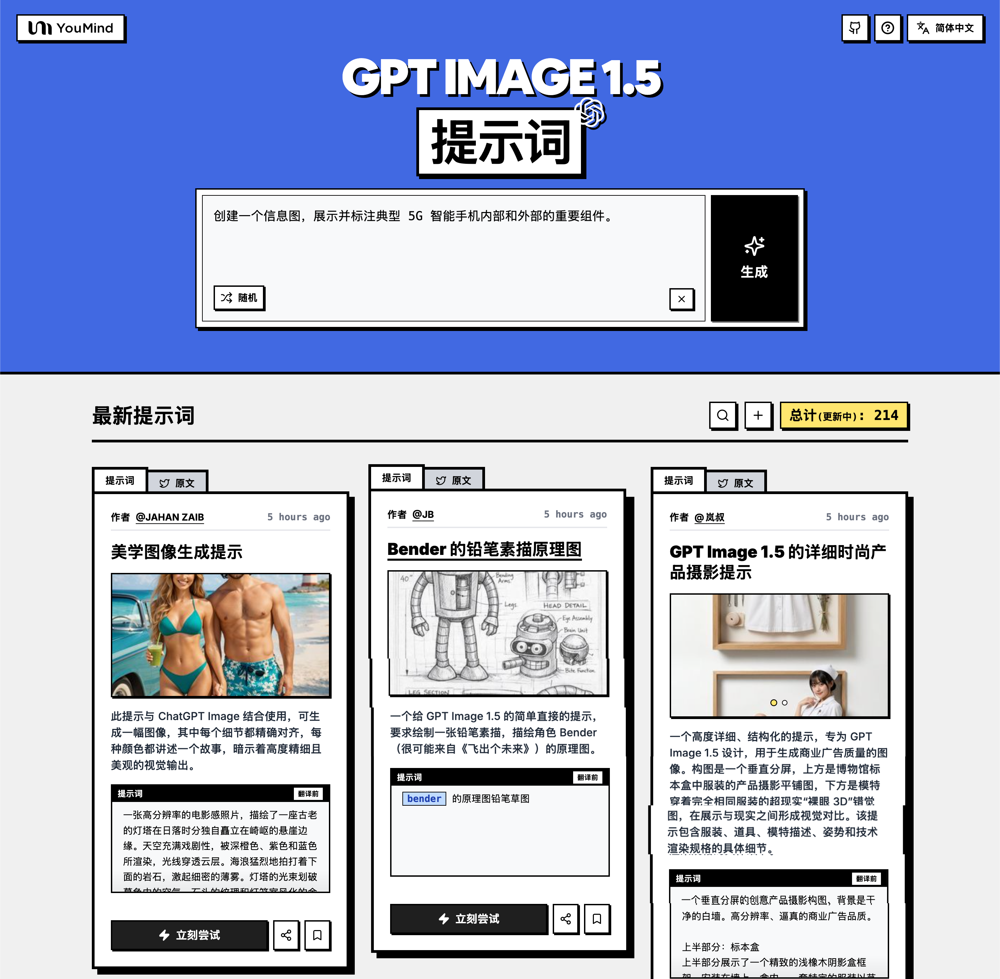

# 🚀 GPT Image 1.5 提示詞大全

[](https://github.com/sindresorhus/awesome)
[](https://github.com/YouMind-OpenLab/awesome-gpt-image-1.5)
[](https://creativecommons.org/licenses/by/4.0/)
[](https://github.com/YouMind-OpenLab/awesome-gpt-image-1.5/actions)
[](docs/CONTRIBUTING.md)

> 🎨 OpenAI GPT Image 1.5 創意提示詞精選集合

> 💡 **Note**: 如果您對 Nano Banana Pro 提示詞感興趣，歡迎查看我們的另一個倉庫：https://github.com/YouMind-OpenLab/awesome-nano-banana-pro-prompts

> ⚠️ **版權聲明**：所有提示詞均收集自社區，僅供教育目的使用。如果您認為任何內容侵犯了您的權利，請[提交 issue](https://github.com/YouMind-OpenLab/awesome-gpt-image-1.5/issues/new?template=bug-report.yml)，我們將立即移除。

---

[](README.md) [](README_zh.md) [](README_zh-TW.md) [](README_ja-JP.md) [](README_ko-KR.md) [](README_th-TH.md) [](README_vi-VN.md) [](README_hi-IN.md) [](README_es-ES.md) [-Click%20to%20View-lightgrey)](README_es-419.md) [](README_de-DE.md) [](README_fr-FR.md) [](README_it-IT.md) [-Click%20to%20View-lightgrey)](README_pt-BR.md) [](README_pt-PT.md) [](README_tr-TR.md)

---

## 🌐 在網頁圖庫中查看

<div align="center">



</div>

**[👉 瀏覽 YouMind GPT Image 1.5 提示詞圖庫](https://youmind.com/zh-TW/gpt-image-1-5-prompts)**

為什麼使用圖庫？

| Feature | GitHub README | youmind.com 圖庫 |
|---------|--------------|---------------------|
| 🎨 可視化佈局 | 線性列表 | 精美的瀑布流網格 |
| 🔍 搜索 | 僅 Ctrl+F | 全文搜索和篩選 |
| 🤖 AI 一鍵生圖 | - | AI 一鍵生圖 |
| 📱 移動端 | 基礎 | 完全響應式 |

---

## 📖 目錄

- [🌐 在網頁圖庫中查看](#-view-in-web-gallery)
- [🤔 什麼是 GPT Image 1.5？](#-what-is-gpt-image-15)
- [📊 統計數據](#-statistics)
- [🔥 精選提示詞](#-featured-prompts)
- [📋 所有提示詞](#-all-prompts)
- [🤝 如何貢獻](#-how-to-contribute)
- [📄 許可證](#-license)
- [🙏 致謝](#-acknowledgements)
- [⭐ Star 歷史](#-star-history)

---

## 🤔 什麼是 GPT Image 1.5？

**GPT Image 1.5** 是 OpenAI 最新的旗艦圖像生成模型，具有以下特點：

- 🎯 **精準編輯** - 只改變您要求的部分，保留細節完整
- 🎨 **速度提升 4 倍** - 圖像生成速度提升高達 4 倍
- ⚡ **多種編輯類型** - 添加、刪除、合併、混合、移位
- 🌈 **創意變換** - 風格濾鏡和概念轉換
- 🔧 **更好的指令遵循** - 更精確的編輯和複雜構圖
- 📐 **質量提升** - 更好的小面孔渲染和自然輸出

📚 **了解更多**：[GPT Image 1.5 概述](https://youmind.com/gpt-image-1-5)

### 🚀 Raycast 集成

部分提示詞支持使用 [Raycast Snippets](https://raycast.com/help/snippets) 語法的**動態參數**。尋找 🚀 Raycast Friendly 徽章！

**示例：**
```
A quote card with "{argument name="quote" default="Stay hungry, stay foolish"}"
by {argument name="author" default="Steve Jobs"}
```

在 Raycast 中使用時，您可以動態替換參數以快速迭代！

---

## 📊 統計數據

<div align="center">

| 指標 | 數量 |
|--------|-------|
| 📝 提示詞總數 | **261** |
| ⭐ 精選 | **3** |
| 🔄 最後更新 | **2026年2月21日 星期六 凌晨4:58:30 [UTC]** |

</div>

---

## 🔥 精選提示詞

> ⭐ 由我們的團隊精心挑選，具有卓越的質量和創造力

### No. 1: 滑板少年膠卷攝影提示


#### 📖 描述

一個詳細的圖像生成提示，旨在比較 GPT Image 1.5 和 Midjourney V7，重點是一個黑人青少年在塗鴉滑板公園中表演滑板特技的動態場景，以 Kodak Professional PORTRA 400 膠片的風格呈現。

#### 📝 提示詞

```
一名黑人青少年在塗鴉遍佈的滑板公園裡表演高難度滑板特技，Kodak Professional PORTRA 400 底片 --chaos 20 --ar 16:9 --seed 1500856893 --exp 30
```

#### 🖼️ 生成圖片

##### Image 1

<div align="center">

</div>

##### Image 2

<div align="center">

</div>

#### 📌 詳情

- **作者:** [Johnny Wang](https://x.com/JohnnyWang8802)
- **來源:** [Twitter Post](https://x.com/JohnnyWang8802/status/2001313619544604693)
- **發布時間:** 2025年12月17日
- **多語言:** en

**[👉 立即嘗試 →](https://youmind.com/zh-TW/gpt-image-1-5?prompt=%E4%B8%80%E5%90%8D%E9%BB%91%E4%BA%BA%E9%9D%92%E5%B0%91%E5%B9%B4%E5%9C%A8%E5%A1%97%E9%B4%89%E9%81%8D%E4%BD%88%E7%9A%84%E6%BB%91%E6%9D%BF%E5%85%AC%E5%9C%92%E8%A3%A1%E8%A1%A8%E6%BC%94%E9%AB%98%E9%9B%A3%E5%BA%A6%E6%BB%91%E6%9D%BF%E7%89%B9%E6%8A%80%EF%BC%8CKodak%20Professional%20PORTRA%20400%20%E5%BA%95%E7%89%87%20--chaos%2020%20--ar%2016%3A9%20--seed%201500856893%20--exp%2030)**

---

### No. 2: 兒童德語字母海報


#### 📖 描述

一份德文提示，要求製作一張兒童學習字母的海報，海報上包含從 A 到 Z 的所有字母，每個字母下方都有對應的動物及其名稱，並以可愛的漫畫風格繪製。

#### 📝 提示詞

```
一張海報，上面有從 A 到 Z 的所有字母。每個字母下方都有一種以該字母開頭的動物，動物名稱寫在動物下方。風格：可愛的漫畫風格。這是一張兒童可以用來學習字母的海報。
```

#### 🖼️ 生成圖片

##### Image 1

<div align="center">

</div>

##### Image 2

<div align="center">

</div>

#### 📌 詳情

- **作者:** [smn Sk](https://x.com/smnSk241687)
- **來源:** [Twitter Post](https://x.com/smnSk241687/status/2001293727227105678)
- **發布時間:** 2025年12月17日
- **多語言:** en

**[👉 立即嘗試 →](https://youmind.com/zh-TW/gpt-image-1-5?prompt=%E4%B8%80%E5%BC%B5%E6%B5%B7%E5%A0%B1%EF%BC%8C%E4%B8%8A%E9%9D%A2%E6%9C%89%E5%BE%9E%20A%20%E5%88%B0%20Z%20%E7%9A%84%E6%89%80%E6%9C%89%E5%AD%97%E6%AF%8D%E3%80%82%E6%AF%8F%E5%80%8B%E5%AD%97%E6%AF%8D%E4%B8%8B%E6%96%B9%E9%83%BD%E6%9C%89%E4%B8%80%E7%A8%AE%E4%BB%A5%E8%A9%B2%E5%AD%97%E6%AF%8D%E9%96%8B%E9%A0%AD%E7%9A%84%E5%8B%95%E7%89%A9%EF%BC%8C%E5%8B%95%E7%89%A9%E5%90%8D%E7%A8%B1%E5%AF%AB%E5%9C%A8%E5%8B%95%E7%89%A9%E4%B8%8B%E6%96%B9%E3%80%82%E9%A2%A8%E6%A0%BC%EF%BC%9A%E5%8F%AF%E6%84%9B%E7%9A%84%E6%BC%AB%E7%95%AB%E9%A2%A8%E6%A0%BC%E3%80%82%E9%80%99%E6%98%AF%E4%B8%80%E5%BC%B5%E5%85%92%E7%AB%A5%E5%8F%AF%E4%BB%A5%E7%94%A8%E4%BE%86%E5%AD%B8%E7%BF%92%E5%AD%97%E6%AF%8D%E7%9A%84%E6%B5%B7%E5%A0%B1%E3%80%82)**

---

### No. 3: 一位女性正在工作的扁平向量插圖


#### 📖 描述

一個用於生成扁平化向量插圖的提示，內容是一位金髮女性坐在辦公桌前使用筆記型電腦工作，適用於現代平面設計或網站素材。

#### 📝 提示詞

```
一位金髮女子坐在書桌前使用筆記型電腦工作的平面向量插圖。
```

#### 🖼️ 生成圖片

##### Image 1

<div align="center">

</div>

#### 📌 詳情

- **作者:** [PromptlyAI](https://x.com/PromptlyAI_YT)
- **來源:** [Twitter Post](https://x.com/PromptlyAI_YT/status/2001303013567181294)
- **發布時間:** 2025年12月17日
- **多語言:** en

**[👉 立即嘗試 →](https://youmind.com/zh-TW/gpt-image-1-5?prompt=%E4%B8%80%E4%BD%8D%E9%87%91%E9%AB%AE%E5%A5%B3%E5%AD%90%E5%9D%90%E5%9C%A8%E6%9B%B8%E6%A1%8C%E5%89%8D%E4%BD%BF%E7%94%A8%E7%AD%86%E8%A8%98%E5%9E%8B%E9%9B%BB%E8%85%A6%E5%B7%A5%E4%BD%9C%E7%9A%84%E5%B9%B3%E9%9D%A2%E5%90%91%E9%87%8F%E6%8F%92%E5%9C%96%E3%80%82)**

---

## 📋 所有提示詞

> 📝 按發布日期排序（最新優先）

### No. 1: 聖誕花圈生成


#### 📖 描述

一個簡單的提示，用於生成一張適合掛在前門的聖誕花圈圖片，展示了基本的圖片生成請求。

#### 📝 提示詞

```
像這樣的聖誕花圈就展示在入口處。
```

#### 🖼️ 生成圖片

##### Image 1

<div align="center">

</div>

#### 📌 詳情

- **作者:** [カーブミラー](https://x.com/kabumira862571)
- **來源:** [Twitter Post](https://x.com/kabumira862571/status/2002524462739276233)
- **發布時間:** 2025年12月20日
- **多語言:** ja

**[👉 立即嘗試 →](https://youmind.com/zh-TW/gpt-image-1-5?prompt=%E5%83%8F%E9%80%99%E6%A8%A3%E7%9A%84%E8%81%96%E8%AA%95%E8%8A%B1%E5%9C%88%E5%B0%B1%E5%B1%95%E7%A4%BA%E5%9C%A8%E5%85%A5%E5%8F%A3%E8%99%95%E3%80%82)**

---

### No. 2: 在都市環境中，女性的寫實全身肖像


#### 📖 描述

一個高度詳細、結構化的 JSON 提示，用於生成一張寫實的全身肖像，描繪一位身穿寬鬆 T 恤裙和黑色高筒綁帶厚底高跟鞋的絕美年輕女性，置身於一個簡約的水泥工業風室內，沐浴在柔和的自然日光中。

#### 📝 提示詞

```
{
  "prompt": "一位年輕美豔的女子，擁有陽光親吻過的橄欖色肌膚，一頭波浪狀的深棕色長髮披瀉在雙肩。她有著一雙深邃而富有表現力的大眼睛，配上大膽的飛翼眼線和濃密的睫毛，以及光澤飽滿的深裸粉色嘴唇，自信地微噘著嘴。她戴著一條精緻的金色項鍊，小吊墜垂掛在深邃的乳溝間。她身穿一件寬鬆的超大號棕色 T 恤裙，短袖設計，裙襬高及大腿，展露出她結實的雙腿，布料輕柔地垂墜在她的曲線之上。她赤著腳，腳趾修剪得完美無瑕。姿勢：她優雅地盤腿坐在城市工業風格的木凳上，一隻手臂搭在椅背上，另一隻手自然地垂在身側，頭部微微傾斜，以誘惑的眼神直視鏡頭。她穿著高筒黑色綁帶厚底高跟鞋，露趾設計，多條鞋帶纏繞在她的腳踝和小腿上。背景：簡約的水泥室內空間，大窗戶透入柔和的自然日光，在她的肌膚和洋裝的紋理布料上營造出溫暖的金色高光和細微的陰影。超細緻的肌膚紋理，帶有逼真的陽光親吻光澤，精緻的綁帶靴細節，主體清晰對焦，電影般的景深，背景柔和模糊，高動態範圍，8K 解析度，寫實主義，大師級品質。"
}
```

#### 🖼️ 生成圖片

##### Image 1

<div align="center">

</div>

#### 📌 詳情

- **作者:** [KeorUnreal](https://x.com/KeorUnreal)
- **來源:** [Twitter Post](https://x.com/KeorUnreal/status/2002493715429175745)
- **發布時間:** 2025年12月20日
- **多語言:** en

**[👉 立即嘗試 →](https://youmind.com/zh-TW/gpt-image-1-5?prompt=%7B%0A%20%20%22prompt%22%3A%20%22%E4%B8%80%E4%BD%8D%E5%B9%B4%E8%BC%95%E7%BE%8E%E8%B1%94%E7%9A%84%E5%A5%B3%E5%AD%90%EF%BC%8C%E6%93%81%E6%9C%89%E9%99%BD%E5%85%89%E8%A6%AA%E5%90%BB%E9%81%8E%E7%9A%84%E6%A9%84%E6%AC%96%E8%89%B2%E8%82%8C%E8%86%9A%EF%BC%8C%E4%B8%80%E9%A0%AD%E6%B3%A2%E6%B5%AA%E7%8B%80%E7%9A%84%E6%B7%B1%E6%A3%95%E8%89%B2%E9%95%B7%E9%AB%AE%E6%8A%AB%E7%80%89%E5%9C%A8%E9%9B%99%E8%82%A9%E3%80%82%E5%A5%B9%E6%9C%89%E8%91%97%E4%B8%80%E9%9B%99%E6%B7%B1%E9%82%83%E8%80%8C%E5%AF%8C%E6%9C%89%E8%A1%A8%E7%8F%BE%E5%8A%9B%E7%9A%84%E5%A4%A7%E7%9C%BC%E7%9D%9B%EF%BC%8C%E9%85%8D%E4%B8%8A%E5%A4%A7%E8%86%BD%E7%9A%84%E9%A3%9B%E7%BF%BC%E7%9C%BC%E7%B7%9A%E5%92%8C%E6%BF%83%E5%AF%86%E7%9A%84%E7%9D%AB%E6%AF%9B%EF%BC%8C%E4%BB%A5%E5%8F%8A%E5%85%89%E6%BE%A4%E9%A3%BD%E6%BB%BF%E7%9A%84%E6%B7%B1%E8%A3%B8%E7%B2%89%E8%89%B2%E5%98%B4%E5%94%87%EF%BC%8C%E8%87%AA%E4%BF%A1%E5%9C%B0%E5%BE%AE%E5%99%98%E8%91%97%E5%98%B4%E3%80%82%E5%A5%B9%E6%88%B4%E8%91%97%E4%B8%80%E6%A2%9D%E7%B2%BE%E7%B7%BB%E7%9A%84%E9%87%91%E8%89%B2%E9%A0%85%E9%8D%8A%EF%BC%8C%E5%B0%8F%E5%90%8A%E5%A2%9C%E5%9E%82%E6%8E%9B%E5%9C%A8%E6%B7%B1%E9%82%83%E7%9A%84%E4%B9%B3%E6%BA%9D%E9%96%93%E3%80%82%E5%A5%B9%E8%BA%AB%E7%A9%BF%E4%B8%80%E4%BB%B6%E5%AF%AC%E9%AC%86%E7%9A%84%E8%B6%85%E5%A4%A7%E8%99%9F%E6%A3%95%E8%89%B2%20T%20%E6%81%A4%E8%A3%99%EF%BC%8C%E7%9F%AD%E8%A2%96%E8%A8%AD%E8%A8%88%EF%BC%8C%E8%A3%99%E8%A5%AC%E9%AB%98%E5%8F%8A%E5%A4%A7%E8%85%BF%EF%BC%8C%E5%B1%95%E9%9C%B2%E5%87%BA%E5%A5%B9%E7%B5%90%E5%AF%A6%E7%9A%84%E9%9B%99%E8%85%BF%EF%BC%8C%E5%B8%83%E6%96%99%E8%BC%95%E6%9F%94%E5%9C%B0%E5%9E%82%E5%A2%9C%E5%9C%A8%E5%A5%B9%E7%9A%84%E6%9B%B2%E7%B7%9A%E4%B9%8B%E4%B8%8A%E3%80%82%E5%A5%B9%E8%B5%A4%E8%91%97%E8%85%B3%EF%BC%8C%E8%85%B3%E8%B6%BE%E4%BF%AE%E5%89%AA%E5%BE%97%E5%AE%8C%E7%BE%8E%E7%84%A1%E7%91%95%E3%80%82%E5%A7%BF%E5%8B%A2%EF%BC%9A%E5%A5%B9%E5%84%AA%E9%9B%85%E5%9C%B0%E7%9B%A4%E8%85%BF%E5%9D%90%E5%9C%A8%E5%9F%8E%E5%B8%82%E5%B7%A5%E6%A5%AD%E9%A2%A8%E6%A0%BC%E7%9A%84%E6%9C%A8%E5%87%B3%E4%B8%8A%EF%BC%8C%E4%B8%80%E9%9A%BB%E6%89%8B%E8%87%82%E6%90%AD%E5%9C%A8%E6%A4%85%E8%83%8C%E4%B8%8A%EF%BC%8C%E5%8F%A6%E4%B8%80%E9%9A%BB%E6%89%8B%E8%87%AA%E7%84%B6%E5%9C%B0%E5%9E%82%E5%9C%A8%E8%BA%AB%E5%81%B4%EF%BC%8C%E9%A0%AD%E9%83%A8%E5%BE%AE%E5%BE%AE%E5%82%BE%E6%96%9C%EF%BC%8C%E4%BB%A5%E8%AA%98%E6%83%91%E7%9A%84%E7%9C%BC%E7%A5%9E%E7%9B%B4%E8%A6%96%E9%8F%A1%E9%A0%AD%E3%80%82%E5%A5%B9%E7%A9%BF%E8%91%97%E9%AB%98%E7%AD%92%E9%BB%91%E8%89%B2%E7%B6%81%E5%B8%B6%E5%8E%9A%E5%BA%95%E9%AB%98%E8%B7%9F%E9%9E%8B%EF%BC%8C%E9%9C%B2%E8%B6%BE%E8%A8%AD%E8%A8%88%EF%BC%8C%E5%A4%9A%E6%A2%9D%E9%9E%8B%E5%B8%B6%E7%BA%8F%E7%B9%9E%E5%9C%A8%E5%A5%B9%E7%9A%84%E8%85%B3%E8%B8%9D%E5%92%8C%E5%B0%8F%E8%85%BF%E4%B8%8A%E3%80%82%E8%83%8C%E6%99%AF%EF%BC%9A%E7%B0%A1%E7%B4%84%E7%9A%84%E6%B0%B4%E6%B3%A5%E5%AE%A4%E5%85%A7%E7%A9%BA%E9%96%93%EF%BC%8C%E5%A4%A7%E7%AA%97%E6%88%B6%E9%80%8F%E5%85%A5%E6%9F%94%E5%92%8C%E7%9A%84%E8%87%AA%E7%84%B6%E6%97%A5%E5%85%89%EF%BC%8C%E5%9C%A8%E5%A5%B9%E7%9A%84%E8%82%8C%E8%86%9A%E5%92%8C%E6%B4%8B%E8%A3%9D%E7%9A%84%E7%B4%8B%E7%90%86%E5%B8%83%E6%96%99%E4%B8%8A%E7%87%9F%E9%80%A0%E5%87%BA%E6%BA%AB%E6%9A%96%E7%9A%84%E9%87%91%E8%89%B2%E9%AB%98%E5%85%89%E5%92%8C%E7%B4%B0%E5%BE%AE%E7%9A%84%E9%99%B0%E5%BD%B1%E3%80%82%E8%B6%85%E7%B4%B0%E7%B7%BB%E7%9A%84%E8%82%8C%E8%86%9A%E7%B4%8B%E7%90%86%EF%BC%8C%E5%B8%B6%E6%9C%89%E9%80%BC%E7%9C%9F%E7%9A%84%E9%99%BD%E5%85%89%E8%A6%AA%E5%90%BB%E5%85%89%E6%BE%A4%EF%BC%8C%E7%B2%BE%E7%B7%BB%E7%9A%84%E7%B6%81%E5%B8%B6%E9%9D%B4%E7%B4%B0%E7%AF%80%EF%BC%8C%E4%B8%BB%E9%AB%94%E6%B8%85%E6%99%B0%E5%B0%8D%E7%84%A6%EF%BC%8C%E9%9B%BB%E5%BD%B1%E8%88%AC%E7%9A%84%E6%99%AF%E6%B7%B1%EF%BC%8C%E8%83%8C%E6%99%AF%E6%9F%94%E5%92%8C%E6%A8%A1%E7%B3%8A%EF%BC%8C%E9%AB%98%E5%8B%95%E6%85%8B%E7%AF%84%E5%9C%8D%EF%BC%8C8K%20%E8%A7%A3%E6%9E%90%E5%BA%A6%EF%BC%8C%E5%AF%AB%E5%AF%A6%E4%B8%BB%E7%BE%A9%EF%BC%8C%E5%A4%A7%E5%B8%AB%E7%B4%9A%E5%93%81%E8%B3%AA%E3%80%82%22%0A%7D)**

---

### No. 3: 超逼真電影感夜間街頭自拍，高速逃亡中


#### 📖 描述

一個極其詳細、結構化的提示，用於生成超寫實的電影風格自拍照。它指定了複雜的元素，例如姿勢、詳細的面部特徵（保留身份）、服裝、環境（下雨的夜晚城市，有警車追逐）、高對比度照明和相機風格，展示了 GPT Image 1.5 在處理結構化視覺數據方面的精確度。

#### 📝 提示詞

```
「超寫實電影感夜間街頭自拍，參考照片中一位自信時尚的人物，在下雨的城市中高速逃亡時，從車窗探出頭來。」

「姿勢」：
「手臂」：「伸向鏡頭，手持手機」
「頭部」：「微微後仰」
「態度」：「無畏、俏皮」

「臉部與皮膚」：
「身份」：「100% 保留，臉部結構、比例或獨特特徵不變」
「皮膚」：「光滑、光澤，帶有街燈的亮麗反光」
「顴骨」：「柔和雕塑」
「嘴唇」：「光澤」
「眼睛」：「富有表情，部分隱藏在窄小的黑色長方形太陽眼鏡後」
「紋理」：「真實、自然的皮膚紋理，毛孔可見，有反光」

「頭髮」：
「髮型」：「長髮，飄逸，被速度和夜風吹拂」
「髮量」：「自然」

「服裝與細節」：
「外套」：「大膽的 {argument name="coat pattern" default="豹紋"} 人造毛皮，奢華地披在肩上」
「美甲」：「光澤的 {argument name="manicure color" default="紅色"}」
「珠寶」：「簡約銀戒指」
「玻璃杯」：「優雅的馬丁尼杯，盛著清澈的雞尾酒和綠橄欖，捕捉到銳利的反光」

「環境」：
「場景」：「濕漉漉的柏油夜間城市街道」
「動態」：「激烈、高速，警車在後追逐」
「燈光」：
「車頭燈」：「模糊、侵略性的光條」
「街燈」：「金色鈉燈街燈，形成巨大的戲劇性散景圓圈」
「警車燈」：「藍色和紅色警笛閃爍，產生反光」
「氛圍」：「叛逆、俏皮、迷人的混亂；腎上腺素飆升的夜生活能量」
「美學」：「時尚雜誌犯罪風格」

「燈光」：
「對比」：「高對比，暖色鈉燈街燈、冷藍色警燈和紅色警笛閃爍的動態混合」
「反光」：「皮膚、玻璃、車身和被雨水浸濕的街道上都有光澤反光」

「相機與風格」：
「視角」：「廣角智慧型手機自拍」
「景深」：「淺景深」
「背景」：「強烈的動態模糊與光條」
「細節」：「超高細節，逼真的膠片顆粒」
「色彩校正」：「電影感」
「氛圍」：「現代奢華逃亡」

「身體」：
「尺寸」：「略大且拉長」

「比例」：「9:16」
```

#### 🖼️ 生成圖片

##### Image 1

<div align="center">

</div>

#### 📌 詳情

- **作者:** [K](https://x.com/ChillaiKalan__)
- **來源:** [Twitter Post](https://x.com/ChillaiKalan__/status/2002465016998735930)
- **發布時間:** 2025年12月20日
- **多語言:** en

**[👉 立即嘗試 →](https://youmind.com/zh-TW/gpt-image-1-5?prompt=%E3%80%8C%E8%B6%85%E5%AF%AB%E5%AF%A6%E9%9B%BB%E5%BD%B1%E6%84%9F%E5%A4%9C%E9%96%93%E8%A1%97%E9%A0%AD%E8%87%AA%E6%8B%8D%EF%BC%8C%E5%8F%83%E8%80%83%E7%85%A7%E7%89%87%E4%B8%AD%E4%B8%80%E4%BD%8D%E8%87%AA%E4%BF%A1%E6%99%82%E5%B0%9A%E7%9A%84%E4%BA%BA%E7%89%A9%EF%BC%8C%E5%9C%A8%E4%B8%8B%E9%9B%A8%E7%9A%84%E5%9F%8E%E5%B8%82%E4%B8%AD%E9%AB%98%E9%80%9F%E9%80%83%E4%BA%A1%E6%99%82%EF%BC%8C%E5%BE%9E%E8%BB%8A%E7%AA%97%E6%8E%A2%E5%87%BA%E9%A0%AD%E4%BE%86%E3%80%82%E3%80%8D%0A%0A%E3%80%8C%E5%A7%BF%E5%8B%A2%E3%80%8D%EF%BC%9A%0A%E3%80%8C%E6%89%8B%E8%87%82%E3%80%8D%EF%BC%9A%E3%80%8C%E4%BC%B8%E5%90%91%E9%8F%A1%E9%A0%AD%EF%BC%8C%E6%89%8B%E6%8C%81%E6%89%8B%E6%A9%9F%E3%80%8D%0A%E3%80%8C%E9%A0%AD%E9%83%A8%E3%80%8D%EF%BC%9A%E3%80%8C%E5%BE%AE%E5%BE%AE%E5%BE%8C%E4%BB%B0%E3%80%8D%0A%E3%80%8C%E6%85%8B%E5%BA%A6%E3%80%8D%EF%BC%9A%E3%80%8C%E7%84%A1%E7%95%8F%E3%80%81%E4%BF%8F%E7%9A%AE%E3%80%8D%0A%0A%E3%80%8C%E8%87%89%E9%83%A8%E8%88%87%E7%9A%AE%E8%86%9A%E3%80%8D%EF%BC%9A%0A%E3%80%8C%E8%BA%AB%E4%BB%BD%E3%80%8D%EF%BC%9A%E3%80%8C100%25%20%E4%BF%9D%E7%95%99%EF%BC%8C%E8%87%89%E9%83%A8%E7%B5%90%E6%A7%8B%E3%80%81%E6%AF%94%E4%BE%8B%E6%88%96%E7%8D%A8%E7%89%B9%E7%89%B9%E5%BE%B5%E4%B8%8D%E8%AE%8A%E3%80%8D%0A%E3%80%8C%E7%9A%AE%E8%86%9A%E3%80%8D%EF%BC%9A%E3%80%8C%E5%85%89%E6%BB%91%E3%80%81%E5%85%89%E6%BE%A4%EF%BC%8C%E5%B8%B6%E6%9C%89%E8%A1%97%E7%87%88%E7%9A%84%E4%BA%AE%E9%BA%97%E5%8F%8D%E5%85%89%E3%80%8D%0A%E3%80%8C%E9%A1%B4%E9%AA%A8%E3%80%8D%EF%BC%9A%E3%80%8C%E6%9F%94%E5%92%8C%E9%9B%95%E5%A1%91%E3%80%8D%0A%E3%80%8C%E5%98%B4%E5%94%87%E3%80%8D%EF%BC%9A%E3%80%8C%E5%85%89%E6%BE%A4%E3%80%8D%0A%E3%80%8C%E7%9C%BC%E7%9D%9B%E3%80%8D%EF%BC%9A%E3%80%8C%E5%AF%8C%E6%9C%89%E8%A1%A8%E6%83%85%EF%BC%8C%E9%83%A8%E5%88%86%E9%9A%B1%E8%97%8F%E5%9C%A8%E7%AA%84%E5%B0%8F%E7%9A%84%E9%BB%91%E8%89%B2%E9%95%B7%E6%96%B9%E5%BD%A2%E5%A4%AA%E9%99%BD%E7%9C%BC%E9%8F%A1%E5%BE%8C%E3%80%8D%0A%E3%80%8C%E7%B4%8B%E7%90%86%E3%80%8D%EF%BC%9A%E3%80%8C%E7%9C%9F%E5%AF%A6%E3%80%81%E8%87%AA%E7%84%B6%E7%9A%84%E7%9A%AE%E8%86%9A%E7%B4%8B%E7%90%86%EF%BC%8C%E6%AF%9B%E5%AD%94%E5%8F%AF%E8%A6%8B%EF%BC%8C%E6%9C%89%E5%8F%8D%E5%85%89%E3%80%8D%0A%0A%E3%80%8C%E9%A0%AD%E9%AB%AE%E3%80%8D%EF%BC%9A%0A%E3%80%8C%E9%AB%AE%E5%9E%8B%E3%80%8D%EF%BC%9A%E3%80%8C%E9%95%B7%E9%AB%AE%EF%BC%8C%E9%A3%84%E9%80%B8%EF%BC%8C%E8%A2%AB%E9%80%9F%E5%BA%A6%E5%92%8C%E5%A4%9C%E9%A2%A8%E5%90%B9%E6%8B%82%E3%80%8D%0A%E3%80%8C%E9%AB%AE%E9%87%8F%E3%80%8D%EF%BC%9A%E3%80%8C%E8%87%AA%E7%84%B6%E3%80%8D%0A%0A%E3%80%8C%E6%9C%8D%E8%A3%9D%E8%88%87%E7%B4%B0%E7%AF%80%E3%80%8D%EF%BC%9A%0A%E3%80%8C%E5%A4%96%E5%A5%97%E3%80%8D%EF%BC%9A%E3%80%8C%E5%A4%A7%E8%86%BD%E7%9A%84%20%7Bargument%20name%3D%22coat%20pattern%22%20default%3D%22%E8%B1%B9%E7%B4%8B%22%7D%20%E4%BA%BA%E9%80%A0%E6%AF%9B%E7%9A%AE%EF%BC%8C%E5%A5%A2%E8%8F%AF%E5%9C%B0%E6%8A%AB%E5%9C%A8%E8%82%A9%E4%B8%8A%E3%80%8D%0A%E3%80%8C%E7%BE%8E%E7%94%B2%E3%80%8D%EF%BC%9A%E3%80%8C%E5%85%89%E6%BE%A4%E7%9A%84%20%7Bargument%20name%3D%22manicure%20color%22%20default%3D%22%E7%B4%85%E8%89%B2%22%7D%E3%80%8D%0A%E3%80%8C%E7%8F%A0%E5%AF%B6%E3%80%8D%EF%BC%9A%E3%80%8C%E7%B0%A1%E7%B4%84%E9%8A%80%E6%88%92%E6%8C%87%E3%80%8D%0A%E3%80%8C%E7%8E%BB%E7%92%83%E6%9D%AF%E3%80%8D%EF%BC%9A%E3%80%8C%E5%84%AA%E9%9B%85%E7%9A%84%E9%A6%AC%E4%B8%81%E5%B0%BC%E6%9D%AF%EF%BC%8C%E7%9B%9B%E8%91%97%E6%B8%85%E6%BE%88%E7%9A%84%E9%9B%9E%E5%B0%BE%E9%85%92%E5%92%8C%E7%B6%A0%E6%A9%84%E6%AC%96%EF%BC%8C%E6%8D%95%E6%8D%89%E5%88%B0%E9%8A%B3%E5%88%A9%E7%9A%84%E5%8F%8D%E5%85%89%E3%80%8D%0A%0A%E3%80%8C%E7%92%B0%E5%A2%83%E3%80%8D%EF%BC%9A%0A%E3%80%8C%E5%A0%B4%E6%99%AF%E3%80%8D%EF%BC%9A%E3%80%8C%E6%BF%95%E6%BC%89%E6%BC%89%E7%9A%84%E6%9F%8F%E6%B2%B9%E5%A4%9C%E9%96%93%E5%9F%8E%E5%B8%82%E8%A1%97%E9%81%93%E3%80%8D%0A%E3%80%8C%E5%8B%95%E6%85%8B%E3%80%8D%EF%BC%9A%E3%80%8C%E6%BF%80%E7%83%88%E3%80%81%E9%AB%98%E9%80%9F%EF%BC%8C%E8%AD%A6%E8%BB%8A%E5%9C%A8%E5%BE%8C%E8%BF%BD%E9%80%90%E3%80%8D%0A%E3%80%8C%E7%87%88%E5%85%89%E3%80%8D%EF%BC%9A%0A%E3%80%8C%E8%BB%8A%E9%A0%AD%E7%87%88%E3%80%8D%EF%BC%9A%E3%80%8C%E6%A8%A1%E7%B3%8A%E3%80%81%E4%BE%B5%E7%95%A5%E6%80%A7%E7%9A%84%E5%85%89%E6%A2%9D%E3%80%8D%0A%E3%80%8C%E8%A1%97%E7%87%88%E3%80%8D%EF%BC%9A%E3%80%8C%E9%87%91%E8%89%B2%E9%88%89%E7%87%88%E8%A1%97%E7%87%88%EF%BC%8C%E5%BD%A2%E6%88%90%E5%B7%A8%E5%A4%A7%E7%9A%84%E6%88%B2%E5%8A%87%E6%80%A7%E6%95%A3%E6%99%AF%E5%9C%93%E5%9C%88%E3%80%8D%0A%E3%80%8C%E8%AD%A6%E8%BB%8A%E7%87%88%E3%80%8D%EF%BC%9A%E3%80%8C%E8%97%8D%E8%89%B2%E5%92%8C%E7%B4%85%E8%89%B2%E8%AD%A6%E7%AC%9B%E9%96%83%E7%88%8D%EF%BC%8C%E7%94%A2%E7%94%9F%E5%8F%8D%E5%85%89%E3%80%8D%0A%E3%80%8C%E6%B0%9B%E5%9C%8D%E3%80%8D%EF%BC%9A%E3%80%8C%E5%8F%9B%E9%80%86%E3%80%81%E4%BF%8F%E7%9A%AE%E3%80%81%E8%BF%B7%E4%BA%BA%E7%9A%84%E6%B7%B7%E4%BA%82%EF%BC%9B%E8%85%8E%E4%B8%8A%E8%85%BA%E7%B4%A0%E9%A3%86%E5%8D%87%E7%9A%84%E5%A4%9C%E7%94%9F%E6%B4%BB%E8%83%BD%E9%87%8F%E3%80%8D%0A%E3%80%8C%E7%BE%8E%E5%AD%B8%E3%80%8D%EF%BC%9A%E3%80%8C%E6%99%82%E5%B0%9A%E9%9B%9C%E8%AA%8C%E7%8A%AF%E7%BD%AA%E9%A2%A8%E6%A0%BC%E3%80%8D%0A%0A%E3%80%8C%E7%87%88%E5%85%89%E3%80%8D%EF%BC%9A%0A%E3%80%8C%E5%B0%8D%E6%AF%94%E3%80%8D%EF%BC%9A%E3%80%8C%E9%AB%98%E5%B0%8D%E6%AF%94%EF%BC%8C%E6%9A%96%E8%89%B2%E9%88%89%E7%87%88%E8%A1%97%E7%87%88%E3%80%81%E5%86%B7%E8%97%8D%E8%89%B2%E8%AD%A6%E7%87%88%E5%92%8C%E7%B4%85%E8%89%B2%E8%AD%A6%E7%AC%9B%E9%96%83%E7%88%8D%E7%9A%84%E5%8B%95%E6%85%8B%E6%B7%B7%E5%90%88%E3%80%8D%0A%E3%80%8C%E5%8F%8D%E5%85%89%E3%80%8D%EF%BC%9A%E3%80%8C%E7%9A%AE%E8%86%9A%E3%80%81%E7%8E%BB%E7%92%83%E3%80%81%E8%BB%8A%E8%BA%AB%E5%92%8C%E8%A2%AB%E9%9B%A8%E6%B0%B4%E6%B5%B8%E6%BF%95%E7%9A%84%E8%A1%97%E9%81%93%E4%B8%8A%E9%83%BD%E6%9C%89%E5%85%89%E6%BE%A4%E5%8F%8D%E5%85%89%E3%80%8D%0A%0A%E3%80%8C%E7%9B%B8%E6%A9%9F%E8%88%87%E9%A2%A8%E6%A0%BC%E3%80%8D%EF%BC%9A%0A%E3%80%8C%E8%A6%96%E8%A7%92%E3%80%8D%EF%BC%9A%E3%80%8C%E5%BB%A3%E8%A7%92%E6%99%BA%E6%85%A7%E5%9E%8B%E6%89%8B%E6%A9%9F%E8%87%AA%E6%8B%8D%E3%80%8D%0A%E3%80%8C%E6%99%AF%E6%B7%B1%E3%80%8D%EF%BC%9A%E3%80%8C%E6%B7%BA%E6%99%AF%E6%B7%B1%E3%80%8D%0A%E3%80%8C%E8%83%8C%E6%99%AF%E3%80%8D%EF%BC%9A%E3%80%8C%E5%BC%B7%E7%83%88%E7%9A%84%E5%8B%95%E6%85%8B%E6%A8%A1%E7%B3%8A%E8%88%87%E5%85%89%E6%A2%9D%E3%80%8D%0A%E3%80%8C%E7%B4%B0%E7%AF%80%E3%80%8D%EF%BC%9A%E3%80%8C%E8%B6%85%E9%AB%98%E7%B4%B0%E7%AF%80%EF%BC%8C%E9%80%BC%E7%9C%9F%E7%9A%84%E8%86%A0%E7%89%87%E9%A1%86%E7%B2%92%E3%80%8D%0A%E3%80%8C%E8%89%B2%E5%BD%A9%E6%A0%A1%E6%AD%A3%E3%80%8D%EF%BC%9A%E3%80%8C%E9%9B%BB%E5%BD%B1%E6%84%9F%E3%80%8D%0A%E3%80%8C%E6%B0%9B%E5%9C%8D%E3%80%8D%EF%BC%9A%E3%80%8C%E7%8F%BE%E4%BB%A3%E5%A5%A2%E8%8F%AF%E9%80%83%E4%BA%A1%E3%80%8D%0A%0A%E3%80%8C%E8%BA%AB%E9%AB%94%E3%80%8D%EF%BC%9A%0A%E3%80%8C%E5%B0%BA%E5%AF%B8%E3%80%8D%EF%BC%9A%E3%80%8C%E7%95%A5%E5%A4%A7%E4%B8%94%E6%8B%89%E9%95%B7%E3%80%8D%0A%0A%E3%80%8C%E6%AF%94%E4%BE%8B%E3%80%8D%EF%BC%9A%E3%80%8C9%3A16%E3%80%8D)**

---

### No. 4: 將截圖重製為次世代電玩遊戲


#### 📖 描述

一個簡單的提示，用於將上傳的螢幕截圖或圖片轉換為超現實、次世代的電玩遊戲場景，使其看起來像電影一樣。

#### 📝 提示詞

```
將此螢幕截圖重新製作成次世代電玩遊戲，遊戲的擬真度已達到媲美電影的程度。
```

#### 🖼️ 生成圖片

##### Image 1

<div align="center">

</div>

#### 📌 詳情

- **作者:** [𝓗𝓪𝓵𝓲𝓵 𝓚𝓮𝓶𝓪𝓵 𝓨𝓪𝓿𝓪𝓼𝓬𝓪](https://x.com/Dreammassacre)
- **來源:** [Twitter Post](https://x.com/Dreammassacre/status/2002463116664451089)
- **發布時間:** 2025年12月20日
- **多語言:** en

**[👉 立即嘗試 →](https://youmind.com/zh-TW/gpt-image-1-5?prompt=%E5%B0%87%E6%AD%A4%E8%9E%A2%E5%B9%95%E6%88%AA%E5%9C%96%E9%87%8D%E6%96%B0%E8%A3%BD%E4%BD%9C%E6%88%90%E6%AC%A1%E4%B8%96%E4%BB%A3%E9%9B%BB%E7%8E%A9%E9%81%8A%E6%88%B2%EF%BC%8C%E9%81%8A%E6%88%B2%E7%9A%84%E6%93%AC%E7%9C%9F%E5%BA%A6%E5%B7%B2%E9%81%94%E5%88%B0%E5%AA%B2%E7%BE%8E%E9%9B%BB%E5%BD%B1%E7%9A%84%E7%A8%8B%E5%BA%A6%E3%80%82)**

---

### No. 5: JSON 提示以重新建立圖像細節


#### 📖 描述

一個旨在生成圖像高度詳細 JSON 描述的提示，捕捉每一個視覺元素。這對於創建精確的文字轉圖像提示或進行詳細的視覺分析非常有用。

#### 📝 提示詞

```
撰寫一個 JSON 提示，精確描述圖片中的每一個細節。
```

#### 🖼️ 生成圖片

##### Image 1

<div align="center">

</div>

#### 📌 詳情

- **作者:** [Sura Baghirova](https://x.com/surasb11)
- **來源:** [Twitter Post](https://x.com/surasb11/status/2002458961564639473)
- **發布時間:** 2025年12月20日
- **多語言:** en

**[👉 立即嘗試 →](https://youmind.com/zh-TW/gpt-image-1-5?prompt=%E6%92%B0%E5%AF%AB%E4%B8%80%E5%80%8B%20JSON%20%E6%8F%90%E7%A4%BA%EF%BC%8C%E7%B2%BE%E7%A2%BA%E6%8F%8F%E8%BF%B0%E5%9C%96%E7%89%87%E4%B8%AD%E7%9A%84%E6%AF%8F%E4%B8%80%E5%80%8B%E7%B4%B0%E7%AF%80%E3%80%82)**

---

### No. 6: Grok 根據照片想像提示


#### 📖 描述

此條目表示某張特定圖片是透過參考照片並結合 Grok Imagine 提示詞所建立的。提示詞本身並未提供，但其結構暗示了這是一個圖生圖或視覺參考的工作流程。

#### 📝 提示詞

```
這張照片 + Grok 想像提示
```

#### 🖼️ 生成圖片

##### Image 1

<div align="center">

</div>

#### 📌 詳情

- **作者:** [Five](https://x.com/Five69)
- **來源:** [Twitter Post](https://x.com/Five69/status/2002451024922231197)
- **發布時間:** 2025年12月20日
- **多語言:** en

**[👉 立即嘗試 →](https://youmind.com/zh-TW/gpt-image-1-5?prompt=%E9%80%99%E5%BC%B5%E7%85%A7%E7%89%87%20%2B%20Grok%20%E6%83%B3%E5%83%8F%E6%8F%90%E7%A4%BA)**

---

### No. 7: 陽光廚房中一名女性的舒適電影感生活照系列


#### 📖 描述

這是一個詳細且結構化的提示，用於生成一系列電影風格的生活照多格畫面。它聚焦於一位年輕女性在溫暖、陽光普照的廚房中享受寧靜的茶點時光，強調特定的攝影角度（特寫、過肩、俯視）、光線、紋理，以及一種平和、具編輯感的氛圍。這展示了 GPT Image 1.5 處理複雜多鏡頭指令的能力。

#### 📝 提示詞

```
一系列溫馨的電影感生活照片，以多格網格呈現，捕捉了一位年輕女性在陽光普照的溫暖廚房中，享受寧靜茶點時光的畫面。她身穿一件柔軟的{argument name="dress color" default="玫瑰粉色"}無袖洋裝，坐在一扇窗邊的小圓木桌旁。清晨的自然光灑落進來，營造出柔和的光影效果。這組照片包括她輕啜精緻花卉茶杯的特寫鏡頭、在平靜對話中從肩後拍攝的鏡頭、從上方俯瞰編織餐墊上茶具的畫面、側面特寫以及細微的真情流露。背景是中性奶油色調的廚房，掛著銅製廚具。整體氛圍親密而寧靜，採用淺景深、電影般的柔和感、編輯式敘事風格、真實的皮膚紋理、溫暖的色彩分級、極簡構圖和高細節的電影寫實主義。
```

#### 🖼️ 生成圖片

##### Image 1

<div align="center">

</div>

#### 📌 詳情

- **作者:** [Smiling Khan](https://x.com/AIwithkhan)
- **來源:** [Twitter Post](https://x.com/AIwithkhan/status/2002450998208704590)
- **發布時間:** 2025年12月20日
- **多語言:** en

**[👉 立即嘗試 →](https://youmind.com/zh-TW/gpt-image-1-5?prompt=%E4%B8%80%E7%B3%BB%E5%88%97%E6%BA%AB%E9%A6%A8%E7%9A%84%E9%9B%BB%E5%BD%B1%E6%84%9F%E7%94%9F%E6%B4%BB%E7%85%A7%E7%89%87%EF%BC%8C%E4%BB%A5%E5%A4%9A%E6%A0%BC%E7%B6%B2%E6%A0%BC%E5%91%88%E7%8F%BE%EF%BC%8C%E6%8D%95%E6%8D%89%E4%BA%86%E4%B8%80%E4%BD%8D%E5%B9%B4%E8%BC%95%E5%A5%B3%E6%80%A7%E5%9C%A8%E9%99%BD%E5%85%89%E6%99%AE%E7%85%A7%E7%9A%84%E6%BA%AB%E6%9A%96%E5%BB%9A%E6%88%BF%E4%B8%AD%EF%BC%8C%E4%BA%AB%E5%8F%97%E5%AF%A7%E9%9D%9C%E8%8C%B6%E9%BB%9E%E6%99%82%E5%85%89%E7%9A%84%E7%95%AB%E9%9D%A2%E3%80%82%E5%A5%B9%E8%BA%AB%E7%A9%BF%E4%B8%80%E4%BB%B6%E6%9F%94%E8%BB%9F%E7%9A%84%7Bargument%20name%3D%22dress%20color%22%20default%3D%22%E7%8E%AB%E7%91%B0%E7%B2%89%E8%89%B2%22%7D%E7%84%A1%E8%A2%96%E6%B4%8B%E8%A3%9D%EF%BC%8C%E5%9D%90%E5%9C%A8%E4%B8%80%E6%89%87%E7%AA%97%E9%82%8A%E7%9A%84%E5%B0%8F%E5%9C%93%E6%9C%A8%E6%A1%8C%E6%97%81%E3%80%82%E6%B8%85%E6%99%A8%E7%9A%84%E8%87%AA%E7%84%B6%E5%85%89%E7%81%91%E8%90%BD%E9%80%B2%E4%BE%86%EF%BC%8C%E7%87%9F%E9%80%A0%E5%87%BA%E6%9F%94%E5%92%8C%E7%9A%84%E5%85%89%E5%BD%B1%E6%95%88%E6%9E%9C%E3%80%82%E9%80%99%E7%B5%84%E7%85%A7%E7%89%87%E5%8C%85%E6%8B%AC%E5%A5%B9%E8%BC%95%E5%95%9C%E7%B2%BE%E7%B7%BB%E8%8A%B1%E5%8D%89%E8%8C%B6%E6%9D%AF%E7%9A%84%E7%89%B9%E5%AF%AB%E9%8F%A1%E9%A0%AD%E3%80%81%E5%9C%A8%E5%B9%B3%E9%9D%9C%E5%B0%8D%E8%A9%B1%E4%B8%AD%E5%BE%9E%E8%82%A9%E5%BE%8C%E6%8B%8D%E6%94%9D%E7%9A%84%E9%8F%A1%E9%A0%AD%E3%80%81%E5%BE%9E%E4%B8%8A%E6%96%B9%E4%BF%AF%E7%9E%B0%E7%B7%A8%E7%B9%94%E9%A4%90%E5%A2%8A%E4%B8%8A%E8%8C%B6%E5%85%B7%E7%9A%84%E7%95%AB%E9%9D%A2%E3%80%81%E5%81%B4%E9%9D%A2%E7%89%B9%E5%AF%AB%E4%BB%A5%E5%8F%8A%E7%B4%B0%E5%BE%AE%E7%9A%84%E7%9C%9F%E6%83%85%E6%B5%81%E9%9C%B2%E3%80%82%E8%83%8C%E6%99%AF%E6%98%AF%E4%B8%AD%E6%80%A7%E5%A5%B6%E6%B2%B9%E8%89%B2%E8%AA%BF%E7%9A%84%E5%BB%9A%E6%88%BF%EF%BC%8C%E6%8E%9B%E8%91%97%E9%8A%85%E8%A3%BD%E5%BB%9A%E5%85%B7%E3%80%82%E6%95%B4%E9%AB%94%E6%B0%9B%E5%9C%8D%E8%A6%AA%E5%AF%86%E8%80%8C%E5%AF%A7%E9%9D%9C%EF%BC%8C%E6%8E%A1%E7%94%A8%E6%B7%BA%E6%99%AF%E6%B7%B1%E3%80%81%E9%9B%BB%E5%BD%B1%E8%88%AC%E7%9A%84%E6%9F%94%E5%92%8C%E6%84%9F%E3%80%81%E7%B7%A8%E8%BC%AF%E5%BC%8F%E6%95%98%E4%BA%8B%E9%A2%A8%E6%A0%BC%E3%80%81%E7%9C%9F%E5%AF%A6%E7%9A%84%E7%9A%AE%E8%86%9A%E7%B4%8B%E7%90%86%E3%80%81%E6%BA%AB%E6%9A%96%E7%9A%84%E8%89%B2%E5%BD%A9%E5%88%86%E7%B4%9A%E3%80%81%E6%A5%B5%E7%B0%A1%E6%A7%8B%E5%9C%96%E5%92%8C%E9%AB%98%E7%B4%B0%E7%AF%80%E7%9A%84%E9%9B%BB%E5%BD%B1%E5%AF%AB%E5%AF%A6%E4%B8%BB%E7%BE%A9%E3%80%82)**

---

### No. 8: 陽台上結構化的逼真吉娃娃 (重複)


#### 📖 描述

一個高度結構化的 JSON 格式提示，詳細描述了逼真的圖像的每個方面：一隻長毛吉娃娃狗躺在戶外陽台的躺椅墊子上，並詳細說明了毛髮、光線、背景元素（海灣、船隻、城市天際線）和構圖。這是從另一條推文中找到的提示的重複。

#### 📝 提示詞

```
{
  "type": "image_prompt",
  "format": "photorealistic",
  "aspect_ratio": "1536:1358",
  "scene": {
    "setting": "帶有玻璃欄杆的戶外陽台/露台",
    "time_of_day": "白天",
    "weather": "晴朗",
    "foreground_surface": "一個大型長方形躺椅坐墊，頂部為淺米色/奶油色，側面為灰色，並有明顯的滾邊縫線"
  },
  "subject": {
    "primary_subject": "一隻小型長毛吉娃娃",
    "pose": "趴在坐墊上，前爪向前伸，身體放鬆，頭部略微抬起",
    "expression": "平靜，在明亮的陽光下略微瞇眼",
    "fur": {
      "color": "溫暖的金棕色/棕褐色，帶有較淺的奶油色亮點",
      "texture": "蓬鬆的長毛，耳朵和頸部周圍有稀疏的毛髮",
      "markings": "口鼻和下巴略帶灰色；爪子/腳趾上的毛髮較淺"
    },
    "features": {
      "ears": "大而直立的耳朵，帶有羽毛狀的毛髮",
      "eyes": "深棕色，有光澤",
      "nose": "小小的黑色鼻子"
    }
  },
  "background": {
    "midground": "平靜的藍色水域（海灣/港口），帶有樹木繁茂的海岸線/島嶼",
    "distant_elements": [
      "多艘大型白色遊輪",
      "左側的港口起重機/工業建築",
      "右側帶有高樓大廈的朦朧城市天際線"
    ],
    "structure": "狗身後居中有一根白色的垂直陽台柱",
    "depth_of_field": "背景與狗相比明顯模糊/柔和"
  },
  "lighting": {
    "type": "強烈的自然陽光",
    "direction": "從左側/左前方照射",
    "effects": [
      "狗的毛髮上有明亮的亮點",
      "坐墊上有柔和的陰影和一道斜向的陰影"
    ]
  },
  "composition": {
    "framing": "中景特寫，狗佔據畫面右半部分",
    "focus": "狗的焦點清晰；背景失焦",
    "camera_angle": "與狗平視/略高於狗",
    "mood": "溫暖、寧靜、享受日光浴"
  },
  "color_palette": [
    "金棕色",
    "奶油色/米色",
    "冷藍色",
    "柔和的灰色",
    "白色"
  ],
  "prompt": "一個寫實的白天陽台場景：一隻小型長毛吉娃娃，毛髮呈溫暖的金棕色/棕褐色，帶有較淺的奶油色亮點，牠放鬆地趴在一個大型長方形躺椅坐墊上（淺米色/奶油色頂部，灰色側面和滾邊縫線）。狗的頭部略微抬起，臉部略微朝左，表情平靜，深色眼睛略微瞇起，耳朵直立且帶有羽毛狀的毛髮，鼻子小巧呈黑色，口鼻略帶灰色；前爪向前伸，腳趾上的毛髮較淺。強烈的自然陽光從左側照射，在毛髮上形成明亮的亮點，並在坐墊上投下柔和的陰影。狗的身後是玻璃陽台欄杆，背景中央有一根白色的垂直柱子，以及一個柔和、失焦的藍色海灣/港口景觀，海灣有樹木繁茂的海岸線、幾艘大型白色遊輪、遠處的港口起重機，以及右側帶有高樓大廈的朦朧城市天際線。景深較淺，焦點清晰地集中在狗身上。"
}
```

#### 🖼️ 生成圖片

##### Image 1

<div align="center">

</div>

#### 📌 詳情

- **作者:** [Sura Baghirova](https://x.com/surasb11)
- **來源:** [Twitter Post](https://x.com/surasb11/status/2002442613660463238)
- **發布時間:** 2025年12月20日
- **多語言:** en

**[👉 立即嘗試 →](https://youmind.com/zh-TW/gpt-image-1-5?prompt=%7B%0A%20%20%22type%22%3A%20%22image_prompt%22%2C%0A%20%20%22format%22%3A%20%22photorealistic%22%2C%0A%20%20%22aspect_ratio%22%3A%20%221536%3A1358%22%2C%0A%20%20%22scene%22%3A%20%7B%0A%20%20%20%20%22setting%22%3A%20%22%E5%B8%B6%E6%9C%89%E7%8E%BB%E7%92%83%E6%AC%84%E6%9D%86%E7%9A%84%E6%88%B6%E5%A4%96%E9%99%BD%E5%8F%B0%2F%E9%9C%B2%E5%8F%B0%22%2C%0A%20%20%20%20%22time_of_day%22%3A%20%22%E7%99%BD%E5%A4%A9%22%2C%0A%20%20%20%20%22weather%22%3A%20%22%E6%99%B4%E6%9C%97%22%2C%0A%20%20%20%20%22foreground_surface%22%3A%20%22%E4%B8%80%E5%80%8B%E5%A4%A7%E5%9E%8B%E9%95%B7%E6%96%B9%E5%BD%A2%E8%BA%BA%E6%A4%85%E5%9D%90%E5%A2%8A%EF%BC%8C%E9%A0%82%E9%83%A8%E7%82%BA%E6%B7%BA%E7%B1%B3%E8%89%B2%2F%E5%A5%B6%E6%B2%B9%E8%89%B2%EF%BC%8C%E5%81%B4%E9%9D%A2%E7%82%BA%E7%81%B0%E8%89%B2%EF%BC%8C%E4%B8%A6%E6%9C%89%E6%98%8E%E9%A1%AF%E7%9A%84%E6%BB%BE%E9%82%8A%E7%B8%AB%E7%B7%9A%22%0A%20%20%7D%2C%0A%20%20%22subject%22%3A%20%7B%0A%20%20%20%20%22primary_subject%22%3A%20%22%E4%B8%80%E9%9A%BB%E5%B0%8F%E5%9E%8B%E9%95%B7%E6%AF%9B%E5%90%89%E5%A8%83%E5%A8%83%22%2C%0A%20%20%20%20%22pose%22%3A%20%22%E8%B6%B4%E5%9C%A8%E5%9D%90%E5%A2%8A%E4%B8%8A%EF%BC%8C%E5%89%8D%E7%88%AA%E5%90%91%E5%89%8D%E4%BC%B8%EF%BC%8C%E8%BA%AB%E9%AB%94%E6%94%BE%E9%AC%86%EF%BC%8C%E9%A0%AD%E9%83%A8%E7%95%A5%E5%BE%AE%E6%8A%AC%E8%B5%B7%22%2C%0A%20%20%20%20%22expression%22%3A%20%22%E5%B9%B3%E9%9D%9C%EF%BC%8C%E5%9C%A8%E6%98%8E%E4%BA%AE%E7%9A%84%E9%99%BD%E5%85%89%E4%B8%8B%E7%95%A5%E5%BE%AE%E7%9E%87%E7%9C%BC%22%2C%0A%20%20%20%20%22fur%22%3A%20%7B%0A%20%20%20%20%20%20%22color%22%3A%20%22%E6%BA%AB%E6%9A%96%E7%9A%84%E9%87%91%E6%A3%95%E8%89%B2%2F%E6%A3%95%E8%A4%90%E8%89%B2%EF%BC%8C%E5%B8%B6%E6%9C%89%E8%BC%83%E6%B7%BA%E7%9A%84%E5%A5%B6%E6%B2%B9%E8%89%B2%E4%BA%AE%E9%BB%9E%22%2C%0A%20%20%20%20%20%20%22texture%22%3A%20%22%E8%93%AC%E9%AC%86%E7%9A%84%E9%95%B7%E6%AF%9B%EF%BC%8C%E8%80%B3%E6%9C%B5%E5%92%8C%E9%A0%B8%E9%83%A8%E5%91%A8%E5%9C%8D%E6%9C%89%E7%A8%80%E7%96%8F%E7%9A%84%E6%AF%9B%E9%AB%AE%22%2C%0A%20%20%20%20%20%20%22markings%22%3A%20%22%E5%8F%A3%E9%BC%BB%E5%92%8C%E4%B8%8B%E5%B7%B4%E7%95%A5%E5%B8%B6%E7%81%B0%E8%89%B2%EF%BC%9B%E7%88%AA%E5%AD%90%2F%E8%85%B3%E8%B6%BE%E4%B8%8A%E7%9A%84%E6%AF%9B%E9%AB%AE%E8%BC%83%E6%B7%BA%22%0A%20%20%20%20%7D%2C%0A%20%20%20%20%22features%22%3A%20%7B%0A%20%20%20%20%20%20%22ears%22%3A%20%22%E5%A4%A7%E8%80%8C%E7%9B%B4%E7%AB%8B%E7%9A%84%E8%80%B3%E6%9C%B5%EF%BC%8C%E5%B8%B6%E6%9C%89%E7%BE%BD%E6%AF%9B%E7%8B%80%E7%9A%84%E6%AF%9B%E9%AB%AE%22%2C%0A%20%20%20%20%20%20%22eyes%22%3A%20%22%E6%B7%B1%E6%A3%95%E8%89%B2%EF%BC%8C%E6%9C%89%E5%85%89%E6%BE%A4%22%2C%0A%20%20%20%20%20%20%22nose%22%3A%20%22%E5%B0%8F%E5%B0%8F%E7%9A%84%E9%BB%91%E8%89%B2%E9%BC%BB%E5%AD%90%22%0A%20%20%20%20%7D%0A%20%20%7D%2C%0A%20%20%22background%22%3A%20%7B%0A%20%20%20%20%22midground%22%3A%20%22%E5%B9%B3%E9%9D%9C%E7%9A%84%E8%97%8D%E8%89%B2%E6%B0%B4%E5%9F%9F%EF%BC%88%E6%B5%B7%E7%81%A3%2F%E6%B8%AF%E5%8F%A3%EF%BC%89%EF%BC%8C%E5%B8%B6%E6%9C%89%E6%A8%B9%E6%9C%A8%E7%B9%81%E8%8C%82%E7%9A%84%E6%B5%B7%E5%B2%B8%E7%B7%9A%2F%E5%B3%B6%E5%B6%BC%22%2C%0A%20%20%20%20%22distant_elements%22%3A%20%5B%0A%20%20%20%20%20%20%22%E5%A4%9A%E8%89%98%E5%A4%A7%E5%9E%8B%E7%99%BD%E8%89%B2%E9%81%8A%E8%BC%AA%22%2C%0A%20%20%20%20%20%20%22%E5%B7%A6%E5%81%B4%E7%9A%84%E6%B8%AF%E5%8F%A3%E8%B5%B7%E9%87%8D%E6%A9%9F%2F%E5%B7%A5%E6%A5%AD%E5%BB%BA%E7%AF%89%22%2C%0A%20%20%20%20%20%20%22%E5%8F%B3%E5%81%B4%E5%B8%B6%E6%9C%89%E9%AB%98%E6%A8%93%E5%A4%A7%E5%BB%88%E7%9A%84%E6%9C%A6%E6%9C%A7%E5%9F%8E%E5%B8%82%E5%A4%A9%E9%9A%9B%E7%B7%9A%22%0A%20%20%20%20%5D%2C%0A%20%20%20%20%22structure%22%3A%20%22%E7%8B%97%E8%BA%AB%E5%BE%8C%E5%B1%85%E4%B8%AD%E6%9C%89%E4%B8%80%E6%A0%B9%E7%99%BD%E8%89%B2%E7%9A%84%E5%9E%82%E7%9B%B4%E9%99%BD%E5%8F%B0%E6%9F%B1%22%2C%0A%20%20%20%20%22depth_of_field%22%3A%20%22%E8%83%8C%E6%99%AF%E8%88%87%E7%8B%97%E7%9B%B8%E6%AF%94%E6%98%8E%E9%A1%AF%E6%A8%A1%E7%B3%8A%2F%E6%9F%94%E5%92%8C%22%0A%20%20%7D%2C%0A%20%20%22lighting%22%3A%20%7B%0A%20%20%20%20%22type%22%3A%20%22%E5%BC%B7%E7%83%88%E7%9A%84%E8%87%AA%E7%84%B6%E9%99%BD%E5%85%89%22%2C%0A%20%20%20%20%22direction%22%3A%20%22%E5%BE%9E%E5%B7%A6%E5%81%B4%2F%E5%B7%A6%E5%89%8D%E6%96%B9%E7%85%A7%E5%B0%84%22%2C%0A%20%20%20%20%22effects%22%3A%20%5B%0A%20%20%20%20%20%20%22%E7%8B%97%E7%9A%84%E6%AF%9B%E9%AB%AE%E4%B8%8A%E6%9C%89%E6%98%8E%E4%BA%AE%E7%9A%84%E4%BA%AE%E9%BB%9E%22%2C%0A%20%20%20%20%20%20%22%E5%9D%90%E5%A2%8A%E4%B8%8A%E6%9C%89%E6%9F%94%E5%92%8C%E7%9A%84%E9%99%B0%E5%BD%B1%E5%92%8C%E4%B8%80%E9%81%93%E6%96%9C%E5%90%91%E7%9A%84%E9%99%B0%E5%BD%B1%22%0A%20%20%20%20%5D%0A%20%20%7D%2C%0A%20%20%22composition%22%3A%20%7B%0A%20%20%20%20%22framing%22%3A%20%22%E4%B8%AD%E6%99%AF%E7%89%B9%E5%AF%AB%EF%BC%8C%E7%8B%97%E4%BD%94%E6%93%9A%E7%95%AB%E9%9D%A2%E5%8F%B3%E5%8D%8A%E9%83%A8%E5%88%86%22%2C%0A%20%20%20%20%22focus%22%3A%20%22%E7%8B%97%E7%9A%84%E7%84%A6%E9%BB%9E%E6%B8%85%E6%99%B0%EF%BC%9B%E8%83%8C%E6%99%AF%E5%A4%B1%E7%84%A6%22%2C%0A%20%20%20%20%22camera_angle%22%3A%20%22%E8%88%87%E7%8B%97%E5%B9%B3%E8%A6%96%2F%E7%95%A5%E9%AB%98%E6%96%BC%E7%8B%97%22%2C%0A%20%20%20%20%22mood%22%3A%20%22%E6%BA%AB%E6%9A%96%E3%80%81%E5%AF%A7%E9%9D%9C%E3%80%81%E4%BA%AB%E5%8F%97%E6%97%A5%E5%85%89%E6%B5%B4%22%0A%20%20%7D%2C%0A%20%20%22color_palette%22%3A%20%5B%0A%20%20%20%20%22%E9%87%91%E6%A3%95%E8%89%B2%22%2C%0A%20%20%20%20%22%E5%A5%B6%E6%B2%B9%E8%89%B2%2F%E7%B1%B3%E8%89%B2%22%2C%0A%20%20%20%20%22%E5%86%B7%E8%97%8D%E8%89%B2%22%2C%0A%20%20%20%20%22%E6%9F%94%E5%92%8C%E7%9A%84%E7%81%B0%E8%89%B2%22%2C%0A%20%20%20%20%22%E7%99%BD%E8%89%B2%22%0A%20%20%5D%2C%0A%20%20%22prompt%22%3A%20%22%E4%B8%80%E5%80%8B%E5%AF%AB%E5%AF%A6%E7%9A%84%E7%99%BD%E5%A4%A9%E9%99%BD%E5%8F%B0%E5%A0%B4%E6%99%AF%EF%BC%9A%E4%B8%80%E9%9A%BB%E5%B0%8F%E5%9E%8B%E9%95%B7%E6%AF%9B%E5%90%89%E5%A8%83%E5%A8%83%EF%BC%8C%E6%AF%9B%E9%AB%AE%E5%91%88%E6%BA%AB%E6%9A%96%E7%9A%84%E9%87%91%E6%A3%95%E8%89%B2%2F%E6%A3%95%E8%A4%90%E8%89%B2%EF%BC%8C%E5%B8%B6%E6%9C%89%E8%BC%83%E6%B7%BA%E7%9A%84%E5%A5%B6%E6%B2%B9%E8%89%B2%E4%BA%AE%E9%BB%9E%EF%BC%8C%E7%89%A0%E6%94%BE%E9%AC%86%E5%9C%B0%E8%B6%B4%E5%9C%A8%E4%B8%80%E5%80%8B%E5%A4%A7%E5%9E%8B%E9%95%B7%E6%96%B9%E5%BD%A2%E8%BA%BA%E6%A4%85%E5%9D%90%E5%A2%8A%E4%B8%8A%EF%BC%88%E6%B7%BA%E7%B1%B3%E8%89%B2%2F%E5%A5%B6%E6%B2%B9%E8%89%B2%E9%A0%82%E9%83%A8%EF%BC%8C%E7%81%B0%E8%89%B2%E5%81%B4%E9%9D%A2%E5%92%8C%E6%BB%BE%E9%82%8A%E7%B8%AB%E7%B7%9A%EF%BC%89%E3%80%82%E7%8B%97%E7%9A%84%E9%A0%AD%E9%83%A8%E7%95%A5%E5%BE%AE%E6%8A%AC%E8%B5%B7%EF%BC%8C%E8%87%89%E9%83%A8%E7%95%A5%E5%BE%AE%E6%9C%9D%E5%B7%A6%EF%BC%8C%E8%A1%A8%E6%83%85%E5%B9%B3%E9%9D%9C%EF%BC%8C%E6%B7%B1%E8%89%B2%E7%9C%BC%E7%9D%9B%E7%95%A5%E5%BE%AE%E7%9E%87%E8%B5%B7%EF%BC%8C%E8%80%B3%E6%9C%B5%E7%9B%B4%E7%AB%8B%E4%B8%94%E5%B8%B6%E6%9C%89%E7%BE%BD%E6%AF%9B%E7%8B%80%E7%9A%84%E6%AF%9B%E9%AB%AE%EF%BC%8C%E9%BC%BB%E5%AD%90%E5%B0%8F%E5%B7%A7%E5%91%88%E9%BB%91%E8%89%B2%EF%BC%8C%E5%8F%A3%E9%BC%BB%E7%95%A5%E5%B8%B6%E7%81%B0%E8%89%B2%EF%BC%9B%E5%89%8D%E7%88%AA%E5%90%91%E5%89%8D%E4%BC%B8%EF%BC%8C%E8%85%B3%E8%B6%BE%E4%B8%8A%E7%9A%84%E6%AF%9B%E9%AB%AE%E8%BC%83%E6%B7%BA%E3%80%82%E5%BC%B7%E7%83%88%E7%9A%84%E8%87%AA%E7%84%B6%E9%99%BD%E5%85%89%E5%BE%9E%E5%B7%A6%E5%81%B4%E7%85%A7%E5%B0%84%EF%BC%8C%E5%9C%A8%E6%AF%9B%E9%AB%AE%E4%B8%8A%E5%BD%A2%E6%88%90%E6%98%8E%E4%BA%AE%E7%9A%84%E4%BA%AE%E9%BB%9E%EF%BC%8C%E4%B8%A6%E5%9C%A8%E5%9D%90%E5%A2%8A%E4%B8%8A%E6%8A%95%E4%B8%8B%E6%9F%94%E5%92%8C%E7%9A%84%E9%99%B0%E5%BD%B1%E3%80%82%E7%8B%97%E7%9A%84%E8%BA%AB%E5%BE%8C%E6%98%AF%E7%8E%BB%E7%92%83%E9%99%BD%E5%8F%B0%E6%AC%84%E6%9D%86%EF%BC%8C%E8%83%8C%E6%99%AF%E4%B8%AD%E5%A4%AE%E6%9C%89%E4%B8%80%E6%A0%B9%E7%99%BD%E8%89%B2%E7%9A%84%E5%9E%82%E7%9B%B4%E6%9F%B1%E5%AD%90%EF%BC%8C%E4%BB%A5%E5%8F%8A%E4%B8%80%E5%80%8B%E6%9F%94%E5%92%8C%E3%80%81%E5%A4%B1%E7%84%A6%E7%9A%84%E8%97%8D%E8%89%B2%E6%B5%B7%E7%81%A3%2F%E6%B8%AF%E5%8F%A3%E6%99%AF%E8%A7%80%EF%BC%8C%E6%B5%B7%E7%81%A3%E6%9C%89%E6%A8%B9%E6%9C%A8%E7%B9%81%E8%8C%82%E7%9A%84%E6%B5%B7%E5%B2%B8%E7%B7%9A%E3%80%81%E5%B9%BE%E8%89%98%E5%A4%A7%E5%9E%8B%E7%99%BD%E8%89%B2%E9%81%8A%E8%BC%AA%E3%80%81%E9%81%A0%E8%99%95%E7%9A%84%E6%B8%AF%E5%8F%A3%E8%B5%B7%E9%87%8D%E6%A9%9F%EF%BC%8C%E4%BB%A5%E5%8F%8A%E5%8F%B3%E5%81%B4%E5%B8%B6%E6%9C%89%E9%AB%98%E6%A8%93%E5%A4%A7%E5%BB%88%E7%9A%84%E6%9C%A6%E6%9C%A7%E5%9F%8E%E5%B8%82%E5%A4%A9%E9%9A%9B%E7%B7%9A%E3%80%82%E6%99%AF%E6%B7%B1%E8%BC%83%E6%B7%BA%EF%BC%8C%E7%84%A6%E9%BB%9E%E6%B8%85%E6%99%B0%E5%9C%B0%E9%9B%86%E4%B8%AD%E5%9C%A8%E7%8B%97%E8%BA%AB%E4%B8%8A%E3%80%82%22%0A%7D)**

---

### No. 9: 陽台上結構化的逼真吉娃娃


#### 📖 描述

一個高度結構化的 JSON 格式提示，詳細描述了逼真的圖像的每個方面：一隻小型長毛吉娃娃躺在戶外陽台的躺椅墊上，並詳細說明了毛髮、光線、背景元素（海灣、船隻、城市天際線）和構圖。

#### 📝 提示詞

```
{
  "type": "image_prompt",
  "format": "photorealistic",
  "aspect_ratio": "1536:1358",
  "scene": {
    "setting": "帶有玻璃欄杆的戶外陽台/露台",
    "time_of_day": "白天",
    "weather": "晴朗",
    "foreground_surface": "一個大型長方形躺椅坐墊，頂部為淺米色/奶油色，側面為灰色，可見滾邊縫線"
  },
  "subject": {
    "primary_subject": "一隻小型長毛吉娃娃",
    "pose": "躺在坐墊上，前爪向前伸，身體放鬆，頭部略微抬起",
    "expression": "平靜，在明亮的陽光下略微瞇眼",
    "fur": {
      "color": "溫暖的金棕色/棕褐色，帶有較淺的奶油色亮點",
      "texture": "蓬鬆的長毛，耳朵和頸部周圍有稀疏的毛髮",
      "markings": "口吻和下巴略帶灰色；爪子/腳趾上的毛髮較淺"
    },
    "features": {
      "ears": "大而直立的耳朵，帶有羽毛狀的毛髮",
      "eyes": "深棕色，有光澤",
      "nose": "小小的黑色鼻子"
    }
  },
  "background": {
    "midground": "平靜的藍色水域（海灣/港口），有樹木環繞的海岸線/島嶼",
    "distant_elements": [
      "多艘大型白色遊輪",
      "左側的港口起重機/工業建築",
      "右側有高樓大廈的朦朧城市天際線"
    ],
    "structure": "狗身後中央有一根白色的垂直陽台柱",
    "depth_of_field": "背景與狗相比明顯模糊/柔和"
  },
  "lighting": {
    "type": "強烈的自然陽光",
    "direction": "從左側/左前方照射",
    "effects": [
      "狗的毛髮上有明亮的亮點",
      "坐墊上柔和的陰影和一道斜向的陰影"
    ]
  },
  "composition": {
    "framing": "中特寫，狗佔據畫面右半部分",
    "focus": "狗的焦點清晰；背景失焦",
    "camera_angle": "與狗平視/略高於狗",
    "mood": "溫暖、寧靜、享受日光浴"
  },
  "color_palette": [
    "金棕色",
    "奶油色/米色",
    "冷藍色",
    "柔和的灰色",
    "白色"
  ],
  "prompt": "一個寫實的白天陽台場景：一隻小型長毛吉娃娃，毛髮呈溫暖的金棕色/棕褐色，帶有較淺的奶油色亮點，牠放鬆地躺在一個大型長方形躺椅坐墊上（頂部為淺米色/奶油色，側面為灰色，有滾邊縫線）。狗的頭部略微抬起，臉部略微朝左，表情平靜，深色眼睛略微瞇起，耳朵直立且帶有羽毛狀的毛髮，鼻子小巧呈黑色，口吻略帶灰色；前爪向前伸，腳趾上的毛髮較淺。強烈的自然陽光從左側照射，在毛髮上形成明亮的亮點，並在坐墊上投下柔和的陰影。狗的身後是玻璃陽台欄杆，背景中央有一根白色的垂直柱子，以及一個柔和、失焦的藍色海灣/港口景觀，有樹木環繞的海岸線、幾艘大型白色遊輪、遠處的港口起重機，以及右側高樓大廈組成的朦朧城市天際線。景深較淺，狗的焦點清晰，背景模糊。"
}
```

#### 🖼️ 生成圖片

##### Image 1

<div align="center">

</div>

#### 📌 詳情

- **作者:** [Sura Baghirova](https://x.com/surasb11)
- **來源:** [Twitter Post](https://x.com/surasb11/status/2002417155225141446)
- **發布時間:** 2025年12月20日
- **多語言:** en

**[👉 立即嘗試 →](https://youmind.com/zh-TW/gpt-image-1-5?prompt=%7B%0A%20%20%22type%22%3A%20%22image_prompt%22%2C%0A%20%20%22format%22%3A%20%22photorealistic%22%2C%0A%20%20%22aspect_ratio%22%3A%20%221536%3A1358%22%2C%0A%20%20%22scene%22%3A%20%7B%0A%20%20%20%20%22setting%22%3A%20%22%E5%B8%B6%E6%9C%89%E7%8E%BB%E7%92%83%E6%AC%84%E6%9D%86%E7%9A%84%E6%88%B6%E5%A4%96%E9%99%BD%E5%8F%B0%2F%E9%9C%B2%E5%8F%B0%22%2C%0A%20%20%20%20%22time_of_day%22%3A%20%22%E7%99%BD%E5%A4%A9%22%2C%0A%20%20%20%20%22weather%22%3A%20%22%E6%99%B4%E6%9C%97%22%2C%0A%20%20%20%20%22foreground_surface%22%3A%20%22%E4%B8%80%E5%80%8B%E5%A4%A7%E5%9E%8B%E9%95%B7%E6%96%B9%E5%BD%A2%E8%BA%BA%E6%A4%85%E5%9D%90%E5%A2%8A%EF%BC%8C%E9%A0%82%E9%83%A8%E7%82%BA%E6%B7%BA%E7%B1%B3%E8%89%B2%2F%E5%A5%B6%E6%B2%B9%E8%89%B2%EF%BC%8C%E5%81%B4%E9%9D%A2%E7%82%BA%E7%81%B0%E8%89%B2%EF%BC%8C%E5%8F%AF%E8%A6%8B%E6%BB%BE%E9%82%8A%E7%B8%AB%E7%B7%9A%22%0A%20%20%7D%2C%0A%20%20%22subject%22%3A%20%7B%0A%20%20%20%20%22primary_subject%22%3A%20%22%E4%B8%80%E9%9A%BB%E5%B0%8F%E5%9E%8B%E9%95%B7%E6%AF%9B%E5%90%89%E5%A8%83%E5%A8%83%22%2C%0A%20%20%20%20%22pose%22%3A%20%22%E8%BA%BA%E5%9C%A8%E5%9D%90%E5%A2%8A%E4%B8%8A%EF%BC%8C%E5%89%8D%E7%88%AA%E5%90%91%E5%89%8D%E4%BC%B8%EF%BC%8C%E8%BA%AB%E9%AB%94%E6%94%BE%E9%AC%86%EF%BC%8C%E9%A0%AD%E9%83%A8%E7%95%A5%E5%BE%AE%E6%8A%AC%E8%B5%B7%22%2C%0A%20%20%20%20%22expression%22%3A%20%22%E5%B9%B3%E9%9D%9C%EF%BC%8C%E5%9C%A8%E6%98%8E%E4%BA%AE%E7%9A%84%E9%99%BD%E5%85%89%E4%B8%8B%E7%95%A5%E5%BE%AE%E7%9E%87%E7%9C%BC%22%2C%0A%20%20%20%20%22fur%22%3A%20%7B%0A%20%20%20%20%20%20%22color%22%3A%20%22%E6%BA%AB%E6%9A%96%E7%9A%84%E9%87%91%E6%A3%95%E8%89%B2%2F%E6%A3%95%E8%A4%90%E8%89%B2%EF%BC%8C%E5%B8%B6%E6%9C%89%E8%BC%83%E6%B7%BA%E7%9A%84%E5%A5%B6%E6%B2%B9%E8%89%B2%E4%BA%AE%E9%BB%9E%22%2C%0A%20%20%20%20%20%20%22texture%22%3A%20%22%E8%93%AC%E9%AC%86%E7%9A%84%E9%95%B7%E6%AF%9B%EF%BC%8C%E8%80%B3%E6%9C%B5%E5%92%8C%E9%A0%B8%E9%83%A8%E5%91%A8%E5%9C%8D%E6%9C%89%E7%A8%80%E7%96%8F%E7%9A%84%E6%AF%9B%E9%AB%AE%22%2C%0A%20%20%20%20%20%20%22markings%22%3A%20%22%E5%8F%A3%E5%90%BB%E5%92%8C%E4%B8%8B%E5%B7%B4%E7%95%A5%E5%B8%B6%E7%81%B0%E8%89%B2%EF%BC%9B%E7%88%AA%E5%AD%90%2F%E8%85%B3%E8%B6%BE%E4%B8%8A%E7%9A%84%E6%AF%9B%E9%AB%AE%E8%BC%83%E6%B7%BA%22%0A%20%20%20%20%7D%2C%0A%20%20%20%20%22features%22%3A%20%7B%0A%20%20%20%20%20%20%22ears%22%3A%20%22%E5%A4%A7%E8%80%8C%E7%9B%B4%E7%AB%8B%E7%9A%84%E8%80%B3%E6%9C%B5%EF%BC%8C%E5%B8%B6%E6%9C%89%E7%BE%BD%E6%AF%9B%E7%8B%80%E7%9A%84%E6%AF%9B%E9%AB%AE%22%2C%0A%20%20%20%20%20%20%22eyes%22%3A%20%22%E6%B7%B1%E6%A3%95%E8%89%B2%EF%BC%8C%E6%9C%89%E5%85%89%E6%BE%A4%22%2C%0A%20%20%20%20%20%20%22nose%22%3A%20%22%E5%B0%8F%E5%B0%8F%E7%9A%84%E9%BB%91%E8%89%B2%E9%BC%BB%E5%AD%90%22%0A%20%20%20%20%7D%0A%20%20%7D%2C%0A%20%20%22background%22%3A%20%7B%0A%20%20%20%20%22midground%22%3A%20%22%E5%B9%B3%E9%9D%9C%E7%9A%84%E8%97%8D%E8%89%B2%E6%B0%B4%E5%9F%9F%EF%BC%88%E6%B5%B7%E7%81%A3%2F%E6%B8%AF%E5%8F%A3%EF%BC%89%EF%BC%8C%E6%9C%89%E6%A8%B9%E6%9C%A8%E7%92%B0%E7%B9%9E%E7%9A%84%E6%B5%B7%E5%B2%B8%E7%B7%9A%2F%E5%B3%B6%E5%B6%BC%22%2C%0A%20%20%20%20%22distant_elements%22%3A%20%5B%0A%20%20%20%20%20%20%22%E5%A4%9A%E8%89%98%E5%A4%A7%E5%9E%8B%E7%99%BD%E8%89%B2%E9%81%8A%E8%BC%AA%22%2C%0A%20%20%20%20%20%20%22%E5%B7%A6%E5%81%B4%E7%9A%84%E6%B8%AF%E5%8F%A3%E8%B5%B7%E9%87%8D%E6%A9%9F%2F%E5%B7%A5%E6%A5%AD%E5%BB%BA%E7%AF%89%22%2C%0A%20%20%20%20%20%20%22%E5%8F%B3%E5%81%B4%E6%9C%89%E9%AB%98%E6%A8%93%E5%A4%A7%E5%BB%88%E7%9A%84%E6%9C%A6%E6%9C%A7%E5%9F%8E%E5%B8%82%E5%A4%A9%E9%9A%9B%E7%B7%9A%22%0A%20%20%20%20%5D%2C%0A%20%20%20%20%22structure%22%3A%20%22%E7%8B%97%E8%BA%AB%E5%BE%8C%E4%B8%AD%E5%A4%AE%E6%9C%89%E4%B8%80%E6%A0%B9%E7%99%BD%E8%89%B2%E7%9A%84%E5%9E%82%E7%9B%B4%E9%99%BD%E5%8F%B0%E6%9F%B1%22%2C%0A%20%20%20%20%22depth_of_field%22%3A%20%22%E8%83%8C%E6%99%AF%E8%88%87%E7%8B%97%E7%9B%B8%E6%AF%94%E6%98%8E%E9%A1%AF%E6%A8%A1%E7%B3%8A%2F%E6%9F%94%E5%92%8C%22%0A%20%20%7D%2C%0A%20%20%22lighting%22%3A%20%7B%0A%20%20%20%20%22type%22%3A%20%22%E5%BC%B7%E7%83%88%E7%9A%84%E8%87%AA%E7%84%B6%E9%99%BD%E5%85%89%22%2C%0A%20%20%20%20%22direction%22%3A%20%22%E5%BE%9E%E5%B7%A6%E5%81%B4%2F%E5%B7%A6%E5%89%8D%E6%96%B9%E7%85%A7%E5%B0%84%22%2C%0A%20%20%20%20%22effects%22%3A%20%5B%0A%20%20%20%20%20%20%22%E7%8B%97%E7%9A%84%E6%AF%9B%E9%AB%AE%E4%B8%8A%E6%9C%89%E6%98%8E%E4%BA%AE%E7%9A%84%E4%BA%AE%E9%BB%9E%22%2C%0A%20%20%20%20%20%20%22%E5%9D%90%E5%A2%8A%E4%B8%8A%E6%9F%94%E5%92%8C%E7%9A%84%E9%99%B0%E5%BD%B1%E5%92%8C%E4%B8%80%E9%81%93%E6%96%9C%E5%90%91%E7%9A%84%E9%99%B0%E5%BD%B1%22%0A%20%20%20%20%5D%0A%20%20%7D%2C%0A%20%20%22composition%22%3A%20%7B%0A%20%20%20%20%22framing%22%3A%20%22%E4%B8%AD%E7%89%B9%E5%AF%AB%EF%BC%8C%E7%8B%97%E4%BD%94%E6%93%9A%E7%95%AB%E9%9D%A2%E5%8F%B3%E5%8D%8A%E9%83%A8%E5%88%86%22%2C%0A%20%20%20%20%22focus%22%3A%20%22%E7%8B%97%E7%9A%84%E7%84%A6%E9%BB%9E%E6%B8%85%E6%99%B0%EF%BC%9B%E8%83%8C%E6%99%AF%E5%A4%B1%E7%84%A6%22%2C%0A%20%20%20%20%22camera_angle%22%3A%20%22%E8%88%87%E7%8B%97%E5%B9%B3%E8%A6%96%2F%E7%95%A5%E9%AB%98%E6%96%BC%E7%8B%97%22%2C%0A%20%20%20%20%22mood%22%3A%20%22%E6%BA%AB%E6%9A%96%E3%80%81%E5%AF%A7%E9%9D%9C%E3%80%81%E4%BA%AB%E5%8F%97%E6%97%A5%E5%85%89%E6%B5%B4%22%0A%20%20%7D%2C%0A%20%20%22color_palette%22%3A%20%5B%0A%20%20%20%20%22%E9%87%91%E6%A3%95%E8%89%B2%22%2C%0A%20%20%20%20%22%E5%A5%B6%E6%B2%B9%E8%89%B2%2F%E7%B1%B3%E8%89%B2%22%2C%0A%20%20%20%20%22%E5%86%B7%E8%97%8D%E8%89%B2%22%2C%0A%20%20%20%20%22%E6%9F%94%E5%92%8C%E7%9A%84%E7%81%B0%E8%89%B2%22%2C%0A%20%20%20%20%22%E7%99%BD%E8%89%B2%22%0A%20%20%5D%2C%0A%20%20%22prompt%22%3A%20%22%E4%B8%80%E5%80%8B%E5%AF%AB%E5%AF%A6%E7%9A%84%E7%99%BD%E5%A4%A9%E9%99%BD%E5%8F%B0%E5%A0%B4%E6%99%AF%EF%BC%9A%E4%B8%80%E9%9A%BB%E5%B0%8F%E5%9E%8B%E9%95%B7%E6%AF%9B%E5%90%89%E5%A8%83%E5%A8%83%EF%BC%8C%E6%AF%9B%E9%AB%AE%E5%91%88%E6%BA%AB%E6%9A%96%E7%9A%84%E9%87%91%E6%A3%95%E8%89%B2%2F%E6%A3%95%E8%A4%90%E8%89%B2%EF%BC%8C%E5%B8%B6%E6%9C%89%E8%BC%83%E6%B7%BA%E7%9A%84%E5%A5%B6%E6%B2%B9%E8%89%B2%E4%BA%AE%E9%BB%9E%EF%BC%8C%E7%89%A0%E6%94%BE%E9%AC%86%E5%9C%B0%E8%BA%BA%E5%9C%A8%E4%B8%80%E5%80%8B%E5%A4%A7%E5%9E%8B%E9%95%B7%E6%96%B9%E5%BD%A2%E8%BA%BA%E6%A4%85%E5%9D%90%E5%A2%8A%E4%B8%8A%EF%BC%88%E9%A0%82%E9%83%A8%E7%82%BA%E6%B7%BA%E7%B1%B3%E8%89%B2%2F%E5%A5%B6%E6%B2%B9%E8%89%B2%EF%BC%8C%E5%81%B4%E9%9D%A2%E7%82%BA%E7%81%B0%E8%89%B2%EF%BC%8C%E6%9C%89%E6%BB%BE%E9%82%8A%E7%B8%AB%E7%B7%9A%EF%BC%89%E3%80%82%E7%8B%97%E7%9A%84%E9%A0%AD%E9%83%A8%E7%95%A5%E5%BE%AE%E6%8A%AC%E8%B5%B7%EF%BC%8C%E8%87%89%E9%83%A8%E7%95%A5%E5%BE%AE%E6%9C%9D%E5%B7%A6%EF%BC%8C%E8%A1%A8%E6%83%85%E5%B9%B3%E9%9D%9C%EF%BC%8C%E6%B7%B1%E8%89%B2%E7%9C%BC%E7%9D%9B%E7%95%A5%E5%BE%AE%E7%9E%87%E8%B5%B7%EF%BC%8C%E8%80%B3%E6%9C%B5%E7%9B%B4%E7%AB%8B%E4%B8%94%E5%B8%B6%E6%9C%89%E7%BE%BD%E6%AF%9B%E7%8B%80%E7%9A%84%E6%AF%9B%E9%AB%AE%EF%BC%8C%E9%BC%BB%E5%AD%90%E5%B0%8F%E5%B7%A7%E5%91%88%E9%BB%91%E8%89%B2%EF%BC%8C%E5%8F%A3%E5%90%BB%E7%95%A5%E5%B8%B6%E7%81%B0%E8%89%B2%EF%BC%9B%E5%89%8D%E7%88%AA%E5%90%91%E5%89%8D%E4%BC%B8%EF%BC%8C%E8%85%B3%E8%B6%BE%E4%B8%8A%E7%9A%84%E6%AF%9B%E9%AB%AE%E8%BC%83%E6%B7%BA%E3%80%82%E5%BC%B7%E7%83%88%E7%9A%84%E8%87%AA%E7%84%B6%E9%99%BD%E5%85%89%E5%BE%9E%E5%B7%A6%E5%81%B4%E7%85%A7%E5%B0%84%EF%BC%8C%E5%9C%A8%E6%AF%9B%E9%AB%AE%E4%B8%8A%E5%BD%A2%E6%88%90%E6%98%8E%E4%BA%AE%E7%9A%84%E4%BA%AE%E9%BB%9E%EF%BC%8C%E4%B8%A6%E5%9C%A8%E5%9D%90%E5%A2%8A%E4%B8%8A%E6%8A%95%E4%B8%8B%E6%9F%94%E5%92%8C%E7%9A%84%E9%99%B0%E5%BD%B1%E3%80%82%E7%8B%97%E7%9A%84%E8%BA%AB%E5%BE%8C%E6%98%AF%E7%8E%BB%E7%92%83%E9%99%BD%E5%8F%B0%E6%AC%84%E6%9D%86%EF%BC%8C%E8%83%8C%E6%99%AF%E4%B8%AD%E5%A4%AE%E6%9C%89%E4%B8%80%E6%A0%B9%E7%99%BD%E8%89%B2%E7%9A%84%E5%9E%82%E7%9B%B4%E6%9F%B1%E5%AD%90%EF%BC%8C%E4%BB%A5%E5%8F%8A%E4%B8%80%E5%80%8B%E6%9F%94%E5%92%8C%E3%80%81%E5%A4%B1%E7%84%A6%E7%9A%84%E8%97%8D%E8%89%B2%E6%B5%B7%E7%81%A3%2F%E6%B8%AF%E5%8F%A3%E6%99%AF%E8%A7%80%EF%BC%8C%E6%9C%89%E6%A8%B9%E6%9C%A8%E7%92%B0%E7%B9%9E%E7%9A%84%E6%B5%B7%E5%B2%B8%E7%B7%9A%E3%80%81%E5%B9%BE%E8%89%98%E5%A4%A7%E5%9E%8B%E7%99%BD%E8%89%B2%E9%81%8A%E8%BC%AA%E3%80%81%E9%81%A0%E8%99%95%E7%9A%84%E6%B8%AF%E5%8F%A3%E8%B5%B7%E9%87%8D%E6%A9%9F%EF%BC%8C%E4%BB%A5%E5%8F%8A%E5%8F%B3%E5%81%B4%E9%AB%98%E6%A8%93%E5%A4%A7%E5%BB%88%E7%B5%84%E6%88%90%E7%9A%84%E6%9C%A6%E6%9C%A7%E5%9F%8E%E5%B8%82%E5%A4%A9%E9%9A%9B%E7%B7%9A%E3%80%82%E6%99%AF%E6%B7%B1%E8%BC%83%E6%B7%BA%EF%BC%8C%E7%8B%97%E7%9A%84%E7%84%A6%E9%BB%9E%E6%B8%85%E6%99%B0%EF%BC%8C%E8%83%8C%E6%99%AF%E6%A8%A1%E7%B3%8A%E3%80%82%22%0A%7D)**

---

### No. 10: 《美麗新世界》中的超現實立體模型


#### 📖 描述

一個提示，用於生成一個超精細、超寫實的微型雕塑立體模型，從一本打開的復古書中浮現，描繪一個受阿道斯·赫胥黎《美麗新世界》啟發的臨床且詭異的未來孵化實驗室。

#### 📝 提示詞

```
超現實立體模型從一本打開的復古書籍中浮現，書名是「{argument name="book title" default="美麗新世界"}」，作者是 {argument name="author" default="阿道斯·赫胥黎"}：書頁構成一個未來感的孵化實驗室，一排排發光的試管中裝著傳送帶上的胚胎人形，身穿白色制服的實驗室工作人員操作著機器，牆上掛著一個巨大的全視之眼符號，傳送帶透過隱藏機制移動，冷藍色的霓虹燈光，超精細的微型雕塑，臨床而詭異的氛圍，寫實攝影風格。
```

#### 🖼️ 生成圖片

##### Image 1

<div align="center">

</div>

#### 📌 詳情

- **作者:** [Gadgetify](https://x.com/Gdgtify)
- **來源:** [Twitter Post](https://x.com/Gdgtify/status/2002399592906993959)
- **發布時間:** 2025年12月20日
- **多語言:** en

**[👉 立即嘗試 →](https://youmind.com/zh-TW/gpt-image-1-5?prompt=%E8%B6%85%E7%8F%BE%E5%AF%A6%E7%AB%8B%E9%AB%94%E6%A8%A1%E5%9E%8B%E5%BE%9E%E4%B8%80%E6%9C%AC%E6%89%93%E9%96%8B%E7%9A%84%E5%BE%A9%E5%8F%A4%E6%9B%B8%E7%B1%8D%E4%B8%AD%E6%B5%AE%E7%8F%BE%EF%BC%8C%E6%9B%B8%E5%90%8D%E6%98%AF%E3%80%8C%7Bargument%20name%3D%22book%20title%22%20default%3D%22%E7%BE%8E%E9%BA%97%E6%96%B0%E4%B8%96%E7%95%8C%22%7D%E3%80%8D%EF%BC%8C%E4%BD%9C%E8%80%85%E6%98%AF%20%7Bargument%20name%3D%22author%22%20default%3D%22%E9%98%BF%E9%81%93%E6%96%AF%C2%B7%E8%B5%AB%E8%83%A5%E9%BB%8E%22%7D%EF%BC%9A%E6%9B%B8%E9%A0%81%E6%A7%8B%E6%88%90%E4%B8%80%E5%80%8B%E6%9C%AA%E4%BE%86%E6%84%9F%E7%9A%84%E5%AD%B5%E5%8C%96%E5%AF%A6%E9%A9%97%E5%AE%A4%EF%BC%8C%E4%B8%80%E6%8E%92%E6%8E%92%E7%99%BC%E5%85%89%E7%9A%84%E8%A9%A6%E7%AE%A1%E4%B8%AD%E8%A3%9D%E8%91%97%E5%82%B3%E9%80%81%E5%B8%B6%E4%B8%8A%E7%9A%84%E8%83%9A%E8%83%8E%E4%BA%BA%E5%BD%A2%EF%BC%8C%E8%BA%AB%E7%A9%BF%E7%99%BD%E8%89%B2%E5%88%B6%E6%9C%8D%E7%9A%84%E5%AF%A6%E9%A9%97%E5%AE%A4%E5%B7%A5%E4%BD%9C%E4%BA%BA%E5%93%A1%E6%93%8D%E4%BD%9C%E8%91%97%E6%A9%9F%E5%99%A8%EF%BC%8C%E7%89%86%E4%B8%8A%E6%8E%9B%E8%91%97%E4%B8%80%E5%80%8B%E5%B7%A8%E5%A4%A7%E7%9A%84%E5%85%A8%E8%A6%96%E4%B9%8B%E7%9C%BC%E7%AC%A6%E8%99%9F%EF%BC%8C%E5%82%B3%E9%80%81%E5%B8%B6%E9%80%8F%E9%81%8E%E9%9A%B1%E8%97%8F%E6%A9%9F%E5%88%B6%E7%A7%BB%E5%8B%95%EF%BC%8C%E5%86%B7%E8%97%8D%E8%89%B2%E7%9A%84%E9%9C%93%E8%99%B9%E7%87%88%E5%85%89%EF%BC%8C%E8%B6%85%E7%B2%BE%E7%B4%B0%E7%9A%84%E5%BE%AE%E5%9E%8B%E9%9B%95%E5%A1%91%EF%BC%8C%E8%87%A8%E5%BA%8A%E8%80%8C%E8%A9%AD%E7%95%B0%E7%9A%84%E6%B0%9B%E5%9C%8D%EF%BC%8C%E5%AF%AB%E5%AF%A6%E6%94%9D%E5%BD%B1%E9%A2%A8%E6%A0%BC%E3%80%82)**

---

### No. 11: 山頂上的電影感冬季時尚肖像


#### 📖 描述

一個關於在白雪皚皚的山上拍攝電影感時尚肖像的詳細提示。它指定了拍攝對象的服裝（柔和粉色羽絨外套、心形圖案抓絨衣、虎紋牛仔褲）、配飾（復古太陽眼鏡、黃色毛帽）、環境（高山山脈、黃昏時分的天空），並包含懷舊元素，例如復古卡帶播放器，旨在營造一種生活風格與冒險相結合的美學。

#### 📝 提示詞

```
一張電影般的冬季時尚肖像，一位時尚年輕女子坐在一座白雪皚皚的山峰上，周圍是廣闊的阿爾卑斯山脈，在柔和的黃昏天空下。她穿著一件 {argument name="jacket color" default="淡粉色"} 羽絨外套，內搭心形圖案抓絨衫，刺繡深色牛仔褲上飾有大膽的老虎圖案，戴著復古黃色墨鏡，棕色皮手套和彩色運動鞋。一頂帶有圖案臉孔的俏皮黃色毛帽增添了普普藝術的氛圍。她身旁雪地上放著一台復古粉色手提卡式播放器，增添了懷舊魅力。她擺出放鬆自信的姿勢，望向遠方，微風輕輕吹拂著她的頭髮。Google Gemini 超逼真，清晰細節，時尚編輯攝影，自然冷色調與溫暖陽光平衡，淺景深，電影構圖，高解析度，生活風格與冒險美學。
```

#### 🖼️ 生成圖片

##### Image 1

<div align="center">

</div>

#### 📌 詳情

- **作者:** [Smiling Khan](https://x.com/AIwithkhan)
- **來源:** [Twitter Post](https://x.com/AIwithkhan/status/2002391950658580520)
- **發布時間:** 2025年12月20日
- **多語言:** en

**[👉 立即嘗試 →](https://youmind.com/zh-TW/gpt-image-1-5?prompt=%E4%B8%80%E5%BC%B5%E9%9B%BB%E5%BD%B1%E8%88%AC%E7%9A%84%E5%86%AC%E5%AD%A3%E6%99%82%E5%B0%9A%E8%82%96%E5%83%8F%EF%BC%8C%E4%B8%80%E4%BD%8D%E6%99%82%E5%B0%9A%E5%B9%B4%E8%BC%95%E5%A5%B3%E5%AD%90%E5%9D%90%E5%9C%A8%E4%B8%80%E5%BA%A7%E7%99%BD%E9%9B%AA%E7%9A%9A%E7%9A%9A%E7%9A%84%E5%B1%B1%E5%B3%B0%E4%B8%8A%EF%BC%8C%E5%91%A8%E5%9C%8D%E6%98%AF%E5%BB%A3%E9%97%8A%E7%9A%84%E9%98%BF%E7%88%BE%E5%8D%91%E6%96%AF%E5%B1%B1%E8%84%88%EF%BC%8C%E5%9C%A8%E6%9F%94%E5%92%8C%E7%9A%84%E9%BB%83%E6%98%8F%E5%A4%A9%E7%A9%BA%E4%B8%8B%E3%80%82%E5%A5%B9%E7%A9%BF%E8%91%97%E4%B8%80%E4%BB%B6%20%7Bargument%20name%3D%22jacket%20color%22%20default%3D%22%E6%B7%A1%E7%B2%89%E8%89%B2%22%7D%20%E7%BE%BD%E7%B5%A8%E5%A4%96%E5%A5%97%EF%BC%8C%E5%85%A7%E6%90%AD%E5%BF%83%E5%BD%A2%E5%9C%96%E6%A1%88%E6%8A%93%E7%B5%A8%E8%A1%AB%EF%BC%8C%E5%88%BA%E7%B9%A1%E6%B7%B1%E8%89%B2%E7%89%9B%E4%BB%94%E8%A4%B2%E4%B8%8A%E9%A3%BE%E6%9C%89%E5%A4%A7%E8%86%BD%E7%9A%84%E8%80%81%E8%99%8E%E5%9C%96%E6%A1%88%EF%BC%8C%E6%88%B4%E8%91%97%E5%BE%A9%E5%8F%A4%E9%BB%83%E8%89%B2%E5%A2%A8%E9%8F%A1%EF%BC%8C%E6%A3%95%E8%89%B2%E7%9A%AE%E6%89%8B%E5%A5%97%E5%92%8C%E5%BD%A9%E8%89%B2%E9%81%8B%E5%8B%95%E9%9E%8B%E3%80%82%E4%B8%80%E9%A0%82%E5%B8%B6%E6%9C%89%E5%9C%96%E6%A1%88%E8%87%89%E5%AD%94%E7%9A%84%E4%BF%8F%E7%9A%AE%E9%BB%83%E8%89%B2%E6%AF%9B%E5%B8%BD%E5%A2%9E%E6%B7%BB%E4%BA%86%E6%99%AE%E6%99%AE%E8%97%9D%E8%A1%93%E7%9A%84%E6%B0%9B%E5%9C%8D%E3%80%82%E5%A5%B9%E8%BA%AB%E6%97%81%E9%9B%AA%E5%9C%B0%E4%B8%8A%E6%94%BE%E8%91%97%E4%B8%80%E5%8F%B0%E5%BE%A9%E5%8F%A4%E7%B2%89%E8%89%B2%E6%89%8B%E6%8F%90%E5%8D%A1%E5%BC%8F%E6%92%AD%E6%94%BE%E5%99%A8%EF%BC%8C%E5%A2%9E%E6%B7%BB%E4%BA%86%E6%87%B7%E8%88%8A%E9%AD%85%E5%8A%9B%E3%80%82%E5%A5%B9%E6%93%BA%E5%87%BA%E6%94%BE%E9%AC%86%E8%87%AA%E4%BF%A1%E7%9A%84%E5%A7%BF%E5%8B%A2%EF%BC%8C%E6%9C%9B%E5%90%91%E9%81%A0%E6%96%B9%EF%BC%8C%E5%BE%AE%E9%A2%A8%E8%BC%95%E8%BC%95%E5%90%B9%E6%8B%82%E8%91%97%E5%A5%B9%E7%9A%84%E9%A0%AD%E9%AB%AE%E3%80%82Google%20Gemini%20%E8%B6%85%E9%80%BC%E7%9C%9F%EF%BC%8C%E6%B8%85%E6%99%B0%E7%B4%B0%E7%AF%80%EF%BC%8C%E6%99%82%E5%B0%9A%E7%B7%A8%E8%BC%AF%E6%94%9D%E5%BD%B1%EF%BC%8C%E8%87%AA%E7%84%B6%E5%86%B7%E8%89%B2%E8%AA%BF%E8%88%87%E6%BA%AB%E6%9A%96%E9%99%BD%E5%85%89%E5%B9%B3%E8%A1%A1%EF%BC%8C%E6%B7%BA%E6%99%AF%E6%B7%B1%EF%BC%8C%E9%9B%BB%E5%BD%B1%E6%A7%8B%E5%9C%96%EF%BC%8C%E9%AB%98%E8%A7%A3%E6%9E%90%E5%BA%A6%EF%BC%8C%E7%94%9F%E6%B4%BB%E9%A2%A8%E6%A0%BC%E8%88%87%E5%86%92%E9%9A%AA%E7%BE%8E%E5%AD%B8%E3%80%82)**

---

### No. 12: 哲學 AI 反思繪畫提示


#### 📖 描述

一個哲學性的提示，要求 AI 創作一幅畫作，以視覺方式呈現「AI 的輸出是人類輸入的鏡像」這個哲學概念。此提示旨在生成抽象或概念藝術。

#### 📝 提示詞

```
從哲學意義上來說，AI 的輸出是人類輸入的鏡像。請繪製一幅畫作，將這句話視覺化。
```

#### 🖼️ 生成圖片

##### Image 1

<div align="center">

</div>

#### 📌 詳情

- **作者:** [石の裏に潜む黒いヤツ](https://x.com/dangomushino)
- **來源:** [Twitter Post](https://x.com/dangomushino/status/2002389299401277840)
- **發布時間:** 2025年12月20日
- **多語言:** ja

**[👉 立即嘗試 →](https://youmind.com/zh-TW/gpt-image-1-5?prompt=%E5%BE%9E%E5%93%B2%E5%AD%B8%E6%84%8F%E7%BE%A9%E4%B8%8A%E4%BE%86%E8%AA%AA%EF%BC%8CAI%20%E7%9A%84%E8%BC%B8%E5%87%BA%E6%98%AF%E4%BA%BA%E9%A1%9E%E8%BC%B8%E5%85%A5%E7%9A%84%E9%8F%A1%E5%83%8F%E3%80%82%E8%AB%8B%E7%B9%AA%E8%A3%BD%E4%B8%80%E5%B9%85%E7%95%AB%E4%BD%9C%EF%BC%8C%E5%B0%87%E9%80%99%E5%8F%A5%E8%A9%B1%E8%A6%96%E8%A6%BA%E5%8C%96%E3%80%82)**

---

### No. 13: 複雜四象限紙世界複合提示


#### 📖 描述

一個高度細緻且複雜的提示，旨在創建一個無縫的 16:9 複合圖像，該圖像分為四個不同的象限，每個象限代表一個不同的品牌（瑞幸咖啡、Google、可口可樂、麥當勞），並使用精緻的剪紙美學和特定的結構要求，以 Octane 渲染。

#### 📝 提示詞

```
一張無縫的 16:9 全幅合成圖像，分為四個不同的象限。**重要提示：** 這四個部分直接相連。沒有灰色背景。沒有邊框。沒有間隙。圖像邊緣到邊緣都充滿了紙張細節。

**構圖：** 分屏視圖，深入探索四個不同的紙張世界。

1) **左上角 (Luckin)：** 魔法紙森林的廣闊視圖。藍白色的紙雲和咖啡葉完全填滿了這個象限。一隻白色的紙鹿在茂密的森林中跳躍。
2) **右上角 (Google)：** 一個「**地形圖**」風格的紙質洞穴的廣闊視圖。「G」字標誌由數百張藍色、紅色、黃色和綠色紙張水平堆疊而成。它看起來像一個沉積峽谷或等高線圖。可見紙纖維和鋒利的切割邊緣。沒有塑膠般的平滑感。
3) **左下角 (Coke)：** 紅色紙張爆炸的廣闊視圖。可口可樂瓶是一個**負空間剪影**——一個穿透多層紅色紙張的深洞。白色紙帶橫跨虛空。
4) **右下角 (McDonald's)：** 黃色紙質城市的廣闊視圖。垂直的黃色紙條（薯條）密集地排列在畫面中。金拱門從深層中升起。

**整體材質：** 所有都是啞光卡紙。
**燈光：** 柔和、均勻的攝影棚燈光，展現紙張切割的深度。
**技術：** Octane 渲染，8k，--ar 16:9 --stylize 400 --no borders, frames, background wall, isolated objects, 3d plastic, seamless texture
```

#### 🖼️ 生成圖片

##### Image 1

<div align="center">

</div>

#### 📌 詳情

- **作者:** [两斤](https://x.com/0x00_Krypt)
- **來源:** [Twitter Post](https://x.com/0x00_Krypt/status/2002320422046724291)
- **發布時間:** 2025年12月20日
- **多語言:** en

**[👉 立即嘗試 →](https://youmind.com/zh-TW/gpt-image-1-5?prompt=%E4%B8%80%E5%BC%B5%E7%84%A1%E7%B8%AB%E7%9A%84%2016%3A9%20%E5%85%A8%E5%B9%85%E5%90%88%E6%88%90%E5%9C%96%E5%83%8F%EF%BC%8C%E5%88%86%E7%82%BA%E5%9B%9B%E5%80%8B%E4%B8%8D%E5%90%8C%E7%9A%84%E8%B1%A1%E9%99%90%E3%80%82**%E9%87%8D%E8%A6%81%E6%8F%90%E7%A4%BA%EF%BC%9A**%20%E9%80%99%E5%9B%9B%E5%80%8B%E9%83%A8%E5%88%86%E7%9B%B4%E6%8E%A5%E7%9B%B8%E9%80%A3%E3%80%82%E6%B2%92%E6%9C%89%E7%81%B0%E8%89%B2%E8%83%8C%E6%99%AF%E3%80%82%E6%B2%92%E6%9C%89%E9%82%8A%E6%A1%86%E3%80%82%E6%B2%92%E6%9C%89%E9%96%93%E9%9A%99%E3%80%82%E5%9C%96%E5%83%8F%E9%82%8A%E7%B7%A3%E5%88%B0%E9%82%8A%E7%B7%A3%E9%83%BD%E5%85%85%E6%BB%BF%E4%BA%86%E7%B4%99%E5%BC%B5%E7%B4%B0%E7%AF%80%E3%80%82%0A%0A**%E6%A7%8B%E5%9C%96%EF%BC%9A**%20%E5%88%86%E5%B1%8F%E8%A6%96%E5%9C%96%EF%BC%8C%E6%B7%B1%E5%85%A5%E6%8E%A2%E7%B4%A2%E5%9B%9B%E5%80%8B%E4%B8%8D%E5%90%8C%E7%9A%84%E7%B4%99%E5%BC%B5%E4%B8%96%E7%95%8C%E3%80%82%0A%0A1)%20**%E5%B7%A6%E4%B8%8A%E8%A7%92%20(Luckin)%EF%BC%9A**%20%E9%AD%94%E6%B3%95%E7%B4%99%E6%A3%AE%E6%9E%97%E7%9A%84%E5%BB%A3%E9%97%8A%E8%A6%96%E5%9C%96%E3%80%82%E8%97%8D%E7%99%BD%E8%89%B2%E7%9A%84%E7%B4%99%E9%9B%B2%E5%92%8C%E5%92%96%E5%95%A1%E8%91%89%E5%AE%8C%E5%85%A8%E5%A1%AB%E6%BB%BF%E4%BA%86%E9%80%99%E5%80%8B%E8%B1%A1%E9%99%90%E3%80%82%E4%B8%80%E9%9A%BB%E7%99%BD%E8%89%B2%E7%9A%84%E7%B4%99%E9%B9%BF%E5%9C%A8%E8%8C%82%E5%AF%86%E7%9A%84%E6%A3%AE%E6%9E%97%E4%B8%AD%E8%B7%B3%E8%BA%8D%E3%80%82%0A2)%20**%E5%8F%B3%E4%B8%8A%E8%A7%92%20(Google)%EF%BC%9A**%20%E4%B8%80%E5%80%8B%E3%80%8C**%E5%9C%B0%E5%BD%A2%E5%9C%96**%E3%80%8D%E9%A2%A8%E6%A0%BC%E7%9A%84%E7%B4%99%E8%B3%AA%E6%B4%9E%E7%A9%B4%E7%9A%84%E5%BB%A3%E9%97%8A%E8%A6%96%E5%9C%96%E3%80%82%E3%80%8CG%E3%80%8D%E5%AD%97%E6%A8%99%E8%AA%8C%E7%94%B1%E6%95%B8%E7%99%BE%E5%BC%B5%E8%97%8D%E8%89%B2%E3%80%81%E7%B4%85%E8%89%B2%E3%80%81%E9%BB%83%E8%89%B2%E5%92%8C%E7%B6%A0%E8%89%B2%E7%B4%99%E5%BC%B5%E6%B0%B4%E5%B9%B3%E5%A0%86%E7%96%8A%E8%80%8C%E6%88%90%E3%80%82%E5%AE%83%E7%9C%8B%E8%B5%B7%E4%BE%86%E5%83%8F%E4%B8%80%E5%80%8B%E6%B2%89%E7%A9%8D%E5%B3%BD%E8%B0%B7%E6%88%96%E7%AD%89%E9%AB%98%E7%B7%9A%E5%9C%96%E3%80%82%E5%8F%AF%E8%A6%8B%E7%B4%99%E7%BA%96%E7%B6%AD%E5%92%8C%E9%8B%92%E5%88%A9%E7%9A%84%E5%88%87%E5%89%B2%E9%82%8A%E7%B7%A3%E3%80%82%E6%B2%92%E6%9C%89%E5%A1%91%E8%86%A0%E8%88%AC%E7%9A%84%E5%B9%B3%E6%BB%91%E6%84%9F%E3%80%82%0A3)%20**%E5%B7%A6%E4%B8%8B%E8%A7%92%20(Coke)%EF%BC%9A**%20%E7%B4%85%E8%89%B2%E7%B4%99%E5%BC%B5%E7%88%86%E7%82%B8%E7%9A%84%E5%BB%A3%E9%97%8A%E8%A6%96%E5%9C%96%E3%80%82%E5%8F%AF%E5%8F%A3%E5%8F%AF%E6%A8%82%E7%93%B6%E6%98%AF%E4%B8%80%E5%80%8B**%E8%B2%A0%E7%A9%BA%E9%96%93%E5%89%AA%E5%BD%B1**%E2%80%94%E2%80%94%E4%B8%80%E5%80%8B%E7%A9%BF%E9%80%8F%E5%A4%9A%E5%B1%A4%E7%B4%85%E8%89%B2%E7%B4%99%E5%BC%B5%E7%9A%84%E6%B7%B1%E6%B4%9E%E3%80%82%E7%99%BD%E8%89%B2%E7%B4%99%E5%B8%B6%E6%A9%AB%E8%B7%A8%E8%99%9B%E7%A9%BA%E3%80%82%0A4)%20**%E5%8F%B3%E4%B8%8B%E8%A7%92%20(McDonald's)%EF%BC%9A**%20%E9%BB%83%E8%89%B2%E7%B4%99%E8%B3%AA%E5%9F%8E%E5%B8%82%E7%9A%84%E5%BB%A3%E9%97%8A%E8%A6%96%E5%9C%96%E3%80%82%E5%9E%82%E7%9B%B4%E7%9A%84%E9%BB%83%E8%89%B2%E7%B4%99%E6%A2%9D%EF%BC%88%E8%96%AF%E6%A2%9D%EF%BC%89%E5%AF%86%E9%9B%86%E5%9C%B0%E6%8E%92%E5%88%97%E5%9C%A8%E7%95%AB%E9%9D%A2%E4%B8%AD%E3%80%82%E9%87%91%E6%8B%B1%E9%96%80%E5%BE%9E%E6%B7%B1%E5%B1%A4%E4%B8%AD%E5%8D%87%E8%B5%B7%E3%80%82%0A%0A**%E6%95%B4%E9%AB%94%E6%9D%90%E8%B3%AA%EF%BC%9A**%20%E6%89%80%E6%9C%89%E9%83%BD%E6%98%AF%E5%95%9E%E5%85%89%E5%8D%A1%E7%B4%99%E3%80%82%0A**%E7%87%88%E5%85%89%EF%BC%9A**%20%E6%9F%94%E5%92%8C%E3%80%81%E5%9D%87%E5%8B%BB%E7%9A%84%E6%94%9D%E5%BD%B1%E6%A3%9A%E7%87%88%E5%85%89%EF%BC%8C%E5%B1%95%E7%8F%BE%E7%B4%99%E5%BC%B5%E5%88%87%E5%89%B2%E7%9A%84%E6%B7%B1%E5%BA%A6%E3%80%82%0A**%E6%8A%80%E8%A1%93%EF%BC%9A**%20Octane%20%E6%B8%B2%E6%9F%93%EF%BC%8C8k%EF%BC%8C--ar%2016%3A9%20--stylize%20400%20--no%20borders%2C%20frames%2C%20background%20wall%2C%20isolated%20objects%2C%203d%20plastic%2C%20seamless%20texture)**

---

### No. 14: 羅馬城裡的季節性死神


#### 📖 描述

一個電影般、超現實的提示，將死神主題與節慶元素（聖誕帽）和未來感細節（發光的藍色數位手部盔甲）結合，背景設定在古羅馬城市。死神手持一串發光的數字鏈。

#### 📝 提示詞

```
一個戴著兜帽的死神，兜帽上戴著一頂 {argument name="hat type" default="聖誕帽"}，手部戴著發光的藍色數位護甲，在空中舉著一串發光的數字，背景是古羅馬城市，風格為電影般的超現實主義。
```

#### 🖼️ 生成圖片

##### Image 1

<div align="center">

</div>

#### 📌 詳情

- **作者:** [Teser Dawn](https://x.com/TeserDawn)
- **來源:** [Twitter Post](https://x.com/TeserDawn/status/2002304821500719113)
- **發布時間:** 2025年12月20日
- **多語言:** en

**[👉 立即嘗試 →](https://youmind.com/zh-TW/gpt-image-1-5?prompt=%E4%B8%80%E5%80%8B%E6%88%B4%E8%91%97%E5%85%9C%E5%B8%BD%E7%9A%84%E6%AD%BB%E7%A5%9E%EF%BC%8C%E5%85%9C%E5%B8%BD%E4%B8%8A%E6%88%B4%E8%91%97%E4%B8%80%E9%A0%82%20%7Bargument%20name%3D%22hat%20type%22%20default%3D%22%E8%81%96%E8%AA%95%E5%B8%BD%22%7D%EF%BC%8C%E6%89%8B%E9%83%A8%E6%88%B4%E8%91%97%E7%99%BC%E5%85%89%E7%9A%84%E8%97%8D%E8%89%B2%E6%95%B8%E4%BD%8D%E8%AD%B7%E7%94%B2%EF%BC%8C%E5%9C%A8%E7%A9%BA%E4%B8%AD%E8%88%89%E8%91%97%E4%B8%80%E4%B8%B2%E7%99%BC%E5%85%89%E7%9A%84%E6%95%B8%E5%AD%97%EF%BC%8C%E8%83%8C%E6%99%AF%E6%98%AF%E5%8F%A4%E7%BE%85%E9%A6%AC%E5%9F%8E%E5%B8%82%EF%BC%8C%E9%A2%A8%E6%A0%BC%E7%82%BA%E9%9B%BB%E5%BD%B1%E8%88%AC%E7%9A%84%E8%B6%85%E7%8F%BE%E5%AF%A6%E4%B8%BB%E7%BE%A9%E3%80%82)**

---

### No. 15: 超寫實暗黑奇幻法師肖像


#### 📖 描述

一個高度詳細的提示，用於生成一張超現實的黑暗奇幻肖像，描繪一位神秘的蒙面法師，著重於符文刺青、濕潤的布料紋理、發光的魔法效果以及雪景中戲劇性的體積光等複雜細節。

#### 📝 提示詞

```
超寫實的暗黑奇幻肖像，描繪一位神秘的連帽法師佇立在雪中，同一個人（臉部保持與原圖完全一致），冰冷的藍色環境光，臉部有精緻的陰影細節，指間小心翼翼地握著一顆發光的魔法球，柔和的金色光芒照亮他的雙手，臉上佈滿古老的符文刺青，細微的疤痕，眼神專注而深邃，濕潤的兜帽紋理引人注目，雪花落在布料上，高度精細的深色皮革盔甲，帶有雕刻圖案和編織繩索，電影般的景深，陰鬱的大氣霧氣，飄散的雪花顆粒，超詳細的紋理，逼真的皮膚陰影，黑暗神秘的背景，8k 解析度，奇幻概念藝術，Weta Digital 風格，體積光，空靈的魔法輝光效果，情感強烈且神秘的表情
```

#### 🖼️ 生成圖片

##### Image 1

<div align="center">

</div>

#### 📌 詳情

- **作者:** [Harboriis](https://x.com/harboriis)
- **來源:** [Twitter Post](https://x.com/harboriis/status/2002280797315989960)
- **發布時間:** 2025年12月20日
- **多語言:** en

**[👉 立即嘗試 →](https://youmind.com/zh-TW/gpt-image-1-5?prompt=%E8%B6%85%E5%AF%AB%E5%AF%A6%E7%9A%84%E6%9A%97%E9%BB%91%E5%A5%87%E5%B9%BB%E8%82%96%E5%83%8F%EF%BC%8C%E6%8F%8F%E7%B9%AA%E4%B8%80%E4%BD%8D%E7%A5%9E%E7%A7%98%E7%9A%84%E9%80%A3%E5%B8%BD%E6%B3%95%E5%B8%AB%E4%BD%87%E7%AB%8B%E5%9C%A8%E9%9B%AA%E4%B8%AD%EF%BC%8C%E5%90%8C%E4%B8%80%E5%80%8B%E4%BA%BA%EF%BC%88%E8%87%89%E9%83%A8%E4%BF%9D%E6%8C%81%E8%88%87%E5%8E%9F%E5%9C%96%E5%AE%8C%E5%85%A8%E4%B8%80%E8%87%B4%EF%BC%89%EF%BC%8C%E5%86%B0%E5%86%B7%E7%9A%84%E8%97%8D%E8%89%B2%E7%92%B0%E5%A2%83%E5%85%89%EF%BC%8C%E8%87%89%E9%83%A8%E6%9C%89%E7%B2%BE%E7%B7%BB%E7%9A%84%E9%99%B0%E5%BD%B1%E7%B4%B0%E7%AF%80%EF%BC%8C%E6%8C%87%E9%96%93%E5%B0%8F%E5%BF%83%E7%BF%BC%E7%BF%BC%E5%9C%B0%E6%8F%A1%E8%91%97%E4%B8%80%E9%A1%86%E7%99%BC%E5%85%89%E7%9A%84%E9%AD%94%E6%B3%95%E7%90%83%EF%BC%8C%E6%9F%94%E5%92%8C%E7%9A%84%E9%87%91%E8%89%B2%E5%85%89%E8%8A%92%E7%85%A7%E4%BA%AE%E4%BB%96%E7%9A%84%E9%9B%99%E6%89%8B%EF%BC%8C%E8%87%89%E4%B8%8A%E4%BD%88%E6%BB%BF%E5%8F%A4%E8%80%81%E7%9A%84%E7%AC%A6%E6%96%87%E5%88%BA%E9%9D%92%EF%BC%8C%E7%B4%B0%E5%BE%AE%E7%9A%84%E7%96%A4%E7%97%95%EF%BC%8C%E7%9C%BC%E7%A5%9E%E5%B0%88%E6%B3%A8%E8%80%8C%E6%B7%B1%E9%82%83%EF%BC%8C%E6%BF%95%E6%BD%A4%E7%9A%84%E5%85%9C%E5%B8%BD%E7%B4%8B%E7%90%86%E5%BC%95%E4%BA%BA%E6%B3%A8%E7%9B%AE%EF%BC%8C%E9%9B%AA%E8%8A%B1%E8%90%BD%E5%9C%A8%E5%B8%83%E6%96%99%E4%B8%8A%EF%BC%8C%E9%AB%98%E5%BA%A6%E7%B2%BE%E7%B4%B0%E7%9A%84%E6%B7%B1%E8%89%B2%E7%9A%AE%E9%9D%A9%E7%9B%94%E7%94%B2%EF%BC%8C%E5%B8%B6%E6%9C%89%E9%9B%95%E5%88%BB%E5%9C%96%E6%A1%88%E5%92%8C%E7%B7%A8%E7%B9%94%E7%B9%A9%E7%B4%A2%EF%BC%8C%E9%9B%BB%E5%BD%B1%E8%88%AC%E7%9A%84%E6%99%AF%E6%B7%B1%EF%BC%8C%E9%99%B0%E9%AC%B1%E7%9A%84%E5%A4%A7%E6%B0%A3%E9%9C%A7%E6%B0%A3%EF%BC%8C%E9%A3%84%E6%95%A3%E7%9A%84%E9%9B%AA%E8%8A%B1%E9%A1%86%E7%B2%92%EF%BC%8C%E8%B6%85%E8%A9%B3%E7%B4%B0%E7%9A%84%E7%B4%8B%E7%90%86%EF%BC%8C%E9%80%BC%E7%9C%9F%E7%9A%84%E7%9A%AE%E8%86%9A%E9%99%B0%E5%BD%B1%EF%BC%8C%E9%BB%91%E6%9A%97%E7%A5%9E%E7%A7%98%E7%9A%84%E8%83%8C%E6%99%AF%EF%BC%8C8k%20%E8%A7%A3%E6%9E%90%E5%BA%A6%EF%BC%8C%E5%A5%87%E5%B9%BB%E6%A6%82%E5%BF%B5%E8%97%9D%E8%A1%93%EF%BC%8CWeta%20Digital%20%E9%A2%A8%E6%A0%BC%EF%BC%8C%E9%AB%94%E7%A9%8D%E5%85%89%EF%BC%8C%E7%A9%BA%E9%9D%88%E7%9A%84%E9%AD%94%E6%B3%95%E8%BC%9D%E5%85%89%E6%95%88%E6%9E%9C%EF%BC%8C%E6%83%85%E6%84%9F%E5%BC%B7%E7%83%88%E4%B8%94%E7%A5%9E%E7%A7%98%E7%9A%84%E8%A1%A8%E6%83%85)**

---

### No. 16: 歷史事件圖像生成：Sam Altman 啟動 YC Research 和 Continuity


#### 📖 描述

一個旨在測試 GPT Image 1.5 準確描繪特定歷史商業事件和人物能力的提示，重點關注 Sam Altman 在 2015 年的活動。

#### 📝 提示詞

```
展示 {argument name="person name" default="Sam Altman"} 在 {argument name="year" default="2015"} 推出 {argument name="event 1" default="YC Research"} 和 {argument name="event 2" default="YC Continuity"}。
```

#### 🖼️ 生成圖片

##### Image 1

<div align="center">

</div>

#### 📌 詳情

- **作者:** [DΞV](https://x.com/junwatu)
- **來源:** [Twitter Post](https://x.com/junwatu/status/2002260928813797600)
- **發布時間:** 2025年12月20日
- **多語言:** en

**[👉 立即嘗試 →](https://youmind.com/zh-TW/gpt-image-1-5?prompt=%E5%B1%95%E7%A4%BA%20%7Bargument%20name%3D%22person%20name%22%20default%3D%22Sam%20Altman%22%7D%20%E5%9C%A8%20%7Bargument%20name%3D%22year%22%20default%3D%222015%22%7D%20%E6%8E%A8%E5%87%BA%20%7Bargument%20name%3D%22event%201%22%20default%3D%22YC%20Research%22%7D%20%E5%92%8C%20%7Bargument%20name%3D%22event%202%22%20default%3D%22YC%20Continuity%22%7D%E3%80%82)**

---

### No. 17: 馬丁·路德·金恩「我有一個夢想」演講場景


#### 📖 描述

一個用於生成馬丁·路德·金恩博士「我有一個夢想」演講歷史場景的提示，重點放在龐大的人群和林肯紀念堂的背景，旨在測試 AI 處理複雜歷史背景和結構的能力。

#### 📝 提示詞

```
1963 年馬丁·路德·金恩「我有一個夢想」演講，林肯紀念堂為背景，人群浩大。
```

#### 🖼️ 生成圖片

##### Image 1

<div align="center">

</div>

#### 📌 詳情

- **作者:** [DΞV](https://x.com/junwatu)
- **來源:** [Twitter Post](https://x.com/junwatu/status/2002256902227394866)
- **發布時間:** 2025年12月20日
- **多語言:** en

**[👉 立即嘗試 →](https://youmind.com/zh-TW/gpt-image-1-5?prompt=1963%20%E5%B9%B4%E9%A6%AC%E4%B8%81%C2%B7%E8%B7%AF%E5%BE%B7%C2%B7%E9%87%91%E6%81%A9%E3%80%8C%E6%88%91%E6%9C%89%E4%B8%80%E5%80%8B%E5%A4%A2%E6%83%B3%E3%80%8D%E6%BC%94%E8%AC%9B%EF%BC%8C%E6%9E%97%E8%82%AF%E7%B4%80%E5%BF%B5%E5%A0%82%E7%82%BA%E8%83%8C%E6%99%AF%EF%BC%8C%E4%BA%BA%E7%BE%A4%E6%B5%A9%E5%A4%A7%E3%80%82)**

---

### No. 18: 虛擬試穿/概念生成


#### 📖 描述

一個為虛擬試穿或概念生成而設計的結構化提示，指示 AI 使用單獨參考圖像中提供的服裝，為上傳圖像中的人物穿搭。

#### 📝 提示詞

```
將左側圖片中的人物穿上上方參考圖片中的服裝
```

#### 🖼️ 生成圖片

##### Image 1

<div align="center">

</div>

#### 📌 詳情

- **作者:** [DΞV](https://x.com/junwatu)
- **來源:** [Twitter Post](https://x.com/junwatu/status/2002197265763729879)
- **發布時間:** 2025年12月20日
- **多語言:** en

**[👉 立即嘗試 →](https://youmind.com/zh-TW/gpt-image-1-5?prompt=%E5%B0%87%E5%B7%A6%E5%81%B4%E5%9C%96%E7%89%87%E4%B8%AD%E7%9A%84%E4%BA%BA%E7%89%A9%E7%A9%BF%E4%B8%8A%E4%B8%8A%E6%96%B9%E5%8F%83%E8%80%83%E5%9C%96%E7%89%87%E4%B8%AD%E7%9A%84%E6%9C%8D%E8%A3%9D)**

---

### No. 19: 寫實時尚社論肖像


#### 📖 描述

一個高度詳細且結構化的提示，用於生成一張年輕女性的超寫實時尚編輯肖像，著重於複雜的解剖細節、特定的服裝紋理（閃爍的亮片、丹寧布）、品牌配飾（Gucci 包）、精確的燈光和構圖，以營造精緻、迷人而休閒的編輯氛圍。

#### 📝 提示詞

```
{
  "prompt": "一位 20 歲出頭的年輕女性，膚色溫暖中等古銅色，膚質無瑕。她有著蓬鬆濃密的長捲深棕色頭髮，緊密的螺旋捲髮和毛躁的髮絲狂野地披散在她的肩膀和背部。鵝蛋臉，五官柔和，杏仁狀的淡褐色眼睛若有所思地側視，神情寧靜。眉毛彎曲，鼻子筆直細長，豐滿的自然唇部呈現裸色啞光。高顴骨和精緻的下顎線。她以四分之三的側面站立，面向左側，頭部略微轉向鏡頭。她穿著一件寬大的閃亮白色亮片夾克，上面覆蓋著大而圓的銀色亮片，這些亮片戲劇性地反射著光線，下擺有流蘇。內搭淺藍色高腰牛仔褲。她斜挎著一個奢華的米色皮革 Gucci 肩背包，包上飾有金色五金的互鎖 GG 標誌和可拆卸的金色鏈條肩帶。她擁有纖細健美的沙漏型身材，估計比例為 34-25-37 英寸。小 C 罩杯的胸部在夾克下若隱若現。整體身高約 5 呎 9 吋，以保持比例。先進的解剖細節包括從胸骨到乳尖約 5 英吋的矢狀胸部深度，以呈現柔和的突出感；肚臍處 4 英吋的腰部深度，以呈現纖細的錐度；最寬處 7 英吋的臀部深度，以呈現流暢的女性 S 形曲線過渡。修長的手臂和腿部線條優美，沒有過於明顯的肌肉線條。沒有可見的紋身或額外的珠寶。姿勢放鬆隨意，一隻手可能插在口袋裡，肩膀略微下垂，營造出輕鬆隨性的酷感。鏡頭角度與視線齊平，中景構圖從大腿中部向上，突出上半身、臉部、頭髮的蓬鬆感、亮片和包包。背景是一個舒適奢華的室內空間，有溫暖的木質鑲板牆。一個高大的青綠色陶瓷檯燈，配有褶皺米色燈罩，放在一個圓形玻璃邊桌上，投射出柔和的金色光線。旁邊有一疊書，右側有微妙的鏡面反射。柔和的環境暖光，在亮片、捲髮、皮革包和皮膚上產生柔和的高光，營造出閃爍的反射和微妙的陰影，增加深度。高解析度 8K 寫實主義，對面部細節、亮片紋理、髮絲和皮革光澤進行銳利聚焦，營造出精緻迷人而又隨性的時尚雜誌氛圍。",
  "negative_prompt": "模糊、變形、多餘的肢體、臉部繪製不佳、解剖結構錯誤、浮水印、文字、簽名、過度曝光、曝光不足、卡通、插圖、繪圖、動漫、低品質、偽影、醜陋、變異的手",
  "steps": 50,
  "sampler_name": "DPM++ 2M Karras",
  "cfg_scale": 7,
  "width": 832,
  "height": 1216,
  "seed": -1,
  "model": "realisticVisionV51"
}
```

#### 🖼️ 生成圖片

##### Image 1

<div align="center">

</div>

#### 📌 詳情

- **作者:** [Sienna](https://x.com/siennalovesai)
- **來源:** [Twitter Post](https://x.com/siennalovesai/status/2002192027732136013)
- **發布時間:** 2025年12月20日
- **多語言:** en

**[👉 立即嘗試 →](https://youmind.com/zh-TW/gpt-image-1-5?prompt=%7B%0A%20%20%22prompt%22%3A%20%22%E4%B8%80%E4%BD%8D%2020%20%E6%AD%B2%E5%87%BA%E9%A0%AD%E7%9A%84%E5%B9%B4%E8%BC%95%E5%A5%B3%E6%80%A7%EF%BC%8C%E8%86%9A%E8%89%B2%E6%BA%AB%E6%9A%96%E4%B8%AD%E7%AD%89%E5%8F%A4%E9%8A%85%E8%89%B2%EF%BC%8C%E8%86%9A%E8%B3%AA%E7%84%A1%E7%91%95%E3%80%82%E5%A5%B9%E6%9C%89%E8%91%97%E8%93%AC%E9%AC%86%E6%BF%83%E5%AF%86%E7%9A%84%E9%95%B7%E6%8D%B2%E6%B7%B1%E6%A3%95%E8%89%B2%E9%A0%AD%E9%AB%AE%EF%BC%8C%E7%B7%8A%E5%AF%86%E7%9A%84%E8%9E%BA%E6%97%8B%E6%8D%B2%E9%AB%AE%E5%92%8C%E6%AF%9B%E8%BA%81%E7%9A%84%E9%AB%AE%E7%B5%B2%E7%8B%82%E9%87%8E%E5%9C%B0%E6%8A%AB%E6%95%A3%E5%9C%A8%E5%A5%B9%E7%9A%84%E8%82%A9%E8%86%80%E5%92%8C%E8%83%8C%E9%83%A8%E3%80%82%E9%B5%9D%E8%9B%8B%E8%87%89%EF%BC%8C%E4%BA%94%E5%AE%98%E6%9F%94%E5%92%8C%EF%BC%8C%E6%9D%8F%E4%BB%81%E7%8B%80%E7%9A%84%E6%B7%A1%E8%A4%90%E8%89%B2%E7%9C%BC%E7%9D%9B%E8%8B%A5%E6%9C%89%E6%89%80%E6%80%9D%E5%9C%B0%E5%81%B4%E8%A6%96%EF%BC%8C%E7%A5%9E%E6%83%85%E5%AF%A7%E9%9D%9C%E3%80%82%E7%9C%89%E6%AF%9B%E5%BD%8E%E6%9B%B2%EF%BC%8C%E9%BC%BB%E5%AD%90%E7%AD%86%E7%9B%B4%E7%B4%B0%E9%95%B7%EF%BC%8C%E8%B1%90%E6%BB%BF%E7%9A%84%E8%87%AA%E7%84%B6%E5%94%87%E9%83%A8%E5%91%88%E7%8F%BE%E8%A3%B8%E8%89%B2%E5%95%9E%E5%85%89%E3%80%82%E9%AB%98%E9%A1%B4%E9%AA%A8%E5%92%8C%E7%B2%BE%E7%B7%BB%E7%9A%84%E4%B8%8B%E9%A1%8E%E7%B7%9A%E3%80%82%E5%A5%B9%E4%BB%A5%E5%9B%9B%E5%88%86%E4%B9%8B%E4%B8%89%E7%9A%84%E5%81%B4%E9%9D%A2%E7%AB%99%E7%AB%8B%EF%BC%8C%E9%9D%A2%E5%90%91%E5%B7%A6%E5%81%B4%EF%BC%8C%E9%A0%AD%E9%83%A8%E7%95%A5%E5%BE%AE%E8%BD%89%E5%90%91%E9%8F%A1%E9%A0%AD%E3%80%82%E5%A5%B9%E7%A9%BF%E8%91%97%E4%B8%80%E4%BB%B6%E5%AF%AC%E5%A4%A7%E7%9A%84%E9%96%83%E4%BA%AE%E7%99%BD%E8%89%B2%E4%BA%AE%E7%89%87%E5%A4%BE%E5%85%8B%EF%BC%8C%E4%B8%8A%E9%9D%A2%E8%A6%86%E8%93%8B%E8%91%97%E5%A4%A7%E8%80%8C%E5%9C%93%E7%9A%84%E9%8A%80%E8%89%B2%E4%BA%AE%E7%89%87%EF%BC%8C%E9%80%99%E4%BA%9B%E4%BA%AE%E7%89%87%E6%88%B2%E5%8A%87%E6%80%A7%E5%9C%B0%E5%8F%8D%E5%B0%84%E8%91%97%E5%85%89%E7%B7%9A%EF%BC%8C%E4%B8%8B%E6%93%BA%E6%9C%89%E6%B5%81%E8%98%87%E3%80%82%E5%85%A7%E6%90%AD%E6%B7%BA%E8%97%8D%E8%89%B2%E9%AB%98%E8%85%B0%E7%89%9B%E4%BB%94%E8%A4%B2%E3%80%82%E5%A5%B9%E6%96%9C%E6%8C%8E%E8%91%97%E4%B8%80%E5%80%8B%E5%A5%A2%E8%8F%AF%E7%9A%84%E7%B1%B3%E8%89%B2%E7%9A%AE%E9%9D%A9%20Gucci%20%E8%82%A9%E8%83%8C%E5%8C%85%EF%BC%8C%E5%8C%85%E4%B8%8A%E9%A3%BE%E6%9C%89%E9%87%91%E8%89%B2%E4%BA%94%E9%87%91%E7%9A%84%E4%BA%92%E9%8E%96%20GG%20%E6%A8%99%E8%AA%8C%E5%92%8C%E5%8F%AF%E6%8B%86%E5%8D%B8%E7%9A%84%E9%87%91%E8%89%B2%E9%8F%88%E6%A2%9D%E8%82%A9%E5%B8%B6%E3%80%82%E5%A5%B9%E6%93%81%E6%9C%89%E7%BA%96%E7%B4%B0%E5%81%A5%E7%BE%8E%E7%9A%84%E6%B2%99%E6%BC%8F%E5%9E%8B%E8%BA%AB%E6%9D%90%EF%BC%8C%E4%BC%B0%E8%A8%88%E6%AF%94%E4%BE%8B%E7%82%BA%2034-25-37%20%E8%8B%B1%E5%AF%B8%E3%80%82%E5%B0%8F%20C%20%E7%BD%A9%E6%9D%AF%E7%9A%84%E8%83%B8%E9%83%A8%E5%9C%A8%E5%A4%BE%E5%85%8B%E4%B8%8B%E8%8B%A5%E9%9A%B1%E8%8B%A5%E7%8F%BE%E3%80%82%E6%95%B4%E9%AB%94%E8%BA%AB%E9%AB%98%E7%B4%84%205%20%E5%91%8E%209%20%E5%90%8B%EF%BC%8C%E4%BB%A5%E4%BF%9D%E6%8C%81%E6%AF%94%E4%BE%8B%E3%80%82%E5%85%88%E9%80%B2%E7%9A%84%E8%A7%A3%E5%89%96%E7%B4%B0%E7%AF%80%E5%8C%85%E6%8B%AC%E5%BE%9E%E8%83%B8%E9%AA%A8%E5%88%B0%E4%B9%B3%E5%B0%96%E7%B4%84%205%20%E8%8B%B1%E5%90%8B%E7%9A%84%E7%9F%A2%E7%8B%80%E8%83%B8%E9%83%A8%E6%B7%B1%E5%BA%A6%EF%BC%8C%E4%BB%A5%E5%91%88%E7%8F%BE%E6%9F%94%E5%92%8C%E7%9A%84%E7%AA%81%E5%87%BA%E6%84%9F%EF%BC%9B%E8%82%9A%E8%87%8D%E8%99%95%204%20%E8%8B%B1%E5%90%8B%E7%9A%84%E8%85%B0%E9%83%A8%E6%B7%B1%E5%BA%A6%EF%BC%8C%E4%BB%A5%E5%91%88%E7%8F%BE%E7%BA%96%E7%B4%B0%E7%9A%84%E9%8C%90%E5%BA%A6%EF%BC%9B%E6%9C%80%E5%AF%AC%E8%99%95%207%20%E8%8B%B1%E5%90%8B%E7%9A%84%E8%87%80%E9%83%A8%E6%B7%B1%E5%BA%A6%EF%BC%8C%E4%BB%A5%E5%91%88%E7%8F%BE%E6%B5%81%E6%9A%A2%E7%9A%84%E5%A5%B3%E6%80%A7%20S%20%E5%BD%A2%E6%9B%B2%E7%B7%9A%E9%81%8E%E6%B8%A1%E3%80%82%E4%BF%AE%E9%95%B7%E7%9A%84%E6%89%8B%E8%87%82%E5%92%8C%E8%85%BF%E9%83%A8%E7%B7%9A%E6%A2%9D%E5%84%AA%E7%BE%8E%EF%BC%8C%E6%B2%92%E6%9C%89%E9%81%8E%E6%96%BC%E6%98%8E%E9%A1%AF%E7%9A%84%E8%82%8C%E8%82%89%E7%B7%9A%E6%A2%9D%E3%80%82%E6%B2%92%E6%9C%89%E5%8F%AF%E8%A6%8B%E7%9A%84%E7%B4%8B%E8%BA%AB%E6%88%96%E9%A1%8D%E5%A4%96%E7%9A%84%E7%8F%A0%E5%AF%B6%E3%80%82%E5%A7%BF%E5%8B%A2%E6%94%BE%E9%AC%86%E9%9A%A8%E6%84%8F%EF%BC%8C%E4%B8%80%E9%9A%BB%E6%89%8B%E5%8F%AF%E8%83%BD%E6%8F%92%E5%9C%A8%E5%8F%A3%E8%A2%8B%E8%A3%A1%EF%BC%8C%E8%82%A9%E8%86%80%E7%95%A5%E5%BE%AE%E4%B8%8B%E5%9E%82%EF%BC%8C%E7%87%9F%E9%80%A0%E5%87%BA%E8%BC%95%E9%AC%86%E9%9A%A8%E6%80%A7%E7%9A%84%E9%85%B7%E6%84%9F%E3%80%82%E9%8F%A1%E9%A0%AD%E8%A7%92%E5%BA%A6%E8%88%87%E8%A6%96%E7%B7%9A%E9%BD%8A%E5%B9%B3%EF%BC%8C%E4%B8%AD%E6%99%AF%E6%A7%8B%E5%9C%96%E5%BE%9E%E5%A4%A7%E8%85%BF%E4%B8%AD%E9%83%A8%E5%90%91%E4%B8%8A%EF%BC%8C%E7%AA%81%E5%87%BA%E4%B8%8A%E5%8D%8A%E8%BA%AB%E3%80%81%E8%87%89%E9%83%A8%E3%80%81%E9%A0%AD%E9%AB%AE%E7%9A%84%E8%93%AC%E9%AC%86%E6%84%9F%E3%80%81%E4%BA%AE%E7%89%87%E5%92%8C%E5%8C%85%E5%8C%85%E3%80%82%E8%83%8C%E6%99%AF%E6%98%AF%E4%B8%80%E5%80%8B%E8%88%92%E9%81%A9%E5%A5%A2%E8%8F%AF%E7%9A%84%E5%AE%A4%E5%85%A7%E7%A9%BA%E9%96%93%EF%BC%8C%E6%9C%89%E6%BA%AB%E6%9A%96%E7%9A%84%E6%9C%A8%E8%B3%AA%E9%91%B2%E6%9D%BF%E7%89%86%E3%80%82%E4%B8%80%E5%80%8B%E9%AB%98%E5%A4%A7%E7%9A%84%E9%9D%92%E7%B6%A0%E8%89%B2%E9%99%B6%E7%93%B7%E6%AA%AF%E7%87%88%EF%BC%8C%E9%85%8D%E6%9C%89%E8%A4%B6%E7%9A%BA%E7%B1%B3%E8%89%B2%E7%87%88%E7%BD%A9%EF%BC%8C%E6%94%BE%E5%9C%A8%E4%B8%80%E5%80%8B%E5%9C%93%E5%BD%A2%E7%8E%BB%E7%92%83%E9%82%8A%E6%A1%8C%E4%B8%8A%EF%BC%8C%E6%8A%95%E5%B0%84%E5%87%BA%E6%9F%94%E5%92%8C%E7%9A%84%E9%87%91%E8%89%B2%E5%85%89%E7%B7%9A%E3%80%82%E6%97%81%E9%82%8A%E6%9C%89%E4%B8%80%E7%96%8A%E6%9B%B8%EF%BC%8C%E5%8F%B3%E5%81%B4%E6%9C%89%E5%BE%AE%E5%A6%99%E7%9A%84%E9%8F%A1%E9%9D%A2%E5%8F%8D%E5%B0%84%E3%80%82%E6%9F%94%E5%92%8C%E7%9A%84%E7%92%B0%E5%A2%83%E6%9A%96%E5%85%89%EF%BC%8C%E5%9C%A8%E4%BA%AE%E7%89%87%E3%80%81%E6%8D%B2%E9%AB%AE%E3%80%81%E7%9A%AE%E9%9D%A9%E5%8C%85%E5%92%8C%E7%9A%AE%E8%86%9A%E4%B8%8A%E7%94%A2%E7%94%9F%E6%9F%94%E5%92%8C%E7%9A%84%E9%AB%98%E5%85%89%EF%BC%8C%E7%87%9F%E9%80%A0%E5%87%BA%E9%96%83%E7%88%8D%E7%9A%84%E5%8F%8D%E5%B0%84%E5%92%8C%E5%BE%AE%E5%A6%99%E7%9A%84%E9%99%B0%E5%BD%B1%EF%BC%8C%E5%A2%9E%E5%8A%A0%E6%B7%B1%E5%BA%A6%E3%80%82%E9%AB%98%E8%A7%A3%E6%9E%90%E5%BA%A6%208K%20%E5%AF%AB%E5%AF%A6%E4%B8%BB%E7%BE%A9%EF%BC%8C%E5%B0%8D%E9%9D%A2%E9%83%A8%E7%B4%B0%E7%AF%80%E3%80%81%E4%BA%AE%E7%89%87%E7%B4%8B%E7%90%86%E3%80%81%E9%AB%AE%E7%B5%B2%E5%92%8C%E7%9A%AE%E9%9D%A9%E5%85%89%E6%BE%A4%E9%80%B2%E8%A1%8C%E9%8A%B3%E5%88%A9%E8%81%9A%E7%84%A6%EF%BC%8C%E7%87%9F%E9%80%A0%E5%87%BA%E7%B2%BE%E7%B7%BB%E8%BF%B7%E4%BA%BA%E8%80%8C%E5%8F%88%E9%9A%A8%E6%80%A7%E7%9A%84%E6%99%82%E5%B0%9A%E9%9B%9C%E8%AA%8C%E6%B0%9B%E5%9C%8D%E3%80%82%22%2C%0A%20%20%22negative_prompt%22%3A%20%22%E6%A8%A1%E7%B3%8A%E3%80%81%E8%AE%8A%E5%BD%A2%E3%80%81%E5%A4%9A%E9%A4%98%E7%9A%84%E8%82%A2%E9%AB%94%E3%80%81%E8%87%89%E9%83%A8%E7%B9%AA%E8%A3%BD%E4%B8%8D%E4%BD%B3%E3%80%81%E8%A7%A3%E5%89%96%E7%B5%90%E6%A7%8B%E9%8C%AF%E8%AA%A4%E3%80%81%E6%B5%AE%E6%B0%B4%E5%8D%B0%E3%80%81%E6%96%87%E5%AD%97%E3%80%81%E7%B0%BD%E5%90%8D%E3%80%81%E9%81%8E%E5%BA%A6%E6%9B%9D%E5%85%89%E3%80%81%E6%9B%9D%E5%85%89%E4%B8%8D%E8%B6%B3%E3%80%81%E5%8D%A1%E9%80%9A%E3%80%81%E6%8F%92%E5%9C%96%E3%80%81%E7%B9%AA%E5%9C%96%E3%80%81%E5%8B%95%E6%BC%AB%E3%80%81%E4%BD%8E%E5%93%81%E8%B3%AA%E3%80%81%E5%81%BD%E5%BD%B1%E3%80%81%E9%86%9C%E9%99%8B%E3%80%81%E8%AE%8A%E7%95%B0%E7%9A%84%E6%89%8B%22%2C%0A%20%20%22steps%22%3A%2050%2C%0A%20%20%22sampler_name%22%3A%20%22DPM%2B%2B%202M%20Karras%22%2C%0A%20%20%22cfg_scale%22%3A%207%2C%0A%20%20%22width%22%3A%20832%2C%0A%20%20%22height%22%3A%201216%2C%0A%20%20%22seed%22%3A%20-1%2C%0A%20%20%22model%22%3A%20%22realisticVisionV51%22%0A%7D)**

---

### No. 20: 結構化自拍肖像提示


#### 📖 描述

一個高度詳細、結構化的 JSON 格式提示，旨在利用 GPT Image 1.5 生成一張溫馨的居家臥室自拍肖像。它詳細說明了場景元素、主體姿勢、外觀（包括粉紅色頭髮）、服裝、環境細節和相機構圖。

#### 📝 提示詞

```
{
  "scene": {
    "type": "臥室內部",
    "lighting": "自然日光",
    "atmosphere": "隨性、舒適、居家"
  },
  "subject": {
    "pose": {
      "position": "俯臥在床上",
      "orientation": "面向鏡頭",
      "legs": "膝蓋向上彎曲，腳踝交叉",
      "arms": "左臂伸出自拍",
      "head": "枕在枕頭上"
    },
    "appearance": {
      "hair": "長直髮，{argument name=\"hair color\" default=\"粉紅色\"}",
      "expression": "溫柔微笑，眼神直視",
      "complexion": "白皙，紅潤的臉頰"
    },
    "attire": {
      "top": {
        "item": "背心",
        "color": "淺綠色",
        "texture": "羅紋",
        "style": "細肩帶"
      },
      "bottom": {
        "item": "運動短褲",
        "color": "淺綠色",
        "details": "荷葉邊下擺，皺褶質感"
      },
      "accessories": {
        "feet": "白色中筒襪"
      }
    }
  },
  "environment": {
    "bedding": {
      "sheets": "白色，凌亂",
      "pillows": "白色，帶有花卉圖案",
      "duvet": "白色，蓬鬆"
    },
    "background_elements": {
      "windows": {
        "quantity": 2,
        "features": "白色窗框，橫向百葉窗"
      },
      "furniture": {
        "side_furniture": {
        "side_table": {
          "location": "左側",
          "visible_items": [
            "護膚產品",
            "粉紅色馬克杯",
            "小型盆栽",
            "面紙"
          ]
        }
      }
    }
  },
  "composition": {
    "angle": "高角度自拍",
    "framing": "中景",
    "focus": "主體清晰，背景柔和"
  }
}
```

#### 🖼️ 生成圖片

##### Image 1

<div align="center">

</div>

#### 📌 詳情

- **作者:** [KeorUnreal](https://x.com/KeorUnreal)
- **來源:** [Twitter Post](https://x.com/KeorUnreal/status/2002130160653386113)
- **發布時間:** 2025年12月19日
- **多語言:** en

**[👉 立即嘗試 →](https://youmind.com/zh-TW/gpt-image-1-5?prompt=%7B%0A%20%20%22scene%22%3A%20%7B%0A%20%20%20%20%22type%22%3A%20%22%E8%87%A5%E5%AE%A4%E5%85%A7%E9%83%A8%22%2C%0A%20%20%20%20%22lighting%22%3A%20%22%E8%87%AA%E7%84%B6%E6%97%A5%E5%85%89%22%2C%0A%20%20%20%20%22atmosphere%22%3A%20%22%E9%9A%A8%E6%80%A7%E3%80%81%E8%88%92%E9%81%A9%E3%80%81%E5%B1%85%E5%AE%B6%22%0A%20%20%7D%2C%0A%20%20%22subject%22%3A%20%7B%0A%20%20%20%20%22pose%22%3A%20%7B%0A%20%20%20%20%20%20%22position%22%3A%20%22%E4%BF%AF%E8%87%A5%E5%9C%A8%E5%BA%8A%E4%B8%8A%22%2C%0A%20%20%20%20%20%20%22orientation%22%3A%20%22%E9%9D%A2%E5%90%91%E9%8F%A1%E9%A0%AD%22%2C%0A%20%20%20%20%20%20%22legs%22%3A%20%22%E8%86%9D%E8%93%8B%E5%90%91%E4%B8%8A%E5%BD%8E%E6%9B%B2%EF%BC%8C%E8%85%B3%E8%B8%9D%E4%BA%A4%E5%8F%89%22%2C%0A%20%20%20%20%20%20%22arms%22%3A%20%22%E5%B7%A6%E8%87%82%E4%BC%B8%E5%87%BA%E8%87%AA%E6%8B%8D%22%2C%0A%20%20%20%20%20%20%22head%22%3A%20%22%E6%9E%95%E5%9C%A8%E6%9E%95%E9%A0%AD%E4%B8%8A%22%0A%20%20%20%20%7D%2C%0A%20%20%20%20%22appearance%22%3A%20%7B%0A%20%20%20%20%20%20%22hair%22%3A%20%22%E9%95%B7%E7%9B%B4%E9%AB%AE%EF%BC%8C%7Bargument%20name%3D%5C%22hair%20color%5C%22%20default%3D%5C%22%E7%B2%89%E7%B4%85%E8%89%B2%5C%22%7D%22%2C%0A%20%20%20%20%20%20%22expression%22%3A%20%22%E6%BA%AB%E6%9F%94%E5%BE%AE%E7%AC%91%EF%BC%8C%E7%9C%BC%E7%A5%9E%E7%9B%B4%E8%A6%96%22%2C%0A%20%20%20%20%20%20%22complexion%22%3A%20%22%E7%99%BD%E7%9A%99%EF%BC%8C%E7%B4%85%E6%BD%A4%E7%9A%84%E8%87%89%E9%A0%B0%22%0A%20%20%20%20%7D%2C%0A%20%20%20%20%22attire%22%3A%20%7B%0A%20%20%20%20%20%20%22top%22%3A%20%7B%0A%20%20%20%20%20%20%20%20%22item%22%3A%20%22%E8%83%8C%E5%BF%83%22%2C%0A%20%20%20%20%20%20%20%20%22color%22%3A%20%22%E6%B7%BA%E7%B6%A0%E8%89%B2%22%2C%0A%20%20%20%20%20%20%20%20%22texture%22%3A%20%22%E7%BE%85%E7%B4%8B%22%2C%0A%20%20%20%20%20%20%20%20%22style%22%3A%20%22%E7%B4%B0%E8%82%A9%E5%B8%B6%22%0A%20%20%20%20%20%20%7D%2C%0A%20%20%20%20%20%20%22bottom%22%3A%20%7B%0A%20%20%20%20%20%20%20%20%22item%22%3A%20%22%E9%81%8B%E5%8B%95%E7%9F%AD%E8%A4%B2%22%2C%0A%20%20%20%20%20%20%20%20%22color%22%3A%20%22%E6%B7%BA%E7%B6%A0%E8%89%B2%22%2C%0A%20%20%20%20%20%20%20%20%22details%22%3A%20%22%E8%8D%B7%E8%91%89%E9%82%8A%E4%B8%8B%E6%93%BA%EF%BC%8C%E7%9A%BA%E8%A4%B6%E8%B3%AA%E6%84%9F%22%0A%20%20%20%20%20%20%7D%2C%0A%20%20%20%20%20%20%22accessories%22%3A%20%7B%0A%20%20%20%20%20%20%20%20%22feet%22%3A%20%22%E7%99%BD%E8%89%B2%E4%B8%AD%E7%AD%92%E8%A5%AA%22%0A%20%20%20%20%20%20%7D%0A%20%20%20%20%7D%0A%20%20%7D%2C%0A%20%20%22environment%22%3A%20%7B%0A%20%20%20%20%22bedding%22%3A%20%7B%0A%20%20%20%20%20%20%22sheets%22%3A%20%22%E7%99%BD%E8%89%B2%EF%BC%8C%E5%87%8C%E4%BA%82%22%2C%0A%20%20%20%20%20%20%22pillows%22%3A%20%22%E7%99%BD%E8%89%B2%EF%BC%8C%E5%B8%B6%E6%9C%89%E8%8A%B1%E5%8D%89%E5%9C%96%E6%A1%88%22%2C%0A%20%20%20%20%20%20%22duvet%22%3A%20%22%E7%99%BD%E8%89%B2%EF%BC%8C%E8%93%AC%E9%AC%86%22%0A%20%20%20%20%7D%2C%0A%20%20%20%20%22background_elements%22%3A%20%7B%0A%20%20%20%20%20%20%22windows%22%3A%20%7B%0A%20%20%20%20%20%20%20%20%22quantity%22%3A%202%2C%0A%20%20%20%20%20%20%20%20%22features%22%3A%20%22%E7%99%BD%E8%89%B2%E7%AA%97%E6%A1%86%EF%BC%8C%E6%A9%AB%E5%90%91%E7%99%BE%E8%91%89%E7%AA%97%22%0A%20%20%20%20%20%20%7D%2C%0A%20%20%20%20%20%20%22furniture%22%3A%20%7B%0A%20%20%20%20%20%20%20%20%22side_furniture%22%3A%20%7B%0A%20%20%20%20%20%20%20%20%22side_table%22%3A%20%7B%0A%20%20%20%20%20%20%20%20%20%20%22location%22%3A%20%22%E5%B7%A6%E5%81%B4%22%2C%0A%20%20%20%20%20%20%20%20%20%20%22visible_items%22%3A%20%5B%0A%20%20%20%20%20%20%20%20%20%20%20%20%22%E8%AD%B7%E8%86%9A%E7%94%A2%E5%93%81%22%2C%0A%20%20%20%20%20%20%20%20%20%20%20%20%22%E7%B2%89%E7%B4%85%E8%89%B2%E9%A6%AC%E5%85%8B%E6%9D%AF%22%2C%0A%20%20%20%20%20%20%20%20%20%20%20%20%22%E5%B0%8F%E5%9E%8B%E7%9B%86%E6%A0%BD%22%2C%0A%20%20%20%20%20%20%20%20%20%20%20%20%22%E9%9D%A2%E7%B4%99%22%0A%20%20%20%20%20%20%20%20%20%20%5D%0A%20%20%20%20%20%20%20%20%7D%0A%20%20%20%20%20%20%7D%0A%20%20%20%20%7D%0A%20%20%7D%2C%0A%20%20%22composition%22%3A%20%7B%0A%20%20%20%20%22angle%22%3A%20%22%E9%AB%98%E8%A7%92%E5%BA%A6%E8%87%AA%E6%8B%8D%22%2C%0A%20%20%20%20%22framing%22%3A%20%22%E4%B8%AD%E6%99%AF%22%2C%0A%20%20%20%20%22focus%22%3A%20%22%E4%B8%BB%E9%AB%94%E6%B8%85%E6%99%B0%EF%BC%8C%E8%83%8C%E6%99%AF%E6%9F%94%E5%92%8C%22%0A%20%20%7D%0A%7D)**

---

### No. 21: 原始寫實的業餘攝影風格


#### 📖 描述

一個客製化的提示詞，旨在透過模仿原始、坦率、業餘的智慧型手機攝影，使 AI 生成的圖像看起來更加真實。它指定了鏡頭、光圈、光線等技術細節，並包含「無聊的現實」和「微小的不完美」等美學指令，以實現未經修飾、低對比度的外觀。

#### 📝 提示詞

```
1:1 長寬比

原始、寫實、真誠、自然的業餘照片，背景清晰，業餘真誠攝影，使用 {argument name="camera model" default="Samsung Galaxy S21 Ultra"} 拍攝，業餘真誠手機攝影，24mm 鏡頭，f/8，無聊的現實，自然柔和的陰影，真誠快照，平坦的自然光線，寫實主義，低對比度，即棄相機氛圍，隨性攝影，背景也完全清晰，微小瑕疵，日常美學，輕微 JPEG 偽影，未經修飾的外觀，未編輯，不完美的業餘照片

僅創作真實、非虛構的圖像以達到最佳效果
```

#### 🖼️ 生成圖片

##### Image 1

<div align="center">

</div>

##### Image 2

<div align="center">

</div>

#### 📌 詳情

- **作者:** [Bearly AI](https://x.com/bearlyai)
- **來源:** [Twitter Post](https://x.com/bearlyai/status/2002121042631012802)
- **發布時間:** 2025年12月19日
- **多語言:** en

**[👉 立即嘗試 →](https://youmind.com/zh-TW/gpt-image-1-5?prompt=1%3A1%20%E9%95%B7%E5%AF%AC%E6%AF%94%0A%0A%E5%8E%9F%E5%A7%8B%E3%80%81%E5%AF%AB%E5%AF%A6%E3%80%81%E7%9C%9F%E8%AA%A0%E3%80%81%E8%87%AA%E7%84%B6%E7%9A%84%E6%A5%AD%E9%A4%98%E7%85%A7%E7%89%87%EF%BC%8C%E8%83%8C%E6%99%AF%E6%B8%85%E6%99%B0%EF%BC%8C%E6%A5%AD%E9%A4%98%E7%9C%9F%E8%AA%A0%E6%94%9D%E5%BD%B1%EF%BC%8C%E4%BD%BF%E7%94%A8%20%7Bargument%20name%3D%22camera%20model%22%20default%3D%22Samsung%20Galaxy%20S21%20Ultra%22%7D%20%E6%8B%8D%E6%94%9D%EF%BC%8C%E6%A5%AD%E9%A4%98%E7%9C%9F%E8%AA%A0%E6%89%8B%E6%A9%9F%E6%94%9D%E5%BD%B1%EF%BC%8C24mm%20%E9%8F%A1%E9%A0%AD%EF%BC%8Cf%2F8%EF%BC%8C%E7%84%A1%E8%81%8A%E7%9A%84%E7%8F%BE%E5%AF%A6%EF%BC%8C%E8%87%AA%E7%84%B6%E6%9F%94%E5%92%8C%E7%9A%84%E9%99%B0%E5%BD%B1%EF%BC%8C%E7%9C%9F%E8%AA%A0%E5%BF%AB%E7%85%A7%EF%BC%8C%E5%B9%B3%E5%9D%A6%E7%9A%84%E8%87%AA%E7%84%B6%E5%85%89%E7%B7%9A%EF%BC%8C%E5%AF%AB%E5%AF%A6%E4%B8%BB%E7%BE%A9%EF%BC%8C%E4%BD%8E%E5%B0%8D%E6%AF%94%E5%BA%A6%EF%BC%8C%E5%8D%B3%E6%A3%84%E7%9B%B8%E6%A9%9F%E6%B0%9B%E5%9C%8D%EF%BC%8C%E9%9A%A8%E6%80%A7%E6%94%9D%E5%BD%B1%EF%BC%8C%E8%83%8C%E6%99%AF%E4%B9%9F%E5%AE%8C%E5%85%A8%E6%B8%85%E6%99%B0%EF%BC%8C%E5%BE%AE%E5%B0%8F%E7%91%95%E7%96%B5%EF%BC%8C%E6%97%A5%E5%B8%B8%E7%BE%8E%E5%AD%B8%EF%BC%8C%E8%BC%95%E5%BE%AE%20JPEG%20%E5%81%BD%E5%BD%B1%EF%BC%8C%E6%9C%AA%E7%B6%93%E4%BF%AE%E9%A3%BE%E7%9A%84%E5%A4%96%E8%A7%80%EF%BC%8C%E6%9C%AA%E7%B7%A8%E8%BC%AF%EF%BC%8C%E4%B8%8D%E5%AE%8C%E7%BE%8E%E7%9A%84%E6%A5%AD%E9%A4%98%E7%85%A7%E7%89%87%0A%0A%E5%83%85%E5%89%B5%E4%BD%9C%E7%9C%9F%E5%AF%A6%E3%80%81%E9%9D%9E%E8%99%9B%E6%A7%8B%E7%9A%84%E5%9C%96%E5%83%8F%E4%BB%A5%E9%81%94%E5%88%B0%E6%9C%80%E4%BD%B3%E6%95%88%E6%9E%9C)**

---

### No. 22: 多重影像編輯與文字替換


#### 📖 描述

一個為圖像編輯設計的複雜指令提示，需要多個特定的文字替換、日期更改、視覺元素替換（螢幕內容），以及主體姿勢更改（男孩面向觀看者並豎起大拇指）。這展示了 GPT-IMAGE-1.5 精確的編輯能力。

#### 📝 提示詞

```
將文字「Internet」替換為「GPT-IMAGE-1.5」。將日文副標題替換為日文文字「Now Available on Comfy Cloud」。請勿解釋「Comfy Cloud」這個詞，這是一個產品名稱。將「'83」替換為「'25」。將螢幕替換為基於節點的介面。男孩面向觀看者並豎起大拇指。
```

#### 🖼️ 生成圖片

##### Image 1

<div align="center">

</div>

##### Image 2

<div align="center">

</div>

#### 📌 詳情

- **作者:** [ComfyUI](https://x.com/ComfyUI)
- **來源:** [Twitter Post](https://x.com/ComfyUI/status/2002102578205863987)
- **發布時間:** 2025年12月19日
- **多語言:** en

**[👉 立即嘗試 →](https://youmind.com/zh-TW/gpt-image-1-5?prompt=%E5%B0%87%E6%96%87%E5%AD%97%E3%80%8CInternet%E3%80%8D%E6%9B%BF%E6%8F%9B%E7%82%BA%E3%80%8CGPT-IMAGE-1.5%E3%80%8D%E3%80%82%E5%B0%87%E6%97%A5%E6%96%87%E5%89%AF%E6%A8%99%E9%A1%8C%E6%9B%BF%E6%8F%9B%E7%82%BA%E6%97%A5%E6%96%87%E6%96%87%E5%AD%97%E3%80%8CNow%20Available%20on%20Comfy%20Cloud%E3%80%8D%E3%80%82%E8%AB%8B%E5%8B%BF%E8%A7%A3%E9%87%8B%E3%80%8CComfy%20Cloud%E3%80%8D%E9%80%99%E5%80%8B%E8%A9%9E%EF%BC%8C%E9%80%99%E6%98%AF%E4%B8%80%E5%80%8B%E7%94%A2%E5%93%81%E5%90%8D%E7%A8%B1%E3%80%82%E5%B0%87%E3%80%8C'83%E3%80%8D%E6%9B%BF%E6%8F%9B%E7%82%BA%E3%80%8C'25%E3%80%8D%E3%80%82%E5%B0%87%E8%9E%A2%E5%B9%95%E6%9B%BF%E6%8F%9B%E7%82%BA%E5%9F%BA%E6%96%BC%E7%AF%80%E9%BB%9E%E7%9A%84%E4%BB%8B%E9%9D%A2%E3%80%82%E7%94%B7%E5%AD%A9%E9%9D%A2%E5%90%91%E8%A7%80%E7%9C%8B%E8%80%85%E4%B8%A6%E8%B1%8E%E8%B5%B7%E5%A4%A7%E6%8B%87%E6%8C%87%E3%80%82)**

---

### No. 23: 節慶桌布提示


#### 📖 描述

這是搭配 GPT Image 1.5 使用的提示，用於建立一張色彩鮮豔、充滿活力的 4K 桌面背景，適合營造節慶歡樂的氛圍。使用者也提到使用 Image Extender 工具來調整輸出圖片的大小。

#### 📝 提示詞

```
鮮豔明亮的色彩營造出歡樂的節慶氛圍 🎅
```

#### 🖼️ 生成圖片

##### Image 1

<div align="center">

</div>

##### Image 2

<div align="center">

</div>

#### 📌 詳情

- **作者:** [Viki](https://x.com/churvikv)
- **來源:** [Twitter Post](https://x.com/churvikv/status/2002093738122965442)
- **發布時間:** 2025年12月19日
- **多語言:** en

**[👉 立即嘗試 →](https://youmind.com/zh-TW/gpt-image-1-5?prompt=%E9%AE%AE%E8%B1%94%E6%98%8E%E4%BA%AE%E7%9A%84%E8%89%B2%E5%BD%A9%E7%87%9F%E9%80%A0%E5%87%BA%E6%AD%A1%E6%A8%82%E7%9A%84%E7%AF%80%E6%85%B6%E6%B0%9B%E5%9C%8D%20%F0%9F%8E%85)**

---

### No. 24: GPT 圖像 1.5 風格描述：90 年代電影美學


#### 📖 描述

此文字描述了使用 GPT Image 1.5 進行圖像生成任務時所需的輸出風格，著重於保留 90 年代電影的頹廢氛圍和質感，同時真實地重塑人物。此描述作為模型的高階提示指令。

#### 📝 提示詞

```
在保留 90 年代電影特有的頹廢氛圍和質感之餘，僅將人物重塑為寫實風格。
```

#### 🖼️ 生成圖片

##### Image 1

<div align="center">

</div>

#### 📌 詳情

- **作者:** [ふうこい](https://x.com/koishita_dan)
- **來源:** [Twitter Post](https://x.com/koishita_dan/status/2002067995250864304)
- **發布時間:** 2025年12月19日
- **多語言:** ja

**[👉 立即嘗試 →](https://youmind.com/zh-TW/gpt-image-1-5?prompt=%E5%9C%A8%E4%BF%9D%E7%95%99%2090%20%E5%B9%B4%E4%BB%A3%E9%9B%BB%E5%BD%B1%E7%89%B9%E6%9C%89%E7%9A%84%E9%A0%B9%E5%BB%A2%E6%B0%9B%E5%9C%8D%E5%92%8C%E8%B3%AA%E6%84%9F%E4%B9%8B%E9%A4%98%EF%BC%8C%E5%83%85%E5%B0%87%E4%BA%BA%E7%89%A9%E9%87%8D%E5%A1%91%E7%82%BA%E5%AF%AB%E5%AF%A6%E9%A2%A8%E6%A0%BC%E3%80%82)**

---

### No. 25: 角色視覺更新，同時保留原有氛圍


#### 📖 描述

這個提示旨在將角色的視覺風格改為「更寫實的視覺」，同時保留動漫或漫畫的原有氛圍。這對於將角色改編為不同的媒體風格很有用。

#### 📝 提示詞

```
在保留原作氛圍的同時，將角色改為「更寫實的視覺效果」。
```

#### 🖼️ 生成圖片

##### Image 1

<div align="center">

</div>

#### 📌 詳情

- **作者:** [ふうこい](https://x.com/koishita_dan)
- **來源:** [Twitter Post](https://x.com/koishita_dan/status/2002063444032512222)
- **發布時間:** 2025年12月19日
- **多語言:** ja

**[👉 立即嘗試 →](https://youmind.com/zh-TW/gpt-image-1-5?prompt=%E5%9C%A8%E4%BF%9D%E7%95%99%E5%8E%9F%E4%BD%9C%E6%B0%9B%E5%9C%8D%E7%9A%84%E5%90%8C%E6%99%82%EF%BC%8C%E5%B0%87%E8%A7%92%E8%89%B2%E6%94%B9%E7%82%BA%E3%80%8C%E6%9B%B4%E5%AF%AB%E5%AF%A6%E7%9A%84%E8%A6%96%E8%A6%BA%E6%95%88%E6%9E%9C%E3%80%8D%E3%80%82)**

---

### No. 26: 黑白藝術人像與局部色彩


#### 📖 描述

此提示會根據上傳的圖像生成一幅戲劇性的黑白藝術肖像，確保 100% 保留臉部特徵。它會對隨機選擇的 T 恤顏色進行選擇性色彩隔離，並指定光線（明暗對比法）、表情和紋理，以營造經典、情感豐富的攝影棚美學。

#### 📝 提示詞

```
上傳圖片中人物的戲劇性黑白藝術肖像（臉部 100% 保留），以特寫、四分之三側面角度拍攝。柔和的定向光線雕塑著臉部和上半身，營造出深邃的陰影和電影般的明暗對比效果。

主體穿著一件隨機選擇的純色無品牌 T 恤：[{argument name="T-shirt color" default="red/ yellow/ black/ white/ teal/ maroon"}]。
只有 T 恤的顏色可見 — 所有其他元素均嚴格保持單色黑白。自然的布料褶皺清晰可見，具有逼真的紋理和對比度。

主體的表情是 [{argument name="emotion" default="calm / introspective / confident / serene / melancholic"}]，五官放鬆，目光溫和地朝向 [{argument name="gaze direction" default="TOWARDS THE CAMERA / AWAY / DOWNWARD"}]。

皮膚紋理自然細緻，色調過渡平滑。造型簡約，強調光線、形態和情感，而非時尚。深色、不顯眼的背景漸漸融入黑色，營造出永恆的攝影棚肖像美學。

高對比度單色調，僅 T 恤有選擇性色彩隔離，細微的底片顆粒，淺景深，經典藝術攝影風格。超高解析度，專業攝影棚品質，親密、優雅、情感豐富。
```

#### 🖼️ 生成圖片

##### Image 1

<div align="center">

</div>

#### 📌 詳情

- **作者:** [Yellow Bird](https://x.com/YellowLove243)
- **來源:** [Twitter Post](https://x.com/YellowLove243/status/2002026774914568498)
- **發布時間:** 2025年12月19日
- **多語言:** en

**[👉 立即嘗試 →](https://youmind.com/zh-TW/gpt-image-1-5?prompt=%E4%B8%8A%E5%82%B3%E5%9C%96%E7%89%87%E4%B8%AD%E4%BA%BA%E7%89%A9%E7%9A%84%E6%88%B2%E5%8A%87%E6%80%A7%E9%BB%91%E7%99%BD%E8%97%9D%E8%A1%93%E8%82%96%E5%83%8F%EF%BC%88%E8%87%89%E9%83%A8%20100%25%20%E4%BF%9D%E7%95%99%EF%BC%89%EF%BC%8C%E4%BB%A5%E7%89%B9%E5%AF%AB%E3%80%81%E5%9B%9B%E5%88%86%E4%B9%8B%E4%B8%89%E5%81%B4%E9%9D%A2%E8%A7%92%E5%BA%A6%E6%8B%8D%E6%94%9D%E3%80%82%E6%9F%94%E5%92%8C%E7%9A%84%E5%AE%9A%E5%90%91%E5%85%89%E7%B7%9A%E9%9B%95%E5%A1%91%E8%91%97%E8%87%89%E9%83%A8%E5%92%8C%E4%B8%8A%E5%8D%8A%E8%BA%AB%EF%BC%8C%E7%87%9F%E9%80%A0%E5%87%BA%E6%B7%B1%E9%82%83%E7%9A%84%E9%99%B0%E5%BD%B1%E5%92%8C%E9%9B%BB%E5%BD%B1%E8%88%AC%E7%9A%84%E6%98%8E%E6%9A%97%E5%B0%8D%E6%AF%94%E6%95%88%E6%9E%9C%E3%80%82%0A%0A%E4%B8%BB%E9%AB%94%E7%A9%BF%E8%91%97%E4%B8%80%E4%BB%B6%E9%9A%A8%E6%A9%9F%E9%81%B8%E6%93%87%E7%9A%84%E7%B4%94%E8%89%B2%E7%84%A1%E5%93%81%E7%89%8C%20T%20%E6%81%A4%EF%BC%9A%5B%7Bargument%20name%3D%22T-shirt%20color%22%20default%3D%22red%2F%20yellow%2F%20black%2F%20white%2F%20teal%2F%20maroon%22%7D%5D%E3%80%82%0A%E5%8F%AA%E6%9C%89%20T%20%E6%81%A4%E7%9A%84%E9%A1%8F%E8%89%B2%E5%8F%AF%E8%A6%8B%20%E2%80%94%20%E6%89%80%E6%9C%89%E5%85%B6%E4%BB%96%E5%85%83%E7%B4%A0%E5%9D%87%E5%9A%B4%E6%A0%BC%E4%BF%9D%E6%8C%81%E5%96%AE%E8%89%B2%E9%BB%91%E7%99%BD%E3%80%82%E8%87%AA%E7%84%B6%E7%9A%84%E5%B8%83%E6%96%99%E8%A4%B6%E7%9A%BA%E6%B8%85%E6%99%B0%E5%8F%AF%E8%A6%8B%EF%BC%8C%E5%85%B7%E6%9C%89%E9%80%BC%E7%9C%9F%E7%9A%84%E7%B4%8B%E7%90%86%E5%92%8C%E5%B0%8D%E6%AF%94%E5%BA%A6%E3%80%82%0A%0A%E4%B8%BB%E9%AB%94%E7%9A%84%E8%A1%A8%E6%83%85%E6%98%AF%20%5B%7Bargument%20name%3D%22emotion%22%20default%3D%22calm%20%2F%20introspective%20%2F%20confident%20%2F%20serene%20%2F%20melancholic%22%7D%5D%EF%BC%8C%E4%BA%94%E5%AE%98%E6%94%BE%E9%AC%86%EF%BC%8C%E7%9B%AE%E5%85%89%E6%BA%AB%E5%92%8C%E5%9C%B0%E6%9C%9D%E5%90%91%20%5B%7Bargument%20name%3D%22gaze%20direction%22%20default%3D%22TOWARDS%20THE%20CAMERA%20%2F%20AWAY%20%2F%20DOWNWARD%22%7D%5D%E3%80%82%0A%0A%E7%9A%AE%E8%86%9A%E7%B4%8B%E7%90%86%E8%87%AA%E7%84%B6%E7%B4%B0%E7%B7%BB%EF%BC%8C%E8%89%B2%E8%AA%BF%E9%81%8E%E6%B8%A1%E5%B9%B3%E6%BB%91%E3%80%82%E9%80%A0%E5%9E%8B%E7%B0%A1%E7%B4%84%EF%BC%8C%E5%BC%B7%E8%AA%BF%E5%85%89%E7%B7%9A%E3%80%81%E5%BD%A2%E6%85%8B%E5%92%8C%E6%83%85%E6%84%9F%EF%BC%8C%E8%80%8C%E9%9D%9E%E6%99%82%E5%B0%9A%E3%80%82%E6%B7%B1%E8%89%B2%E3%80%81%E4%B8%8D%E9%A1%AF%E7%9C%BC%E7%9A%84%E8%83%8C%E6%99%AF%E6%BC%B8%E6%BC%B8%E8%9E%8D%E5%85%A5%E9%BB%91%E8%89%B2%EF%BC%8C%E7%87%9F%E9%80%A0%E5%87%BA%E6%B0%B8%E6%81%86%E7%9A%84%E6%94%9D%E5%BD%B1%E6%A3%9A%E8%82%96%E5%83%8F%E7%BE%8E%E5%AD%B8%E3%80%82%0A%0A%E9%AB%98%E5%B0%8D%E6%AF%94%E5%BA%A6%E5%96%AE%E8%89%B2%E8%AA%BF%EF%BC%8C%E5%83%85%20T%20%E6%81%A4%E6%9C%89%E9%81%B8%E6%93%87%E6%80%A7%E8%89%B2%E5%BD%A9%E9%9A%94%E9%9B%A2%EF%BC%8C%E7%B4%B0%E5%BE%AE%E7%9A%84%E5%BA%95%E7%89%87%E9%A1%86%E7%B2%92%EF%BC%8C%E6%B7%BA%E6%99%AF%E6%B7%B1%EF%BC%8C%E7%B6%93%E5%85%B8%E8%97%9D%E8%A1%93%E6%94%9D%E5%BD%B1%E9%A2%A8%E6%A0%BC%E3%80%82%E8%B6%85%E9%AB%98%E8%A7%A3%E6%9E%90%E5%BA%A6%EF%BC%8C%E5%B0%88%E6%A5%AD%E6%94%9D%E5%BD%B1%E6%A3%9A%E5%93%81%E8%B3%AA%EF%BC%8C%E8%A6%AA%E5%AF%86%E3%80%81%E5%84%AA%E9%9B%85%E3%80%81%E6%83%85%E6%84%9F%E8%B1%90%E5%AF%8C%E3%80%82)**

---

### No. 27: 銜尾蛇的酷炫插圖


#### 📖 描述

一個簡單的日語提示，要求繪製一幅銜尾蛇（兩條蛇互相吞食）的酷炫插圖，象徵著一個封閉系統。

#### 📝 提示詞

```
生成一張酷炫的圖像，描繪銜尾蛇的插圖，兩條蛇互相吞噬，象徵著一個封閉的系統。
```

#### 🖼️ 生成圖片

##### Image 1

<div align="center">

</div>

#### 📌 詳情

- **作者:** [石の裏に潜む黒いヤツ](https://x.com/dangomushino)
- **來源:** [Twitter Post](https://x.com/dangomushino/status/2001994877165588839)
- **發布時間:** 2025年12月19日
- **多語言:** ja

**[👉 立即嘗試 →](https://youmind.com/zh-TW/gpt-image-1-5?prompt=%E7%94%9F%E6%88%90%E4%B8%80%E5%BC%B5%E9%85%B7%E7%82%AB%E7%9A%84%E5%9C%96%E5%83%8F%EF%BC%8C%E6%8F%8F%E7%B9%AA%E9%8A%9C%E5%B0%BE%E8%9B%87%E7%9A%84%E6%8F%92%E5%9C%96%EF%BC%8C%E5%85%A9%E6%A2%9D%E8%9B%87%E4%BA%92%E7%9B%B8%E5%90%9E%E5%99%AC%EF%BC%8C%E8%B1%A1%E5%BE%B5%E8%91%97%E4%B8%80%E5%80%8B%E5%B0%81%E9%96%89%E7%9A%84%E7%B3%BB%E7%B5%B1%E3%80%82)**

---

### No. 28: 美學髮型比較網格


#### 📖 描述

這是一個為 GPT Image 1.5 設計的高度結構化提示，旨在創建一個簡潔、美觀的 3x3 拼貼肖像，比較同一個年輕男性的九種不同髮型。它詳細說明了主體細節、環境、光線（柔和的日落黃金時段）、相機設置和服裝，以確保整個網格的一致性。

#### 📝 提示詞

```
{
  "description": "一張簡潔、美觀的 3x3 拼貼肖像，展示了不同男士髮型。同一個年輕男子在每個畫面中都以一致的光線和姿勢呈現，形成一個髮型比較網格。",
  "subject": {
    "type": "年輕男子",
    "age": "20 歲出頭",
    "skin_tone": "中等膚色，質地光滑",
    "facial_features": "下顎線條分明，修剪整齊的鬍渣，臉部對稱",
    "expression": "中性且自信"
  },
  "hairstyles": [
    "{argument name=\"hairstyle 1\" default=\"寸頭\"}",
    "{argument name=\"hairstyle 2\" default=\"經典後梳油頭\"}",
    "{argument name=\"hairstyle 3\" default=\"中長波浪髮\"}",
    "{argument name=\"hairstyle 4\" default=\"短紋理瀏海\"}",
    "{argument name=\"hairstyle 5\" default=\"蓬鬆凌亂髮型\"}",
    "{argument name=\"hairstyle 6\" default=\"男士髮髻\"}",
    "{argument name=\"hairstyle 7\" default=\"玉米辮\"}",
    "{argument name=\"hairstyle 8\" default=\"側分現代漸層\"}",
    "{argument name=\"hairstyle 9\" default=\"緊密捲曲紋理剪裁\"}"
  ],
  "environment": {
    "location": "帶有白色建築拱門的戶外庭院",
    "lighting": "柔和的日落黃昏光線",
    "background": "略微模糊但簡潔且極簡"
  },
  "camera": {
    "shot": "齊肩肖像",
    "angle": "平視",
    "lens": "標準鏡頭 (50mm)",
    "composition": "所有九張照片的構圖一致"
  },
  "wardrobe": {
    "top": "素色合身白色 T 恤",
    "style": "極簡、簡潔、現代"
  },
  "mood": [
    "時尚",
    "清新",
    "整潔",
    "美學"
  ]
}
```

#### 🖼️ 生成圖片

##### Image 1

<div align="center">

</div>

#### 📌 詳情

- **作者:** [Dr.duet](https://x.com/Sheldon056)
- **來源:** [Twitter Post](https://x.com/Sheldon056/status/2001987275119538341)
- **發布時間:** 2025年12月19日
- **多語言:** en

**[👉 立即嘗試 →](https://youmind.com/zh-TW/gpt-image-1-5?prompt=%7B%0A%20%20%22description%22%3A%20%22%E4%B8%80%E5%BC%B5%E7%B0%A1%E6%BD%94%E3%80%81%E7%BE%8E%E8%A7%80%E7%9A%84%203x3%20%E6%8B%BC%E8%B2%BC%E8%82%96%E5%83%8F%EF%BC%8C%E5%B1%95%E7%A4%BA%E4%BA%86%E4%B8%8D%E5%90%8C%E7%94%B7%E5%A3%AB%E9%AB%AE%E5%9E%8B%E3%80%82%E5%90%8C%E4%B8%80%E5%80%8B%E5%B9%B4%E8%BC%95%E7%94%B7%E5%AD%90%E5%9C%A8%E6%AF%8F%E5%80%8B%E7%95%AB%E9%9D%A2%E4%B8%AD%E9%83%BD%E4%BB%A5%E4%B8%80%E8%87%B4%E7%9A%84%E5%85%89%E7%B7%9A%E5%92%8C%E5%A7%BF%E5%8B%A2%E5%91%88%E7%8F%BE%EF%BC%8C%E5%BD%A2%E6%88%90%E4%B8%80%E5%80%8B%E9%AB%AE%E5%9E%8B%E6%AF%94%E8%BC%83%E7%B6%B2%E6%A0%BC%E3%80%82%22%2C%0A%20%20%22subject%22%3A%20%7B%0A%20%20%20%20%22type%22%3A%20%22%E5%B9%B4%E8%BC%95%E7%94%B7%E5%AD%90%22%2C%0A%20%20%20%20%22age%22%3A%20%2220%20%E6%AD%B2%E5%87%BA%E9%A0%AD%22%2C%0A%20%20%20%20%22skin_tone%22%3A%20%22%E4%B8%AD%E7%AD%89%E8%86%9A%E8%89%B2%EF%BC%8C%E8%B3%AA%E5%9C%B0%E5%85%89%E6%BB%91%22%2C%0A%20%20%20%20%22facial_features%22%3A%20%22%E4%B8%8B%E9%A1%8E%E7%B7%9A%E6%A2%9D%E5%88%86%E6%98%8E%EF%BC%8C%E4%BF%AE%E5%89%AA%E6%95%B4%E9%BD%8A%E7%9A%84%E9%AC%8D%E6%B8%A3%EF%BC%8C%E8%87%89%E9%83%A8%E5%B0%8D%E7%A8%B1%22%2C%0A%20%20%20%20%22expression%22%3A%20%22%E4%B8%AD%E6%80%A7%E4%B8%94%E8%87%AA%E4%BF%A1%22%0A%20%20%7D%2C%0A%20%20%22hairstyles%22%3A%20%5B%0A%20%20%20%20%22%7Bargument%20name%3D%5C%22hairstyle%201%5C%22%20default%3D%5C%22%E5%AF%B8%E9%A0%AD%5C%22%7D%22%2C%0A%20%20%20%20%22%7Bargument%20name%3D%5C%22hairstyle%202%5C%22%20default%3D%5C%22%E7%B6%93%E5%85%B8%E5%BE%8C%E6%A2%B3%E6%B2%B9%E9%A0%AD%5C%22%7D%22%2C%0A%20%20%20%20%22%7Bargument%20name%3D%5C%22hairstyle%203%5C%22%20default%3D%5C%22%E4%B8%AD%E9%95%B7%E6%B3%A2%E6%B5%AA%E9%AB%AE%5C%22%7D%22%2C%0A%20%20%20%20%22%7Bargument%20name%3D%5C%22hairstyle%204%5C%22%20default%3D%5C%22%E7%9F%AD%E7%B4%8B%E7%90%86%E7%80%8F%E6%B5%B7%5C%22%7D%22%2C%0A%20%20%20%20%22%7Bargument%20name%3D%5C%22hairstyle%205%5C%22%20default%3D%5C%22%E8%93%AC%E9%AC%86%E5%87%8C%E4%BA%82%E9%AB%AE%E5%9E%8B%5C%22%7D%22%2C%0A%20%20%20%20%22%7Bargument%20name%3D%5C%22hairstyle%206%5C%22%20default%3D%5C%22%E7%94%B7%E5%A3%AB%E9%AB%AE%E9%AB%BB%5C%22%7D%22%2C%0A%20%20%20%20%22%7Bargument%20name%3D%5C%22hairstyle%207%5C%22%20default%3D%5C%22%E7%8E%89%E7%B1%B3%E8%BE%AE%5C%22%7D%22%2C%0A%20%20%20%20%22%7Bargument%20name%3D%5C%22hairstyle%208%5C%22%20default%3D%5C%22%E5%81%B4%E5%88%86%E7%8F%BE%E4%BB%A3%E6%BC%B8%E5%B1%A4%5C%22%7D%22%2C%0A%20%20%20%20%22%7Bargument%20name%3D%5C%22hairstyle%209%5C%22%20default%3D%5C%22%E7%B7%8A%E5%AF%86%E6%8D%B2%E6%9B%B2%E7%B4%8B%E7%90%86%E5%89%AA%E8%A3%81%5C%22%7D%22%0A%20%20%5D%2C%0A%20%20%22environment%22%3A%20%7B%0A%20%20%20%20%22location%22%3A%20%22%E5%B8%B6%E6%9C%89%E7%99%BD%E8%89%B2%E5%BB%BA%E7%AF%89%E6%8B%B1%E9%96%80%E7%9A%84%E6%88%B6%E5%A4%96%E5%BA%AD%E9%99%A2%22%2C%0A%20%20%20%20%22lighting%22%3A%20%22%E6%9F%94%E5%92%8C%E7%9A%84%E6%97%A5%E8%90%BD%E9%BB%83%E6%98%8F%E5%85%89%E7%B7%9A%22%2C%0A%20%20%20%20%22background%22%3A%20%22%E7%95%A5%E5%BE%AE%E6%A8%A1%E7%B3%8A%E4%BD%86%E7%B0%A1%E6%BD%94%E4%B8%94%E6%A5%B5%E7%B0%A1%22%0A%20%20%7D%2C%0A%20%20%22camera%22%3A%20%7B%0A%20%20%20%20%22shot%22%3A%20%22%E9%BD%8A%E8%82%A9%E8%82%96%E5%83%8F%22%2C%0A%20%20%20%20%22angle%22%3A%20%22%E5%B9%B3%E8%A6%96%22%2C%0A%20%20%20%20%22lens%22%3A%20%22%E6%A8%99%E6%BA%96%E9%8F%A1%E9%A0%AD%20(50mm)%22%2C%0A%20%20%20%20%22composition%22%3A%20%22%E6%89%80%E6%9C%89%E4%B9%9D%E5%BC%B5%E7%85%A7%E7%89%87%E7%9A%84%E6%A7%8B%E5%9C%96%E4%B8%80%E8%87%B4%22%0A%20%20%7D%2C%0A%20%20%22wardrobe%22%3A%20%7B%0A%20%20%20%20%22top%22%3A%20%22%E7%B4%A0%E8%89%B2%E5%90%88%E8%BA%AB%E7%99%BD%E8%89%B2%20T%20%E6%81%A4%22%2C%0A%20%20%20%20%22style%22%3A%20%22%E6%A5%B5%E7%B0%A1%E3%80%81%E7%B0%A1%E6%BD%94%E3%80%81%E7%8F%BE%E4%BB%A3%22%0A%20%20%7D%2C%0A%20%20%22mood%22%3A%20%5B%0A%20%20%20%20%22%E6%99%82%E5%B0%9A%22%2C%0A%20%20%20%20%22%E6%B8%85%E6%96%B0%22%2C%0A%20%20%20%20%22%E6%95%B4%E6%BD%94%22%2C%0A%20%20%20%20%22%E7%BE%8E%E5%AD%B8%22%0A%20%20%5D%0A%7D)**

---

### No. 29: 父親與孩子真情流露的電影感生活照


#### 📖 描述

一個用於生成坦率、電影感生活照的詳細提示。它指定了拍攝對象（疲憊的父親和年幼的孩子）、場景（光線昏暗的客廳、復古沙發）、動作（父親拿著遙控器、孩子吃著薯片）、燈光（柔和、情緒化的鎢絲燈光）和攝影風格（低角度、正面拍攝、輕微廣角變形、紀錄片感）。

#### 📝 提示詞

```
一張真誠、電影般的居家生活照，捕捉了疲憊的父親和年幼的孩子在夜晚昏暗的客廳裡，一同坐在破舊的復古沙發上。父親隨意地斜倚著，一手拿著電視遙控器對著鏡頭，另一手則拿著玻璃瓶喝著飲料，顯得放鬆卻又疲憊。在他身旁，孩子靜靜地坐著，手裡拿著一碗洋芋片，睜大眼睛，全神貫注地看著電視上播放的內容。柔和、憂鬱的鎢絲燈光在他們身後的牆上投下輕柔的陰影，營造出親密而真實的氛圍。照片以低角度正面拍攝，帶有些微的廣角畸變，呈現出原始的紀錄片質感。
```

#### 🖼️ 生成圖片

##### Image 1

<div align="center">

</div>

#### 📌 詳情

- **作者:** [Smiling Khan](https://x.com/AIwithkhan)
- **來源:** [Twitter Post](https://x.com/AIwithkhan/status/2001985767665807687)
- **發布時間:** 2025年12月19日
- **多語言:** en

**[👉 立即嘗試 →](https://youmind.com/zh-TW/gpt-image-1-5?prompt=%E4%B8%80%E5%BC%B5%E7%9C%9F%E8%AA%A0%E3%80%81%E9%9B%BB%E5%BD%B1%E8%88%AC%E7%9A%84%E5%B1%85%E5%AE%B6%E7%94%9F%E6%B4%BB%E7%85%A7%EF%BC%8C%E6%8D%95%E6%8D%89%E4%BA%86%E7%96%B2%E6%86%8A%E7%9A%84%E7%88%B6%E8%A6%AA%E5%92%8C%E5%B9%B4%E5%B9%BC%E7%9A%84%E5%AD%A9%E5%AD%90%E5%9C%A8%E5%A4%9C%E6%99%9A%E6%98%8F%E6%9A%97%E7%9A%84%E5%AE%A2%E5%BB%B3%E8%A3%A1%EF%BC%8C%E4%B8%80%E5%90%8C%E5%9D%90%E5%9C%A8%E7%A0%B4%E8%88%8A%E7%9A%84%E5%BE%A9%E5%8F%A4%E6%B2%99%E7%99%BC%E4%B8%8A%E3%80%82%E7%88%B6%E8%A6%AA%E9%9A%A8%E6%84%8F%E5%9C%B0%E6%96%9C%E5%80%9A%E8%91%97%EF%BC%8C%E4%B8%80%E6%89%8B%E6%8B%BF%E8%91%97%E9%9B%BB%E8%A6%96%E9%81%99%E6%8E%A7%E5%99%A8%E5%B0%8D%E8%91%97%E9%8F%A1%E9%A0%AD%EF%BC%8C%E5%8F%A6%E4%B8%80%E6%89%8B%E5%89%87%E6%8B%BF%E8%91%97%E7%8E%BB%E7%92%83%E7%93%B6%E5%96%9D%E8%91%97%E9%A3%B2%E6%96%99%EF%BC%8C%E9%A1%AF%E5%BE%97%E6%94%BE%E9%AC%86%E5%8D%BB%E5%8F%88%E7%96%B2%E6%86%8A%E3%80%82%E5%9C%A8%E4%BB%96%E8%BA%AB%E6%97%81%EF%BC%8C%E5%AD%A9%E5%AD%90%E9%9D%9C%E9%9D%9C%E5%9C%B0%E5%9D%90%E8%91%97%EF%BC%8C%E6%89%8B%E8%A3%A1%E6%8B%BF%E8%91%97%E4%B8%80%E7%A2%97%E6%B4%8B%E8%8A%8B%E7%89%87%EF%BC%8C%E7%9D%9C%E5%A4%A7%E7%9C%BC%E7%9D%9B%EF%BC%8C%E5%85%A8%E7%A5%9E%E8%B2%AB%E6%B3%A8%E5%9C%B0%E7%9C%8B%E8%91%97%E9%9B%BB%E8%A6%96%E4%B8%8A%E6%92%AD%E6%94%BE%E7%9A%84%E5%85%A7%E5%AE%B9%E3%80%82%E6%9F%94%E5%92%8C%E3%80%81%E6%86%82%E9%AC%B1%E7%9A%84%E9%8E%A2%E7%B5%B2%E7%87%88%E5%85%89%E5%9C%A8%E4%BB%96%E5%80%91%E8%BA%AB%E5%BE%8C%E7%9A%84%E7%89%86%E4%B8%8A%E6%8A%95%E4%B8%8B%E8%BC%95%E6%9F%94%E7%9A%84%E9%99%B0%E5%BD%B1%EF%BC%8C%E7%87%9F%E9%80%A0%E5%87%BA%E8%A6%AA%E5%AF%86%E8%80%8C%E7%9C%9F%E5%AF%A6%E7%9A%84%E6%B0%9B%E5%9C%8D%E3%80%82%E7%85%A7%E7%89%87%E4%BB%A5%E4%BD%8E%E8%A7%92%E5%BA%A6%E6%AD%A3%E9%9D%A2%E6%8B%8D%E6%94%9D%EF%BC%8C%E5%B8%B6%E6%9C%89%E4%BA%9B%E5%BE%AE%E7%9A%84%E5%BB%A3%E8%A7%92%E7%95%B8%E8%AE%8A%EF%BC%8C%E5%91%88%E7%8F%BE%E5%87%BA%E5%8E%9F%E5%A7%8B%E7%9A%84%E7%B4%80%E9%8C%84%E7%89%87%E8%B3%AA%E6%84%9F%E3%80%82)**

---

### No. 30: Aniko 的原宿 Decora 普普藝術海報


#### 📖 描述

一個高度詳細、結構化的提示，旨在將現有角色 Aniko 轉變為極繁主義、高能量的原宿 Decora 和 Y2K 時尚偶像海報藝術。它強調視覺資訊過載、動態構圖，以及「可愛」美學的特定排版要求。

#### 📝 提示詞

```
【製作要求：角色「可愛」混音】請以所附角色（Aniko）圖片為藍本，繪製一張高密度、充滿活力的海報藝術，讓她成為原宿時尚偶像。【推斷要點】服裝升級：請勿受原始圖片中「校服」元素的限制。根據她的髮色和眼睛顏色，設計一套更為華麗、配飾豐富的服裝，風格基於「原宿 Decora」和「Y2K 時尚」。（例如：多層次的彩色連帽衫、荷葉邊裙子、厚底運動鞋、過多的髮夾和塑膠飾品等。）空間方向：請使用填滿所有「空白空間」的藝術風格。在背景中散佈爆裂的糖果、星星、愛心、緞帶以及漫畫風格的效果，如「BAM！」和「POP！」，以表達一種「視覺資訊過載的幸福感」，就像一個被打翻的玩具箱。構圖和姿勢：請使用一種無防備、漂浮的姿勢，彷彿擺脫了重力漂浮在空中，或是躺在床上從上方拍攝。若能採用超廣角鏡頭透視，使手、腳和鞋子顯得巨大，形成動態構圖，將不勝感激。字體排版：將文字「ANIKO」設計成閃亮、氣球般的 3D 標誌，並將其突出地放置為畫面的主要元素。【目標視覺】「可愛」的暴力。目標是極度高張力的普普藝術，色彩繽紛，讓人一看就感覺大腦融化。【最高優先級】我的指示僅供方向參考；請優先考慮最高品質的視覺效果，並據此選擇或捨棄我的資訊。--stylize 1400 --ar 16:9
```

#### 🖼️ 生成圖片

##### Image 1

<div align="center">

</div>

##### Image 2

<div align="center">

</div>

#### 📌 詳情

- **作者:** [Toshi@ニャルオAI](https://x.com/Toshi_nyaruo_AI)
- **來源:** [Twitter Post](https://x.com/Toshi_nyaruo_AI/status/2001981106497998980)
- **發布時間:** 2025年12月19日
- **多語言:** ja

**[👉 立即嘗試 →](https://youmind.com/zh-TW/gpt-image-1-5?prompt=%E3%80%90%E8%A3%BD%E4%BD%9C%E8%A6%81%E6%B1%82%EF%BC%9A%E8%A7%92%E8%89%B2%E3%80%8C%E5%8F%AF%E6%84%9B%E3%80%8D%E6%B7%B7%E9%9F%B3%E3%80%91%E8%AB%8B%E4%BB%A5%E6%89%80%E9%99%84%E8%A7%92%E8%89%B2%EF%BC%88Aniko%EF%BC%89%E5%9C%96%E7%89%87%E7%82%BA%E8%97%8D%E6%9C%AC%EF%BC%8C%E7%B9%AA%E8%A3%BD%E4%B8%80%E5%BC%B5%E9%AB%98%E5%AF%86%E5%BA%A6%E3%80%81%E5%85%85%E6%BB%BF%E6%B4%BB%E5%8A%9B%E7%9A%84%E6%B5%B7%E5%A0%B1%E8%97%9D%E8%A1%93%EF%BC%8C%E8%AE%93%E5%A5%B9%E6%88%90%E7%82%BA%E5%8E%9F%E5%AE%BF%E6%99%82%E5%B0%9A%E5%81%B6%E5%83%8F%E3%80%82%E3%80%90%E6%8E%A8%E6%96%B7%E8%A6%81%E9%BB%9E%E3%80%91%E6%9C%8D%E8%A3%9D%E5%8D%87%E7%B4%9A%EF%BC%9A%E8%AB%8B%E5%8B%BF%E5%8F%97%E5%8E%9F%E5%A7%8B%E5%9C%96%E7%89%87%E4%B8%AD%E3%80%8C%E6%A0%A1%E6%9C%8D%E3%80%8D%E5%85%83%E7%B4%A0%E7%9A%84%E9%99%90%E5%88%B6%E3%80%82%E6%A0%B9%E6%93%9A%E5%A5%B9%E7%9A%84%E9%AB%AE%E8%89%B2%E5%92%8C%E7%9C%BC%E7%9D%9B%E9%A1%8F%E8%89%B2%EF%BC%8C%E8%A8%AD%E8%A8%88%E4%B8%80%E5%A5%97%E6%9B%B4%E7%82%BA%E8%8F%AF%E9%BA%97%E3%80%81%E9%85%8D%E9%A3%BE%E8%B1%90%E5%AF%8C%E7%9A%84%E6%9C%8D%E8%A3%9D%EF%BC%8C%E9%A2%A8%E6%A0%BC%E5%9F%BA%E6%96%BC%E3%80%8C%E5%8E%9F%E5%AE%BF%20Decora%E3%80%8D%E5%92%8C%E3%80%8CY2K%20%E6%99%82%E5%B0%9A%E3%80%8D%E3%80%82%EF%BC%88%E4%BE%8B%E5%A6%82%EF%BC%9A%E5%A4%9A%E5%B1%A4%E6%AC%A1%E7%9A%84%E5%BD%A9%E8%89%B2%E9%80%A3%E5%B8%BD%E8%A1%AB%E3%80%81%E8%8D%B7%E8%91%89%E9%82%8A%E8%A3%99%E5%AD%90%E3%80%81%E5%8E%9A%E5%BA%95%E9%81%8B%E5%8B%95%E9%9E%8B%E3%80%81%E9%81%8E%E5%A4%9A%E7%9A%84%E9%AB%AE%E5%A4%BE%E5%92%8C%E5%A1%91%E8%86%A0%E9%A3%BE%E5%93%81%E7%AD%89%E3%80%82%EF%BC%89%E7%A9%BA%E9%96%93%E6%96%B9%E5%90%91%EF%BC%9A%E8%AB%8B%E4%BD%BF%E7%94%A8%E5%A1%AB%E6%BB%BF%E6%89%80%E6%9C%89%E3%80%8C%E7%A9%BA%E7%99%BD%E7%A9%BA%E9%96%93%E3%80%8D%E7%9A%84%E8%97%9D%E8%A1%93%E9%A2%A8%E6%A0%BC%E3%80%82%E5%9C%A8%E8%83%8C%E6%99%AF%E4%B8%AD%E6%95%A3%E4%BD%88%E7%88%86%E8%A3%82%E7%9A%84%E7%B3%96%E6%9E%9C%E3%80%81%E6%98%9F%E6%98%9F%E3%80%81%E6%84%9B%E5%BF%83%E3%80%81%E7%B7%9E%E5%B8%B6%E4%BB%A5%E5%8F%8A%E6%BC%AB%E7%95%AB%E9%A2%A8%E6%A0%BC%E7%9A%84%E6%95%88%E6%9E%9C%EF%BC%8C%E5%A6%82%E3%80%8CBAM%EF%BC%81%E3%80%8D%E5%92%8C%E3%80%8CPOP%EF%BC%81%E3%80%8D%EF%BC%8C%E4%BB%A5%E8%A1%A8%E9%81%94%E4%B8%80%E7%A8%AE%E3%80%8C%E8%A6%96%E8%A6%BA%E8%B3%87%E8%A8%8A%E9%81%8E%E8%BC%89%E7%9A%84%E5%B9%B8%E7%A6%8F%E6%84%9F%E3%80%8D%EF%BC%8C%E5%B0%B1%E5%83%8F%E4%B8%80%E5%80%8B%E8%A2%AB%E6%89%93%E7%BF%BB%E7%9A%84%E7%8E%A9%E5%85%B7%E7%AE%B1%E3%80%82%E6%A7%8B%E5%9C%96%E5%92%8C%E5%A7%BF%E5%8B%A2%EF%BC%9A%E8%AB%8B%E4%BD%BF%E7%94%A8%E4%B8%80%E7%A8%AE%E7%84%A1%E9%98%B2%E5%82%99%E3%80%81%E6%BC%82%E6%B5%AE%E7%9A%84%E5%A7%BF%E5%8B%A2%EF%BC%8C%E5%BD%B7%E5%BD%BF%E6%93%BA%E8%84%AB%E4%BA%86%E9%87%8D%E5%8A%9B%E6%BC%82%E6%B5%AE%E5%9C%A8%E7%A9%BA%E4%B8%AD%EF%BC%8C%E6%88%96%E6%98%AF%E8%BA%BA%E5%9C%A8%E5%BA%8A%E4%B8%8A%E5%BE%9E%E4%B8%8A%E6%96%B9%E6%8B%8D%E6%94%9D%E3%80%82%E8%8B%A5%E8%83%BD%E6%8E%A1%E7%94%A8%E8%B6%85%E5%BB%A3%E8%A7%92%E9%8F%A1%E9%A0%AD%E9%80%8F%E8%A6%96%EF%BC%8C%E4%BD%BF%E6%89%8B%E3%80%81%E8%85%B3%E5%92%8C%E9%9E%8B%E5%AD%90%E9%A1%AF%E5%BE%97%E5%B7%A8%E5%A4%A7%EF%BC%8C%E5%BD%A2%E6%88%90%E5%8B%95%E6%85%8B%E6%A7%8B%E5%9C%96%EF%BC%8C%E5%B0%87%E4%B8%8D%E5%8B%9D%E6%84%9F%E6%BF%80%E3%80%82%E5%AD%97%E9%AB%94%E6%8E%92%E7%89%88%EF%BC%9A%E5%B0%87%E6%96%87%E5%AD%97%E3%80%8CANIKO%E3%80%8D%E8%A8%AD%E8%A8%88%E6%88%90%E9%96%83%E4%BA%AE%E3%80%81%E6%B0%A3%E7%90%83%E8%88%AC%E7%9A%84%203D%20%E6%A8%99%E8%AA%8C%EF%BC%8C%E4%B8%A6%E5%B0%87%E5%85%B6%E7%AA%81%E5%87%BA%E5%9C%B0%E6%94%BE%E7%BD%AE%E7%82%BA%E7%95%AB%E9%9D%A2%E7%9A%84%E4%B8%BB%E8%A6%81%E5%85%83%E7%B4%A0%E3%80%82%E3%80%90%E7%9B%AE%E6%A8%99%E8%A6%96%E8%A6%BA%E3%80%91%E3%80%8C%E5%8F%AF%E6%84%9B%E3%80%8D%E7%9A%84%E6%9A%B4%E5%8A%9B%E3%80%82%E7%9B%AE%E6%A8%99%E6%98%AF%E6%A5%B5%E5%BA%A6%E9%AB%98%E5%BC%B5%E5%8A%9B%E7%9A%84%E6%99%AE%E6%99%AE%E8%97%9D%E8%A1%93%EF%BC%8C%E8%89%B2%E5%BD%A9%E7%B9%BD%E7%B4%9B%EF%BC%8C%E8%AE%93%E4%BA%BA%E4%B8%80%E7%9C%8B%E5%B0%B1%E6%84%9F%E8%A6%BA%E5%A4%A7%E8%85%A6%E8%9E%8D%E5%8C%96%E3%80%82%E3%80%90%E6%9C%80%E9%AB%98%E5%84%AA%E5%85%88%E7%B4%9A%E3%80%91%E6%88%91%E7%9A%84%E6%8C%87%E7%A4%BA%E5%83%85%E4%BE%9B%E6%96%B9%E5%90%91%E5%8F%83%E8%80%83%EF%BC%9B%E8%AB%8B%E5%84%AA%E5%85%88%E8%80%83%E6%85%AE%E6%9C%80%E9%AB%98%E5%93%81%E8%B3%AA%E7%9A%84%E8%A6%96%E8%A6%BA%E6%95%88%E6%9E%9C%EF%BC%8C%E4%B8%A6%E6%93%9A%E6%AD%A4%E9%81%B8%E6%93%87%E6%88%96%E6%8D%A8%E6%A3%84%E6%88%91%E7%9A%84%E8%B3%87%E8%A8%8A%E3%80%82--stylize%201400%20--ar%2016%3A9)**

---

### No. 31: 3D 可愛季節貼紙組


#### 📖 描述

一個用於創建 3D 可愛風格貼紙包（2:3 畫布）的提示，其中包含九個穿著不同季節和節日服裝的 Q 版貼紙。它指定了諸如白色邊框、陰影效果、帶有短語的節日對話氣泡以及柔和漸變背景等細節，旨在用於 WhatsApp 分享。

#### 📝 提示詞

```
製作一個 3D 可愛風格的 2:3 比例畫布，其中包含九個穿著季節和節日主題服裝的 Q 版貼圖，主題包括：{argument name="theme 1" default="聖誕節"}、{argument name="theme 2" default="萬聖節"}、{argument name="theme 3" default="夏日海灘"}、{argument name="theme 4" default="冬日溫馨"}、{argument name="theme 5" default="春日花卉"}、{argument name="theme 6" default="秋日落葉"}、{argument name="theme 7" default="生日派對"}、{argument name="theme 8" default="畢業典禮"} 和 {argument name="theme 9" default="新年慶祝"}。請參考所附圖片。每個貼圖都有白色邊框和陰影效果，並包含節日氣氛的對話框，裡面有諸如「{argument name="phrase 1" default="佳節愉快！"}」、「{argument name="phrase 2" default="毛骨悚然！"}」、「{argument name="phrase 3" default="海灘風情"}」、「{argument name="phrase 4" default="溫馨時光"}」、「{argument name="phrase 5" default="一起慶祝！"}」和「{argument name="phrase 6" default="我們真棒！"}」等短語。背景設定為柔和的漸變色，從白色過渡到柔和的彩虹色調，營造出節慶且多功能的氛圍，適合全年用於 WhatsApp 分享。
```

#### 🖼️ 生成圖片

##### Image 1

<div align="center">

</div>

##### Image 2

<div align="center">

</div>

##### Image 3

<div align="center">

</div>

##### Image 4

<div align="center">

</div>

#### 📌 詳情

- **作者:** [SaaS Junction || AI & SaaS Updates](https://x.com/SaasJunctionHQ)
- **來源:** [Twitter Post](https://x.com/SaasJunctionHQ/status/2001980596155998536)
- **發布時間:** 2025年12月19日
- **多語言:** en

**[👉 立即嘗試 →](https://youmind.com/zh-TW/gpt-image-1-5?prompt=%E8%A3%BD%E4%BD%9C%E4%B8%80%E5%80%8B%203D%20%E5%8F%AF%E6%84%9B%E9%A2%A8%E6%A0%BC%E7%9A%84%202%3A3%20%E6%AF%94%E4%BE%8B%E7%95%AB%E5%B8%83%EF%BC%8C%E5%85%B6%E4%B8%AD%E5%8C%85%E5%90%AB%E4%B9%9D%E5%80%8B%E7%A9%BF%E8%91%97%E5%AD%A3%E7%AF%80%E5%92%8C%E7%AF%80%E6%97%A5%E4%B8%BB%E9%A1%8C%E6%9C%8D%E8%A3%9D%E7%9A%84%20Q%20%E7%89%88%E8%B2%BC%E5%9C%96%EF%BC%8C%E4%B8%BB%E9%A1%8C%E5%8C%85%E6%8B%AC%EF%BC%9A%7Bargument%20name%3D%22theme%201%22%20default%3D%22%E8%81%96%E8%AA%95%E7%AF%80%22%7D%E3%80%81%7Bargument%20name%3D%22theme%202%22%20default%3D%22%E8%90%AC%E8%81%96%E7%AF%80%22%7D%E3%80%81%7Bargument%20name%3D%22theme%203%22%20default%3D%22%E5%A4%8F%E6%97%A5%E6%B5%B7%E7%81%98%22%7D%E3%80%81%7Bargument%20name%3D%22theme%204%22%20default%3D%22%E5%86%AC%E6%97%A5%E6%BA%AB%E9%A6%A8%22%7D%E3%80%81%7Bargument%20name%3D%22theme%205%22%20default%3D%22%E6%98%A5%E6%97%A5%E8%8A%B1%E5%8D%89%22%7D%E3%80%81%7Bargument%20name%3D%22theme%206%22%20default%3D%22%E7%A7%8B%E6%97%A5%E8%90%BD%E8%91%89%22%7D%E3%80%81%7Bargument%20name%3D%22theme%207%22%20default%3D%22%E7%94%9F%E6%97%A5%E6%B4%BE%E5%B0%8D%22%7D%E3%80%81%7Bargument%20name%3D%22theme%208%22%20default%3D%22%E7%95%A2%E6%A5%AD%E5%85%B8%E7%A6%AE%22%7D%20%E5%92%8C%20%7Bargument%20name%3D%22theme%209%22%20default%3D%22%E6%96%B0%E5%B9%B4%E6%85%B6%E7%A5%9D%22%7D%E3%80%82%E8%AB%8B%E5%8F%83%E8%80%83%E6%89%80%E9%99%84%E5%9C%96%E7%89%87%E3%80%82%E6%AF%8F%E5%80%8B%E8%B2%BC%E5%9C%96%E9%83%BD%E6%9C%89%E7%99%BD%E8%89%B2%E9%82%8A%E6%A1%86%E5%92%8C%E9%99%B0%E5%BD%B1%E6%95%88%E6%9E%9C%EF%BC%8C%E4%B8%A6%E5%8C%85%E5%90%AB%E7%AF%80%E6%97%A5%E6%B0%A3%E6%B0%9B%E7%9A%84%E5%B0%8D%E8%A9%B1%E6%A1%86%EF%BC%8C%E8%A3%A1%E9%9D%A2%E6%9C%89%E8%AB%B8%E5%A6%82%E3%80%8C%7Bargument%20name%3D%22phrase%201%22%20default%3D%22%E4%BD%B3%E7%AF%80%E6%84%89%E5%BF%AB%EF%BC%81%22%7D%E3%80%8D%E3%80%81%E3%80%8C%7Bargument%20name%3D%22phrase%202%22%20default%3D%22%E6%AF%9B%E9%AA%A8%E6%82%9A%E7%84%B6%EF%BC%81%22%7D%E3%80%8D%E3%80%81%E3%80%8C%7Bargument%20name%3D%22phrase%203%22%20default%3D%22%E6%B5%B7%E7%81%98%E9%A2%A8%E6%83%85%22%7D%E3%80%8D%E3%80%81%E3%80%8C%7Bargument%20name%3D%22phrase%204%22%20default%3D%22%E6%BA%AB%E9%A6%A8%E6%99%82%E5%85%89%22%7D%E3%80%8D%E3%80%81%E3%80%8C%7Bargument%20name%3D%22phrase%205%22%20default%3D%22%E4%B8%80%E8%B5%B7%E6%85%B6%E7%A5%9D%EF%BC%81%22%7D%E3%80%8D%E5%92%8C%E3%80%8C%7Bargument%20name%3D%22phrase%206%22%20default%3D%22%E6%88%91%E5%80%91%E7%9C%9F%E6%A3%92%EF%BC%81%22%7D%E3%80%8D%E7%AD%89%E7%9F%AD%E8%AA%9E%E3%80%82%E8%83%8C%E6%99%AF%E8%A8%AD%E5%AE%9A%E7%82%BA%E6%9F%94%E5%92%8C%E7%9A%84%E6%BC%B8%E8%AE%8A%E8%89%B2%EF%BC%8C%E5%BE%9E%E7%99%BD%E8%89%B2%E9%81%8E%E6%B8%A1%E5%88%B0%E6%9F%94%E5%92%8C%E7%9A%84%E5%BD%A9%E8%99%B9%E8%89%B2%E8%AA%BF%EF%BC%8C%E7%87%9F%E9%80%A0%E5%87%BA%E7%AF%80%E6%85%B6%E4%B8%94%E5%A4%9A%E5%8A%9F%E8%83%BD%E7%9A%84%E6%B0%9B%E5%9C%8D%EF%BC%8C%E9%81%A9%E5%90%88%E5%85%A8%E5%B9%B4%E7%94%A8%E6%96%BC%20WhatsApp%20%E5%88%86%E4%BA%AB%E3%80%82)**

---

### No. 32: GPT-image 1.5 詳細場景測試提示


#### 📖 描述

這位使用者正在測試 GPT-image 1.5，並指出結果相當不錯。用於生成該圖像的實際提示位於所附圖像的 ALT 文字（替代文字）中，其中描述了一個涉及女孩、未來城市以及特定照明和構圖元素的詳細場景。

#### 📝 提示詞

```
一名留著 {argument name="hair color" default="烏黑長髮"}、身穿 {argument name="clothing" default="白色洋裝"} 的女孩，站在未來城市摩天大樓的屋頂上，仰望著夜空。城市被霓虹燈和全息廣告照亮。構圖為廣角鏡頭，女孩稍微偏右，不在畫面正中央。燈光效果富有戲劇性，強烈的陰影和高光突顯了女孩與絢麗城市燈光之間的對比。風格為電影感且細節豐富，讓人聯想到 {argument name="art style" default="賽博龐克動漫"}。
```

#### 🖼️ 生成圖片

##### Image 1

<div align="center">

</div>

#### 📌 詳情

- **作者:** [eagle0wl（いーぐる） / km](https://x.com/eagle0wl)
- **來源:** [Twitter Post](https://x.com/eagle0wl/status/2001979939177029638)
- **發布時間:** 2025年12月19日
- **多語言:** ja

**[👉 立即嘗試 →](https://youmind.com/zh-TW/gpt-image-1-5?prompt=%E4%B8%80%E5%90%8D%E7%95%99%E8%91%97%20%7Bargument%20name%3D%22hair%20color%22%20default%3D%22%E7%83%8F%E9%BB%91%E9%95%B7%E9%AB%AE%22%7D%E3%80%81%E8%BA%AB%E7%A9%BF%20%7Bargument%20name%3D%22clothing%22%20default%3D%22%E7%99%BD%E8%89%B2%E6%B4%8B%E8%A3%9D%22%7D%20%E7%9A%84%E5%A5%B3%E5%AD%A9%EF%BC%8C%E7%AB%99%E5%9C%A8%E6%9C%AA%E4%BE%86%E5%9F%8E%E5%B8%82%E6%91%A9%E5%A4%A9%E5%A4%A7%E6%A8%93%E7%9A%84%E5%B1%8B%E9%A0%82%E4%B8%8A%EF%BC%8C%E4%BB%B0%E6%9C%9B%E8%91%97%E5%A4%9C%E7%A9%BA%E3%80%82%E5%9F%8E%E5%B8%82%E8%A2%AB%E9%9C%93%E8%99%B9%E7%87%88%E5%92%8C%E5%85%A8%E6%81%AF%E5%BB%A3%E5%91%8A%E7%85%A7%E4%BA%AE%E3%80%82%E6%A7%8B%E5%9C%96%E7%82%BA%E5%BB%A3%E8%A7%92%E9%8F%A1%E9%A0%AD%EF%BC%8C%E5%A5%B3%E5%AD%A9%E7%A8%8D%E5%BE%AE%E5%81%8F%E5%8F%B3%EF%BC%8C%E4%B8%8D%E5%9C%A8%E7%95%AB%E9%9D%A2%E6%AD%A3%E4%B8%AD%E5%A4%AE%E3%80%82%E7%87%88%E5%85%89%E6%95%88%E6%9E%9C%E5%AF%8C%E6%9C%89%E6%88%B2%E5%8A%87%E6%80%A7%EF%BC%8C%E5%BC%B7%E7%83%88%E7%9A%84%E9%99%B0%E5%BD%B1%E5%92%8C%E9%AB%98%E5%85%89%E7%AA%81%E9%A1%AF%E4%BA%86%E5%A5%B3%E5%AD%A9%E8%88%87%E7%B5%A2%E9%BA%97%E5%9F%8E%E5%B8%82%E7%87%88%E5%85%89%E4%B9%8B%E9%96%93%E7%9A%84%E5%B0%8D%E6%AF%94%E3%80%82%E9%A2%A8%E6%A0%BC%E7%82%BA%E9%9B%BB%E5%BD%B1%E6%84%9F%E4%B8%94%E7%B4%B0%E7%AF%80%E8%B1%90%E5%AF%8C%EF%BC%8C%E8%AE%93%E4%BA%BA%E8%81%AF%E6%83%B3%E5%88%B0%20%7Bargument%20name%3D%22art%20style%22%20default%3D%22%E8%B3%BD%E5%8D%9A%E9%BE%90%E5%85%8B%E5%8B%95%E6%BC%AB%22%7D%E3%80%82)**

---

### No. 33: Image-to-Image 服裝替換提示


#### 📖 描述

一個簡單的提示，用於 Higgsfield 的 GPT Image 1.5 執行圖像到圖像的操作，具體指示 AI 從參考圖像中提取服裝並將其應用於原始圖像中的主體。

#### 📝 提示詞

```
從參考圖中取出服裝，並將我的服裝更改為與之匹配。
```

#### 🖼️ 生成圖片

##### Image 1

<div align="center">

</div>

##### Image 2

<div align="center">

</div>

##### Image 3

<div align="center">

</div>

#### 📌 詳情

- **作者:** [CHAO2U AI](https://x.com/CHAO2U_AI)
- **來源:** [Twitter Post](https://x.com/CHAO2U_AI/status/2001978173693804599)
- **發布時間:** 2025年12月19日
- **多語言:** en

**[👉 立即嘗試 →](https://youmind.com/zh-TW/gpt-image-1-5?prompt=%E5%BE%9E%E5%8F%83%E8%80%83%E5%9C%96%E4%B8%AD%E5%8F%96%E5%87%BA%E6%9C%8D%E8%A3%9D%EF%BC%8C%E4%B8%A6%E5%B0%87%E6%88%91%E7%9A%84%E6%9C%8D%E8%A3%9D%E6%9B%B4%E6%94%B9%E7%82%BA%E8%88%87%E4%B9%8B%E5%8C%B9%E9%85%8D%E3%80%82)**

---

### No. 34: 電影分鏡腳本聯絡表


#### 📖 描述

一個給 GPT Image 1.5 的詳細提示，用於生成一個 3x3 網格分鏡腳本聯絡表，包含九張隨性、電影風格的劇照。該序列描繪了一位年輕男子在家庭晚餐期間的各種自然動作和表情。它指定了環境（溫馨的家庭飯廳）、燈光（柔和、溫暖的鎢絲燈傍晚光線）和美學（帶有輕微顆粒感的電影攝影）。

#### 📝 提示詞

```
一個 3x3 的網格分鏡腳本聯絡表，由九張偷拍的電影劇照組成，展示了一位約 20-25 歲年輕男子的連續動作。他擁有一頭蓬鬆的棕色頭髮和一張年輕、富有表現力的臉龐，刮得很乾淨。在所有九個畫面中，他始終穿著一件 {argument name="shirt color" default="brown"} 短袖亞麻鈕扣襯衫，並在家庭晚餐時坐在木製餐桌旁。這些畫面展示了各種自然的動作：在熱情交談時用手比劃、大笑、從大盤子裡吃著 {argument name="food" default="lasagna"}、專心聆聽和微笑。環境是一個溫馨舒適的家庭飯廳，背景可見一個裝滿瓷器的木製餐具櫃和有圖案的壁紙。燈光是柔和溫暖的鎢絲燈光，營造出自然的陰影。這些鏡頭混合了中景和特寫，景深較淺，呈現出電影攝影美學和輕微的顆粒感。
```

#### 🖼️ 生成圖片

##### Image 1

<div align="center">

</div>

#### 📌 詳情

- **作者:** [Oogie](https://x.com/oggii_0)
- **來源:** [Twitter Post](https://x.com/oggii_0/status/2001975468577403099)
- **發布時間:** 2025年12月19日
- **多語言:** en

**[👉 立即嘗試 →](https://youmind.com/zh-TW/gpt-image-1-5?prompt=%E4%B8%80%E5%80%8B%203x3%20%E7%9A%84%E7%B6%B2%E6%A0%BC%E5%88%86%E9%8F%A1%E8%85%B3%E6%9C%AC%E8%81%AF%E7%B5%A1%E8%A1%A8%EF%BC%8C%E7%94%B1%E4%B9%9D%E5%BC%B5%E5%81%B7%E6%8B%8D%E7%9A%84%E9%9B%BB%E5%BD%B1%E5%8A%87%E7%85%A7%E7%B5%84%E6%88%90%EF%BC%8C%E5%B1%95%E7%A4%BA%E4%BA%86%E4%B8%80%E4%BD%8D%E7%B4%84%2020-25%20%E6%AD%B2%E5%B9%B4%E8%BC%95%E7%94%B7%E5%AD%90%E7%9A%84%E9%80%A3%E7%BA%8C%E5%8B%95%E4%BD%9C%E3%80%82%E4%BB%96%E6%93%81%E6%9C%89%E4%B8%80%E9%A0%AD%E8%93%AC%E9%AC%86%E7%9A%84%E6%A3%95%E8%89%B2%E9%A0%AD%E9%AB%AE%E5%92%8C%E4%B8%80%E5%BC%B5%E5%B9%B4%E8%BC%95%E3%80%81%E5%AF%8C%E6%9C%89%E8%A1%A8%E7%8F%BE%E5%8A%9B%E7%9A%84%E8%87%89%E9%BE%90%EF%BC%8C%E5%88%AE%E5%BE%97%E5%BE%88%E4%B9%BE%E6%B7%A8%E3%80%82%E5%9C%A8%E6%89%80%E6%9C%89%E4%B9%9D%E5%80%8B%E7%95%AB%E9%9D%A2%E4%B8%AD%EF%BC%8C%E4%BB%96%E5%A7%8B%E7%B5%82%E7%A9%BF%E8%91%97%E4%B8%80%E4%BB%B6%20%7Bargument%20name%3D%22shirt%20color%22%20default%3D%22brown%22%7D%20%E7%9F%AD%E8%A2%96%E4%BA%9E%E9%BA%BB%E9%88%95%E6%89%A3%E8%A5%AF%E8%A1%AB%EF%BC%8C%E4%B8%A6%E5%9C%A8%E5%AE%B6%E5%BA%AD%E6%99%9A%E9%A4%90%E6%99%82%E5%9D%90%E5%9C%A8%E6%9C%A8%E8%A3%BD%E9%A4%90%E6%A1%8C%E6%97%81%E3%80%82%E9%80%99%E4%BA%9B%E7%95%AB%E9%9D%A2%E5%B1%95%E7%A4%BA%E4%BA%86%E5%90%84%E7%A8%AE%E8%87%AA%E7%84%B6%E7%9A%84%E5%8B%95%E4%BD%9C%EF%BC%9A%E5%9C%A8%E7%86%B1%E6%83%85%E4%BA%A4%E8%AB%87%E6%99%82%E7%94%A8%E6%89%8B%E6%AF%94%E5%8A%83%E3%80%81%E5%A4%A7%E7%AC%91%E3%80%81%E5%BE%9E%E5%A4%A7%E7%9B%A4%E5%AD%90%E8%A3%A1%E5%90%83%E8%91%97%20%7Bargument%20name%3D%22food%22%20default%3D%22lasagna%22%7D%E3%80%81%E5%B0%88%E5%BF%83%E8%81%86%E8%81%BD%E5%92%8C%E5%BE%AE%E7%AC%91%E3%80%82%E7%92%B0%E5%A2%83%E6%98%AF%E4%B8%80%E5%80%8B%E6%BA%AB%E9%A6%A8%E8%88%92%E9%81%A9%E7%9A%84%E5%AE%B6%E5%BA%AD%E9%A3%AF%E5%BB%B3%EF%BC%8C%E8%83%8C%E6%99%AF%E5%8F%AF%E8%A6%8B%E4%B8%80%E5%80%8B%E8%A3%9D%E6%BB%BF%E7%93%B7%E5%99%A8%E7%9A%84%E6%9C%A8%E8%A3%BD%E9%A4%90%E5%85%B7%E6%AB%83%E5%92%8C%E6%9C%89%E5%9C%96%E6%A1%88%E7%9A%84%E5%A3%81%E7%B4%99%E3%80%82%E7%87%88%E5%85%89%E6%98%AF%E6%9F%94%E5%92%8C%E6%BA%AB%E6%9A%96%E7%9A%84%E9%8E%A2%E7%B5%B2%E7%87%88%E5%85%89%EF%BC%8C%E7%87%9F%E9%80%A0%E5%87%BA%E8%87%AA%E7%84%B6%E7%9A%84%E9%99%B0%E5%BD%B1%E3%80%82%E9%80%99%E4%BA%9B%E9%8F%A1%E9%A0%AD%E6%B7%B7%E5%90%88%E4%BA%86%E4%B8%AD%E6%99%AF%E5%92%8C%E7%89%B9%E5%AF%AB%EF%BC%8C%E6%99%AF%E6%B7%B1%E8%BC%83%E6%B7%BA%EF%BC%8C%E5%91%88%E7%8F%BE%E5%87%BA%E9%9B%BB%E5%BD%B1%E6%94%9D%E5%BD%B1%E7%BE%8E%E5%AD%B8%E5%92%8C%E8%BC%95%E5%BE%AE%E7%9A%84%E9%A1%86%E7%B2%92%E6%84%9F%E3%80%82)**

---

### No. 35: 換裝為燕尾服和領結


#### 📖 描述

一個給 GPT Image 1.5 的簡單圖片編輯提示，指示模型將上傳圖片中主體的服裝更改為燕尾服和領結。這突顯了模型處理基本修復和風格變化的能力。

#### 📝 提示詞

```
請將我身上的服裝換成燕尾服和領結。
```

#### 🖼️ 生成圖片

##### Image 1

<div align="center">

</div>

##### Image 2

<div align="center">

</div>

#### 📌 詳情

- **作者:** [Sola Awodiya](https://x.com/Solaawodiya)
- **來源:** [Twitter Post](https://x.com/Solaawodiya/status/2001969941290090833)
- **發布時間:** 2025年12月19日
- **多語言:** en

**[👉 立即嘗試 →](https://youmind.com/zh-TW/gpt-image-1-5?prompt=%E8%AB%8B%E5%B0%87%E6%88%91%E8%BA%AB%E4%B8%8A%E7%9A%84%E6%9C%8D%E8%A3%9D%E6%8F%9B%E6%88%90%E7%87%95%E5%B0%BE%E6%9C%8D%E5%92%8C%E9%A0%98%E7%B5%90%E3%80%82)**

---

### No. 36: 角色特徵描述提示（日文）


#### 📖 描述

一個日文提示，指示 AI 建立一個角色圖像，其中線條指向身體的不同部位，並以日文文字解釋每個部位的特徵。

#### 📝 提示詞

```
請建立一張圖片，用線條指向此角色的各個部分，並以日文解釋每個部分的特徵。
```

#### 🖼️ 生成圖片

##### Image 1

<div align="center">

</div>

##### Image 2

<div align="center">

</div>

#### 📌 詳情

- **作者:** [AI_only](https://x.com/0x4149_6f6e6c79)
- **來源:** [Twitter Post](https://x.com/0x4149_6f6e6c79/status/2001963685787693229)
- **發布時間:** 2025年12月19日
- **多語言:** ja

**[👉 立即嘗試 →](https://youmind.com/zh-TW/gpt-image-1-5?prompt=%E8%AB%8B%E5%BB%BA%E7%AB%8B%E4%B8%80%E5%BC%B5%E5%9C%96%E7%89%87%EF%BC%8C%E7%94%A8%E7%B7%9A%E6%A2%9D%E6%8C%87%E5%90%91%E6%AD%A4%E8%A7%92%E8%89%B2%E7%9A%84%E5%90%84%E5%80%8B%E9%83%A8%E5%88%86%EF%BC%8C%E4%B8%A6%E4%BB%A5%E6%97%A5%E6%96%87%E8%A7%A3%E9%87%8B%E6%AF%8F%E5%80%8B%E9%83%A8%E5%88%86%E7%9A%84%E7%89%B9%E5%BE%B5%E3%80%82)**

---

### No. 37: 超寫實攝影棚肖像，融入超大產品 (Sprite)


#### 📖 描述

一個詳細、超寫實的攝影棚人像提示，旨在將一個主題（基於上傳的照片）與一個超大產品（例如 Sprite 罐）結合。它指定了服裝、姿勢、燈光和背景，以營造電影般的奢華時尚編輯風格，確保產品真實地融入其中，而不是漂浮。

#### 📝 提示詞

```
一張超寫實全身攝影棚人像照，照片中一名男子身穿 [{argument name="jacket color" default="green"} 飛行夾克、{argument name="shirt color" default="white"} T 恤、{argument name="pants color" default="black"} 牛仔褲、{argument name="sneaker color" default="green"} 運動鞋]，擺出 [{argument name="pose" default="relaxed"}] 姿勢，優雅地斜倚在一個巨大的 [{argument name="product name" default="sprite"}] 罐子旁，該罐子 [{argument name="product position" default="vertical"}] 放置在光滑的 [{argument name="floor color" default="green"}] 地板上。該物件看起來超大且逼真，與主體完美融合，並非漂浮。其表面呈現精確的紋理、反射和材質深度。姿勢定義了主體與物件的態度和互動——自然、時尚且富有表現力。人物平衡且自信，與物件的色調和風格相符。背景無縫，牆壁和地板顏色相同，下方略淺並帶有柔和的反射。燈光：專業攝影棚設置——前方左側漫射主光，右側輕微補光，微妙的輪廓光用於分離，曝光均勻。氛圍：電影般的奢華時尚編輯風格，構圖簡約，寫實逼真。
```

#### 🖼️ 生成圖片

##### Image 1

<div align="center">

</div>

##### Image 2

<div align="center">

</div>

##### Image 3

<div align="center">

</div>

##### Image 4

<div align="center">

</div>

#### 📌 詳情

- **作者:** [ராஜேஷ்](https://x.com/r4jjesh)
- **來源:** [Twitter Post](https://x.com/r4jjesh/status/2001959840315560268)
- **發布時間:** 2025年12月19日
- **多語言:** en

**[👉 立即嘗試 →](https://youmind.com/zh-TW/gpt-image-1-5?prompt=%E4%B8%80%E5%BC%B5%E8%B6%85%E5%AF%AB%E5%AF%A6%E5%85%A8%E8%BA%AB%E6%94%9D%E5%BD%B1%E6%A3%9A%E4%BA%BA%E5%83%8F%E7%85%A7%EF%BC%8C%E7%85%A7%E7%89%87%E4%B8%AD%E4%B8%80%E5%90%8D%E7%94%B7%E5%AD%90%E8%BA%AB%E7%A9%BF%20%5B%7Bargument%20name%3D%22jacket%20color%22%20default%3D%22green%22%7D%20%E9%A3%9B%E8%A1%8C%E5%A4%BE%E5%85%8B%E3%80%81%7Bargument%20name%3D%22shirt%20color%22%20default%3D%22white%22%7D%20T%20%E6%81%A4%E3%80%81%7Bargument%20name%3D%22pants%20color%22%20default%3D%22black%22%7D%20%E7%89%9B%E4%BB%94%E8%A4%B2%E3%80%81%7Bargument%20name%3D%22sneaker%20color%22%20default%3D%22green%22%7D%20%E9%81%8B%E5%8B%95%E9%9E%8B%5D%EF%BC%8C%E6%93%BA%E5%87%BA%20%5B%7Bargument%20name%3D%22pose%22%20default%3D%22relaxed%22%7D%5D%20%E5%A7%BF%E5%8B%A2%EF%BC%8C%E5%84%AA%E9%9B%85%E5%9C%B0%E6%96%9C%E5%80%9A%E5%9C%A8%E4%B8%80%E5%80%8B%E5%B7%A8%E5%A4%A7%E7%9A%84%20%5B%7Bargument%20name%3D%22product%20name%22%20default%3D%22sprite%22%7D%5D%20%E7%BD%90%E5%AD%90%E6%97%81%EF%BC%8C%E8%A9%B2%E7%BD%90%E5%AD%90%20%5B%7Bargument%20name%3D%22product%20position%22%20default%3D%22vertical%22%7D%5D%20%E6%94%BE%E7%BD%AE%E5%9C%A8%E5%85%89%E6%BB%91%E7%9A%84%20%5B%7Bargument%20name%3D%22floor%20color%22%20default%3D%22green%22%7D%5D%20%E5%9C%B0%E6%9D%BF%E4%B8%8A%E3%80%82%E8%A9%B2%E7%89%A9%E4%BB%B6%E7%9C%8B%E8%B5%B7%E4%BE%86%E8%B6%85%E5%A4%A7%E4%B8%94%E9%80%BC%E7%9C%9F%EF%BC%8C%E8%88%87%E4%B8%BB%E9%AB%94%E5%AE%8C%E7%BE%8E%E8%9E%8D%E5%90%88%EF%BC%8C%E4%B8%A6%E9%9D%9E%E6%BC%82%E6%B5%AE%E3%80%82%E5%85%B6%E8%A1%A8%E9%9D%A2%E5%91%88%E7%8F%BE%E7%B2%BE%E7%A2%BA%E7%9A%84%E7%B4%8B%E7%90%86%E3%80%81%E5%8F%8D%E5%B0%84%E5%92%8C%E6%9D%90%E8%B3%AA%E6%B7%B1%E5%BA%A6%E3%80%82%E5%A7%BF%E5%8B%A2%E5%AE%9A%E7%BE%A9%E4%BA%86%E4%B8%BB%E9%AB%94%E8%88%87%E7%89%A9%E4%BB%B6%E7%9A%84%E6%85%8B%E5%BA%A6%E5%92%8C%E4%BA%92%E5%8B%95%E2%80%94%E2%80%94%E8%87%AA%E7%84%B6%E3%80%81%E6%99%82%E5%B0%9A%E4%B8%94%E5%AF%8C%E6%9C%89%E8%A1%A8%E7%8F%BE%E5%8A%9B%E3%80%82%E4%BA%BA%E7%89%A9%E5%B9%B3%E8%A1%A1%E4%B8%94%E8%87%AA%E4%BF%A1%EF%BC%8C%E8%88%87%E7%89%A9%E4%BB%B6%E7%9A%84%E8%89%B2%E8%AA%BF%E5%92%8C%E9%A2%A8%E6%A0%BC%E7%9B%B8%E7%AC%A6%E3%80%82%E8%83%8C%E6%99%AF%E7%84%A1%E7%B8%AB%EF%BC%8C%E7%89%86%E5%A3%81%E5%92%8C%E5%9C%B0%E6%9D%BF%E9%A1%8F%E8%89%B2%E7%9B%B8%E5%90%8C%EF%BC%8C%E4%B8%8B%E6%96%B9%E7%95%A5%E6%B7%BA%E4%B8%A6%E5%B8%B6%E6%9C%89%E6%9F%94%E5%92%8C%E7%9A%84%E5%8F%8D%E5%B0%84%E3%80%82%E7%87%88%E5%85%89%EF%BC%9A%E5%B0%88%E6%A5%AD%E6%94%9D%E5%BD%B1%E6%A3%9A%E8%A8%AD%E7%BD%AE%E2%80%94%E2%80%94%E5%89%8D%E6%96%B9%E5%B7%A6%E5%81%B4%E6%BC%AB%E5%B0%84%E4%B8%BB%E5%85%89%EF%BC%8C%E5%8F%B3%E5%81%B4%E8%BC%95%E5%BE%AE%E8%A3%9C%E5%85%89%EF%BC%8C%E5%BE%AE%E5%A6%99%E7%9A%84%E8%BC%AA%E5%BB%93%E5%85%89%E7%94%A8%E6%96%BC%E5%88%86%E9%9B%A2%EF%BC%8C%E6%9B%9D%E5%85%89%E5%9D%87%E5%8B%BB%E3%80%82%E6%B0%9B%E5%9C%8D%EF%BC%9A%E9%9B%BB%E5%BD%B1%E8%88%AC%E7%9A%84%E5%A5%A2%E8%8F%AF%E6%99%82%E5%B0%9A%E7%B7%A8%E8%BC%AF%E9%A2%A8%E6%A0%BC%EF%BC%8C%E6%A7%8B%E5%9C%96%E7%B0%A1%E7%B4%84%EF%BC%8C%E5%AF%AB%E5%AF%A6%E9%80%BC%E7%9C%9F%E3%80%82)**

---

### No. 38: 紫羅蘭諸葛菜」的西方手稿風格插圖


#### 📖 描述

一份詳細的日文提示，指示 GPT Image 1.5 以古老西方手稿的風格繪製「諸葛菜」（Orychophragmus violaceus），特別要求呈現雙頁跨頁，並附有周圍的解釋性文字，以及呈現出陳舊、磨損的外觀。

#### 📝 提示詞

```
以西方古代文獻的設計和風格繪製「諸葛菜」。使用古代文獻的兩頁跨頁進行繪圖。營造出圖片周圍有各種文字解釋的感覺。使其看起來磨損且有使用痕跡。
```

#### 🖼️ 生成圖片

##### Image 1

<div align="center">

</div>

#### 📌 詳情

- **作者:** [Vania](https://x.com/VantageAdol)
- **來源:** [Twitter Post](https://x.com/VantageAdol/status/2001954657380470944)
- **發布時間:** 2025年12月19日
- **多語言:** ja

**[👉 立即嘗試 →](https://youmind.com/zh-TW/gpt-image-1-5?prompt=%E4%BB%A5%E8%A5%BF%E6%96%B9%E5%8F%A4%E4%BB%A3%E6%96%87%E7%8D%BB%E7%9A%84%E8%A8%AD%E8%A8%88%E5%92%8C%E9%A2%A8%E6%A0%BC%E7%B9%AA%E8%A3%BD%E3%80%8C%E8%AB%B8%E8%91%9B%E8%8F%9C%E3%80%8D%E3%80%82%E4%BD%BF%E7%94%A8%E5%8F%A4%E4%BB%A3%E6%96%87%E7%8D%BB%E7%9A%84%E5%85%A9%E9%A0%81%E8%B7%A8%E9%A0%81%E9%80%B2%E8%A1%8C%E7%B9%AA%E5%9C%96%E3%80%82%E7%87%9F%E9%80%A0%E5%87%BA%E5%9C%96%E7%89%87%E5%91%A8%E5%9C%8D%E6%9C%89%E5%90%84%E7%A8%AE%E6%96%87%E5%AD%97%E8%A7%A3%E9%87%8B%E7%9A%84%E6%84%9F%E8%A6%BA%E3%80%82%E4%BD%BF%E5%85%B6%E7%9C%8B%E8%B5%B7%E4%BE%86%E7%A3%A8%E6%90%8D%E4%B8%94%E6%9C%89%E4%BD%BF%E7%94%A8%E7%97%95%E8%B7%A1%E3%80%82)**

---

### No. 39: 藝術構圖策略提示


#### 📖 描述

一個針對 GPT-Image 1.5 的概念性提示策略，旨在透過控制資訊密度來實現藝術性輸出。步驟 1 涉及增加資訊（動態角度、複雜姿勢），步驟 2 涉及減少資訊（省略背景細節、專注於精確的面部特徵）。

#### 📝 提示詞

```
步驟 1：增加資訊
消除水平和垂直線條，使圖片的各個部分呈現對角線。增加關節扭曲、構圖、姿勢、相機傾斜等方面的變化。

步驟 2：減少資訊
徹底刪除不需要看到的資訊。精確繪製臉部，省略其他部分。
```

#### 🖼️ 生成圖片

##### Image 1

<div align="center">

</div>

#### 📌 詳情

- **作者:** [榊正宗🫛ずんだもん発案者](https://x.com/masamune_sakaki)
- **來源:** [Twitter Post](https://x.com/masamune_sakaki/status/2001941691142717467)
- **發布時間:** 2025年12月19日
- **多語言:** ja

**[👉 立即嘗試 →](https://youmind.com/zh-TW/gpt-image-1-5?prompt=%E6%AD%A5%E9%A9%9F%201%EF%BC%9A%E5%A2%9E%E5%8A%A0%E8%B3%87%E8%A8%8A%0A%E6%B6%88%E9%99%A4%E6%B0%B4%E5%B9%B3%E5%92%8C%E5%9E%82%E7%9B%B4%E7%B7%9A%E6%A2%9D%EF%BC%8C%E4%BD%BF%E5%9C%96%E7%89%87%E7%9A%84%E5%90%84%E5%80%8B%E9%83%A8%E5%88%86%E5%91%88%E7%8F%BE%E5%B0%8D%E8%A7%92%E7%B7%9A%E3%80%82%E5%A2%9E%E5%8A%A0%E9%97%9C%E7%AF%80%E6%89%AD%E6%9B%B2%E3%80%81%E6%A7%8B%E5%9C%96%E3%80%81%E5%A7%BF%E5%8B%A2%E3%80%81%E7%9B%B8%E6%A9%9F%E5%82%BE%E6%96%9C%E7%AD%89%E6%96%B9%E9%9D%A2%E7%9A%84%E8%AE%8A%E5%8C%96%E3%80%82%0A%0A%E6%AD%A5%E9%A9%9F%202%EF%BC%9A%E6%B8%9B%E5%B0%91%E8%B3%87%E8%A8%8A%0A%E5%BE%B9%E5%BA%95%E5%88%AA%E9%99%A4%E4%B8%8D%E9%9C%80%E8%A6%81%E7%9C%8B%E5%88%B0%E7%9A%84%E8%B3%87%E8%A8%8A%E3%80%82%E7%B2%BE%E7%A2%BA%E7%B9%AA%E8%A3%BD%E8%87%89%E9%83%A8%EF%BC%8C%E7%9C%81%E7%95%A5%E5%85%B6%E4%BB%96%E9%83%A8%E5%88%86%E3%80%82)**

---

### No. 40: 產生故意拙劣、像兒童塗鴉的蠟筆畫提示


#### 📖 描述

一個詳細的日文提示，旨在刻意生成看起來像用蠟筆繪製的拙劣、稚氣塗鴉的圖像。目標是創作出粗糙、業餘的藝術作品，具有簡單的姿勢和構圖，測試 AI 模擬「糟糕」藝術的能力，同時保留一定的溫暖感。

#### 📝 提示詞

```
將主體置於中央，以樸素的姿勢和構圖呈現，給人一種劣質的印象，就像剛開始塗鴉的孩童作品。風格應為手繪的動漫風格彩色素描，使用粗糙的蠟筆線條（保留底稿線條），強調其劣質感！
```

#### 🖼️ 生成圖片

##### Image 1

<div align="center">

</div>

#### 📌 詳情

- **作者:** [榊正宗🫛ずんだもん発案者](https://x.com/masamune_sakaki)
- **來源:** [Twitter Post](https://x.com/masamune_sakaki/status/2001934443402195411)
- **發布時間:** 2025年12月19日
- **多語言:** ja

**[👉 立即嘗試 →](https://youmind.com/zh-TW/gpt-image-1-5?prompt=%E5%B0%87%E4%B8%BB%E9%AB%94%E7%BD%AE%E6%96%BC%E4%B8%AD%E5%A4%AE%EF%BC%8C%E4%BB%A5%E6%A8%B8%E7%B4%A0%E7%9A%84%E5%A7%BF%E5%8B%A2%E5%92%8C%E6%A7%8B%E5%9C%96%E5%91%88%E7%8F%BE%EF%BC%8C%E7%B5%A6%E4%BA%BA%E4%B8%80%E7%A8%AE%E5%8A%A3%E8%B3%AA%E7%9A%84%E5%8D%B0%E8%B1%A1%EF%BC%8C%E5%B0%B1%E5%83%8F%E5%89%9B%E9%96%8B%E5%A7%8B%E5%A1%97%E9%B4%89%E7%9A%84%E5%AD%A9%E7%AB%A5%E4%BD%9C%E5%93%81%E3%80%82%E9%A2%A8%E6%A0%BC%E6%87%89%E7%82%BA%E6%89%8B%E7%B9%AA%E7%9A%84%E5%8B%95%E6%BC%AB%E9%A2%A8%E6%A0%BC%E5%BD%A9%E8%89%B2%E7%B4%A0%E6%8F%8F%EF%BC%8C%E4%BD%BF%E7%94%A8%E7%B2%97%E7%B3%99%E7%9A%84%E8%A0%9F%E7%AD%86%E7%B7%9A%E6%A2%9D%EF%BC%88%E4%BF%9D%E7%95%99%E5%BA%95%E7%A8%BF%E7%B7%9A%E6%A2%9D%EF%BC%89%EF%BC%8C%E5%BC%B7%E8%AA%BF%E5%85%B6%E5%8A%A3%E8%B3%AA%E6%84%9F%EF%BC%81)**

---

### No. 41: GPT 圖像 1.5 的服裝分離提示


#### 📖 描述

一個專為 GPT Image 1.5 設計的提示，用於從原始圖像中的人物身上提取並分離出單件衣物，然後將它們展示在床上攤開，藉此展現模型物件提取的能力。

#### 📝 提示詞

```
將她的每件衣物分開放在床上
```

#### 🖼️ 生成圖片

##### Image 1

<div align="center">

</div>

##### Image 2

<div align="center">

</div>

#### 📌 詳情

- **作者:** [CHAO2U AI](https://x.com/CHAO2U_AI)
- **來源:** [Twitter Post](https://x.com/CHAO2U_AI/status/2001927878649491546)
- **發布時間:** 2025年12月19日
- **多語言:** en

**[👉 立即嘗試 →](https://youmind.com/zh-TW/gpt-image-1-5?prompt=%E5%B0%87%E5%A5%B9%E7%9A%84%E6%AF%8F%E4%BB%B6%E8%A1%A3%E7%89%A9%E5%88%86%E9%96%8B%E6%94%BE%E5%9C%A8%E5%BA%8A%E4%B8%8A)**

---

### No. 42: 靜物物件肖像錯覺


#### 📖 描述

為 GPT Image 1.5 撰寫的詳細提示，要求製作一張桌面靜物圖像，其中散落的小物件（鈕扣、螺絲、硬幣等）從俯視角度看時，排列成清晰的人臉肖像。提示中指定了中性色調、柔和的頂部照明、輕微的暈影效果，以及磨損的木質桌面背景，強調肖像在中等距離處顯現的錯覺。

#### 📝 提示詞

```
創作一張靜物圖像，呈現許多小物件（例如：鈕扣、螺絲、硬幣、樹葉、火柴棒）自然散落在桌面上，但從俯視角度看，這些物件透過精心的排列和陰影，形成一個清晰的人臉肖像。使用中性色調、柔和的頂部光源和輕微的漸暈效果。人臉應在中等距離觀看時顯現：近看時「只是一堆物件」，拉遠看時則毫無疑問是一個肖像。在每個物件下方添加逼真的投影以增強深度。背景：帶有刮痕的舊木桌。保持排列有機，不要過於對稱。無文字、無明顯輪廓、無人工光暈。
```

#### 🖼️ 生成圖片

##### Image 1

<div align="center">

</div>

#### 📌 詳情

- **作者:** [Umesh](https://x.com/umesh_ai)
- **來源:** [Twitter Post](https://x.com/umesh_ai/status/2001927052921065960)
- **發布時間:** 2025年12月19日
- **多語言:** en

**[👉 立即嘗試 →](https://youmind.com/zh-TW/gpt-image-1-5?prompt=%E5%89%B5%E4%BD%9C%E4%B8%80%E5%BC%B5%E9%9D%9C%E7%89%A9%E5%9C%96%E5%83%8F%EF%BC%8C%E5%91%88%E7%8F%BE%E8%A8%B1%E5%A4%9A%E5%B0%8F%E7%89%A9%E4%BB%B6%EF%BC%88%E4%BE%8B%E5%A6%82%EF%BC%9A%E9%88%95%E6%89%A3%E3%80%81%E8%9E%BA%E7%B5%B2%E3%80%81%E7%A1%AC%E5%B9%A3%E3%80%81%E6%A8%B9%E8%91%89%E3%80%81%E7%81%AB%E6%9F%B4%E6%A3%92%EF%BC%89%E8%87%AA%E7%84%B6%E6%95%A3%E8%90%BD%E5%9C%A8%E6%A1%8C%E9%9D%A2%E4%B8%8A%EF%BC%8C%E4%BD%86%E5%BE%9E%E4%BF%AF%E8%A6%96%E8%A7%92%E5%BA%A6%E7%9C%8B%EF%BC%8C%E9%80%99%E4%BA%9B%E7%89%A9%E4%BB%B6%E9%80%8F%E9%81%8E%E7%B2%BE%E5%BF%83%E7%9A%84%E6%8E%92%E5%88%97%E5%92%8C%E9%99%B0%E5%BD%B1%EF%BC%8C%E5%BD%A2%E6%88%90%E4%B8%80%E5%80%8B%E6%B8%85%E6%99%B0%E7%9A%84%E4%BA%BA%E8%87%89%E8%82%96%E5%83%8F%E3%80%82%E4%BD%BF%E7%94%A8%E4%B8%AD%E6%80%A7%E8%89%B2%E8%AA%BF%E3%80%81%E6%9F%94%E5%92%8C%E7%9A%84%E9%A0%82%E9%83%A8%E5%85%89%E6%BA%90%E5%92%8C%E8%BC%95%E5%BE%AE%E7%9A%84%E6%BC%B8%E6%9A%88%E6%95%88%E6%9E%9C%E3%80%82%E4%BA%BA%E8%87%89%E6%87%89%E5%9C%A8%E4%B8%AD%E7%AD%89%E8%B7%9D%E9%9B%A2%E8%A7%80%E7%9C%8B%E6%99%82%E9%A1%AF%E7%8F%BE%EF%BC%9A%E8%BF%91%E7%9C%8B%E6%99%82%E3%80%8C%E5%8F%AA%E6%98%AF%E4%B8%80%E5%A0%86%E7%89%A9%E4%BB%B6%E3%80%8D%EF%BC%8C%E6%8B%89%E9%81%A0%E7%9C%8B%E6%99%82%E5%89%87%E6%AF%AB%E7%84%A1%E7%96%91%E5%95%8F%E6%98%AF%E4%B8%80%E5%80%8B%E8%82%96%E5%83%8F%E3%80%82%E5%9C%A8%E6%AF%8F%E5%80%8B%E7%89%A9%E4%BB%B6%E4%B8%8B%E6%96%B9%E6%B7%BB%E5%8A%A0%E9%80%BC%E7%9C%9F%E7%9A%84%E6%8A%95%E5%BD%B1%E4%BB%A5%E5%A2%9E%E5%BC%B7%E6%B7%B1%E5%BA%A6%E3%80%82%E8%83%8C%E6%99%AF%EF%BC%9A%E5%B8%B6%E6%9C%89%E5%88%AE%E7%97%95%E7%9A%84%E8%88%8A%E6%9C%A8%E6%A1%8C%E3%80%82%E4%BF%9D%E6%8C%81%E6%8E%92%E5%88%97%E6%9C%89%E6%A9%9F%EF%BC%8C%E4%B8%8D%E8%A6%81%E9%81%8E%E6%96%BC%E5%B0%8D%E7%A8%B1%E3%80%82%E7%84%A1%E6%96%87%E5%AD%97%E3%80%81%E7%84%A1%E6%98%8E%E9%A1%AF%E8%BC%AA%E5%BB%93%E3%80%81%E7%84%A1%E4%BA%BA%E5%B7%A5%E5%85%89%E6%9A%88%E3%80%82)**

---

### No. 43: 超寫實電影感人像


#### 📖 描述

一個高度詳細、結構化的提示，比較 GPT Image 1.5 和 Gemini Nano Banana Pro。該提示旨在生成一張超寫實、電影感的肖像，描繪一位身穿舊皮夾克的粗獷男子，置身於陰鬱的戶外山景中，並採用特定的相機設定（85mm、f/1.8、淺景深）和去飽和的調色板。

#### 📝 提示詞

```
{
  "render_goal": "創造一幅超寫實、電影感的肖像，帶有粗獷的戶外冒險美學",
  "subject": {
    "gender": "男性",
    "age_range": "20 歲中後期",
    "appearance": {
      "hair": "有層次感、被風吹亂的髮型",
      "beard": "短而整齊的鬍鬚",
      "facial_features": "輪廓分明、線條銳利",
      "expression": "眼神專注、神情嚴肅"
    },
    "skin_detail": "超精細、自然的皮膚紋理，膚色寫實"
  },
  "wardrobe": {
    "outerwear": "磨損的深色皮夾克",
    "details": "可見的縫線、粗獷的質感"
  },
  "environment": {
    "location": "戶外山區景觀",
    "background": {
      "mountains": "薄霧繚繞、雲霧籠罩的山脈",
      "trees": "深色常綠森林漸漸消失在遠方",
      "atmosphere": "濃密的霧氣"
    }
  },
  "lighting_and_color": {
    "lighting_style": "情緒化、電影感",
    "light_source": "柔和的陰天日光",
    "shadows": "戲劇化但自然的光影",
    "color_palette": "冷色調、低飽和度色彩"
  },
  "camera_settings": {
    "lens": "85mm",
    "aperture": "f/1.8",
    "depth_of_field": "淺景深",
    "focus": "主體清晰銳利，背景模糊"
  },
  "photography_style": {
    "quality": "專業攝影",
    "realism_level": "超寫實",
    "details": "高微細節、清晰的紋理、電影般的對比度"
  }
}
```

#### 🖼️ 生成圖片

##### Image 1

<div align="center">

</div>

##### Image 2

<div align="center">

</div>

#### 📌 詳情

- **作者:** [Johnn](https://x.com/john_my07)
- **來源:** [Twitter Post](https://x.com/john_my07/status/2001888275724984383)
- **發布時間:** 2025年12月19日
- **多語言:** en

**[👉 立即嘗試 →](https://youmind.com/zh-TW/gpt-image-1-5?prompt=%7B%0A%20%20%22render_goal%22%3A%20%22%E5%89%B5%E9%80%A0%E4%B8%80%E5%B9%85%E8%B6%85%E5%AF%AB%E5%AF%A6%E3%80%81%E9%9B%BB%E5%BD%B1%E6%84%9F%E7%9A%84%E8%82%96%E5%83%8F%EF%BC%8C%E5%B8%B6%E6%9C%89%E7%B2%97%E7%8D%B7%E7%9A%84%E6%88%B6%E5%A4%96%E5%86%92%E9%9A%AA%E7%BE%8E%E5%AD%B8%22%2C%0A%20%20%22subject%22%3A%20%7B%0A%20%20%20%20%22gender%22%3A%20%22%E7%94%B7%E6%80%A7%22%2C%0A%20%20%20%20%22age_range%22%3A%20%2220%20%E6%AD%B2%E4%B8%AD%E5%BE%8C%E6%9C%9F%22%2C%0A%20%20%20%20%22appearance%22%3A%20%7B%0A%20%20%20%20%20%20%22hair%22%3A%20%22%E6%9C%89%E5%B1%A4%E6%AC%A1%E6%84%9F%E3%80%81%E8%A2%AB%E9%A2%A8%E5%90%B9%E4%BA%82%E7%9A%84%E9%AB%AE%E5%9E%8B%22%2C%0A%20%20%20%20%20%20%22beard%22%3A%20%22%E7%9F%AD%E8%80%8C%E6%95%B4%E9%BD%8A%E7%9A%84%E9%AC%8D%E9%AC%9A%22%2C%0A%20%20%20%20%20%20%22facial_features%22%3A%20%22%E8%BC%AA%E5%BB%93%E5%88%86%E6%98%8E%E3%80%81%E7%B7%9A%E6%A2%9D%E9%8A%B3%E5%88%A9%22%2C%0A%20%20%20%20%20%20%22expression%22%3A%20%22%E7%9C%BC%E7%A5%9E%E5%B0%88%E6%B3%A8%E3%80%81%E7%A5%9E%E6%83%85%E5%9A%B4%E8%82%85%22%0A%20%20%20%20%7D%2C%0A%20%20%20%20%22skin_detail%22%3A%20%22%E8%B6%85%E7%B2%BE%E7%B4%B0%E3%80%81%E8%87%AA%E7%84%B6%E7%9A%84%E7%9A%AE%E8%86%9A%E7%B4%8B%E7%90%86%EF%BC%8C%E8%86%9A%E8%89%B2%E5%AF%AB%E5%AF%A6%22%0A%20%20%7D%2C%0A%20%20%22wardrobe%22%3A%20%7B%0A%20%20%20%20%22outerwear%22%3A%20%22%E7%A3%A8%E6%90%8D%E7%9A%84%E6%B7%B1%E8%89%B2%E7%9A%AE%E5%A4%BE%E5%85%8B%22%2C%0A%20%20%20%20%22details%22%3A%20%22%E5%8F%AF%E8%A6%8B%E7%9A%84%E7%B8%AB%E7%B7%9A%E3%80%81%E7%B2%97%E7%8D%B7%E7%9A%84%E8%B3%AA%E6%84%9F%22%0A%20%20%7D%2C%0A%20%20%22environment%22%3A%20%7B%0A%20%20%20%20%22location%22%3A%20%22%E6%88%B6%E5%A4%96%E5%B1%B1%E5%8D%80%E6%99%AF%E8%A7%80%22%2C%0A%20%20%20%20%22background%22%3A%20%7B%0A%20%20%20%20%20%20%22mountains%22%3A%20%22%E8%96%84%E9%9C%A7%E7%B9%9A%E7%B9%9E%E3%80%81%E9%9B%B2%E9%9C%A7%E7%B1%A0%E7%BD%A9%E7%9A%84%E5%B1%B1%E8%84%88%22%2C%0A%20%20%20%20%20%20%22trees%22%3A%20%22%E6%B7%B1%E8%89%B2%E5%B8%B8%E7%B6%A0%E6%A3%AE%E6%9E%97%E6%BC%B8%E6%BC%B8%E6%B6%88%E5%A4%B1%E5%9C%A8%E9%81%A0%E6%96%B9%22%2C%0A%20%20%20%20%20%20%22atmosphere%22%3A%20%22%E6%BF%83%E5%AF%86%E7%9A%84%E9%9C%A7%E6%B0%A3%22%0A%20%20%20%20%7D%0A%20%20%7D%2C%0A%20%20%22lighting_and_color%22%3A%20%7B%0A%20%20%20%20%22lighting_style%22%3A%20%22%E6%83%85%E7%B7%92%E5%8C%96%E3%80%81%E9%9B%BB%E5%BD%B1%E6%84%9F%22%2C%0A%20%20%20%20%22light_source%22%3A%20%22%E6%9F%94%E5%92%8C%E7%9A%84%E9%99%B0%E5%A4%A9%E6%97%A5%E5%85%89%22%2C%0A%20%20%20%20%22shadows%22%3A%20%22%E6%88%B2%E5%8A%87%E5%8C%96%E4%BD%86%E8%87%AA%E7%84%B6%E7%9A%84%E5%85%89%E5%BD%B1%22%2C%0A%20%20%20%20%22color_palette%22%3A%20%22%E5%86%B7%E8%89%B2%E8%AA%BF%E3%80%81%E4%BD%8E%E9%A3%BD%E5%92%8C%E5%BA%A6%E8%89%B2%E5%BD%A9%22%0A%20%20%7D%2C%0A%20%20%22camera_settings%22%3A%20%7B%0A%20%20%20%20%22lens%22%3A%20%2285mm%22%2C%0A%20%20%20%20%22aperture%22%3A%20%22f%2F1.8%22%2C%0A%20%20%20%20%22depth_of_field%22%3A%20%22%E6%B7%BA%E6%99%AF%E6%B7%B1%22%2C%0A%20%20%20%20%22focus%22%3A%20%22%E4%B8%BB%E9%AB%94%E6%B8%85%E6%99%B0%E9%8A%B3%E5%88%A9%EF%BC%8C%E8%83%8C%E6%99%AF%E6%A8%A1%E7%B3%8A%22%0A%20%20%7D%2C%0A%20%20%22photography_style%22%3A%20%7B%0A%20%20%20%20%22quality%22%3A%20%22%E5%B0%88%E6%A5%AD%E6%94%9D%E5%BD%B1%22%2C%0A%20%20%20%20%22realism_level%22%3A%20%22%E8%B6%85%E5%AF%AB%E5%AF%A6%22%2C%0A%20%20%20%20%22details%22%3A%20%22%E9%AB%98%E5%BE%AE%E7%B4%B0%E7%AF%80%E3%80%81%E6%B8%85%E6%99%B0%E7%9A%84%E7%B4%8B%E7%90%86%E3%80%81%E9%9B%BB%E5%BD%B1%E8%88%AC%E7%9A%84%E5%B0%8D%E6%AF%94%E5%BA%A6%22%0A%20%20%7D%0A%7D)**

---

### No. 44: Aniko 的原宿 Decora 普普藝術海報 (詳細)


#### 📖 描述

這是一個高度詳細、結構化的提示，旨在將現有角色 Aniko 轉變為極繁主義、高能量的原宿 Decora 和 Y2K 時尚偶像海報藝術。它強調視覺資訊過載、動態構圖，以及「可愛」美學的特定排版要求。這是推文 2001981106497998980 中提示的重複，由不同使用者分享。

#### 📝 提示詞

```
【製作要求：角色「可愛」混音】請以所附角色（Aniko）圖片為藍本，繪製一張高密度、充滿活力的海報藝術作品，讓她成為原宿時尚偶像。【推斷要點】服裝升級：請勿受原始圖片中「校服」元素的限制。根據她的髮色和眼睛顏色，設計一套更為華麗、配飾繁多的服裝，基於**「原宿 Decora」和「Y2K 時尚」**風格。（例如：多層次的彩色連帽衫、荷葉邊裙子、厚底運動鞋、過多的髮夾和塑膠飾品等。）空間方向：請使用填滿所有「空白空間」的藝術風格。在背景中散佈爆裂的糖果、星星、愛心、緞帶以及漫畫風格的效果，如「BAM！」和「POP！」，以表達一種**「視覺資訊過載的幸福感」**，就像一個被掀翻的玩具箱。構圖和姿勢：請使用一種無防備、漂浮的姿勢，彷彿擺脫了重力漂浮在空中，或是躺在床上從上方拍攝。若能採用超廣角鏡頭透視，使手、腳和鞋子顯得巨大，形成動態構圖，將不勝感激。字體排版：將文字**「ANIKO」**設計成閃亮、氣球般的 3D 標誌，並將其顯著地放置為畫面的主要元素。【目標視覺】「可愛」的暴力美學。目標是呈現一種極度高張力的普普藝術，色彩繽紛，讓人一看就感覺大腦融化。【最高優先級】我的指示僅為方向性參考；請優先考慮最高品質的視覺效果，並據此選擇或捨棄我的資訊。--stylize 1400 --ar 16:9
```

#### 🖼️ 生成圖片

##### Image 1

<div align="center">

</div>

#### 📌 詳情

- **作者:** [Toshi@ニャルオAI](https://x.com/Toshi_nyaruo_AI)
- **來源:** [Twitter Post](https://x.com/Toshi_nyaruo_AI/status/2001885531140141528)
- **發布時間:** 2025年12月19日
- **多語言:** ja

**[👉 立即嘗試 →](https://youmind.com/zh-TW/gpt-image-1-5?prompt=%E3%80%90%E8%A3%BD%E4%BD%9C%E8%A6%81%E6%B1%82%EF%BC%9A%E8%A7%92%E8%89%B2%E3%80%8C%E5%8F%AF%E6%84%9B%E3%80%8D%E6%B7%B7%E9%9F%B3%E3%80%91%E8%AB%8B%E4%BB%A5%E6%89%80%E9%99%84%E8%A7%92%E8%89%B2%EF%BC%88Aniko%EF%BC%89%E5%9C%96%E7%89%87%E7%82%BA%E8%97%8D%E6%9C%AC%EF%BC%8C%E7%B9%AA%E8%A3%BD%E4%B8%80%E5%BC%B5%E9%AB%98%E5%AF%86%E5%BA%A6%E3%80%81%E5%85%85%E6%BB%BF%E6%B4%BB%E5%8A%9B%E7%9A%84%E6%B5%B7%E5%A0%B1%E8%97%9D%E8%A1%93%E4%BD%9C%E5%93%81%EF%BC%8C%E8%AE%93%E5%A5%B9%E6%88%90%E7%82%BA%E5%8E%9F%E5%AE%BF%E6%99%82%E5%B0%9A%E5%81%B6%E5%83%8F%E3%80%82%E3%80%90%E6%8E%A8%E6%96%B7%E8%A6%81%E9%BB%9E%E3%80%91%E6%9C%8D%E8%A3%9D%E5%8D%87%E7%B4%9A%EF%BC%9A%E8%AB%8B%E5%8B%BF%E5%8F%97%E5%8E%9F%E5%A7%8B%E5%9C%96%E7%89%87%E4%B8%AD%E3%80%8C%E6%A0%A1%E6%9C%8D%E3%80%8D%E5%85%83%E7%B4%A0%E7%9A%84%E9%99%90%E5%88%B6%E3%80%82%E6%A0%B9%E6%93%9A%E5%A5%B9%E7%9A%84%E9%AB%AE%E8%89%B2%E5%92%8C%E7%9C%BC%E7%9D%9B%E9%A1%8F%E8%89%B2%EF%BC%8C%E8%A8%AD%E8%A8%88%E4%B8%80%E5%A5%97%E6%9B%B4%E7%82%BA%E8%8F%AF%E9%BA%97%E3%80%81%E9%85%8D%E9%A3%BE%E7%B9%81%E5%A4%9A%E7%9A%84%E6%9C%8D%E8%A3%9D%EF%BC%8C%E5%9F%BA%E6%96%BC**%E3%80%8C%E5%8E%9F%E5%AE%BF%20Decora%E3%80%8D%E5%92%8C%E3%80%8CY2K%20%E6%99%82%E5%B0%9A%E3%80%8D**%E9%A2%A8%E6%A0%BC%E3%80%82%EF%BC%88%E4%BE%8B%E5%A6%82%EF%BC%9A%E5%A4%9A%E5%B1%A4%E6%AC%A1%E7%9A%84%E5%BD%A9%E8%89%B2%E9%80%A3%E5%B8%BD%E8%A1%AB%E3%80%81%E8%8D%B7%E8%91%89%E9%82%8A%E8%A3%99%E5%AD%90%E3%80%81%E5%8E%9A%E5%BA%95%E9%81%8B%E5%8B%95%E9%9E%8B%E3%80%81%E9%81%8E%E5%A4%9A%E7%9A%84%E9%AB%AE%E5%A4%BE%E5%92%8C%E5%A1%91%E8%86%A0%E9%A3%BE%E5%93%81%E7%AD%89%E3%80%82%EF%BC%89%E7%A9%BA%E9%96%93%E6%96%B9%E5%90%91%EF%BC%9A%E8%AB%8B%E4%BD%BF%E7%94%A8%E5%A1%AB%E6%BB%BF%E6%89%80%E6%9C%89%E3%80%8C%E7%A9%BA%E7%99%BD%E7%A9%BA%E9%96%93%E3%80%8D%E7%9A%84%E8%97%9D%E8%A1%93%E9%A2%A8%E6%A0%BC%E3%80%82%E5%9C%A8%E8%83%8C%E6%99%AF%E4%B8%AD%E6%95%A3%E4%BD%88%E7%88%86%E8%A3%82%E7%9A%84%E7%B3%96%E6%9E%9C%E3%80%81%E6%98%9F%E6%98%9F%E3%80%81%E6%84%9B%E5%BF%83%E3%80%81%E7%B7%9E%E5%B8%B6%E4%BB%A5%E5%8F%8A%E6%BC%AB%E7%95%AB%E9%A2%A8%E6%A0%BC%E7%9A%84%E6%95%88%E6%9E%9C%EF%BC%8C%E5%A6%82%E3%80%8CBAM%EF%BC%81%E3%80%8D%E5%92%8C%E3%80%8CPOP%EF%BC%81%E3%80%8D%EF%BC%8C%E4%BB%A5%E8%A1%A8%E9%81%94%E4%B8%80%E7%A8%AE**%E3%80%8C%E8%A6%96%E8%A6%BA%E8%B3%87%E8%A8%8A%E9%81%8E%E8%BC%89%E7%9A%84%E5%B9%B8%E7%A6%8F%E6%84%9F%E3%80%8D**%EF%BC%8C%E5%B0%B1%E5%83%8F%E4%B8%80%E5%80%8B%E8%A2%AB%E6%8E%80%E7%BF%BB%E7%9A%84%E7%8E%A9%E5%85%B7%E7%AE%B1%E3%80%82%E6%A7%8B%E5%9C%96%E5%92%8C%E5%A7%BF%E5%8B%A2%EF%BC%9A%E8%AB%8B%E4%BD%BF%E7%94%A8%E4%B8%80%E7%A8%AE%E7%84%A1%E9%98%B2%E5%82%99%E3%80%81%E6%BC%82%E6%B5%AE%E7%9A%84%E5%A7%BF%E5%8B%A2%EF%BC%8C%E5%BD%B7%E5%BD%BF%E6%93%BA%E8%84%AB%E4%BA%86%E9%87%8D%E5%8A%9B%E6%BC%82%E6%B5%AE%E5%9C%A8%E7%A9%BA%E4%B8%AD%EF%BC%8C%E6%88%96%E6%98%AF%E8%BA%BA%E5%9C%A8%E5%BA%8A%E4%B8%8A%E5%BE%9E%E4%B8%8A%E6%96%B9%E6%8B%8D%E6%94%9D%E3%80%82%E8%8B%A5%E8%83%BD%E6%8E%A1%E7%94%A8%E8%B6%85%E5%BB%A3%E8%A7%92%E9%8F%A1%E9%A0%AD%E9%80%8F%E8%A6%96%EF%BC%8C%E4%BD%BF%E6%89%8B%E3%80%81%E8%85%B3%E5%92%8C%E9%9E%8B%E5%AD%90%E9%A1%AF%E5%BE%97%E5%B7%A8%E5%A4%A7%EF%BC%8C%E5%BD%A2%E6%88%90%E5%8B%95%E6%85%8B%E6%A7%8B%E5%9C%96%EF%BC%8C%E5%B0%87%E4%B8%8D%E5%8B%9D%E6%84%9F%E6%BF%80%E3%80%82%E5%AD%97%E9%AB%94%E6%8E%92%E7%89%88%EF%BC%9A%E5%B0%87%E6%96%87%E5%AD%97**%E3%80%8CANIKO%E3%80%8D**%E8%A8%AD%E8%A8%88%E6%88%90%E9%96%83%E4%BA%AE%E3%80%81%E6%B0%A3%E7%90%83%E8%88%AC%E7%9A%84%203D%20%E6%A8%99%E8%AA%8C%EF%BC%8C%E4%B8%A6%E5%B0%87%E5%85%B6%E9%A1%AF%E8%91%97%E5%9C%B0%E6%94%BE%E7%BD%AE%E7%82%BA%E7%95%AB%E9%9D%A2%E7%9A%84%E4%B8%BB%E8%A6%81%E5%85%83%E7%B4%A0%E3%80%82%E3%80%90%E7%9B%AE%E6%A8%99%E8%A6%96%E8%A6%BA%E3%80%91%E3%80%8C%E5%8F%AF%E6%84%9B%E3%80%8D%E7%9A%84%E6%9A%B4%E5%8A%9B%E7%BE%8E%E5%AD%B8%E3%80%82%E7%9B%AE%E6%A8%99%E6%98%AF%E5%91%88%E7%8F%BE%E4%B8%80%E7%A8%AE%E6%A5%B5%E5%BA%A6%E9%AB%98%E5%BC%B5%E5%8A%9B%E7%9A%84%E6%99%AE%E6%99%AE%E8%97%9D%E8%A1%93%EF%BC%8C%E8%89%B2%E5%BD%A9%E7%B9%BD%E7%B4%9B%EF%BC%8C%E8%AE%93%E4%BA%BA%E4%B8%80%E7%9C%8B%E5%B0%B1%E6%84%9F%E8%A6%BA%E5%A4%A7%E8%85%A6%E8%9E%8D%E5%8C%96%E3%80%82%E3%80%90%E6%9C%80%E9%AB%98%E5%84%AA%E5%85%88%E7%B4%9A%E3%80%91%E6%88%91%E7%9A%84%E6%8C%87%E7%A4%BA%E5%83%85%E7%82%BA%E6%96%B9%E5%90%91%E6%80%A7%E5%8F%83%E8%80%83%EF%BC%9B%E8%AB%8B%E5%84%AA%E5%85%88%E8%80%83%E6%85%AE%E6%9C%80%E9%AB%98%E5%93%81%E8%B3%AA%E7%9A%84%E8%A6%96%E8%A6%BA%E6%95%88%E6%9E%9C%EF%BC%8C%E4%B8%A6%E6%93%9A%E6%AD%A4%E9%81%B8%E6%93%87%E6%88%96%E6%8D%A8%E6%A3%84%E6%88%91%E7%9A%84%E8%B3%87%E8%A8%8A%E3%80%82--stylize%201400%20--ar%2016%3A9)**

---

### No. 45: 氛圍感電影人像


#### 📖 描述

一個詳細的 GPT Image 1.5 提示，用於生成一張情緒化、電影感的男性肖像。它指定了深青色和青色的攝影棚燈光、平滑的漸變背景、創意雙重曝光效果、電影感外觀，以及適合海報設計構圖的高對比度。

#### 📝 提示詞

```
身穿深色夾克的男子，面向前方但略微側身，表情極簡，呈現憂鬱電影風格的肖像。深青色和青色工作室燈光，平滑漸變的藍色背景漸隱入陰影中。主臉後方有創意雙重曝光的鬼影剪影，柔和的薄霧，電影質感，細微顆粒感，面部特徵高對比度，海報設計構圖，留白用於排版，無文字，無浮水印。
```

#### 🖼️ 生成圖片

##### Image 1

<div align="center">

</div>

#### 📌 詳情

- **作者:** [Harboris](https://x.com/Harboris_27)
- **來源:** [Twitter Post](https://x.com/Harboris_27/status/2001877289303490702)
- **發布時間:** 2025年12月19日
- **多語言:** en

**[👉 立即嘗試 →](https://youmind.com/zh-TW/gpt-image-1-5?prompt=%E8%BA%AB%E7%A9%BF%E6%B7%B1%E8%89%B2%E5%A4%BE%E5%85%8B%E7%9A%84%E7%94%B7%E5%AD%90%EF%BC%8C%E9%9D%A2%E5%90%91%E5%89%8D%E6%96%B9%E4%BD%86%E7%95%A5%E5%BE%AE%E5%81%B4%E8%BA%AB%EF%BC%8C%E8%A1%A8%E6%83%85%E6%A5%B5%E7%B0%A1%EF%BC%8C%E5%91%88%E7%8F%BE%E6%86%82%E9%AC%B1%E9%9B%BB%E5%BD%B1%E9%A2%A8%E6%A0%BC%E7%9A%84%E8%82%96%E5%83%8F%E3%80%82%E6%B7%B1%E9%9D%92%E8%89%B2%E5%92%8C%E9%9D%92%E8%89%B2%E5%B7%A5%E4%BD%9C%E5%AE%A4%E7%87%88%E5%85%89%EF%BC%8C%E5%B9%B3%E6%BB%91%E6%BC%B8%E8%AE%8A%E7%9A%84%E8%97%8D%E8%89%B2%E8%83%8C%E6%99%AF%E6%BC%B8%E9%9A%B1%E5%85%A5%E9%99%B0%E5%BD%B1%E4%B8%AD%E3%80%82%E4%B8%BB%E8%87%89%E5%BE%8C%E6%96%B9%E6%9C%89%E5%89%B5%E6%84%8F%E9%9B%99%E9%87%8D%E6%9B%9D%E5%85%89%E7%9A%84%E9%AC%BC%E5%BD%B1%E5%89%AA%E5%BD%B1%EF%BC%8C%E6%9F%94%E5%92%8C%E7%9A%84%E8%96%84%E9%9C%A7%EF%BC%8C%E9%9B%BB%E5%BD%B1%E8%B3%AA%E6%84%9F%EF%BC%8C%E7%B4%B0%E5%BE%AE%E9%A1%86%E7%B2%92%E6%84%9F%EF%BC%8C%E9%9D%A2%E9%83%A8%E7%89%B9%E5%BE%B5%E9%AB%98%E5%B0%8D%E6%AF%94%E5%BA%A6%EF%BC%8C%E6%B5%B7%E5%A0%B1%E8%A8%AD%E8%A8%88%E6%A7%8B%E5%9C%96%EF%BC%8C%E7%95%99%E7%99%BD%E7%94%A8%E6%96%BC%E6%8E%92%E7%89%88%EF%BC%8C%E7%84%A1%E6%96%87%E5%AD%97%EF%BC%8C%E7%84%A1%E6%B5%AE%E6%B0%B4%E5%8D%B0%E3%80%82)**

---

### No. 46: 《時代》雜誌「年度風雲人物」封面


#### 📖 描述

一個日文提示，指示 GPT Image 1.5 為《時代》雜誌「年度百大人物」特刊製作封面，並指定所有標題和文字皆須為英文，以呈現專業外觀。

#### 📝 提示詞

```
製作《時代》雜誌「年度百大人物」的封面。所有標題和文字皆須為英文。
```

#### 🖼️ 生成圖片

##### Image 1

<div align="center">

</div>

##### Image 2

<div align="center">

</div>

#### 📌 詳情

- **作者:** [富田 良治（とみー）｜現代版駄菓子屋 富田商店｜スナックトミタ](https://x.com/tomita777tomita)
- **來源:** [Twitter Post](https://x.com/tomita777tomita/status/2001862027493679574)
- **發布時間:** 2025年12月19日
- **多語言:** ja

**[👉 立即嘗試 →](https://youmind.com/zh-TW/gpt-image-1-5?prompt=%E8%A3%BD%E4%BD%9C%E3%80%8A%E6%99%82%E4%BB%A3%E3%80%8B%E9%9B%9C%E8%AA%8C%E3%80%8C%E5%B9%B4%E5%BA%A6%E7%99%BE%E5%A4%A7%E4%BA%BA%E7%89%A9%E3%80%8D%E7%9A%84%E5%B0%81%E9%9D%A2%E3%80%82%E6%89%80%E6%9C%89%E6%A8%99%E9%A1%8C%E5%92%8C%E6%96%87%E5%AD%97%E7%9A%86%E9%A0%88%E7%82%BA%E8%8B%B1%E6%96%87%E3%80%82)**

---

### No. 47: 超擬真雲朵剪影


#### 📖 描述

為 GPT Image 1.5 撰寫一份高度詳細的提示，要求生成一個超現實的天空場景，其中雲朵自然地形成特定人物的剪影。該提示強調自然光線、寫實主義、特定的構圖（方形格式、雲朵位於畫面上方）以及平靜、樂觀的氛圍。

#### 📝 提示詞

```
創造一個超現實的天空場景，其中柔和、自然的雲朵形態有機地組合成一個清晰、可辨識的 {argument name="person" default="[PERSON]"} 剪影。雲朵的形象出現在湛藍的天空中，形成得輕柔而逼真，彷彿是由風和大氣自然塑造而成，而非刻意雕琢。

雲朵人物漂浮在下方堅實、可辨識的自然景觀之上——田野、山丘、水域或樹木——提供比例感和真實感。構圖為正方形（1080×1080），雲朵形態佔據畫面上半部分，而景觀則作為場景的基底。

光線清晰明亮，充滿日光，雲朵上帶有陽光照亮的亮部和柔和的陰影，以增強體積感、深度和柔和度。天空保持潔淨自然的藍色，帶有逼真的大氣漸變。

整體氛圍平靜、樂觀且視覺震撼，色彩飽和度豐富而自然，營造出寧靜、令人振奮的氣氛。超高真實感、電影般的清晰度、無文字、無超現實效果、無誇張。
```

#### 🖼️ 生成圖片

##### Image 1

<div align="center">

</div>

##### Image 2

<div align="center">

</div>

##### Image 3

<div align="center">

</div>

##### Image 4

<div align="center">

</div>

#### 📌 詳情

- **作者:** [Dr.duet](https://x.com/Sheldon056)
- **來源:** [Twitter Post](https://x.com/Sheldon056/status/2001858905757126660)
- **發布時間:** 2025年12月19日
- **多語言:** en

**[👉 立即嘗試 →](https://youmind.com/zh-TW/gpt-image-1-5?prompt=%E5%89%B5%E9%80%A0%E4%B8%80%E5%80%8B%E8%B6%85%E7%8F%BE%E5%AF%A6%E7%9A%84%E5%A4%A9%E7%A9%BA%E5%A0%B4%E6%99%AF%EF%BC%8C%E5%85%B6%E4%B8%AD%E6%9F%94%E5%92%8C%E3%80%81%E8%87%AA%E7%84%B6%E7%9A%84%E9%9B%B2%E6%9C%B5%E5%BD%A2%E6%85%8B%E6%9C%89%E6%A9%9F%E5%9C%B0%E7%B5%84%E5%90%88%E6%88%90%E4%B8%80%E5%80%8B%E6%B8%85%E6%99%B0%E3%80%81%E5%8F%AF%E8%BE%A8%E8%AD%98%E7%9A%84%20%7Bargument%20name%3D%22person%22%20default%3D%22%5BPERSON%5D%22%7D%20%E5%89%AA%E5%BD%B1%E3%80%82%E9%9B%B2%E6%9C%B5%E7%9A%84%E5%BD%A2%E8%B1%A1%E5%87%BA%E7%8F%BE%E5%9C%A8%E6%B9%9B%E8%97%8D%E7%9A%84%E5%A4%A9%E7%A9%BA%E4%B8%AD%EF%BC%8C%E5%BD%A2%E6%88%90%E5%BE%97%E8%BC%95%E6%9F%94%E8%80%8C%E9%80%BC%E7%9C%9F%EF%BC%8C%E5%BD%B7%E5%BD%BF%E6%98%AF%E7%94%B1%E9%A2%A8%E5%92%8C%E5%A4%A7%E6%B0%A3%E8%87%AA%E7%84%B6%E5%A1%91%E9%80%A0%E8%80%8C%E6%88%90%EF%BC%8C%E8%80%8C%E9%9D%9E%E5%88%BB%E6%84%8F%E9%9B%95%E7%90%A2%E3%80%82%0A%0A%E9%9B%B2%E6%9C%B5%E4%BA%BA%E7%89%A9%E6%BC%82%E6%B5%AE%E5%9C%A8%E4%B8%8B%E6%96%B9%E5%A0%85%E5%AF%A6%E3%80%81%E5%8F%AF%E8%BE%A8%E8%AD%98%E7%9A%84%E8%87%AA%E7%84%B6%E6%99%AF%E8%A7%80%E4%B9%8B%E4%B8%8A%E2%80%94%E2%80%94%E7%94%B0%E9%87%8E%E3%80%81%E5%B1%B1%E4%B8%98%E3%80%81%E6%B0%B4%E5%9F%9F%E6%88%96%E6%A8%B9%E6%9C%A8%E2%80%94%E2%80%94%E6%8F%90%E4%BE%9B%E6%AF%94%E4%BE%8B%E6%84%9F%E5%92%8C%E7%9C%9F%E5%AF%A6%E6%84%9F%E3%80%82%E6%A7%8B%E5%9C%96%E7%82%BA%E6%AD%A3%E6%96%B9%E5%BD%A2%EF%BC%881080%C3%971080%EF%BC%89%EF%BC%8C%E9%9B%B2%E6%9C%B5%E5%BD%A2%E6%85%8B%E4%BD%94%E6%93%9A%E7%95%AB%E9%9D%A2%E4%B8%8A%E5%8D%8A%E9%83%A8%E5%88%86%EF%BC%8C%E8%80%8C%E6%99%AF%E8%A7%80%E5%89%87%E4%BD%9C%E7%82%BA%E5%A0%B4%E6%99%AF%E7%9A%84%E5%9F%BA%E5%BA%95%E3%80%82%0A%0A%E5%85%89%E7%B7%9A%E6%B8%85%E6%99%B0%E6%98%8E%E4%BA%AE%EF%BC%8C%E5%85%85%E6%BB%BF%E6%97%A5%E5%85%89%EF%BC%8C%E9%9B%B2%E6%9C%B5%E4%B8%8A%E5%B8%B6%E6%9C%89%E9%99%BD%E5%85%89%E7%85%A7%E4%BA%AE%E7%9A%84%E4%BA%AE%E9%83%A8%E5%92%8C%E6%9F%94%E5%92%8C%E7%9A%84%E9%99%B0%E5%BD%B1%EF%BC%8C%E4%BB%A5%E5%A2%9E%E5%BC%B7%E9%AB%94%E7%A9%8D%E6%84%9F%E3%80%81%E6%B7%B1%E5%BA%A6%E5%92%8C%E6%9F%94%E5%92%8C%E5%BA%A6%E3%80%82%E5%A4%A9%E7%A9%BA%E4%BF%9D%E6%8C%81%E6%BD%94%E6%B7%A8%E8%87%AA%E7%84%B6%E7%9A%84%E8%97%8D%E8%89%B2%EF%BC%8C%E5%B8%B6%E6%9C%89%E9%80%BC%E7%9C%9F%E7%9A%84%E5%A4%A7%E6%B0%A3%E6%BC%B8%E8%AE%8A%E3%80%82%0A%0A%E6%95%B4%E9%AB%94%E6%B0%9B%E5%9C%8D%E5%B9%B3%E9%9D%9C%E3%80%81%E6%A8%82%E8%A7%80%E4%B8%94%E8%A6%96%E8%A6%BA%E9%9C%87%E6%92%BC%EF%BC%8C%E8%89%B2%E5%BD%A9%E9%A3%BD%E5%92%8C%E5%BA%A6%E8%B1%90%E5%AF%8C%E8%80%8C%E8%87%AA%E7%84%B6%EF%BC%8C%E7%87%9F%E9%80%A0%E5%87%BA%E5%AF%A7%E9%9D%9C%E3%80%81%E4%BB%A4%E4%BA%BA%E6%8C%AF%E5%A5%AE%E7%9A%84%E6%B0%A3%E6%B0%9B%E3%80%82%E8%B6%85%E9%AB%98%E7%9C%9F%E5%AF%A6%E6%84%9F%E3%80%81%E9%9B%BB%E5%BD%B1%E8%88%AC%E7%9A%84%E6%B8%85%E6%99%B0%E5%BA%A6%E3%80%81%E7%84%A1%E6%96%87%E5%AD%97%E3%80%81%E7%84%A1%E8%B6%85%E7%8F%BE%E5%AF%A6%E6%95%88%E6%9E%9C%E3%80%81%E7%84%A1%E8%AA%87%E5%BC%B5%E3%80%82)**

---

### No. 48: 美學圖像生成提示


#### 📖 描述

此提示用於 ChatGPT Image，以生成一張每個細節都對齊、每種顏色都講述一個故事的圖像，暗示著高度精緻且美觀的視覺輸出。

#### 📝 提示詞

```
一張高解析度、電影般的攝影作品，描繪著一座孤獨的古老燈塔，在日落時分矗立於崎嶇的懸崖邊緣。天空戲劇性地染上深橙、紫色和藍色，光線穿透雲層。海浪猛烈地拍打著下方的岩石，激起細密的薄霧。燈塔的光束劃破暮色中的空氣。石材的紋理和燈籠室風化的金屬細節清晰可見。整體氛圍充滿了孤寂、力量和永恆的美感。使用大畫幅相機拍攝，85mm 鏡頭，f/2.8 光圈，黃金時段光線。
```

#### 🖼️ 生成圖片

##### Image 1

<div align="center">

</div>

#### 📌 詳情

- **作者:** [Jahan Zaib](https://x.com/jzaib4269)
- **來源:** [Twitter Post](https://x.com/jzaib4269/status/2001839838740578328)
- **發布時間:** 2025年12月19日
- **多語言:** en

**[👉 立即嘗試 →](https://youmind.com/zh-TW/gpt-image-1-5?prompt=%E4%B8%80%E5%BC%B5%E9%AB%98%E8%A7%A3%E6%9E%90%E5%BA%A6%E3%80%81%E9%9B%BB%E5%BD%B1%E8%88%AC%E7%9A%84%E6%94%9D%E5%BD%B1%E4%BD%9C%E5%93%81%EF%BC%8C%E6%8F%8F%E7%B9%AA%E8%91%97%E4%B8%80%E5%BA%A7%E5%AD%A4%E7%8D%A8%E7%9A%84%E5%8F%A4%E8%80%81%E7%87%88%E5%A1%94%EF%BC%8C%E5%9C%A8%E6%97%A5%E8%90%BD%E6%99%82%E5%88%86%E7%9F%97%E7%AB%8B%E6%96%BC%E5%B4%8E%E5%B6%87%E7%9A%84%E6%87%B8%E5%B4%96%E9%82%8A%E7%B7%A3%E3%80%82%E5%A4%A9%E7%A9%BA%E6%88%B2%E5%8A%87%E6%80%A7%E5%9C%B0%E6%9F%93%E4%B8%8A%E6%B7%B1%E6%A9%99%E3%80%81%E7%B4%AB%E8%89%B2%E5%92%8C%E8%97%8D%E8%89%B2%EF%BC%8C%E5%85%89%E7%B7%9A%E7%A9%BF%E9%80%8F%E9%9B%B2%E5%B1%A4%E3%80%82%E6%B5%B7%E6%B5%AA%E7%8C%9B%E7%83%88%E5%9C%B0%E6%8B%8D%E6%89%93%E8%91%97%E4%B8%8B%E6%96%B9%E7%9A%84%E5%B2%A9%E7%9F%B3%EF%BC%8C%E6%BF%80%E8%B5%B7%E7%B4%B0%E5%AF%86%E7%9A%84%E8%96%84%E9%9C%A7%E3%80%82%E7%87%88%E5%A1%94%E7%9A%84%E5%85%89%E6%9D%9F%E5%8A%83%E7%A0%B4%E6%9A%AE%E8%89%B2%E4%B8%AD%E7%9A%84%E7%A9%BA%E6%B0%A3%E3%80%82%E7%9F%B3%E6%9D%90%E7%9A%84%E7%B4%8B%E7%90%86%E5%92%8C%E7%87%88%E7%B1%A0%E5%AE%A4%E9%A2%A8%E5%8C%96%E7%9A%84%E9%87%91%E5%B1%AC%E7%B4%B0%E7%AF%80%E6%B8%85%E6%99%B0%E5%8F%AF%E8%A6%8B%E3%80%82%E6%95%B4%E9%AB%94%E6%B0%9B%E5%9C%8D%E5%85%85%E6%BB%BF%E4%BA%86%E5%AD%A4%E5%AF%82%E3%80%81%E5%8A%9B%E9%87%8F%E5%92%8C%E6%B0%B8%E6%81%86%E7%9A%84%E7%BE%8E%E6%84%9F%E3%80%82%E4%BD%BF%E7%94%A8%E5%A4%A7%E7%95%AB%E5%B9%85%E7%9B%B8%E6%A9%9F%E6%8B%8D%E6%94%9D%EF%BC%8C85mm%20%E9%8F%A1%E9%A0%AD%EF%BC%8Cf%2F2.8%20%E5%85%89%E5%9C%88%EF%BC%8C%E9%BB%83%E9%87%91%E6%99%82%E6%AE%B5%E5%85%89%E7%B7%9A%E3%80%82)**

---

### No. 49: 動態籃球灌籃照片


#### 📖 描述

一個用於 GPT Image 1.5 的日文提示，旨在生成一張人物灌籃的動態照片，著重捕捉動作和動感。

#### 📝 提示詞

```
製作一張此人打籃球灌籃的動態照片。
```

#### 🖼️ 生成圖片

##### Image 1

<div align="center">

</div>

##### Image 2

<div align="center">

</div>

#### 📌 詳情

- **作者:** [富田 良治（とみー）｜現代版駄菓子屋 富田商店｜スナックトミタ](https://x.com/tomita777tomita)
- **來源:** [Twitter Post](https://x.com/tomita777tomita/status/2001835084027170867)
- **發布時間:** 2025年12月19日
- **多語言:** ja

**[👉 立即嘗試 →](https://youmind.com/zh-TW/gpt-image-1-5?prompt=%E8%A3%BD%E4%BD%9C%E4%B8%80%E5%BC%B5%E6%AD%A4%E4%BA%BA%E6%89%93%E7%B1%83%E7%90%83%E7%81%8C%E7%B1%83%E7%9A%84%E5%8B%95%E6%85%8B%E7%85%A7%E7%89%87%E3%80%82)**

---

### No. 50: 鉛筆素描示意圖


#### 📖 描述

一個給 GPT Image 1.5 的簡單提示，要求繪製角色 Bender 的電路圖鉛筆素描。

#### 📝 提示詞

```
{argument name="character" default="bender"} 的原理圖鉛筆草圖
```

#### 🖼️ 生成圖片

##### Image 1

<div align="center">

</div>

#### 📌 詳情

- **作者:** [JB](https://x.com/JasonBotterill)
- **來源:** [Twitter Post](https://x.com/JasonBotterill/status/2001834480257097802)
- **發布時間:** 2025年12月19日
- **多語言:** en

**[👉 立即嘗試 →](https://youmind.com/zh-TW/gpt-image-1-5?prompt=%7Bargument%20name%3D%22character%22%20default%3D%22bender%22%7D%20%E7%9A%84%E5%8E%9F%E7%90%86%E5%9C%96%E9%89%9B%E7%AD%86%E8%8D%89%E5%9C%96)**

---

### No. 51: 適用於 GPT Image 1.5 的進階產品攝影提示


#### 📖 描述

這是一個高度詳細、結構化的提示，專為商業產品攝影設計，旨在創造垂直分割畫面的構圖。上半部分將服裝展示為博物館標本，置於陰影盒中；下半部分則呈現一位穿著完全相同服裝的超寫實模特兒，營造出「肉眼 3D」的錯覺。此提示可針對服裝細節、道具、文字和模特兒描述進行高度客製化。

#### 📝 提示詞

```
乾淨的白牆背景上，一個垂直分割畫面的創意產品攝影構圖。高解析度、寫實、商業廣告品質。

上半部分：標本盒
上半部分展示了一個精緻的淺橡木木製陰影盒框架，安裝在牆上。裡面展示了一套特定的服裝，呈現出藝術性的平鋪博物館標本風格：{argument name="Clothing Details" default="一件光滑的黑色緞面吊帶裙，配有精緻的蕾絲飾邊和細吊帶"}。服裝被整齊地固定住。周圍環繞著小型主題裝飾道具：{argument name="Props" default="乾燥玫瑰、復古香水瓶、絲帶"}。霧面紙背景上優雅的書法寫著：{argument name="Text" default="午夜優雅"}。柔和的攝影棚燈光突顯了布料豐富的質地和垂墜感。

下半部分：裸眼 3D 真實感
下半部分營造出超寫實的「裸眼 3D」錯覺。一個矩形畫框邊框直接位於上方盒子下方。一位驚人寫實的年輕女性 {argument name="Model Description" default="一位沉著的東亞模特兒，留著長波浪黑髮，略帶煙燻妝的眼睛，眼神自信"} 穿著與上方展示完全相同的服裝。

她隨意地斜倚在畫框的下緣——一條腿彎曲，腳放在畫框內，另一條腿優雅地懸垂在觀看者的空間中。她的軀幹略微向後傾斜，手肘靠在抬起的膝蓋上，手指輕輕拂過鎖骨附近的布料。她的身體形成柔和、性感的 S 形曲線，突顯了服裝的輪廓，而沒有過度暴露。她以平靜、會心一笑的眼神直視鏡頭——既誘人又神秘。這種動態、栩栩如生的姿勢與上方靜態、檔案式的展示形成強烈對比，在現實與呈現之間創造了視覺張力。

技術規格：
柔和的自然陰影、環境光遮蔽、明亮通透卻富有電影感的燈光、8K 解析度、Octane Render、鮮明而精緻的調色板、超細緻的布料紋理（緞面光澤、蕾絲透明度、縫線）、淺景深、Vogue 編輯風格、電影顆粒、專業時尚攝影。

負面提示（建議）：
模糊、低解析度、解剖結構扭曲、多餘肢體、手部畸形、卡通、動漫、玩偶般、塑膠皮膚、過度曝光、雜亂背景、文字錯誤、服裝不匹配、漂浮物體、不真實的比例。
```

#### 🖼️ 生成圖片

##### Image 1

<div align="center">

</div>

##### Image 2

<div align="center">

</div>

#### 📌 詳情

- **作者:** [岚叔](https://x.com/LufzzLiz)
- **來源:** [Twitter Post](https://x.com/LufzzLiz/status/2001831802269499412)
- **發布時間:** 2025年12月19日
- **多語言:** zh

**[👉 立即嘗試 →](https://youmind.com/zh-TW/gpt-image-1-5?prompt=%E4%B9%BE%E6%B7%A8%E7%9A%84%E7%99%BD%E7%89%86%E8%83%8C%E6%99%AF%E4%B8%8A%EF%BC%8C%E4%B8%80%E5%80%8B%E5%9E%82%E7%9B%B4%E5%88%86%E5%89%B2%E7%95%AB%E9%9D%A2%E7%9A%84%E5%89%B5%E6%84%8F%E7%94%A2%E5%93%81%E6%94%9D%E5%BD%B1%E6%A7%8B%E5%9C%96%E3%80%82%E9%AB%98%E8%A7%A3%E6%9E%90%E5%BA%A6%E3%80%81%E5%AF%AB%E5%AF%A6%E3%80%81%E5%95%86%E6%A5%AD%E5%BB%A3%E5%91%8A%E5%93%81%E8%B3%AA%E3%80%82%0A%0A%E4%B8%8A%E5%8D%8A%E9%83%A8%E5%88%86%EF%BC%9A%E6%A8%99%E6%9C%AC%E7%9B%92%0A%E4%B8%8A%E5%8D%8A%E9%83%A8%E5%88%86%E5%B1%95%E7%A4%BA%E4%BA%86%E4%B8%80%E5%80%8B%E7%B2%BE%E7%B7%BB%E7%9A%84%E6%B7%BA%E6%A9%A1%E6%9C%A8%E6%9C%A8%E8%A3%BD%E9%99%B0%E5%BD%B1%E7%9B%92%E6%A1%86%E6%9E%B6%EF%BC%8C%E5%AE%89%E8%A3%9D%E5%9C%A8%E7%89%86%E4%B8%8A%E3%80%82%E8%A3%A1%E9%9D%A2%E5%B1%95%E7%A4%BA%E4%BA%86%E4%B8%80%E5%A5%97%E7%89%B9%E5%AE%9A%E7%9A%84%E6%9C%8D%E8%A3%9D%EF%BC%8C%E5%91%88%E7%8F%BE%E5%87%BA%E8%97%9D%E8%A1%93%E6%80%A7%E7%9A%84%E5%B9%B3%E9%8B%AA%E5%8D%9A%E7%89%A9%E9%A4%A8%E6%A8%99%E6%9C%AC%E9%A2%A8%E6%A0%BC%EF%BC%9A%7Bargument%20name%3D%22Clothing%20Details%22%20default%3D%22%E4%B8%80%E4%BB%B6%E5%85%89%E6%BB%91%E7%9A%84%E9%BB%91%E8%89%B2%E7%B7%9E%E9%9D%A2%E5%90%8A%E5%B8%B6%E8%A3%99%EF%BC%8C%E9%85%8D%E6%9C%89%E7%B2%BE%E7%B7%BB%E7%9A%84%E8%95%BE%E7%B5%B2%E9%A3%BE%E9%82%8A%E5%92%8C%E7%B4%B0%E5%90%8A%E5%B8%B6%22%7D%E3%80%82%E6%9C%8D%E8%A3%9D%E8%A2%AB%E6%95%B4%E9%BD%8A%E5%9C%B0%E5%9B%BA%E5%AE%9A%E4%BD%8F%E3%80%82%E5%91%A8%E5%9C%8D%E7%92%B0%E7%B9%9E%E8%91%97%E5%B0%8F%E5%9E%8B%E4%B8%BB%E9%A1%8C%E8%A3%9D%E9%A3%BE%E9%81%93%E5%85%B7%EF%BC%9A%7Bargument%20name%3D%22Props%22%20default%3D%22%E4%B9%BE%E7%87%A5%E7%8E%AB%E7%91%B0%E3%80%81%E5%BE%A9%E5%8F%A4%E9%A6%99%E6%B0%B4%E7%93%B6%E3%80%81%E7%B5%B2%E5%B8%B6%22%7D%E3%80%82%E9%9C%A7%E9%9D%A2%E7%B4%99%E8%83%8C%E6%99%AF%E4%B8%8A%E5%84%AA%E9%9B%85%E7%9A%84%E6%9B%B8%E6%B3%95%E5%AF%AB%E8%91%97%EF%BC%9A%7Bargument%20name%3D%22Text%22%20default%3D%22%E5%8D%88%E5%A4%9C%E5%84%AA%E9%9B%85%22%7D%E3%80%82%E6%9F%94%E5%92%8C%E7%9A%84%E6%94%9D%E5%BD%B1%E6%A3%9A%E7%87%88%E5%85%89%E7%AA%81%E9%A1%AF%E4%BA%86%E5%B8%83%E6%96%99%E8%B1%90%E5%AF%8C%E7%9A%84%E8%B3%AA%E5%9C%B0%E5%92%8C%E5%9E%82%E5%A2%9C%E6%84%9F%E3%80%82%0A%0A%E4%B8%8B%E5%8D%8A%E9%83%A8%E5%88%86%EF%BC%9A%E8%A3%B8%E7%9C%BC%203D%20%E7%9C%9F%E5%AF%A6%E6%84%9F%0A%E4%B8%8B%E5%8D%8A%E9%83%A8%E5%88%86%E7%87%9F%E9%80%A0%E5%87%BA%E8%B6%85%E5%AF%AB%E5%AF%A6%E7%9A%84%E3%80%8C%E8%A3%B8%E7%9C%BC%203D%E3%80%8D%E9%8C%AF%E8%A6%BA%E3%80%82%E4%B8%80%E5%80%8B%E7%9F%A9%E5%BD%A2%E7%95%AB%E6%A1%86%E9%82%8A%E6%A1%86%E7%9B%B4%E6%8E%A5%E4%BD%8D%E6%96%BC%E4%B8%8A%E6%96%B9%E7%9B%92%E5%AD%90%E4%B8%8B%E6%96%B9%E3%80%82%E4%B8%80%E4%BD%8D%E9%A9%9A%E4%BA%BA%E5%AF%AB%E5%AF%A6%E7%9A%84%E5%B9%B4%E8%BC%95%E5%A5%B3%E6%80%A7%20%7Bargument%20name%3D%22Model%20Description%22%20default%3D%22%E4%B8%80%E4%BD%8D%E6%B2%89%E8%91%97%E7%9A%84%E6%9D%B1%E4%BA%9E%E6%A8%A1%E7%89%B9%E5%85%92%EF%BC%8C%E7%95%99%E8%91%97%E9%95%B7%E6%B3%A2%E6%B5%AA%E9%BB%91%E9%AB%AE%EF%BC%8C%E7%95%A5%E5%B8%B6%E7%85%99%E7%87%BB%E5%A6%9D%E7%9A%84%E7%9C%BC%E7%9D%9B%EF%BC%8C%E7%9C%BC%E7%A5%9E%E8%87%AA%E4%BF%A1%22%7D%20%E7%A9%BF%E8%91%97%E8%88%87%E4%B8%8A%E6%96%B9%E5%B1%95%E7%A4%BA%E5%AE%8C%E5%85%A8%E7%9B%B8%E5%90%8C%E7%9A%84%E6%9C%8D%E8%A3%9D%E3%80%82%0A%0A%E5%A5%B9%E9%9A%A8%E6%84%8F%E5%9C%B0%E6%96%9C%E5%80%9A%E5%9C%A8%E7%95%AB%E6%A1%86%E7%9A%84%E4%B8%8B%E7%B7%A3%E2%80%94%E2%80%94%E4%B8%80%E6%A2%9D%E8%85%BF%E5%BD%8E%E6%9B%B2%EF%BC%8C%E8%85%B3%E6%94%BE%E5%9C%A8%E7%95%AB%E6%A1%86%E5%85%A7%EF%BC%8C%E5%8F%A6%E4%B8%80%E6%A2%9D%E8%85%BF%E5%84%AA%E9%9B%85%E5%9C%B0%E6%87%B8%E5%9E%82%E5%9C%A8%E8%A7%80%E7%9C%8B%E8%80%85%E7%9A%84%E7%A9%BA%E9%96%93%E4%B8%AD%E3%80%82%E5%A5%B9%E7%9A%84%E8%BB%80%E5%B9%B9%E7%95%A5%E5%BE%AE%E5%90%91%E5%BE%8C%E5%82%BE%E6%96%9C%EF%BC%8C%E6%89%8B%E8%82%98%E9%9D%A0%E5%9C%A8%E6%8A%AC%E8%B5%B7%E7%9A%84%E8%86%9D%E8%93%8B%E4%B8%8A%EF%BC%8C%E6%89%8B%E6%8C%87%E8%BC%95%E8%BC%95%E6%8B%82%E9%81%8E%E9%8E%96%E9%AA%A8%E9%99%84%E8%BF%91%E7%9A%84%E5%B8%83%E6%96%99%E3%80%82%E5%A5%B9%E7%9A%84%E8%BA%AB%E9%AB%94%E5%BD%A2%E6%88%90%E6%9F%94%E5%92%8C%E3%80%81%E6%80%A7%E6%84%9F%E7%9A%84%20S%20%E5%BD%A2%E6%9B%B2%E7%B7%9A%EF%BC%8C%E7%AA%81%E9%A1%AF%E4%BA%86%E6%9C%8D%E8%A3%9D%E7%9A%84%E8%BC%AA%E5%BB%93%EF%BC%8C%E8%80%8C%E6%B2%92%E6%9C%89%E9%81%8E%E5%BA%A6%E6%9A%B4%E9%9C%B2%E3%80%82%E5%A5%B9%E4%BB%A5%E5%B9%B3%E9%9D%9C%E3%80%81%E6%9C%83%E5%BF%83%E4%B8%80%E7%AC%91%E7%9A%84%E7%9C%BC%E7%A5%9E%E7%9B%B4%E8%A6%96%E9%8F%A1%E9%A0%AD%E2%80%94%E2%80%94%E6%97%A2%E8%AA%98%E4%BA%BA%E5%8F%88%E7%A5%9E%E7%A7%98%E3%80%82%E9%80%99%E7%A8%AE%E5%8B%95%E6%85%8B%E3%80%81%E6%A0%A9%E6%A0%A9%E5%A6%82%E7%94%9F%E7%9A%84%E5%A7%BF%E5%8B%A2%E8%88%87%E4%B8%8A%E6%96%B9%E9%9D%9C%E6%85%8B%E3%80%81%E6%AA%94%E6%A1%88%E5%BC%8F%E7%9A%84%E5%B1%95%E7%A4%BA%E5%BD%A2%E6%88%90%E5%BC%B7%E7%83%88%E5%B0%8D%E6%AF%94%EF%BC%8C%E5%9C%A8%E7%8F%BE%E5%AF%A6%E8%88%87%E5%91%88%E7%8F%BE%E4%B9%8B%E9%96%93%E5%89%B5%E9%80%A0%E4%BA%86%E8%A6%96%E8%A6%BA%E5%BC%B5%E5%8A%9B%E3%80%82%0A%0A%E6%8A%80%E8%A1%93%E8%A6%8F%E6%A0%BC%EF%BC%9A%0A%E6%9F%94%E5%92%8C%E7%9A%84%E8%87%AA%E7%84%B6%E9%99%B0%E5%BD%B1%E3%80%81%E7%92%B0%E5%A2%83%E5%85%89%E9%81%AE%E8%94%BD%E3%80%81%E6%98%8E%E4%BA%AE%E9%80%9A%E9%80%8F%E5%8D%BB%E5%AF%8C%E6%9C%89%E9%9B%BB%E5%BD%B1%E6%84%9F%E7%9A%84%E7%87%88%E5%85%89%E3%80%818K%20%E8%A7%A3%E6%9E%90%E5%BA%A6%E3%80%81Octane%20Render%E3%80%81%E9%AE%AE%E6%98%8E%E8%80%8C%E7%B2%BE%E7%B7%BB%E7%9A%84%E8%AA%BF%E8%89%B2%E6%9D%BF%E3%80%81%E8%B6%85%E7%B4%B0%E7%B7%BB%E7%9A%84%E5%B8%83%E6%96%99%E7%B4%8B%E7%90%86%EF%BC%88%E7%B7%9E%E9%9D%A2%E5%85%89%E6%BE%A4%E3%80%81%E8%95%BE%E7%B5%B2%E9%80%8F%E6%98%8E%E5%BA%A6%E3%80%81%E7%B8%AB%E7%B7%9A%EF%BC%89%E3%80%81%E6%B7%BA%E6%99%AF%E6%B7%B1%E3%80%81Vogue%20%E7%B7%A8%E8%BC%AF%E9%A2%A8%E6%A0%BC%E3%80%81%E9%9B%BB%E5%BD%B1%E9%A1%86%E7%B2%92%E3%80%81%E5%B0%88%E6%A5%AD%E6%99%82%E5%B0%9A%E6%94%9D%E5%BD%B1%E3%80%82%0A%0A%E8%B2%A0%E9%9D%A2%E6%8F%90%E7%A4%BA%EF%BC%88%E5%BB%BA%E8%AD%B0%EF%BC%89%EF%BC%9A%0A%E6%A8%A1%E7%B3%8A%E3%80%81%E4%BD%8E%E8%A7%A3%E6%9E%90%E5%BA%A6%E3%80%81%E8%A7%A3%E5%89%96%E7%B5%90%E6%A7%8B%E6%89%AD%E6%9B%B2%E3%80%81%E5%A4%9A%E9%A4%98%E8%82%A2%E9%AB%94%E3%80%81%E6%89%8B%E9%83%A8%E7%95%B8%E5%BD%A2%E3%80%81%E5%8D%A1%E9%80%9A%E3%80%81%E5%8B%95%E6%BC%AB%E3%80%81%E7%8E%A9%E5%81%B6%E8%88%AC%E3%80%81%E5%A1%91%E8%86%A0%E7%9A%AE%E8%86%9A%E3%80%81%E9%81%8E%E5%BA%A6%E6%9B%9D%E5%85%89%E3%80%81%E9%9B%9C%E4%BA%82%E8%83%8C%E6%99%AF%E3%80%81%E6%96%87%E5%AD%97%E9%8C%AF%E8%AA%A4%E3%80%81%E6%9C%8D%E8%A3%9D%E4%B8%8D%E5%8C%B9%E9%85%8D%E3%80%81%E6%BC%82%E6%B5%AE%E7%89%A9%E9%AB%94%E3%80%81%E4%B8%8D%E7%9C%9F%E5%AF%A6%E7%9A%84%E6%AF%94%E4%BE%8B%E3%80%82)**

---

### No. 52: 超精細 3D 石墨素描


#### 📖 描述

一個給 GPT Image 1.5 的詳細提示，用於將上傳的照片轉換為在紋理白色筆記本紙上的超詳細 3D 石墨鉛筆素描。它強調真實感，包括紙張紋理、瑕疵、繪畫動作（手握鉛筆）、散落的工具（橡皮擦、削鉛筆機），以及逼真的石墨殘留物和陰影。

#### 📝 提示詞

```
根據上傳的照片生成一張圖像，將主體重新想像成一張超精細的 3D 石墨鉛筆素描，繪製在有紋理的白色筆記本紙上。強調清晰的紙張紋理、細微的瑕疵和自然的表面纖維。展示主體正在積極繪畫，手握鉛筆，素描栩栩如生。在頁面上加入橡皮擦、削鉛筆機和散落的鉛筆屑。在工作區域周圍添加逼真的陰影、污跡和細微的石墨殘留物，以強化觸感和手繪的感覺。
```

#### 🖼️ 生成圖片

##### Image 1

<div align="center">

</div>

#### 📌 詳情

- **作者:** [AMEEN](https://x.com/Ameen_media)
- **來源:** [Twitter Post](https://x.com/Ameen_media/status/2001820158558396549)
- **發布時間:** 2025年12月19日
- **多語言:** en

**[👉 立即嘗試 →](https://youmind.com/zh-TW/gpt-image-1-5?prompt=%E6%A0%B9%E6%93%9A%E4%B8%8A%E5%82%B3%E7%9A%84%E7%85%A7%E7%89%87%E7%94%9F%E6%88%90%E4%B8%80%E5%BC%B5%E5%9C%96%E5%83%8F%EF%BC%8C%E5%B0%87%E4%B8%BB%E9%AB%94%E9%87%8D%E6%96%B0%E6%83%B3%E5%83%8F%E6%88%90%E4%B8%80%E5%BC%B5%E8%B6%85%E7%B2%BE%E7%B4%B0%E7%9A%84%203D%20%E7%9F%B3%E5%A2%A8%E9%89%9B%E7%AD%86%E7%B4%A0%E6%8F%8F%EF%BC%8C%E7%B9%AA%E8%A3%BD%E5%9C%A8%E6%9C%89%E7%B4%8B%E7%90%86%E7%9A%84%E7%99%BD%E8%89%B2%E7%AD%86%E8%A8%98%E6%9C%AC%E7%B4%99%E4%B8%8A%E3%80%82%E5%BC%B7%E8%AA%BF%E6%B8%85%E6%99%B0%E7%9A%84%E7%B4%99%E5%BC%B5%E7%B4%8B%E7%90%86%E3%80%81%E7%B4%B0%E5%BE%AE%E7%9A%84%E7%91%95%E7%96%B5%E5%92%8C%E8%87%AA%E7%84%B6%E7%9A%84%E8%A1%A8%E9%9D%A2%E7%BA%96%E7%B6%AD%E3%80%82%E5%B1%95%E7%A4%BA%E4%B8%BB%E9%AB%94%E6%AD%A3%E5%9C%A8%E7%A9%8D%E6%A5%B5%E7%B9%AA%E7%95%AB%EF%BC%8C%E6%89%8B%E6%8F%A1%E9%89%9B%E7%AD%86%EF%BC%8C%E7%B4%A0%E6%8F%8F%E6%A0%A9%E6%A0%A9%E5%A6%82%E7%94%9F%E3%80%82%E5%9C%A8%E9%A0%81%E9%9D%A2%E4%B8%8A%E5%8A%A0%E5%85%A5%E6%A9%A1%E7%9A%AE%E6%93%A6%E3%80%81%E5%89%8A%E9%89%9B%E7%AD%86%E6%A9%9F%E5%92%8C%E6%95%A3%E8%90%BD%E7%9A%84%E9%89%9B%E7%AD%86%E5%B1%91%E3%80%82%E5%9C%A8%E5%B7%A5%E4%BD%9C%E5%8D%80%E5%9F%9F%E5%91%A8%E5%9C%8D%E6%B7%BB%E5%8A%A0%E9%80%BC%E7%9C%9F%E7%9A%84%E9%99%B0%E5%BD%B1%E3%80%81%E6%B1%A1%E8%B7%A1%E5%92%8C%E7%B4%B0%E5%BE%AE%E7%9A%84%E7%9F%B3%E5%A2%A8%E6%AE%98%E7%95%99%E7%89%A9%EF%BC%8C%E4%BB%A5%E5%BC%B7%E5%8C%96%E8%A7%B8%E6%84%9F%E5%92%8C%E6%89%8B%E7%B9%AA%E7%9A%84%E6%84%9F%E8%A6%BA%E3%80%82)**

---

### No. 53: 扭蛋玩具設計


#### 📖 描述

一個詳細的提示，用於生成一個扭蛋（膠囊玩具）的寫實圖像，其中包含一個特定主題。它指定了人物需要簡單、玩具般的變形，放置在透明塑膠膠囊內，包含日式紙質內頁，以及逼真的材質紋理和攝影效果（柔和光線、輕微模糊、簡潔構圖）。

#### 📝 提示詞

```
製作一個以扭蛋風格呈現的微型膠囊玩具，主題為單一物件（{argument name="subject" default="人物、品牌吉祥物或物品"}）。公仔的變形應簡潔且具玩具感，尺寸需能恰好放入透明塑膠膠囊中。膠囊內部應包含一張典型的日式扭蛋紙條，上面印有玩具名稱、小產品照片、圖標式標誌和簡潔的日文文字。膠囊應呈現於實際扭蛋機的出物口內或其正前方。逼真地呈現材質紋理，展現膠囊的光澤塑膠、公仔的微霧面質感以及薄薄摺疊的紙條。整體氛圍應自然，如同用 iPhone 拍攝的照片，帶有柔和的光線、輕微的相機晃動感、淺景深散景，以及細微的真實瑕疵或特色。構圖應簡潔清晰，主題置中。力求簡潔的完成度，沒有雜亂感。
```

#### 🖼️ 生成圖片

##### Image 1

<div align="center">

</div>

##### Image 2

<div align="center">

</div>

#### 📌 詳情

- **作者:** [富田 良治（とみー）｜現代版駄菓子屋 富田商店｜スナックトミタ](https://x.com/tomita777tomita)
- **來源:** [Twitter Post](https://x.com/tomita777tomita/status/2001808167580373298)
- **發布時間:** 2025年12月19日
- **多語言:** ja

**[👉 立即嘗試 →](https://youmind.com/zh-TW/gpt-image-1-5?prompt=%E8%A3%BD%E4%BD%9C%E4%B8%80%E5%80%8B%E4%BB%A5%E6%89%AD%E8%9B%8B%E9%A2%A8%E6%A0%BC%E5%91%88%E7%8F%BE%E7%9A%84%E5%BE%AE%E5%9E%8B%E8%86%A0%E5%9B%8A%E7%8E%A9%E5%85%B7%EF%BC%8C%E4%B8%BB%E9%A1%8C%E7%82%BA%E5%96%AE%E4%B8%80%E7%89%A9%E4%BB%B6%EF%BC%88%7Bargument%20name%3D%22subject%22%20default%3D%22%E4%BA%BA%E7%89%A9%E3%80%81%E5%93%81%E7%89%8C%E5%90%89%E7%A5%A5%E7%89%A9%E6%88%96%E7%89%A9%E5%93%81%22%7D%EF%BC%89%E3%80%82%E5%85%AC%E4%BB%94%E7%9A%84%E8%AE%8A%E5%BD%A2%E6%87%89%E7%B0%A1%E6%BD%94%E4%B8%94%E5%85%B7%E7%8E%A9%E5%85%B7%E6%84%9F%EF%BC%8C%E5%B0%BA%E5%AF%B8%E9%9C%80%E8%83%BD%E6%81%B0%E5%A5%BD%E6%94%BE%E5%85%A5%E9%80%8F%E6%98%8E%E5%A1%91%E8%86%A0%E8%86%A0%E5%9B%8A%E4%B8%AD%E3%80%82%E8%86%A0%E5%9B%8A%E5%85%A7%E9%83%A8%E6%87%89%E5%8C%85%E5%90%AB%E4%B8%80%E5%BC%B5%E5%85%B8%E5%9E%8B%E7%9A%84%E6%97%A5%E5%BC%8F%E6%89%AD%E8%9B%8B%E7%B4%99%E6%A2%9D%EF%BC%8C%E4%B8%8A%E9%9D%A2%E5%8D%B0%E6%9C%89%E7%8E%A9%E5%85%B7%E5%90%8D%E7%A8%B1%E3%80%81%E5%B0%8F%E7%94%A2%E5%93%81%E7%85%A7%E7%89%87%E3%80%81%E5%9C%96%E6%A8%99%E5%BC%8F%E6%A8%99%E8%AA%8C%E5%92%8C%E7%B0%A1%E6%BD%94%E7%9A%84%E6%97%A5%E6%96%87%E6%96%87%E5%AD%97%E3%80%82%E8%86%A0%E5%9B%8A%E6%87%89%E5%91%88%E7%8F%BE%E6%96%BC%E5%AF%A6%E9%9A%9B%E6%89%AD%E8%9B%8B%E6%A9%9F%E7%9A%84%E5%87%BA%E7%89%A9%E5%8F%A3%E5%85%A7%E6%88%96%E5%85%B6%E6%AD%A3%E5%89%8D%E6%96%B9%E3%80%82%E9%80%BC%E7%9C%9F%E5%9C%B0%E5%91%88%E7%8F%BE%E6%9D%90%E8%B3%AA%E7%B4%8B%E7%90%86%EF%BC%8C%E5%B1%95%E7%8F%BE%E8%86%A0%E5%9B%8A%E7%9A%84%E5%85%89%E6%BE%A4%E5%A1%91%E8%86%A0%E3%80%81%E5%85%AC%E4%BB%94%E7%9A%84%E5%BE%AE%E9%9C%A7%E9%9D%A2%E8%B3%AA%E6%84%9F%E4%BB%A5%E5%8F%8A%E8%96%84%E8%96%84%E6%91%BA%E7%96%8A%E7%9A%84%E7%B4%99%E6%A2%9D%E3%80%82%E6%95%B4%E9%AB%94%E6%B0%9B%E5%9C%8D%E6%87%89%E8%87%AA%E7%84%B6%EF%BC%8C%E5%A6%82%E5%90%8C%E7%94%A8%20iPhone%20%E6%8B%8D%E6%94%9D%E7%9A%84%E7%85%A7%E7%89%87%EF%BC%8C%E5%B8%B6%E6%9C%89%E6%9F%94%E5%92%8C%E7%9A%84%E5%85%89%E7%B7%9A%E3%80%81%E8%BC%95%E5%BE%AE%E7%9A%84%E7%9B%B8%E6%A9%9F%E6%99%83%E5%8B%95%E6%84%9F%E3%80%81%E6%B7%BA%E6%99%AF%E6%B7%B1%E6%95%A3%E6%99%AF%EF%BC%8C%E4%BB%A5%E5%8F%8A%E7%B4%B0%E5%BE%AE%E7%9A%84%E7%9C%9F%E5%AF%A6%E7%91%95%E7%96%B5%E6%88%96%E7%89%B9%E8%89%B2%E3%80%82%E6%A7%8B%E5%9C%96%E6%87%89%E7%B0%A1%E6%BD%94%E6%B8%85%E6%99%B0%EF%BC%8C%E4%B8%BB%E9%A1%8C%E7%BD%AE%E4%B8%AD%E3%80%82%E5%8A%9B%E6%B1%82%E7%B0%A1%E6%BD%94%E7%9A%84%E5%AE%8C%E6%88%90%E5%BA%A6%EF%BC%8C%E6%B2%92%E6%9C%89%E9%9B%9C%E4%BA%82%E6%84%9F%E3%80%82)**

---

### No. 54: 超精細 3D 石墨鉛筆素描生成


#### 📖 描述

一個詳細的圖像生成提示，旨在將上傳的照片轉換為超細緻的 3D 石墨鉛筆素描。它強調觸覺元素，例如清晰的紙張紋理、細微的瑕疵以及逼真的陰影和污跡，著重於紀實、手繪的感覺。主題應為正在積極繪畫，頁面上散落著橡皮擦和削鉛筆機等工具。

#### 📝 提示詞

```
根據上傳的照片生成一張圖像，將主體重新想像成一張超精細的 3D 石墨鉛筆素描，繪製在有紋理的白色筆記本紙上。強調清晰的紙張紋理、細微的瑕疵和自然的表面纖維。展示主體正在積極繪畫，手握鉛筆，素描栩栩如生。在頁面上加入橡皮擦、削鉛筆器和散落的鉛筆屑。在工作區域周圍添加逼真的陰影、污跡和細微的石墨殘留物，以增強觸感和手繪的感覺。
```

#### 🖼️ 生成圖片

##### Image 1

<div align="center">

</div>

#### 📌 詳情

- **作者:** [ChatGPT](https://x.com/ChatGPTapp)
- **來源:** [Twitter Post](https://x.com/ChatGPTapp/status/2001805269270171764)
- **發布時間:** 2025年12月19日
- **多語言:** en

**[👉 立即嘗試 →](https://youmind.com/zh-TW/gpt-image-1-5?prompt=%E6%A0%B9%E6%93%9A%E4%B8%8A%E5%82%B3%E7%9A%84%E7%85%A7%E7%89%87%E7%94%9F%E6%88%90%E4%B8%80%E5%BC%B5%E5%9C%96%E5%83%8F%EF%BC%8C%E5%B0%87%E4%B8%BB%E9%AB%94%E9%87%8D%E6%96%B0%E6%83%B3%E5%83%8F%E6%88%90%E4%B8%80%E5%BC%B5%E8%B6%85%E7%B2%BE%E7%B4%B0%E7%9A%84%203D%20%E7%9F%B3%E5%A2%A8%E9%89%9B%E7%AD%86%E7%B4%A0%E6%8F%8F%EF%BC%8C%E7%B9%AA%E8%A3%BD%E5%9C%A8%E6%9C%89%E7%B4%8B%E7%90%86%E7%9A%84%E7%99%BD%E8%89%B2%E7%AD%86%E8%A8%98%E6%9C%AC%E7%B4%99%E4%B8%8A%E3%80%82%E5%BC%B7%E8%AA%BF%E6%B8%85%E6%99%B0%E7%9A%84%E7%B4%99%E5%BC%B5%E7%B4%8B%E7%90%86%E3%80%81%E7%B4%B0%E5%BE%AE%E7%9A%84%E7%91%95%E7%96%B5%E5%92%8C%E8%87%AA%E7%84%B6%E7%9A%84%E8%A1%A8%E9%9D%A2%E7%BA%96%E7%B6%AD%E3%80%82%E5%B1%95%E7%A4%BA%E4%B8%BB%E9%AB%94%E6%AD%A3%E5%9C%A8%E7%A9%8D%E6%A5%B5%E7%B9%AA%E7%95%AB%EF%BC%8C%E6%89%8B%E6%8F%A1%E9%89%9B%E7%AD%86%EF%BC%8C%E7%B4%A0%E6%8F%8F%E6%A0%A9%E6%A0%A9%E5%A6%82%E7%94%9F%E3%80%82%E5%9C%A8%E9%A0%81%E9%9D%A2%E4%B8%8A%E5%8A%A0%E5%85%A5%E6%A9%A1%E7%9A%AE%E6%93%A6%E3%80%81%E5%89%8A%E9%89%9B%E7%AD%86%E5%99%A8%E5%92%8C%E6%95%A3%E8%90%BD%E7%9A%84%E9%89%9B%E7%AD%86%E5%B1%91%E3%80%82%E5%9C%A8%E5%B7%A5%E4%BD%9C%E5%8D%80%E5%9F%9F%E5%91%A8%E5%9C%8D%E6%B7%BB%E5%8A%A0%E9%80%BC%E7%9C%9F%E7%9A%84%E9%99%B0%E5%BD%B1%E3%80%81%E6%B1%A1%E8%B7%A1%E5%92%8C%E7%B4%B0%E5%BE%AE%E7%9A%84%E7%9F%B3%E5%A2%A8%E6%AE%98%E7%95%99%E7%89%A9%EF%BC%8C%E4%BB%A5%E5%A2%9E%E5%BC%B7%E8%A7%B8%E6%84%9F%E5%92%8C%E6%89%8B%E7%B9%AA%E7%9A%84%E6%84%9F%E8%A6%BA%E3%80%82)**

---

### No. 55: 純粹數學網格的沙漠遺跡


#### 📖 描述

一個高度具體的提示，用於生成一個 2x2 的巨大沙漠遺跡網格，其中每個遺跡都以開羅紀念性石材的風格建造，並代表一個主要的數學符號（積分符號、Sigma 符號、Pi 符號、潘洛斯三角）。

#### 📝 提示詞

```
純粹數學的沙漠遺跡 (開羅風格的巨石)
一個 2x2 的網格，由 4 個巨大的數學符號組成，以砂岩建造，形似古老的沙漠遺跡
[左上：積分符號 (∫) 呈現為坍塌的拱形渡槽，風蝕的石塊，刻有微型文字方程式，有小商隊作為比例尺]
[右上：Sigma 符號 (Σ) 呈現為階梯式堡壘金字塔，帶有銳利的梯田，長長的陰影，沙丘在角落堆積]
[左下：Pi 符號 (π) 呈現為兩座巨大的塔門和一座橫樑橋，橫跨狹窄的綠洲運河，石塊剝落，散落著碎石幾何形狀]
[右下：一個潘洛斯三角形 (Penrose Triangle) 呈現為半埋在沙丘中的不可能遺跡，光學錯覺建築，艾雪 (Escher) 透視，陽光斜切過悖論邊緣]
鳥瞰斜視圖，金色沙漠薄霧，清晰強烈的陽光，戲劇性的陰影，逼真的遺跡紋理，細微的河流蜿蜒，瑞士 2x2 網格佈局。
```

#### 🖼️ 生成圖片

##### Image 1

<div align="center">

</div>

##### Image 2

<div align="center">

</div>

#### 📌 詳情

- **作者:** [Gadgetify](https://x.com/Gdgtify)
- **來源:** [Twitter Post](https://x.com/Gdgtify/status/2001771705400766676)
- **發布時間:** 2025年12月18日
- **多語言:** en

**[👉 立即嘗試 →](https://youmind.com/zh-TW/gpt-image-1-5?prompt=%E7%B4%94%E7%B2%B9%E6%95%B8%E5%AD%B8%E7%9A%84%E6%B2%99%E6%BC%A0%E9%81%BA%E8%B7%A1%20(%E9%96%8B%E7%BE%85%E9%A2%A8%E6%A0%BC%E7%9A%84%E5%B7%A8%E7%9F%B3)%0A%E4%B8%80%E5%80%8B%202x2%20%E7%9A%84%E7%B6%B2%E6%A0%BC%EF%BC%8C%E7%94%B1%204%20%E5%80%8B%E5%B7%A8%E5%A4%A7%E7%9A%84%E6%95%B8%E5%AD%B8%E7%AC%A6%E8%99%9F%E7%B5%84%E6%88%90%EF%BC%8C%E4%BB%A5%E7%A0%82%E5%B2%A9%E5%BB%BA%E9%80%A0%EF%BC%8C%E5%BD%A2%E4%BC%BC%E5%8F%A4%E8%80%81%E7%9A%84%E6%B2%99%E6%BC%A0%E9%81%BA%E8%B7%A1%0A%5B%E5%B7%A6%E4%B8%8A%EF%BC%9A%E7%A9%8D%E5%88%86%E7%AC%A6%E8%99%9F%20(%E2%88%AB)%20%E5%91%88%E7%8F%BE%E7%82%BA%E5%9D%8D%E5%A1%8C%E7%9A%84%E6%8B%B1%E5%BD%A2%E6%B8%A1%E6%A7%BD%EF%BC%8C%E9%A2%A8%E8%9D%95%E7%9A%84%E7%9F%B3%E5%A1%8A%EF%BC%8C%E5%88%BB%E6%9C%89%E5%BE%AE%E5%9E%8B%E6%96%87%E5%AD%97%E6%96%B9%E7%A8%8B%E5%BC%8F%EF%BC%8C%E6%9C%89%E5%B0%8F%E5%95%86%E9%9A%8A%E4%BD%9C%E7%82%BA%E6%AF%94%E4%BE%8B%E5%B0%BA%5D%0A%5B%E5%8F%B3%E4%B8%8A%EF%BC%9ASigma%20%E7%AC%A6%E8%99%9F%20(%CE%A3)%20%E5%91%88%E7%8F%BE%E7%82%BA%E9%9A%8E%E6%A2%AF%E5%BC%8F%E5%A0%A1%E5%A3%98%E9%87%91%E5%AD%97%E5%A1%94%EF%BC%8C%E5%B8%B6%E6%9C%89%E9%8A%B3%E5%88%A9%E7%9A%84%E6%A2%AF%E7%94%B0%EF%BC%8C%E9%95%B7%E9%95%B7%E7%9A%84%E9%99%B0%E5%BD%B1%EF%BC%8C%E6%B2%99%E4%B8%98%E5%9C%A8%E8%A7%92%E8%90%BD%E5%A0%86%E7%A9%8D%5D%0A%5B%E5%B7%A6%E4%B8%8B%EF%BC%9APi%20%E7%AC%A6%E8%99%9F%20(%CF%80)%20%E5%91%88%E7%8F%BE%E7%82%BA%E5%85%A9%E5%BA%A7%E5%B7%A8%E5%A4%A7%E7%9A%84%E5%A1%94%E9%96%80%E5%92%8C%E4%B8%80%E5%BA%A7%E6%A9%AB%E6%A8%91%E6%A9%8B%EF%BC%8C%E6%A9%AB%E8%B7%A8%E7%8B%B9%E7%AA%84%E7%9A%84%E7%B6%A0%E6%B4%B2%E9%81%8B%E6%B2%B3%EF%BC%8C%E7%9F%B3%E5%A1%8A%E5%89%9D%E8%90%BD%EF%BC%8C%E6%95%A3%E8%90%BD%E8%91%97%E7%A2%8E%E7%9F%B3%E5%B9%BE%E4%BD%95%E5%BD%A2%E7%8B%80%5D%0A%5B%E5%8F%B3%E4%B8%8B%EF%BC%9A%E4%B8%80%E5%80%8B%E6%BD%98%E6%B4%9B%E6%96%AF%E4%B8%89%E8%A7%92%E5%BD%A2%20(Penrose%20Triangle)%20%E5%91%88%E7%8F%BE%E7%82%BA%E5%8D%8A%E5%9F%8B%E5%9C%A8%E6%B2%99%E4%B8%98%E4%B8%AD%E7%9A%84%E4%B8%8D%E5%8F%AF%E8%83%BD%E9%81%BA%E8%B7%A1%EF%BC%8C%E5%85%89%E5%AD%B8%E9%8C%AF%E8%A6%BA%E5%BB%BA%E7%AF%89%EF%BC%8C%E8%89%BE%E9%9B%AA%20(Escher)%20%E9%80%8F%E8%A6%96%EF%BC%8C%E9%99%BD%E5%85%89%E6%96%9C%E5%88%87%E9%81%8E%E6%82%96%E8%AB%96%E9%82%8A%E7%B7%A3%5D%0A%E9%B3%A5%E7%9E%B0%E6%96%9C%E8%A6%96%E5%9C%96%EF%BC%8C%E9%87%91%E8%89%B2%E6%B2%99%E6%BC%A0%E8%96%84%E9%9C%A7%EF%BC%8C%E6%B8%85%E6%99%B0%E5%BC%B7%E7%83%88%E7%9A%84%E9%99%BD%E5%85%89%EF%BC%8C%E6%88%B2%E5%8A%87%E6%80%A7%E7%9A%84%E9%99%B0%E5%BD%B1%EF%BC%8C%E9%80%BC%E7%9C%9F%E7%9A%84%E9%81%BA%E8%B7%A1%E7%B4%8B%E7%90%86%EF%BC%8C%E7%B4%B0%E5%BE%AE%E7%9A%84%E6%B2%B3%E6%B5%81%E8%9C%BF%E8%9C%92%EF%BC%8C%E7%91%9E%E5%A3%AB%202x2%20%E7%B6%B2%E6%A0%BC%E4%BD%88%E5%B1%80%E3%80%82)**

---

### No. 56: 推理與指令遵循謎題提示


#### 📖 描述

一個複雜的提示，旨在透過要求模型生成一個視覺謎題來測試其推理和遵循指令的能力：在桌上放置四個相關的寫實物件，一個標題文字詢問「這些物件有什麼共同點？」，以及在底部非常小、倒置的文字揭示答案。

#### 📝 提示詞

```
在桌上展示 4 個逼真的物件。這些物件以某種方式相關聯，這是一個謎題。在頂部添加標題文字：「這些物件有什麼共同點？」。在底部用非常小的倒置文字揭示它們的關聯方式。
```

#### 🖼️ 生成圖片

##### Image 1

<div align="center">

</div>

##### Image 2

<div align="center">

</div>

##### Image 3

<div align="center">

</div>

##### Image 4

<div align="center">

</div>

#### 📌 詳情

- **作者:** [Joe ⭕ Dot ⭕ Average](https://x.com/JoeDotAverage)
- **來源:** [Twitter Post](https://x.com/JoeDotAverage/status/2001768707123744896)
- **發布時間:** 2025年12月18日
- **多語言:** en

**[👉 立即嘗試 →](https://youmind.com/zh-TW/gpt-image-1-5?prompt=%E5%9C%A8%E6%A1%8C%E4%B8%8A%E5%B1%95%E7%A4%BA%204%20%E5%80%8B%E9%80%BC%E7%9C%9F%E7%9A%84%E7%89%A9%E4%BB%B6%E3%80%82%E9%80%99%E4%BA%9B%E7%89%A9%E4%BB%B6%E4%BB%A5%E6%9F%90%E7%A8%AE%E6%96%B9%E5%BC%8F%E7%9B%B8%E9%97%9C%E8%81%AF%EF%BC%8C%E9%80%99%E6%98%AF%E4%B8%80%E5%80%8B%E8%AC%8E%E9%A1%8C%E3%80%82%E5%9C%A8%E9%A0%82%E9%83%A8%E6%B7%BB%E5%8A%A0%E6%A8%99%E9%A1%8C%E6%96%87%E5%AD%97%EF%BC%9A%E3%80%8C%E9%80%99%E4%BA%9B%E7%89%A9%E4%BB%B6%E6%9C%89%E4%BB%80%E9%BA%BC%E5%85%B1%E5%90%8C%E9%BB%9E%EF%BC%9F%E3%80%8D%E3%80%82%E5%9C%A8%E5%BA%95%E9%83%A8%E7%94%A8%E9%9D%9E%E5%B8%B8%E5%B0%8F%E7%9A%84%E5%80%92%E7%BD%AE%E6%96%87%E5%AD%97%E6%8F%AD%E7%A4%BA%E5%AE%83%E5%80%91%E7%9A%84%E9%97%9C%E8%81%AF%E6%96%B9%E5%BC%8F%E3%80%82)**

---

### No. 57: Meta-Prompt：建立一張詳述其自身創作步驟的圖像


#### 📖 描述

一個要求 ChatGPT Image 1.5 建立圖像的元提示，該圖像視覺化地呈現 AI 產生該圖像所採取的非常詳細的步驟，藉此測試模型將其內部藍圖視覺化的能力。

#### 📝 提示詞

```
建立一張關於您建立該圖像的詳細步驟的圖像。
```

#### 🖼️ 生成圖片

##### Image 1

<div align="center">

</div>

#### 📌 詳情

- **作者:** [AI Mother Brain](https://x.com/AIMotherBrain)
- **來源:** [Twitter Post](https://x.com/AIMotherBrain/status/2001759949186040041)
- **發布時間:** 2025年12月18日
- **多語言:** en

**[👉 立即嘗試 →](https://youmind.com/zh-TW/gpt-image-1-5?prompt=%E5%BB%BA%E7%AB%8B%E4%B8%80%E5%BC%B5%E9%97%9C%E6%96%BC%E6%82%A8%E5%BB%BA%E7%AB%8B%E8%A9%B2%E5%9C%96%E5%83%8F%E7%9A%84%E8%A9%B3%E7%B4%B0%E6%AD%A5%E9%A9%9F%E7%9A%84%E5%9C%96%E5%83%8F%E3%80%82)**

---

### No. 58: 動漫聖誕精靈十字繡


#### 📖 描述

一個提示，用於生成一張十字繡設計圖，內容為動漫風格的聖誕小精靈在吉他店工作，並帶有節慶邊框。

#### 📝 提示詞

```
一個聖誕小精靈的十字繡作品，風格為動漫風。小精靈正在一家吉他店工作，牆上掛著吉他。十字繡作品的邊框是聖誕主題，有槲寄生和聖誕裝飾。
```

#### 🖼️ 生成圖片

##### Image 1

<div align="center">

</div>

##### Image 2

<div align="center">

</div>

#### 📌 詳情

- **作者:** [mash tun](https://x.com/MashTunTimmy)
- **來源:** [Twitter Post](https://x.com/MashTunTimmy/status/2001745127396573635)
- **發布時間:** 2025年12月18日
- **多語言:** en

**[👉 立即嘗試 →](https://youmind.com/zh-TW/gpt-image-1-5?prompt=%E4%B8%80%E5%80%8B%E8%81%96%E8%AA%95%E5%B0%8F%E7%B2%BE%E9%9D%88%E7%9A%84%E5%8D%81%E5%AD%97%E7%B9%A1%E4%BD%9C%E5%93%81%EF%BC%8C%E9%A2%A8%E6%A0%BC%E7%82%BA%E5%8B%95%E6%BC%AB%E9%A2%A8%E3%80%82%E5%B0%8F%E7%B2%BE%E9%9D%88%E6%AD%A3%E5%9C%A8%E4%B8%80%E5%AE%B6%E5%90%89%E4%BB%96%E5%BA%97%E5%B7%A5%E4%BD%9C%EF%BC%8C%E7%89%86%E4%B8%8A%E6%8E%9B%E8%91%97%E5%90%89%E4%BB%96%E3%80%82%E5%8D%81%E5%AD%97%E7%B9%A1%E4%BD%9C%E5%93%81%E7%9A%84%E9%82%8A%E6%A1%86%E6%98%AF%E8%81%96%E8%AA%95%E4%B8%BB%E9%A1%8C%EF%BC%8C%E6%9C%89%E6%A7%B2%E5%AF%84%E7%94%9F%E5%92%8C%E8%81%96%E8%AA%95%E8%A3%9D%E9%A3%BE%E3%80%82)**

---

### No. 59: 帶有動態模糊和定向照明的電影感人像照


#### 📖 描述

一個高度具體的提示，用於生成一張年輕男模特兒情緒化、電影感的肖像。它詳細說明了燈光（左側射來的強烈定向光）、姿勢（抓著衣領，下顎線緊繃），以及一道複雜的動態模糊效果水平劃過臉部，旨在營造一種帶有膠片顆粒的風格化編輯氛圍。

#### 📝 提示詞

```
生成一張情緒化的電影式肖像，描繪一位年輕男性模特兒，他皮膚白皙，頭髮柔軟捲曲，身穿合身黑色西裝搭配深色襯衫，站在黑色背景前。左側射來強烈的定向光線，投下深邃的陰影。模特兒直視前方，眼神銳利，下顎線緊繃，一隻手緊抓著領口靠近頸部。臉部從左到右橫向劃過動態模糊效果，融合了柔和琥珀色和米色調的光線條紋，靜止區域與模糊區域之間形成鮮明對比。整體風格為時尚編輯風，帶有細微的膠片顆粒和柔和的衰減，沒有數位平滑或塑膠感，皮膚紋理和陰影保持完整，表情充滿情感，頭髮周圍有光暈，背景細節極少。
```

#### 🖼️ 生成圖片

##### Image 1

<div align="center">

</div>

##### Image 2

<div align="center">

</div>

#### 📌 詳情

- **作者:** [Sanchit | AI Tools & News](https://x.com/AIwithSanchit)
- **來源:** [Twitter Post](https://x.com/AIwithSanchit/status/2001728985131360723)
- **發布時間:** 2025年12月18日
- **多語言:** en

**[👉 立即嘗試 →](https://youmind.com/zh-TW/gpt-image-1-5?prompt=%E7%94%9F%E6%88%90%E4%B8%80%E5%BC%B5%E6%83%85%E7%B7%92%E5%8C%96%E7%9A%84%E9%9B%BB%E5%BD%B1%E5%BC%8F%E8%82%96%E5%83%8F%EF%BC%8C%E6%8F%8F%E7%B9%AA%E4%B8%80%E4%BD%8D%E5%B9%B4%E8%BC%95%E7%94%B7%E6%80%A7%E6%A8%A1%E7%89%B9%E5%85%92%EF%BC%8C%E4%BB%96%E7%9A%AE%E8%86%9A%E7%99%BD%E7%9A%99%EF%BC%8C%E9%A0%AD%E9%AB%AE%E6%9F%94%E8%BB%9F%E6%8D%B2%E6%9B%B2%EF%BC%8C%E8%BA%AB%E7%A9%BF%E5%90%88%E8%BA%AB%E9%BB%91%E8%89%B2%E8%A5%BF%E8%A3%9D%E6%90%AD%E9%85%8D%E6%B7%B1%E8%89%B2%E8%A5%AF%E8%A1%AB%EF%BC%8C%E7%AB%99%E5%9C%A8%E9%BB%91%E8%89%B2%E8%83%8C%E6%99%AF%E5%89%8D%E3%80%82%E5%B7%A6%E5%81%B4%E5%B0%84%E4%BE%86%E5%BC%B7%E7%83%88%E7%9A%84%E5%AE%9A%E5%90%91%E5%85%89%E7%B7%9A%EF%BC%8C%E6%8A%95%E4%B8%8B%E6%B7%B1%E9%82%83%E7%9A%84%E9%99%B0%E5%BD%B1%E3%80%82%E6%A8%A1%E7%89%B9%E5%85%92%E7%9B%B4%E8%A6%96%E5%89%8D%E6%96%B9%EF%BC%8C%E7%9C%BC%E7%A5%9E%E9%8A%B3%E5%88%A9%EF%BC%8C%E4%B8%8B%E9%A1%8E%E7%B7%9A%E7%B7%8A%E7%B9%83%EF%BC%8C%E4%B8%80%E9%9A%BB%E6%89%8B%E7%B7%8A%E6%8A%93%E8%91%97%E9%A0%98%E5%8F%A3%E9%9D%A0%E8%BF%91%E9%A0%B8%E9%83%A8%E3%80%82%E8%87%89%E9%83%A8%E5%BE%9E%E5%B7%A6%E5%88%B0%E5%8F%B3%E6%A9%AB%E5%90%91%E5%8A%83%E9%81%8E%E5%8B%95%E6%85%8B%E6%A8%A1%E7%B3%8A%E6%95%88%E6%9E%9C%EF%BC%8C%E8%9E%8D%E5%90%88%E4%BA%86%E6%9F%94%E5%92%8C%E7%90%A5%E7%8F%80%E8%89%B2%E5%92%8C%E7%B1%B3%E8%89%B2%E8%AA%BF%E7%9A%84%E5%85%89%E7%B7%9A%E6%A2%9D%E7%B4%8B%EF%BC%8C%E9%9D%9C%E6%AD%A2%E5%8D%80%E5%9F%9F%E8%88%87%E6%A8%A1%E7%B3%8A%E5%8D%80%E5%9F%9F%E4%B9%8B%E9%96%93%E5%BD%A2%E6%88%90%E9%AE%AE%E6%98%8E%E5%B0%8D%E6%AF%94%E3%80%82%E6%95%B4%E9%AB%94%E9%A2%A8%E6%A0%BC%E7%82%BA%E6%99%82%E5%B0%9A%E7%B7%A8%E8%BC%AF%E9%A2%A8%EF%BC%8C%E5%B8%B6%E6%9C%89%E7%B4%B0%E5%BE%AE%E7%9A%84%E8%86%A0%E7%89%87%E9%A1%86%E7%B2%92%E5%92%8C%E6%9F%94%E5%92%8C%E7%9A%84%E8%A1%B0%E6%B8%9B%EF%BC%8C%E6%B2%92%E6%9C%89%E6%95%B8%E4%BD%8D%E5%B9%B3%E6%BB%91%E6%88%96%E5%A1%91%E8%86%A0%E6%84%9F%EF%BC%8C%E7%9A%AE%E8%86%9A%E7%B4%8B%E7%90%86%E5%92%8C%E9%99%B0%E5%BD%B1%E4%BF%9D%E6%8C%81%E5%AE%8C%E6%95%B4%EF%BC%8C%E8%A1%A8%E6%83%85%E5%85%85%E6%BB%BF%E6%83%85%E6%84%9F%EF%BC%8C%E9%A0%AD%E9%AB%AE%E5%91%A8%E5%9C%8D%E6%9C%89%E5%85%89%E6%9A%88%EF%BC%8C%E8%83%8C%E6%99%AF%E7%B4%B0%E7%AF%80%E6%A5%B5%E5%B0%91%E3%80%82)**

---

### No. 60: 帶有不同面部表情的人像網格


#### 📖 描述

一個為 GPT-Image 1.5 設計的提示，用於根據上傳的照片創建 3x3 的肖像網格。它要求在生成九種不同面部表情的同時，保持主體精確的相似度，並以簡潔、現代的美學、柔和的燈光和柔和的背景呈現。

#### 📝 提示詞

```
以這張上傳的照片為基礎參考，創建一個簡潔現代的肖像網格，其中包含同一個人的多種不同面部表情和情緒。將圖像以整齊的 3×3 佈局排列，並帶有圓角和柔和的粉彩背景。每幅肖像都應保留相同的面部特徵、髮型和真實感，只改變表情和細微的風格。表情包括：自然微笑、開懷大笑、閉眼平靜、中性嚴肅的凝視、手托下巴的沉思姿勢、自信沉著的表情、悲傷或失望的情緒、淘氣的嘟嘴，以及睜大眼睛的驚訝反應。使用柔和的攝影棚燈光、高度細緻的皮膚紋理、淺景深、服裝變化極少、一致的調色板、超現實的編輯肖像風格、高解析度和簡潔美學。
```

#### 🖼️ 生成圖片

##### Image 1

<div align="center">

</div>

##### Image 2

<div align="center">

</div>

#### 📌 詳情

- **作者:** [Camille_1982_fr](https://x.com/1982_camille)
- **來源:** [Twitter Post](https://x.com/1982_camille/status/2001721453075644763)
- **發布時間:** 2025年12月18日
- **多語言:** en

**[👉 立即嘗試 →](https://youmind.com/zh-TW/gpt-image-1-5?prompt=%E4%BB%A5%E9%80%99%E5%BC%B5%E4%B8%8A%E5%82%B3%E7%9A%84%E7%85%A7%E7%89%87%E7%82%BA%E5%9F%BA%E7%A4%8E%E5%8F%83%E8%80%83%EF%BC%8C%E5%89%B5%E5%BB%BA%E4%B8%80%E5%80%8B%E7%B0%A1%E6%BD%94%E7%8F%BE%E4%BB%A3%E7%9A%84%E8%82%96%E5%83%8F%E7%B6%B2%E6%A0%BC%EF%BC%8C%E5%85%B6%E4%B8%AD%E5%8C%85%E5%90%AB%E5%90%8C%E4%B8%80%E5%80%8B%E4%BA%BA%E7%9A%84%E5%A4%9A%E7%A8%AE%E4%B8%8D%E5%90%8C%E9%9D%A2%E9%83%A8%E8%A1%A8%E6%83%85%E5%92%8C%E6%83%85%E7%B7%92%E3%80%82%E5%B0%87%E5%9C%96%E5%83%8F%E4%BB%A5%E6%95%B4%E9%BD%8A%E7%9A%84%203%C3%973%20%E4%BD%88%E5%B1%80%E6%8E%92%E5%88%97%EF%BC%8C%E4%B8%A6%E5%B8%B6%E6%9C%89%E5%9C%93%E8%A7%92%E5%92%8C%E6%9F%94%E5%92%8C%E7%9A%84%E7%B2%89%E5%BD%A9%E8%83%8C%E6%99%AF%E3%80%82%E6%AF%8F%E5%B9%85%E8%82%96%E5%83%8F%E9%83%BD%E6%87%89%E4%BF%9D%E7%95%99%E7%9B%B8%E5%90%8C%E7%9A%84%E9%9D%A2%E9%83%A8%E7%89%B9%E5%BE%B5%E3%80%81%E9%AB%AE%E5%9E%8B%E5%92%8C%E7%9C%9F%E5%AF%A6%E6%84%9F%EF%BC%8C%E5%8F%AA%E6%94%B9%E8%AE%8A%E8%A1%A8%E6%83%85%E5%92%8C%E7%B4%B0%E5%BE%AE%E7%9A%84%E9%A2%A8%E6%A0%BC%E3%80%82%E8%A1%A8%E6%83%85%E5%8C%85%E6%8B%AC%EF%BC%9A%E8%87%AA%E7%84%B6%E5%BE%AE%E7%AC%91%E3%80%81%E9%96%8B%E6%87%B7%E5%A4%A7%E7%AC%91%E3%80%81%E9%96%89%E7%9C%BC%E5%B9%B3%E9%9D%9C%E3%80%81%E4%B8%AD%E6%80%A7%E5%9A%B4%E8%82%85%E7%9A%84%E5%87%9D%E8%A6%96%E3%80%81%E6%89%8B%E6%89%98%E4%B8%8B%E5%B7%B4%E7%9A%84%E6%B2%89%E6%80%9D%E5%A7%BF%E5%8B%A2%E3%80%81%E8%87%AA%E4%BF%A1%E6%B2%89%E8%91%97%E7%9A%84%E8%A1%A8%E6%83%85%E3%80%81%E6%82%B2%E5%82%B7%E6%88%96%E5%A4%B1%E6%9C%9B%E7%9A%84%E6%83%85%E7%B7%92%E3%80%81%E6%B7%98%E6%B0%A3%E7%9A%84%E5%98%9F%E5%98%B4%EF%BC%8C%E4%BB%A5%E5%8F%8A%E7%9D%9C%E5%A4%A7%E7%9C%BC%E7%9D%9B%E7%9A%84%E9%A9%9A%E8%A8%9D%E5%8F%8D%E6%87%89%E3%80%82%E4%BD%BF%E7%94%A8%E6%9F%94%E5%92%8C%E7%9A%84%E6%94%9D%E5%BD%B1%E6%A3%9A%E7%87%88%E5%85%89%E3%80%81%E9%AB%98%E5%BA%A6%E7%B4%B0%E7%B7%BB%E7%9A%84%E7%9A%AE%E8%86%9A%E7%B4%8B%E7%90%86%E3%80%81%E6%B7%BA%E6%99%AF%E6%B7%B1%E3%80%81%E6%9C%8D%E8%A3%9D%E8%AE%8A%E5%8C%96%E6%A5%B5%E5%B0%91%E3%80%81%E4%B8%80%E8%87%B4%E7%9A%84%E8%AA%BF%E8%89%B2%E6%9D%BF%E3%80%81%E8%B6%85%E7%8F%BE%E5%AF%A6%E7%9A%84%E7%B7%A8%E8%BC%AF%E8%82%96%E5%83%8F%E9%A2%A8%E6%A0%BC%E3%80%81%E9%AB%98%E8%A7%A3%E6%9E%90%E5%BA%A6%E5%92%8C%E7%B0%A1%E6%BD%94%E7%BE%8E%E5%AD%B8%E3%80%82)**

---

### No. 61: 根據參考圖片生成超逼真電影動作場景


#### 📖 描述

一個詳細的提示，用於將上傳參考圖像中的主體轉換為超現實的電影動作場景。主體被描繪成從一個發光、霓虹燈旋轉的維度傳送門躍出，跳到潮濕的城市人行道上，強調動態動作、戲劇性燈光，並保留主體的確切肖像和特徵。

#### 📝 提示詞

```
以提供的圖片作為主要視覺參考，將主題人物轉化為超寫實的電影動作場景。該男子正從身後發光的圓形次元傳送門中躍出，跳向城市的人行橫道。傳送門散發出強烈的旋轉霓虹能量，呈現電光藍、紫羅蘭和洋紅色，伴隨著火花、閃電弧光、粒子碎片以及空氣中可見的能量扭曲效果。

主題人物被捕捉在強而有力的奔跑跳躍中，表情專注而堅毅。他參考圖片中的原始服裝自然地適應了動態動作，布料流動、褶皺和物理效果逼真，同時不改變其身份。鞋履和服裝微妙地反射出霓虹傳送門的光芒。精確保留主題人物的原始臉部結構、皮膚紋理、髮型、鬍鬚（如果有的話）和身體比例，與參考圖片完全一致。

環境是現代都市街道，具有電影般的透視感。背景略微動態模糊，以強調速度和動作。路面顯得濕潤，微妙地反射出發光的傳送門和霓虹光條。戲劇性的電影燈光、體積光線、淺景深、超清晰細節、高對比度、逼真的物理效果、科幻氛圍、專業動作電影海報構圖、電影級色彩分級、超高解析度、8K 品質。
```

#### 🖼️ 生成圖片

##### Image 1

<div align="center">

</div>

##### Image 2

<div align="center">

</div>

#### 📌 詳情

- **作者:** [புல்லட் வண்டி 😈🧛](https://x.com/iam_vampire_0)
- **來源:** [Twitter Post](https://x.com/iam_vampire_0/status/2001689313554370620)
- **發布時間:** 2025年12月18日
- **多語言:** en

**[👉 立即嘗試 →](https://youmind.com/zh-TW/gpt-image-1-5?prompt=%E4%BB%A5%E6%8F%90%E4%BE%9B%E7%9A%84%E5%9C%96%E7%89%87%E4%BD%9C%E7%82%BA%E4%B8%BB%E8%A6%81%E8%A6%96%E8%A6%BA%E5%8F%83%E8%80%83%EF%BC%8C%E5%B0%87%E4%B8%BB%E9%A1%8C%E4%BA%BA%E7%89%A9%E8%BD%89%E5%8C%96%E7%82%BA%E8%B6%85%E5%AF%AB%E5%AF%A6%E7%9A%84%E9%9B%BB%E5%BD%B1%E5%8B%95%E4%BD%9C%E5%A0%B4%E6%99%AF%E3%80%82%E8%A9%B2%E7%94%B7%E5%AD%90%E6%AD%A3%E5%BE%9E%E8%BA%AB%E5%BE%8C%E7%99%BC%E5%85%89%E7%9A%84%E5%9C%93%E5%BD%A2%E6%AC%A1%E5%85%83%E5%82%B3%E9%80%81%E9%96%80%E4%B8%AD%E8%BA%8D%E5%87%BA%EF%BC%8C%E8%B7%B3%E5%90%91%E5%9F%8E%E5%B8%82%E7%9A%84%E4%BA%BA%E8%A1%8C%E6%A9%AB%E9%81%93%E3%80%82%E5%82%B3%E9%80%81%E9%96%80%E6%95%A3%E7%99%BC%E5%87%BA%E5%BC%B7%E7%83%88%E7%9A%84%E6%97%8B%E8%BD%89%E9%9C%93%E8%99%B9%E8%83%BD%E9%87%8F%EF%BC%8C%E5%91%88%E7%8F%BE%E9%9B%BB%E5%85%89%E8%97%8D%E3%80%81%E7%B4%AB%E7%BE%85%E8%98%AD%E5%92%8C%E6%B4%8B%E7%B4%85%E8%89%B2%EF%BC%8C%E4%BC%B4%E9%9A%A8%E8%91%97%E7%81%AB%E8%8A%B1%E3%80%81%E9%96%83%E9%9B%BB%E5%BC%A7%E5%85%89%E3%80%81%E7%B2%92%E5%AD%90%E7%A2%8E%E7%89%87%E4%BB%A5%E5%8F%8A%E7%A9%BA%E6%B0%A3%E4%B8%AD%E5%8F%AF%E8%A6%8B%E7%9A%84%E8%83%BD%E9%87%8F%E6%89%AD%E6%9B%B2%E6%95%88%E6%9E%9C%E3%80%82%0A%0A%E4%B8%BB%E9%A1%8C%E4%BA%BA%E7%89%A9%E8%A2%AB%E6%8D%95%E6%8D%89%E5%9C%A8%E5%BC%B7%E8%80%8C%E6%9C%89%E5%8A%9B%E7%9A%84%E5%A5%94%E8%B7%91%E8%B7%B3%E8%BA%8D%E4%B8%AD%EF%BC%8C%E8%A1%A8%E6%83%85%E5%B0%88%E6%B3%A8%E8%80%8C%E5%A0%85%E6%AF%85%E3%80%82%E4%BB%96%E5%8F%83%E8%80%83%E5%9C%96%E7%89%87%E4%B8%AD%E7%9A%84%E5%8E%9F%E5%A7%8B%E6%9C%8D%E8%A3%9D%E8%87%AA%E7%84%B6%E5%9C%B0%E9%81%A9%E6%87%89%E4%BA%86%E5%8B%95%E6%85%8B%E5%8B%95%E4%BD%9C%EF%BC%8C%E5%B8%83%E6%96%99%E6%B5%81%E5%8B%95%E3%80%81%E8%A4%B6%E7%9A%BA%E5%92%8C%E7%89%A9%E7%90%86%E6%95%88%E6%9E%9C%E9%80%BC%E7%9C%9F%EF%BC%8C%E5%90%8C%E6%99%82%E4%B8%8D%E6%94%B9%E8%AE%8A%E5%85%B6%E8%BA%AB%E4%BB%BD%E3%80%82%E9%9E%8B%E5%B1%A5%E5%92%8C%E6%9C%8D%E8%A3%9D%E5%BE%AE%E5%A6%99%E5%9C%B0%E5%8F%8D%E5%B0%84%E5%87%BA%E9%9C%93%E8%99%B9%E5%82%B3%E9%80%81%E9%96%80%E7%9A%84%E5%85%89%E8%8A%92%E3%80%82%E7%B2%BE%E7%A2%BA%E4%BF%9D%E7%95%99%E4%B8%BB%E9%A1%8C%E4%BA%BA%E7%89%A9%E7%9A%84%E5%8E%9F%E5%A7%8B%E8%87%89%E9%83%A8%E7%B5%90%E6%A7%8B%E3%80%81%E7%9A%AE%E8%86%9A%E7%B4%8B%E7%90%86%E3%80%81%E9%AB%AE%E5%9E%8B%E3%80%81%E9%AC%8D%E9%AC%9A%EF%BC%88%E5%A6%82%E6%9E%9C%E6%9C%89%E7%9A%84%E8%A9%B1%EF%BC%89%E5%92%8C%E8%BA%AB%E9%AB%94%E6%AF%94%E4%BE%8B%EF%BC%8C%E8%88%87%E5%8F%83%E8%80%83%E5%9C%96%E7%89%87%E5%AE%8C%E5%85%A8%E4%B8%80%E8%87%B4%E3%80%82%0A%0A%E7%92%B0%E5%A2%83%E6%98%AF%E7%8F%BE%E4%BB%A3%E9%83%BD%E5%B8%82%E8%A1%97%E9%81%93%EF%BC%8C%E5%85%B7%E6%9C%89%E9%9B%BB%E5%BD%B1%E8%88%AC%E7%9A%84%E9%80%8F%E8%A6%96%E6%84%9F%E3%80%82%E8%83%8C%E6%99%AF%E7%95%A5%E5%BE%AE%E5%8B%95%E6%85%8B%E6%A8%A1%E7%B3%8A%EF%BC%8C%E4%BB%A5%E5%BC%B7%E8%AA%BF%E9%80%9F%E5%BA%A6%E5%92%8C%E5%8B%95%E4%BD%9C%E3%80%82%E8%B7%AF%E9%9D%A2%E9%A1%AF%E5%BE%97%E6%BF%95%E6%BD%A4%EF%BC%8C%E5%BE%AE%E5%A6%99%E5%9C%B0%E5%8F%8D%E5%B0%84%E5%87%BA%E7%99%BC%E5%85%89%E7%9A%84%E5%82%B3%E9%80%81%E9%96%80%E5%92%8C%E9%9C%93%E8%99%B9%E5%85%89%E6%A2%9D%E3%80%82%E6%88%B2%E5%8A%87%E6%80%A7%E7%9A%84%E9%9B%BB%E5%BD%B1%E7%87%88%E5%85%89%E3%80%81%E9%AB%94%E7%A9%8D%E5%85%89%E7%B7%9A%E3%80%81%E6%B7%BA%E6%99%AF%E6%B7%B1%E3%80%81%E8%B6%85%E6%B8%85%E6%99%B0%E7%B4%B0%E7%AF%80%E3%80%81%E9%AB%98%E5%B0%8D%E6%AF%94%E5%BA%A6%E3%80%81%E9%80%BC%E7%9C%9F%E7%9A%84%E7%89%A9%E7%90%86%E6%95%88%E6%9E%9C%E3%80%81%E7%A7%91%E5%B9%BB%E6%B0%9B%E5%9C%8D%E3%80%81%E5%B0%88%E6%A5%AD%E5%8B%95%E4%BD%9C%E9%9B%BB%E5%BD%B1%E6%B5%B7%E5%A0%B1%E6%A7%8B%E5%9C%96%E3%80%81%E9%9B%BB%E5%BD%B1%E7%B4%9A%E8%89%B2%E5%BD%A9%E5%88%86%E7%B4%9A%E3%80%81%E8%B6%85%E9%AB%98%E8%A7%A3%E6%9E%90%E5%BA%A6%E3%80%818K%20%E5%93%81%E8%B3%AA%E3%80%82)**

---

### No. 62: 水下產品攝影搭配焦散光


#### 📖 描述

這是一個專為產品攝影設計的提示，用於生成參考物件完全浸入清澈碧綠水中的超高解析度影像，著重於精緻的焦散光圖案和飄逸的優雅感。

#### 📝 提示詞

```
[參考圖片] 完全沉浸在清澈見底的碧綠海水中，以超高解析度的水下攝影捕捉。陽光穿透水面，在主體和周圍的水中形成複雜的焦散光圖案，波光粼粼，舞動不已。畫面傳達出原始的清澈感，沒有任何懸浮顆粒，強調一種懸浮失重和寧靜的動態感。細節透過高速捕捉凝結，細微的氣泡和飄逸的織物或頭髮增強了水生優雅的感覺。整體美學是潔淨、清新、空靈的，具有柔和的自然色彩分級、高動態範圍和電影般的真實感。
```

#### 🖼️ 生成圖片

##### Image 1

<div align="center">

</div>

##### Image 2

<div align="center">

</div>

#### 📌 詳情

- **作者:** [1LittleCoder💻](https://x.com/1littlecoder)
- **來源:** [Twitter Post](https://x.com/1littlecoder/status/2001672903792955756)
- **發布時間:** 2025年12月18日
- **多語言:** en

**[👉 立即嘗試 →](https://youmind.com/zh-TW/gpt-image-1-5?prompt=%5B%E5%8F%83%E8%80%83%E5%9C%96%E7%89%87%5D%20%E5%AE%8C%E5%85%A8%E6%B2%89%E6%B5%B8%E5%9C%A8%E6%B8%85%E6%BE%88%E8%A6%8B%E5%BA%95%E7%9A%84%E7%A2%A7%E7%B6%A0%E6%B5%B7%E6%B0%B4%E4%B8%AD%EF%BC%8C%E4%BB%A5%E8%B6%85%E9%AB%98%E8%A7%A3%E6%9E%90%E5%BA%A6%E7%9A%84%E6%B0%B4%E4%B8%8B%E6%94%9D%E5%BD%B1%E6%8D%95%E6%8D%89%E3%80%82%E9%99%BD%E5%85%89%E7%A9%BF%E9%80%8F%E6%B0%B4%E9%9D%A2%EF%BC%8C%E5%9C%A8%E4%B8%BB%E9%AB%94%E5%92%8C%E5%91%A8%E5%9C%8D%E7%9A%84%E6%B0%B4%E4%B8%AD%E5%BD%A2%E6%88%90%E8%A4%87%E9%9B%9C%E7%9A%84%E7%84%A6%E6%95%A3%E5%85%89%E5%9C%96%E6%A1%88%EF%BC%8C%E6%B3%A2%E5%85%89%E7%B2%BC%E7%B2%BC%EF%BC%8C%E8%88%9E%E5%8B%95%E4%B8%8D%E5%B7%B2%E3%80%82%E7%95%AB%E9%9D%A2%E5%82%B3%E9%81%94%E5%87%BA%E5%8E%9F%E5%A7%8B%E7%9A%84%E6%B8%85%E6%BE%88%E6%84%9F%EF%BC%8C%E6%B2%92%E6%9C%89%E4%BB%BB%E4%BD%95%E6%87%B8%E6%B5%AE%E9%A1%86%E7%B2%92%EF%BC%8C%E5%BC%B7%E8%AA%BF%E4%B8%80%E7%A8%AE%E6%87%B8%E6%B5%AE%E5%A4%B1%E9%87%8D%E5%92%8C%E5%AF%A7%E9%9D%9C%E7%9A%84%E5%8B%95%E6%85%8B%E6%84%9F%E3%80%82%E7%B4%B0%E7%AF%80%E9%80%8F%E9%81%8E%E9%AB%98%E9%80%9F%E6%8D%95%E6%8D%89%E5%87%9D%E7%B5%90%EF%BC%8C%E7%B4%B0%E5%BE%AE%E7%9A%84%E6%B0%A3%E6%B3%A1%E5%92%8C%E9%A3%84%E9%80%B8%E7%9A%84%E7%B9%94%E7%89%A9%E6%88%96%E9%A0%AD%E9%AB%AE%E5%A2%9E%E5%BC%B7%E4%BA%86%E6%B0%B4%E7%94%9F%E5%84%AA%E9%9B%85%E7%9A%84%E6%84%9F%E8%A6%BA%E3%80%82%E6%95%B4%E9%AB%94%E7%BE%8E%E5%AD%B8%E6%98%AF%E6%BD%94%E6%B7%A8%E3%80%81%E6%B8%85%E6%96%B0%E3%80%81%E7%A9%BA%E9%9D%88%E7%9A%84%EF%BC%8C%E5%85%B7%E6%9C%89%E6%9F%94%E5%92%8C%E7%9A%84%E8%87%AA%E7%84%B6%E8%89%B2%E5%BD%A9%E5%88%86%E7%B4%9A%E3%80%81%E9%AB%98%E5%8B%95%E6%85%8B%E7%AF%84%E5%9C%8D%E5%92%8C%E9%9B%BB%E5%BD%B1%E8%88%AC%E7%9A%84%E7%9C%9F%E5%AF%A6%E6%84%9F%E3%80%82)**

---

### No. 63: 屋頂上的超擬真人型機器人


#### 📖 描述

一個廣泛且高度詳細的提示，旨在測試 GPT Image 1.5 生成超寫實、可投入生產的圖像的能力，特別是一張在黎明時分，位於屋頂上的人形機器人電影級照片，著重於材質逼真度、機械細節和整合的文字顯示。

#### 📝 提示詞

```
一張超逼真的電影風格照片，描繪一個仿人機器人站在屋頂上，俯瞰著黎明時分的現代城市，中景。高度精密的仿人機器人，擁有合成皮膚和外露的金屬部件，逼真的關節，精細的機械細節，細微的表面瑕疵，微小的刮痕和反光。類人的姿態和比例，平靜自然的站姿，柔和的環境光線反射在金屬和合成材料上。電影般的日出光線，柔和的體積光，背景是逼真的城市天際線，景深較淺。背景中的數位城市廣告牌顯示著文字「{argument name="billboard text" default="SYSTEM ONLINE"}」，文字與螢幕融為一體，具有逼真的發光效果、透視和光照，而非疊加。寫實的未來主義攝影，高保真材質，無卡通風格，無科幻插畫，製作級的真實感。
```

#### 🖼️ 生成圖片

##### Image 1

<div align="center">

</div>

##### Image 2

<div align="center">

</div>

#### 📌 詳情

- **作者:** [IVAN | IA](https://x.com/ivnways)
- **來源:** [Twitter Post](https://x.com/ivnways/status/2001671922984325197)
- **發布時間:** 2025年12月18日
- **多語言:** en

**[👉 立即嘗試 →](https://youmind.com/zh-TW/gpt-image-1-5?prompt=%E4%B8%80%E5%BC%B5%E8%B6%85%E9%80%BC%E7%9C%9F%E7%9A%84%E9%9B%BB%E5%BD%B1%E9%A2%A8%E6%A0%BC%E7%85%A7%E7%89%87%EF%BC%8C%E6%8F%8F%E7%B9%AA%E4%B8%80%E5%80%8B%E4%BB%BF%E4%BA%BA%E6%A9%9F%E5%99%A8%E4%BA%BA%E7%AB%99%E5%9C%A8%E5%B1%8B%E9%A0%82%E4%B8%8A%EF%BC%8C%E4%BF%AF%E7%9E%B0%E8%91%97%E9%BB%8E%E6%98%8E%E6%99%82%E5%88%86%E7%9A%84%E7%8F%BE%E4%BB%A3%E5%9F%8E%E5%B8%82%EF%BC%8C%E4%B8%AD%E6%99%AF%E3%80%82%E9%AB%98%E5%BA%A6%E7%B2%BE%E5%AF%86%E7%9A%84%E4%BB%BF%E4%BA%BA%E6%A9%9F%E5%99%A8%E4%BA%BA%EF%BC%8C%E6%93%81%E6%9C%89%E5%90%88%E6%88%90%E7%9A%AE%E8%86%9A%E5%92%8C%E5%A4%96%E9%9C%B2%E7%9A%84%E9%87%91%E5%B1%AC%E9%83%A8%E4%BB%B6%EF%BC%8C%E9%80%BC%E7%9C%9F%E7%9A%84%E9%97%9C%E7%AF%80%EF%BC%8C%E7%B2%BE%E7%B4%B0%E7%9A%84%E6%A9%9F%E6%A2%B0%E7%B4%B0%E7%AF%80%EF%BC%8C%E7%B4%B0%E5%BE%AE%E7%9A%84%E8%A1%A8%E9%9D%A2%E7%91%95%E7%96%B5%EF%BC%8C%E5%BE%AE%E5%B0%8F%E7%9A%84%E5%88%AE%E7%97%95%E5%92%8C%E5%8F%8D%E5%85%89%E3%80%82%E9%A1%9E%E4%BA%BA%E7%9A%84%E5%A7%BF%E6%85%8B%E5%92%8C%E6%AF%94%E4%BE%8B%EF%BC%8C%E5%B9%B3%E9%9D%9C%E8%87%AA%E7%84%B6%E7%9A%84%E7%AB%99%E5%A7%BF%EF%BC%8C%E6%9F%94%E5%92%8C%E7%9A%84%E7%92%B0%E5%A2%83%E5%85%89%E7%B7%9A%E5%8F%8D%E5%B0%84%E5%9C%A8%E9%87%91%E5%B1%AC%E5%92%8C%E5%90%88%E6%88%90%E6%9D%90%E6%96%99%E4%B8%8A%E3%80%82%E9%9B%BB%E5%BD%B1%E8%88%AC%E7%9A%84%E6%97%A5%E5%87%BA%E5%85%89%E7%B7%9A%EF%BC%8C%E6%9F%94%E5%92%8C%E7%9A%84%E9%AB%94%E7%A9%8D%E5%85%89%EF%BC%8C%E8%83%8C%E6%99%AF%E6%98%AF%E9%80%BC%E7%9C%9F%E7%9A%84%E5%9F%8E%E5%B8%82%E5%A4%A9%E9%9A%9B%E7%B7%9A%EF%BC%8C%E6%99%AF%E6%B7%B1%E8%BC%83%E6%B7%BA%E3%80%82%E8%83%8C%E6%99%AF%E4%B8%AD%E7%9A%84%E6%95%B8%E4%BD%8D%E5%9F%8E%E5%B8%82%E5%BB%A3%E5%91%8A%E7%89%8C%E9%A1%AF%E7%A4%BA%E8%91%97%E6%96%87%E5%AD%97%E3%80%8C%7Bargument%20name%3D%22billboard%20text%22%20default%3D%22SYSTEM%20ONLINE%22%7D%E3%80%8D%EF%BC%8C%E6%96%87%E5%AD%97%E8%88%87%E8%9E%A2%E5%B9%95%E8%9E%8D%E7%82%BA%E4%B8%80%E9%AB%94%EF%BC%8C%E5%85%B7%E6%9C%89%E9%80%BC%E7%9C%9F%E7%9A%84%E7%99%BC%E5%85%89%E6%95%88%E6%9E%9C%E3%80%81%E9%80%8F%E8%A6%96%E5%92%8C%E5%85%89%E7%85%A7%EF%BC%8C%E8%80%8C%E9%9D%9E%E7%96%8A%E5%8A%A0%E3%80%82%E5%AF%AB%E5%AF%A6%E7%9A%84%E6%9C%AA%E4%BE%86%E4%B8%BB%E7%BE%A9%E6%94%9D%E5%BD%B1%EF%BC%8C%E9%AB%98%E4%BF%9D%E7%9C%9F%E6%9D%90%E8%B3%AA%EF%BC%8C%E7%84%A1%E5%8D%A1%E9%80%9A%E9%A2%A8%E6%A0%BC%EF%BC%8C%E7%84%A1%E7%A7%91%E5%B9%BB%E6%8F%92%E7%95%AB%EF%BC%8C%E8%A3%BD%E4%BD%9C%E7%B4%9A%E7%9A%84%E7%9C%9F%E5%AF%A6%E6%84%9F%E3%80%82)**

---

### No. 64: 複雜結構化提示，用於描繪雨中時代廣場場景，並附有詳細主體描述


#### 📖 描述

這是一個為 GPT Image 1.5 設計的高度詳細、結構化的 JSON 格式提示，旨在生成一個逼真的電影場景：一個人在雨夜的時代廣場。它指定了複雜的元素，例如倒影、特定的服裝細節（一件帶有刺繡的黑色仿皮棒球外套），以及攝影美學，同時確保主體的臉部與上傳的參考圖像保持一致。

#### 📝 提示詞

```
{
  "scene": {
    "location": "{argument name=\"location\" default=\"紐約時代廣場\"}",
    "time": "{argument name=\"time\" default=\"下雨的夜晚\"}",
    "composition": {
      "left_side": [
        {
          "type": "LED 廣告牌",
          "style": "垂直",
          "text_color": "白底黑字"
        },
        {
          "type": "弧形 LED 螢幕",
          "detail": "位於 Hershey's 商店黃色箭頭上方"
        }
      ],
      "right_side": {
        "subject_position": "靠近路邊",
        "traffic": {
          "vehicles": "城市計程車和汽車",
          "details": "煞車燈形成緩慢的車流"
        }
      }
    },
    "environment": {
      "ground": "濕瀝青路面",
      "reflection_colors": ["霓虹洋紅", "冰藍"],
      "puddles": {
        "reflecting_lights": true,
        "object_details": ["散落的外賣杯"]
      },
      "atmosphere": ["電光火石", "親密"]
    }
  },
  "subject": {
    "identity": "上傳的主體",
    "face_requirement": "請勿改變面部特徵。必須 1000% 相同。",
    "pose": "放鬆，面向鏡頭",
    "holding": "手持摺疊的黑色雨傘",
    "outfit": {
      "jacket": {
        "material": "黑色仿皮棒球外套",
        "design": {
          "cobalt_panel": true,
          "cream_stripe": true,
          "embroidery": "復古字體",
          "lettering": "塊狀 OF",
          "patch": "袖子上縫有 1987 字樣",
          "reflective_piping": true,
          "highlight_color": "紫色反光"
        }
      }
    }
  },
  "background": {
    "elements": ["汽車", "鷹架", "堆疊的店面招牌"]
  },
  "style": {
    "resolution": "HD",
    "aesthetic": ["寫實", "自然", "真實"],
    "camera": "iPhone"
  }
}
```

#### 🖼️ 生成圖片

##### Image 1

<div align="center">

</div>

##### Image 2

<div align="center">

</div>

#### 📌 詳情

- **作者:** [Dr.duet](https://x.com/Sheldon056)
- **來源:** [Twitter Post](https://x.com/Sheldon056/status/2001664038707826811)
- **發布時間:** 2025年12月18日
- **多語言:** en

**[👉 立即嘗試 →](https://youmind.com/zh-TW/gpt-image-1-5?prompt=%7B%0A%20%20%22scene%22%3A%20%7B%0A%20%20%20%20%22location%22%3A%20%22%7Bargument%20name%3D%5C%22location%5C%22%20default%3D%5C%22%E7%B4%90%E7%B4%84%E6%99%82%E4%BB%A3%E5%BB%A3%E5%A0%B4%5C%22%7D%22%2C%0A%20%20%20%20%22time%22%3A%20%22%7Bargument%20name%3D%5C%22time%5C%22%20default%3D%5C%22%E4%B8%8B%E9%9B%A8%E7%9A%84%E5%A4%9C%E6%99%9A%5C%22%7D%22%2C%0A%20%20%20%20%22composition%22%3A%20%7B%0A%20%20%20%20%20%20%22left_side%22%3A%20%5B%0A%20%20%20%20%20%20%20%20%7B%0A%20%20%20%20%20%20%20%20%20%20%22type%22%3A%20%22LED%20%E5%BB%A3%E5%91%8A%E7%89%8C%22%2C%0A%20%20%20%20%20%20%20%20%20%20%22style%22%3A%20%22%E5%9E%82%E7%9B%B4%22%2C%0A%20%20%20%20%20%20%20%20%20%20%22text_color%22%3A%20%22%E7%99%BD%E5%BA%95%E9%BB%91%E5%AD%97%22%0A%20%20%20%20%20%20%20%20%7D%2C%0A%20%20%20%20%20%20%20%20%7B%0A%20%20%20%20%20%20%20%20%20%20%22type%22%3A%20%22%E5%BC%A7%E5%BD%A2%20LED%20%E8%9E%A2%E5%B9%95%22%2C%0A%20%20%20%20%20%20%20%20%20%20%22detail%22%3A%20%22%E4%BD%8D%E6%96%BC%20Hershey's%20%E5%95%86%E5%BA%97%E9%BB%83%E8%89%B2%E7%AE%AD%E9%A0%AD%E4%B8%8A%E6%96%B9%22%0A%20%20%20%20%20%20%20%20%7D%0A%20%20%20%20%20%20%5D%2C%0A%20%20%20%20%20%20%22right_side%22%3A%20%7B%0A%20%20%20%20%20%20%20%20%22subject_position%22%3A%20%22%E9%9D%A0%E8%BF%91%E8%B7%AF%E9%82%8A%22%2C%0A%20%20%20%20%20%20%20%20%22traffic%22%3A%20%7B%0A%20%20%20%20%20%20%20%20%20%20%22vehicles%22%3A%20%22%E5%9F%8E%E5%B8%82%E8%A8%88%E7%A8%8B%E8%BB%8A%E5%92%8C%E6%B1%BD%E8%BB%8A%22%2C%0A%20%20%20%20%20%20%20%20%20%20%22details%22%3A%20%22%E7%85%9E%E8%BB%8A%E7%87%88%E5%BD%A2%E6%88%90%E7%B7%A9%E6%85%A2%E7%9A%84%E8%BB%8A%E6%B5%81%22%0A%20%20%20%20%20%20%20%20%7D%0A%20%20%20%20%20%20%7D%0A%20%20%20%20%7D%2C%0A%20%20%20%20%22environment%22%3A%20%7B%0A%20%20%20%20%20%20%22ground%22%3A%20%22%E6%BF%95%E7%80%9D%E9%9D%92%E8%B7%AF%E9%9D%A2%22%2C%0A%20%20%20%20%20%20%22reflection_colors%22%3A%20%5B%22%E9%9C%93%E8%99%B9%E6%B4%8B%E7%B4%85%22%2C%20%22%E5%86%B0%E8%97%8D%22%5D%2C%0A%20%20%20%20%20%20%22puddles%22%3A%20%7B%0A%20%20%20%20%20%20%20%20%22reflecting_lights%22%3A%20true%2C%0A%20%20%20%20%20%20%20%20%22object_details%22%3A%20%5B%22%E6%95%A3%E8%90%BD%E7%9A%84%E5%A4%96%E8%B3%A3%E6%9D%AF%22%5D%0A%20%20%20%20%20%20%7D%2C%0A%20%20%20%20%20%20%22atmosphere%22%3A%20%5B%22%E9%9B%BB%E5%85%89%E7%81%AB%E7%9F%B3%22%2C%20%22%E8%A6%AA%E5%AF%86%22%5D%0A%20%20%20%20%7D%0A%20%20%7D%2C%0A%20%20%22subject%22%3A%20%7B%0A%20%20%20%20%22identity%22%3A%20%22%E4%B8%8A%E5%82%B3%E7%9A%84%E4%B8%BB%E9%AB%94%22%2C%0A%20%20%20%20%22face_requirement%22%3A%20%22%E8%AB%8B%E5%8B%BF%E6%94%B9%E8%AE%8A%E9%9D%A2%E9%83%A8%E7%89%B9%E5%BE%B5%E3%80%82%E5%BF%85%E9%A0%88%201000%25%20%E7%9B%B8%E5%90%8C%E3%80%82%22%2C%0A%20%20%20%20%22pose%22%3A%20%22%E6%94%BE%E9%AC%86%EF%BC%8C%E9%9D%A2%E5%90%91%E9%8F%A1%E9%A0%AD%22%2C%0A%20%20%20%20%22holding%22%3A%20%22%E6%89%8B%E6%8C%81%E6%91%BA%E7%96%8A%E7%9A%84%E9%BB%91%E8%89%B2%E9%9B%A8%E5%82%98%22%2C%0A%20%20%20%20%22outfit%22%3A%20%7B%0A%20%20%20%20%20%20%22jacket%22%3A%20%7B%0A%20%20%20%20%20%20%20%20%22material%22%3A%20%22%E9%BB%91%E8%89%B2%E4%BB%BF%E7%9A%AE%E6%A3%92%E7%90%83%E5%A4%96%E5%A5%97%22%2C%0A%20%20%20%20%20%20%20%20%22design%22%3A%20%7B%0A%20%20%20%20%20%20%20%20%20%20%22cobalt_panel%22%3A%20true%2C%0A%20%20%20%20%20%20%20%20%20%20%22cream_stripe%22%3A%20true%2C%0A%20%20%20%20%20%20%20%20%20%20%22embroidery%22%3A%20%22%E5%BE%A9%E5%8F%A4%E5%AD%97%E9%AB%94%22%2C%0A%20%20%20%20%20%20%20%20%20%20%22lettering%22%3A%20%22%E5%A1%8A%E7%8B%80%20OF%22%2C%0A%20%20%20%20%20%20%20%20%20%20%22patch%22%3A%20%22%E8%A2%96%E5%AD%90%E4%B8%8A%E7%B8%AB%E6%9C%89%201987%20%E5%AD%97%E6%A8%A3%22%2C%0A%20%20%20%20%20%20%20%20%20%20%22reflective_piping%22%3A%20true%2C%0A%20%20%20%20%20%20%20%20%20%20%22highlight_color%22%3A%20%22%E7%B4%AB%E8%89%B2%E5%8F%8D%E5%85%89%22%0A%20%20%20%20%20%20%20%20%7D%0A%20%20%20%20%20%20%7D%0A%20%20%20%20%7D%0A%20%20%7D%2C%0A%20%20%22background%22%3A%20%7B%0A%20%20%20%20%22elements%22%3A%20%5B%22%E6%B1%BD%E8%BB%8A%22%2C%20%22%E9%B7%B9%E6%9E%B6%22%2C%20%22%E5%A0%86%E7%96%8A%E7%9A%84%E5%BA%97%E9%9D%A2%E6%8B%9B%E7%89%8C%22%5D%0A%20%20%7D%2C%0A%20%20%22style%22%3A%20%7B%0A%20%20%20%20%22resolution%22%3A%20%22HD%22%2C%0A%20%20%20%20%22aesthetic%22%3A%20%5B%22%E5%AF%AB%E5%AF%A6%22%2C%20%22%E8%87%AA%E7%84%B6%22%2C%20%22%E7%9C%9F%E5%AF%A6%22%5D%2C%0A%20%20%20%20%22camera%22%3A%20%22iPhone%22%0A%20%20%7D%0A%7D)**

---

### No. 65: 紐約街區的極致美食藝術網格


#### 📖 描述

一個富有創意且複雜的食物提示，旨在生成一個 2x2 的極端食物藝術網格。每個面板代表一個不同的紐約街區，由其招牌菜餚、用食物建造的地標以及使用醬汁和香料繪製的環境細節構成。

#### 📝 提示詞

```
一個 2x2 的食物藝術網格。隨機選擇 4 個不同的 {argument name="new york's neighborhoods" default="new york's neighborhoods"}。針對每個地點：用招牌菜餚建構該地點的地理形狀，用食物建造幾個著名地標，使用醬汁/香料/食材添加環境細節（水道、植被、基礎設施）。在石板上呈現極致的食物藝術，微距攝影，戲劇性的頂部照明，深色憂鬱的背景，下方附上名稱。
```

#### 🖼️ 生成圖片

##### Image 1

<div align="center">

</div>

##### Image 2

<div align="center">

</div>

#### 📌 詳情

- **作者:** [Gadgetify](https://x.com/Gdgtify)
- **來源:** [Twitter Post](https://x.com/Gdgtify/status/2001662485519306967)
- **發布時間:** 2025年12月18日
- **多語言:** en

**[👉 立即嘗試 →](https://youmind.com/zh-TW/gpt-image-1-5?prompt=%E4%B8%80%E5%80%8B%202x2%20%E7%9A%84%E9%A3%9F%E7%89%A9%E8%97%9D%E8%A1%93%E7%B6%B2%E6%A0%BC%E3%80%82%E9%9A%A8%E6%A9%9F%E9%81%B8%E6%93%87%204%20%E5%80%8B%E4%B8%8D%E5%90%8C%E7%9A%84%20%7Bargument%20name%3D%22new%20york's%20neighborhoods%22%20default%3D%22new%20york's%20neighborhoods%22%7D%E3%80%82%E9%87%9D%E5%B0%8D%E6%AF%8F%E5%80%8B%E5%9C%B0%E9%BB%9E%EF%BC%9A%E7%94%A8%E6%8B%9B%E7%89%8C%E8%8F%9C%E9%A4%9A%E5%BB%BA%E6%A7%8B%E8%A9%B2%E5%9C%B0%E9%BB%9E%E7%9A%84%E5%9C%B0%E7%90%86%E5%BD%A2%E7%8B%80%EF%BC%8C%E7%94%A8%E9%A3%9F%E7%89%A9%E5%BB%BA%E9%80%A0%E5%B9%BE%E5%80%8B%E8%91%97%E5%90%8D%E5%9C%B0%E6%A8%99%EF%BC%8C%E4%BD%BF%E7%94%A8%E9%86%AC%E6%B1%81%2F%E9%A6%99%E6%96%99%2F%E9%A3%9F%E6%9D%90%E6%B7%BB%E5%8A%A0%E7%92%B0%E5%A2%83%E7%B4%B0%E7%AF%80%EF%BC%88%E6%B0%B4%E9%81%93%E3%80%81%E6%A4%8D%E8%A2%AB%E3%80%81%E5%9F%BA%E7%A4%8E%E8%A8%AD%E6%96%BD%EF%BC%89%E3%80%82%E5%9C%A8%E7%9F%B3%E6%9D%BF%E4%B8%8A%E5%91%88%E7%8F%BE%E6%A5%B5%E8%87%B4%E7%9A%84%E9%A3%9F%E7%89%A9%E8%97%9D%E8%A1%93%EF%BC%8C%E5%BE%AE%E8%B7%9D%E6%94%9D%E5%BD%B1%EF%BC%8C%E6%88%B2%E5%8A%87%E6%80%A7%E7%9A%84%E9%A0%82%E9%83%A8%E7%85%A7%E6%98%8E%EF%BC%8C%E6%B7%B1%E8%89%B2%E6%86%82%E9%AC%B1%E7%9A%84%E8%83%8C%E6%99%AF%EF%BC%8C%E4%B8%8B%E6%96%B9%E9%99%84%E4%B8%8A%E5%90%8D%E7%A8%B1%E3%80%82)**

---

### No. 66: 電影級夜間街景提示


#### 📖 描述

一個直接的電影式提示，用於生成一張情緒化的圖像：一名女子在雨夜中走過街道，重點放在特定的視覺元素上，例如霓虹燈反射、雨滴、柔和的散景，以及藍紅色的色彩對比。

#### 📝 提示詞

```
一名女子在夜晚的雨中街道上行走，霓虹燈映照在水窪中，雨滴落在夾克上，背景是柔和的散景，情緒化的表情，電影般的藍紅色對比。
```

#### 🖼️ 生成圖片

##### Image 1

<div align="center">

</div>

##### Image 2

<div align="center">

</div>

#### 📌 詳情

- **作者:** [Johnn](https://x.com/john_my07)
- **來源:** [Twitter Post](https://x.com/john_my07/status/2001648991449366710)
- **發布時間:** 2025年12月18日
- **多語言:** en

**[👉 立即嘗試 →](https://youmind.com/zh-TW/gpt-image-1-5?prompt=%E4%B8%80%E5%90%8D%E5%A5%B3%E5%AD%90%E5%9C%A8%E5%A4%9C%E6%99%9A%E7%9A%84%E9%9B%A8%E4%B8%AD%E8%A1%97%E9%81%93%E4%B8%8A%E8%A1%8C%E8%B5%B0%EF%BC%8C%E9%9C%93%E8%99%B9%E7%87%88%E6%98%A0%E7%85%A7%E5%9C%A8%E6%B0%B4%E7%AA%AA%E4%B8%AD%EF%BC%8C%E9%9B%A8%E6%BB%B4%E8%90%BD%E5%9C%A8%E5%A4%BE%E5%85%8B%E4%B8%8A%EF%BC%8C%E8%83%8C%E6%99%AF%E6%98%AF%E6%9F%94%E5%92%8C%E7%9A%84%E6%95%A3%E6%99%AF%EF%BC%8C%E6%83%85%E7%B7%92%E5%8C%96%E7%9A%84%E8%A1%A8%E6%83%85%EF%BC%8C%E9%9B%BB%E5%BD%B1%E8%88%AC%E7%9A%84%E8%97%8D%E7%B4%85%E8%89%B2%E5%B0%8D%E6%AF%94%E3%80%82)**

---

### No. 67: 中國奇幻數位藝術提示範本


#### 📖 描述

一個高度結構化的 JSON 格式提示範本，用於生成中國奇幻和抽象數位藝術風格的全景數位藝術作品。它指定了視覺元素，例如主體剪影、生物發光照明、流動效果和特定的調色板，旨在與 Midjourney (Niji 6) 或 SDXL 等模型搭配使用。此提示的設計易於客製化，只需更改最後一行即可指定角色或場景，例如將此風格應用於《西遊記》中的角色。

#### 📝 提示詞

```
{
  "meta_info": {
    "title": "縹緲漢服神韻",
    "style_category": "中國奇幻 / 抽象數位藝術",
    "aspect_ratio": "3:1"
  },
  "visual_elements": {
    "subject": {
      "description": "由角色決定的服裝剪影",
      "pose": "由角色決定的姿勢，懸浮於半空中",
      "composition": "居中縹緲的人物，流動的軌跡向兩側延伸"
    },
    "atmosphere": {
      "lighting": "生物發光、體積光、邊緣光",
      "effects": "流動的煙霧、光粒子、全息分散、絲綢般的光能軌跡",
      "colors": ["深海軍藍", "發光青色", "虹彩金色", "柔和桃色"]
    }
  },
  "prompt_export": {
    "natural_language_prompt": "一幅寬闊的全景數位藝術作品，描繪一個由流動的光帶、半透明煙霧和虹彩粒子組成的人物。背景呈現深沉、憂鬱的靛藍和深藍色調。人物散發出柔和、神奇的生物發光，色調為金色、桃色和青色。整體風格為抽象奇幻，強調流動的動態和夢幻般的氛圍，以 8K 解析度呈現，具有高度細緻的紋理並展現廷得耳效應。",
    "tag_based_prompt": "剪影, 流動光線, 煙霧效果, 粒子效果, 生物發光, 虹彩效果, 深藍色背景, 電影級燈光, 縹緲, 神秘, 傑作, 最佳品質, 8k, 廣角 --ay 21:9 ",
    "negative_prompt": "寫實攝影, 實心皮膚, 厚重輪廓, 凌亂線條, 文字, 浮水印, 低品質, jpeg 偽影, 模糊, 扭曲的臉, 糟糕的解剖結構"
  },
  "technical_settings_recommendation": {
    "sampler": "Euler a / DPM++ 2M Karras",
    "steps": 30,
    "cfg_scale": 7.0,
    "model_suggestion": "Niji 6 (適用於 Midjourney) 或基於抽象/奇幻的 SDXL 模型"
  }
}
```

#### 🖼️ 生成圖片

##### Image 1

<div align="center">

</div>

##### Image 2

<div align="center">

</div>

##### Image 3

<div align="center">

</div>

#### 📌 詳情

- **作者:** [岚叔](https://x.com/LufzzLiz)
- **來源:** [Twitter Post](https://x.com/LufzzLiz/status/2001637740568596705)
- **發布時間:** 2025年12月18日
- **多語言:** zh

**[👉 立即嘗試 →](https://youmind.com/zh-TW/gpt-image-1-5?prompt=%7B%0A%20%20%22meta_info%22%3A%20%7B%0A%20%20%20%20%22title%22%3A%20%22%E7%B8%B9%E7%B7%B2%E6%BC%A2%E6%9C%8D%E7%A5%9E%E9%9F%BB%22%2C%0A%20%20%20%20%22style_category%22%3A%20%22%E4%B8%AD%E5%9C%8B%E5%A5%87%E5%B9%BB%20%2F%20%E6%8A%BD%E8%B1%A1%E6%95%B8%E4%BD%8D%E8%97%9D%E8%A1%93%22%2C%0A%20%20%20%20%22aspect_ratio%22%3A%20%223%3A1%22%0A%20%20%7D%2C%0A%20%20%22visual_elements%22%3A%20%7B%0A%20%20%20%20%22subject%22%3A%20%7B%0A%20%20%20%20%20%20%22description%22%3A%20%22%E7%94%B1%E8%A7%92%E8%89%B2%E6%B1%BA%E5%AE%9A%E7%9A%84%E6%9C%8D%E8%A3%9D%E5%89%AA%E5%BD%B1%22%2C%0A%20%20%20%20%20%20%22pose%22%3A%20%22%E7%94%B1%E8%A7%92%E8%89%B2%E6%B1%BA%E5%AE%9A%E7%9A%84%E5%A7%BF%E5%8B%A2%EF%BC%8C%E6%87%B8%E6%B5%AE%E6%96%BC%E5%8D%8A%E7%A9%BA%E4%B8%AD%22%2C%0A%20%20%20%20%20%20%22composition%22%3A%20%22%E5%B1%85%E4%B8%AD%E7%B8%B9%E7%B7%B2%E7%9A%84%E4%BA%BA%E7%89%A9%EF%BC%8C%E6%B5%81%E5%8B%95%E7%9A%84%E8%BB%8C%E8%B7%A1%E5%90%91%E5%85%A9%E5%81%B4%E5%BB%B6%E4%BC%B8%22%0A%20%20%20%20%7D%2C%0A%20%20%20%20%22atmosphere%22%3A%20%7B%0A%20%20%20%20%20%20%22lighting%22%3A%20%22%E7%94%9F%E7%89%A9%E7%99%BC%E5%85%89%E3%80%81%E9%AB%94%E7%A9%8D%E5%85%89%E3%80%81%E9%82%8A%E7%B7%A3%E5%85%89%22%2C%0A%20%20%20%20%20%20%22effects%22%3A%20%22%E6%B5%81%E5%8B%95%E7%9A%84%E7%85%99%E9%9C%A7%E3%80%81%E5%85%89%E7%B2%92%E5%AD%90%E3%80%81%E5%85%A8%E6%81%AF%E5%88%86%E6%95%A3%E3%80%81%E7%B5%B2%E7%B6%A2%E8%88%AC%E7%9A%84%E5%85%89%E8%83%BD%E8%BB%8C%E8%B7%A1%22%2C%0A%20%20%20%20%20%20%22colors%22%3A%20%5B%22%E6%B7%B1%E6%B5%B7%E8%BB%8D%E8%97%8D%22%2C%20%22%E7%99%BC%E5%85%89%E9%9D%92%E8%89%B2%22%2C%20%22%E8%99%B9%E5%BD%A9%E9%87%91%E8%89%B2%22%2C%20%22%E6%9F%94%E5%92%8C%E6%A1%83%E8%89%B2%22%5D%0A%20%20%20%20%7D%0A%20%20%7D%2C%0A%20%20%22prompt_export%22%3A%20%7B%0A%20%20%20%20%22natural_language_prompt%22%3A%20%22%E4%B8%80%E5%B9%85%E5%AF%AC%E9%97%8A%E7%9A%84%E5%85%A8%E6%99%AF%E6%95%B8%E4%BD%8D%E8%97%9D%E8%A1%93%E4%BD%9C%E5%93%81%EF%BC%8C%E6%8F%8F%E7%B9%AA%E4%B8%80%E5%80%8B%E7%94%B1%E6%B5%81%E5%8B%95%E7%9A%84%E5%85%89%E5%B8%B6%E3%80%81%E5%8D%8A%E9%80%8F%E6%98%8E%E7%85%99%E9%9C%A7%E5%92%8C%E8%99%B9%E5%BD%A9%E7%B2%92%E5%AD%90%E7%B5%84%E6%88%90%E7%9A%84%E4%BA%BA%E7%89%A9%E3%80%82%E8%83%8C%E6%99%AF%E5%91%88%E7%8F%BE%E6%B7%B1%E6%B2%89%E3%80%81%E6%86%82%E9%AC%B1%E7%9A%84%E9%9D%9B%E8%97%8D%E5%92%8C%E6%B7%B1%E8%97%8D%E8%89%B2%E8%AA%BF%E3%80%82%E4%BA%BA%E7%89%A9%E6%95%A3%E7%99%BC%E5%87%BA%E6%9F%94%E5%92%8C%E3%80%81%E7%A5%9E%E5%A5%87%E7%9A%84%E7%94%9F%E7%89%A9%E7%99%BC%E5%85%89%EF%BC%8C%E8%89%B2%E8%AA%BF%E7%82%BA%E9%87%91%E8%89%B2%E3%80%81%E6%A1%83%E8%89%B2%E5%92%8C%E9%9D%92%E8%89%B2%E3%80%82%E6%95%B4%E9%AB%94%E9%A2%A8%E6%A0%BC%E7%82%BA%E6%8A%BD%E8%B1%A1%E5%A5%87%E5%B9%BB%EF%BC%8C%E5%BC%B7%E8%AA%BF%E6%B5%81%E5%8B%95%E7%9A%84%E5%8B%95%E6%85%8B%E5%92%8C%E5%A4%A2%E5%B9%BB%E8%88%AC%E7%9A%84%E6%B0%9B%E5%9C%8D%EF%BC%8C%E4%BB%A5%208K%20%E8%A7%A3%E6%9E%90%E5%BA%A6%E5%91%88%E7%8F%BE%EF%BC%8C%E5%85%B7%E6%9C%89%E9%AB%98%E5%BA%A6%E7%B4%B0%E7%B7%BB%E7%9A%84%E7%B4%8B%E7%90%86%E4%B8%A6%E5%B1%95%E7%8F%BE%E5%BB%B7%E5%BE%97%E8%80%B3%E6%95%88%E6%87%89%E3%80%82%22%2C%0A%20%20%20%20%22tag_based_prompt%22%3A%20%22%E5%89%AA%E5%BD%B1%2C%20%E6%B5%81%E5%8B%95%E5%85%89%E7%B7%9A%2C%20%E7%85%99%E9%9C%A7%E6%95%88%E6%9E%9C%2C%20%E7%B2%92%E5%AD%90%E6%95%88%E6%9E%9C%2C%20%E7%94%9F%E7%89%A9%E7%99%BC%E5%85%89%2C%20%E8%99%B9%E5%BD%A9%E6%95%88%E6%9E%9C%2C%20%E6%B7%B1%E8%97%8D%E8%89%B2%E8%83%8C%E6%99%AF%2C%20%E9%9B%BB%E5%BD%B1%E7%B4%9A%E7%87%88%E5%85%89%2C%20%E7%B8%B9%E7%B7%B2%2C%20%E7%A5%9E%E7%A7%98%2C%20%E5%82%91%E4%BD%9C%2C%20%E6%9C%80%E4%BD%B3%E5%93%81%E8%B3%AA%2C%208k%2C%20%E5%BB%A3%E8%A7%92%20--ay%2021%3A9%20%22%2C%0A%20%20%20%20%22negative_prompt%22%3A%20%22%E5%AF%AB%E5%AF%A6%E6%94%9D%E5%BD%B1%2C%20%E5%AF%A6%E5%BF%83%E7%9A%AE%E8%86%9A%2C%20%E5%8E%9A%E9%87%8D%E8%BC%AA%E5%BB%93%2C%20%E5%87%8C%E4%BA%82%E7%B7%9A%E6%A2%9D%2C%20%E6%96%87%E5%AD%97%2C%20%E6%B5%AE%E6%B0%B4%E5%8D%B0%2C%20%E4%BD%8E%E5%93%81%E8%B3%AA%2C%20jpeg%20%E5%81%BD%E5%BD%B1%2C%20%E6%A8%A1%E7%B3%8A%2C%20%E6%89%AD%E6%9B%B2%E7%9A%84%E8%87%89%2C%20%E7%B3%9F%E7%B3%95%E7%9A%84%E8%A7%A3%E5%89%96%E7%B5%90%E6%A7%8B%22%0A%20%20%7D%2C%0A%20%20%22technical_settings_recommendation%22%3A%20%7B%0A%20%20%20%20%22sampler%22%3A%20%22Euler%20a%20%2F%20DPM%2B%2B%202M%20Karras%22%2C%0A%20%20%20%20%22steps%22%3A%2030%2C%0A%20%20%20%20%22cfg_scale%22%3A%207.0%2C%0A%20%20%20%20%22model_suggestion%22%3A%20%22Niji%206%20(%E9%81%A9%E7%94%A8%E6%96%BC%20Midjourney)%20%E6%88%96%E5%9F%BA%E6%96%BC%E6%8A%BD%E8%B1%A1%2F%E5%A5%87%E5%B9%BB%E7%9A%84%20SDXL%20%E6%A8%A1%E5%9E%8B%22%0A%20%20%7D%0A%7D)**

---

### No. 68: 在圖片中加入手寫文字和裝飾


#### 📖 描述

第二個日文提示著重於圖像處理，要求 GPT Image 1.5 新增手寫文字（日期和愛心符號）和裝飾，讓圖像看起來像一張「拍立得」（即時照片）。

#### 📝 提示詞

```
請加上手寫文字（{argument name="date" default="2025.12.18"} + 愛心符號）和裝飾，使其看起來像拍立得照片。
```

#### 🖼️ 生成圖片

##### Image 1

<div align="center">

</div>

#### 📌 詳情

- **作者:** [AI_only](https://x.com/0x4149_6f6e6c79)
- **來源:** [Twitter Post](https://x.com/0x4149_6f6e6c79/status/2001603835023007959)
- **發布時間:** 2025年12月18日
- **多語言:** ja

**[👉 立即嘗試 →](https://youmind.com/zh-TW/gpt-image-1-5?prompt=%E8%AB%8B%E5%8A%A0%E4%B8%8A%E6%89%8B%E5%AF%AB%E6%96%87%E5%AD%97%EF%BC%88%7Bargument%20name%3D%22date%22%20default%3D%222025.12.18%22%7D%20%2B%20%E6%84%9B%E5%BF%83%E7%AC%A6%E8%99%9F%EF%BC%89%E5%92%8C%E8%A3%9D%E9%A3%BE%EF%BC%8C%E4%BD%BF%E5%85%B6%E7%9C%8B%E8%B5%B7%E4%BE%86%E5%83%8F%E6%8B%8D%E7%AB%8B%E5%BE%97%E7%85%A7%E7%89%87%E3%80%82)**

---

### No. 69: 戴著毛茸茸兔耳的驅魔師與她的學徒兔子使魔


#### 📖 描述

一個描述兩個角色的日文提示：一位長著毛茸茸兔耳朵的驅魔師，以及一隻身兼學徒並想洗澡的兔子使魔。這個提示用於測試 GPT Image 1.5 處理複雜角色描述和簡單調色場景的能力。

#### 📝 提示詞

```
一位長著毛茸茸兔耳朵的驅魔師和一隻同樣是學徒並想洗澡的兔子使魔。
```

#### 🖼️ 生成圖片

##### Image 1

<div align="center">

</div>

#### 📌 詳情

- **作者:** [ak@AI関係の投稿垢](https://x.com/Ak_Quen)
- **來源:** [Twitter Post](https://x.com/Ak_Quen/status/2001599775582666974)
- **發布時間:** 2025年12月18日
- **多語言:** ja

**[👉 立即嘗試 →](https://youmind.com/zh-TW/gpt-image-1-5?prompt=%E4%B8%80%E4%BD%8D%E9%95%B7%E8%91%97%E6%AF%9B%E8%8C%B8%E8%8C%B8%E5%85%94%E8%80%B3%E6%9C%B5%E7%9A%84%E9%A9%85%E9%AD%94%E5%B8%AB%E5%92%8C%E4%B8%80%E9%9A%BB%E5%90%8C%E6%A8%A3%E6%98%AF%E5%AD%B8%E5%BE%92%E4%B8%A6%E6%83%B3%E6%B4%97%E6%BE%A1%E7%9A%84%E5%85%94%E5%AD%90%E4%BD%BF%E9%AD%94%E3%80%82)**

---

### No. 70: GPT Image 1.5 世界巡迴提示範本


#### 📖 描述

一個為 GPT Image 1.5 設計的詳細、結構化提示模板，旨在生成角色在由經緯度定義的特定地理位置進行「世界巡迴演唱會」的超寫實演唱會紀錄片圖像。此提示強調在融入當地文化和電影視覺效果的同時，保持角色身份。

#### 📝 提示詞

```
整體風格與氛圍：
寫實的現場演唱會紀錄片。電影般的視覺表現，融合了熱情觀眾的狂熱與該地點獨特的氛圍和燈光。

主題：
附圖中的角色正在指定經緯度位置進行「世界巡迴」現場表演。
在完全保留角色身份的同時，他們穿著「世界巡迴獨家舞台服裝」，該服裝以現代方式呈現了當地文化、傳統或象徵性元素。

構圖與舞台設計：
舞台是一個特殊的場地，最大限度地利用了當地地標、地形或城市景觀。
- 使用廣角鏡頭（等效 24mm）的動態角度。
- 沉浸式構圖，從觀眾上方仰視舞台。
- 融合了標誌性的當地背景（建築、自然風光）和最新的燈光技術（LED、雷射）。

燈光與環境：
- 根據經緯度確定的當地時間（{argument name="time of day" default="黃金時段或夜晚"}）的自然光。
- 舞台聚光燈與當地路燈或夜景散景並存。
- 由觀眾螢光棒和手機燈光形成的燈海。

保留圖像元素：
- 角色的面部特徵、髮型、髮色和身體特徵。
- 角色獨特的表情和表演習慣。

限制 / 禁止：
- 請勿扭曲角色形體。
- 避免不自然的手指形狀或肢體重複。
- 確保舞台上的文字或標誌清晰可見，避免模糊不清的隨機字串。
- 背景不得是普通的演唱會場地；它必須融入只有該特定地點才有的獨特景觀。

地點規格：
{argument name="latitude" default="-13.1631"}
{argument name="longitude" default="-72.5450"}
```

#### 🖼️ 生成圖片

##### Image 1

<div align="center">

</div>

#### 📌 詳情

- **作者:** [Maki@Sunwood AI Labs.](https://x.com/hAru_mAki_ch)
- **來源:** [Twitter Post](https://x.com/hAru_mAki_ch/status/2001592503926165895)
- **發布時間:** 2025年12月18日
- **多語言:** ja

**[👉 立即嘗試 →](https://youmind.com/zh-TW/gpt-image-1-5?prompt=%E6%95%B4%E9%AB%94%E9%A2%A8%E6%A0%BC%E8%88%87%E6%B0%9B%E5%9C%8D%EF%BC%9A%0A%E5%AF%AB%E5%AF%A6%E7%9A%84%E7%8F%BE%E5%A0%B4%E6%BC%94%E5%94%B1%E6%9C%83%E7%B4%80%E9%8C%84%E7%89%87%E3%80%82%E9%9B%BB%E5%BD%B1%E8%88%AC%E7%9A%84%E8%A6%96%E8%A6%BA%E8%A1%A8%E7%8F%BE%EF%BC%8C%E8%9E%8D%E5%90%88%E4%BA%86%E7%86%B1%E6%83%85%E8%A7%80%E7%9C%BE%E7%9A%84%E7%8B%82%E7%86%B1%E8%88%87%E8%A9%B2%E5%9C%B0%E9%BB%9E%E7%8D%A8%E7%89%B9%E7%9A%84%E6%B0%9B%E5%9C%8D%E5%92%8C%E7%87%88%E5%85%89%E3%80%82%0A%0A%E4%B8%BB%E9%A1%8C%EF%BC%9A%0A%E9%99%84%E5%9C%96%E4%B8%AD%E7%9A%84%E8%A7%92%E8%89%B2%E6%AD%A3%E5%9C%A8%E6%8C%87%E5%AE%9A%E7%B6%93%E7%B7%AF%E5%BA%A6%E4%BD%8D%E7%BD%AE%E9%80%B2%E8%A1%8C%E3%80%8C%E4%B8%96%E7%95%8C%E5%B7%A1%E8%BF%B4%E3%80%8D%E7%8F%BE%E5%A0%B4%E8%A1%A8%E6%BC%94%E3%80%82%0A%E5%9C%A8%E5%AE%8C%E5%85%A8%E4%BF%9D%E7%95%99%E8%A7%92%E8%89%B2%E8%BA%AB%E4%BB%BD%E7%9A%84%E5%90%8C%E6%99%82%EF%BC%8C%E4%BB%96%E5%80%91%E7%A9%BF%E8%91%97%E3%80%8C%E4%B8%96%E7%95%8C%E5%B7%A1%E8%BF%B4%E7%8D%A8%E5%AE%B6%E8%88%9E%E5%8F%B0%E6%9C%8D%E8%A3%9D%E3%80%8D%EF%BC%8C%E8%A9%B2%E6%9C%8D%E8%A3%9D%E4%BB%A5%E7%8F%BE%E4%BB%A3%E6%96%B9%E5%BC%8F%E5%91%88%E7%8F%BE%E4%BA%86%E7%95%B6%E5%9C%B0%E6%96%87%E5%8C%96%E3%80%81%E5%82%B3%E7%B5%B1%E6%88%96%E8%B1%A1%E5%BE%B5%E6%80%A7%E5%85%83%E7%B4%A0%E3%80%82%0A%0A%E6%A7%8B%E5%9C%96%E8%88%87%E8%88%9E%E5%8F%B0%E8%A8%AD%E8%A8%88%EF%BC%9A%0A%E8%88%9E%E5%8F%B0%E6%98%AF%E4%B8%80%E5%80%8B%E7%89%B9%E6%AE%8A%E7%9A%84%E5%A0%B4%E5%9C%B0%EF%BC%8C%E6%9C%80%E5%A4%A7%E9%99%90%E5%BA%A6%E5%9C%B0%E5%88%A9%E7%94%A8%E4%BA%86%E7%95%B6%E5%9C%B0%E5%9C%B0%E6%A8%99%E3%80%81%E5%9C%B0%E5%BD%A2%E6%88%96%E5%9F%8E%E5%B8%82%E6%99%AF%E8%A7%80%E3%80%82%0A-%20%E4%BD%BF%E7%94%A8%E5%BB%A3%E8%A7%92%E9%8F%A1%E9%A0%AD%EF%BC%88%E7%AD%89%E6%95%88%2024mm%EF%BC%89%E7%9A%84%E5%8B%95%E6%85%8B%E8%A7%92%E5%BA%A6%E3%80%82%0A-%20%E6%B2%89%E6%B5%B8%E5%BC%8F%E6%A7%8B%E5%9C%96%EF%BC%8C%E5%BE%9E%E8%A7%80%E7%9C%BE%E4%B8%8A%E6%96%B9%E4%BB%B0%E8%A6%96%E8%88%9E%E5%8F%B0%E3%80%82%0A-%20%E8%9E%8D%E5%90%88%E4%BA%86%E6%A8%99%E8%AA%8C%E6%80%A7%E7%9A%84%E7%95%B6%E5%9C%B0%E8%83%8C%E6%99%AF%EF%BC%88%E5%BB%BA%E7%AF%89%E3%80%81%E8%87%AA%E7%84%B6%E9%A2%A8%E5%85%89%EF%BC%89%E5%92%8C%E6%9C%80%E6%96%B0%E7%9A%84%E7%87%88%E5%85%89%E6%8A%80%E8%A1%93%EF%BC%88LED%E3%80%81%E9%9B%B7%E5%B0%84%EF%BC%89%E3%80%82%0A%0A%E7%87%88%E5%85%89%E8%88%87%E7%92%B0%E5%A2%83%EF%BC%9A%0A-%20%E6%A0%B9%E6%93%9A%E7%B6%93%E7%B7%AF%E5%BA%A6%E7%A2%BA%E5%AE%9A%E7%9A%84%E7%95%B6%E5%9C%B0%E6%99%82%E9%96%93%EF%BC%88%7Bargument%20name%3D%22time%20of%20day%22%20default%3D%22%E9%BB%83%E9%87%91%E6%99%82%E6%AE%B5%E6%88%96%E5%A4%9C%E6%99%9A%22%7D%EF%BC%89%E7%9A%84%E8%87%AA%E7%84%B6%E5%85%89%E3%80%82%0A-%20%E8%88%9E%E5%8F%B0%E8%81%9A%E5%85%89%E7%87%88%E8%88%87%E7%95%B6%E5%9C%B0%E8%B7%AF%E7%87%88%E6%88%96%E5%A4%9C%E6%99%AF%E6%95%A3%E6%99%AF%E4%B8%A6%E5%AD%98%E3%80%82%0A-%20%E7%94%B1%E8%A7%80%E7%9C%BE%E8%9E%A2%E5%85%89%E6%A3%92%E5%92%8C%E6%89%8B%E6%A9%9F%E7%87%88%E5%85%89%E5%BD%A2%E6%88%90%E7%9A%84%E7%87%88%E6%B5%B7%E3%80%82%0A%0A%E4%BF%9D%E7%95%99%E5%9C%96%E5%83%8F%E5%85%83%E7%B4%A0%EF%BC%9A%0A-%20%E8%A7%92%E8%89%B2%E7%9A%84%E9%9D%A2%E9%83%A8%E7%89%B9%E5%BE%B5%E3%80%81%E9%AB%AE%E5%9E%8B%E3%80%81%E9%AB%AE%E8%89%B2%E5%92%8C%E8%BA%AB%E9%AB%94%E7%89%B9%E5%BE%B5%E3%80%82%0A-%20%E8%A7%92%E8%89%B2%E7%8D%A8%E7%89%B9%E7%9A%84%E8%A1%A8%E6%83%85%E5%92%8C%E8%A1%A8%E6%BC%94%E7%BF%92%E6%85%A3%E3%80%82%0A%0A%E9%99%90%E5%88%B6%20%2F%20%E7%A6%81%E6%AD%A2%EF%BC%9A%0A-%20%E8%AB%8B%E5%8B%BF%E6%89%AD%E6%9B%B2%E8%A7%92%E8%89%B2%E5%BD%A2%E9%AB%94%E3%80%82%0A-%20%E9%81%BF%E5%85%8D%E4%B8%8D%E8%87%AA%E7%84%B6%E7%9A%84%E6%89%8B%E6%8C%87%E5%BD%A2%E7%8B%80%E6%88%96%E8%82%A2%E9%AB%94%E9%87%8D%E8%A4%87%E3%80%82%0A-%20%E7%A2%BA%E4%BF%9D%E8%88%9E%E5%8F%B0%E4%B8%8A%E7%9A%84%E6%96%87%E5%AD%97%E6%88%96%E6%A8%99%E8%AA%8C%E6%B8%85%E6%99%B0%E5%8F%AF%E8%A6%8B%EF%BC%8C%E9%81%BF%E5%85%8D%E6%A8%A1%E7%B3%8A%E4%B8%8D%E6%B8%85%E7%9A%84%E9%9A%A8%E6%A9%9F%E5%AD%97%E4%B8%B2%E3%80%82%0A-%20%E8%83%8C%E6%99%AF%E4%B8%8D%E5%BE%97%E6%98%AF%E6%99%AE%E9%80%9A%E7%9A%84%E6%BC%94%E5%94%B1%E6%9C%83%E5%A0%B4%E5%9C%B0%EF%BC%9B%E5%AE%83%E5%BF%85%E9%A0%88%E8%9E%8D%E5%85%A5%E5%8F%AA%E6%9C%89%E8%A9%B2%E7%89%B9%E5%AE%9A%E5%9C%B0%E9%BB%9E%E6%89%8D%E6%9C%89%E7%9A%84%E7%8D%A8%E7%89%B9%E6%99%AF%E8%A7%80%E3%80%82%0A%0A%E5%9C%B0%E9%BB%9E%E8%A6%8F%E6%A0%BC%EF%BC%9A%0A%7Bargument%20name%3D%22latitude%22%20default%3D%22-13.1631%22%7D%0A%7Bargument%20name%3D%22longitude%22%20default%3D%22-72.5450%22%7D)**

---

### No. 71: 浪漫藍墨水潑灑肖像


#### 📖 描述

一個創意提示，指示模型將上傳的夫妻圖像轉換為超現實肖像，以藍色墨水潑灑在紙上的形式呈現，同時保留面部特徵，但描繪出浪漫的姿勢和特定的傳統服飾。

#### 📝 提示詞

```
將上方圖片轉換為超寫實肖像，兩人以浪漫姿勢呈現，並以藍色墨水潑灑在紙上的形式呈現。男生應穿著正式襯衫和長褲。女生應穿著花卉設計的紗麗。他們頭部後方應有幾張不同浪漫姿勢的特寫臉部照片，以透明形式呈現。兩人都不應看向鏡頭。戲劇化（請勿改變臉部）。
```

#### 🖼️ 生成圖片

##### Image 1

<div align="center">

</div>

##### Image 2

<div align="center">

</div>

#### 📌 詳情

- **作者:** [. ](https://x.com/ebi__mc)
- **來源:** [Twitter Post](https://x.com/ebi__mc/status/2001584785760883114)
- **發布時間:** 2025年12月18日
- **多語言:** en

**[👉 立即嘗試 →](https://youmind.com/zh-TW/gpt-image-1-5?prompt=%E5%B0%87%E4%B8%8A%E6%96%B9%E5%9C%96%E7%89%87%E8%BD%89%E6%8F%9B%E7%82%BA%E8%B6%85%E5%AF%AB%E5%AF%A6%E8%82%96%E5%83%8F%EF%BC%8C%E5%85%A9%E4%BA%BA%E4%BB%A5%E6%B5%AA%E6%BC%AB%E5%A7%BF%E5%8B%A2%E5%91%88%E7%8F%BE%EF%BC%8C%E4%B8%A6%E4%BB%A5%E8%97%8D%E8%89%B2%E5%A2%A8%E6%B0%B4%E6%BD%91%E7%81%91%E5%9C%A8%E7%B4%99%E4%B8%8A%E7%9A%84%E5%BD%A2%E5%BC%8F%E5%91%88%E7%8F%BE%E3%80%82%E7%94%B7%E7%94%9F%E6%87%89%E7%A9%BF%E8%91%97%E6%AD%A3%E5%BC%8F%E8%A5%AF%E8%A1%AB%E5%92%8C%E9%95%B7%E8%A4%B2%E3%80%82%E5%A5%B3%E7%94%9F%E6%87%89%E7%A9%BF%E8%91%97%E8%8A%B1%E5%8D%89%E8%A8%AD%E8%A8%88%E7%9A%84%E7%B4%97%E9%BA%97%E3%80%82%E4%BB%96%E5%80%91%E9%A0%AD%E9%83%A8%E5%BE%8C%E6%96%B9%E6%87%89%E6%9C%89%E5%B9%BE%E5%BC%B5%E4%B8%8D%E5%90%8C%E6%B5%AA%E6%BC%AB%E5%A7%BF%E5%8B%A2%E7%9A%84%E7%89%B9%E5%AF%AB%E8%87%89%E9%83%A8%E7%85%A7%E7%89%87%EF%BC%8C%E4%BB%A5%E9%80%8F%E6%98%8E%E5%BD%A2%E5%BC%8F%E5%91%88%E7%8F%BE%E3%80%82%E5%85%A9%E4%BA%BA%E9%83%BD%E4%B8%8D%E6%87%89%E7%9C%8B%E5%90%91%E9%8F%A1%E9%A0%AD%E3%80%82%E6%88%B2%E5%8A%87%E5%8C%96%EF%BC%88%E8%AB%8B%E5%8B%BF%E6%94%B9%E8%AE%8A%E8%87%89%E9%83%A8%EF%BC%89%E3%80%82)**

---

### No. 72: 現代浮世繪風格美人插畫


#### 📖 描述

這是一個日文提示，用於生成一幅現代風格的浮世繪（木刻版畫）美人肖像。圖像應呈現一位身著色彩鮮豔、圖案精緻服裝的美麗女子，以插畫肖像的形式呈現。

#### 📝 提示詞

```
在江戶時代，似乎創作了許多色彩斑斕的浮世繪美人畫。作為現代的重新創作，請準備一幅描繪一位身著色彩鮮豔、圖案精緻服飾的美女的**插畫**肖像。
```

#### 🖼️ 生成圖片

##### Image 1

<div align="center">

</div>

#### 📌 詳情

- **作者:** [石の裏に潜む黒いヤツ](https://x.com/dangomushino)
- **來源:** [Twitter Post](https://x.com/dangomushino/status/2001580761607295127)
- **發布時間:** 2025年12月18日
- **多語言:** ja

**[👉 立即嘗試 →](https://youmind.com/zh-TW/gpt-image-1-5?prompt=%E5%9C%A8%E6%B1%9F%E6%88%B6%E6%99%82%E4%BB%A3%EF%BC%8C%E4%BC%BC%E4%B9%8E%E5%89%B5%E4%BD%9C%E4%BA%86%E8%A8%B1%E5%A4%9A%E8%89%B2%E5%BD%A9%E6%96%91%E6%96%95%E7%9A%84%E6%B5%AE%E4%B8%96%E7%B9%AA%E7%BE%8E%E4%BA%BA%E7%95%AB%E3%80%82%E4%BD%9C%E7%82%BA%E7%8F%BE%E4%BB%A3%E7%9A%84%E9%87%8D%E6%96%B0%E5%89%B5%E4%BD%9C%EF%BC%8C%E8%AB%8B%E6%BA%96%E5%82%99%E4%B8%80%E5%B9%85%E6%8F%8F%E7%B9%AA%E4%B8%80%E4%BD%8D%E8%BA%AB%E8%91%97%E8%89%B2%E5%BD%A9%E9%AE%AE%E8%B1%94%E3%80%81%E5%9C%96%E6%A1%88%E7%B2%BE%E7%B7%BB%E6%9C%8D%E9%A3%BE%E7%9A%84%E7%BE%8E%E5%A5%B3%E7%9A%84**%E6%8F%92%E7%95%AB**%E8%82%96%E5%83%8F%E3%80%82)**

---

### No. 73: 抽象費波那契粒子臉部特徵 CGI 提示


#### 📖 描述

一個詳細的提示，要求以現代數位藝術風格生成電腦圖像 (CGI)。主體是臉部特徵，由抽象、色彩豐富的費波那契粒子組成，像分層的水一樣動態流動，背景是從黑到灰的漸變，帶有動態軌跡，採用大膽的等距構圖。

#### 📝 提示詞

```
場景運用電腦生成圖像 (CGI) 技術，以極具現代感的數位藝術風格呈現。圖像的主體是由抽象且色彩豐富的費波那契粒子構成的臉部特徵。這些粒子色彩斑斕，包含深紫色、深藍色、暗黃色、墨綠色、紅棕色、米白色和卡其色，如分層水流般動態流淌。背景從純黑色漸變至灰色，巧妙地營造出粒子的動態軌跡和強烈的能量感。整體構圖採用大膽的等距視角。
```

#### 🖼️ 生成圖片

##### Image 1

<div align="center">

</div>

##### Image 2

<div align="center">

</div>

##### Image 3

<div align="center">

</div>

#### 📌 詳情

- **作者:** [NAIF | AI 🇸🇦](https://x.com/naifaix)
- **來源:** [Twitter Post](https://x.com/naifaix/status/2001577850118496719)
- **發布時間:** 2025年12月18日
- **多語言:** en

**[👉 立即嘗試 →](https://youmind.com/zh-TW/gpt-image-1-5?prompt=%E5%A0%B4%E6%99%AF%E9%81%8B%E7%94%A8%E9%9B%BB%E8%85%A6%E7%94%9F%E6%88%90%E5%9C%96%E5%83%8F%20(CGI)%20%E6%8A%80%E8%A1%93%EF%BC%8C%E4%BB%A5%E6%A5%B5%E5%85%B7%E7%8F%BE%E4%BB%A3%E6%84%9F%E7%9A%84%E6%95%B8%E4%BD%8D%E8%97%9D%E8%A1%93%E9%A2%A8%E6%A0%BC%E5%91%88%E7%8F%BE%E3%80%82%E5%9C%96%E5%83%8F%E7%9A%84%E4%B8%BB%E9%AB%94%E6%98%AF%E7%94%B1%E6%8A%BD%E8%B1%A1%E4%B8%94%E8%89%B2%E5%BD%A9%E8%B1%90%E5%AF%8C%E7%9A%84%E8%B2%BB%E6%B3%A2%E9%82%A3%E5%A5%91%E7%B2%92%E5%AD%90%E6%A7%8B%E6%88%90%E7%9A%84%E8%87%89%E9%83%A8%E7%89%B9%E5%BE%B5%E3%80%82%E9%80%99%E4%BA%9B%E7%B2%92%E5%AD%90%E8%89%B2%E5%BD%A9%E6%96%91%E6%96%95%EF%BC%8C%E5%8C%85%E5%90%AB%E6%B7%B1%E7%B4%AB%E8%89%B2%E3%80%81%E6%B7%B1%E8%97%8D%E8%89%B2%E3%80%81%E6%9A%97%E9%BB%83%E8%89%B2%E3%80%81%E5%A2%A8%E7%B6%A0%E8%89%B2%E3%80%81%E7%B4%85%E6%A3%95%E8%89%B2%E3%80%81%E7%B1%B3%E7%99%BD%E8%89%B2%E5%92%8C%E5%8D%A1%E5%85%B6%E8%89%B2%EF%BC%8C%E5%A6%82%E5%88%86%E5%B1%A4%E6%B0%B4%E6%B5%81%E8%88%AC%E5%8B%95%E6%85%8B%E6%B5%81%E6%B7%8C%E3%80%82%E8%83%8C%E6%99%AF%E5%BE%9E%E7%B4%94%E9%BB%91%E8%89%B2%E6%BC%B8%E8%AE%8A%E8%87%B3%E7%81%B0%E8%89%B2%EF%BC%8C%E5%B7%A7%E5%A6%99%E5%9C%B0%E7%87%9F%E9%80%A0%E5%87%BA%E7%B2%92%E5%AD%90%E7%9A%84%E5%8B%95%E6%85%8B%E8%BB%8C%E8%B7%A1%E5%92%8C%E5%BC%B7%E7%83%88%E7%9A%84%E8%83%BD%E9%87%8F%E6%84%9F%E3%80%82%E6%95%B4%E9%AB%94%E6%A7%8B%E5%9C%96%E6%8E%A1%E7%94%A8%E5%A4%A7%E8%86%BD%E7%9A%84%E7%AD%89%E8%B7%9D%E8%A6%96%E8%A7%92%E3%80%82)**

---

### No. 74: 帶有手部細節的圖像轉素描提示


#### 📖 描述

一個給 ChatGPT 5.2 的提示，它能將上傳的照片轉換成照片風格的線稿或水墨素描，並要求模型精確保留臉部特徵。它指定使用綠色和白色墨水在筆記本背景上繪製，並包含一隻手在素描附近握著筆和橡皮擦的細節。

#### 📝 提示詞

```
創作一張與上傳參考圖像完全相同的臉部照片風格線稿／水墨素描 — 保持所有臉部特徵、比例和表情完全一致。
使用綠色和白色墨水色調，以複雜精細的線條描繪，背景為筆記本頁面風格。
展示一隻右手拿著筆和橡皮擦，靠近素描，彷彿藝術家仍在創作中。
```

#### 🖼️ 生成圖片

##### Image 1

<div align="center">

</div>

#### 📌 詳情

- **作者:** [Rob May | AI & Cybersecurity Leader](https://x.com/robmay70)
- **來源:** [Twitter Post](https://x.com/robmay70/status/2001555446465741150)
- **發布時間:** 2025年12月18日
- **多語言:** en

**[👉 立即嘗試 →](https://youmind.com/zh-TW/gpt-image-1-5?prompt=%E5%89%B5%E4%BD%9C%E4%B8%80%E5%BC%B5%E8%88%87%E4%B8%8A%E5%82%B3%E5%8F%83%E8%80%83%E5%9C%96%E5%83%8F%E5%AE%8C%E5%85%A8%E7%9B%B8%E5%90%8C%E7%9A%84%E8%87%89%E9%83%A8%E7%85%A7%E7%89%87%E9%A2%A8%E6%A0%BC%E7%B7%9A%E7%A8%BF%EF%BC%8F%E6%B0%B4%E5%A2%A8%E7%B4%A0%E6%8F%8F%20%E2%80%94%20%E4%BF%9D%E6%8C%81%E6%89%80%E6%9C%89%E8%87%89%E9%83%A8%E7%89%B9%E5%BE%B5%E3%80%81%E6%AF%94%E4%BE%8B%E5%92%8C%E8%A1%A8%E6%83%85%E5%AE%8C%E5%85%A8%E4%B8%80%E8%87%B4%E3%80%82%0A%E4%BD%BF%E7%94%A8%E7%B6%A0%E8%89%B2%E5%92%8C%E7%99%BD%E8%89%B2%E5%A2%A8%E6%B0%B4%E8%89%B2%E8%AA%BF%EF%BC%8C%E4%BB%A5%E8%A4%87%E9%9B%9C%E7%B2%BE%E7%B4%B0%E7%9A%84%E7%B7%9A%E6%A2%9D%E6%8F%8F%E7%B9%AA%EF%BC%8C%E8%83%8C%E6%99%AF%E7%82%BA%E7%AD%86%E8%A8%98%E6%9C%AC%E9%A0%81%E9%9D%A2%E9%A2%A8%E6%A0%BC%E3%80%82%0A%E5%B1%95%E7%A4%BA%E4%B8%80%E9%9A%BB%E5%8F%B3%E6%89%8B%E6%8B%BF%E8%91%97%E7%AD%86%E5%92%8C%E6%A9%A1%E7%9A%AE%E6%93%A6%EF%BC%8C%E9%9D%A0%E8%BF%91%E7%B4%A0%E6%8F%8F%EF%BC%8C%E5%BD%B7%E5%BD%BF%E8%97%9D%E8%A1%93%E5%AE%B6%E4%BB%8D%E5%9C%A8%E5%89%B5%E4%BD%9C%E4%B8%AD%E3%80%82)**

---

### No. 75: 上傳照片，打造電影級雙色調人像


#### 📖 描述

將上傳照片轉換為超寫實、高細節的電影級攝影棚肖像，並使用戲劇性的雙色調燈光（青色和金色），同時保持主體沉著自信的風采，這是一個逐步提示。

#### 📝 提示詞

```
上傳照片中人物的電影風格工作室肖像，胸部以上取景，面帶平靜自信地面向鏡頭。

戲劇性的雙色調燈光，以冷青色和暖金色營造出現代電影氛圍。

自然的皮膚紋理，眼睛清晰對焦，柔和的陰影，以及流暢的色彩過渡。

頭髮自然造型，穿著簡約深色服裝，呈現現代美學。

簡潔的工作室背景，帶有細微的漸變。

專業攝影，淺景深，電影級色彩校正，超現實，高細節，4K 品質。

長寬比：3:4
```

#### 🖼️ 生成圖片

##### Image 1

<div align="center">

</div>

##### Image 2

<div align="center">

</div>

##### Image 3

<div align="center">

</div>

##### Image 4

<div align="center">

</div>

#### 📌 詳情

- **作者:** [✨ Pulikesi✨](https://x.com/23rd_Pulikesi)
- **來源:** [Twitter Post](https://x.com/23rd_Pulikesi/status/2001549121908617489)
- **發布時間:** 2025年12月18日
- **多語言:** en

**[👉 立即嘗試 →](https://youmind.com/zh-TW/gpt-image-1-5?prompt=%E4%B8%8A%E5%82%B3%E7%85%A7%E7%89%87%E4%B8%AD%E4%BA%BA%E7%89%A9%E7%9A%84%E9%9B%BB%E5%BD%B1%E9%A2%A8%E6%A0%BC%E5%B7%A5%E4%BD%9C%E5%AE%A4%E8%82%96%E5%83%8F%EF%BC%8C%E8%83%B8%E9%83%A8%E4%BB%A5%E4%B8%8A%E5%8F%96%E6%99%AF%EF%BC%8C%E9%9D%A2%E5%B8%B6%E5%B9%B3%E9%9D%9C%E8%87%AA%E4%BF%A1%E5%9C%B0%E9%9D%A2%E5%90%91%E9%8F%A1%E9%A0%AD%E3%80%82%0A%0A%E6%88%B2%E5%8A%87%E6%80%A7%E7%9A%84%E9%9B%99%E8%89%B2%E8%AA%BF%E7%87%88%E5%85%89%EF%BC%8C%E4%BB%A5%E5%86%B7%E9%9D%92%E8%89%B2%E5%92%8C%E6%9A%96%E9%87%91%E8%89%B2%E7%87%9F%E9%80%A0%E5%87%BA%E7%8F%BE%E4%BB%A3%E9%9B%BB%E5%BD%B1%E6%B0%9B%E5%9C%8D%E3%80%82%0A%0A%E8%87%AA%E7%84%B6%E7%9A%84%E7%9A%AE%E8%86%9A%E7%B4%8B%E7%90%86%EF%BC%8C%E7%9C%BC%E7%9D%9B%E6%B8%85%E6%99%B0%E5%B0%8D%E7%84%A6%EF%BC%8C%E6%9F%94%E5%92%8C%E7%9A%84%E9%99%B0%E5%BD%B1%EF%BC%8C%E4%BB%A5%E5%8F%8A%E6%B5%81%E6%9A%A2%E7%9A%84%E8%89%B2%E5%BD%A9%E9%81%8E%E6%B8%A1%E3%80%82%0A%0A%E9%A0%AD%E9%AB%AE%E8%87%AA%E7%84%B6%E9%80%A0%E5%9E%8B%EF%BC%8C%E7%A9%BF%E8%91%97%E7%B0%A1%E7%B4%84%E6%B7%B1%E8%89%B2%E6%9C%8D%E8%A3%9D%EF%BC%8C%E5%91%88%E7%8F%BE%E7%8F%BE%E4%BB%A3%E7%BE%8E%E5%AD%B8%E3%80%82%0A%0A%E7%B0%A1%E6%BD%94%E7%9A%84%E5%B7%A5%E4%BD%9C%E5%AE%A4%E8%83%8C%E6%99%AF%EF%BC%8C%E5%B8%B6%E6%9C%89%E7%B4%B0%E5%BE%AE%E7%9A%84%E6%BC%B8%E8%AE%8A%E3%80%82%0A%0A%E5%B0%88%E6%A5%AD%E6%94%9D%E5%BD%B1%EF%BC%8C%E6%B7%BA%E6%99%AF%E6%B7%B1%EF%BC%8C%E9%9B%BB%E5%BD%B1%E7%B4%9A%E8%89%B2%E5%BD%A9%E6%A0%A1%E6%AD%A3%EF%BC%8C%E8%B6%85%E7%8F%BE%E5%AF%A6%EF%BC%8C%E9%AB%98%E7%B4%B0%E7%AF%80%EF%BC%8C4K%20%E5%93%81%E8%B3%AA%E3%80%82%0A%0A%E9%95%B7%E5%AF%AC%E6%AF%94%EF%BC%9A3%3A4)**

---

### No. 76: 帶有動態模糊的電影感人像照


#### 📖 描述

一個詳細的提示，用於生成一張電影風格、高對比度的年輕男模特肖像，他身穿黑色西裝，特點是強烈的定向照明、緊張的表情，以及一道橫向的動態模糊效果劃過臉部。

#### 📝 提示詞

```
生成一張情緒化、電影風格的年輕男模特兒肖像，他皮膚白皙，頭髮柔軟捲曲，身穿合身黑色西裝搭配深色襯衫，站在黑色背景前。左側有強烈的定向照明，投射出深邃的陰影。模特兒眼神銳利地直視前方，下顎線緊繃，一隻手抓著靠近頸部的衣領。臉部從左到右有水平的動態模糊效果，融合了柔和的琥珀色和米色調光線條，靜止區域和模糊區域之間形成鮮明對比。風格化的編輯調性帶有細微的膠片顆粒和柔和的衰減，沒有數位平滑或塑膠感，皮膚紋理和陰影保持完整，表情充滿情感，頭髮周圍有光暈，背景細節極少。
```

#### 🖼️ 生成圖片

##### Image 1

<div align="center">

</div>

##### Image 2

<div align="center">

</div>

#### 📌 詳情

- **作者:** [Heisenberg](https://x.com/rovvmut_)
- **來源:** [Twitter Post](https://x.com/rovvmut_/status/2001539261838028810)
- **發布時間:** 2025年12月18日
- **多語言:** en

**[👉 立即嘗試 →](https://youmind.com/zh-TW/gpt-image-1-5?prompt=%E7%94%9F%E6%88%90%E4%B8%80%E5%BC%B5%E6%83%85%E7%B7%92%E5%8C%96%E3%80%81%E9%9B%BB%E5%BD%B1%E9%A2%A8%E6%A0%BC%E7%9A%84%E5%B9%B4%E8%BC%95%E7%94%B7%E6%A8%A1%E7%89%B9%E5%85%92%E8%82%96%E5%83%8F%EF%BC%8C%E4%BB%96%E7%9A%AE%E8%86%9A%E7%99%BD%E7%9A%99%EF%BC%8C%E9%A0%AD%E9%AB%AE%E6%9F%94%E8%BB%9F%E6%8D%B2%E6%9B%B2%EF%BC%8C%E8%BA%AB%E7%A9%BF%E5%90%88%E8%BA%AB%E9%BB%91%E8%89%B2%E8%A5%BF%E8%A3%9D%E6%90%AD%E9%85%8D%E6%B7%B1%E8%89%B2%E8%A5%AF%E8%A1%AB%EF%BC%8C%E7%AB%99%E5%9C%A8%E9%BB%91%E8%89%B2%E8%83%8C%E6%99%AF%E5%89%8D%E3%80%82%E5%B7%A6%E5%81%B4%E6%9C%89%E5%BC%B7%E7%83%88%E7%9A%84%E5%AE%9A%E5%90%91%E7%85%A7%E6%98%8E%EF%BC%8C%E6%8A%95%E5%B0%84%E5%87%BA%E6%B7%B1%E9%82%83%E7%9A%84%E9%99%B0%E5%BD%B1%E3%80%82%E6%A8%A1%E7%89%B9%E5%85%92%E7%9C%BC%E7%A5%9E%E9%8A%B3%E5%88%A9%E5%9C%B0%E7%9B%B4%E8%A6%96%E5%89%8D%E6%96%B9%EF%BC%8C%E4%B8%8B%E9%A1%8E%E7%B7%9A%E7%B7%8A%E7%B9%83%EF%BC%8C%E4%B8%80%E9%9A%BB%E6%89%8B%E6%8A%93%E8%91%97%E9%9D%A0%E8%BF%91%E9%A0%B8%E9%83%A8%E7%9A%84%E8%A1%A3%E9%A0%98%E3%80%82%E8%87%89%E9%83%A8%E5%BE%9E%E5%B7%A6%E5%88%B0%E5%8F%B3%E6%9C%89%E6%B0%B4%E5%B9%B3%E7%9A%84%E5%8B%95%E6%85%8B%E6%A8%A1%E7%B3%8A%E6%95%88%E6%9E%9C%EF%BC%8C%E8%9E%8D%E5%90%88%E4%BA%86%E6%9F%94%E5%92%8C%E7%9A%84%E7%90%A5%E7%8F%80%E8%89%B2%E5%92%8C%E7%B1%B3%E8%89%B2%E8%AA%BF%E5%85%89%E7%B7%9A%E6%A2%9D%EF%BC%8C%E9%9D%9C%E6%AD%A2%E5%8D%80%E5%9F%9F%E5%92%8C%E6%A8%A1%E7%B3%8A%E5%8D%80%E5%9F%9F%E4%B9%8B%E9%96%93%E5%BD%A2%E6%88%90%E9%AE%AE%E6%98%8E%E5%B0%8D%E6%AF%94%E3%80%82%E9%A2%A8%E6%A0%BC%E5%8C%96%E7%9A%84%E7%B7%A8%E8%BC%AF%E8%AA%BF%E6%80%A7%E5%B8%B6%E6%9C%89%E7%B4%B0%E5%BE%AE%E7%9A%84%E8%86%A0%E7%89%87%E9%A1%86%E7%B2%92%E5%92%8C%E6%9F%94%E5%92%8C%E7%9A%84%E8%A1%B0%E6%B8%9B%EF%BC%8C%E6%B2%92%E6%9C%89%E6%95%B8%E4%BD%8D%E5%B9%B3%E6%BB%91%E6%88%96%E5%A1%91%E8%86%A0%E6%84%9F%EF%BC%8C%E7%9A%AE%E8%86%9A%E7%B4%8B%E7%90%86%E5%92%8C%E9%99%B0%E5%BD%B1%E4%BF%9D%E6%8C%81%E5%AE%8C%E6%95%B4%EF%BC%8C%E8%A1%A8%E6%83%85%E5%85%85%E6%BB%BF%E6%83%85%E6%84%9F%EF%BC%8C%E9%A0%AD%E9%AB%AE%E5%91%A8%E5%9C%8D%E6%9C%89%E5%85%89%E6%9A%88%EF%BC%8C%E8%83%8C%E6%99%AF%E7%B4%B0%E7%AF%80%E6%A5%B5%E5%B0%91%E3%80%82)**

---

### No. 77: 復古肖像畫：參考照片繪製


#### 📖 描述

這是一個根據上傳的參考圖片，用於創建復古、懷舊、顆粒感但明亮肖像的提示。它著重於保留主體精確的臉部特徵和相似度，同時將他們置於柔和、去飽和光線下的自然戶外場景中。

#### 📝 提示詞

```
根據參考圖片，創作一張復古、顆粒感強烈但明亮的圖像。請以提供的圖片作為精確的臉部參考，保持相同的五官、比例和相似度。人物身穿寬鬆的白襯衫和深色長褲，背靠著一棵光禿禿的樹幹坐在地上。他雙眼緊閉，頭部微微向後仰。他身處一片草地，背景是一排樹木，天空晴朗。光線自然柔和，色彩略微去飽和。請確保我的臉部與參考圖片 100% 相同。
```

#### 🖼️ 生成圖片

##### Image 1

<div align="center">

</div>

##### Image 2

<div align="center">

</div>

##### Image 3

<div align="center">

</div>

##### Image 4

<div align="center">

</div>

#### 📌 詳情

- **作者:** [The One](https://x.com/the_onesuriya)
- **來源:** [Twitter Post](https://x.com/the_onesuriya/status/2001535689889108247)
- **發布時間:** 2025年12月18日
- **多語言:** en

**[👉 立即嘗試 →](https://youmind.com/zh-TW/gpt-image-1-5?prompt=%E6%A0%B9%E6%93%9A%E5%8F%83%E8%80%83%E5%9C%96%E7%89%87%EF%BC%8C%E5%89%B5%E4%BD%9C%E4%B8%80%E5%BC%B5%E5%BE%A9%E5%8F%A4%E3%80%81%E9%A1%86%E7%B2%92%E6%84%9F%E5%BC%B7%E7%83%88%E4%BD%86%E6%98%8E%E4%BA%AE%E7%9A%84%E5%9C%96%E5%83%8F%E3%80%82%E8%AB%8B%E4%BB%A5%E6%8F%90%E4%BE%9B%E7%9A%84%E5%9C%96%E7%89%87%E4%BD%9C%E7%82%BA%E7%B2%BE%E7%A2%BA%E7%9A%84%E8%87%89%E9%83%A8%E5%8F%83%E8%80%83%EF%BC%8C%E4%BF%9D%E6%8C%81%E7%9B%B8%E5%90%8C%E7%9A%84%E4%BA%94%E5%AE%98%E3%80%81%E6%AF%94%E4%BE%8B%E5%92%8C%E7%9B%B8%E4%BC%BC%E5%BA%A6%E3%80%82%E4%BA%BA%E7%89%A9%E8%BA%AB%E7%A9%BF%E5%AF%AC%E9%AC%86%E7%9A%84%E7%99%BD%E8%A5%AF%E8%A1%AB%E5%92%8C%E6%B7%B1%E8%89%B2%E9%95%B7%E8%A4%B2%EF%BC%8C%E8%83%8C%E9%9D%A0%E8%91%97%E4%B8%80%E6%A3%B5%E5%85%89%E7%A6%BF%E7%A6%BF%E7%9A%84%E6%A8%B9%E5%B9%B9%E5%9D%90%E5%9C%A8%E5%9C%B0%E4%B8%8A%E3%80%82%E4%BB%96%E9%9B%99%E7%9C%BC%E7%B7%8A%E9%96%89%EF%BC%8C%E9%A0%AD%E9%83%A8%E5%BE%AE%E5%BE%AE%E5%90%91%E5%BE%8C%E4%BB%B0%E3%80%82%E4%BB%96%E8%BA%AB%E8%99%95%E4%B8%80%E7%89%87%E8%8D%89%E5%9C%B0%EF%BC%8C%E8%83%8C%E6%99%AF%E6%98%AF%E4%B8%80%E6%8E%92%E6%A8%B9%E6%9C%A8%EF%BC%8C%E5%A4%A9%E7%A9%BA%E6%99%B4%E6%9C%97%E3%80%82%E5%85%89%E7%B7%9A%E8%87%AA%E7%84%B6%E6%9F%94%E5%92%8C%EF%BC%8C%E8%89%B2%E5%BD%A9%E7%95%A5%E5%BE%AE%E5%8E%BB%E9%A3%BD%E5%92%8C%E3%80%82%E8%AB%8B%E7%A2%BA%E4%BF%9D%E6%88%91%E7%9A%84%E8%87%89%E9%83%A8%E8%88%87%E5%8F%83%E8%80%83%E5%9C%96%E7%89%87%20100%25%20%E7%9B%B8%E5%90%8C%E3%80%82)**

---

### No. 78: VTuber 遊戲縮圖製作提示


#### 📖 描述

一個多步驟的對話式提示，用於精煉 VTuber 遊戲直播縮圖的圖像生成請求。最初的請求是讓一個角色（基於上傳的圖像）專注於遊戲控制器，同時保持其風格和服裝。後續步驟則精煉角色的外觀，要求她更精緻、更可愛，胸部尺寸更小，並穿著長袖，最後修正了生成圖像中的文字錯誤。

#### 📝 提示詞

```
保持角色的風格和服裝，將場景改為他們正專注地握著遊戲控制器，並以虛構 VTuber 遊戲直播的風格製作縮圖。

他們看起來有點太壯了，請讓他們更纖細可愛。另外，胸部尺寸應更適中，袖子則應為長袖。

修正左上角塌陷的「Ge」。
```

#### 🖼️ 生成圖片

##### Image 1

<div align="center">

</div>

##### Image 2

<div align="center">

</div>

##### Image 3

<div align="center">

</div>

#### 📌 詳情

- **作者:** [rei@AI art](https://x.com/rei_mikagura_AI)
- **來源:** [Twitter Post](https://x.com/rei_mikagura_AI/status/2001524000619716669)
- **發布時間:** 2025年12月18日
- **多語言:** ja

**[👉 立即嘗試 →](https://youmind.com/zh-TW/gpt-image-1-5?prompt=%E4%BF%9D%E6%8C%81%E8%A7%92%E8%89%B2%E7%9A%84%E9%A2%A8%E6%A0%BC%E5%92%8C%E6%9C%8D%E8%A3%9D%EF%BC%8C%E5%B0%87%E5%A0%B4%E6%99%AF%E6%94%B9%E7%82%BA%E4%BB%96%E5%80%91%E6%AD%A3%E5%B0%88%E6%B3%A8%E5%9C%B0%E6%8F%A1%E8%91%97%E9%81%8A%E6%88%B2%E6%8E%A7%E5%88%B6%E5%99%A8%EF%BC%8C%E4%B8%A6%E4%BB%A5%E8%99%9B%E6%A7%8B%20VTuber%20%E9%81%8A%E6%88%B2%E7%9B%B4%E6%92%AD%E7%9A%84%E9%A2%A8%E6%A0%BC%E8%A3%BD%E4%BD%9C%E7%B8%AE%E5%9C%96%E3%80%82%0A%0A%E4%BB%96%E5%80%91%E7%9C%8B%E8%B5%B7%E4%BE%86%E6%9C%89%E9%BB%9E%E5%A4%AA%E5%A3%AF%E4%BA%86%EF%BC%8C%E8%AB%8B%E8%AE%93%E4%BB%96%E5%80%91%E6%9B%B4%E7%BA%96%E7%B4%B0%E5%8F%AF%E6%84%9B%E3%80%82%E5%8F%A6%E5%A4%96%EF%BC%8C%E8%83%B8%E9%83%A8%E5%B0%BA%E5%AF%B8%E6%87%89%E6%9B%B4%E9%81%A9%E4%B8%AD%EF%BC%8C%E8%A2%96%E5%AD%90%E5%89%87%E6%87%89%E7%82%BA%E9%95%B7%E8%A2%96%E3%80%82%0A%0A%E4%BF%AE%E6%AD%A3%E5%B7%A6%E4%B8%8A%E8%A7%92%E5%A1%8C%E9%99%B7%E7%9A%84%E3%80%8CGe%E3%80%8D%E3%80%82)**

---

### No. 79: 3x2 機器人角色矩陣的技術提示


#### 📖 描述

一個旨在測試圖像模型技術指令遵循能力的提示，透過要求一個 3x2 矩陣來展示一個高度精細的機器人角色的六種不同視圖（正面、背面、左側、右側、頂部、底部），並強調 PBR 品質。

#### 📝 提示詞

```
建立一個機器人角色的 3x2 矩陣。在每個矩陣中顯示正面、背面、左側、右側、頂部和底部視圖。PBR 應為最高品質，角色設計應高度精細。
```

#### 🖼️ 生成圖片

##### Image 1

<div align="center">

</div>

##### Image 2

<div align="center">

</div>

#### 📌 詳情

- **作者:** [eX0](https://x.com/exxeero)
- **來源:** [Twitter Post](https://x.com/exxeero/status/2001496801065697747)
- **發布時間:** 2025年12月18日
- **多語言:** en

**[👉 立即嘗試 →](https://youmind.com/zh-TW/gpt-image-1-5?prompt=%E5%BB%BA%E7%AB%8B%E4%B8%80%E5%80%8B%E6%A9%9F%E5%99%A8%E4%BA%BA%E8%A7%92%E8%89%B2%E7%9A%84%203x2%20%E7%9F%A9%E9%99%A3%E3%80%82%E5%9C%A8%E6%AF%8F%E5%80%8B%E7%9F%A9%E9%99%A3%E4%B8%AD%E9%A1%AF%E7%A4%BA%E6%AD%A3%E9%9D%A2%E3%80%81%E8%83%8C%E9%9D%A2%E3%80%81%E5%B7%A6%E5%81%B4%E3%80%81%E5%8F%B3%E5%81%B4%E3%80%81%E9%A0%82%E9%83%A8%E5%92%8C%E5%BA%95%E9%83%A8%E8%A6%96%E5%9C%96%E3%80%82PBR%20%E6%87%89%E7%82%BA%E6%9C%80%E9%AB%98%E5%93%81%E8%B3%AA%EF%BC%8C%E8%A7%92%E8%89%B2%E8%A8%AD%E8%A8%88%E6%87%89%E9%AB%98%E5%BA%A6%E7%B2%BE%E7%B4%B0%E3%80%82)**

---

### No. 80: 根據參考圖像製作超逼真編輯肖像


#### 📖 描述

一個詳細的提示，用於生成一張印度女性穿著特定 Sabyasachi 黑色紗麗的超寫實編輯肖像，要求模特兒保持上傳參考圖像的姿勢、構圖和氛圍，同時指定珠寶、髮型、妝容、燈光和美學風格。

#### 📝 提示詞

```
參考圖片，創作一張超寫實的印度女性肖像，身穿 Sabyasachi 標誌性的黑色紗麗，帶有精緻的古董金色細節。保持與參考圖片相同的姿勢、構圖和氛圍。配戴厚重的金色頸鍊，中分鬆散的頭髮，淡妝搭配煙燻眼線。深色紋理攝影棚背景，低調戲劇化的燈光。
永恆、內斂、經典的 Sabyasachi 美學。不要現代風格，不要 AI 光澤。
```

#### 🖼️ 生成圖片

##### Image 1

<div align="center">

</div>

#### 📌 詳情

- **作者:** [Sravani K](https://x.com/sravs_AI_labs)
- **來源:** [Twitter Post](https://x.com/sravs_AI_labs/status/2001494251910402132)
- **發布時間:** 2025年12月18日
- **多語言:** en

**[👉 立即嘗試 →](https://youmind.com/zh-TW/gpt-image-1-5?prompt=%E5%8F%83%E8%80%83%E5%9C%96%E7%89%87%EF%BC%8C%E5%89%B5%E4%BD%9C%E4%B8%80%E5%BC%B5%E8%B6%85%E5%AF%AB%E5%AF%A6%E7%9A%84%E5%8D%B0%E5%BA%A6%E5%A5%B3%E6%80%A7%E8%82%96%E5%83%8F%EF%BC%8C%E8%BA%AB%E7%A9%BF%20Sabyasachi%20%E6%A8%99%E8%AA%8C%E6%80%A7%E7%9A%84%E9%BB%91%E8%89%B2%E7%B4%97%E9%BA%97%EF%BC%8C%E5%B8%B6%E6%9C%89%E7%B2%BE%E7%B7%BB%E7%9A%84%E5%8F%A4%E8%91%A3%E9%87%91%E8%89%B2%E7%B4%B0%E7%AF%80%E3%80%82%E4%BF%9D%E6%8C%81%E8%88%87%E5%8F%83%E8%80%83%E5%9C%96%E7%89%87%E7%9B%B8%E5%90%8C%E7%9A%84%E5%A7%BF%E5%8B%A2%E3%80%81%E6%A7%8B%E5%9C%96%E5%92%8C%E6%B0%9B%E5%9C%8D%E3%80%82%E9%85%8D%E6%88%B4%E5%8E%9A%E9%87%8D%E7%9A%84%E9%87%91%E8%89%B2%E9%A0%B8%E9%8D%8A%EF%BC%8C%E4%B8%AD%E5%88%86%E9%AC%86%E6%95%A3%E7%9A%84%E9%A0%AD%E9%AB%AE%EF%BC%8C%E6%B7%A1%E5%A6%9D%E6%90%AD%E9%85%8D%E7%85%99%E7%87%BB%E7%9C%BC%E7%B7%9A%E3%80%82%E6%B7%B1%E8%89%B2%E7%B4%8B%E7%90%86%E6%94%9D%E5%BD%B1%E6%A3%9A%E8%83%8C%E6%99%AF%EF%BC%8C%E4%BD%8E%E8%AA%BF%E6%88%B2%E5%8A%87%E5%8C%96%E7%9A%84%E7%87%88%E5%85%89%E3%80%82%0A%E6%B0%B8%E6%81%86%E3%80%81%E5%85%A7%E6%96%82%E3%80%81%E7%B6%93%E5%85%B8%E7%9A%84%20Sabyasachi%20%E7%BE%8E%E5%AD%B8%E3%80%82%E4%B8%8D%E8%A6%81%E7%8F%BE%E4%BB%A3%E9%A2%A8%E6%A0%BC%EF%BC%8C%E4%B8%8D%E8%A6%81%20AI%20%E5%85%89%E6%BE%A4%E3%80%82)**

---

### No. 81: 情感傳達挑戰提示


#### 📖 描述

一個旨在測試 AI 同時傳達複雜、矛盾情感能力的提示：一個人正含淚接受獎項，同時透過耳機收到毀滅性的消息。

#### 📝 提示詞

```
「一個人站在講台上，臉上流著喜悅的淚水接受獎項，同時透過耳機收到親人病危的消息。他們的表情應該同時傳達出狂喜和心碎。自然光照片，寫實攝影，4k，超寫實。」
```

#### 🖼️ 生成圖片

##### Image 1

<div align="center">

</div>

##### Image 2

<div align="center">

</div>

##### Image 3

<div align="center">

</div>

#### 📌 詳情

- **作者:** [Kevin David Hayes](https://x.com/kevindavidhayes)
- **來源:** [Twitter Post](https://x.com/kevindavidhayes/status/2001485444916076836)
- **發布時間:** 2025年12月18日
- **多語言:** en

**[👉 立即嘗試 →](https://youmind.com/zh-TW/gpt-image-1-5?prompt=%E3%80%8C%E4%B8%80%E5%80%8B%E4%BA%BA%E7%AB%99%E5%9C%A8%E8%AC%9B%E5%8F%B0%E4%B8%8A%EF%BC%8C%E8%87%89%E4%B8%8A%E6%B5%81%E8%91%97%E5%96%9C%E6%82%85%E7%9A%84%E6%B7%9A%E6%B0%B4%E6%8E%A5%E5%8F%97%E7%8D%8E%E9%A0%85%EF%BC%8C%E5%90%8C%E6%99%82%E9%80%8F%E9%81%8E%E8%80%B3%E6%A9%9F%E6%94%B6%E5%88%B0%E8%A6%AA%E4%BA%BA%E7%97%85%E5%8D%B1%E7%9A%84%E6%B6%88%E6%81%AF%E3%80%82%E4%BB%96%E5%80%91%E7%9A%84%E8%A1%A8%E6%83%85%E6%87%89%E8%A9%B2%E5%90%8C%E6%99%82%E5%82%B3%E9%81%94%E5%87%BA%E7%8B%82%E5%96%9C%E5%92%8C%E5%BF%83%E7%A2%8E%E3%80%82%E8%87%AA%E7%84%B6%E5%85%89%E7%85%A7%E7%89%87%EF%BC%8C%E5%AF%AB%E5%AF%A6%E6%94%9D%E5%BD%B1%EF%BC%8C4k%EF%BC%8C%E8%B6%85%E5%AF%AB%E5%AF%A6%E3%80%82%E3%80%8D)**

---

### No. 82: ChatGPT 動漫角色生成


#### 📖 描述

Reddit 上有位使用者要求 ChatGPT 使用 ImageGen 1.5 模型為自己生成一個動漫角色版本。這是角色轉換提示的常見應用案例。

#### 📝 提示詞

```
將她變成動漫角色
```

#### 🖼️ 生成圖片

##### Image 1

<div align="center">

</div>

##### Image 2

<div align="center">

</div>

#### 📌 詳情

- **作者:** [alby13](https://x.com/alby13)
- **來源:** [Twitter Post](https://x.com/alby13/status/2001481012027818244)
- **發布時間:** 2025年12月18日
- **多語言:** en

**[👉 立即嘗試 →](https://youmind.com/zh-TW/gpt-image-1-5?prompt=%E5%B0%87%E5%A5%B9%E8%AE%8A%E6%88%90%E5%8B%95%E6%BC%AB%E8%A7%92%E8%89%B2)**

---

### No. 83: 12 世紀爪哇戰場的黎明


#### 📖 描述

一個為 GPT Image 1.5 設計的高度細緻、電影般的提示，要求以寫實的紀錄片風格呈現 12 世紀爪哇戰場的黎明景象，重點聚焦於一位爪哇武士（Pendekar Jawa）的剪影，強調其歷史厚重感和精神力量。

#### 📝 提示詞

```
12 世紀爪哇黎明時分的戰場，以柔和、去飽和的色調呈現。煙霧低低地飄過佈滿傷痕的土地和殘破的植被。一名爪哇武士 (Pendekar Jawa) 以剪影的形式出現，他帶著平靜的決心向前走，身後的旭日穿透薄霧。他身著傳統爪哇戰士服裝，包括 ikat 頭巾、寬鬆的服飾，腰間佩劍，這些都帶有戰鬥和領導的細微痕跡。長焦壓縮、粗獷的紋理、電影般的燈光、紀錄片式的寫實主義，喚起歷史的厚重感、沉靜的反抗和精神力量。
```

#### 🖼️ 生成圖片

##### Image 1

<div align="center">

</div>

#### 📌 詳情

- **作者:** [DΞV](https://x.com/junwatu)
- **來源:** [Twitter Post](https://x.com/junwatu/status/2001478386590585118)
- **發布時間:** 2025年12月18日
- **多語言:** en

**[👉 立即嘗試 →](https://youmind.com/zh-TW/gpt-image-1-5?prompt=12%20%E4%B8%96%E7%B4%80%E7%88%AA%E5%93%87%E9%BB%8E%E6%98%8E%E6%99%82%E5%88%86%E7%9A%84%E6%88%B0%E5%A0%B4%EF%BC%8C%E4%BB%A5%E6%9F%94%E5%92%8C%E3%80%81%E5%8E%BB%E9%A3%BD%E5%92%8C%E7%9A%84%E8%89%B2%E8%AA%BF%E5%91%88%E7%8F%BE%E3%80%82%E7%85%99%E9%9C%A7%E4%BD%8E%E4%BD%8E%E5%9C%B0%E9%A3%84%E9%81%8E%E4%BD%88%E6%BB%BF%E5%82%B7%E7%97%95%E7%9A%84%E5%9C%9F%E5%9C%B0%E5%92%8C%E6%AE%98%E7%A0%B4%E7%9A%84%E6%A4%8D%E8%A2%AB%E3%80%82%E4%B8%80%E5%90%8D%E7%88%AA%E5%93%87%E6%AD%A6%E5%A3%AB%20(Pendekar%20Jawa)%20%E4%BB%A5%E5%89%AA%E5%BD%B1%E7%9A%84%E5%BD%A2%E5%BC%8F%E5%87%BA%E7%8F%BE%EF%BC%8C%E4%BB%96%E5%B8%B6%E8%91%97%E5%B9%B3%E9%9D%9C%E7%9A%84%E6%B1%BA%E5%BF%83%E5%90%91%E5%89%8D%E8%B5%B0%EF%BC%8C%E8%BA%AB%E5%BE%8C%E7%9A%84%E6%97%AD%E6%97%A5%E7%A9%BF%E9%80%8F%E8%96%84%E9%9C%A7%E3%80%82%E4%BB%96%E8%BA%AB%E8%91%97%E5%82%B3%E7%B5%B1%E7%88%AA%E5%93%87%E6%88%B0%E5%A3%AB%E6%9C%8D%E8%A3%9D%EF%BC%8C%E5%8C%85%E6%8B%AC%20ikat%20%E9%A0%AD%E5%B7%BE%E3%80%81%E5%AF%AC%E9%AC%86%E7%9A%84%E6%9C%8D%E9%A3%BE%EF%BC%8C%E8%85%B0%E9%96%93%E4%BD%A9%E5%8A%8D%EF%BC%8C%E9%80%99%E4%BA%9B%E9%83%BD%E5%B8%B6%E6%9C%89%E6%88%B0%E9%AC%A5%E5%92%8C%E9%A0%98%E5%B0%8E%E7%9A%84%E7%B4%B0%E5%BE%AE%E7%97%95%E8%B7%A1%E3%80%82%E9%95%B7%E7%84%A6%E5%A3%93%E7%B8%AE%E3%80%81%E7%B2%97%E7%8D%B7%E7%9A%84%E7%B4%8B%E7%90%86%E3%80%81%E9%9B%BB%E5%BD%B1%E8%88%AC%E7%9A%84%E7%87%88%E5%85%89%E3%80%81%E7%B4%80%E9%8C%84%E7%89%87%E5%BC%8F%E7%9A%84%E5%AF%AB%E5%AF%A6%E4%B8%BB%E7%BE%A9%EF%BC%8C%E5%96%9A%E8%B5%B7%E6%AD%B7%E5%8F%B2%E7%9A%84%E5%8E%9A%E9%87%8D%E6%84%9F%E3%80%81%E6%B2%89%E9%9D%9C%E7%9A%84%E5%8F%8D%E6%8A%97%E5%92%8C%E7%B2%BE%E7%A5%9E%E5%8A%9B%E9%87%8F%E3%80%82)**

---

### No. 84: 女孩在屋頂上仰望天空


#### 📖 描述

一個用於 GPT-4o 的提示，生成了一張描繪一個女孩在屋頂上仰望天空的圖像，捕捉到一種渴望和自由的感覺。

#### 📝 提示詞

```
描繪一個女孩在屋頂上仰望天空時，那份渴望與獲得解放的感受。
```

#### 🖼️ 生成圖片

##### Image 1

<div align="center">

</div>

#### 📌 詳情

- **作者:** [ネムルのだらだら画像生成小屋](https://x.com/nemuru_gen)
- **來源:** [Twitter Post](https://x.com/nemuru_gen/status/2001474999740436615)
- **發布時間:** 2025年12月18日
- **多語言:** ja

**[👉 立即嘗試 →](https://youmind.com/zh-TW/gpt-image-1-5?prompt=%E6%8F%8F%E7%B9%AA%E4%B8%80%E5%80%8B%E5%A5%B3%E5%AD%A9%E5%9C%A8%E5%B1%8B%E9%A0%82%E4%B8%8A%E4%BB%B0%E6%9C%9B%E5%A4%A9%E7%A9%BA%E6%99%82%EF%BC%8C%E9%82%A3%E4%BB%BD%E6%B8%B4%E6%9C%9B%E8%88%87%E7%8D%B2%E5%BE%97%E8%A7%A3%E6%94%BE%E7%9A%84%E6%84%9F%E5%8F%97%E3%80%82)**

---

### No. 85: Max 與馴鹿朋友


#### 📖 描述

一位使用者利用 GPT-Image 1.5 為他們的角色 Max 創造了一隻可愛的北美馴鹿朋友，突顯了該模型創造特定角色互動的能力。

#### 📝 提示詞

```
給 Max 一隻可愛的北美馴鹿朋友
```

#### 🖼️ 生成圖片

##### Image 1

<div align="center">

</div>

#### 📌 詳情

- **作者:** [Tibo](https://x.com/thsottiaux)
- **來源:** [Twitter Post](https://x.com/thsottiaux/status/2001472364329251070)
- **發布時間:** 2025年12月18日
- **多語言:** en

**[👉 立即嘗試 →](https://youmind.com/zh-TW/gpt-image-1-5?prompt=%E7%B5%A6%20Max%20%E4%B8%80%E9%9A%BB%E5%8F%AF%E6%84%9B%E7%9A%84%E5%8C%97%E7%BE%8E%E9%A6%B4%E9%B9%BF%E6%9C%8B%E5%8F%8B)**

---

### No. 86: FCG 方法提示：縮時攝影故事


#### 📖 描述

一個創意提示模板，稱為「FCG 方法」，它指示 AI 生成一系列圖像，描繪一個瘋狂的故事在特定時間間隔內展開：5 分鐘、10 分鐘、1 小時和 3 小時。

#### 📝 提示詞

```
製作一系列圖片，描繪 5 分鐘、10 分鐘、1 小時和 3 小時後發生的事情。編造一個瘋狂的故事。
```

#### 🖼️ 生成圖片

##### Image 1

<div align="center">

</div>

#### 📌 詳情

- **作者:** [FCG Studio](https://x.com/FCG_Studio)
- **來源:** [Twitter Post](https://x.com/FCG_Studio/status/2001463199678497054)
- **發布時間:** 2025年12月18日
- **多語言:** en

**[👉 立即嘗試 →](https://youmind.com/zh-TW/gpt-image-1-5?prompt=%E8%A3%BD%E4%BD%9C%E4%B8%80%E7%B3%BB%E5%88%97%E5%9C%96%E7%89%87%EF%BC%8C%E6%8F%8F%E7%B9%AA%205%20%E5%88%86%E9%90%98%E3%80%8110%20%E5%88%86%E9%90%98%E3%80%811%20%E5%B0%8F%E6%99%82%E5%92%8C%203%20%E5%B0%8F%E6%99%82%E5%BE%8C%E7%99%BC%E7%94%9F%E7%9A%84%E4%BA%8B%E6%83%85%E3%80%82%E7%B7%A8%E9%80%A0%E4%B8%80%E5%80%8B%E7%98%8B%E7%8B%82%E7%9A%84%E6%95%85%E4%BA%8B%E3%80%82)**

---

### No. 87: 為「日間網站」生成圖片


#### 📖 描述

一位使用者提示代理程式執行器，使用新的 GPT-Image-1.5 模型建立一張「日間場景」的圖片。該提示本身很簡單，很可能指的是一個特定的專案或地點。

#### 📝 提示詞

```
每日圖片網站
```

#### 🖼️ 生成圖片

##### Image 1

<div align="center">

</div>

#### 📌 詳情

- **作者:** [Matt Biilmann](https://x.com/biilmann)
- **來源:** [Twitter Post](https://x.com/biilmann/status/2001460512270561557)
- **發布時間:** 2025年12月18日
- **多語言:** en

**[👉 立即嘗試 →](https://youmind.com/zh-TW/gpt-image-1-5?prompt=%E6%AF%8F%E6%97%A5%E5%9C%96%E7%89%87%E7%B6%B2%E7%AB%99)**

---

### No. 88: K-Pop 明星圖像生成提示


#### 📖 描述

一位使用者測試了 ChatGPT 的圖像生成功能，提示它如果自己是 K-Pop 明星會是什麼樣子，結果生成了一張很酷、經過美化的圖像。

#### 📝 提示詞

```
如果我是一位 K-Pop 明星，我會是什麼樣子？
```

#### 🖼️ 生成圖片

##### Image 1

<div align="center">

</div>

#### 📌 詳情

- **作者:** [H!romiN* 🐥🏔️⛷️🍝🧳](https://x.com/Hiromin_Jimin)
- **來源:** [Twitter Post](https://x.com/Hiromin_Jimin/status/2001460192840478951)
- **發布時間:** 2025年12月18日
- **多語言:** ja

**[👉 立即嘗試 →](https://youmind.com/zh-TW/gpt-image-1-5?prompt=%E5%A6%82%E6%9E%9C%E6%88%91%E6%98%AF%E4%B8%80%E4%BD%8D%20K-Pop%20%E6%98%8E%E6%98%9F%EF%BC%8C%E6%88%91%E6%9C%83%E6%98%AF%E4%BB%80%E9%BA%BC%E6%A8%A3%E5%AD%90%EF%BC%9F)**

---

### No. 89: 教育 AI 藝術拼貼提示


#### 📖 描述

用於生成由 10 個元素組成的「教育性 AI 藝術」拼貼畫的提示，其中主題被指定為堆疊在中央的第十個作品。使用者指出這是根據先前的參考資料自訂的提示。

#### 📝 提示詞

```
該主體成為堆疊在中央的第十個物件。
```

#### 🖼️ 生成圖片

##### Image 1

<div align="center">

</div>

#### 📌 詳情

- **作者:** [Girls in AI Art｜GiAA(ギア)](https://x.com/GirlsinAIArt)
- **來源:** [Twitter Post](https://x.com/GirlsinAIArt/status/2001458346243821681)
- **發布時間:** 2025年12月18日
- **多語言:** en

**[👉 立即嘗試 →](https://youmind.com/zh-TW/gpt-image-1-5?prompt=%E8%A9%B2%E4%B8%BB%E9%AB%94%E6%88%90%E7%82%BA%E5%A0%86%E7%96%8A%E5%9C%A8%E4%B8%AD%E5%A4%AE%E7%9A%84%E7%AC%AC%E5%8D%81%E5%80%8B%E7%89%A9%E4%BB%B6%E3%80%82)**

---

### No. 90: 陰森走廊與暗影生物提示


#### 📖 描述

一個描述性的提示，用於生成一張恐怖主題的圖像：一條昏暗、空蕩的走廊，兩旁掛滿了古董肖像，盡頭是一隻令人生畏、眼睛發出紅色光芒的未知生物。

#### 📝 提示詞

```
一條光線昏暗、空無一人的走廊，兩旁掛滿了古老的肖像畫，畫中人的眼睛似乎在跟隨著你。一道詭異的陰影在走廊盡頭若隱若現，逐漸變成一隻令人生畏、不知名的生物，牠有著發光的紅色眼睛。
```

#### 🖼️ 生成圖片

##### Image 1

<div align="center">

</div>

#### 📌 詳情

- **作者:** [OpticNerve.AI](https://x.com/opticnerveAI)
- **來源:** [Twitter Post](https://x.com/opticnerveAI/status/2001457470405796098)
- **發布時間:** 2025年12月18日
- **多語言:** en

**[👉 立即嘗試 →](https://youmind.com/zh-TW/gpt-image-1-5?prompt=%E4%B8%80%E6%A2%9D%E5%85%89%E7%B7%9A%E6%98%8F%E6%9A%97%E3%80%81%E7%A9%BA%E7%84%A1%E4%B8%80%E4%BA%BA%E7%9A%84%E8%B5%B0%E5%BB%8A%EF%BC%8C%E5%85%A9%E6%97%81%E6%8E%9B%E6%BB%BF%E4%BA%86%E5%8F%A4%E8%80%81%E7%9A%84%E8%82%96%E5%83%8F%E7%95%AB%EF%BC%8C%E7%95%AB%E4%B8%AD%E4%BA%BA%E7%9A%84%E7%9C%BC%E7%9D%9B%E4%BC%BC%E4%B9%8E%E5%9C%A8%E8%B7%9F%E9%9A%A8%E8%91%97%E4%BD%A0%E3%80%82%E4%B8%80%E9%81%93%E8%A9%AD%E7%95%B0%E7%9A%84%E9%99%B0%E5%BD%B1%E5%9C%A8%E8%B5%B0%E5%BB%8A%E7%9B%A1%E9%A0%AD%E8%8B%A5%E9%9A%B1%E8%8B%A5%E7%8F%BE%EF%BC%8C%E9%80%90%E6%BC%B8%E8%AE%8A%E6%88%90%E4%B8%80%E9%9A%BB%E4%BB%A4%E4%BA%BA%E7%94%9F%E7%95%8F%E3%80%81%E4%B8%8D%E7%9F%A5%E5%90%8D%E7%9A%84%E7%94%9F%E7%89%A9%EF%BC%8C%E7%89%A0%E6%9C%89%E8%91%97%E7%99%BC%E5%85%89%E7%9A%84%E7%B4%85%E8%89%B2%E7%9C%BC%E7%9D%9B%E3%80%82)**

---

### No. 91: 逼真的鯊魚彈鋼琴基準提示


#### 📖 描述

一個簡單的基準測試提示，用於測試新 AI 模型的真實感和遵循度，特別要求一隻逼真的鯊魚彈鋼琴。

#### 📝 提示詞

```
一隻逼真的鯊魚正在彈鋼琴 🦈
```

#### 🖼️ 生成圖片

##### Image 1

<div align="center">

</div>

#### 📌 詳情

- **作者:** [Arvy](https://x.com/GottaCacheEmAll)
- **來源:** [Twitter Post](https://x.com/GottaCacheEmAll/status/2001455581706518834)
- **發布時間:** 2025年12月18日
- **多語言:** en

**[👉 立即嘗試 →](https://youmind.com/zh-TW/gpt-image-1-5?prompt=%E4%B8%80%E9%9A%BB%E9%80%BC%E7%9C%9F%E7%9A%84%E9%AF%8A%E9%AD%9A%E6%AD%A3%E5%9C%A8%E5%BD%88%E9%8B%BC%E7%90%B4%20%F0%9F%A6%88)**

---

### No. 92: 人像：強光下的剪影


#### 📖 描述

一個用於生成肖像的提示，其中主體的輪廓在強光的輝煌中消失，只剩下剪影。

#### 📝 提示詞

```
在璀璨中迷失，只剩下我的剪影。
```

#### 🖼️ 生成圖片

##### Image 1

<div align="center">

</div>

#### 📌 詳情

- **作者:** [いみ子](https://x.com/2L1kfcIh6x85985)
- **來源:** [Twitter Post](https://x.com/2L1kfcIh6x85985/status/2001455321626054940)
- **發布時間:** 2025年12月18日
- **多語言:** ja

**[👉 立即嘗試 →](https://youmind.com/zh-TW/gpt-image-1-5?prompt=%E5%9C%A8%E7%92%80%E7%92%A8%E4%B8%AD%E8%BF%B7%E5%A4%B1%EF%BC%8C%E5%8F%AA%E5%89%A9%E4%B8%8B%E6%88%91%E7%9A%84%E5%89%AA%E5%BD%B1%E3%80%82)**

---

### No. 93: 陰森走廊與暗影生物提示


#### 📖 描述

一個描述性的提示，用於生成一張恐怖主題的圖像：昏暗、空蕩的走廊兩旁掛滿了古董肖像，盡頭是一隻令人望而生畏、眼睛發出紅色光芒的未知生物。

#### 📝 提示詞

```
一條光線昏暗、空無一人的走廊，兩旁掛滿了古老的肖像畫，畫中人物的眼睛似乎在跟隨著你。一道詭異的陰影在走廊盡頭若隱若現，逐漸變成一隻令人望而生畏、長著發光紅眼的未知生物。
```

#### 🖼️ 生成圖片

##### Image 1

<div align="center">

</div>

##### Image 2

<div align="center">

</div>

##### Image 3

<div align="center">

</div>

##### Image 4

<div align="center">

</div>

#### 📌 詳情

- **作者:** [OpticNerve.AI](https://x.com/opticnerveAI)
- **來源:** [Twitter Post](https://x.com/opticnerveAI/status/2001454103738650842)
- **發布時間:** 2025年12月18日
- **多語言:** en

**[👉 立即嘗試 →](https://youmind.com/zh-TW/gpt-image-1-5?prompt=%E4%B8%80%E6%A2%9D%E5%85%89%E7%B7%9A%E6%98%8F%E6%9A%97%E3%80%81%E7%A9%BA%E7%84%A1%E4%B8%80%E4%BA%BA%E7%9A%84%E8%B5%B0%E5%BB%8A%EF%BC%8C%E5%85%A9%E6%97%81%E6%8E%9B%E6%BB%BF%E4%BA%86%E5%8F%A4%E8%80%81%E7%9A%84%E8%82%96%E5%83%8F%E7%95%AB%EF%BC%8C%E7%95%AB%E4%B8%AD%E4%BA%BA%E7%89%A9%E7%9A%84%E7%9C%BC%E7%9D%9B%E4%BC%BC%E4%B9%8E%E5%9C%A8%E8%B7%9F%E9%9A%A8%E8%91%97%E4%BD%A0%E3%80%82%E4%B8%80%E9%81%93%E8%A9%AD%E7%95%B0%E7%9A%84%E9%99%B0%E5%BD%B1%E5%9C%A8%E8%B5%B0%E5%BB%8A%E7%9B%A1%E9%A0%AD%E8%8B%A5%E9%9A%B1%E8%8B%A5%E7%8F%BE%EF%BC%8C%E9%80%90%E6%BC%B8%E8%AE%8A%E6%88%90%E4%B8%80%E9%9A%BB%E4%BB%A4%E4%BA%BA%E6%9C%9B%E8%80%8C%E7%94%9F%E7%95%8F%E3%80%81%E9%95%B7%E8%91%97%E7%99%BC%E5%85%89%E7%B4%85%E7%9C%BC%E7%9A%84%E6%9C%AA%E7%9F%A5%E7%94%9F%E7%89%A9%E3%80%82)**

---

### No. 94: 醫生刻板印象頭像提示


#### 📖 描述

這是一個研究（在推文中引用）中使用的提示，用於為《英國醫學期刊》(BMJ) 聖誕特刊生成醫生的刻板印象圖像。它要求提供一張來自特定地區和專業的醫生，以中性背景為襯托的寫實頭像。

#### 📝 提示詞

```
「在 中性背景下，
生成一張 [NHS/英國/美國] 醫生（專長為 [X]）的單人寫實頭像」
```

#### 🖼️ 生成圖片

##### Image 1

<div align="center">

</div>

#### 📌 詳情

- **作者:** [Eric Topol](https://x.com/EricTopol)
- **來源:** [Twitter Post](https://x.com/EricTopol/status/2001442846663119167)
- **發布時間:** 2025年12月18日
- **多語言:** en

**[👉 立即嘗試 →](https://youmind.com/zh-TW/gpt-image-1-5?prompt=%E3%80%8C%E5%9C%A8%20%E4%B8%AD%E6%80%A7%E8%83%8C%E6%99%AF%E4%B8%8B%EF%BC%8C%0A%E7%94%9F%E6%88%90%E4%B8%80%E5%BC%B5%20%5BNHS%2F%E8%8B%B1%E5%9C%8B%2F%E7%BE%8E%E5%9C%8B%5D%20%E9%86%AB%E7%94%9F%EF%BC%88%E5%B0%88%E9%95%B7%E7%82%BA%20%5BX%5D%EF%BC%89%E7%9A%84%E5%96%AE%E4%BA%BA%E5%AF%AB%E5%AF%A6%E9%A0%AD%E5%83%8F%E3%80%8D)**

---

### No. 95: 清代建築設計檔案模擬


#### 📖 描述

這是一個高度詳細的提示，旨在模擬清代「樣式雷」家族的建築設計檔案。它著重於創建具有特定紋理、結構細節和專業註釋的博物館級展示，非常適合歷史或建築視覺化專案。

#### 📝 提示詞

```
一張以「樣式雷」風格呈現的中國古代建築設計檔案圖像，主題為 {argument name="theme" default="[theme]"}，具有高度精確性。圖像採用嚴謹的「虛實解構」構圖：背景為古舊、帶有金箔斑點和纖維質感的宣紙，上面覆蓋著精細的平面圖和剖面圖線稿；畫面中央則是一個按比例縮小的木製「燙樣」模型，展示了極其精確的榫卯結構和原木色澤。強化註釋邏輯：模型關鍵構件處有清晰的朱紅色線條引出，指向圖紙邊緣的文字區域，模擬《營造法式》中真實的專業術語註釋。強化專業排版：圖像邊緣飾有清代皇家檔案特有的朱紅印章、精確的比例尺標記和整齊的豎向線稿邊框，整體呈現出「博物館展品說明海報」般的秩序感。博物館射燈的專業側光營造出極致的材質厚重感和深邃的實體陰影。--ar 3:4
```

#### 🖼️ 生成圖片

##### Image 1

<div align="center">

</div>

##### Image 2

<div align="center">

</div>

#### 📌 詳情

- **作者:** [VoxcatAI](https://x.com/VoxcatAI)
- **來源:** [Twitter Post](https://x.com/VoxcatAI/status/2001442646196392113)
- **發布時間:** 2025年12月18日
- **多語言:** zh

**[👉 立即嘗試 →](https://youmind.com/zh-TW/gpt-image-1-5?prompt=%E4%B8%80%E5%BC%B5%E4%BB%A5%E3%80%8C%E6%A8%A3%E5%BC%8F%E9%9B%B7%E3%80%8D%E9%A2%A8%E6%A0%BC%E5%91%88%E7%8F%BE%E7%9A%84%E4%B8%AD%E5%9C%8B%E5%8F%A4%E4%BB%A3%E5%BB%BA%E7%AF%89%E8%A8%AD%E8%A8%88%E6%AA%94%E6%A1%88%E5%9C%96%E5%83%8F%EF%BC%8C%E4%B8%BB%E9%A1%8C%E7%82%BA%20%7Bargument%20name%3D%22theme%22%20default%3D%22%5Btheme%5D%22%7D%EF%BC%8C%E5%85%B7%E6%9C%89%E9%AB%98%E5%BA%A6%E7%B2%BE%E7%A2%BA%E6%80%A7%E3%80%82%E5%9C%96%E5%83%8F%E6%8E%A1%E7%94%A8%E5%9A%B4%E8%AC%B9%E7%9A%84%E3%80%8C%E8%99%9B%E5%AF%A6%E8%A7%A3%E6%A7%8B%E3%80%8D%E6%A7%8B%E5%9C%96%EF%BC%9A%E8%83%8C%E6%99%AF%E7%82%BA%E5%8F%A4%E8%88%8A%E3%80%81%E5%B8%B6%E6%9C%89%E9%87%91%E7%AE%94%E6%96%91%E9%BB%9E%E5%92%8C%E7%BA%96%E7%B6%AD%E8%B3%AA%E6%84%9F%E7%9A%84%E5%AE%A3%E7%B4%99%EF%BC%8C%E4%B8%8A%E9%9D%A2%E8%A6%86%E8%93%8B%E8%91%97%E7%B2%BE%E7%B4%B0%E7%9A%84%E5%B9%B3%E9%9D%A2%E5%9C%96%E5%92%8C%E5%89%96%E9%9D%A2%E5%9C%96%E7%B7%9A%E7%A8%BF%EF%BC%9B%E7%95%AB%E9%9D%A2%E4%B8%AD%E5%A4%AE%E5%89%87%E6%98%AF%E4%B8%80%E5%80%8B%E6%8C%89%E6%AF%94%E4%BE%8B%E7%B8%AE%E5%B0%8F%E7%9A%84%E6%9C%A8%E8%A3%BD%E3%80%8C%E7%87%99%E6%A8%A3%E3%80%8D%E6%A8%A1%E5%9E%8B%EF%BC%8C%E5%B1%95%E7%A4%BA%E4%BA%86%E6%A5%B5%E5%85%B6%E7%B2%BE%E7%A2%BA%E7%9A%84%E6%A6%AB%E5%8D%AF%E7%B5%90%E6%A7%8B%E5%92%8C%E5%8E%9F%E6%9C%A8%E8%89%B2%E6%BE%A4%E3%80%82%E5%BC%B7%E5%8C%96%E8%A8%BB%E9%87%8B%E9%82%8F%E8%BC%AF%EF%BC%9A%E6%A8%A1%E5%9E%8B%E9%97%9C%E9%8D%B5%E6%A7%8B%E4%BB%B6%E8%99%95%E6%9C%89%E6%B8%85%E6%99%B0%E7%9A%84%E6%9C%B1%E7%B4%85%E8%89%B2%E7%B7%9A%E6%A2%9D%E5%BC%95%E5%87%BA%EF%BC%8C%E6%8C%87%E5%90%91%E5%9C%96%E7%B4%99%E9%82%8A%E7%B7%A3%E7%9A%84%E6%96%87%E5%AD%97%E5%8D%80%E5%9F%9F%EF%BC%8C%E6%A8%A1%E6%93%AC%E3%80%8A%E7%87%9F%E9%80%A0%E6%B3%95%E5%BC%8F%E3%80%8B%E4%B8%AD%E7%9C%9F%E5%AF%A6%E7%9A%84%E5%B0%88%E6%A5%AD%E8%A1%93%E8%AA%9E%E8%A8%BB%E9%87%8B%E3%80%82%E5%BC%B7%E5%8C%96%E5%B0%88%E6%A5%AD%E6%8E%92%E7%89%88%EF%BC%9A%E5%9C%96%E5%83%8F%E9%82%8A%E7%B7%A3%E9%A3%BE%E6%9C%89%E6%B8%85%E4%BB%A3%E7%9A%87%E5%AE%B6%E6%AA%94%E6%A1%88%E7%89%B9%E6%9C%89%E7%9A%84%E6%9C%B1%E7%B4%85%E5%8D%B0%E7%AB%A0%E3%80%81%E7%B2%BE%E7%A2%BA%E7%9A%84%E6%AF%94%E4%BE%8B%E5%B0%BA%E6%A8%99%E8%A8%98%E5%92%8C%E6%95%B4%E9%BD%8A%E7%9A%84%E8%B1%8E%E5%90%91%E7%B7%9A%E7%A8%BF%E9%82%8A%E6%A1%86%EF%BC%8C%E6%95%B4%E9%AB%94%E5%91%88%E7%8F%BE%E5%87%BA%E3%80%8C%E5%8D%9A%E7%89%A9%E9%A4%A8%E5%B1%95%E5%93%81%E8%AA%AA%E6%98%8E%E6%B5%B7%E5%A0%B1%E3%80%8D%E8%88%AC%E7%9A%84%E7%A7%A9%E5%BA%8F%E6%84%9F%E3%80%82%E5%8D%9A%E7%89%A9%E9%A4%A8%E5%B0%84%E7%87%88%E7%9A%84%E5%B0%88%E6%A5%AD%E5%81%B4%E5%85%89%E7%87%9F%E9%80%A0%E5%87%BA%E6%A5%B5%E8%87%B4%E7%9A%84%E6%9D%90%E8%B3%AA%E5%8E%9A%E9%87%8D%E6%84%9F%E5%92%8C%E6%B7%B1%E9%82%83%E7%9A%84%E5%AF%A6%E9%AB%94%E9%99%B0%E5%BD%B1%E3%80%82--ar%203%3A4)**

---

### No. 96: GPT-5.2 圖像分析提示


#### 📖 描述

這是一個專為 GPT-5.2 設計的提示，它利用其空間感知能力，從多個視角分析單一圖像。它指示 AI 使用所提供的圖像，生成九種不同的視角——正面、背面、左側、右側、頂部、底部、對角線頂部、對角線底部以及從腳部——並將它們組合成一張複合圖像，以進行全面的結構分析。

#### 📝 提示詞

```
使用此圖片並將其整合為單一圖像，以便可以從各個角度進行分析。總共創建 9 種模式：
從正面、從背面、從左側、從右側、從上方、從下方、從斜上方、從斜下方和從腳部。
```

#### 🖼️ 生成圖片

##### Image 1

<div align="center">

</div>

##### Image 2

<div align="center">

</div>

##### Image 3

<div align="center">

</div>

##### Image 4

<div align="center">

</div>

#### 📌 詳情

- **作者:** [てぃなの＠誰でもできるプロンプト設計術を発信](https://x.com/mikochanmonyu)
- **來源:** [Twitter Post](https://x.com/mikochanmonyu/status/2001437873980215455)
- **發布時間:** 2025年12月17日
- **多語言:** ja

**[👉 立即嘗試 →](https://youmind.com/zh-TW/gpt-image-1-5?prompt=%E4%BD%BF%E7%94%A8%E6%AD%A4%E5%9C%96%E7%89%87%E4%B8%A6%E5%B0%87%E5%85%B6%E6%95%B4%E5%90%88%E7%82%BA%E5%96%AE%E4%B8%80%E5%9C%96%E5%83%8F%EF%BC%8C%E4%BB%A5%E4%BE%BF%E5%8F%AF%E4%BB%A5%E5%BE%9E%E5%90%84%E5%80%8B%E8%A7%92%E5%BA%A6%E9%80%B2%E8%A1%8C%E5%88%86%E6%9E%90%E3%80%82%E7%B8%BD%E5%85%B1%E5%89%B5%E5%BB%BA%209%20%E7%A8%AE%E6%A8%A1%E5%BC%8F%EF%BC%9A%0A%E5%BE%9E%E6%AD%A3%E9%9D%A2%E3%80%81%E5%BE%9E%E8%83%8C%E9%9D%A2%E3%80%81%E5%BE%9E%E5%B7%A6%E5%81%B4%E3%80%81%E5%BE%9E%E5%8F%B3%E5%81%B4%E3%80%81%E5%BE%9E%E4%B8%8A%E6%96%B9%E3%80%81%E5%BE%9E%E4%B8%8B%E6%96%B9%E3%80%81%E5%BE%9E%E6%96%9C%E4%B8%8A%E6%96%B9%E3%80%81%E5%BE%9E%E6%96%9C%E4%B8%8B%E6%96%B9%E5%92%8C%E5%BE%9E%E8%85%B3%E9%83%A8%E3%80%82)**

---

### No. 97: 珠寶和服飾的圖片編輯說明


#### 📖 描述

一套用於 GPT Image 1.5 的對話指令，旨在修正生成圖像中的細節，具體包括調整戒指的位置、圍巾的顏色以及延長袖子。

#### 📝 提示詞

```
戒指應該戴在無名指上，而不是中指
加深圍巾的顏色
手腕看起來很冷，把袖子好好地加長
```

#### 🖼️ 生成圖片

##### Image 1

<div align="center">

</div>

##### Image 2

<div align="center">

</div>

#### 📌 詳情

- **作者:** [菜々花](https://x.com/NanakatoAi)
- **來源:** [Twitter Post](https://x.com/NanakatoAi/status/2001437505946817009)
- **發布時間:** 2025年12月17日
- **多語言:** ja

**[👉 立即嘗試 →](https://youmind.com/zh-TW/gpt-image-1-5?prompt=%E6%88%92%E6%8C%87%E6%87%89%E8%A9%B2%E6%88%B4%E5%9C%A8%E7%84%A1%E5%90%8D%E6%8C%87%E4%B8%8A%EF%BC%8C%E8%80%8C%E4%B8%8D%E6%98%AF%E4%B8%AD%E6%8C%87%0A%E5%8A%A0%E6%B7%B1%E5%9C%8D%E5%B7%BE%E7%9A%84%E9%A1%8F%E8%89%B2%0A%E6%89%8B%E8%85%95%E7%9C%8B%E8%B5%B7%E4%BE%86%E5%BE%88%E5%86%B7%EF%BC%8C%E6%8A%8A%E8%A2%96%E5%AD%90%E5%A5%BD%E5%A5%BD%E5%9C%B0%E5%8A%A0%E9%95%B7)**

---

### No. 98: 超寫實編輯提示：意外跌倒姿勢


#### 📖 描述

一個高度結構化的 JSON 提示，用於 GPT Image 1.5 生成一張超寫實的編輯圖片，內容是一位斯堪的納維亞女性擺出特定的「意外跌倒」姿勢，重點在於自然的皮膚紋理、臨床照明和極簡的工作室環境。

#### 📝 提示詞

```
{
"task": "editorial_accidental_fall_pose",
"output": {
"type": "single_image",
"resolution": "ultra_high_resolution",
"realism": "ultra_photorealistic",
"skin_detail": "true_to_life_natural_skin",
"quality": "high_end_editorial"
},
"scene": {
"environment": "簡約攝影棚",
"background": "乾淨的淺灰色無縫背景",
"prop": {
"type": "白色長方體",
"finish": "啞光"
}
},
"composition": {
"moment": "失去平衡後立即捕捉的瞬間",
"pose": {
"torso": "上半身向前傾倒在地板上",
"hips": "不均勻地卡在方塊邊緣",
"upper_legs": "擱置在方塊上",
"lower_legs": "向上抬起，自然彎曲",
"head": {
"position": "側躺在地板上",
"neck": "完全放鬆",
"expression": "中性、未擺拍、自然"
},
"arms": {
"one": "一隻手臂隨意伸展在地板上",
"other": "另一隻手臂放鬆，彎曲靠近軀幹"
}
},
"camera": {
"angle": "側面視角",
"shot_type": "全身照",
"lens": "85mm",
"framing": "自然距離，不過於靠近"
}
},
"subject": {
"gender": "{argument name=\"subject gender\" default=\"female\"}",
"ethnicity": "{argument name=\"ethnicity\" default=\"Scandinavian\"}",
"age_range": "{argument name=\"age range\" default=\"mid 20s\"}",
"body_type": "運動型",
"face": {
"makeup": "無妝",
"skin": "自然膚質、毛孔可見、雀斑、輕微泛紅、真實生活中的瑕疵",
"expression": "平靜、不僵硬、近乎空白"
},
"hair": {
"color": "{argument name=\"hair color\" default=\"dark blonde\"}",
"style": "向前散落，因動作而略顯凌亂"
}
},
"wardrobe": {
"outfit": "皮拉提斯服裝",
"color": "{argument name=\"outfit color\" default=\"deep pink\"}",
"top": "合身粉色皮拉提斯短版上衣",
"bottom": "高腰粉色皮拉提斯短褲",
"footwear": {
"type": "高跟鞋",
"style": "簡約細高跟",
"color": "粉色"
}
},
"lighting": {
"type": "乾淨的白色攝影棚燈光",
"color_temperature": "中性白光 (5000–5600K)",
"setup": "均勻的頂部前方柔光箱照明",
"shadows": "非常柔和，僅有真實的接觸陰影",
"look": "臨床、誠實、未經修飾"
},
"mood": "原始、意外、親密、時尚寫實",
"style": "未擺拍的編輯攝影",
"negative_prompt": [
"美妝",
"華麗燈光",
"暖色調",
"黃光",
"戲劇性陰影",
"塑膠皮膚",
"電腦生成影像",
"擺拍感",
"完美臉部對稱"
]
}
```

#### 🖼️ 生成圖片

##### Image 1

<div align="center">

</div>

#### 📌 詳情

- **作者:** [Prompt Ninja](https://x.com/ThePromptNinjaa)
- **來源:** [Twitter Post](https://x.com/ThePromptNinjaa/status/2001436781666005467)
- **發布時間:** 2025年12月17日
- **多語言:** en

**[👉 立即嘗試 →](https://youmind.com/zh-TW/gpt-image-1-5?prompt=%7B%0A%22task%22%3A%20%22editorial_accidental_fall_pose%22%2C%0A%22output%22%3A%20%7B%0A%22type%22%3A%20%22single_image%22%2C%0A%22resolution%22%3A%20%22ultra_high_resolution%22%2C%0A%22realism%22%3A%20%22ultra_photorealistic%22%2C%0A%22skin_detail%22%3A%20%22true_to_life_natural_skin%22%2C%0A%22quality%22%3A%20%22high_end_editorial%22%0A%7D%2C%0A%22scene%22%3A%20%7B%0A%22environment%22%3A%20%22%E7%B0%A1%E7%B4%84%E6%94%9D%E5%BD%B1%E6%A3%9A%22%2C%0A%22background%22%3A%20%22%E4%B9%BE%E6%B7%A8%E7%9A%84%E6%B7%BA%E7%81%B0%E8%89%B2%E7%84%A1%E7%B8%AB%E8%83%8C%E6%99%AF%22%2C%0A%22prop%22%3A%20%7B%0A%22type%22%3A%20%22%E7%99%BD%E8%89%B2%E9%95%B7%E6%96%B9%E9%AB%94%22%2C%0A%22finish%22%3A%20%22%E5%95%9E%E5%85%89%22%0A%7D%0A%7D%2C%0A%22composition%22%3A%20%7B%0A%22moment%22%3A%20%22%E5%A4%B1%E5%8E%BB%E5%B9%B3%E8%A1%A1%E5%BE%8C%E7%AB%8B%E5%8D%B3%E6%8D%95%E6%8D%89%E7%9A%84%E7%9E%AC%E9%96%93%22%2C%0A%22pose%22%3A%20%7B%0A%22torso%22%3A%20%22%E4%B8%8A%E5%8D%8A%E8%BA%AB%E5%90%91%E5%89%8D%E5%82%BE%E5%80%92%E5%9C%A8%E5%9C%B0%E6%9D%BF%E4%B8%8A%22%2C%0A%22hips%22%3A%20%22%E4%B8%8D%E5%9D%87%E5%8B%BB%E5%9C%B0%E5%8D%A1%E5%9C%A8%E6%96%B9%E5%A1%8A%E9%82%8A%E7%B7%A3%22%2C%0A%22upper_legs%22%3A%20%22%E6%93%B1%E7%BD%AE%E5%9C%A8%E6%96%B9%E5%A1%8A%E4%B8%8A%22%2C%0A%22lower_legs%22%3A%20%22%E5%90%91%E4%B8%8A%E6%8A%AC%E8%B5%B7%EF%BC%8C%E8%87%AA%E7%84%B6%E5%BD%8E%E6%9B%B2%22%2C%0A%22head%22%3A%20%7B%0A%22position%22%3A%20%22%E5%81%B4%E8%BA%BA%E5%9C%A8%E5%9C%B0%E6%9D%BF%E4%B8%8A%22%2C%0A%22neck%22%3A%20%22%E5%AE%8C%E5%85%A8%E6%94%BE%E9%AC%86%22%2C%0A%22expression%22%3A%20%22%E4%B8%AD%E6%80%A7%E3%80%81%E6%9C%AA%E6%93%BA%E6%8B%8D%E3%80%81%E8%87%AA%E7%84%B6%22%0A%7D%2C%0A%22arms%22%3A%20%7B%0A%22one%22%3A%20%22%E4%B8%80%E9%9A%BB%E6%89%8B%E8%87%82%E9%9A%A8%E6%84%8F%E4%BC%B8%E5%B1%95%E5%9C%A8%E5%9C%B0%E6%9D%BF%E4%B8%8A%22%2C%0A%22other%22%3A%20%22%E5%8F%A6%E4%B8%80%E9%9A%BB%E6%89%8B%E8%87%82%E6%94%BE%E9%AC%86%EF%BC%8C%E5%BD%8E%E6%9B%B2%E9%9D%A0%E8%BF%91%E8%BB%80%E5%B9%B9%22%0A%7D%0A%7D%2C%0A%22camera%22%3A%20%7B%0A%22angle%22%3A%20%22%E5%81%B4%E9%9D%A2%E8%A6%96%E8%A7%92%22%2C%0A%22shot_type%22%3A%20%22%E5%85%A8%E8%BA%AB%E7%85%A7%22%2C%0A%22lens%22%3A%20%2285mm%22%2C%0A%22framing%22%3A%20%22%E8%87%AA%E7%84%B6%E8%B7%9D%E9%9B%A2%EF%BC%8C%E4%B8%8D%E9%81%8E%E6%96%BC%E9%9D%A0%E8%BF%91%22%0A%7D%0A%7D%2C%0A%22subject%22%3A%20%7B%0A%22gender%22%3A%20%22%7Bargument%20name%3D%5C%22subject%20gender%5C%22%20default%3D%5C%22female%5C%22%7D%22%2C%0A%22ethnicity%22%3A%20%22%7Bargument%20name%3D%5C%22ethnicity%5C%22%20default%3D%5C%22Scandinavian%5C%22%7D%22%2C%0A%22age_range%22%3A%20%22%7Bargument%20name%3D%5C%22age%20range%5C%22%20default%3D%5C%22mid%2020s%5C%22%7D%22%2C%0A%22body_type%22%3A%20%22%E9%81%8B%E5%8B%95%E5%9E%8B%22%2C%0A%22face%22%3A%20%7B%0A%22makeup%22%3A%20%22%E7%84%A1%E5%A6%9D%22%2C%0A%22skin%22%3A%20%22%E8%87%AA%E7%84%B6%E8%86%9A%E8%B3%AA%E3%80%81%E6%AF%9B%E5%AD%94%E5%8F%AF%E8%A6%8B%E3%80%81%E9%9B%80%E6%96%91%E3%80%81%E8%BC%95%E5%BE%AE%E6%B3%9B%E7%B4%85%E3%80%81%E7%9C%9F%E5%AF%A6%E7%94%9F%E6%B4%BB%E4%B8%AD%E7%9A%84%E7%91%95%E7%96%B5%22%2C%0A%22expression%22%3A%20%22%E5%B9%B3%E9%9D%9C%E3%80%81%E4%B8%8D%E5%83%B5%E7%A1%AC%E3%80%81%E8%BF%91%E4%B9%8E%E7%A9%BA%E7%99%BD%22%0A%7D%2C%0A%22hair%22%3A%20%7B%0A%22color%22%3A%20%22%7Bargument%20name%3D%5C%22hair%20color%5C%22%20default%3D%5C%22dark%20blonde%5C%22%7D%22%2C%0A%22style%22%3A%20%22%E5%90%91%E5%89%8D%E6%95%A3%E8%90%BD%EF%BC%8C%E5%9B%A0%E5%8B%95%E4%BD%9C%E8%80%8C%E7%95%A5%E9%A1%AF%E5%87%8C%E4%BA%82%22%0A%7D%0A%7D%2C%0A%22wardrobe%22%3A%20%7B%0A%22outfit%22%3A%20%22%E7%9A%AE%E6%8B%89%E6%8F%90%E6%96%AF%E6%9C%8D%E8%A3%9D%22%2C%0A%22color%22%3A%20%22%7Bargument%20name%3D%5C%22outfit%20color%5C%22%20default%3D%5C%22deep%20pink%5C%22%7D%22%2C%0A%22top%22%3A%20%22%E5%90%88%E8%BA%AB%E7%B2%89%E8%89%B2%E7%9A%AE%E6%8B%89%E6%8F%90%E6%96%AF%E7%9F%AD%E7%89%88%E4%B8%8A%E8%A1%A3%22%2C%0A%22bottom%22%3A%20%22%E9%AB%98%E8%85%B0%E7%B2%89%E8%89%B2%E7%9A%AE%E6%8B%89%E6%8F%90%E6%96%AF%E7%9F%AD%E8%A4%B2%22%2C%0A%22footwear%22%3A%20%7B%0A%22type%22%3A%20%22%E9%AB%98%E8%B7%9F%E9%9E%8B%22%2C%0A%22style%22%3A%20%22%E7%B0%A1%E7%B4%84%E7%B4%B0%E9%AB%98%E8%B7%9F%22%2C%0A%22color%22%3A%20%22%E7%B2%89%E8%89%B2%22%0A%7D%0A%7D%2C%0A%22lighting%22%3A%20%7B%0A%22type%22%3A%20%22%E4%B9%BE%E6%B7%A8%E7%9A%84%E7%99%BD%E8%89%B2%E6%94%9D%E5%BD%B1%E6%A3%9A%E7%87%88%E5%85%89%22%2C%0A%22color_temperature%22%3A%20%22%E4%B8%AD%E6%80%A7%E7%99%BD%E5%85%89%20(5000%E2%80%935600K)%22%2C%0A%22setup%22%3A%20%22%E5%9D%87%E5%8B%BB%E7%9A%84%E9%A0%82%E9%83%A8%E5%89%8D%E6%96%B9%E6%9F%94%E5%85%89%E7%AE%B1%E7%85%A7%E6%98%8E%22%2C%0A%22shadows%22%3A%20%22%E9%9D%9E%E5%B8%B8%E6%9F%94%E5%92%8C%EF%BC%8C%E5%83%85%E6%9C%89%E7%9C%9F%E5%AF%A6%E7%9A%84%E6%8E%A5%E8%A7%B8%E9%99%B0%E5%BD%B1%22%2C%0A%22look%22%3A%20%22%E8%87%A8%E5%BA%8A%E3%80%81%E8%AA%A0%E5%AF%A6%E3%80%81%E6%9C%AA%E7%B6%93%E4%BF%AE%E9%A3%BE%22%0A%7D%2C%0A%22mood%22%3A%20%22%E5%8E%9F%E5%A7%8B%E3%80%81%E6%84%8F%E5%A4%96%E3%80%81%E8%A6%AA%E5%AF%86%E3%80%81%E6%99%82%E5%B0%9A%E5%AF%AB%E5%AF%A6%22%2C%0A%22style%22%3A%20%22%E6%9C%AA%E6%93%BA%E6%8B%8D%E7%9A%84%E7%B7%A8%E8%BC%AF%E6%94%9D%E5%BD%B1%22%2C%0A%22negative_prompt%22%3A%20%5B%0A%22%E7%BE%8E%E5%A6%9D%22%2C%0A%22%E8%8F%AF%E9%BA%97%E7%87%88%E5%85%89%22%2C%0A%22%E6%9A%96%E8%89%B2%E8%AA%BF%22%2C%0A%22%E9%BB%83%E5%85%89%22%2C%0A%22%E6%88%B2%E5%8A%87%E6%80%A7%E9%99%B0%E5%BD%B1%22%2C%0A%22%E5%A1%91%E8%86%A0%E7%9A%AE%E8%86%9A%22%2C%0A%22%E9%9B%BB%E8%85%A6%E7%94%9F%E6%88%90%E5%BD%B1%E5%83%8F%22%2C%0A%22%E6%93%BA%E6%8B%8D%E6%84%9F%22%2C%0A%22%E5%AE%8C%E7%BE%8E%E8%87%89%E9%83%A8%E5%B0%8D%E7%A8%B1%22%0A%5D%0A%7D)**

---

### No. 99: 滑板狗原創 iPhone 照片提示


#### 📖 描述

一個旨在減少「AI 生成」痕跡的提示，透過指定影像風格為原始 iPhone 拍攝的照片，內容為一隻在滑板上的狗。

#### 📝 提示詞

```
以初代 iPhone 拍攝的滑板狗照片。
```

#### 🖼️ 生成圖片

##### Image 1

<div align="center">

</div>

##### Image 2

<div align="center">

</div>

#### 📌 詳情

- **作者:** [Simon Smith](https://x.com/_simonsmith)
- **來源:** [Twitter Post](https://x.com/_simonsmith/status/2001411733160595607)
- **發布時間:** 2025年12月17日
- **多語言:** en

**[👉 立即嘗試 →](https://youmind.com/zh-TW/gpt-image-1-5?prompt=%E4%BB%A5%E5%88%9D%E4%BB%A3%20iPhone%20%E6%8B%8D%E6%94%9D%E7%9A%84%E6%BB%91%E6%9D%BF%E7%8B%97%E7%85%A7%E7%89%87%E3%80%82)**

---

### No. 100: 1960 年代普普藝術漫畫肖像


#### 📖 描述

一個詳細的提示，用於生成 1960 年代漫畫書普普藝術風格的肖像。它指定使用粗黑的輪廓線、飽和的平面原色、密集的半色調陰影、富有表現力的面部特徵，以及具有復古印刷魅力的滿版圖形構圖。

#### 📝 提示詞

```
一幅以 1960 年代漫畫普普藝術風格繪製的主題肖像，以粗黑的輪廓線、飽和的平面原色和密集的半色調網點陰影呈現。面部特徵應富有表現力、風格化且略微誇張，彷彿捕捉到戲劇性的漫畫分格瞬間。採用簡潔、圖像化的構圖，充滿強烈的普普藝術能量和復古印刷魅力。藝術作品必須是滿版 — 無邊框。
```

#### 🖼️ 生成圖片

##### Image 1

<div align="center">

</div>

#### 📌 詳情

- **作者:** [Mike Unger](https://x.com/mikeungerupdate)
- **來源:** [Twitter Post](https://x.com/mikeungerupdate/status/2001398054411440635)
- **發布時間:** 2025年12月17日
- **多語言:** en

**[👉 立即嘗試 →](https://youmind.com/zh-TW/gpt-image-1-5?prompt=%E4%B8%80%E5%B9%85%E4%BB%A5%201960%20%E5%B9%B4%E4%BB%A3%E6%BC%AB%E7%95%AB%E6%99%AE%E6%99%AE%E8%97%9D%E8%A1%93%E9%A2%A8%E6%A0%BC%E7%B9%AA%E8%A3%BD%E7%9A%84%E4%B8%BB%E9%A1%8C%E8%82%96%E5%83%8F%EF%BC%8C%E4%BB%A5%E7%B2%97%E9%BB%91%E7%9A%84%E8%BC%AA%E5%BB%93%E7%B7%9A%E3%80%81%E9%A3%BD%E5%92%8C%E7%9A%84%E5%B9%B3%E9%9D%A2%E5%8E%9F%E8%89%B2%E5%92%8C%E5%AF%86%E9%9B%86%E7%9A%84%E5%8D%8A%E8%89%B2%E8%AA%BF%E7%B6%B2%E9%BB%9E%E9%99%B0%E5%BD%B1%E5%91%88%E7%8F%BE%E3%80%82%E9%9D%A2%E9%83%A8%E7%89%B9%E5%BE%B5%E6%87%89%E5%AF%8C%E6%9C%89%E8%A1%A8%E7%8F%BE%E5%8A%9B%E3%80%81%E9%A2%A8%E6%A0%BC%E5%8C%96%E4%B8%94%E7%95%A5%E5%BE%AE%E8%AA%87%E5%BC%B5%EF%BC%8C%E5%BD%B7%E5%BD%BF%E6%8D%95%E6%8D%89%E5%88%B0%E6%88%B2%E5%8A%87%E6%80%A7%E7%9A%84%E6%BC%AB%E7%95%AB%E5%88%86%E6%A0%BC%E7%9E%AC%E9%96%93%E3%80%82%E6%8E%A1%E7%94%A8%E7%B0%A1%E6%BD%94%E3%80%81%E5%9C%96%E5%83%8F%E5%8C%96%E7%9A%84%E6%A7%8B%E5%9C%96%EF%BC%8C%E5%85%85%E6%BB%BF%E5%BC%B7%E7%83%88%E7%9A%84%E6%99%AE%E6%99%AE%E8%97%9D%E8%A1%93%E8%83%BD%E9%87%8F%E5%92%8C%E5%BE%A9%E5%8F%A4%E5%8D%B0%E5%88%B7%E9%AD%85%E5%8A%9B%E3%80%82%E8%97%9D%E8%A1%93%E4%BD%9C%E5%93%81%E5%BF%85%E9%A0%88%E6%98%AF%E6%BB%BF%E7%89%88%20%E2%80%94%20%E7%84%A1%E9%82%8A%E6%A1%86%E3%80%82)**

---

### No. 101: 5G 智能手機資訊圖表提示


#### 📖 描述

一個提示，指示 AI 建立一張資訊圖表，顯示並標示典型 5G 智慧型手機的內部和外部組件，此處用於測試模型處理技術圖表和標籤的能力。

#### 📝 提示詞

```
製作一張資訊圖表，顯示並標示典型 5G 智能手機內部和外部的重要組件。
```

#### 🖼️ 生成圖片

##### Image 1

<div align="center">

</div>

##### Image 2

<div align="center">

</div>

#### 📌 詳情

- **作者:** [Florin T.](https://x.com/Flowrhin)
- **來源:** [Twitter Post](https://x.com/Flowrhin/status/2001392197329903625)
- **發布時間:** 2025年12月17日
- **多語言:** en

**[👉 立即嘗試 →](https://youmind.com/zh-TW/gpt-image-1-5?prompt=%E8%A3%BD%E4%BD%9C%E4%B8%80%E5%BC%B5%E8%B3%87%E8%A8%8A%E5%9C%96%E8%A1%A8%EF%BC%8C%E9%A1%AF%E7%A4%BA%E4%B8%A6%E6%A8%99%E7%A4%BA%E5%85%B8%E5%9E%8B%205G%20%E6%99%BA%E8%83%BD%E6%89%8B%E6%A9%9F%E5%85%A7%E9%83%A8%E5%92%8C%E5%A4%96%E9%83%A8%E7%9A%84%E9%87%8D%E8%A6%81%E7%B5%84%E4%BB%B6%E3%80%82)**

---

### No. 102: 以華君武風格生成諷刺漫畫


#### 📖 描述

一個涉及 Gemini 和 GPT 的多步驟流程，旨在創作一幅華君武風格的諷刺漫畫。我們提供了初始提示，內容聚焦於 AI 社群中的「提示小子」（Prompt Kiddies）主題。

#### 📝 提示詞

```
請繪製一幅以下列主題的諷刺漫畫，風格為 {argument name="artist style" default="華君武"}：
> 如今在社群網路上被吹捧的所謂 AI 專家，不過是些 Prompt Kiddies。
> 他們整天轉發提示詞，本質上是自動為大型模型充當燃料。
```

#### 🖼️ 生成圖片

##### Image 1

<div align="center">

</div>

##### Image 2

<div align="center">

</div>

##### Image 3

<div align="center">

</div>

#### 📌 詳情

- **作者:** [Jesse Lau 遁一子](https://x.com/jesselaunz)
- **來源:** [Twitter Post](https://x.com/jesselaunz/status/2001391606965113070)
- **發布時間:** 2025年12月17日
- **多語言:** zh

**[👉 立即嘗試 →](https://youmind.com/zh-TW/gpt-image-1-5?prompt=%E8%AB%8B%E7%B9%AA%E8%A3%BD%E4%B8%80%E5%B9%85%E4%BB%A5%E4%B8%8B%E5%88%97%E4%B8%BB%E9%A1%8C%E7%9A%84%E8%AB%B7%E5%88%BA%E6%BC%AB%E7%95%AB%EF%BC%8C%E9%A2%A8%E6%A0%BC%E7%82%BA%20%7Bargument%20name%3D%22artist%20style%22%20default%3D%22%E8%8F%AF%E5%90%9B%E6%AD%A6%22%7D%EF%BC%9A%0A%3E%20%E5%A6%82%E4%BB%8A%E5%9C%A8%E7%A4%BE%E7%BE%A4%E7%B6%B2%E8%B7%AF%E4%B8%8A%E8%A2%AB%E5%90%B9%E6%8D%A7%E7%9A%84%E6%89%80%E8%AC%82%20AI%20%E5%B0%88%E5%AE%B6%EF%BC%8C%E4%B8%8D%E9%81%8E%E6%98%AF%E4%BA%9B%20Prompt%20Kiddies%E3%80%82%0A%3E%20%E4%BB%96%E5%80%91%E6%95%B4%E5%A4%A9%E8%BD%89%E7%99%BC%E6%8F%90%E7%A4%BA%E8%A9%9E%EF%BC%8C%E6%9C%AC%E8%B3%AA%E4%B8%8A%E6%98%AF%E8%87%AA%E5%8B%95%E7%82%BA%E5%A4%A7%E5%9E%8B%E6%A8%A1%E5%9E%8B%E5%85%85%E7%95%B6%E7%87%83%E6%96%99%E3%80%82)**

---

### No. 103: 寫實圖像生成提示


#### 📖 描述

以下是四個範例提示，旨在展示 GPT Image 1.5 的功能，著重於紮實、寫實的攝影風格和清晰的物理邏輯，並運用攝影機邏輯和包含瑕疵，以達到高度逼真的效果。

#### 📝 提示詞

```
1. 一張特寫微距照片，一顆完美成熟的草莓靜靜地躺在森林空地中潮濕、長滿青苔的石頭上。光線柔和而散射，暗示著清晨時分。草莓表面沾著細小的水珠。使用 100mm 微距鏡頭，f/4 拍攝。
2. 一張在東京新宿區夜晚拍攝的昏暗、自然的街頭照片。一名上班族在霓虹燈下走遠，身影因移動而略顯模糊。雨剛下過，燈光倒映在濕漉漉的柏油路上。顆粒感的底片美學，35mm 鏡頭，高 ISO。
3. 一張粗獷主義混凝土建築立面的建築照片，著重於紋理和幾何圖案。太陽低垂，投射出長而銳利的陰影，突顯了建築結構的硬朗線條。一隻小鳥棲息在窗台上，提供了比例感。黑白，中片幅。
4. 一張靜物照片，一本磨損的皮革裝訂日記和一支復古鋼筆靜靜地放在木製書桌上。一束陽光穿過畫面，可見塵埃顆粒在其中飄浮。皮革顯示出歲月和使用的痕跡，有輕微的刮痕和褪色區域。淺景深，自然光。
```

#### 🖼️ 生成圖片

##### Image 1

<div align="center">

</div>

##### Image 2

<div align="center">

</div>

##### Image 3

<div align="center">

</div>

##### Image 4

<div align="center">

</div>

#### 📌 詳情

- **作者:** [Alexandra Aisling](https://x.com/AllaAisling)
- **來源:** [Twitter Post](https://x.com/AllaAisling/status/2001386979544408248)
- **發布時間:** 2025年12月17日
- **多語言:** en

**[👉 立即嘗試 →](https://youmind.com/zh-TW/gpt-image-1-5?prompt=1.%20%E4%B8%80%E5%BC%B5%E7%89%B9%E5%AF%AB%E5%BE%AE%E8%B7%9D%E7%85%A7%E7%89%87%EF%BC%8C%E4%B8%80%E9%A1%86%E5%AE%8C%E7%BE%8E%E6%88%90%E7%86%9F%E7%9A%84%E8%8D%89%E8%8E%93%E9%9D%9C%E9%9D%9C%E5%9C%B0%E8%BA%BA%E5%9C%A8%E6%A3%AE%E6%9E%97%E7%A9%BA%E5%9C%B0%E4%B8%AD%E6%BD%AE%E6%BF%95%E3%80%81%E9%95%B7%E6%BB%BF%E9%9D%92%E8%8B%94%E7%9A%84%E7%9F%B3%E9%A0%AD%E4%B8%8A%E3%80%82%E5%85%89%E7%B7%9A%E6%9F%94%E5%92%8C%E8%80%8C%E6%95%A3%E5%B0%84%EF%BC%8C%E6%9A%97%E7%A4%BA%E8%91%97%E6%B8%85%E6%99%A8%E6%99%82%E5%88%86%E3%80%82%E8%8D%89%E8%8E%93%E8%A1%A8%E9%9D%A2%E6%B2%BE%E8%91%97%E7%B4%B0%E5%B0%8F%E7%9A%84%E6%B0%B4%E7%8F%A0%E3%80%82%E4%BD%BF%E7%94%A8%20100mm%20%E5%BE%AE%E8%B7%9D%E9%8F%A1%E9%A0%AD%EF%BC%8Cf%2F4%20%E6%8B%8D%E6%94%9D%E3%80%82%0A2.%20%E4%B8%80%E5%BC%B5%E5%9C%A8%E6%9D%B1%E4%BA%AC%E6%96%B0%E5%AE%BF%E5%8D%80%E5%A4%9C%E6%99%9A%E6%8B%8D%E6%94%9D%E7%9A%84%E6%98%8F%E6%9A%97%E3%80%81%E8%87%AA%E7%84%B6%E7%9A%84%E8%A1%97%E9%A0%AD%E7%85%A7%E7%89%87%E3%80%82%E4%B8%80%E5%90%8D%E4%B8%8A%E7%8F%AD%E6%97%8F%E5%9C%A8%E9%9C%93%E8%99%B9%E7%87%88%E4%B8%8B%E8%B5%B0%E9%81%A0%EF%BC%8C%E8%BA%AB%E5%BD%B1%E5%9B%A0%E7%A7%BB%E5%8B%95%E8%80%8C%E7%95%A5%E9%A1%AF%E6%A8%A1%E7%B3%8A%E3%80%82%E9%9B%A8%E5%89%9B%E4%B8%8B%E9%81%8E%EF%BC%8C%E7%87%88%E5%85%89%E5%80%92%E6%98%A0%E5%9C%A8%E6%BF%95%E6%BC%89%E6%BC%89%E7%9A%84%E6%9F%8F%E6%B2%B9%E8%B7%AF%E4%B8%8A%E3%80%82%E9%A1%86%E7%B2%92%E6%84%9F%E7%9A%84%E5%BA%95%E7%89%87%E7%BE%8E%E5%AD%B8%EF%BC%8C35mm%20%E9%8F%A1%E9%A0%AD%EF%BC%8C%E9%AB%98%20ISO%E3%80%82%0A3.%20%E4%B8%80%E5%BC%B5%E7%B2%97%E7%8D%B7%E4%B8%BB%E7%BE%A9%E6%B7%B7%E5%87%9D%E5%9C%9F%E5%BB%BA%E7%AF%89%E7%AB%8B%E9%9D%A2%E7%9A%84%E5%BB%BA%E7%AF%89%E7%85%A7%E7%89%87%EF%BC%8C%E8%91%97%E9%87%8D%E6%96%BC%E7%B4%8B%E7%90%86%E5%92%8C%E5%B9%BE%E4%BD%95%E5%9C%96%E6%A1%88%E3%80%82%E5%A4%AA%E9%99%BD%E4%BD%8E%E5%9E%82%EF%BC%8C%E6%8A%95%E5%B0%84%E5%87%BA%E9%95%B7%E8%80%8C%E9%8A%B3%E5%88%A9%E7%9A%84%E9%99%B0%E5%BD%B1%EF%BC%8C%E7%AA%81%E9%A1%AF%E4%BA%86%E5%BB%BA%E7%AF%89%E7%B5%90%E6%A7%8B%E7%9A%84%E7%A1%AC%E6%9C%97%E7%B7%9A%E6%A2%9D%E3%80%82%E4%B8%80%E9%9A%BB%E5%B0%8F%E9%B3%A5%E6%A3%B2%E6%81%AF%E5%9C%A8%E7%AA%97%E5%8F%B0%E4%B8%8A%EF%BC%8C%E6%8F%90%E4%BE%9B%E4%BA%86%E6%AF%94%E4%BE%8B%E6%84%9F%E3%80%82%E9%BB%91%E7%99%BD%EF%BC%8C%E4%B8%AD%E7%89%87%E5%B9%85%E3%80%82%0A4.%20%E4%B8%80%E5%BC%B5%E9%9D%9C%E7%89%A9%E7%85%A7%E7%89%87%EF%BC%8C%E4%B8%80%E6%9C%AC%E7%A3%A8%E6%90%8D%E7%9A%84%E7%9A%AE%E9%9D%A9%E8%A3%9D%E8%A8%82%E6%97%A5%E8%A8%98%E5%92%8C%E4%B8%80%E6%94%AF%E5%BE%A9%E5%8F%A4%E9%8B%BC%E7%AD%86%E9%9D%9C%E9%9D%9C%E5%9C%B0%E6%94%BE%E5%9C%A8%E6%9C%A8%E8%A3%BD%E6%9B%B8%E6%A1%8C%E4%B8%8A%E3%80%82%E4%B8%80%E6%9D%9F%E9%99%BD%E5%85%89%E7%A9%BF%E9%81%8E%E7%95%AB%E9%9D%A2%EF%BC%8C%E5%8F%AF%E8%A6%8B%E5%A1%B5%E5%9F%83%E9%A1%86%E7%B2%92%E5%9C%A8%E5%85%B6%E4%B8%AD%E9%A3%84%E6%B5%AE%E3%80%82%E7%9A%AE%E9%9D%A9%E9%A1%AF%E7%A4%BA%E5%87%BA%E6%AD%B2%E6%9C%88%E5%92%8C%E4%BD%BF%E7%94%A8%E7%9A%84%E7%97%95%E8%B7%A1%EF%BC%8C%E6%9C%89%E8%BC%95%E5%BE%AE%E7%9A%84%E5%88%AE%E7%97%95%E5%92%8C%E8%A4%AA%E8%89%B2%E5%8D%80%E5%9F%9F%E3%80%82%E6%B7%BA%E6%99%AF%E6%B7%B1%EF%BC%8C%E8%87%AA%E7%84%B6%E5%85%89%E3%80%82)**

---

### No. 104: 詳細廣告生成


#### 📖 描述

一位使用者測試了 GPT Image-1.5，要求它為一套聖誕服裝製作一份詳細的廣告。該使用者指出，模型成功生成了廣告，但遺漏了價格標籤，而價格標籤對於一份完整的廣告來說至關重要。

#### 📝 提示詞

```
為她的聖誕服飾製作一份詳細的廣告。
```

#### 🖼️ 生成圖片

##### Image 1

<div align="center">

</div>

#### 📌 詳情

- **作者:** [Wombat](https://x.com/Wombat_fsolrtjg)
- **來源:** [Twitter Post](https://x.com/Wombat_fsolrtjg/status/2001376536646271320)
- **發布時間:** 2025年12月17日
- **多語言:** en

**[👉 立即嘗試 →](https://youmind.com/zh-TW/gpt-image-1-5?prompt=%E7%82%BA%E5%A5%B9%E7%9A%84%E8%81%96%E8%AA%95%E6%9C%8D%E9%A3%BE%E8%A3%BD%E4%BD%9C%E4%B8%80%E4%BB%BD%E8%A9%B3%E7%B4%B0%E7%9A%84%E5%BB%A3%E5%91%8A%E3%80%82)**

---

### No. 105: 生成動漫的真人演員陣容


#### 📖 描述

用於測試 AI 推理能力的提示，旨在為指定的動漫作品生成一個假想的真人演員陣容，展示無需圖像參考的零樣本推理能力。

#### 📝 提示詞

```
請給我 {argument name="anime title" default="[anime]"} 的真人版演員陣容
```

#### 🖼️ 生成圖片

##### Image 1

<div align="center">

</div>

##### Image 2

<div align="center">

</div>

##### Image 3

<div align="center">

</div>

#### 📌 詳情

- **作者:** [code name: THE BEAST](https://x.com/zabiisuto)
- **來源:** [Twitter Post](https://x.com/zabiisuto/status/2001365083398832258)
- **發布時間:** 2025年12月17日
- **多語言:** en

**[👉 立即嘗試 →](https://youmind.com/zh-TW/gpt-image-1-5?prompt=%E8%AB%8B%E7%B5%A6%E6%88%91%20%7Bargument%20name%3D%22anime%20title%22%20default%3D%22%5Banime%5D%22%7D%20%E7%9A%84%E7%9C%9F%E4%BA%BA%E7%89%88%E6%BC%94%E5%93%A1%E9%99%A3%E5%AE%B9)**

---

### No. 106: 從參考圖像提示生成電影感聯絡表


#### 📖 描述

這是一個複雜的多步驟提示，旨在從單一上傳的來源圖像生成一張連貫的 3x3 電影式樣片。它指示模型內化主題、場景和情感狀態，然後從多個距離和角度創建一組圖像，同時保持完美的視覺一致性、光線和情感基調，並專注於電影般的構圖和景深。

#### 📝 提示詞

```
請仔細研究上傳的圖片，並充分理解場景：主體的樣貌、衣著、姿勢、情緒狀態以及周圍環境。將這一刻視為時間中凝固的單一點。請創建一組電影般的圖像，感覺就像一位攝影師有條不紊地從多個距離和角度探索了這個精確的時刻，而沒有改變主體或地點的任何事物。所有圖像都必須清晰地屬於同一場景，在相同的光照條件、天氣和氛圍下拍攝。世界上的任何事物都沒有改變——只有攝影機的位置和取景不斷演變。整個系列的情緒基調應保持一致，透過姿勢、凝視和微表情巧妙地表達，而不是誇張的表演。首先從遠處觀察環境中的主體，讓周圍環境主導畫面，建立規模和氛圍。逐漸靠近，讓主體的完整存在浮現，然後將注意力集中在肢體語言和面部表情上。最後以親密的視角呈現微小但有意義的細節——紋理、觸摸或眼神焦點——然後將視角移至主體的上方和下方，以暗示反思、脆弱或沉靜的決心。在整個序列中：廣角視圖應強調空間和氛圍；中景視圖應強調姿勢和情感背景；特寫視圖應突顯感受和細節；視角轉換（低角度和高角度）應感覺有目的且具有電影感，而非裝飾性。景深必須自然：遠景大部分保持清晰，而較近的畫面則引入淺景深和柔和的背景分離。最終結果應呈現為一張連貫的 3×3 電影感底片，彷彿是從一卷記錄一個情感時刻的多個視角的底片中選取出來的。圖像中不得出現任何文字、符號、標誌、浮水印、數字或圖形元素。逼真的渲染、電影般的色彩分級和一致的視覺真實感是強制性的。
```

#### 🖼️ 生成圖片

##### Image 1

<div align="center">

</div>

#### 📌 詳情

- **作者:** [Ayyoub Ai](https://x.com/MaAyyoub)
- **來源:** [Twitter Post](https://x.com/MaAyyoub/status/2001364240339472521)
- **發布時間:** 2025年12月17日
- **多語言:** en

**[👉 立即嘗試 →](https://youmind.com/zh-TW/gpt-image-1-5?prompt=%E8%AB%8B%E4%BB%94%E7%B4%B0%E7%A0%94%E7%A9%B6%E4%B8%8A%E5%82%B3%E7%9A%84%E5%9C%96%E7%89%87%EF%BC%8C%E4%B8%A6%E5%85%85%E5%88%86%E7%90%86%E8%A7%A3%E5%A0%B4%E6%99%AF%EF%BC%9A%E4%B8%BB%E9%AB%94%E7%9A%84%E6%A8%A3%E8%B2%8C%E3%80%81%E8%A1%A3%E8%91%97%E3%80%81%E5%A7%BF%E5%8B%A2%E3%80%81%E6%83%85%E7%B7%92%E7%8B%80%E6%85%8B%E4%BB%A5%E5%8F%8A%E5%91%A8%E5%9C%8D%E7%92%B0%E5%A2%83%E3%80%82%E5%B0%87%E9%80%99%E4%B8%80%E5%88%BB%E8%A6%96%E7%82%BA%E6%99%82%E9%96%93%E4%B8%AD%E5%87%9D%E5%9B%BA%E7%9A%84%E5%96%AE%E4%B8%80%E9%BB%9E%E3%80%82%E8%AB%8B%E5%89%B5%E5%BB%BA%E4%B8%80%E7%B5%84%E9%9B%BB%E5%BD%B1%E8%88%AC%E7%9A%84%E5%9C%96%E5%83%8F%EF%BC%8C%E6%84%9F%E8%A6%BA%E5%B0%B1%E5%83%8F%E4%B8%80%E4%BD%8D%E6%94%9D%E5%BD%B1%E5%B8%AB%E6%9C%89%E6%A2%9D%E4%B8%8D%E7%B4%8A%E5%9C%B0%E5%BE%9E%E5%A4%9A%E5%80%8B%E8%B7%9D%E9%9B%A2%E5%92%8C%E8%A7%92%E5%BA%A6%E6%8E%A2%E7%B4%A2%E4%BA%86%E9%80%99%E5%80%8B%E7%B2%BE%E7%A2%BA%E7%9A%84%E6%99%82%E5%88%BB%EF%BC%8C%E8%80%8C%E6%B2%92%E6%9C%89%E6%94%B9%E8%AE%8A%E4%B8%BB%E9%AB%94%E6%88%96%E5%9C%B0%E9%BB%9E%E7%9A%84%E4%BB%BB%E4%BD%95%E4%BA%8B%E7%89%A9%E3%80%82%E6%89%80%E6%9C%89%E5%9C%96%E5%83%8F%E9%83%BD%E5%BF%85%E9%A0%88%E6%B8%85%E6%99%B0%E5%9C%B0%E5%B1%AC%E6%96%BC%E5%90%8C%E4%B8%80%E5%A0%B4%E6%99%AF%EF%BC%8C%E5%9C%A8%E7%9B%B8%E5%90%8C%E7%9A%84%E5%85%89%E7%85%A7%E6%A2%9D%E4%BB%B6%E3%80%81%E5%A4%A9%E6%B0%A3%E5%92%8C%E6%B0%9B%E5%9C%8D%E4%B8%8B%E6%8B%8D%E6%94%9D%E3%80%82%E4%B8%96%E7%95%8C%E4%B8%8A%E7%9A%84%E4%BB%BB%E4%BD%95%E4%BA%8B%E7%89%A9%E9%83%BD%E6%B2%92%E6%9C%89%E6%94%B9%E8%AE%8A%E2%80%94%E2%80%94%E5%8F%AA%E6%9C%89%E6%94%9D%E5%BD%B1%E6%A9%9F%E7%9A%84%E4%BD%8D%E7%BD%AE%E5%92%8C%E5%8F%96%E6%99%AF%E4%B8%8D%E6%96%B7%E6%BC%94%E8%AE%8A%E3%80%82%E6%95%B4%E5%80%8B%E7%B3%BB%E5%88%97%E7%9A%84%E6%83%85%E7%B7%92%E5%9F%BA%E8%AA%BF%E6%87%89%E4%BF%9D%E6%8C%81%E4%B8%80%E8%87%B4%EF%BC%8C%E9%80%8F%E9%81%8E%E5%A7%BF%E5%8B%A2%E3%80%81%E5%87%9D%E8%A6%96%E5%92%8C%E5%BE%AE%E8%A1%A8%E6%83%85%E5%B7%A7%E5%A6%99%E5%9C%B0%E8%A1%A8%E9%81%94%EF%BC%8C%E8%80%8C%E4%B8%8D%E6%98%AF%E8%AA%87%E5%BC%B5%E7%9A%84%E8%A1%A8%E6%BC%94%E3%80%82%E9%A6%96%E5%85%88%E5%BE%9E%E9%81%A0%E8%99%95%E8%A7%80%E5%AF%9F%E7%92%B0%E5%A2%83%E4%B8%AD%E7%9A%84%E4%B8%BB%E9%AB%94%EF%BC%8C%E8%AE%93%E5%91%A8%E5%9C%8D%E7%92%B0%E5%A2%83%E4%B8%BB%E5%B0%8E%E7%95%AB%E9%9D%A2%EF%BC%8C%E5%BB%BA%E7%AB%8B%E8%A6%8F%E6%A8%A1%E5%92%8C%E6%B0%9B%E5%9C%8D%E3%80%82%E9%80%90%E6%BC%B8%E9%9D%A0%E8%BF%91%EF%BC%8C%E8%AE%93%E4%B8%BB%E9%AB%94%E7%9A%84%E5%AE%8C%E6%95%B4%E5%AD%98%E5%9C%A8%E6%B5%AE%E7%8F%BE%EF%BC%8C%E7%84%B6%E5%BE%8C%E5%B0%87%E6%B3%A8%E6%84%8F%E5%8A%9B%E9%9B%86%E4%B8%AD%E5%9C%A8%E8%82%A2%E9%AB%94%E8%AA%9E%E8%A8%80%E5%92%8C%E9%9D%A2%E9%83%A8%E8%A1%A8%E6%83%85%E4%B8%8A%E3%80%82%E6%9C%80%E5%BE%8C%E4%BB%A5%E8%A6%AA%E5%AF%86%E7%9A%84%E8%A6%96%E8%A7%92%E5%91%88%E7%8F%BE%E5%BE%AE%E5%B0%8F%E4%BD%86%E6%9C%89%E6%84%8F%E7%BE%A9%E7%9A%84%E7%B4%B0%E7%AF%80%E2%80%94%E2%80%94%E7%B4%8B%E7%90%86%E3%80%81%E8%A7%B8%E6%91%B8%E6%88%96%E7%9C%BC%E7%A5%9E%E7%84%A6%E9%BB%9E%E2%80%94%E2%80%94%E7%84%B6%E5%BE%8C%E5%B0%87%E8%A6%96%E8%A7%92%E7%A7%BB%E8%87%B3%E4%B8%BB%E9%AB%94%E7%9A%84%E4%B8%8A%E6%96%B9%E5%92%8C%E4%B8%8B%E6%96%B9%EF%BC%8C%E4%BB%A5%E6%9A%97%E7%A4%BA%E5%8F%8D%E6%80%9D%E3%80%81%E8%84%86%E5%BC%B1%E6%88%96%E6%B2%89%E9%9D%9C%E7%9A%84%E6%B1%BA%E5%BF%83%E3%80%82%E5%9C%A8%E6%95%B4%E5%80%8B%E5%BA%8F%E5%88%97%E4%B8%AD%EF%BC%9A%E5%BB%A3%E8%A7%92%E8%A6%96%E5%9C%96%E6%87%89%E5%BC%B7%E8%AA%BF%E7%A9%BA%E9%96%93%E5%92%8C%E6%B0%9B%E5%9C%8D%EF%BC%9B%E4%B8%AD%E6%99%AF%E8%A6%96%E5%9C%96%E6%87%89%E5%BC%B7%E8%AA%BF%E5%A7%BF%E5%8B%A2%E5%92%8C%E6%83%85%E6%84%9F%E8%83%8C%E6%99%AF%EF%BC%9B%E7%89%B9%E5%AF%AB%E8%A6%96%E5%9C%96%E6%87%89%E7%AA%81%E9%A1%AF%E6%84%9F%E5%8F%97%E5%92%8C%E7%B4%B0%E7%AF%80%EF%BC%9B%E8%A6%96%E8%A7%92%E8%BD%89%E6%8F%9B%EF%BC%88%E4%BD%8E%E8%A7%92%E5%BA%A6%E5%92%8C%E9%AB%98%E8%A7%92%E5%BA%A6%EF%BC%89%E6%87%89%E6%84%9F%E8%A6%BA%E6%9C%89%E7%9B%AE%E7%9A%84%E4%B8%94%E5%85%B7%E6%9C%89%E9%9B%BB%E5%BD%B1%E6%84%9F%EF%BC%8C%E8%80%8C%E9%9D%9E%E8%A3%9D%E9%A3%BE%E6%80%A7%E3%80%82%E6%99%AF%E6%B7%B1%E5%BF%85%E9%A0%88%E8%87%AA%E7%84%B6%EF%BC%9A%E9%81%A0%E6%99%AF%E5%A4%A7%E9%83%A8%E5%88%86%E4%BF%9D%E6%8C%81%E6%B8%85%E6%99%B0%EF%BC%8C%E8%80%8C%E8%BC%83%E8%BF%91%E7%9A%84%E7%95%AB%E9%9D%A2%E5%89%87%E5%BC%95%E5%85%A5%E6%B7%BA%E6%99%AF%E6%B7%B1%E5%92%8C%E6%9F%94%E5%92%8C%E7%9A%84%E8%83%8C%E6%99%AF%E5%88%86%E9%9B%A2%E3%80%82%E6%9C%80%E7%B5%82%E7%B5%90%E6%9E%9C%E6%87%89%E5%91%88%E7%8F%BE%E7%82%BA%E4%B8%80%E5%BC%B5%E9%80%A3%E8%B2%AB%E7%9A%84%203%C3%973%20%E9%9B%BB%E5%BD%B1%E6%84%9F%E5%BA%95%E7%89%87%EF%BC%8C%E5%BD%B7%E5%BD%BF%E6%98%AF%E5%BE%9E%E4%B8%80%E5%8D%B7%E8%A8%98%E9%8C%84%E4%B8%80%E5%80%8B%E6%83%85%E6%84%9F%E6%99%82%E5%88%BB%E7%9A%84%E5%A4%9A%E5%80%8B%E8%A6%96%E8%A7%92%E7%9A%84%E5%BA%95%E7%89%87%E4%B8%AD%E9%81%B8%E5%8F%96%E5%87%BA%E4%BE%86%E7%9A%84%E3%80%82%E5%9C%96%E5%83%8F%E4%B8%AD%E4%B8%8D%E5%BE%97%E5%87%BA%E7%8F%BE%E4%BB%BB%E4%BD%95%E6%96%87%E5%AD%97%E3%80%81%E7%AC%A6%E8%99%9F%E3%80%81%E6%A8%99%E8%AA%8C%E3%80%81%E6%B5%AE%E6%B0%B4%E5%8D%B0%E3%80%81%E6%95%B8%E5%AD%97%E6%88%96%E5%9C%96%E5%BD%A2%E5%85%83%E7%B4%A0%E3%80%82%E9%80%BC%E7%9C%9F%E7%9A%84%E6%B8%B2%E6%9F%93%E3%80%81%E9%9B%BB%E5%BD%B1%E8%88%AC%E7%9A%84%E8%89%B2%E5%BD%A9%E5%88%86%E7%B4%9A%E5%92%8C%E4%B8%80%E8%87%B4%E7%9A%84%E8%A6%96%E8%A6%BA%E7%9C%9F%E5%AF%A6%E6%84%9F%E6%98%AF%E5%BC%B7%E5%88%B6%E6%80%A7%E7%9A%84%E3%80%82)**

---

### No. 107: 使用中解析度生成圖片的提示


#### 📖 描述

一位使用者分享了一張圖片以及用於建立該圖片的提示，並指出他們偏好使用中等解析度設定以獲得更好的效果。

#### 📝 提示詞

```
一張高度細緻、電影般的照片，描繪一位孤獨的古老武士，佇立在迷霧繚繞的岩石峭壁上，俯瞰著廣闊而波濤洶湧的大海。武士身著傳統、飽經戰火的盔甲，在穿透厚重雲層的戲劇性蒼白月光下被照亮。整體氛圍強烈而憂鬱。中等解析度。
```

#### 🖼️ 生成圖片

##### Image 1

<div align="center">

</div>

#### 📌 詳情

- **作者:** [Alin](https://x.com/Alin_Reaper05)
- **來源:** [Twitter Post](https://x.com/Alin_Reaper05/status/2001356116530471051)
- **發布時間:** 2025年12月17日
- **多語言:** en

**[👉 立即嘗試 →](https://youmind.com/zh-TW/gpt-image-1-5?prompt=%E4%B8%80%E5%BC%B5%E9%AB%98%E5%BA%A6%E7%B4%B0%E7%B7%BB%E3%80%81%E9%9B%BB%E5%BD%B1%E8%88%AC%E7%9A%84%E7%85%A7%E7%89%87%EF%BC%8C%E6%8F%8F%E7%B9%AA%E4%B8%80%E4%BD%8D%E5%AD%A4%E7%8D%A8%E7%9A%84%E5%8F%A4%E8%80%81%E6%AD%A6%E5%A3%AB%EF%BC%8C%E4%BD%87%E7%AB%8B%E5%9C%A8%E8%BF%B7%E9%9C%A7%E7%B9%9A%E7%B9%9E%E7%9A%84%E5%B2%A9%E7%9F%B3%E5%B3%AD%E5%A3%81%E4%B8%8A%EF%BC%8C%E4%BF%AF%E7%9E%B0%E8%91%97%E5%BB%A3%E9%97%8A%E8%80%8C%E6%B3%A2%E6%BF%A4%E6%B4%B6%E6%B9%A7%E7%9A%84%E5%A4%A7%E6%B5%B7%E3%80%82%E6%AD%A6%E5%A3%AB%E8%BA%AB%E8%91%97%E5%82%B3%E7%B5%B1%E3%80%81%E9%A3%BD%E7%B6%93%E6%88%B0%E7%81%AB%E7%9A%84%E7%9B%94%E7%94%B2%EF%BC%8C%E5%9C%A8%E7%A9%BF%E9%80%8F%E5%8E%9A%E9%87%8D%E9%9B%B2%E5%B1%A4%E7%9A%84%E6%88%B2%E5%8A%87%E6%80%A7%E8%92%BC%E7%99%BD%E6%9C%88%E5%85%89%E4%B8%8B%E8%A2%AB%E7%85%A7%E4%BA%AE%E3%80%82%E6%95%B4%E9%AB%94%E6%B0%9B%E5%9C%8D%E5%BC%B7%E7%83%88%E8%80%8C%E6%86%82%E9%AC%B1%E3%80%82%E4%B8%AD%E7%AD%89%E8%A7%A3%E6%9E%90%E5%BA%A6%E3%80%82)**

---

### No. 108: 在 GPT Image 1.5 中測試風格維護與修改


#### 📖 描述

對 GPT Image 1.5 進行了四個步驟的測試：首先生成一張初始圖像，接著要求角色在保持風格不變的情況下在舞台上唱歌跳舞，然後將風格改為簡潔明亮的粉彩色調，最後再添加耳機和比心手勢。

#### 📝 提示詞

```
請求維持藝術風格，同時呈現舞台上唱歌跳舞的狀態
請求改變藝術風格（簡化，例如減少顏色和變形，並請求將調色板轉向明亮的柔和色調）
換上耳機，雙手比心形，顏色配置交由 AI 決定
```

#### 🖼️ 生成圖片

##### Image 1

<div align="center">

</div>

##### Image 2

<div align="center">

</div>

##### Image 3

<div align="center">

</div>

##### Image 4

<div align="center">

</div>

#### 📌 詳情

- **作者:** [眠い個人](https://x.com/nemui_student)
- **來源:** [Twitter Post](https://x.com/nemui_student/status/2001338290717565036)
- **發布時間:** 2025年12月17日
- **多語言:** ja

**[👉 立即嘗試 →](https://youmind.com/zh-TW/gpt-image-1-5?prompt=%E8%AB%8B%E6%B1%82%E7%B6%AD%E6%8C%81%E8%97%9D%E8%A1%93%E9%A2%A8%E6%A0%BC%EF%BC%8C%E5%90%8C%E6%99%82%E5%91%88%E7%8F%BE%E8%88%9E%E5%8F%B0%E4%B8%8A%E5%94%B1%E6%AD%8C%E8%B7%B3%E8%88%9E%E7%9A%84%E7%8B%80%E6%85%8B%0A%E8%AB%8B%E6%B1%82%E6%94%B9%E8%AE%8A%E8%97%9D%E8%A1%93%E9%A2%A8%E6%A0%BC%EF%BC%88%E7%B0%A1%E5%8C%96%EF%BC%8C%E4%BE%8B%E5%A6%82%E6%B8%9B%E5%B0%91%E9%A1%8F%E8%89%B2%E5%92%8C%E8%AE%8A%E5%BD%A2%EF%BC%8C%E4%B8%A6%E8%AB%8B%E6%B1%82%E5%B0%87%E8%AA%BF%E8%89%B2%E6%9D%BF%E8%BD%89%E5%90%91%E6%98%8E%E4%BA%AE%E7%9A%84%E6%9F%94%E5%92%8C%E8%89%B2%E8%AA%BF%EF%BC%89%0A%E6%8F%9B%E4%B8%8A%E8%80%B3%E6%A9%9F%EF%BC%8C%E9%9B%99%E6%89%8B%E6%AF%94%E5%BF%83%E5%BD%A2%EF%BC%8C%E9%A1%8F%E8%89%B2%E9%85%8D%E7%BD%AE%E4%BA%A4%E7%94%B1%20AI%20%E6%B1%BA%E5%AE%9A)**

---

### No. 109: 柏林圍牆照片的歷史寫實提示


#### 📖 描述

一個旨在測試歷史真實性的提示，要求從人群的角度拍攝一張在特定地點和日期（1989 年 11 月 9 日，柏林圍牆布蘭登堡門附近）拍攝的逼真 iPhone 照片。

#### 📝 提示詞

```
在 {argument name="date" default="1989 年 11 月 9 日"} 於北緯 52°31′12″ 東經 13°22′41″ 拍攝的寫實 iPhone 照片。柏林圍牆布蘭登堡門附近的人群視角
```

#### 🖼️ 生成圖片

##### Image 1

<div align="center">

</div>

##### Image 2

<div align="center">

</div>

#### 📌 詳情

- **作者:** [Mark Gadala-Maria](https://x.com/markgadala)
- **來源:** [Twitter Post](https://x.com/markgadala/status/2001332171311845747)
- **發布時間:** 2025年12月17日
- **多語言:** en

**[👉 立即嘗試 →](https://youmind.com/zh-TW/gpt-image-1-5?prompt=%E5%9C%A8%20%7Bargument%20name%3D%22date%22%20default%3D%221989%20%E5%B9%B4%2011%20%E6%9C%88%209%20%E6%97%A5%22%7D%20%E6%96%BC%E5%8C%97%E7%B7%AF%2052%C2%B031%E2%80%B212%E2%80%B3%20%E6%9D%B1%E7%B6%93%2013%C2%B022%E2%80%B241%E2%80%B3%20%E6%8B%8D%E6%94%9D%E7%9A%84%E5%AF%AB%E5%AF%A6%20iPhone%20%E7%85%A7%E7%89%87%E3%80%82%E6%9F%8F%E6%9E%97%E5%9C%8D%E7%89%86%E5%B8%83%E8%98%AD%E7%99%BB%E5%A0%A1%E9%96%80%E9%99%84%E8%BF%91%E7%9A%84%E4%BA%BA%E7%BE%A4%E8%A6%96%E8%A7%92)**

---

### No. 110: Oreo 聖誕老人廣告


#### 📖 描述

這是一個旨在測試 GPT Image 1.5 廣告生成能力的提示，透過生成一個以聖誕老人為主角、為 Oreo 餅乾製作的垂直格式 (9:16) 廣告。此提示用於與 Nano Banana Pro 進行正面比較。

#### 📝 提示詞

```
製作一個 9:16 的 Oreo 廣告，內容以聖誕老人為主題
```

#### 🖼️ 生成圖片

##### Image 1

<div align="center">

</div>

##### Image 2

<div align="center">

</div>

#### 📌 詳情

- **作者:** [Mark Gadala-Maria](https://x.com/markgadala)
- **來源:** [Twitter Post](https://x.com/markgadala/status/2001332165133623464)
- **發布時間:** 2025年12月17日
- **多語言:** en

**[👉 立即嘗試 →](https://youmind.com/zh-TW/gpt-image-1-5?prompt=%E8%A3%BD%E4%BD%9C%E4%B8%80%E5%80%8B%209%3A16%20%E7%9A%84%20Oreo%20%E5%BB%A3%E5%91%8A%EF%BC%8C%E5%85%A7%E5%AE%B9%E4%BB%A5%E8%81%96%E8%AA%95%E8%80%81%E4%BA%BA%E7%82%BA%E4%B8%BB%E9%A1%8C)**

---

### No. 111: 在 GPT-1.5 上測試的城市海報提示


#### 📖 描述

使用者在 GPT-1.5 上測試了他們的「城市海報」提示，並分享了結果，提示文字可在下方找到。

#### 📝 提示詞

```
一張充滿活力、復古未來主義風格的旅行海報，描繪著城市 {argument name="city name" default="Neo-Kyoto"}。海報應呈現霓虹燈招牌、飛行載具，以及融合高科技元素的傳統日式建築。使用大膽、風格化的字體，色彩以深藍色、洋紅色和電光黃為主。風格：1980 年代合成器浪潮海報藝術。
```

#### 🖼️ 生成圖片

##### Image 1

<div align="center">

</div>

#### 📌 詳情

- **作者:** [TechieSA](https://x.com/TechieBySA)
- **來源:** [Twitter Post](https://x.com/TechieBySA/status/2001326874585428016)
- **發布時間:** 2025年12月17日
- **多語言:** en

**[👉 立即嘗試 →](https://youmind.com/zh-TW/gpt-image-1-5?prompt=%E4%B8%80%E5%BC%B5%E5%85%85%E6%BB%BF%E6%B4%BB%E5%8A%9B%E3%80%81%E5%BE%A9%E5%8F%A4%E6%9C%AA%E4%BE%86%E4%B8%BB%E7%BE%A9%E9%A2%A8%E6%A0%BC%E7%9A%84%E6%97%85%E8%A1%8C%E6%B5%B7%E5%A0%B1%EF%BC%8C%E6%8F%8F%E7%B9%AA%E8%91%97%E5%9F%8E%E5%B8%82%20%7Bargument%20name%3D%22city%20name%22%20default%3D%22Neo-Kyoto%22%7D%E3%80%82%E6%B5%B7%E5%A0%B1%E6%87%89%E5%91%88%E7%8F%BE%E9%9C%93%E8%99%B9%E7%87%88%E6%8B%9B%E7%89%8C%E3%80%81%E9%A3%9B%E8%A1%8C%E8%BC%89%E5%85%B7%EF%BC%8C%E4%BB%A5%E5%8F%8A%E8%9E%8D%E5%90%88%E9%AB%98%E7%A7%91%E6%8A%80%E5%85%83%E7%B4%A0%E7%9A%84%E5%82%B3%E7%B5%B1%E6%97%A5%E5%BC%8F%E5%BB%BA%E7%AF%89%E3%80%82%E4%BD%BF%E7%94%A8%E5%A4%A7%E8%86%BD%E3%80%81%E9%A2%A8%E6%A0%BC%E5%8C%96%E7%9A%84%E5%AD%97%E9%AB%94%EF%BC%8C%E8%89%B2%E5%BD%A9%E4%BB%A5%E6%B7%B1%E8%97%8D%E8%89%B2%E3%80%81%E6%B4%8B%E7%B4%85%E8%89%B2%E5%92%8C%E9%9B%BB%E5%85%89%E9%BB%83%E7%82%BA%E4%B8%BB%E3%80%82%E9%A2%A8%E6%A0%BC%EF%BC%9A1980%20%E5%B9%B4%E4%BB%A3%E5%90%88%E6%88%90%E5%99%A8%E6%B5%AA%E6%BD%AE%E6%B5%B7%E5%A0%B1%E8%97%9D%E8%A1%93%E3%80%82)**

---

### No. 112: 圖片編輯提示：在背景中加入生物


#### 📖 描述

用於編輯現有圖像（第一張圖像）的提示，透過在背景中以不同距離添加生物（第二張圖像），確保適當的焦點和大小以符合距離，並要求總共有 7 個生物，其外觀和風格略有不同。

#### 📝 提示詞

```
使用第一張圖片及其樣式和尺寸，將第二張圖片中的生物以不同的距離添加到第一張圖片的背景中，確保這些生物的焦點和大小與其距離相符，總共應該有 {argument name="number of creatures" default="7"} 隻，牠們的外觀和風格可以略有不同。
```

#### 🖼️ 生成圖片

##### Image 1

<div align="center">

</div>

#### 📌 詳情

- **作者:** [Kyle Salazar](https://x.com/eattheethos)
- **來源:** [Twitter Post](https://x.com/eattheethos/status/2001325087220523150)
- **發布時間:** 2025年12月17日
- **多語言:** en

**[👉 立即嘗試 →](https://youmind.com/zh-TW/gpt-image-1-5?prompt=%E4%BD%BF%E7%94%A8%E7%AC%AC%E4%B8%80%E5%BC%B5%E5%9C%96%E7%89%87%E5%8F%8A%E5%85%B6%E6%A8%A3%E5%BC%8F%E5%92%8C%E5%B0%BA%E5%AF%B8%EF%BC%8C%E5%B0%87%E7%AC%AC%E4%BA%8C%E5%BC%B5%E5%9C%96%E7%89%87%E4%B8%AD%E7%9A%84%E7%94%9F%E7%89%A9%E4%BB%A5%E4%B8%8D%E5%90%8C%E7%9A%84%E8%B7%9D%E9%9B%A2%E6%B7%BB%E5%8A%A0%E5%88%B0%E7%AC%AC%E4%B8%80%E5%BC%B5%E5%9C%96%E7%89%87%E7%9A%84%E8%83%8C%E6%99%AF%E4%B8%AD%EF%BC%8C%E7%A2%BA%E4%BF%9D%E9%80%99%E4%BA%9B%E7%94%9F%E7%89%A9%E7%9A%84%E7%84%A6%E9%BB%9E%E5%92%8C%E5%A4%A7%E5%B0%8F%E8%88%87%E5%85%B6%E8%B7%9D%E9%9B%A2%E7%9B%B8%E7%AC%A6%EF%BC%8C%E7%B8%BD%E5%85%B1%E6%87%89%E8%A9%B2%E6%9C%89%20%7Bargument%20name%3D%22number%20of%20creatures%22%20default%3D%227%22%7D%20%E9%9A%BB%EF%BC%8C%E7%89%A0%E5%80%91%E7%9A%84%E5%A4%96%E8%A7%80%E5%92%8C%E9%A2%A8%E6%A0%BC%E5%8F%AF%E4%BB%A5%E7%95%A5%E6%9C%89%E4%B8%8D%E5%90%8C%E3%80%82)**

---

### No. 113: 角色表生成提示（GPT 和 Nano Banana）


#### 📖 描述

一個用於在 Nano Banana 和 GPT Image 1.5 中生成角色設定表的提示，基於現有的角色圖像。該提示要求製作一個包含 5 個部分的設定表，其中包含一張正面全身照和四張中景特寫，展示不同角度（正面、左側、右側、背面），同時保持原始風格。

#### 📝 提示詞

```
以與圖片相同的風格，生成一張角色設定圖，分為 5 個獨立區塊，並以線條分隔；左側區塊為角色從頭到腳的全身正面照，其他較小的區塊則為角色頭部和肩膀的半身特寫，分別顯示正面、左側、右側和背面。
```

#### 🖼️ 生成圖片

##### Image 1

<div align="center">

</div>

##### Image 2

<div align="center">

</div>

#### 📌 詳情

- **作者:** [Kyle Salazar](https://x.com/eattheethos)
- **來源:** [Twitter Post](https://x.com/eattheethos/status/2001325071248556325)
- **發布時間:** 2025年12月17日
- **多語言:** en

**[👉 立即嘗試 →](https://youmind.com/zh-TW/gpt-image-1-5?prompt=%E4%BB%A5%E8%88%87%E5%9C%96%E7%89%87%E7%9B%B8%E5%90%8C%E7%9A%84%E9%A2%A8%E6%A0%BC%EF%BC%8C%E7%94%9F%E6%88%90%E4%B8%80%E5%BC%B5%E8%A7%92%E8%89%B2%E8%A8%AD%E5%AE%9A%E5%9C%96%EF%BC%8C%E5%88%86%E7%82%BA%205%20%E5%80%8B%E7%8D%A8%E7%AB%8B%E5%8D%80%E5%A1%8A%EF%BC%8C%E4%B8%A6%E4%BB%A5%E7%B7%9A%E6%A2%9D%E5%88%86%E9%9A%94%EF%BC%9B%E5%B7%A6%E5%81%B4%E5%8D%80%E5%A1%8A%E7%82%BA%E8%A7%92%E8%89%B2%E5%BE%9E%E9%A0%AD%E5%88%B0%E8%85%B3%E7%9A%84%E5%85%A8%E8%BA%AB%E6%AD%A3%E9%9D%A2%E7%85%A7%EF%BC%8C%E5%85%B6%E4%BB%96%E8%BC%83%E5%B0%8F%E7%9A%84%E5%8D%80%E5%A1%8A%E5%89%87%E7%82%BA%E8%A7%92%E8%89%B2%E9%A0%AD%E9%83%A8%E5%92%8C%E8%82%A9%E8%86%80%E7%9A%84%E5%8D%8A%E8%BA%AB%E7%89%B9%E5%AF%AB%EF%BC%8C%E5%88%86%E5%88%A5%E9%A1%AF%E7%A4%BA%E6%AD%A3%E9%9D%A2%E3%80%81%E5%B7%A6%E5%81%B4%E3%80%81%E5%8F%B3%E5%81%B4%E5%92%8C%E8%83%8C%E9%9D%A2%E3%80%82)**

---

### No. 114: 將圖像轉換為帶有暖光的夜景


#### 📖 描述

一個搭配 GPT Image 1.0（並以 1.5 測試）使用的簡單提示，可將現有圖像轉換為夜景，並特別要求暖色調燈光。

#### 📝 提示詞

```
轉換為帶有暖光的夜景。
```

#### 🖼️ 生成圖片

##### Image 1

<div align="center">

</div>

##### Image 2

<div align="center">

</div>

#### 📌 詳情

- **作者:** [Adan Avelar Islas](https://x.com/adanvecindad)
- **來源:** [Twitter Post](https://x.com/adanvecindad/status/2001324972766302676)
- **發布時間:** 2025年12月17日
- **多語言:** en

**[👉 立即嘗試 →](https://youmind.com/zh-TW/gpt-image-1-5?prompt=%E8%BD%89%E6%8F%9B%E7%82%BA%E5%B8%B6%E6%9C%89%E6%9A%96%E5%85%89%E7%9A%84%E5%A4%9C%E6%99%AF%E3%80%82)**

---

### No. 115: 戴著鑽石手鍊的手之超寫實照片


#### 📖 描述

一個詳細的圖像生成提示，旨在創造一張超寫實的白人女性手部照片，手腕上戴著優雅的鑽石手鍊，著重於奢華珠寶編輯式打光和高端時尚攝影美學，背景為簡潔的白色。

#### 📝 提示詞

```
一張超寫實的白人女性手部照片，手掌從上到下完全伸展，充滿畫面，手上戴著優雅的鑽石手鍊，其中一條網球手鍊鬆散地纏繞著，奢華珠寶編輯風格打光，簡潔的白色背景，銳利的陰影和高端時尚攝影美學，寫實風格，攝影風格，秋季光線
```

#### 🖼️ 生成圖片

##### Image 1

<div align="center">

</div>

##### Image 2

<div align="center">

</div>

#### 📌 詳情

- **作者:** [Sharon | AI wonders](https://x.com/explorersofai)
- **來源:** [Twitter Post](https://x.com/explorersofai/status/2001312968068534568)
- **發布時間:** 2025年12月17日
- **多語言:** en

**[👉 立即嘗試 →](https://youmind.com/zh-TW/gpt-image-1-5?prompt=%E4%B8%80%E5%BC%B5%E8%B6%85%E5%AF%AB%E5%AF%A6%E7%9A%84%E7%99%BD%E4%BA%BA%E5%A5%B3%E6%80%A7%E6%89%8B%E9%83%A8%E7%85%A7%E7%89%87%EF%BC%8C%E6%89%8B%E6%8E%8C%E5%BE%9E%E4%B8%8A%E5%88%B0%E4%B8%8B%E5%AE%8C%E5%85%A8%E4%BC%B8%E5%B1%95%EF%BC%8C%E5%85%85%E6%BB%BF%E7%95%AB%E9%9D%A2%EF%BC%8C%E6%89%8B%E4%B8%8A%E6%88%B4%E8%91%97%E5%84%AA%E9%9B%85%E7%9A%84%E9%91%BD%E7%9F%B3%E6%89%8B%E9%8D%8A%EF%BC%8C%E5%85%B6%E4%B8%AD%E4%B8%80%E6%A2%9D%E7%B6%B2%E7%90%83%E6%89%8B%E9%8D%8A%E9%AC%86%E6%95%A3%E5%9C%B0%E7%BA%8F%E7%B9%9E%E8%91%97%EF%BC%8C%E5%A5%A2%E8%8F%AF%E7%8F%A0%E5%AF%B6%E7%B7%A8%E8%BC%AF%E9%A2%A8%E6%A0%BC%E6%89%93%E5%85%89%EF%BC%8C%E7%B0%A1%E6%BD%94%E7%9A%84%E7%99%BD%E8%89%B2%E8%83%8C%E6%99%AF%EF%BC%8C%E9%8A%B3%E5%88%A9%E7%9A%84%E9%99%B0%E5%BD%B1%E5%92%8C%E9%AB%98%E7%AB%AF%E6%99%82%E5%B0%9A%E6%94%9D%E5%BD%B1%E7%BE%8E%E5%AD%B8%EF%BC%8C%E5%AF%AB%E5%AF%A6%E9%A2%A8%E6%A0%BC%EF%BC%8C%E6%94%9D%E5%BD%B1%E9%A2%A8%E6%A0%BC%EF%BC%8C%E7%A7%8B%E5%AD%A3%E5%85%89%E7%B7%9A)**

---

### No. 116: JS 工程師編碼場景與特定文字


#### 📖 描述

一個專門設計的提示，旨在測試 AI 在圖像中準確生成文字的能力，描繪一位 JS 工程師正在編寫關於 AI 的程式碼，桌上擺著一個咖啡杯，杯底中央必須顯示一個特定的 URL。

#### 📝 提示詞

```
請建立一張 JS 工程師學習和編寫 AI 程式的圖片。他穿著一件黑色 T 恤，桌上放著一杯溫熱的咖啡。咖啡杯的底部中央顯示著網址 {argument name="URL" default="https://t.co/XTcDweMEnH"}。
```

#### 🖼️ 生成圖片

##### Image 1

<div align="center">

</div>

#### 📌 詳情

- **作者:** [Jhon Steven Parra 💻](https://x.com/JhonStevenParra)
- **來源:** [Twitter Post](https://x.com/JhonStevenParra/status/2001312569739399431)
- **發布時間:** 2025年12月17日
- **多語言:** en

**[👉 立即嘗試 →](https://youmind.com/zh-TW/gpt-image-1-5?prompt=%E8%AB%8B%E5%BB%BA%E7%AB%8B%E4%B8%80%E5%BC%B5%20JS%20%E5%B7%A5%E7%A8%8B%E5%B8%AB%E5%AD%B8%E7%BF%92%E5%92%8C%E7%B7%A8%E5%AF%AB%20AI%20%E7%A8%8B%E5%BC%8F%E7%9A%84%E5%9C%96%E7%89%87%E3%80%82%E4%BB%96%E7%A9%BF%E8%91%97%E4%B8%80%E4%BB%B6%E9%BB%91%E8%89%B2%20T%20%E6%81%A4%EF%BC%8C%E6%A1%8C%E4%B8%8A%E6%94%BE%E8%91%97%E4%B8%80%E6%9D%AF%E6%BA%AB%E7%86%B1%E7%9A%84%E5%92%96%E5%95%A1%E3%80%82%E5%92%96%E5%95%A1%E6%9D%AF%E7%9A%84%E5%BA%95%E9%83%A8%E4%B8%AD%E5%A4%AE%E9%A1%AF%E7%A4%BA%E8%91%97%E7%B6%B2%E5%9D%80%20%7Bargument%20name%3D%22URL%22%20default%3D%22https%3A%2F%2Ft.co%2FXTcDweMEnH%22%7D%E3%80%82)**

---

### No. 117: 閃光彈職業摔角偶像重塑提示


#### 📖 描述

一個高度描述性的提示，用於將主題圖像（需要參考圖像）重塑為閃光彈職業摔角宣傳偶像。該提示詳細說明了服裝、燈光、效果（煙火、鏡頭光暈）和 VHS 色度分級，同時堅持保留主題的自然特徵。

#### 📝 提示詞

```
以 [subject image] 為參考，將其重塑為一位閃亮炸彈般的職業摔角偶像，保留所有自然特徵。肌膚在身體油的光澤下閃耀；電光藍眼影後雙眼炯炯有神。在角柱上擺出力量姿勢，冠軍腰帶鑲滿亮片閃電圖案。服裝：{argument name="singlet color" default="熱洋紅色漸層"} 的彈性緊身衣、流蘇肩章、及膝星形長靴。燈光：體育館聚光燈配紅、白、藍濾色片，鏡頭光暈和煙火火花。背景：煙霧瀰漫的斜坡加上綠幕合成的揮舞著泡棉手指的觀眾。色彩分級為過度飽和的 VHS 色度，帶有輕微掃描線濾鏡。配件：超大反光太陽眼鏡、羽毛圍巾、手持麥克風，保持克制，讓浮誇感更像偶像而非漫畫。最終氛圍：超乎想像的登場——大膽、愛國、 unmistakable them。
```

#### 🖼️ 生成圖片

##### Image 1

<div align="center">

</div>

##### Image 2

<div align="center">

</div>

#### 📌 詳情

- **作者:** [Matthew Berman](https://x.com/TheMattBerman)
- **來源:** [Twitter Post](https://x.com/TheMattBerman/status/2001309291068694625)
- **發布時間:** 2025年12月17日
- **多語言:** en

**[👉 立即嘗試 →](https://youmind.com/zh-TW/gpt-image-1-5?prompt=%E4%BB%A5%20%5Bsubject%20image%5D%20%E7%82%BA%E5%8F%83%E8%80%83%EF%BC%8C%E5%B0%87%E5%85%B6%E9%87%8D%E5%A1%91%E7%82%BA%E4%B8%80%E4%BD%8D%E9%96%83%E4%BA%AE%E7%82%B8%E5%BD%88%E8%88%AC%E7%9A%84%E8%81%B7%E6%A5%AD%E6%91%94%E8%A7%92%E5%81%B6%E5%83%8F%EF%BC%8C%E4%BF%9D%E7%95%99%E6%89%80%E6%9C%89%E8%87%AA%E7%84%B6%E7%89%B9%E5%BE%B5%E3%80%82%E8%82%8C%E8%86%9A%E5%9C%A8%E8%BA%AB%E9%AB%94%E6%B2%B9%E7%9A%84%E5%85%89%E6%BE%A4%E4%B8%8B%E9%96%83%E8%80%80%EF%BC%9B%E9%9B%BB%E5%85%89%E8%97%8D%E7%9C%BC%E5%BD%B1%E5%BE%8C%E9%9B%99%E7%9C%BC%E7%82%AF%E7%82%AF%E6%9C%89%E7%A5%9E%E3%80%82%E5%9C%A8%E8%A7%92%E6%9F%B1%E4%B8%8A%E6%93%BA%E5%87%BA%E5%8A%9B%E9%87%8F%E5%A7%BF%E5%8B%A2%EF%BC%8C%E5%86%A0%E8%BB%8D%E8%85%B0%E5%B8%B6%E9%91%B2%E6%BB%BF%E4%BA%AE%E7%89%87%E9%96%83%E9%9B%BB%E5%9C%96%E6%A1%88%E3%80%82%E6%9C%8D%E8%A3%9D%EF%BC%9A%7Bargument%20name%3D%22singlet%20color%22%20default%3D%22%E7%86%B1%E6%B4%8B%E7%B4%85%E8%89%B2%E6%BC%B8%E5%B1%A4%22%7D%20%E7%9A%84%E5%BD%88%E6%80%A7%E7%B7%8A%E8%BA%AB%E8%A1%A3%E3%80%81%E6%B5%81%E8%98%87%E8%82%A9%E7%AB%A0%E3%80%81%E5%8F%8A%E8%86%9D%E6%98%9F%E5%BD%A2%E9%95%B7%E9%9D%B4%E3%80%82%E7%87%88%E5%85%89%EF%BC%9A%E9%AB%94%E8%82%B2%E9%A4%A8%E8%81%9A%E5%85%89%E7%87%88%E9%85%8D%E7%B4%85%E3%80%81%E7%99%BD%E3%80%81%E8%97%8D%E6%BF%BE%E8%89%B2%E7%89%87%EF%BC%8C%E9%8F%A1%E9%A0%AD%E5%85%89%E6%9A%88%E5%92%8C%E7%85%99%E7%81%AB%E7%81%AB%E8%8A%B1%E3%80%82%E8%83%8C%E6%99%AF%EF%BC%9A%E7%85%99%E9%9C%A7%E7%80%B0%E6%BC%AB%E7%9A%84%E6%96%9C%E5%9D%A1%E5%8A%A0%E4%B8%8A%E7%B6%A0%E5%B9%95%E5%90%88%E6%88%90%E7%9A%84%E6%8F%AE%E8%88%9E%E8%91%97%E6%B3%A1%E6%A3%89%E6%89%8B%E6%8C%87%E7%9A%84%E8%A7%80%E7%9C%BE%E3%80%82%E8%89%B2%E5%BD%A9%E5%88%86%E7%B4%9A%E7%82%BA%E9%81%8E%E5%BA%A6%E9%A3%BD%E5%92%8C%E7%9A%84%20VHS%20%E8%89%B2%E5%BA%A6%EF%BC%8C%E5%B8%B6%E6%9C%89%E8%BC%95%E5%BE%AE%E6%8E%83%E6%8F%8F%E7%B7%9A%E6%BF%BE%E9%8F%A1%E3%80%82%E9%85%8D%E4%BB%B6%EF%BC%9A%E8%B6%85%E5%A4%A7%E5%8F%8D%E5%85%89%E5%A4%AA%E9%99%BD%E7%9C%BC%E9%8F%A1%E3%80%81%E7%BE%BD%E6%AF%9B%E5%9C%8D%E5%B7%BE%E3%80%81%E6%89%8B%E6%8C%81%E9%BA%A5%E5%85%8B%E9%A2%A8%EF%BC%8C%E4%BF%9D%E6%8C%81%E5%85%8B%E5%88%B6%EF%BC%8C%E8%AE%93%E6%B5%AE%E8%AA%87%E6%84%9F%E6%9B%B4%E5%83%8F%E5%81%B6%E5%83%8F%E8%80%8C%E9%9D%9E%E6%BC%AB%E7%95%AB%E3%80%82%E6%9C%80%E7%B5%82%E6%B0%9B%E5%9C%8D%EF%BC%9A%E8%B6%85%E4%B9%8E%E6%83%B3%E5%83%8F%E7%9A%84%E7%99%BB%E5%A0%B4%E2%80%94%E2%80%94%E5%A4%A7%E8%86%BD%E3%80%81%E6%84%9B%E5%9C%8B%E3%80%81%20unmistakable%20them%E3%80%82)**

---

### No. 118: 角色生成服裝轉移提示


#### 📖 描述

一個提示，指示 AI 從第二張圖片中提取服裝和配件元素，並將其完全應用於第一張圖片中的女性角色。這測試了 AI 在轉移複雜服裝細節的同時，保持角色一致性的能力。

#### 📝 提示詞

```
第一張圖片中的女性應該穿戴或戴上第二張圖片中的所有元素。
```

#### 🖼️ 生成圖片

##### Image 1

<div align="center">

</div>

##### Image 2

<div align="center">

</div>

##### Image 3

<div align="center">

</div>

#### 📌 詳情

- **作者:** [Nobu_cyan](https://x.com/ai_Tyler_no_bu)
- **來源:** [Twitter Post](https://x.com/ai_Tyler_no_bu/status/2001303162511122533)
- **發布時間:** 2025年12月17日
- **多語言:** ja

**[👉 立即嘗試 →](https://youmind.com/zh-TW/gpt-image-1-5?prompt=%E7%AC%AC%E4%B8%80%E5%BC%B5%E5%9C%96%E7%89%87%E4%B8%AD%E7%9A%84%E5%A5%B3%E6%80%A7%E6%87%89%E8%A9%B2%E7%A9%BF%E6%88%B4%E6%88%96%E6%88%B4%E4%B8%8A%E7%AC%AC%E4%BA%8C%E5%BC%B5%E5%9C%96%E7%89%87%E4%B8%AD%E7%9A%84%E6%89%80%E6%9C%89%E5%85%83%E7%B4%A0%E3%80%82)**

---

### No. 119: 提升 GPT Image 1.5 中不對稱元素識別的能力


#### 📖 描述

GPT Image 1.5 的元提示策略：選擇「GPT-5.2 Thinking」並明確指示模型注意並正確識別不對稱元素以避免錯誤，這表明此舉能提高一致性。

#### 📝 提示詞

```
請注意仔細識別（而非混淆）左右兩側高度不對稱的元素。
```

#### 🖼️ 生成圖片

##### Image 1

<div align="center">

</div>

#### 📌 詳情

- **作者:** [炎鎮🔥 - ₿onochin -](https://x.com/super_bonochin)
- **來源:** [Twitter Post](https://x.com/super_bonochin/status/2001302548335190043)
- **發布時間:** 2025年12月17日
- **多語言:** ja

**[👉 立即嘗試 →](https://youmind.com/zh-TW/gpt-image-1-5?prompt=%E8%AB%8B%E6%B3%A8%E6%84%8F%E4%BB%94%E7%B4%B0%E8%AD%98%E5%88%A5%EF%BC%88%E8%80%8C%E9%9D%9E%E6%B7%B7%E6%B7%86%EF%BC%89%E5%B7%A6%E5%8F%B3%E5%85%A9%E5%81%B4%E9%AB%98%E5%BA%A6%E4%B8%8D%E5%B0%8D%E7%A8%B1%E7%9A%84%E5%85%83%E7%B4%A0%E3%80%82)**

---

### No. 120: 一名女性的寫實庫存照片提示


#### 📖 描述

一張為 GPT Image 1.5 準備的詳細寫實提示，要求生成一張可愛黑髮女性穿著短裙、面向鏡頭、以白色背景為主的圖庫照片。

#### 📝 提示詞

```
一位可愛的女性，留著 {argument name="hair color" default="黑色"} 頭髮，穿著 {argument name="clothing item" default="短裙"}，面向鏡頭，在 {argument name="background color" default="白色"} 背景前，細緻且寫實，帶著靦腆的微笑，庫存照片
```

#### 🖼️ 生成圖片

##### Image 1

<div align="center">

</div>

#### 📌 詳情

- **作者:** [Tornado guy](https://x.com/fanofaliens)
- **來源:** [Twitter Post](https://x.com/fanofaliens/status/2001296158203978014)
- **發布時間:** 2025年12月17日
- **多語言:** en

**[👉 立即嘗試 →](https://youmind.com/zh-TW/gpt-image-1-5?prompt=%E4%B8%80%E4%BD%8D%E5%8F%AF%E6%84%9B%E7%9A%84%E5%A5%B3%E6%80%A7%EF%BC%8C%E7%95%99%E8%91%97%20%7Bargument%20name%3D%22hair%20color%22%20default%3D%22%E9%BB%91%E8%89%B2%22%7D%20%E9%A0%AD%E9%AB%AE%EF%BC%8C%E7%A9%BF%E8%91%97%20%7Bargument%20name%3D%22clothing%20item%22%20default%3D%22%E7%9F%AD%E8%A3%99%22%7D%EF%BC%8C%E9%9D%A2%E5%90%91%E9%8F%A1%E9%A0%AD%EF%BC%8C%E5%9C%A8%20%7Bargument%20name%3D%22background%20color%22%20default%3D%22%E7%99%BD%E8%89%B2%22%7D%20%E8%83%8C%E6%99%AF%E5%89%8D%EF%BC%8C%E7%B4%B0%E7%B7%BB%E4%B8%94%E5%AF%AB%E5%AF%A6%EF%BC%8C%E5%B8%B6%E8%91%97%E9%9D%A6%E8%85%86%E7%9A%84%E5%BE%AE%E7%AC%91%EF%BC%8C%E5%BA%AB%E5%AD%98%E7%85%A7%E7%89%87)**

---

---

## 📚 更多提示詞

<div align="center">

### 🎯 138 更多提示詞未在此顯示

Due to GitHub's content length limitations, we can only display the first 120 regular prompts in this README.

**[👉 在網頁圖庫中查看所有提示詞](https://youmind.com/zh-TW/gpt-image-1-5-prompts)**

The gallery features:

✨ 精美的瀑布流網格佈局

🔍 全文搜索和篩選

🌍 支持 17 種語言

📱 移動端優化體驗

</div>

---

## 🤝 如何貢獻

我們歡迎貢獻！您可以通過以下方式提交提示詞：

### 🐛 GitHub Issue

1. Click [**提交新提示詞**](https://github.com/YouMind-OpenLab/awesome-gpt-image-1.5/issues/new?template=submit-prompt.yml)
2. 填寫表單，包含提示詞詳情和圖片
3. 提交並等待團隊審核
4. 如果通過審核（我們會添加 `approved` 標籤），它將自動同步到 CMS
5. 您的提示詞將在 4 小時內出現在 README 中

**注意：** 我們僅接受通過 GitHub Issues 提交的內容，以確保質量控制。

查看 [CONTRIBUTING.md](docs/CONTRIBUTING.md) 了解詳細指南。

---

## 📄 許可證

根據 [CC BY 4.0](https://creativecommons.org/licenses/by/4.0/) 許可。

---

## 🙏 致謝

- [Payload CMS](https://payloadcms.com/)
- [youmind.com](https://youmind.com)

---

## ⭐ Star 歷史

[](https://star-history.com/#YouMind-OpenLab/awesome-gpt-image-1.5&Date)

---

<div align="center">

**[🌐 在網頁圖庫中查看](https://youmind.com/zh-TW/gpt-image-1-5-prompts)** •
**[📝 提交提示詞](https://github.com/YouMind-OpenLab/awesome-gpt-image-1.5/issues/new?template=submit-prompt.yml)** •
**[⭐ 給倉庫點星](https://github.com/YouMind-OpenLab/awesome-gpt-image-1.5)**

<sub>🤖 此 README 自動生成。最後更新： 2026-02-21T04:58:30.862Z</sub>

</div>
